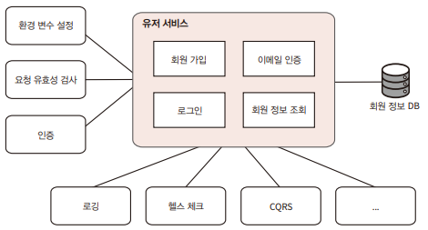

# Helo NestJS

## 1. NestJS의 장점

NestJS는 Node.js에 기반을 둔 웹 API 프레임워크로 Express 또는 Fastify 프레임워크를 래핑하여 동작한다.  
NestJS는 기본적으로 Express를 사용한다. Fastify가 Express보다 벤치마크 결과 2배 빠른 속도를 자랑하지만, Express가 가장 널리 사용되고 수 많은 미들웨어가 호환되어 기본으로 사용된다.  

NestJS는 백엔드 서버가 갖춰야 하는 많은 필수 기능을 프레임워크 내에 내장하고 있고, 필요한 기능을 추가로 설치하고 적용하기가 쉽다. DI, IoC를 채용하여 객체 지향 프로그래밍과 모듈화를 쉽게할 수 있다. 반면에, Express는 자유도가 높은 대신 모든 것을 npm에서 찾고 검토하는 과정이 필요하다.  
 - NestJS는 데이터베이스, 객체 관계 매핑(ORM), 설정, 유효성 검사 등 수많은 기능을 기본으로 제공한다.
 - 제어 반전(IoC), 의존성 주입(DI), 관점 지향 프로그래밍(AOP) 등 객체 지향 개념이 도입되었다.
 - 그 외 기능
    - 최신 ECMA 스크립트 지원
    - 타입스크립트
    - CQRS
    - HTTP 헤더 보안
    - 편리한 설정
    - 인터셉터
    - 다양한 미들웨어
    - 스케줄링
    - 로깅
    - 테스팅
    - 스웨거 문서화
    - ORM

<br/>

## 2. NestJS 설치

 - Node 설치: https://nodejs.org/ko/download
```bash
# 글로벌 패키지 설치 경로 확인
$ npm root -g

# NestJS CLI 설치
$ npm i -g @nestjs/cli

# NestJS 프로젝트 생성
$ nest new <project-name>

# 프로젝트 실행
cd hello-nest
npm run start:dev
```
<br/>

 - `main.ts`
    - 기본 생성시 3000번 포트로 접근이 가능하다.
```ts
import { NestFactory } from '@nestjs/core';
import { AppModule } from './app.module';

async function bootstrap() {
  const app = await NestFactory.create(AppModule);
  await app.listen(3000);
}
bootstrap();
```
<br/>

## 3. 만들 유저 서비스

<div align="center">
    
</div>
<br/>

 - __환경 변수 설정__
    - 서버는 여러 환경에서 실행된다.
    - 개발자의 로컬 개발 환경
    - 개발된 기능을 실제 사용자에게 배포하기 전에 테스트용 서버에 배포하는 스테이지 환경
    - 실제 운영하는 프로덕션 환경
    - 각 환경에서 사용되는 환경 변수를 구성한다.
 - __요청 유효성 검사__
    - 서버에서는 핵심 로직을 수행하기 전에, 값이 제대로 전달되었는지 판단하여 잘못 전달된 경우에 400 Bad Request 에러를 응답한다.
 - __인증__
    - 사용자의 리소스에 접근하기 위해서는 권한이 필요하고 로그인 과정을 거쳐야 한다.
    - JSON 웹 토큰(JWT)를 사용한다.
 - __로깅__
    - 서버를 운용하기 위해서는 로그를 잘 기록해야 한다.
    - 이슈가 발생했을 때 원인을 빠르고 정확하게 파악하는 데에 로그는 매우 유용하게 사용된다.
    - 사내 사용자가 무슨 동작을 수행했는지 감사 로그를 남겨 외부에 기록을 제출해야 하는 경우도 있다.
 - __헬스 체크__
    - 서버의 상태가 양호한지 주기적으로 검사한다.
    - 만약, 서버 상태가 좋지 않는 경우 경로를 울려서 개발자가 빠르게 대응할 수 있게 방안을 마련해야 한다.
 - __CQRS__
    - 복잡한 소프트웨어를 만들다 보면 소스 코드가 스파게티처럼 얽히게 되는 경우가 있다.
    - 데이터베이스에 변형을 가하는 명령과 데이터 읽기 요청을 처리하는 조회 로직을 분리함으로써 성능, 확장성, 보안을 강화할 수 있다.
 - __클린 아키텍처__
    - 육각형 아키텍처에서 발전한 클린 아키텍처는 SW의 계층을 분리하고 저수준의 계층이 고수준의 계층에 의존하도록 한다.
    - 의존의 방향이 바뀌는 경우가 있다면, 의존관계 역전 원칙(DIP)을 활용하여 안정적인 소프트웨어를 작성할 수 있어야 한다.
 - __단위 테스트__
    - 소프트웨어에 변경이 생긴다면 반드시 테스트를 해야 한다.
    - 단위 테스트는 유저의 입장에서 수행하는 테스트가 아닌 개발자가 테스트 코드를 이용하여 수행하는 최소 단위의 테스트 기법이다.
    - 만든 코드 조각이 동작하는 조건을 기술하고, 주어진 입력에 대해 원하는 결과가 나오는지 검사한다.

