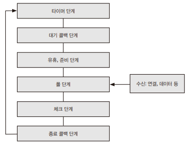

# 웹 개발 기초 지식

## 1. 웹 프레임워크

인터넷이 처음 세상에 등장했을 때는 정적인 이미지와 텍스트로만 이루어진 거대한 문서로 사용되었다. 하지만, 현재에는 전자 상거래, 금융 등 수많은 분야의 일을 처리할 수 있게 발전하였다. 시간이 지날수록 웹 기술은 고도의 복잡도를 띠며 발전했고 웹 앱을 만드는 데 필수인 기술들을 기존 방식으로 작성하기에는 너무 많은 노력과 시간이 필요하게 되었다. 자연스럽게 웹 개발에 필수적인 요소들을 묶어 개발자들이 쉽게 사용할 수 있도록 만드는 시도가 생겨나 웹 프레임워크가 생겨나게 되었다.  

웹 프레임워크는 데이터베이스 연결을 설정하고 데이터를 관리하거나, 세션을 맺고 유지하는 등의 동작을 정해진 방법과 추상화된 인터페이스로 제공한다.  

 - __React__
    - 싱글 페이지 애플리케이션(SPA)이나 모바일 앱 개발에 사용된다.
    - 최근 몇 년간 가장 인기 있는 프론트엔드 프레임워크
    - 가상의 문서 객체 모델(DOM)을 사용한다.
    - 메타가 주도하는 커뮤니티에서 유지 보수되고 있다.
 - __Vue.js__
    - 리액트와 함께 인기 있는 프론트엔드 프레임워크로 SPA를 구축할 수 있다.
    - 모델-뷰-뷰모델(MVVM) 패턴에서 뷰모델 레이어에 해당하는 라이브러리
    - 속도가 빠르다.
 - __Anguler__
    - SPA를 위한 프레임워크면서 SSR을 지원한다.
    - 모듈/컴포넌트 기반으로 작성하며 재사용성 높은 SW를 만들 수 있다.
    - 2021년에 LTS 지원이 중단되었다.
 - __Svelte__
    - 가상 DOM을 사용하지 않는다.
    - 적은 코드로 구현이 가능하고 유지 보수가 용이하다.
 - __Express__
    - Node.js 기반 백엔드 프레임워크
    - 가볍게 서버를 구동할 수 있다.
 - __Spring__
    - 국내에서 인기가 높은 자바 기반 프레임워크
    - 전자정부 프레임워크를 이용하는 프로젝트를 수행하기 위해서는 스프링을 알아야 하기 때문에 영향력이 크다.
    - IoC, DI, AOP 같은 객체 지향 프로그래밍 기법을 쉽게 적용할 수 있다.
 - __Django__
    - 파이썬 기반 웹 프레임워크 표준
    - MVC 패턴을 사용한다.
 - __Gin__
    - Go 언어 기반 웹 프레임워크
 - __Ruby on Rails__
    - 간결한 문법과 뛰어난 생산성으로 인기를 얻었다.
    - ActiveRecord를 이용하여 쿼리를 쉽게 다룰 수 있게 해준다.

 

웹 프레임워크를 선택할 때는 개발 문서, 사용자 수, 활성 커뮤니티 등을 고려해야 한다.  

 - __개발 문서__
    - 쉽게 이해할 수 있게 잘 쓰인 개발 문서는 사용자의 생산성을 올려준다.
 - __사용자 수__
    - 사용자 수가 많다는 것은 그만큼 안정적으로 운용된다는 반증이다.
    - 더불어 궁금한 점이 생겼을 때 개발자 커뮤니티에서 답을 쉽게 얻을 수도 있다.
 - __활성 커뮤니티__
    - 메타, 슬랙, 디스코드 같은 채널 외에도 질문/답변 서비스를 제공하는 스택 오버플로에서도 해당 기술을 키워드로 검색하면 얼마나 많은 사람이 활동하고 있는지 가늠할 수 있다.
 - __깃허브 스타 수와 이슈 대응__
    - 대부분 프레임워크는 오픈소스로 개발하며 소스 코드가 깃허브에 공개되어 있다.
    - 깃허브 스타 수는 그만큼 사람들이 인정하고 있다는 뜻이다.
    - 개발이 멈춘 프로젝트는 최신 언어 트렌드와 아키텍처를 따라잡지 못하고 있을 수 있다.

 

## 2. Node.js

Node.js는 2009년에 릴리스되었으며, Node.js의 등장으로 자바스크립트를 이용하여 서버를 구동할 수 있게 되었다. Node.js는 npm이라는 패키지 관리 시스템을 가지고 있으며, 누구나 자신이 만든 Node.js 기반 라이브러리를 등록하여 다른 사람들에게 공개가 가능하다. 2022년에 등록된 패키지는 190만 개에 다다른다.  

Node.js는 하나의 쓰레드에서 작업을 처리한다. 애플리케이션 단에서는 단일 쓰레드이지만 백그라운드에서는 쓰레드 풀을 구성해 작업을 처리한다. 즉, 개발자 대신 플랫폼이 쓰레드 풀을 관리하여 개발자는 단일 쓰레드에서 동작하는 것처럼 이해하기 쉬운 코드를 작성할 수 있다. Node.js는 이렇게 들어온 작업을 앞의 작업이 끝날 때까지 기다리지 않고 비동기로 처리한다. 입력은 하나의 쓰레드에서 받지만 순서대로 처리하지 않고 먼저 처리된 결과를 이벤트로 반환해주는 방식이 바로 Node.js가 사용하는 단일 쓰레드 논블로킹 이벤트 기반 비동기 방식이다.  

단일 쓰레드 이벤트 기반 비동기 방식은 서버 자원에 크게 부하를 가하지 않는다. 이는 대규모 네트워크 애플리케이션을 개발하기에 적합하다. 하지만, 쓰레드를 하나만 사용하기 때문에 하나의 쓰레드에 문제가 생기면 애플리케이션 전체가 오류를 일으킬 위험이 있다.  

 

## 3. 이벤트 루프

이벤트 루프는 시스템 커널에서 가능한 작업이 있다면 그 작업을 커널에 이관한다. 자바스크립트가 단일 쓰레드 기반에도 Node.js가 논블로킹 I/O 작업을 수행할 수 있도록 해주는 핵심 기능이다.  
이벤트 루프는 6개의 단계가 있다. 각 단계는 단계마다 처리해야 하는 콜백 함수를 담기 위한 큐를 가지고 있다.  

    

 

### 3-1. 타이머 단계

이벤트 루프는 타이머 단계에서 시작한다.  
타이머 단계의 큐에는 setTimeout이나 setInterval과 같은 함수를 통해 만들어진 타이머들을 큐에 넣고 실행한다.

 

### 3-2. 대기 콜백 단계

대기 단계의 큐에 들어있는 콜백들은 현재 돌고 있는 루프 이전의 작업에서 큐에 들어온 콜백이다.  
예를 들어, TCP 핸들러 내에서 비동기의 쓰기 작업을 한다면, TCP 통신과 쓰기 작업이 끝난 후 해당 작업의 콜백이 큐에 들어온다. 또, 에러 핸들러 콜백도 pending_queue에 들어오게 된다.  

타이머 단계를 거쳐 대기 콜백 단계에 들어오면, 이전 작업들의 콜백이 pending_queue에서 대기 중인지 검사한다. 만약, 실행 대기 중이라면 시스템 실행 한도에 도달할 떄까지 꺼내어 실행한다.  

 

### 3-3. 유휴, 준비 단계

유휴 단계는 틱(Tick)마다 실행된다. 준비 단계는 매 폴링 직전에 실행된다.  

 

### 3-4. 폴 단계

폴 단계에서는 새로운 I/O 이벤트를 가져와서 관련 콜백을 수행한다.  
예를 들어, 소켓 연결과 같은 새로운 커넥션을 맺거나 파일 읽기와 같이 데이터 처리를 받아들이게 된다.  
이 단계가 가지고 있는 큐는 watch_queue이다. 이 단계에 진입한 후 watch_queue가 비어 있지 않다면 큐가 비거나 시스템 실행 한도에 다다를 떄까지 동기적으로 모든 콜백을 실행한다. 만약, 큐가 비게 되면 Node.js는 곧바로 다음 단계로 이동하지 않고 check_queue, pending_queue, closing_callbacks_queue에 남은 작업이 있는지 검사한 다음 작업이 있다면 다음 단계로 이동한다.  

 

### 3-5. 체크 단계

체크 단계는 setImmediate의 콜백만을 위한 단계로, 큐가 비거나 시스템 실행 한도에 도달할 떄까지 콜백을 수행한다.  

 

### 3-6. 종료 콜백 단계

종료 콜백 단계에서는 socket.on('close', () => {})과 같은 close나 destrory 이벤트 타입의 콜백이 처리된다.  
이벤트 루프는 종료 콜백 단계를 마치고 나면 다음 루프에서 처리해야 하는 작업이 남아 있는지 검사한다. 만약, 작업이 남아 있다면 타이머 단계부터 한 번 더 루프를 돌게 되고, 아니라면 루프를 종료한다.  
