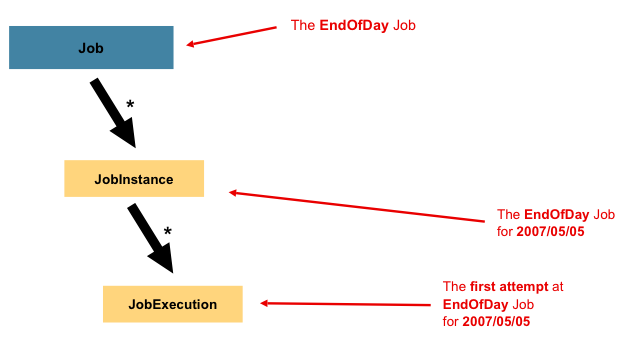

# 스프링 배치 도메인 용어

 - 공식 문서: https://docs.spring.io/spring-batch/docs/current/reference/html/domain.html#domainLanguageOfBatch
 - Job
    - JobInstance
    - JobParameters
    - JobExecution
 - Step
    - StepExecution
 - ExecutionContext
 - JobRepository
 - JobLauncher
 - ItemReader
 - ItemProcessor
 - ItemWriter

<br/>

## 요약

Job은 하나의 배치 처리 작업을 의미한다.  
Job을 실행하면 JobInstance를 얻게되고, 동일한 Job을 재실행하면 기존에 만들어진 JobInstance를 이용한다.  
Job을 구동할 때마다 매번 새로운 JobExecution을 얻게 된다.  
JobInstance를 구별하기 위해서는 JobParameters가 이용된다. 즉, 파라미터를 통해 새로운 Job을 구분한다.  
 - JobExecution 속성
   - Status: 실행 상태(STARTED: 실행중, FAILED: 실패, COMPLETED: 성공)
   - startTime: 실행 시간
   - endTime: 종료 시간(성공 여부에 관계없이 종료된 시간)
   - exitStatus: 실행 결과
   - createTime: 생성 시간
   - lastUpdated: 마지막 작업 시간
   - executionContext: 실행시 유지되어야 하는 데이터 보관 객체
   - failureExceptions: 실행 동안 발생한 예외 목록

<div align="center">
   
</div>
<br/>

Step은 일괄 작업의 독립적인 순차적 단계를 의미한다.  
Step은 Tasklet 기반과 Chunk 기반 2가지 유형이 있으며, Chunk 기반의 경우 ItemReader, ItemProcessor, ItemWriter로 구성된다.  
Step을 구동할 때마다 매번 새로운 StepExecution을 얻게 된다.  
 - StepExecution 속성
   - Status: 실행 상태(STARTED: 실행중, FAILED: 실패, COMPLETED: 성공)
   - startTime: 실행 시간
   - endTime: 종료 시간(성공 여부에 관계없이 종료된 시간)
   - executionContext: 실행시 유지되어야 하는 데이터 보관 객체
   - readCount: 성공적으로 읽은 항목 수
   - writeCount: 성공적으로 작성된 항목 수
   - commitCount: 커밋된 트랜잭션 수
   - rollbackCount: Step에서 제어하는 ​​비즈니스 트랜잭션이 롤백된 횟수
   - readSkipCount: read에 실패하여 건너뛴 항목 수
   - processSkipCount: process에 실패하여 건너뛴 항목 수
   - filterCount: ItemProcessor에 필터링된 항목 수
   - writeSkipCount: write에 실패하여 건너뛴 항목 수

<div align="center">
   
</div>

<br/>

## Job

 - `Job`

Job은 배치처리 과정을 하나의 단위로 만들어 놓은 객체입니다. 또한 배치처리 과정에 있어 전체 계층 최상단에 위치하고 있습니다.  

 - `JobInstance`

JobInstance는 Job의 실행의 단위를 나타냅니다. Job을 실행시키게 되면 하나의 JobInstance가 생성되게 됩니다. 예를들어 1월 1일 실행, 1월 2일 실행을 하게 되면 각각의 JobInstance가 생성되며 1월 1일 실행한 JobInstance가 실패하여 다시 실행을 시키더라도 이 JobInstance는 1월 1일에 대한 데이터만 처리하게 됩니다.  

 - `JobParameters`

JobParameters는 일괄 작업을 시작하는데 사용되는 매개변수 집합을 보유합니다. 즉, JobInstance에 전달되는 매개변수 역할을 하며 String, Double, Long, Date 4가지 형식만을 지원하고 있습니다.  
또한, JobParameter로 Job의 실행 단위인 JobInstance를 구별하는 역할도 합니다.  

 - `JobExecution`

JobExecution은 JobInstance에 대한 실행 시도에 대한 객체입니다. 1월 1일에 실행한 JobInstacne가 실패하여 재실행을 하여도 동일한 JobInstance를 실행시키지만 이 2번에 실행에 대한 JobExecution은 개별로 생기게 됩니다. JobExecution는 이러한 JobInstance 실행에 대한 상태, 시작시간, 종료시간, 생성시간 등의 정보를 담고 있습니다.  

__잡을 구동할 때마다 매번 새로운 JobExecution을 얻게 된다.__

```Java
@Bean
public Job footballJob(JobRepository jobRepository) {
    return new JobBuilder("footballJob", jobRepository)
                     .start(playerLoad())
                     .next(gameLoad())
                     .next(playerSummarization())
                     .build();
}
```

<br/>

## Step

 - `Step`

Step은 Job의 배치처리를 정의하고 순차적인 단계를 캡슐화 합니다. Job은 최소한 1개 이상의 Step을 가져야 하며 Job의 실제 일괄 처리를 제어하는 모든 정보가 들어있습니다.  

 - `StepExecution`

StepExecution은 JobExecution과 동일하게 Step 실행 시도에 대한 객체를 나타냅니다. 하지만 Job이 여러개의 Step으로 구성되어 있을 경우 이전 단계의 Step이 실패하게 되면 다음 단계가 실행되지 않음으로 실패 이후 StepExecution은 생성되지 않습니다. StepExecution 또한 JobExecution과 동일하게 실제 시작이 될 때만 생성됩니다. StepExecution에는 JobExecution에 저장되는 정보 외에 read 수, write 수, commit 수, skip 수 등의 정보들도 저장이 됩니다.  

<br/>

## ExecutionContext

ExecutionContext란 Job에서 데이터를 공유 할 수 있는 데이터 저장소입니다. Spring Batch에서 제공하느 ExecutionContext는 JobExecutionContext, StepExecutionContext 2가지 종류가 있으나 이 두가지는 지정되는 범위가 다릅니다. JobExecutionContext의 경우 Commit 시점에 저장되는 반면 StepExecutionContext는 실행 사이에 저장이 되게 됩니다. ExecutionContext를 통해 Step간 Data 공유가 가능하며 Job 실패시 ExecutionContext를 통한 마지막 실행 값을 재구성 할 수 있습니다.  
 - JobExecutionContext: Job 실행간에 유지되어야 하는 데이터를 보관한다.
 - StepExecutionContext: Step 실행간에 유지되어야 하는 데이터를 보관한다.

<br/>

## JobRepository

JobRepository는 위에서 말한 모든 배치 처리 정보를 담고있는 매커니즘입니다. Job이 실행되게 되면 JobRepository에 JobExecution과 StepExecution을 생성하게 되며 JobRepository에서 Execution 정보들을 저장하고 조회하며 사용하게 됩니다.  

<br/>

## JobLauncher

JobLauncher는 Job과 JobParameters를 사용하여 Job을 실행하는 객체입니다.  

```Java
public interface JobLauncher {

public JobExecution run(Job job, JobParameters jobParameters)
            throws JobExecutionAlreadyRunningException, JobRestartException,
                   JobInstanceAlreadyCompleteException, JobParametersInvalidException;
}
```

<br/>

## ItemReader
ItemReader는 Step에서 Item을 읽어오는 인터페이스입니다. ItemReader에 대한 다양한 인터페이스가 존재하며 다양한 방법으로 Item을 읽어 올 수 있습니다.  

<br/>

## ItemWriter
ItemWriter는 처리 된 Data를 Writer 할 때 사용한다. Writer는 처리 결과물에 따라 Insert가 될 수도 Update가 될 수도 Queue를 사용한다면 Send가 될 수도 있다. Writer 또한 Read와 동일하게 다양한 인터페이스가 존재한다. Writer는 기본적으로 Item을 Chunk로 묶어 처리하고 있습니다.  

<br/>

## ItemProcessor
Item Processor는 Reader에서 읽어온 Item을 데이터를 처리하는 역할을 하고 있다. Processor는 배치를 처리하는데 필수 요소는 아니며 Reader, Writer, Processor 처리를 분리하여 각각의 역할을 명확하게 구분하고 있습니다.  

