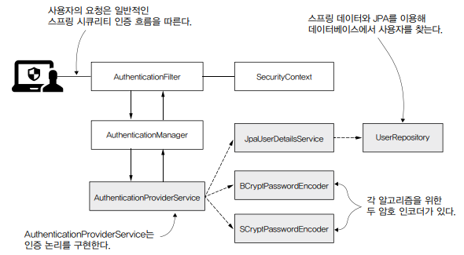

# 6장. 실전: 작고 안전한 웹 애플리케이션

애플리케이션의 제품 정보와 사용자는 데이터베이스에 저장되고 각 사용자의 암호는 bcrypt나 scrypt로 해시된다.  
AuthenticationFiler는 요청을 가로채서 인증 책임을 AuthenticationManager에 위임하며 AuthenticationManager는 AuthenticationProvider를 이용해 요청을 인증한다. 여기서 반환된 성공한 인증 호출의 세부 정보는 AuthenticationFilter에 의해 SecurityContext에 저장된다.  

AuthenticationProvider를 구현하는 AuthenticationProviderService 클래스를 만들고, 이 구현은 UserDetailsService를 호출해 데이터베이스에서 사용자 세부 정보를 찾고 PasswordEncoder를 호출해 암호를 검증하는 인증 논리를 정의한다. 스프링 데이터 JPA를 이용해 데이터베이스 작업을하는 JpaUserDetailsService를 만들고, 이는 스프링 데이터 JpaRepository에 의존하며 UserRepository로 이름짓는다.  

<div align="center">
    
</div>

<br/>

## 소스 코드

### 1. 프로젝트 설정

 - pom.xml
    - spring-boot-starter-data-jpa: 스프링 데이터를 이용해 데이터베이스 연결
    - spring-boot-starter-security: 스프링 시큐리티 종속성
    - spring-boot-starter-thymeleaf: 웹 페이지의 정의를 간소화하는 템플릿 엔진
    - spring-boot-starter-web: 표준 웹 종속성
    - mysql-connector-java: MySQL JDBC 드라이버
```XML
    <dependencies>
        <dependency>
            <groupId>org.springframework.boot</groupId>
            <artifactId>spring-boot-starter-data-jpa</artifactId>
        </dependency>
        <dependency>
            <groupId>org.springframework.boot</groupId>
            <artifactId>spring-boot-starter-security</artifactId>
        </dependency>
        <dependency>
            <groupId>org.springframework.boot</groupId>
            <artifactId>spring-boot-starter-thymeleaf</artifactId>
        </dependency>
        <dependency>
            <groupId>org.springframework.boot</groupId>
            <artifactId>spring-boot-starter-web</artifactId>
        </dependency>

        <dependency>
            <groupId>mysql</groupId>
            <artifactId>mysql-connector-java</artifactId>
            <scope>runtime</scope>
        </dependency>
        ..
    </dependencies>
```

 - application.properties
```Properties
spring.datasource.url=jdbc:mysql://localhost/spring?useLegacyDatetimeCode=false&serverTimezone=UTC
spring.datasource.username=root
spring.datasource.password=
spring.datasource.initialization-mode=always
```

<br/>

### 2. 데이터베이스 설정

스프링 부트가 스크립트를 실행해 데이터베이스 구조를 생성하고 데이터를 추가하도록 한다.  

 - schema.sql
    - 데이터베이스의 구조를 만들고 변경하는 쿼리
```SQL
CREATE TABLE IF NOT EXISTS `spring`.`user` (
  `id` INT NOT NULL AUTO_INCREMENT,
  `username` VARCHAR(45) NOT NULL,
  `password` TEXT NOT NULL,
  `algorithm` VARCHAR(45) NOT NULL,
  PRIMARY KEY (`id`));

CREATE TABLE IF NOT EXISTS `spring`.`authority` (
  `id` INT NOT NULL AUTO_INCREMENT,
  `name` VARCHAR(45) NOT NULL,
  `user` INT NOT NULL,
  PRIMARY KEY (`id`));

CREATE TABLE IF NOT EXISTS `spring`.`product` (
  `id` INT NOT NULL AUTO_INCREMENT,
  `name` VARCHAR(45) NOT NULL,
  `price` VARCHAR(45) NOT NULL,
  `currency` VARCHAR(45) NOT NULL,
  PRIMARY KEY (`id`));
```

 - data.sql
    - 데이터를 처리하는 쿼리
    - User의 원시 암호는 12345이고, bcrypt로 해시된다.
```SQL
INSERT IGNORE INTO `spring`.`user` (`id`, `username`, `password`, `algorithm`) VALUES ('1', 'john', '$2a$10$xn3LI/AjqicFYZFruSwve.681477XaVNaUQbr1gioaWPn4t1KsnmG', 'BCRYPT');

INSERT IGNORE INTO `spring`.`authority` (`id`, `name`, `user`) VALUES ('1', 'READ', '1');
INSERT IGNORE INTO `spring`.`authority` (`id`, `name`, `user`) VALUES ('2', 'WRITE', '1');

INSERT IGNORE INTO `spring`.`product` (`id`, `name`, `price`, `currency`) VALUES ('1', 'Chocolate', '10', 'USD');
```

<br/>

### 3. 엔티티 클래스 정의

 - Enum(Current, EncryptionAlgorithm)
    - EncryptionAlgorithm: 요청에 지정된 두 지원되는 해싱 알고리즘 정의
```Java
public enum Currency {
    USD, GBP, EUR
}

public enum EncryptionAlgorithm {
    BCRYPT, SCRYPT
}
```

 - Entity(Authority, Product)
```Java
@Getter
@Setter
@Entity
public class Authority {

    @Id
    @GeneratedValue(strategy = GenerationType.IDENTITY)
    private Integer id;

    private String name;

    @JoinColumn(name = "user")
    @ManyToOne
    private User user;
}

@Getter
@Setter
@Entity
public class Product {

    @Id
    @GeneratedValue(strategy = GenerationType.IDENTITY)
    private Integer id;

    private String name;
    private double price;

    @Enumerated(EnumType.STRING)
    private Currency currency;
}

@Getter
@Setter
@Entity
public class User {

    @Id
    @GeneratedValue(strategy = GenerationType.IDENTITY)
    private Integer id;

    private String username;
    private String password;

    @Enumerated(EnumType.STRING)
    private EncryptionAlgorithm algorithm;

    @OneToMany(mappedBy = "user", fetch = FetchType.EAGER)
    private List<Authority> authorities;
}
```

### 4. Repository

 - UserRepository
```Java
public interface UserRepository extends JpaRepository<User, Integer> {
    Optional<User> findUserByUsername(String username);
}
```

 - ProductRepository
```Java
public interface ProductRepository extends JpaRepository<Product, Integer> {
}
```

### 5. Service

 - AuthenticationProviderService
    - 맞춤형 인증 논리를 구현하기 위해서는 AuthenticationProvider를 구현하고, 스프링 시큐리티 인증 아키텍처에 등록해야 한다.
    - 인증 논리를 작성하려면 종속성으로 UserDetailService 구현과 두 개의 암호 인코더가 필요하고 이들을 자동 연결하는 것 외에도 authenticate() 및 support() 메서드를 재정의해야 한다.
    - UsernamePasswordAuthenticationToken은 Authentication 인터페이스의 구현체 중 하나이다.
```Java
@Service
public class AuthenticationProviderService implements AuthenticationProvider {

    @Autowired
    private JpaUserDetailsService userDetailsService;

    @Autowired
    private BCryptPasswordEncoder bCryptPasswordEncoder;

    @Autowired
    private SCryptPasswordEncoder sCryptPasswordEncoder;

    @Override
    public Authentication authenticate(Authentication authentication) throws AuthenticationException {
        String username = authentication.getName();
        String password = authentication.getCredentials().toString();

        // UserDetailsService로 데이터베이스에서 사용자 세부 정보 검색
        CustomUserDetails user = userDetailsService.loadUserByUsername(username);

        // 해당 사용자에 맞는 해싱 알고리즘으로 암호 검증
        switch (user.getUser().getAlgorithm()) {
            case BCRYPT:
                // 사용자의 암호가 bcrypt로 해시됐으면 BCryptPasswordEncoder로 암호 검증
                return checkPassword(user, password, bCryptPasswordEncoder);
            case SCRYPT:
                // 사용자의 암호가 scrypt로 해시됐으면 SCryptPasswordEncoder 암호 검증
                return checkPassword(user, password, sCryptPasswordEncoder);
        }

        throw new  BadCredentialsException("Bad credentials");
    }

    @Override
    public boolean supports(Class<?> aClass) {
        return UsernamePasswordAuthenticationToken.class.isAssignableFrom(aClass);
    }

    private Authentication checkPassword(CustomUserDetails user, String rawPassword, PasswordEncoder encoder) {
        if (encoder.matches(rawPassword, user.getPassword())) {
            return new UsernamePasswordAuthenticationToken(user.getUsername(), user.getPassword(), user.getAuthorities());
        } else {
            throw new BadCredentialsException("Bad credentials");
        }
    }
}
```

 - JpaUserDetailsService
    - UserDetailsService 인터페이스를 상속받고 구현한다.
    - 데이터베이스에서 사용자를 못 찾으면 UsernameNotFoundException 예외를 발생시킨다.
```Java
@Service
public class JpaUserDetailsService implements UserDetailsService {

    @Autowired
    private UserRepository userRepository;

    @Override
    public CustomUserDetails loadUserByUsername(String username) {
        // 예외 인스턴스를 만들기 위한 공급자 선언
        Supplier<UsernameNotFoundException> s =
                () -> new UsernameNotFoundException("Problem during authentication!");

        // 데이터베이스에 접근하여 사용자 조회
        User u = userRepository.findUserByUsername(username).orElseThrow(s);

        // User 인스턴스를 CustomUserDetails 데코레이터로 래핑하고 반환
        return new CustomUserDetails(u);
    }
}
```

 - ProductService
    - 제품 목록을 조회한다.
```Java
@Service
public class ProductService {

    @Autowired
    private ProductRepository productRepository;

    public List<Product> findAll() {
        return productRepository.findAll();
    }
}
```

### 6. 사용자 관리 구현

 - ProjectConfig
```Java
@Configuration
public class ProjectConfig extends WebSecurityConfigurerAdapter {

    @Autowired
    private AuthenticationProviderService authenticationProvider;

    @Bean
    public BCryptPasswordEncoder bCryptPasswordEncoder() {
        return new BCryptPasswordEncoder();
    }

    @Bean
    public SCryptPasswordEncoder sCryptPasswordEncoder() {
        return new SCryptPasswordEncoder();
    }

    // configure() 메서드를 재정의해 스프링 시큐리티를 위한 인증 공급자 등록
    @Override
    protected void configure(AuthenticationManagerBuilder auth) {
        auth.authenticationProvider(authenticationProvider);
    }

    @Override
    protected void configure(HttpSecurity http) throws Exception {
        http.formLogin()
            .defaultSuccessUrl("/main", true);

        http.authorizeRequests().anyRequest().authenticated();
    }
}
```

 - CustomUserDetails
    - UserDetails 인터페이스를 구현한다.
```Java
public class CustomUserDetails implements UserDetails {

    private final User user;

    public CustomUserDetails(User user) {
        this.user = user;
    }

    @Override
    public Collection<? extends GrantedAuthority> getAuthorities() {
        return user.getAuthorities().stream()
                   .map(a -> new SimpleGrantedAuthority(a.getName()))
                   .collect(Collectors.toList());
    }

    @Override
    public String getPassword() {
        return user.getPassword();
    }

    @Override
    public String getUsername() {
        return user.getUsername();
    }

    @Override
    public boolean isAccountNonExpired() {
        return true;
    }

    @Override
    public boolean isAccountNonLocked() {
        return true;
    }

    @Override
    public boolean isCredentialsNonExpired() {
        return true;
    }

    @Override
    public boolean isEnabled() {
        return true;
    }

    public final User getUser() {
        return user;
    }
}
```

### 7. 컨트롤러

 - MainPageController
```Java
@Controller
public class MainPageController {

    @Autowired
    private ProductService productService;

    @GetMapping("/main")
    public String main(Authentication a, Model model) {
        model.addAttribute("username", a.getName());
        model.addAttribute("products", productService.findAll());
        return "main.html";
    }
}
```

 - templates/main.html
```HTML
<!DOCTYPE html>
<html lang="en" xmlns:th="http://www.thymeleaf.org">
    <head>
        <meta charset="UTF-8">
        <title>Products</title>
    </head>
    <body>
        <h2 th:text="'Hello, ' + ${username} + '!'" />
        <p><a href="/logout">Sign out here</a></p>

        <h2>These are all the products:</h2>
        <table>
            <thead>
            <tr>
                <th> Name </th>
                <th> Price </th>
            </tr>
            </thead>
            <tbody>
            <tr th:if="${products.empty}">
                <td colspan="2"> No Products Available </td>
            </tr>
            <tr th:each="book : ${products}">
                <td><span th:text="${book.name}"> Name </span></td>
                <td><span th:text="${book.price}"> Price </span></td>
            </tr>
            </tbody>
        </table>
    </body>
</html>
```

