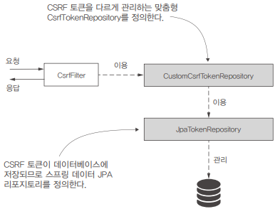

# 10장. CSRF 보호와 CORS 적용

## 애플리케이션에 CSRF(사이트 간 요청 위조) 보호 적용

CSRF는 광범위한 공격 유형이며 CSRF에 취약한 애플리케이션은 인증 후 사용자가 웹 애플리케이션에서 원치 않는 작업을 실행하게 할 수 있다.  

업무 환경에서 웹 툴을 이용해 파일을 저장하고 관리하는 시나리오를 예를 들면, 해당 툴의 웹 인터페이스로 새 파일을 추가하고 레코드의 새 버전을 추가 및 삭제할 수 있다.  
어떤 이유로 페이지 하나를 열어보라는 이메일을 받고, 페이지를 열어봤지만 빈 페이지로 알려진 웹사이트로 리다이렉션이 된다.  
이때, 사용자는 파일을 관리할 수 있게 애플리케이션에 로그인한 상태다. 파일을 추가, 변경, 삭제할 때 상호 작용하는 웹 페이지는 이러한 작업을 실행하기 위해 서버의 일부 엔드포인트를 호출한다.  
이메일의 알 수 없는 링크를 클릭하여 외부 페이지를 열면 이 페이지가 서버를 호출하고 사용자 대신 작업을 실행한다.  
이런 일이 가능한 이유는 사용자가 로그인했으므로 서버가 사용자로부터 전달된 작업을 신뢰하기 때문이다.  
다른 사람을 속여 외부 이메일이나 메시지의 링크를 클릭하도록 유도하고, 사용자는 공격자에게 속아서 작업 중인 같은 애플리케이션에서 작업을 실행하는 스크립트가 포함된 페이지를 연다.  

데이터를 변경하는 작업을 수행하려면 먼저 사용자가 적어도 한 번은 HTTP GET으로 웹 페이지를 요청해야 한다. 이때, 애플리케이션은 고유한 토큰을 생성한다. 애플리케이션은 헤더에 이 고유한 값이 들어 있는 요청에 대해서만 변경 작업(POST, PUT, DELETE 등)을 수행한다. 애플리케이션은 토큰의 값을 안다는 것은 다른 시스템이 아닌 애플리케이션 자체가 변경 요청을 보낸 증거라고 본다.  

CSRF 보호의 시작점은 필터 체인의 CsrfFilter라는 필터이다. CsrfFilter는 요청을 가로채고 GET, HEAD, TRACE, OPTIONS를 포함하는 HTTP 방식의 요청을 모두 허용하고 다른 모든 요청에는 토큰이 포함된 헤더가 있는지 확인한다. 이 헤더가 없거나 헤더에 잘못된 토큰 값이 포함된 경우 애플리케이션은 요청을 거부하고 응답의 상태를 '403 금지됨'으로 설정한다.  
CsrfFilter는 CsrfTokenRepository 구성 요소를 이용해 새 토큰 생성, 토큰 저장, 토큰 검증에 필요한 CSRF 토큰 값을 관리한다. 기본적으로 CsrfTokenRepository는 토큰을 HTTP 세션에 저장하고 랜덤 UUID로 토큰을 생성한다.

 - CsrfTokenLogger
    - _csrf 요청 특성에서 CSRF 토큰의 값을 얻고 콘솔에 출력한다. CsrfFilter는 생성된 CSRF 토큰의 값을 CsrfToken 클래스의 인스턴스로서 요청 특성 _csrf에 저장한다. CsrfToken 인스턴스에는 CSRF 토큰의 문자열 값이 들어 있으며 getToken() 메서드를 호출하면 이 값을 얻을 수 있다.
```Java
public class CsrfTokenLogger implements Filter {

    private Logger logger =
            Logger.getLogger(CsrfTokenLogger.class.getName());

    @Override
    public void doFilter(ServletRequest request, ServletResponse response, FilterChain filterChain) throws IOException, ServletException {
        Object o = request.getAttribute("_csrf");
        CsrfToken token = (CsrfToken) o;
        logger.info("CSRF token " + token.getToken());

        filterChain.doFilter(request, response);
    }
}
```

 - ProjectConfig
```Java
@Configuration
public class ProjectConfig extends WebSecurityConfigurerAdapter {

    @Override
    protected void configure(HttpSecurity http) throws Exception {
        http.addFilterAfter(new CsrfTokenLogger(), CsrfFilter.class)
            .authorizeRequests()
                .anyRequest().permitAll();
    }
}
```

<br/>

## 실제 시나리오에서 CSRF 보호 사용

 - ProjectConfig
```Java
@Configuration
public class ProjectConfig extends WebSecurityConfigurerAdapter {

    // UserDetailsService를 정의하고 사용자 하나를 추가한다.
    @Bean
    public UserDetailsService uds() {
        var uds = new InMemoryUserDetailsManager();

        var u1 = User.withUsername("mary")
                .password("12345")
                .authorities("READ")
                .build();

        uds.createUser(u1);

        return uds;
    }

    @Bean
    public PasswordEncoder passwordEncoder() {
        return NoOpPasswordEncoder.getInstance();
    }

    @Override
    protected void configure(HttpSecurity http) throws Exception {
        // 인증된 사용자만 엔드포인트에 접근할 수 있게 한다.
        http.authorizeRequests()
                .anyRequest().authenticated();

        // 양식 로그인 인증 방식을 설정한다.
        http.formLogin()
            .defaultSuccessUrl("/main", true);
    }
}
```

 - Controller
```Java
// MainController
@Controller
public class MainController {

    @GetMapping("/main")
    public String main() {
        return "main.html";
    }

}

// ProductController
@Controller
@RequestMapping("/product")
public class ProductController {

    private Logger logger =
            Logger.getLogger(ProductController.class.getName());

    @PostMapping("/add")
    public String add(@RequestParam String name) {
        logger.info("Adding product " + name);
        return "main.html";
    }
}
```

 - main.html
```HTML
<!DOCTYPE HTML>
<html lang="en" xmlns:th="http://www.thymeleaf.org">
    <head>
    </head>
    <body>
        <form action="/product/add" method="post">
            <span>Name:</span>
            <span><input type="text" name="name" /></span>
            <span><button type="submit">Add</button></span>
            <input type="hidden"
                    th:name="${_csrf.parameterName}"
                    th:value="${_csrf.token}" />
        </form>
    </body>
</html>
```

<br/>

## CSRF 보호 맞춤 구성

CSRF 보호는 서버에서 생성된 리소스를 이용하는 페이지가 같은 서버에서 생성된 경우에만 이용한다.  
기본적으로 CSRF 보호는 GET, HEAD, TRACE, OPTIONS 외의 HTTP 방식으로 호출되는 엔드포인트의 모든 경로에 적용된다.  

 - ProjectConfig
```Java
@Configuration
public class ProjectConfig extends WebSecurityConfigurerAdapter {

    @Bean
    public CsrfTokenRepository customTokenRepository() {
        return new CustomCsrfTokenRepository();
    }

    @Override
    protected void configure(HttpSecurity http) throws Exception {
        http.csrf(c -> { // 람다식의 매개 변수는 CsrfConfigurer로 다양한 방식으로 CSRF 보호를 구성할 수 있다.
            c.csrfTokenRepository(customTokenRepository());

            // 1. CSRF 보호 메커니즘에서 제외할 경로 지정 (앤트식)
            c.ignoringAntMatchers("/ciao");

            // 2. MVC 매처로 제외 규칙 적용
            // HandlerMappingIntrospector i = new HandlerMappingIntrospector();
            // MvcRequestMatcher r = new MvcRequestMatcher(i, "/ciao");
            // c.ignoringRequestMatchers(r);

            // 3. 정규식으로 제외 규칙 적용
            // String pattern = ".*[0-9].*";
            // String httpMethod = HttpMethod.POST.name();
            // RegexRequestMatcher r = new RegexRequestMatcher(pattern, httpMethod);
            // c.ignoringRequestMatchers(r);
        });

        http.authorizeRequests()
             .anyRequest().permitAll();
    }
}
```

<br/>

애플리케이션에서 CSRF 토큰을 관리하는 방식을 맞춤 구성해야 하는 경우가 있다.  
기본적으로 애플리케이션은 서버 쪽의 HTTP 세션에 CSRF 토큰을 저장한다.  
소규모 애플리케이션에 적합하지만 많은 요청을 처리하고 수평적 확장이 필요한 애플리케이션에는 적합하지 않다.  
때문에, 애플리케이션이 HTTP 세션이 아닌 데이터베이스에 저장하도록 토큰을 관리하는 방법을 변경해야 한다.  
 - CsrfToken: CSRF 토큰 자체를 기술한다.
    - 요청에서 CSRF 토큰의 값을 포함하는 헤더의 이름(기본 이름은 X-CSRF-TOKEN)
    - 토큰의 값을 저장하는 요청의 특성 이름(기본 이름은 _csrf)
    - 토큰의 값
 - CsrfTokenRepository: CSRF 토큰을 생성, 저장, 로드하는 객체를 기술한다.
    - CsrfTokenRepository는 스프링 시큐리티에서 CSRF 토큰을 관리하는 책임을 맡는다.

```Java
public interface CsrfToken extends Serializable {
    String getHeaderName();
    String getParameterName();
    String getToken();
}
```

<div align="center">
    
</div>

<br/>

 - application.properties
```Properties
spring.datasource.url=jdbc:mysql://localhost/spring?useLegacyDatetimeCode=false&serverTimezone=UTC
spring.datasource.username=root
spring.datasource.password=
spring.datasource.initialization-mode=always
```

 - schema.sql
```SQL
CREATE TABLE IF NOT EXISTS `spring`.`token` (
    `id` INT NOT NULL AUTO_INCREMENT,
    `identifier` VARCHAR(45) NULL,
    `token` TEXT NULL,
PRIMARY KEY (`id`));
```

 - Token
```Java
@Getter
@Setter
@Entity
public class Token {

    @Id
    @GeneratedValue(strategy = GenerationType.IDENTITY)
    private int id;

    private String identifier; // 클라이언트의 식별자
    private String token; // 애플리케이션이 클라이언트를 위해 생성한 CSRF 토큰
}
```

 - JpaTokenRepository
```Java
public interface JpaTokenRepository extends JpaRepository<Token, Integer> {

    Optional<Token> findTokenByIdentifier(String identifier);
}
```

 - CustomCsrfTokenRepository
    - saveToken(CsrfToken token, HttpServletRequest request, HttpServletResponse response): 이 메서드는 새로운 CSRF 토큰을 저장하고, 이를 클라이언트에게 전달할 수 있도록 응답 헤더 또는 쿠키를 설정합니다.
    - loadToken(HttpServletRequest request): 이 메서드는 요청에서 CSRF 토큰을 검색하여 반환합니다.
    - generateToken(HttpServletRequest request): 이 메서드는 새로운 CSRF 토큰을 생성합니다. 이는 사용자 세션과 관련이 있으며, 새로운 세션을 시작할 때마다 새로운 토큰을 생성하게 됩니다.
```Java
public class CustomCsrfTokenRepository implements CsrfTokenRepository {

    @Autowired
    private JpaTokenRepository jpaTokenRepository;

    @Override
    public CsrfToken generateToken(HttpServletRequest httpServletRequest) {
        String uuid = UUID.randomUUID().toString();
        return new DefaultCsrfToken("X-CSRF-TOKEN", "_csrf", uuid);
    }

    // 새로운 CSRF 토큰을 저장하고, 클라이언트에게 전달할 수 있도록 응답 헤더나 쿠키에 설정한다.
    @Override
    public void saveToken(CsrfToken csrfToken, HttpServletRequest httpServletRequest, HttpServletResponse httpServletResponse) {
        String identifier = httpServletRequest.getHeader("X-IDENTIFIER");
        // 클라이언트 ID로 데이터베이스에서 토큰을 얻음
        Optional<Token> existingToken = jpaTokenRepository.findTokenByIdentifier(identifier);

        if (existingToken.isPresent()) {
            // ID가 존재하면 새로 생성된 값으로 토큰의 값을 업데이트
            Token token = existingToken.get();
            token.setToken(csrfToken.getToken());
        } else {
            // ID가 존재하지 않으면 생성된 CSRF 토큰의 값과 ID로 새 레코드 생성
            Token token = new Token();
            token.setToken(csrfToken.getToken());
            token.setIdentifier(identifier);
            jpaTokenRepository.save(token);
        }
    }

    // CSRF 토큰을 검색하여 반환한다. 없으면 null 반환
    @Override
    public CsrfToken loadToken(HttpServletRequest httpServletRequest) {
        String identifier = httpServletRequest.getHeader("X-IDENTIFIER");
        Optional<Token> existingToken = jpaTokenRepository.findTokenByIdentifier(identifier);

        if (existingToken.isPresent()) {
            Token token = existingToken.get();
            return new DefaultCsrfToken("X-CSRF-TOKEN", "_csrf", token.getToken());
        }

        return null;
    }
}
```

 - ProjectConfig
    - CsrfFilter를 활성화하고, 커스텀한 csrfTokenRepository를 등록한다.
```Java
@Configuration
public class ProjectConfig extends WebSecurityConfigurerAdapter {

    @Bean
    public CsrfTokenRepository customTokenRepository() {
        return new CustomCsrfTokenRepository();
    }

    @Override
    protected void configure(HttpSecurity http) throws Exception {
        http.csrf(c -> {
            c.csrfTokenRepository(customTokenRepository());
            c.ignoringAntMatchers("/ciao");
        });

        http.authorizeRequests()
             .anyRequest().permitAll();
    }
}
```

 - HelloController
    - 테스트용 엔드포인트를 만들어준다.
```Java
@RestController
public class HelloController {

    @GetMapping("/hello")
    public String getHello() {
        return "Get Hello!";
    }

    @PostMapping("/hello")
    public String postHello() {
        return "Post Hello!";
    }

    @PostMapping("/ciao")
    public String postCiao() {
        return "Post Ciao";
    }
}
```

 - HTTP 요청 테스트
    - 만약, POST 요청에서 토큰 헤더를 넘기지 않으면 '403 금지됨'을 응답으로 받게 된다.
```Bash
# Get 방식 요청 (CSRF 토큰 필요 없음)
$ curl -H "X-IDENTIFIER:12345" http://localhost:8080/hello

# Post 방식 요청
$ curl -XPOST -H "X-IDENTIFIER:12345" -H "X-CSRF-TOKEN:토큰값" http://localhost:8080/hello
```

<br/>

## CORS(교차 출처 리소스 공유) 이용


CORS(교차 출처 리소스 공유, Cross-Origin Resource Sharing)는 웹 브라우저에서 실행 중인 스크립트가 다른 출처(도메인)로부터 리소스(예: 웹 페이지, 스타일, 스크립트, 이미지 등)를 요청할 때, 웹 브라우저의 보안 정책으로 인해 발생하는 문제를 해결하기 위한 웹 표준입니다. CORS는 웹 애플리케이션의 보안을 강화하면서 다른 출처로부터 리소스를 안전하게 요청하고 응답받을 수 있게 해줍니다.  

CORS를 이용하면 애플리케이션이 요청을 허용할 도메인, 그리고 공유할 수 있는 세부 정보를 지정할 수 있다. CORS 메커니즘은 HTTP 헤더를 기반으로 작동한다.  
 - Access-Control-Allow-Origin
    - 어떤 출처로부터의 요청을 허용할지를 설정.
    - 도메인의 리소스에 접근할 수 있는 외부 도메인(원본)을 지정한다.
 - Access-Control-Allow-Methods
    - 어떤 HTTP 메소드를 허용할지를 설정.
    - 다른 도메인에 대해 접근을 허용하지만 특정 HTTP 방식만 허용하고 싶을 때 일부 HTTP 방식을 지정할 수 있다. 예를 들어 example.com이 일부 엔드포인트를 호출할 수 있게 하면서 HTTP GET만 허용할 수 있다.
 - Access-Control-Allow-Headers
    - 어떤 HTTP 헤더를 허용할지를 설정.
    - 특정 요청에 이용할 수 있는 헤더에 제한을 추가한다.

<br/>

 - `ProjectConfig`
```Java
@Configuration
public class ProjectConfig extends WebSecurityConfigurerAdapter {

    @Override
    protected void configure(HttpSecurity http) throws Exception {
        http.cors(c -> {
            CorsConfigurationSource source = request -> {
                CorsConfiguration config = new CorsConfiguration();
                config.setAllowedOrigins(List.of("*"));
                config.setAllowedMethods(List.of("*"));
                return config;
            };
            c.configurationSource(source);
        });

        // CSRF 비활성화
        http.csrf().disable();

        http.authorizeRequests()
                .anyRequest().permitAll();
    }
}
```
