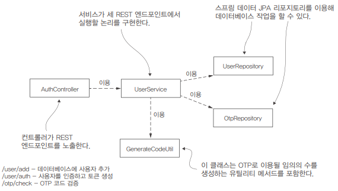
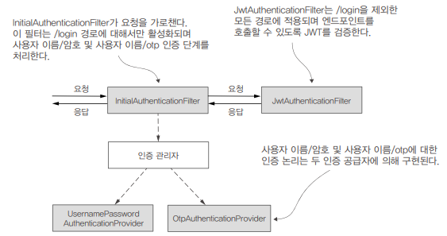

# 11장. 실전: 책임의 분리

## 예제 시나리오 및 요구 사항

 - 클라이언트
    - 백엔드를 이용하는 애플리케이션이다.
    - 모바일 앱, 앵귤러, 리액트, Vue.js 등이 될 수 있다.
 - 인증 서버
    - 사용자 자격 증명 데이터베이스를 포함하는 애플리케이션이다.
    - 사용자의 자격 증명을 기준으로 사용자를 인증하고 SMS를 통해 OTP를 전송한다.
 - 비즈니스 논리 서버
    - 클라이언트가 이용할 엔드포인트를 노출하는 애플리케이션이다.
    - 엔드포인트를 호출하기 위해 사용자는 먼저 사용자 이름과 암호로 인증하고 OTP를 보내야 한다.
 - 단계별 흐름
    - 첫 번째 인증 단계. 사용자 이름과 암호로 사용자를 식별하는 과정이다. 사용자가 자격 증명을 보내면 인증 서버는 두 번쨰 인증 단계를 위한 OTP를 반환한다.
    - 두 번쨰 인증 단계. 클라이언트가 SMS 메시지로 받은 코드를 사용자 이름과 함께 보낸다. 비즈니스 논리 서버가 인증 서버를 호출해 OTP를 검증한다. OTP가 유효하면 비즈니스 논리 서버가 클라이언트로 보낼 토큰을 발급한다. 클라이언트가 이 토큰으로 비즈니스 논리 서버의 다른 엔드포인트를 호출한다.
    - 세 번쨰 인증 단계. 클라이언트는 비즈니스 논리 서버가 노출하는 모든 엔드포인트를 호출하기 위해 권한 부여 HTTP 요청 헤더에 유효한 토큰을 추가한다.

<br/>

## 토큰의 구현과 이용

애플리케이션은 리소스에 접근하기 위한 인증 프로세스의 결과로 토큰을 얻는다.  
웹 애플리케이션에서 토큰은 일반적으로 특정 엔드포인트에 접근하려는 클라이언트가 HTTP 헤더를 통해 보내는 문자열이다.  
이 문자열은 순수 UUID처럼 단순할 수도 있고 JWT처럼 복잡한 형식일 수도 있다.  
 - 클라이언트가 자격 증명으로 서버에 자신의 신원을 증명한다.
 - 서버가 클라이언트에 UUID 형식의 토큰을 발급한다. 이 토큰은 해당 클라이언트와 연결되고 서버에 의해 메모리에 저장된다.
 - 클라이언트가 엔드포인트를 호출할 때 토큰을 제공하고 권한을 부여받는다.

```
★ 토큰의 특징
 - 토큰을 이용하면 요청할 때마다 자격 증명을 공유할 필요가 없다.
 - 토큰의 수명을 짧게 지정할 수 있다.
 - 자격 증명을 무효로 하지 않고 토큰을 무효로 할 수 있다.
 - 클라이언트가 요청할 때 보내야 하는 사용자 권한과 같은 세부 정보를 토큰에 저장할 수도 있다.
 - 토큰을 이용하면 인증 책임을 시스템의 다른 구성 요소에 위임할 수 있다.
```

<br/>

### JSON 웹 토큰

JWT는 "JSON Web Token"의 약어로, 웹 기반 애플리케이션 및 서비스에서 사용되는 인증 및 권한 부여 메커니즘을 구현하는 데 널리 사용되는 토큰 기반의 인증 방법입니다.  
JWT는 JSON 형식을 사용하여 정보를 표현하며, 디지털 서명을 통해 데이터 무결성을 보장하고 인증 서버와 클라이언트 간에 안전한 통신을 제공합니다.  
JWT는 헤더, 본문, 서명의 세 부분으로 구성된다. 헤더와 본문은 토큰에 저장된 JSON 형식의 데이터이며 요청 헤더를 통해 쉽게 보낼 수 있게 Base64로 인코딩된다. 토큰의 마지막 부분은 서명이다. 토큰의 각 부분은 마침표로 구분된다.  
 - Header (헤더): JWT의 유형 및 사용하는 해시 알고리즘을 지정하는 JSON 객체입니다.
 - Payload (페이로드): 클레임(claim)이라고 불리는 데이터 조각을 포함한 JSON 객체입니다. 클레임은 JWT의 주제, 만료 일자, 발급자, 사용자 식별 정보 및 사용 권한과 같은 정보를 포함할 수 있습니다.
 - Signature (서명): 서명은 헤더와 페이로드를 함께 특정 비밀 키를 사용하여 서명한 값으로, 데이터의 무결성을 확인하는 데 사용됩니다. 이 서명을 통해 클라이언트 및 서버는 JWT가 변경되지 않았음을 검증할 수 있습니다.
  - Java에서 JWT를 만들고 사용하기 위해서 JJWT 라이브러리를 이용할 수 있다. (https://github.com/jwtk/jjwt)

<br/>

## 인증 서버 구현

<div align="center">
    
</div>

<br/>

 - pom.xml
```XML
    <dependencies>
        <dependency>
            <groupId>org.springframework.boot</groupId>
            <artifactId>spring-boot-starter-data-jpa</artifactId>
        </dependency>
        <dependency>
            <groupId>org.springframework.boot</groupId>
            <artifactId>spring-boot-starter-security</artifactId>
        </dependency>
        <dependency>
            <groupId>org.springframework.boot</groupId>
            <artifactId>spring-boot-starter-web</artifactId>
        </dependency>
        <dependency>
            <groupId>mysql</groupId>
            <artifactId>mysql-connector-java</artifactId>
            <scope>runtime</scope>
        </dependency>
        ..
    </dependencies>
```

 - application.properties
```properties
spring.datasource.url=jdbc:mysql://localhost/spring?useLegacyDatetimeCode=false&serverTimezone=UTC
spring.datasource.username=root
spring.datasource.password=
spring.datasource.initialization-mode=always
```

 - schema.sql
```SQL
CREATE TABLE IF NOT EXISTS `spring`.`user` (
    `username` VARCHAR(45) NULL,
    `password` TEXT NULL,
    PRIMARY KEY (`username`));

CREATE TABLE IF NOT EXISTS `spring`.`otp` (
    `username` VARCHAR(45) NOT NULL,
    `code` VARCHAR(45) NULL,
    PRIMARY KEY (`username`));
```

 - 엔티티
```Java
// Otp
@Getter
@Setter
@Entity
public class Otp {

    @Id
    private String username;
    private String code;
}

// User
Getter
@Setter
@Entity
public class User {

    @Id
    private String username;
    private String password;
}
```

 - 레포지토리
```Java
// OtpRepository
public interface OtpRepository extends JpaRepository<Otp, String> {
    Optional<Otp> findOtpByUsername(String username);
}

// UserRepository
public interface UserRepository extends JpaRepository<User, String> {
    Optional<User> findUserByUsername(String username);
}
```

 - UserService
```Java
@Service
@Transactional
public class UserService {

    @Autowired
    private PasswordEncoder passwordEncoder;

    @Autowired
    private UserRepository userRepository;

    @Autowired
    private OtpRepository otpRepository;

    // 유저 정보 저장
    public void addUser(User user) {
        user.setPassword(passwordEncoder.encode(user.getPassword()));
        userRepository.save(user);
    }

    public void auth(User user) {
        // 데이터베이스에서 사용자 정보 조회
        Optional<User> o = userRepository.findUserByUsername(user.getUsername());

        if(o.isPresent()) { // 사용자 정보가 존재하면 암호 확인
            User u = o.get();
            if (passwordEncoder.matches(user.getPassword(), u.getPassword())) {
                // 암호가 정상적이면 새 OTP 생성
                renewOtp(u);
            } else {
                // 암호가 틀리면 예외 발생
                throw new BadCredentialsException("Bad credentials.");
            }
        } else {
            throw new BadCredentialsException("Bad credentials.");
        }
    }

    // 사용자의 OTP 검증 메서드
    public boolean check(Otp otpToValidate) {
        Optional<Otp> userOtp = otpRepository.findOtpByUsername(otpToValidate.getUsername());
        if (userOtp.isPresent()) {
            Otp otp = userOtp.get();
            if (otpToValidate.getCode().equals(otp.getCode())) {
                return true;
            }
        }

        return false;
    }

    private void renewOtp(User u) {
        // OTP를 위한 임의의 수 생성
        String code = GenerateCodeUtil.generateCode();

        // 사용자 이름으로 OTP 검색
        Optional<Otp> userOtp = otpRepository.findOtpByUsername(u.getUsername());
        if (userOtp.isPresent()) {
            // 사용자 이름에 대한 OTP가 존재하면 값 업데이트
            Otp otp = userOtp.get();
            otp.setCode(code);
        } else {
            // 사용자 이름에 대한 OTP가 없으면 생성된 값으로 새 레코드 생성
            Otp otp = new Otp();
            otp.setUsername(u.getUsername());
            otp.setCode(code);
            otpRepository.save(otp);
        }
    }

}
```

 - GenerateCodeUtil
    - OTP를 위한 임의의 값을 생성하기 위한 클래스
```Java
public final class GenerateCodeUtil {

    private GenerateCodeUtil() {}

    public static String generateCode() {
        String code;

        try {
            // 임의의 int 값을 생성하는 SecureRandom 인스턴스 생성
            SecureRandom random = SecureRandom.getInstanceStrong();

            // 0 ~ 8.999 사이의 값을 생성하고 1,000을 더해서 1,000 ~ 9,999(4자리 임의 코드) 사이의 값을 얻는다.
            code = String.valueOf(random.nextInt(9000) + 1000); 
        } catch (NoSuchAlgorithmException e) {
            throw new RuntimeException("Problem when generating the random code.");
        }

        return code;
    }
}
```

 - AuthController
    - /user/add 엔드포인트를 호출해 새 사용자를 DB에 추가한다.
    - 데이터베이스의 users 테이블을 확인해 사용자가 올바르게 추가됐는지 확인한다.
    - 1단계에서 추가한 사용자로 /user/auth 엔드포인트를 호출한다.
    - 애플리케이션이 OTP를 생성하고 otp 테이블에 저장하는지 확인한다.
    - 3단계에서 생성된 OTP로 /otp/check 엔드포인트가 원하는 대로 동작하는지 확인한다.
```Java
@RestController
public class AuthController {

    @Autowired
    private UserService userService;

    @PostMapping("/user/add")
    public void addUser(@RequestBody User user) {
        userService.addUser(user);
    }

    @PostMapping("/user/auth")
    public void auth(@RequestBody User user) {
        userService.auth(user);
    }

    @PostMapping("/otp/check")
    public void check(@RequestBody Otp otp, HttpServletResponse response) {
        if (userService.check(otp)) {
            response.setStatus(HttpServletResponse.SC_OK);
        } else {
            response.setStatus(HttpServletResponse.SC_FORBIDDEN);
        }
    }
}
```

 - ProjectConfig
```Java
@Configuration
public class ProjectConfig extends WebSecurityConfigurerAdapter {

    @Bean
    public PasswordEncoder passwordEncoder() {
        return new BCryptPasswordEncoder();
    }

    @Override
    protected void configure(HttpSecurity http) throws Exception {
        http.csrf().disable();
        http.authorizeRequests()
                .anyRequest().permitAll();
    }
}
```

 - HTTP 요청 테스트
```Bash
# /user/add: 사용자 생성
$ curl -XPOST -H "content-type: application/json" -d "{\"username\":\"danielle\",\"password\":\"12345\"}" http://localhost:8080/user/add

# /user/auth: OTP 생성
$ curl -XPOST -H "content-type: application/json" -d "{\"username\":\"danielle\",\"password\":\"12345\"}" http://localhost:8080/user/auth

# /otp/check: OTP 검증
$ curl -XPOST -H "content-type: application/json" -d "{\"username\":\"danielle\",\"code\":\"8173\"}" http://localhost:8080/otp/check
```

<br/>

## 비즈니스 논리 서버 구현

JWT로 인증과 권한 부여를 수행하며 애플리케이션에서 MFA를 수립하기 위해 비즈니스 논리 서버와 인증 서버 간의 통신을 구현한다.  

1. 보호할 리소스에 해당하는 엔드포인트를 만든다.  
2. 클라이언트가 사용자 자격 증명을 비즈니스 논리 서버로 보내고 로그인하는 첫 번째 인증 단계를 구현한다.  
3. 클라이언트가 인증 서버에서 사용자가 받은 OTP를 비즈니스 논리 서버로 보내는 두 번째 인증 단계를 구현한다. OTP로 인증되면 클라이언트는 사용자의 리소스에 접근하는 데 필요한 JWT를 받는다.  
4. JWT 기반 권한 부여를 구현한다. 비즈니스 논리 서버가 클라이언트에서 받은 JWT를 검증하고 올바르면 클라이언트가 리소스에 접근할 수 있게 허용한다.  

<div align="center">
    
</div>

<br/>

 - pom.xml
```XML
    <dependencies>
        <!-- Spring Boot Starter -->
        <dependency>
            <groupId>org.springframework.boot</groupId>
            <artifactId>spring-boot-starter-security</artifactId>
        </dependency>
        <dependency>
            <groupId>org.springframework.boot</groupId>
            <artifactId>spring-boot-starter-web</artifactId>
        </dependency>

        <!-- JWT 관련 -->
        <dependency>
            <groupId>io.jsonwebtoken</groupId>
            <artifactId>jjwt-api</artifactId>
            <version>0.11.1</version>
        </dependency>
        <dependency>
            <groupId>io.jsonwebtoken</groupId>
            <artifactId>jjwt-impl</artifactId>
            <version>0.11.1</version>
            <scope>runtime</scope>
        </dependency>
        <dependency>
            <groupId>io.jsonwebtoken</groupId>
            <artifactId>jjwt-jackson</artifactId>
            <version>0.11.1</version>
            <scope>runtime</scope>
        </dependency>

        <!-- Java 10 이상인 경우 -->
        <dependency>
            <groupId>jakarta.xml.bind</groupId>
            <artifactId>jakarta.xml.bind-api</artifactId>
        </dependency>
        <dependency>
            <groupId>org.glassfish.jaxb</groupId>
            <artifactId>jaxb-runtime</artifactId>
        </dependency>
        ..
    </dependencies>
```

 - application.properties
```properties
server.port=9090

auth.server.base.url=http://localhost:8080
jwt.signing.key=ymLTU8rq83j4fmJZj60wh4OrMNuntIj4fmJ
```

 - TestController
    - /test 엔드포인트를 정의한다.
```Java
@RestController
public class TestController {

    @GetMapping("/test")
    public String test() {
        return "Test";
    }
}
```

<br/>

### Authentication 객체 구현

사용자 이름과 암호를 이용해 인증하는 Authentication과 OTP를 이용해 인증하는 Authentication를 만든다.  
Authentication 계약은 요청의 인증 프로세스를 나타내며 인증 진행 중 또는 완료 후 프로세스일 수 있다.  
애플리케이션이 사용자 이름과 암호로 사용자를 인증할 때와 OTP로 인증할 때 모두에 대해 Authentication 인터페이스를 구현해야 한다.  

 - UsernamePasswordAuthentication
    - 사용자 이름과 암호를 이용한 인증을 구현한다.
```Java
public class UsernamePasswordAuthentication extends UsernamePasswordAuthenticationToken {

    public UsernamePasswordAuthentication(Object principal, Object credentials, Collection<? extends GrantedAuthority> authorities) {
        super(principal, credentials, authorities);
    }

    public UsernamePasswordAuthentication(Object principal, Object credentials) {
        super(principal, credentials);
    }
}
```

 - OtpAuthentication
    - OTP를 이용한 인증을 구현한다.
```Java
public class OtpAuthentication extends UsernamePasswordAuthenticationToken {

    public OtpAuthentication(Object principal, Object credentials) {
        super(principal, credentials);
    }
}
```

<br/>

### 인증 서버에 대한 프록시 구현

Authentication 객체를 정의한 다음에 보통 AuthenticationProvider 객체를 구현한다.  
하지만, 인증을 완료하려면 인증 서버를 호출하는 방법이 필요하다.  
때문에, 인증 서버에 대한 프록시를 구현한다.  

 - User
    - 인증 서버에 요청할 파라미터 객체(DTO)
```Java
@Getter
@Setter
public class User {

    private String username;
    private String password;
    private String code;
}
```

 - ProjectConfig
    - HTTP 요청을 위해 RestTemplate 빈을 정의한다.
```Java
@Configuration
public class ProjectConfig {

    @Bean
    public RestTemplate restTemplate() {
        return new RestTemplate();
    }
}
```

 - AuthenticationServerProxy
    - 인증 공급자(XxxAuthenticationProvider)는 인증 논리를 프록시를 이용해 인증 서버를 호출한다.
```Java
@Component
public class AuthenticationServerProxy {

    @Autowired
    private RestTemplate rest;

    @Value("${auth.server.base.url}")
    private String baseUrl;

    public void sendAuth(String username, String password) {
        String url = baseUrl + "/user/auth";

        var body = new User();
        body.setUsername(username);
        body.setPassword(password);

        var request = new HttpEntity<>(body);

        rest.postForEntity(url, request, Void.class);
    }

    public boolean sendOTP(String username, String code) {
        String url = baseUrl + "/otp/check";

        var body = new User();
        body.setUsername(username);
        body.setCode(code);

        var request = new HttpEntity<>(body);

        var response = rest.postForEntity(url, request, Void.class);

        return response.getStatusCode().equals(HttpStatus.OK);
    }
}
```

<br/>

### AuthenticationProvider 인터페이스 구현

인증 공급자(AuthenticationProvider)를 구현한다.  

 - UsernamePasswordAuthenticationProvider
```Java
@Component
public class UsernamePasswordAuthenticationProvider implements AuthenticationProvider {

    @Autowired
    private AuthenticationServerProxy proxy;

    @Override
    public Authentication authenticate(Authentication authentication) throws AuthenticationException {
        String username = authentication.getName();
        String password = String.valueOf(authentication.getCredentials());

        proxy.sendAuth(username, password); // 프록시로 인증 서버 호출

        return new UsernamePasswordAuthenticationToken(username, password);
    }

    @Override
    public boolean supports(Class<?> aClass) {
        return UsernamePasswordAuthentication.class.isAssignableFrom(aClass);
    }
}
```

 - OtpAuthenticationProvider
    - 인증 서버를 호출해 OTP가 맞는지 확인한다.
    - OTP가 맞으면 Authentication을 반환하고 필터가 HTTP 응답에 토큰을 보낸다.
    - OTP가 틀리면 인증 공급자가 예외를 발생시킨다.
```Java
@Component
public class OtpAuthenticationProvider implements AuthenticationProvider {

    @Autowired
    private AuthenticationServerProxy proxy;

    @Override
    public Authentication authenticate(Authentication authentication) throws AuthenticationException {
        String username = authentication.getName();
        String code = String.valueOf(authentication.getCredentials());
        boolean result = proxy.sendOTP(username, code);

        if (result) {
            return new OtpAuthentication(username, code);
        } else {
            throw new BadCredentialsException("Bad credentials.");
        }
    }

    @Override
    public boolean supports(Class<?> aClass) {
        return OtpAuthentication.class.isAssignableFrom(aClass);
    }
}
```

<br/>

### 필터 구현

필터의 목적은 요청을 가로채고 인증 논리를 적용하는 것이다.  
인증 서버가 수행하는 인증을 처리할 필터 하나를 구현하고 JWT 기반 인증을 위해 다른 필터를 구현한다.  

 - InitialAuthenticationFilter
    - shouldNotFilter() 메서드에서 /login 엔드포인트에서만 해당 필터를 적용하도록 한다.
    - doFilterInternal() 메서드에서 OTP(code)를 보내지 않으면 사용자 이름과 암호로 인증한다고 가정한다.
    - AuthenticationManager는 전달받은 Authentication 정보로 올바른 AuthenticationProvider를 찾을려고 한다.
```Java
@Component
public class InitialAuthenticationFilter extends OncePerRequestFilter {

    @Autowired
    private AuthenticationManager manager;

    @Value("${jwt.signing.key}")
    private String signingKey;

    @Override
    protected void doFilterInternal(HttpServletRequest request, HttpServletResponse response, FilterChain filterChain) throws ServletException, IOException {
        String username = request.getHeader("username");
        String password = request.getHeader("password");
        String code = request.getHeader("code");

        if (code == null) { // OTP가 없으면 사용자 이름과 암호로 인증
            Authentication a = new UsernamePasswordAuthentication(username, password);
            manager.authenticate(a);
        } else {
            Authentication a = new OtpAuthentication(username, code);
            manager.authenticate(a); // OTP가 유효하지 않으면 예외 발생

            SecretKey key = Keys.hmacShaKeyFor(signingKey.getBytes(StandardCharsets.UTF_8));
            String jwt = Jwts.builder()
                    .setClaims(Map.of("username", username))
                    .signWith(key)
                    .compact();
            response.setHeader("Authorization", jwt); // OTP가 유효하면 JWT 토큰을 생성하고, HTTP 응답 헤더에 포함한다.
        }

    }

    // /login 요청시에만 해당 필터를 적용
    @Override
    protected boolean shouldNotFilter(HttpServletRequest request) {
        return !request.getServletPath().equals("/login");
    }
}
```

 - JwtAuthenticationFilter
    - 요청의 권한 부여 HTTP 헤더에 JWT가 있다고 가정하고, 서명을 확인해 JWT를 검증한 후 인증된 Authentication 객체를 만들고 이를 SecurityContext에 추가한다.
```Java
@Component
public class JwtAuthenticationFilter extends OncePerRequestFilter {

    @Value("${jwt.signing.key}")
    private String signingKey;

    @Override
    protected void doFilterInternal(HttpServletRequest request, HttpServletResponse response, FilterChain filterChain) throws ServletException, IOException {
        String jwt = request.getHeader("Authorization");

        SecretKey key = Keys.hmacShaKeyFor(signingKey.getBytes(StandardCharsets.UTF_8));
        Claims claims = Jwts.parserBuilder() // 토큰을 구문 분석해 클레임을 얻고 서명을 검증한다. 서명이 유효하지 않으면 예외 발생
                .setSigningKey(key)
                .build()
                .parseClaimsJws(jwt)
                .getBody();

        String username = String.valueOf(claims.get("username"));

        GrantedAuthority a = new SimpleGrantedAuthority("user");
        var auth = new UsernamePasswordAuthentication(username, null, List.of(a));
        SecurityContextHolder.getContext().setAuthentication(auth); // SecurityContext에 Authentication 객체를 추가한다.

        filterChain.doFilter(request, response); // 필터 체인의 다음 필터를 호출한다.
    }

    // /login 경로에 대한 요청에는 해당 필터가 타지 않는다.
    @Override
    protected boolean shouldNotFilter(HttpServletRequest request) {
        return request.getServletPath().equals("/login");
    }
}
```

<br/>

### 보안 구성 작성

 - SecurityConfig
```Java
@Configuration
public class SecurityConfig extends WebSecurityConfigurerAdapter {

    @Autowired
    private InitialAuthenticationFilter initialAuthenticationFilter;

    @Autowired
    private JwtAuthenticationFilter jwtAuthenticationFilter;

    @Autowired
    private OtpAuthenticationProvider otpAuthenticationProvider;

    @Autowired
    private UsernamePasswordAuthenticationProvider usernamePasswordAuthenticationProvider;

    @Override
    protected void configure(AuthenticationManagerBuilder auth) {
        auth.authenticationProvider(otpAuthenticationProvider)
            .authenticationProvider(usernamePasswordAuthenticationProvider);
    }

    @Override
    protected void configure(HttpSecurity http) throws Exception {
        http.csrf().disable(); // CSRF 보호 비활성화

        http.addFilterAt(
                initialAuthenticationFilter,
                BasicAuthenticationFilter.class)
            .addFilterAfter(
                jwtAuthenticationFilter,
                BasicAuthenticationFilter.class
            );

        http.authorizeRequests()
                .anyRequest().authenticated(); // 모든 요청은 인증된 사용자만 허용
    }

    @Override
    @Bean
    protected AuthenticationManager authenticationManager() throws Exception {
        return super.authenticationManager();
    }
}
```
