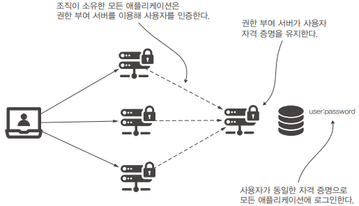

# 12장. OAuth 2가 작동하는 방법

OAuth 2.0 (Open Authorization 2.0)은 웹 및 애플리케이션에서 인증 및 권한 부여를 위한 개방형 표준 프로토콜입니다.  
OAuth 2.0은 클라이언트 애플리케이션이 사용자의 데이터에 접근하기 위한 절차를 제공하며, 대부분의 웹 및 모바일 애플리케이션에서 사용자 로그인 및 데이터 공유를 효과적으로 관리하는 데 널리 사용됩니다.  

OAuth 2.0은 사용자 데이터 및 서비스에 대한 보안 및 권한 관리를 향상시키는 데 사용됩니다.  
이것은 많은 웹 및 모바일 애플리케이션에서 사용자가 여러 서비스에 로그인하지 않고도 데이터를 공유할 수 있도록 해주는 중요한 프로토콜 중 하나입니다.  

 - 클라이언트 (Client): OAuth 2.0 프로토콜을 사용하여 사용자 데이터에 접근하려는 애플리케이션이나 서비스입니다. 이는 보통 웹 사이트, 모바일 앱 또는 다른 웹 서비스가 될 수 있습니다.
 - 리소스 소유자 (Resource Owner): 사용자로서, 자신의 데이터 또는 서비스에 대한 액세스 권한을 부여할 수 있는 개인 또는 엔터프라이즈입니다.
 - 인증 서버 (Authorization Server): 사용자 인증 및 권한 부여를 처리하는 서버입니다. 일반적으로 사용자의 자격 증명을 검증하고, 클라이언트에 대한 권한 부여 코드 또는 토큰을 발급합니다.
 - 리소스 서버 (Resource Server): 사용자 데이터 또는 서비스에 대한 액세스를 허용하거나 거부하는 역할을 하는 서버입니다. 이 서버는 OAuth 2.0 토큰을 사용하여 요청을 처리하고 사용자 데이터를 제공합니다.
 - 권한 부여 코드 (Authorization Code): 사용자가 인증 서버에 로그인한 후 클라이언트에게 부여되는 일회성 코드입니다. 이 코드를 사용하여 클라이언트는 액세스 토큰을 얻을 수 있습니다.
 - 액세스 토큰 (Access Token): 클라이언트가 리소스 서버에 요청을 보낼 때 사용하는 토큰입니다. 이 토큰은 일반적으로 사용자 데이터에 대한 권한을 나타내며, 유효 기간이 있을 수 있습니다.
 - 범위 (Scope): 클라이언트가 어떤 유형의 데이터 또는 서비스에 액세스할 수 있는지를 지정하는 파라미터입니다. 범위는 클라이언트가 요청하는 액세스 권한의 범위를 정의합니다.
```
★ OAuth 2 흐름
1. 클라이언트는 사용자를 인증 서버로 리디렉션시키고, 사용자는 자격 증명으로 로그인합니다.
2.사용자가 인증되면 인증 서버는 권한 부여 코드를 발급하고 클라이언트로 리디렉션합니다.
3. 클라이언트는 권한 부여 코드와 함께 액세스 토큰을 요청합니다.
4. 인증 서버는 클라이언트에게 액세스 토큰을 제공합니다.
5. 클라이언트는 액세스 토큰을 사용하여 리소스 서버에 요청을 보내고, 리소스 서버는 해당 요청을 승인 또는 거부합니다.
```

여러 애플리케이션을 관리할 때 애플리케이션마다 인증을 위해 사용자 관리를 해야한다.  
이러한 경우, 하나의 조직이 여러 시스템에서 사용자 자격 증명을 모두 관리하는 것은 번거롭다.  
이러한 경우 자격 증명을 관리하는 책임을 시스템의 한 구성 요소에 격리하면 편리하다.  

<div align="center">
    
</div>

<br/>

## OAuth 2 인증 아키텍처 구성 요소

 - __리소스 서버__
    - 사용자가 소유한 리소스를 호스팅하는 서버.
    - 리소스는 사용자의 데이터이거나 사용자가 수행할 수 있는 작업일 수 있다.
 - __사용자__
    - 리소스 서버가 노출하는 리소스를 소유하는 개인.
    - 일반적으로 사용자는 사용자 이름과 암호로 신원을 증명한다.
 - __클라이언트__
    - 사용자를 대신해 사용자가 소유한 리소스에 접근하는 애플리케이션.
    - 클라이언트는 클라이언트 ID와 클라이언트 비밀을 이용해 신원을 증명한다.
    - 이러한 자격 증명은 사용자 자격 증명과는 다르다. 클라이언트는 요청할 대 자신을 증명하는 자체 자격 증명이 필요하다.
 - __권한 부여 서버__
    - 클라이언트가 리소스 서버가 노출하는 사용자의 리소스에 접근할 권한을 부여하는 애플리케이션.
    - 권한 부여 서버는 클라이언트가 사용자 대신 리소스에 접근 권한이 있다고 결정하면 토큰을 발급한다.
    - 클라이언트는 이 토큰을 이용해 권한 부여 서버에서 권한을 받았음을 리소스 서버에 증명한다.
    - 리소스 서버는 유효한 토큰이 있으면 클라이언트가 요청한 리소스에 접근하게 허용한다.

<br/>

## OAuth 2를 구현하는 방법

OAuth2를 이용한다는 것은 권한 부여에 토큰을 이용한다는 뜻이다.  
토큰을 얻은 후에는 특정 리소스레 접근할 수 있다.  
OAuth 2는 그랜드(grant)라고 하는 토큰을 얻는 여러 방법을 제공한다.  
 - 승인 코드
 - 암호
 - 갱신 토큰
 - 클라이언트 자격 증명
 - OAuth 2 in Action 참고: https://livebook.manning.com/book/oauth-2-in-action/chapter-6/6
    - 승인 코드(권한 코드) 그랜트
        - 가장 일반적으로 사용되는 그랜트 유형
        - 클라이언트는 사용자를 인증 서버로 리다이렉션하고, 권한 부여 코드를 받은 후 이를 사용하여 액세스 토큰을 요청한다.
    - 암시적 그랜드
        - 권한 부여 코드 대신에 액세스 토큰을 직접 반환하는 방식으로 동작한다.
        - 보안 측면에서 권한 코드 그랜트보다 취약하다.


<br/>

### 승인 코드 그랜트 유형

클라이언트는 사용자가 직접 권한 부여 서버와 상호 작용해 사용자의 요청에 대한 이용 권한을 부여받도록 요청한다.  
권한이 부여되면 권한 부여 서버는 클라이언트가 사용자의 리소스에 접근하는 데 이용할 수 있는 토큰을 발행한다.  

클라이언트는 전 단계에서 받은 승인 코드를 제시하고 권한 부여 서버에 액세스 토큰을 요청한다.  
인증 서버를 두 번 호출하는 이유는 권한 부여 서버가 실제 올바른 클라이언트에서 받았는지 확인하기 위해서이다.  
때문에, 먼저 승인 코드를 보내도록 하므로 클라이언트는 액세스 토큰을 얻기 위해 자격 증명으로 자신이 누구인지 다시 증명해야 한다.  

권한 부여 서버에서 액세스 토큰을 받고 나면 이제 클라이언트는 보호된 리소스를 호출할 수 있다.  
클라이언트는 리소스 서버의 엔드포인트를 호출할 때 권한 부여 요청 헤더의 액세스 토큰을 사용한다.  

 - 1단계: 인증 요청을 한다.  
    - 사용자를 권한 부여 서버로 리디렉션할 때 클라이언트는 다음 세부 정보가 포함된 요청 쿼리로 권한 부여 엔드포인트를 호출한다.
        - response_type: 클라이언트가 코드를 기대한다는 것을 권한 부여 서버에 알리는 값인 code를 포함한다.
        - client_id: 애플리케이션 자체를 식별하는 클라이언트 ID 값
        - redirect_uri: 인증 성공 후 사용자를 리다이렉션할 위치를 권한 부여 서버에 알려준다. 때때로 권한 부여 서버는 각 클라이언트의 기본 리다이렉션 URI를 이미 알고 있으므로 클라이언트는 리다이렉션 URI를 보낼 필요가 없다.
        - scope: 허가된 권한
        - state: CSRF 보호를 위한 CSRF 토큰 정의
    - 인증에 성공하면 권한 부여 서버는 리다이렉션 URI로 클라이언트를 다시 호출하고 코드와 상태 값을 제공한다.
    - 클라이언트는 상태 값이 요청에 보낸 것과 같은지 검사해 다른 사람이 리다이렉션 URI를 호출하려는 것인지 아닌지 확인한다.
 - 2단계: 액세스 토큰을 얻는다.  
    - 권한 부여 서버는 사용자가 직접 상호 작용했다는 증거로 첫 번째 코드를 생성한다.  
    - 클라이언트는 이 코드를 받고 이를 자신의 자격 증명과 함께 이용해 액세스 토큰을 받기 위한 인증을 한다.
 - 3단계: 보호된 리소스를 호출한다.  
    - 클라이언트는 이 두 번째 토큰을 이용해 리소스 서버의 리소스에 접근한다.

<br/>

### 암호 그랜트 유형

암호 그랜트 유형은 리소스 소유자 자격 증명 그랜트 유형이라고도 불린다.  
이 흐름에서 애플리케이션은 클라이언트가 사용자 자격 증명을 수집하고 이를 이용해 인증하며 권한 부여 서버에서 액세스 토큰을 얻는다.  

 - 1단게: 액세스 토큰을 요청한다.
   - 클라이언트는 사용자 자격 증명을 수집하고 권한 부여 서버를 호출해 액세스 토큰을 얻는다.
   - 클라이언트는 액세스 토큰을 요청할 때 다음 세부 정보를 함께 보낸다.
      - grant_type: password 값
      - client_id 및 client_secret: 클라이언트가 자신을 인증하기 위한 자격 증명
      - scope: 허가된 권한
      - username 및 password: 사용자 자격 증명. 일반 텍스트 형식으로 요청 헤더의 값으로 전송된다.
   - 클라이언트는 응답으로 액세스 토큰을 받는다.
 - 2단계: 액세스 토큰을 이용해 리소스를 호출한다.
   - 액세스 토큰을 얻은 클라이언트는 이 토큰으로 리소스 서버의 엔드포인트를 호출할 수 있으며 승인 코드 그랜트 유형을 이용할 때와 마찬가지로 권한 부여 요청 헤더에 액세스 토큰을 추가한다.

<br/>

### 클라이언트 자격 증명 그랜트 유형

클라이언트 자격 증명 그랜트 유형을 처리하는 과정은 암호 그랜트 유형과 비슷하다.  
유일한 차이는 액세스 토큰을 요청할 때 사용자 자격 증명이 필요하지 않다는 것이다.  

 - 1단계: 클라이언트 자격 증명 그랜트 유형으로 액세스 토큰 얻기
   - 클라이언트는 액세스 토큰을 얻기 위해 다음 세부 정보와 함께 권한 부여 서버에 요청을 보낸다.
      - grant_type: client_credentials 값
      - client_id 및 client_secret: 클라이언트 자격 증명
      - scoep: 허가된 권한
 - 2단계: 클라이언트 자격 증명 그랜트 유형으로 액세스 토큰을 이용해 리소스 호출
   - 액세스 토큰을 얻은 클라이언트는 이 토큰으로 리소스 서버의 엔드포인트를 호출할 수 있다.
   - 권한 부여 요청 헤더에 액세스 토큰을 추가한다.

<br/>

### 갱신 토큰으로 새 엑세스 토큰 얻기

토큰은 각 요청의 단순 HTTP 헤더에 첨부된다. 토큰이 만료되지 않으면 누군가 토큰을 손에 넣은 후 리소스에 접근하는 데 이용할 수 있다.  
즉, 만료되지 않는 토큰은 거의 사용자 자격 증명만큼 강력하기 때문에, 이러한 부작용 방지하기 위해 토큰의 수명을 짧게 만들어야 하며 그러면 만료된 토큰은 더는 이용할 수 없고 클라이언트는 다른 액세스 토큰을 얻어야 한다.  

리프레쉬 토큰(Refresh Token)은 인증(Authentication) 시스템에서 사용되는 중요한 보안 개념입니다.  
주로 웹 애플리케이션, 모바일 애플리케이션 및 API와 같은 서비스에서 사용됩니다. 리프레쉬 토큰은 주로 OAuth(Open Authorization) 프로토콜과 관련이 있습니다.  

 - 액세스 토큰 갱신
   - 액세스 토큰(Access Token)은 일반적으로 짧은 수명을 가지며, 사용자 또는 클라이언트가 서비스에 접근할 때 사용됩니다.
   - 액세스 토큰의 유효 기간이 만료되면, 사용자는 다시 로그인하거나 권한을 다시 얻어야 합니다. 이러한 번거로움을 피하기 위해 리프레쉬 토큰은 액세스 토큰을 갱신하는 데 사용됩니다.
 - 장기적인 인증
   - 리프레쉬 토큰은 사용자 또는 클라이언트의 장기적인 인증을 유지합니다.
   - 액세스 토큰은 짧은 기간 동안만 유효하므로, 리프레쉬 토큰은 그보다 오래 유지되며, 주기적으로 새로운 액세스 토큰을 얻을 수 있는 권한을 부여합니다.
 - 보안 강화
   - 리프레쉬 토큰은 민감한 정보를 저장하고, 액세스 토큰을 요청할 때마다 전송하지 않고도 액세스 토큰을 갱신할 수 있는 방법을 제공하여 보안을 강화합니다.

<br/>

## 간단한 SSO(Single Sign-On) 애플리케이션 구현

SSO(단일 로그인, Single Sign-On) 애플리케이션은 여러 웹 서비스 또는 애플리케이션에 대한 인증 및 액세스 관리를 효과적으로 수행하는 솔루션을 의미합니다.  
SSO 시스템은 사용자가 하나의 인증 자격 증명(예: 사용자 이름 및 암호)을 사용하여 여러 서비스에 접근할 수 있도록 허용합니다.  
사용자가 한 번 로그인하면, 다른 연결된 서비스에 대해서는 추가 인증이 필요하지 않습니다.  
 - SSO 애플리케이션은 사용자가 권한 부여 서버를 통해 인증하면 앱이 갱신 토큰을 이용해 로그인 상태를 유지한다.

<br/>

### 권한 부여 서버 관리

직접 권한 부여 서버를 구현하지 않고 깃허브 사이트를 이용할 수 있다.  
타사 서비스를 권한 부여 서버로 사용하면 타사 계정이 있는 사람이라면 누구나 여러 애플리케이션에 로그인할 수 있다.  
해당 서비스를 이용하기 위해서는 해당 사이트의 권한 부여 서버에 등록해야 한다.  
양식을 입력하고 애플리케이션을 등록하면 깃허브는 클라이언트 ID와 클라이언트 비밀을 제공한다.  

 - 깃허브: https://github.com/settings/applications/new
   - Application name: 애플리케이션 이름
   - Homepage URL: 홈페이지 URL
   - Authorization callback URL: 콜백 URL

<br/>

### 소스 코드

 - pom.xml
```XML
    <dependencies>
        <dependency>
            <groupId>org.springframework.boot</groupId>
            <artifactId>spring-boot-starter-oauth2-client</artifactId>
        </dependency>
        <dependency>
            <groupId>org.springframework.boot</groupId>
            <artifactId>spring-boot-starter-security</artifactId>
        </dependency>
        <dependency>
            <groupId>org.springframework.boot</groupId>
            <artifactId>spring-boot-starter-web</artifactId>
        </dependency>
         ..
   </dependencies>
```

 - MainController
```Java
@Controller
public class MainController {

    private Logger logger = Logger.getLogger(MainController.class.getName());

    @GetMapping("/")
    public String main(OAuth2AuthenticationToken token) {
        logger.info(String.valueOf(token));
        return "main.html";
    }
}
```

 - ProjectConfig
   - oauth2Login() 메서드를 호출하면 프레임워크는 OAuth2LoginAuthenticationFilter를 필터 체인에 추가한다. 이 필터는 요청을 가로채고 OAuth2 인증에 필요한 논리를 적용한다.
   - ClientRegistration 인터페이스는 OAuth2 아키텍처의 클라이언트를 나타내며 클라이언트의 모든 세부 정보를 정의해야 한다.
      - 클라이언트 ID와 비밀
      - 인증에 이용되는 그랜트 유형
      - 리다이렉션 URI
      - 범위
      - 권한 부여 URI: 클라이언트가 인증을 위해 사용자를 리다이렉션하는 URI
      - 토큰 URI: 클라이언트가 액세스 토큰과 갱신 토큰을 얻기 위해 호출하는 URI
      - 사용자 정보 URI: 클라이언트가 액세스 토큰을 얻은 후 사용자의 세부 정보를 얻기 위해 호출하는 URI
   - CommonOAuth2Provider라는 클래스를 스프링 시큐리티가 제공하여 일반적인 공급자에 대한 인증에 이용할 수 있는 ClientRegistration 인스턴스를 쉽게 정의할 수 있다.
      - 구글, 깃허브, 페이스북, 옥타
```Java
import org.springframework.context.annotation.Bean;
import org.springframework.context.annotation.Configuration;
import org.springframework.security.config.annotation.web.builders.HttpSecurity;
import org.springframework.security.config.annotation.web.configuration.WebSecurityConfigurerAdapter;
import org.springframework.security.config.oauth2.client.CommonOAuth2Provider;
import org.springframework.security.oauth2.client.registration.ClientRegistration;
import org.springframework.security.oauth2.client.registration.ClientRegistrationRepository;
import org.springframework.security.oauth2.client.registration.InMemoryClientRegistrationRepository;
import org.springframework.security.oauth2.core.AuthorizationGrantType;

@Configuration
public class ProjectConfig extends WebSecurityConfigurerAdapter {

    @Bean
    public ClientRegistrationRepository clientRepository() {
        var c = clientRegistration();
        return new InMemoryClientRegistrationRepository(c);
    }

    private ClientRegistration clientRegistration() {
        return CommonOAuth2Provider.GITHUB // 해당 URI가 이미 설정되어 있다. 깃허브 공급자 선택
                .getBuilder("github") // 클라이언트 등록을 위한 ID 제공
                  .clientId("a7553955a0c534ec5e6b") // 클라이언트 ID
                  .clientSecret("1795b30b425ebb79e424afa51913f1c724da0dbb") // 클라이언트 비밀
                  .build(); // ClientRegistration 인스턴스 생성
    }

/*
    // ClientRegistration 구현
    private ClientRegistration clientRegistration() {
        ClientRegistration cr = ClientRegistration.withRegistrationId("github")
                .clientId("a7553955a0c534ec5e6b") // 클라이언트 ID
                .clientSecret("1795b30b425ebb79e424afa51913f1c724da0dbb") // 클라이언트 비밀
                .scope(new String[]{"read:user"})
                .authorizationUri("https://github.com/login/oauth/authorize") // 권한 부여 URI
                .tokenUri("https://github.com/login/oauth/access_token") // 토큰 URI
                .userInfoUri("https://api.github.com/user") // 사용자 정보 URI
                .userNameAttributeName("id")
                .clientName("GitHub")
                .authorizationGrantType(AuthorizationGrantType.AUTHORIZATION_CODE)
                .redirectUriTemplate("{baseUrl}/{action}/oauth2/code/{registrationId}")
                .build();
        return cr;
    }
*/

    @Override
    protected void configure(HttpSecurity http) throws Exception {
        http.oauth2Login(); // OAuth2 활성화 (OAuth2LoginAuthenticationFilter 필터 체인 추가)

        http.authorizeRequests()
                .anyRequest().authenticated(); // 모든 요청에 대해서 인증된 사용자만 허용
    }
}
```

<br/>

### ClientRegistrationRepository 구현

인증 필터는 ClientRegistrationRepository에서 권한 부여 서버 클라이언트 등록에 관한 세부 정보를 얻는다.  
ClientRegistrationRepository 에는 하나 이상의 ClientRegistration 객체가 있다.  
ClientRegistrationRepository는 ClientRegistration 세부 정보(클라이언트 ID, 클라이언트 비밀, URL, 범위 등)를 얻는다.  

ClientRegistrationRepository 인터페이스는 UserDetailService 인터페이스와 유사하다.  
UserDetailService 객체가 사용자 이름으로 UserDetails를 찾는 것처럼 ClientRegistrationRepository 객체는 등록 ID로 ClientRegistration을 찾는다.  

 - ProjectConfig
```Java
@Configuration
public class ProjectConfig extends WebSecurityConfigurerAdapter {

    @Override
    protected void configure(HttpSecurity http) throws Exception {
        http.oauth2Login(c -> {
            c.clientRegistrationRepository(clientRepository());
        });

        http.authorizeRequests()
                .anyRequest().authenticated();
    }

    private ClientRegistrationRepository clientRepository() {
        var c = clientRegistration();
        return new InMemoryClientRegistrationRepository(c);
    }

    private ClientRegistration clientRegistration() {
        return CommonOAuth2Provider.GITHUB.getBuilder("github")
                .clientId("a7553955a0c534ec5e6b")
                .clientSecret("1795b30b425ebb79e424afa51913f1c724da0dbb")
                .build();
    }
}
```

<br/>

### 스프링 부트 구성을 이용

스프링 부트에는 속성 파일로 직접 ClientRegistration과 ClientRegistrationRepository 객체를 구축하는 기능이 있다.  

 - application.properties
```properties
spring.security.oauth2.client.registration.github.client-id=a7553955a0c534ec5e6b
spring.security.oauth2.client.registration.github.client-secret=1795b30b425ebb79e424afa51913f1c724da0dbb

# spring.security.oauth2.client.provider.myprovider.authorization-uri=<some uri>
# spring.security.oauth2.client.provider.myprovider.token-uri=<some uri>
```

 - ProjectConfig
   - ClientRegistration과 ClientRegistrationRepository에 관한 세부 정보는 스프링 ㅜㅂ트가 속성 파일을 바탕으로 자동으로 생성해준다.
   - 스프링 시큐리티에 알려진 일반적인 공급자가 아닌 다른 공급자를 이용하려면 spring.security.oauth2.client.provider로 시작하는 속성 그룹으로 권한 부여 서버에 관한 세부 정보를 지정해준다.
```Java
@Configuration
public class ProjectConfig extends WebSecurityConfigurerAdapter {

    @Override
    protected void configure(HttpSecurity http) throws Exception {
        http.oauth2Login();

        http.authorizeRequests()
                .anyRequest().authenticated();
    }

}
```

 - MainController
   - 인증된 사용자의 세부 정보는 스프링 시큐리티의 SecurityContext에 저장된다.
   - OAuth2의 경우 Authentication 객체의 구현은 OAuth2AuthenticationToken 이며, SecurityContext에서 직접 이를 가져오거나, 매개변수에 주입하여 가져올 수 있다.
```Java
@Controller
public class MainController {

    @GetMapping("/")
    public String main(OAuth2AuthenticationToken token) {
        System.out.println(token.getPrincipal());
        return "main.html";
    }
}
```
