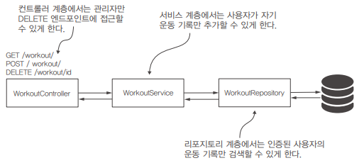

# 18장. 실전: OAuth 2 애플리케이션

## 애플리케이션 시나리오

피트니스 애플리케이션을 위한 백엔드를 구축한다고 가정한다.  
해당 앱은 사용자의 운동 기록을 저장한다.  
 - 사용자의 새 운동 기록 추가
    - DB의 workout이라는 테이블에 사용자, 운동 시작 시간과 종료 시간, 1~5 범위의 운동 난이도를 저장하는 새 레코드를 추가한다.
    - 인증된 사용자가 자기 운동 레코드만 추가할 수 있다.
 - 사용자의 모든 운동 기록 찾기
    - 클라이언트가 사용자의 기록에 있는 운동 목록을 표시하는 기능이다.
    - 사용자가 자기 운동 레코드만 가져올 수 있다.
 - 운동 기록 삭제
    - 관리자 역할이 있는 사용자는 다른 모든 사용자의 운동 기록을 삭제할 수 있다.
    - 관리자만 레코드를 삭제할 수 있다고 명시한다.

<br/>

## Keycloak을 권한 부여 서버로 구성

Keycloak은 싱글 사인온 (Single Sign-On, SSO) 및 Identity and Access Management (IAM) 솔루션으로, 오픈 소스로 개발 및 유지되는 소프트웨어입니다.  
Keycloak은 사용자 인증, 권한 부여 및 보안 관리를 중앙화하고 애플리케이션 및 서비스 간에 신뢰할 수 있는 싱글 사인온 환경을 제공하는 데 사용됩니다.  
쉽게, Keycloak은 ID 및 접근 관리를 위해 설계된 탁월한 오픈 소스 툴로 keycloak.org에서 다운로드할 수 있다.  
 - 공식 문서: https://www.keycloak.org/documentation
 - 관련 도서: https://livebook.manning.com/book/enterprise-java-microservices/chapter-9

<br/>

 - __기본 설정__
```
1. Keycloak 공식 사이트에서 압축 파일을 다운로드한다.

2. 압축 파일을 풀고, bin 폴더에서 독립형 실행 파일을 실행한다.
 - Linux: standalone.sh
 - Windows: standalone.bat

3. 브라우저로 서버에 접속한다.
 - http://localhost:8080

4. OAuth 2 관련 엔드포인트 정의
{
    "issuer":
        "http://localhost:8080/auth/realms/master",
    
    "authorization_endpoint":
        "http://localhost:8080/auth/realms/master/protocol/openid-connect/auth",
    
    "token_endpoint":
        "http://localhost:8080/auth/realms/master/protocol/openid-connect/token",
    
    "jwks_uri":
        "http://localhost:8080/auth/realms/master/protocol/openid-connect/certs",
    
    "grant_types_supported": [
        "authorization_code",
        "implicit",
        "refresh_token",
        "password",
        "client_credentials"
    ]
}
```

 - __시스템에 클라이언트 등록__
    - Keycloak을 권한 부여 서버로 이용할 때 클라이언트를 등록한다.
    - 다른 OAuth 2 시스템과 마찬가지로 권한 부여 서버 수준에서 클라이언트 애플리케이션을 등록해야 한다.
```
1. Clients 탭에 접속한다.
2. Add Client를 클릭한다.
 - Client ID: fitnessapp
 - Client Protocol: openid-connect
```

 - __클라이언트 범위 지정__
```
1. Client Scopes 탭에 접속한다.
2. Add Client Scope를 클릭한다.
 - Name: fitnessapp (클라이언트 범위에 고유한 이름 지정)
 - Protocol: openid-connect (원하는 프로토콜에 대한 범위 정의)
```

 - __사용자 추가 및 액세스 토큰 얻기__
    - 리소스 서버가 제공하는 서비스에 접근하려면 클라이언트 앱 외에도 인증할 사용자가 필요하다.
    - mary, bill, rachel 계정을 등록한다.
```
1. Manage - Users 탭에 접속한다.
2. Add user를 클릭한다.
 - Username: mary (사용자에게 고유한 사용자 이름 지정)
```

 - __사용자 역할 정의__
```
1. Configure - Roles 탭에 접속한다.
2. fitnessuser와 fitnessadmin 역할을 추가한다.

3. 사용자에게 해당 역할을 할당한다.
 - mary: fitnessadmin
 - bill, rachel: fitnessuser
```

 - __HTTP 요청 테스트__
```Bash
$ curl -XPOST "http://localhost:8080/auth/realms/master/protocol/openidconnect/token" \ 
    -H "Content-Type: application/x-www-form-urlencoded" \ 
    --data-urlencode "grant_type=password" \ 
    --data-urlencode "username=rachel" \ 
    --data-urlencode "password=12345" \ 
    --data-urlencode "scope=fitnessapp" \ 
    --data-urlencode "client_id=fitnessapp" 
```

<br/>

## 리소스 서버 구현

<div align="center">
    
</div>

 - pom.xml
```XML
    <dependencies>
        <dependency>
            <groupId>org.springframework.boot</groupId>
            <artifactId>spring-boot-starter-security</artifactId>
        </dependency>
        <dependency>
            <groupId>org.springframework.boot</groupId>
            <artifactId>spring-boot-starter-web</artifactId>
        </dependency>
        <dependency>
            <groupId>org.springframework.cloud</groupId>
            <artifactId>spring-cloud-starter-oauth2</artifactId>
        </dependency>
        <dependency>
            <groupId>org.springframework.boot</groupId>
            <artifactId>spring-boot-starter-data-jpa</artifactId>
        </dependency>
        <dependency>
            <groupId>org.springframework.security</groupId>
            <artifactId>spring-security-data</artifactId>
        </dependency>
        <dependency>
            <groupId>mysql</groupId>
            <artifactId>mysql-connector-java</artifactId>
            <scope>runtime</scope>
        </dependency>
        ..
    </dependencies>
```

 - schema.sql
```SQL
CREATE TABLE IF NOT EXISTS `spring`.`workout` (
  `id` INT NOT NULL AUTO_INCREMENT,
  `user` VARCHAR(45) NULL,
  `start` DATETIME NULL,
  `end` DATETIME NULL,
  `difficulty` INT NULL,
  PRIMARY KEY (`id`));
```

 - data.sql
```SQL
INSERT IGNORE INTO `spring`.`workout` (`id`, `user`, `start`, `end`, `difficulty`) VALUES (1, 'bill', '2020-06-10 15:05:05', '2020-06-10 16:10:07', '3');
INSERT IGNORE INTO `spring`.`workout` (`id`, `user`, `start`, `end`, `difficulty`) VALUES (2, 'rachel', '2020-06-10 15:05:10', '2020-06-10 16:10:20', '3');
INSERT IGNORE INTO `spring`.`workout` (`id`, `user`, `start`, `end`, `difficulty`) VALUES (3, 'bill', '2020-06-12 12:00:10', '2020-06-12 13:01:10', '4');
INSERT IGNORE INTO `spring`.`workout` (`id`, `user`, `start`, `end`, `difficulty`) VALUES (4, 'rachel', '2020-06-12 12:00:05', '2020-06-12 12:00:11', '4');
```

 - application.properties
```properties
server.port=9090

spring.datasource.url=jdbc:mysql://localhost/spring?useLegacyDatetimeCode=false&serverTimezone=UTC
spring.datasource.username=root
spring.datasource.password=
spring.datasource.initialization-mode=always

claim.aud=fitnessapp
jwkSetUri=http://localhost:8080/auth/realms/master/protocol/openid-connect/certs
```

 - 엔티티 및 레포지토리
```Java
// Workout
@Setter
@Getter
@NoArgsConstructor
@Entity
public class Workout {

    @Id
    @GeneratedValue(strategy = GenerationType.IDENTITY)
    private int id;
    private String user;
    private LocalDateTime start;
    private LocalDateTime end;
    private int difficulty;
}

// WorkoutRepository
public interface WorkoutRepository extends JpaRepository<Workout, Integer> {

    @Query("SELECT w FROM Workout w WHERE w.user = ?#{authentication.name}")
    List<Workout> findAllByUser();
}
```

 - WorkoutService
```Java
@Service
public class WorkoutService {

    @Autowired
    private WorkoutRepository workoutRepository;

    @PreAuthorize("#workout.user == authentication.name") // 사전 권한 부여: 요청 파라미터 유저 정보가 인증 유저와 동일할 경우
    public void saveWorkout(Workout workout) {
        workoutRepository.save(workout);
    }

    public List<Workout> findWorkouts() {
        return workoutRepository.findAllByUser();
    }

    public void deleteWorkout(Integer id) {
        workoutRepository.deleteById(id);
    }
}
```

 - WorkoutController
```Java
@RestController
@RequestMapping("/workout")
public class WorkoutController {

    @Autowired
    private WorkoutService workoutService;

    @PostMapping("/")
    public void add(@RequestBody Workout workout) {
        workoutService.saveWorkout(workout);
    }

    @GetMapping("/")
    public List<Workout> findAll() {
        return workoutService.findWorkouts();
    }

    @DeleteMapping("/{id}")
    public void delete(@PathVariable Integer id) {
        workoutService.deleteWorkout(id);
    }
}
```

 - ResourceServerConfig
    - 리소스 서버 구성을 위해 ResourceServerConfigurerAdapter 인터페이스를 구현한다.
    - JwkTokenStore: OAuth 2.0 토큰 저장 및 검색에 JWK를 활용합니다.
```Java
@Configuration
@EnableResourceServer
@EnableGlobalMethodSecurity(prePostEnabled = true) // 전역 메서드 보안 활성화
public class ResourceServerConfig extends ResourceServerConfigurerAdapter {

    @Value("${claim.aud}")
    private String claimAud;

    @Value("${jwkSetUri}")
    private String urlJwk;

    @Override
    public void configure(ResourceServerSecurityConfigurer resources) {
        resources.tokenStore(tokenStore());
        resources.resourceId(claimAud);
//        resources.expressionHandler(handler());
    }

    @Bean
    public TokenStore tokenStore() {
        return new JwkTokenStore(urlJwk);
    }

    @Override
    public void configure(HttpSecurity http) throws Exception {
        http.authorizeRequests()
                .mvcMatchers(HttpMethod.DELETE, "/**").hasAuthority("fitnessadmin") // 삭제는 fitnessadmin 권한만 가능
                .anyRequest().authenticated(); // 그 외에는 인증된 사용자만 가능
    }

    @Bean
    public SecurityEvaluationContextExtension securityEvaluationContextExtension() {
        return new SecurityEvaluationContextExtension();
    }

//    @Bean
//    public SecurityExpressionHandler<FilterInvocation> handler() {
//        return new OAuth2WebSecurityExpressionHandler();
//    }

}
```

 - __HTTP 요청 테스트__
```Bash
# 1. 토큰 발행
$ curl -XPOST "http://localhost:8080/auth/realms/master/protocol/openidconnect/token" \ 
    -H "Content-Type: application/x-www-form-urlencoded" \ 
    --data-urlencode "grant_type=password" \ 
    --data-urlencode "username=bill" \ 
    --data-urlencode "password=12345" \ 
    --data-urlencode "scope=fitnessapp" \ 
    --data-urlencode "client_id=fitnessapp"

# 2. 리소스 서버 호출
$ curl -XPOST "http://localhost:9090/workout/" \ 
    -H "Authorization: Bearer 토큰값" \ 
    -H "Content-Type: application/json" \ 
    --data-raw '{
        "user": "bill",
        "start": "2020-06-10T15:05:05",
        "end": "2020-06-10T16:05:05",
        "difficulty": 2
    }'

$ curl -XDELETE "http://localhost:9090/workout/2" \ 
    --H "Authorization: Bearer 토큰값"
```
