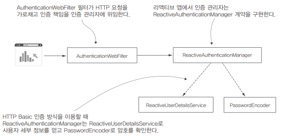

# 19장. 리액티브 앱을 위한 스프링 시큐리티

리액티브 앱(Reactive Application)은 비동기적이고 빠르게 변화하는 데이터 스트림에 대해 효율적으로 처리하고 반응하는 애플리케이션입니다.  
이러한 앱은 주로 리액티브 프로그래밍 패러다임을 기반으로 개발됩니다.  
 - 비동기성 (Asynchronicity): 리액티브 앱은 비동기 프로그래밍을 사용하여 데이터 스트림을 블로킹하지 않고 비동기적으로 처리합니다. 이를 통해 앱은 더 높은 확장성을 가지며 여러 요청 및 이벤트를 동시에 처리할 수 있습니다.
 - 데이터 스트림 처리: 리액티브 앱은 데이터 스트림을 중심으로 작동합니다. 이러한 스트림은 이벤트 스트림, 센서 데이터, 웹 소켓 통신, 메시징 시스템 등 다양한 소스에서 유래할 수 있습니다. 리액티브 앱은 이러한 데이터 스트림을 효과적으로 처리하고 변환합니다.
 - 반응성 (Responsiveness): 리액티브 앱은 데이터 스트림에 신속하게 반응할 수 있어야 합니다. 사용자 요청 또는 외부 이벤트에 빠르게 응답하여 지연 시간을 최소화하며 사용자 경험을 향상시킵니다.
 - 탄력성 (Elasticity): 리액티브 앱은 부하에 따라 자동으로 확장 및 축소할 수 있어야 합니다. 이를 통해 앱은 변화하는 요구 사항에 대응하고 확장성을 확보할 수 있습니다.
 - 메시지 주도 (Message-Driven): 리액티브 앱은 이벤트 또는 메시지 주도 방식을 사용하여 컴포넌트 간 통신을 관리합니다. 메시지 큐나 이벤트 버스와 같은 메커니즘을 활용하여 비동기적으로 상호작용합니다.

<br/>

## 스프링 리액티브 주요 구성 요소

 - Mono
    - Mono는 리액티브 프로그래밍에서 사용되는 데이터 스트림의 일종입니다.
    - Mono는 0개 또는 1개의 데이터 항목을 포함하며, 성공적으로 완료되거나 에러가 발생할 수 있습니다.
    - 주로 단일 값 또는 결과를 처리할 때 사용됩니다.
 - Flux
    - Flux는 Mono와 비슷하게 데이터 스트림을 나타내지만, 0개 이상의 데이터 항목을 포함할 수 있습니다.
    - Flux는 여러 개의 데이터 항목을 처리하거나 시퀀스를 표현할 때 사용됩니다.
    - Flux는 스트리밍 데이터를 다루는 데 유용하며, 무한한 데이터 스트림도 처리할 수 있습니다.
 - Publisher (발행자)
    - Publisher는 리액티브 스트림의 생산자 역할을 합니다.
    - 데이터 스트림을 생성하고 데이터를 발행하는 주체입니다.
    - Publisher는 0개 또는 여러 개의 구독자에게 데이터를 발행하고, 이를 통해 비동기적으로 데이터를 전달합니다.
 - Subscriber (구독자)
    - Subscriber는 Publisher로부터 데이터 스트림을 구독하는 소비자 역할을 합니다.
    - 구독자는 데이터를 비동기적으로 수신하고, onNext(), onError(), onComplete()와 같은 메서드를 사용하여 데이터 스트림에서 이벤트를 처리합니다.

<br/>

## 리액티브 앱 사용자 관리

AuthenticationWebFilter는 요청을 가로채고 인증 책임을 ReactiveAuthenticationManager에 위임한다.  
인증 논리에 사용자 암호가 이용되는 경우 ReactiveAuthenticationManager는 ReactiveUserDetailsService로 사용자 세부 정보를 얻고 PasswordEncoder로 암호를 확인한다.  

인증 프로세스가 정상적으로 완료되면 ReactiveAuthenticationManager는 AuthenticationWebFilter에 Authentication 객체를 반환한다.  
AuthenticationWebFilter는 권한 부여에 이용할 수 있도록 SecurityContext(ReactiveSecurityContextHolder)에 Authentication 인스턴스를 저장한다.

<div align="center">
    
</div>

 - ProjectConfig
    - MapReactiveUserDetailsService는 InMemoryUserDetailsManager와 마찬가지로 메모리에 사용자 세부 정보를 저장한다.
```Java
@Configuration
public class ProjectConfig {

    @Bean
    public ReactiveUserDetailsService userDetailsService() {
        var user = User.withUsername("john")
                .password("12345")
                .authorities("read")
                .build();

        return new MapReactiveUserDetailsService(user);
    }

    @Bean
    public PasswordEncoder passwordEncoder() {
        return NoOpPasswordEncoder.getInstance();
    }
}
```

 - HelloController
```Java
@RestController
public class HelloController {

    @GetMapping("/hello")
    public Mono<String> hello(Mono<Authentication> auth) {
        Mono<String> message = auth.map(a -> "Hello " + a.getName());
        return message;
    }

    @GetMapping("/hello2")
    public Mono<String> hello2() {
        Mono<String> message =
                ReactiveSecurityContextHolder.getContext()
                        .map(context -> context.getAuthentication())
                        .map(auth -> "Hello " + auth.getName());
        return message;
    }
}
```

<br/>

## 리액티브 앱에서 권한 부여 규칙 구성

스프링 시큐리티 MVC 관련 구성은 WebSecurityConfigurerAdapter 클래스를 재정의해 구성할 수 있다.  
하지만, 리액티브 앱에서 스프링 시큐리티는 SecurityWebFilterChain 형식의 빈을 스프링 컨텍스트에 추가하여 구성한다.  

 - ProjectConfig
    - 권한 부여 구성은 authorizeExchange() 메서드 호출로 시작한다.
    - pathMatchers()는 mvcMatchers()와 동일하다.
    - permitAll(), denyAll(), hasRole(), hasAnyRole(), hasAuthority(), hasAnyAuthority() 모두 동일하게 사용할 수 있다.
    - 리액티브에서는 anyRequest()나 authorizeRequests()가 아닌 anyExchange(), authorizeExchange()를 사용한다. 리액티브 방식에서는 두 구성 요소 간의 의사소통을 보통 데이터 교환이라고 한다. 교환이라는 용어는 데이터를 한 요청에 큰 묶음으로 전달하지 않고 연속 스트림으로 분할해서 전송하는 그림을 더 잘 나타낸다.
```Java
@Configuration
public class ProjectConfig {

    @Bean
    public ReactiveUserDetailsService userDetailsService() {
        var  user = User.withUsername("john")
                .password("12345")
                .authorities("read")
                .build();

        return new MapReactiveUserDetailsService(user);
    }

    @Bean
    public PasswordEncoder passwordEncoder() {
        return NoOpPasswordEncoder.getInstance();
    }

    @Bean
    public SecurityWebFilterChain securityWebFilterChain(ServerHttpSecurity http) {
        return http.authorizeExchange() // 엔드포인트 권한 부여 구성 시작
                .pathMatchers(HttpMethod.GET, "/hello").authenticated()
                .anyExchange().permitAll()
                    .and()
                .httpBasic()
                    .and()
                .build();
    }
}
```

 - HelloController
```Java
@RestController
public class HelloController {

    @GetMapping("/hello")
    public Mono<String> hello(Mono<Authentication> auth) {
        Mono<String> message = auth.map(a -> "Hello " + a.getName());
        return message;
    }

    @GetMapping("/ciao")
    public Mono<String> ciao() {
        return Mono.just("Ciao!");
    }
}
```

 - ProjectConfig
    - access() 메서드를 호출하면서 Authentication 객체와 AuthorizationContext로 요청에 관한 가능한 모든 세부 정보를 받는 함수를 지정한다.
        - Authentication 객체는 사용자 이름, 역할, 권한과 인증 논리를 구현한 방법에 따라 다른 맞춤형 세부 정보를 포함하는 인증된 사용자 정보를 얻을 수 있다.
        - AuthorizationContext는 경로, 헤더, 쿼리 매개 변수, 쿠키 등 요청에 관한 정보를 제공한다.
        - access() 메서드에 매개 변수로 지정하는 함수는 AuthorizationDecision 형식의 객체를 반환해야 한다. (앱에 요청이 허용되는지 알려주는 역할)
```Java
@Configuration
public class ProjectConfig {

    @Bean
    public ReactiveUserDetailsService userDetailsService() {
        var user = User.withUsername("john")
                .password("12345")
                .roles("ADMIN")
                .build();

        return new MapReactiveUserDetailsService(uuser);
    }

    @Bean
    public PasswordEncoder passwordEncoder() {
        return NoOpPasswordEncoder.getInstance();
    }

    @Bean
    public SecurityWebFilterChain securityWebFilterChain(ServerHttpSecurity http) {
        return http.authorizeExchange()
                .anyExchange().access(this::getAuthorizationDecisionMono)
                    .and()
                .httpBasic()
                    .and()
                .build();
    }

    private Mono<AuthorizationDecision> getAuthorizationDecisionMono(
            Mono<Authentication> a,
            AuthorizationContext c) {

        String path = getRequestPath(c);

        boolean restrictedTime = LocalTime.now().isAfter(LocalTime.NOON);

        if (path.equals("/hello")) {
            return  a.map(isAdmin())
                     .map(auth -> auth && !restrictedTime)
                     .map(AuthorizationDecision::new);
        }

        return Mono.just(new AuthorizationDecision(false));
    }

    // 요청 경로 반환 함수
    private String getRequestPath(AuthorizationContext c) {
        return c.getExchange()
                .getRequest()
                .getPath()
                .toString();
    }

    // ADMIN 역할이 있으면 true 반환
    private Function<Authentication, Boolean> isAdmin() {
        return p ->
              p.getAuthorities().stream()
                .anyMatch(e -> e.getAuthority().equals("ROLE_ADMIN"));
    }
}
```

<br/>

## 리액티브 앱에 메서드 보안 적용

리액티브 메서드 보안은 아직 성숙한 구현이 아니며, @PreAuthorize, @PostAuthorize 어노테이션 만을 사용할 수 있다.  


 - ProjectConfig
```Java
@Configuration
@EnableReactiveMethodSecurity // 리액티브 메서드 보안 기능 활성화
public class ProjectConfig {

    @Bean
    public ReactiveUserDetailsService userDetailsService() {
        var  user1 = User.withUsername("john")
                .password("12345")
                .roles("ADMIN")
                .build();

        var  user2 = User.withUsername("bill")
                .password("12345")
                .roles("REGULAR_USER")
                .build();

        return new MapReactiveUserDetailsService(user1, user2);
    }

    @Bean
    public PasswordEncoder passwordEncoder() {
        return NoOpPasswordEncoder.getInstance();
    }

}
```

 - HelloController
```Java
@RestController
public class HelloController {

    @GetMapping("/hello")
    @PreAuthorize("hasRole('ADMIN')")
    public Mono<String> hello() {
        return Mono.just("Hello!");
    }

}
```

<br/>

## 리액티브 앱과 OAuth 2

권한 부여 서버에서 공개한 공개 키로 토큰 서명을 검증하는 리소스 서버를 구성한다고 가정한다.  

 - pom.xml
```XML
    <dependencies>
        <dependency>
            <groupId>org.springframework.boot</groupId>
            <artifactId>spring-boot-starter-oauth2-resource-server</artifactId>
        </dependency>
        <dependency>
            <groupId>org.springframework.boot</groupId>
            <artifactId>spring-boot-starter-security</artifactId>
        </dependency>
        <dependency>
            <groupId>org.springframework.boot</groupId>
            <artifactId>spring-boot-starter-webflux</artifactId>
        </dependency>
        <dependency>
            <groupId>org.springframework.cloud</groupId>
            <artifactId>spring-cloud-starter-oauth2</artifactId>
        </dependency>
        ..
    </dependencies>
```

 - HelloController
```Java
@RestController
public class HelloController {

    @GetMapping("/hello")
    public Mono<String> hello() {
        return Mono.just("Hello!");
    }

}
```

 - ProjectConfig
    - httpBasic() 대신 oauth2ResourceServer() 메서드를 호출하고, jwt() 메서드를 호출해 이용할 토큰의 종류를 지정하고 Customizer 객체로 토큰 서명을 검증하는 방법을 지정한다.
```Java
@Configuration
public class ProjectConfig {

    @Value("${jwk.endpoint}")
    private String jwkEndpoint;

    @Bean
    public SecurityWebFilterChain securityWebFilterChain(ServerHttpSecurity http) {
        return http
                .authorizeExchange()
                    .anyExchange().authenticated()
                .and()
                .oauth2ResourceServer() // 리소스 서버 인증 메서드 구성
                    .jwt(jwtSpec -> { // 토큰을 검증하는 방법 지정
                        jwtSpec.jwkSetUri(jwkEndpoint);
                    })
                .and()
                .build();

    }
}
```
