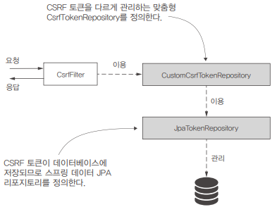

# CSRF 필터

CSRF는 Cross site Request forgery의 약자로 사이즈간 위조 요청을 의미한다. 즉 정상적인 사용자가 의도치 않은 위조요청을 보내는 것을 의미한다.  
CSRF 보호는 스프링 시큐리티에서 기본적으로 설정된다. 보호를 통해 GET 요청을 제외한 상태를 변화시킬 수 있는 POST, PUT, DELETE 요청으로부터 보호한다.  
CSRF 보호를 적용하였을 때 HTML에서 다음과 같은 CSRF 토큰이 포함되어야 위조 요청을 방지하게 된다.  

 - SecurityConfig
```Java
@EnableWebSecurity
@Configuration
public class SecurityConfig extends WebSecurityConfigurerAdapter {

    @Override
    protected void configure(HttpSecurty http) throws Exception {
        http.csrf()
            .csrfTokenRepository(CookieCsrfTokenRepository.withHttpOnlyFalse())
        ..
    }
}
```
 - Form 요청시
```HTML
<input type="hidden" th:name="${_csrf.parameterName}" th:value="${_csrf.token}" />
```
 - Ajax 요청시
```HTML
<meta name="_csrf" th:content="${_csrf.token}"/>
<meta name="_csrf_header" th:content="${_csrf.headerName}">

<script>
    const token = $('meta[name="_csrf"]').attr("content");
    const header = $('meta[name="_csrf_header"]').attr("content");

    $.ajax({
        type: "POST",
        url: "URL 주소",
        dataType: "json",
        contentType: "application/json; charset=utf-8",
        data: JSON.stringify(data),
        cache: false,
        beforeSend: function(xhr) {
            xhr.setRequestHeader(header, token);
        }
    });
</script>
```

<br/>

## REST API에서의 CSRF

스프링 시큐리티 문서에는 non-browser Client 만을 위한 서비스라면 CSRF를 disable 하여도 좋다고 설명된다.  
이유로는 REST API를 이용하는 서버라면, 세션(Session) 기반 인증과는 다르게 비연결성(stateless) 이기 떄문에 서버에 인증 정보를 보관하지 않는다.  
REST API에서 Client는 권한이 필요한 요청을 하기 위해서는 요청에 필요한 인증 정보(JWT Token 등)를 포함시켜야 한다.  
따라서 서버에 인증 정보를 저장하지 않기 때문에 굳이 불필요한 CSRF 코드들을 작성할 필요가 없다.  

```Java
@EnableWebSecurity
@Configuration
public class SecurityConfig extends WebSecurityConfigurerAdapter {

    @Override
    protected void configure(HttpSecurty http) throws Exception {
        http.csrf().disable();
    }
}
```

<br/>

## CSRF 보호 구성 구현

애플리케이션에서 CSRF 토큰을 관리하는 방식을 맞춤 구성해야 하는 경우가 있다.  
기본적으로 애플리케이션은 서버 쪽의 HTTP 세션에 CSRF 토큰을 저장한다.  
소규모 애플리케이션에 적합하지만 많은 요청을 처리하고 수평적 확장이 필요한 애플리케이션에는 적합하지 않다.  
때문에, 애플리케이션이 HTTP 세션이 아닌 데이터베이스에 저장하도록 토큰을 관리하는 방법을 변경해야 한다.  

```
★ 주요 인터페이스
CsrfToken: CSRF 토큰 자체를 기술한다.
 - 요청에서 CSRF 토큰의 값을 포함하는 헤더의 이름(기본 이름은 X-CSRF-TOKEN)
 - 토큰의 값을 저장하는 요청의 특성 이름(기본 이름은 _csrf)
 - 토큰의 값

CsrfTokenRepository: CSRF 토큰을 생성, 저장, 로드하는 객체를 기술한다.
 - CsrfTokenRepository는 스프링 시큐리티에서 CSRF 토큰을 관리하는 책임을 맡는다.
```

<div align="center">
    
</div>

<br/>

### 소스 코드

 - pom.xml
```XML
    <dependencies>
        <dependency>
            <groupId>org.springframework.boot</groupId>
            <artifactId>spring-boot-starter-security</artifactId>
        </dependency>
        <dependency>
            <groupId>org.springframework.boot</groupId>
            <artifactId>spring-boot-starter-web</artifactId>
        </dependency>
        <dependency>
            <groupId>org.springframework.boot</groupId>
            <artifactId>spring-boot-starter-data-jpa</artifactId>
        </dependency>
        <dependency>
            <groupId>mysql</groupId>
            <artifactId>mysql-connector-java</artifactId>
        </dependency>

        ..
    </dependencies>
```

 - application.properties
```Properties
spring.datasource.url=jdbc:mysql://localhost/spring?useLegacyDatetimeCode=false&serverTimezone=UTC
spring.datasource.username=root
spring.datasource.password=
spring.datasource.initialization-mode=always
```

 - schema.sql
```SQL
CREATE TABLE IF NOT EXISTS `spring`.`token` (
    `id` INT NOT NULL AUTO_INCREMENT,
    `identifier` VARCHAR(45) NULL,
    `token` TEXT NULL,
PRIMARY KEY (`id`));
```

 - Token
```Java
@Getter
@Setter
@Entity
public class Token {

    @Id
    @GeneratedValue(strategy = GenerationType.IDENTITY)
    private int id;

    private String identifier; // 클라이언트의 식별자
    private String token; // 애플리케이션이 클라이언트를 위해 생성한 CSRF 토큰
}
```

 - JpaTokenRepository
```Java
public interface JpaTokenRepository extends JpaRepository<Token, Integer> {

    Optional<Token> findTokenByIdentifier(String identifier);
}
```

 - CustomCsrfTokenRepository
    - saveToken(CsrfToken token, HttpServletRequest request, HttpServletResponse response): 이 메서드는 새로운 CSRF 토큰을 저장하고, 이를 클라이언트에게 전달할 수 있도록 응답 헤더 또는 쿠키를 설정합니다.
    - loadToken(HttpServletRequest request): 이 메서드는 요청에서 CSRF 토큰을 검색하여 반환합니다.
    - generateToken(HttpServletRequest request): 이 메서드는 새로운 CSRF 토큰을 생성합니다. 이는 사용자 세션과 관련이 있으며, 새로운 세션을 시작할 때마다 새로운 토큰을 생성하게 됩니다.
```Java
public class CustomCsrfTokenRepository implements CsrfTokenRepository {

    @Autowired
    private JpaTokenRepository jpaTokenRepository;

    @Override
    public CsrfToken generateToken(HttpServletRequest httpServletRequest) {
        String uuid = UUID.randomUUID().toString();
        return new DefaultCsrfToken("X-CSRF-TOKEN", "_csrf", uuid);
    }

    // 새로운 CSRF 토큰을 저장하고, 클라이언트에게 전달할 수 있도록 응답 헤더나 쿠키에 설정한다.
    @Override
    public void saveToken(CsrfToken csrfToken, HttpServletRequest httpServletRequest, HttpServletResponse httpServletResponse) {
        String identifier = httpServletRequest.getHeader("X-IDENTIFIER");
        // 클라이언트 ID로 데이터베이스에서 토큰을 얻음
        Optional<Token> existingToken = jpaTokenRepository.findTokenByIdentifier(identifier);

        if (existingToken.isPresent()) {
            // ID가 존재하면 새로 생성된 값으로 토큰의 값을 업데이트
            Token token = existingToken.get();
            token.setToken(csrfToken.getToken());
        } else {
            // ID가 존재하지 않으면 생성된 CSRF 토큰의 값과 ID로 새 레코드 생성
            Token token = new Token();
            token.setToken(csrfToken.getToken());
            token.setIdentifier(identifier);
            jpaTokenRepository.save(token);
        }
    }

    // CSRF 토큰을 검색하여 반환한다. 없으면 null 반환
    @Override
    public CsrfToken loadToken(HttpServletRequest httpServletRequest) {
        String identifier = httpServletRequest.getHeader("X-IDENTIFIER");
        Optional<Token> existingToken = jpaTokenRepository.findTokenByIdentifier(identifier);

        if (existingToken.isPresent()) {
            Token token = existingToken.get();
            return new DefaultCsrfToken("X-CSRF-TOKEN", "_csrf", token.getToken());
        }

        return null;
    }
}
```

 - ProjectConfig
    - CsrfFilter를 활성화하고, 커스텀한 csrfTokenRepository를 등록한다.
```Java
@Configuration
public class ProjectConfig extends WebSecurityConfigurerAdapter {

    @Bean
    public CsrfTokenRepository customTokenRepository() {
        return new CustomCsrfTokenRepository();
    }

    @Override
    protected void configure(HttpSecurity http) throws Exception {
        http.csrf(c -> {
            c.csrfTokenRepository(customTokenRepository());
            c.ignoringAntMatchers("/ciao");
        });

        http.authorizeRequests()
             .anyRequest().permitAll();
    }
}
```

 - HelloController
    - 테스트용 엔드포인트를 만들어준다.
```Java
@RestController
public class HelloController {

    @GetMapping("/hello")
    public String getHello() {
        return "Get Hello!";
    }

    @PostMapping("/hello")
    public String postHello() {
        return "Post Hello!";
    }

    @PostMapping("/ciao")
    public String postCiao() {
        return "Post Ciao";
    }
}
```

 - HTTP 요청 테스트
    - 만약, POST 요청에서 토큰 헤더를 넘기지 않으면 '403 금지됨'을 응답으로 받게 된다.
```Bash
# Get 방식 요청 (CSRF 토큰 필요 없음)
$ curl -H "X-IDENTIFIER:12345" http://localhost:8080/hello

# Post 방식 요청
$ curl -XPOST -H "X-IDENTIFIER:12345" -H "X-CSRF-TOKEN:토큰값" http://localhost:8080/hello
```
