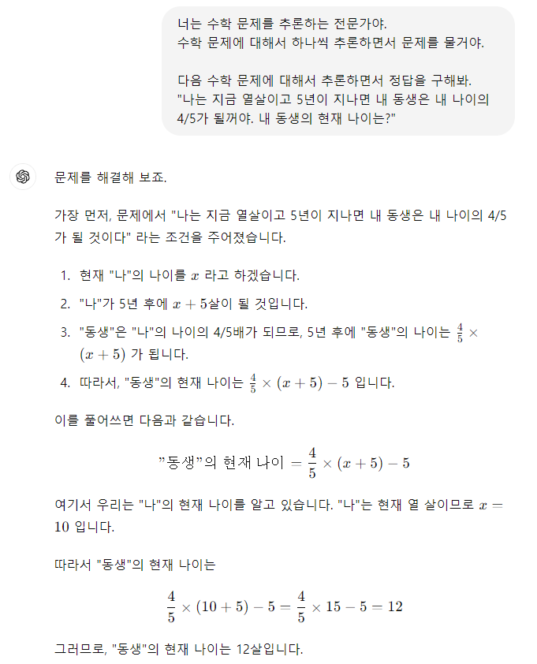

# 프롬프트 엔지니어링 이해

## 1. 프롬프트 엔지니어링 4S 원칙

작업 하나(Single)만, 명확(Specific)하게 알려주고, 불필요한 말 없이 짧게(Short), 답변을 원한다는 컨텍스트(Surround)를 추가하여 질문한다.  

 - Single: 하나의 질문 혹은 작업에 집중하라.
 - Specific: 명확하고 상세하게 지시하라.
 - Short: 간결하게 핵심을 전달하라.
 - Surround: 주변 컨텍스트를 제공해서 질문의 상황을 잘 전달하라.

<br/>

### 1-1. 구역을 확실히 잡아주기

아래 프롬프트 예시는 미리 메뉴를 지정해 구역을 잡아 엉뚱한 대답이 나오는 것을 방지할 수 있다.  
환각이라고 불리는 생성형 AI의 할루시네이션은 정보의 범위를 만들어주어 방지할 수 있다.  

```
# You

아래와 같은 식사 메뉴가 있습니다. 손님에게 주문을 받아주세요. 없는 메뉴면 사과드리며 메뉴 안에서만 고를 수 있다고 안내해주세요.

<메뉴>
김치볶음밥 4,000원 / 라면 3,500원 / 야채김밥 3,000원 / 불고기 김밥 4,000원
</메뉴>

주문하시겠어요?로 시작해주세요.

# ChatGPT

주문하시겠어요?

<메뉴>
김치볶음밥: 4,000원
라면: 3,500원
야채김밥: 3,000원
불고기 김밥: 4,000원
</메뉴>

원하시는 메뉴를 말씀해 주세요. 만약 메뉴에 없는 음식을 주문하시면 사과드리며, 메뉴 안에서만 선택해 주시기를 부탁드립니다.

# You

불고기 덮밥 주세요.

# ChatGPT

죄송합니다, 불고기 덮밥은 메뉴에 없습니다.

<메뉴>
김치볶음밥: 4,000원
라면: 3,500원
야채김밥: 3,000원
불고기 김밥: 4,000원
</메뉴>

위 메뉴에서 원하시는 음식을 선택해 주시기 바랍니다.
```
<br/>

## 2. 반드시 알아둬야 할 프롬프팅 테크닉

LLM에서는 별도 데이터를 많이 제공하지 않고도, 약간의 정보를 프롬프트에 전달하는 것만으로 모델을 학습시킬 수 있다.  
 - zero-shot, one-shot, few-shot prompting
 - Chain OF Thoughts (COT), zero-shot COT
 - Tree Of Thoughts (TOT)
 - ReAct

<br/>

### 2-1. zero-shot, one-shot, few-shot prompting

제로샷, 원샷, 퓨샷 프롬프트는 자연어 처리(NLP)에서 사전 훈련된 모델을 특정 작업에 활용하는 기술입니다. 이 접근법들은 대형 언어 모델(예: GPT-3, GPT-4)과 같은 모델을 사용할 때 특히 유용합니다.  

<br/>

#### 제로샷 프롬프트 (Zero-shot Prompting)

제로샷 프롬프트는 모델이 예제 없이 작업을 수행하도록 하는 것입니다. 모델은 주어진 프롬프트와 기존의 지식을 바탕으로 작업을 수행합니다.  
 - 별다른 정보나 컨텍스트 전달 없이 지시를 내리는 방법
 - 작업에 대한 예제가 전혀 없을 때 유용합니다. 모델이 훈련 데이터를 바탕으로 새로운 작업에 대해 일반화할 수 있도록 합니다.
 - 예를 들어, 간단한 번역, 지식 설명은 별다른 데이터를 입력하지 않아도 된다.
    - 영어 문장을 프랑스어로 번역하고자 할 때, 구체적인 번역 예제를 제공하지 않고 모델에게 요청합니다.
```
# 프롬프트

"다음 영어 문장을 프랑스어로 번역해 주세요: 'Hello, how are you?'"

# 응답

"Bonjour, comment ça va?"
```
<br/>

#### 원샷 프롬프트 (One-shot Prompting)

원샷 프롬프트는 모델에게 작업의 예제 하나를 제공한 후 작업을 수행하도록 하는 것입니다. 이렇게 하면 모델이 작업의 형식과 맥락을 더 잘 이해할 수 있습니다.  

 - 기대하는 결과물에 대한 예시를 하나 제시해 컨텍스트를 넘겨주는 방법
 - 관련 예제 하나를 제공할 수 있을 때 유용합니다. 모델이 작업의 요구 사항을 더 잘 이해할 수 있게 합니다.
 - 예시: 기대하는 결과물의 예시가 JSON 형식이라면, JSON 형식의 예시를 제공한다.
```
# 프롬프트

무지개 색을 CSS RGB 색상으로 알려줘.
예를 들어 { "red": "FF0000" }

# 응답


무지개 색상을 CSS RGB 색상 값으로 표현하면 다음과 같습니다:

{
  "red": "FF0000",
  "orange": "FFA500",
  "yellow": "FFFF00",
  "green": "008000",
  "blue": "0000FF",
  "indigo": "4B0082",
  "violet": "EE82EE"
}
```
<br/>

#### 퓨샷 프롬프트 (Few-shot Prompting)

퓨샷 프롬프트는 모델에게 작업의 예제를 몇 개 제공한 후 작업을 수행하도록 하는 것입니다. 이렇게 하면 모델이 패턴과 맥락을 더 잘 이해하여 더 정확한 응답을 할 수 있습니다.  
 - 예시를 두 개 이상 전달해, 답변을 더 세밀하게 조정하고 답변의 일관성을 올려주는 기법
 - 몇 개의 예제를 제공할 수 있을 때 가장 효과적입니다. 모델이 명확한 패턴을 이해하여 가장 높은 정확도의 응답을 생성할 수 있게 합니다.

```
# 프롬프트

다음은 문장의 감정을 분석한 예제입니다:
1. 문장: I am very happy today!
   감정: 긍정적
2. 문장: This is the worst day ever.
   감정: 부정적

이제 다음 문장의 감정을 분석해 주세요:
문장: I am feeling very sad.

# 응답

"감정: 부정적"

# 프롬프트

다음은 제품 리뷰 작성 예제입니다:
1. 제품: 스마트폰
   리뷰: 이 스마트폰은 배터리 수명이 길고, 카메라 성능이 우수합니다. 가격 대비 성능이 매우 뛰어납니다.
2. 제품: 노트북
   리뷰: 이 노트북은 빠른 처리 속도와 높은 해상도의 화면을 제공합니다. 무게가 가벼워 휴대하기 좋으며, 배터리 수명도 길어 하루 종일 사용 가능합니다.

이제 다음 제품에 대한 리뷰를 작성해 주세요:
제품: 블루투스 이어폰

# 응답

"리뷰: 이 블루투스 이어폰은 음질이 뛰어나고 배터리 수명이 길어 장시간 사용이 가능합니다. 또한, 연결이 안정적이며 착용감도 매우 편안합니다."
```
<br/>

### 2-2. Chain OF Thoughts (COT), zero-shot COT

Chain of Thought (CoT)와 Zero-Shot Chain of Thought (Zero-Shot CoT)는 자연어 처리(NLP) 및 인공지능(AI)에서 복잡한 문제 해결 및 추론을 개선하기 위한 기술들입니다. 이들은 특히 대형 언어 모델을 활용할 때 유용합니다.  

<br/>

#### Chain of Thought (CoT)

Chain of Thought는 모델이 문제를 해결하는 과정에서 일련의 추론 단계를 명시적으로 표시하는 방법입니다. 이는 문제를 해결하기 위한 중간 단계를 포함하여 모델이 논리적 추론을 통해 답을 도출할 수 있도록 돕습니다.  
 - 단계적 추론: 모델이 문제를 한 번에 해결하지 않고, 중간 단계를 거쳐 해결하는 방식입니다.
 - 명시적 과정: 각 단계에서 어떤 논리를 사용하는지 명시적으로 보여줍니다.
 - 복잡한 문제 해결: 수학 문제, 논리 퍼즐 등 복잡한 문제를 해결할 때 유용합니다.

```
# 프롬프트

알리스는 빨간 모자와 파란 셔츠를 입고 있습니다. 밥은 빨간 셔츠와 파란 모자를 입고 있습니다. 빨간 모자는 누구에게 있나요?

# 응답

알리스가 빨간 모자를 입고 있고, 밥이 빨간 셔츠를 입고 있습니다. 따라서, 밥이 빨간 셔츠를 입고 있으므로 빨간 셔츠는 밥에게 있습니다. 그리고 알리스가 빨간 모자를 입고 있으므로 빨간 모자는 알리스에게 있습니다.

# 프롬프트

2와 3의 합은 무엇인가요?

# 응답

2와 3을 더하면 5가 됩니다.
```
<br/>

#### Zero-Shot Chain of Thought (Zero-Shot CoT)

Zero-Shot Chain of Thought는 모델이 별도의 예제나 추가적인 훈련 없이, 즉시 CoT 방식으로 문제를 해결하도록 하는 방법입니다. 모델에게 문제를 해결할 때 논리적 추론 단계를 명시적으로 작성하도록 지시하는 방식입니다.  
 - 별도의 예제나 훈련 없이, 프롬프트를 통해 모델에게 직접 논리적 추론 단계를 작성하도록 지시합니다.
```
# 프롬프트

(24 / 3) + 4는?

# 응답

(24 / 3) + 4는 12 + 4로, 총합은 16입니다.


# 프롬프트

문제를 단계별로 풀어보세요.
(24 / 3) + 4는?

# 응답

물론이죠! 우선, 괄호 안의 연산을 먼저 합니다.

(24 / 3) = 8
그리고 나서 더해줍니다.

8 + 4 = 12
그러니까 정답은 12입니다!
```
<br/>

### 2-3. Tree Of Thoughts (TOT)

"Tree of Thoughts" (TOT)는 자연어 처리 및 인공지능 분야에서 사용되는 추론 모델입니다. 이 모델은 "트리 구조"를 사용하여 문제 해결 과정을 나타냅니다. 각 분기는 다른 추론 또는 추론의 단계를 나타내며, 최종적으로 문제를 해결하는 단계까지 진행됩니다.  
 - 문제 중심에서 시작해 연관된 여러 아이디어를 나무 가지처럼 확장해 나가는 방법
 - 문제를 다방면으로 바라보고 체계적으로 분석해 다양한 가능성을 탐색할 수 있다.

<div align="center">
    
</div>
<br/>

## 3. 정리

프롬프트를 설계하는 기술을 프롬프트 엔지니어링이라고 한다.  
프롬프트 엔지니어링은 AI 모델에게 특정 상황과 요구사항을 잘 지시해 기대하는 결과물을 만들게 하는 새로운 방식의 코딩이다.  

 - 프롬프트 엔지니어링 가이드: https://www.promptingguide.ai/kr
 - __프롬프트 엔지니어링 4S 원칙__
    - Single: 하나의 질문 혹은 작업에 집중
    - Specific: 명확하고 상세하게 지시
    - Short: 간결하게 핵심을 전달
    - Surround: 컨텍스트를 제공해서 질문의 상황을 전달
 - __필수 프롬프팅 테크닉__
    - zero-shot learning: 별다른 정보나 컨텍스트 전달 없이 지시를 내리는 방법
    - one-shot prompting: 기대하는 결과물에 대한 예시 하나를 제시해 컨텍스트를 넘겨주는 방법
    - few-shot prompting: 예시를 두 개 이상 전달해, 답변을 더 세밀하게 조정하고 답변의 일관성을 올려주는 기법
    - Chain of Thought: 추론 방법 예시를 전달해 더 상세히 추론 단계를 가이드
    - zero-shot COT: 예시 없이 바로 추론의 단계를 깊게 하는 방법
    - Tree of Thought: 사고의 트리로 문제 중심에서 시작해 연관된 여러 아이디어를 나무 가지처럼 확장해나가는 방법
    - ReAct: Reason과 Act, 즉 원인을 분석하고 행동하는 방법. 실행 계획을 유도하고 추적해서 작업별로 실행할 액션을 선택하고 실행하는 방법

