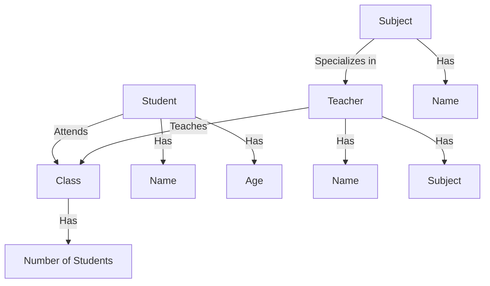
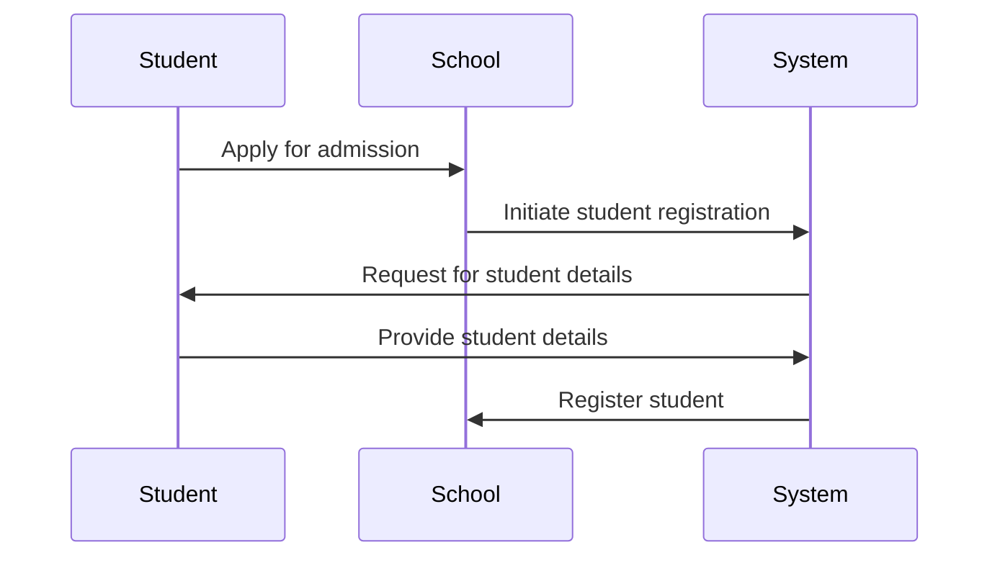
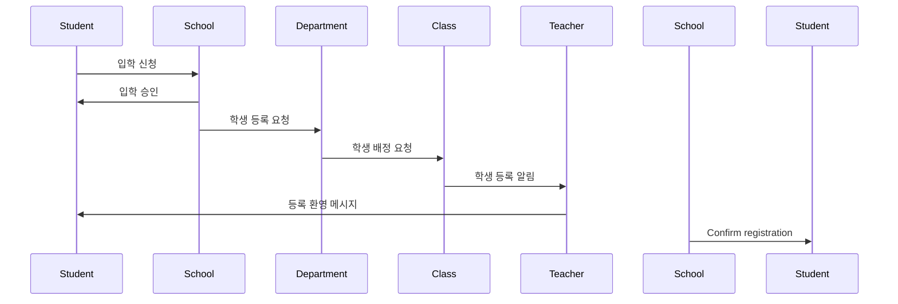

# DB 스키마 설계, 쿼리 생성, 시각화하기

## 데이터베이스 스키마와 쿼리 설계

 - `README.md`
    - 정의하고 하는 시나리오를 README.md 파일에 정리
    - 시나리오를 적을 때는 최대한 자세하게 컨텍스트를 넘겨야 좋은 품질의 결과물이 나온다.
```
# README.md
학교 시스템을 DB로 만들고 싶습니다. 
학년은 총 1학년부터 6학년까지 있으며 한 반에 학생은 30명이 있습니다.  한 학년당 반의 수는 조금씩 다르지만 4~6개 정도가 있습니다. 각 반에는 선생님이 담임 선생님으로 있으며 선생님들은 각 주요과목을 하나씩 담당하고 있습니다. 이 학교에서 다루는 주요 과목은 "수학" "국어" "영어" "체육" "음악" "과학" "사회" "도덕" 입니다. 
```
<br/>

 - `ddl.sql`
    - ddl.sql 파일을 생성하고 프롬프트 요청
```
[시나리오]
학교 시스템을 DB로 만들고 싶습니다. 
학년은 총 1학년부터 6학년까지 있으며 한 반에 학생은 30명이 있습니다.  한 학년당 반의 수는 조금씩 다르지만 4~6개 정도가 있습니다. 각 반에는 선생님이 담임 선생님으로 있으며 선생님들은 각 주요과목을 하나씩 담당하고 있습니다. 이 학교에서 다루는 주요 과목은 "수학" "국어" "영어" "체육" "음악" "과학" "사회" "도덕" 입니다. 

위 시나리오를 담을 수 있는 DB 테이블 DDL을 작성해주세요.
```
<br/>

 - `결과물`
```sql
CREATE TABLE Teachers (
    teacher_id INT PRIMARY KEY,
    name VARCHAR(100),
    subject VARCHAR(50)
);

CREATE TABLE Classes (
    class_id INT PRIMARY KEY,
    grade INT,
    class_number INT,
    teacher_id INT,
    FOREIGN KEY (teacher_id) REFERENCES Teachers(teacher_id)
);

CREATE TABLE Students (
    student_id INT PRIMARY KEY,
    name VARCHAR(100),
    grade INT,
    class_id INT,
    FOREIGN KEY (class_id) REFERENCES Classes(class_id)
);

CREATE TABLE Subjects (
    subject_id INT PRIMARY KEY,
    name VARCHAR(50)
);

CREATE TABLE Grades (
    student_id INT,
    subject_id INT,
    grade INT,
    FOREIGN KEY (student_id) REFERENCES Students(student_id),
    FOREIGN KEY (subject_id) REFERENCES Subjects(subject_id),
    PRIMARY KEY (student_id, subject_id)
);
```
<br/>

## ERD로 데이터 시각화하기

ERD는 Entity Relationship Diagram의 약자로 각 엔티티들의 관계도로 그린 다이어그램이다.  
머메이드는 시각화와 도식화에 유리한 언어로 자주 사용된다.  

<br/>

```
 - README.md 파일에 프롬프트 입력
    - 위 시나리오와 'ddl.sql'을 참고하여 ERD를 mermaid 코드로 제공해주세요.

## 시나리오 
학교 시스템을 DB로 만들고 싶습니다. 
학년은 총 1학년부터 6학년까지 있으며 한 반에 학생은 30명이 있습니다.  한 학년당 반의 수는 조금씩 다르지만 4~6개 정도가 있습니다. 각 반에는 선생님이 담임 선생님으로 있으며 선생님들은 각 주요과목을 하나씩 담당하고 있습니다. 이 학교에서 다루는 주요 과목은 "수학" "국어" "영어" "체육" "음악" "과학" "사회" "도덕" 입니다. 

## ERD
 - mermaid / Github gist
```
<br/>

 - `mermaid 결과물`
```mermaid
erDiagram
    STUDENT ||--o{ CLASS : "attends" 
    TEACHER ||--o{ CLASS : "teaches"
    SUBJECT ||--o{ TEACHER : "specializes in"
    CLASS {
        string name
        int number_of_students
    }
    STUDENT {
        string name
        int age
    }
    TEACHER {
        string name
        string subject
    }
    SUBJECT {
        string name
    }
```
<br/>

## DFD로 시각화하기

DFFD는 Data Flow Diagram의 약자로 데이터의 흐름도를 보여주는 다이어그램이다.  
머메이드에서는 DFD도 지원하여 데이터가 프로세스나 시스템 내에서 어떻게 흘러가는지 시각화할 수 있다.  
 - 프롬프트: 시나리오에 대한 DFD Level 0 다이어그램을 그리는 mermaid 코드를 제공해주세요. 'ddl.sql' 파일을 참고해주세요. markdown에서 쓰일 예정입니다.


<br/>

## 시퀀스 다이어그램으로 시각화하기

 - 프롬프트: 위 시나리오에 대한 시퀀스 다이어그램을 mermaid 코드로 그려주세요. 학생이 학교에 입학하고 등록되는 과정을 시퀀스 다이어그램으로 그려주세요. 한글로 설명을 넣어주세요.


<br/>

## 정리

 - 협업하거나 코드나 데이터 운영성을 고려한다면 DFD, ERD 같은 문서화 혹은 시각화는 좋은 선택이다.
 - 머메이드는 시각화와 도식화에 유리한 언어이다. 머메이드를 사용해 ERD 코드를 만들고 나면 시각화는 깃허브 Gist에서 가능하다.
 - ERD는 Entity Relationship Diagram의 약자로 각 엔티티들의 관계도로 그린 다이어그램이다.
 - DFD는 Data Flow Diagram의 약자로 데이터의 흐름도이다. 데이터 프로세스나 시스템 정보가 어떻게 흘러가는지 나타낸다.
 - 깃허브 Gist는 별도의 레포지토리가 없더라도 바로 코드를 공유하고 바로 저장소에 저장할 수 있는 서비스이다.
