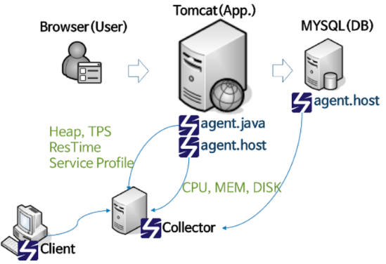
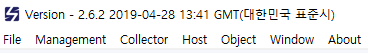
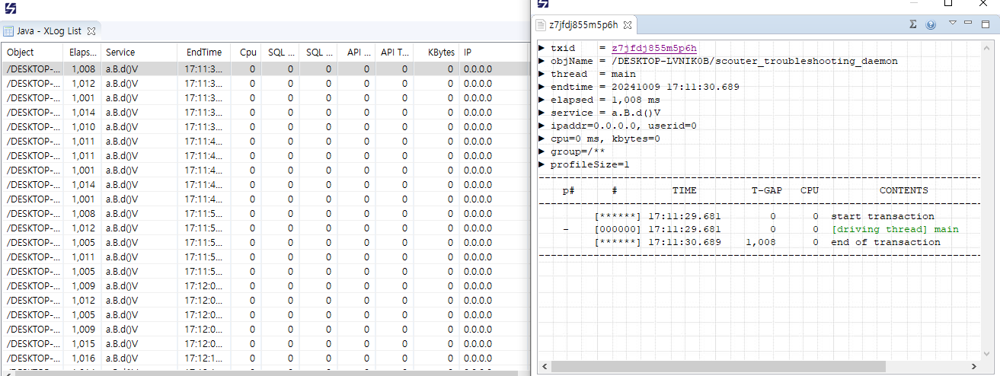
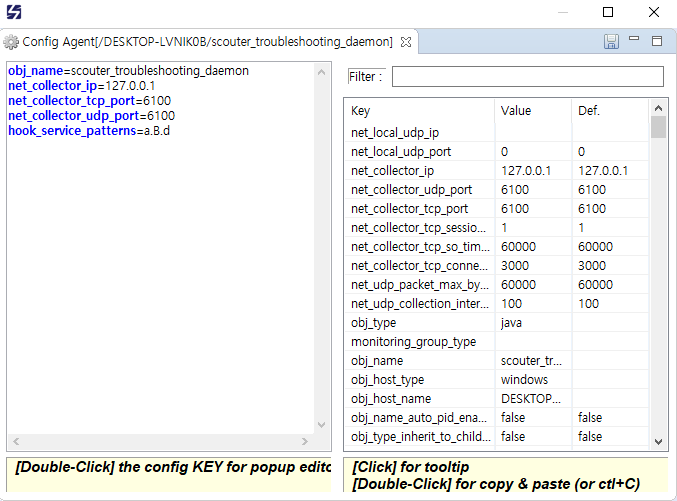
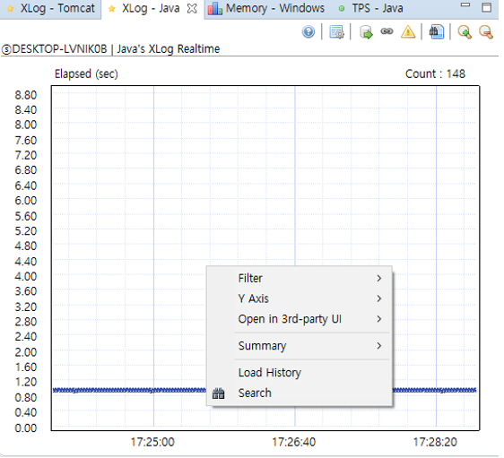

# scouter 살펴보기

## 1. scouter 개요 및 설치

### 1-1. APM

APM은 Application Performance Monitoring 혹은 Application Performance Management의 약자로 애플리케이션의 성능을 모니터링하고 관리하는 도구를 의미한다. APM을 사용하면 운영 중인 시스템을 모니터링하거나 성능 측정 시 병목 지점을 빠르게 찾을 수 있다.  

#### 상용 APM

 - 외산 APM
    - 다이나트레이스(dynatrace)
        - 컴퓨웨어 회사에서 제작 및 판매했지만, 현재는 별도의 다이나트레이스라는 회사를 설립하고 개발하고 있다.
        - 책이 출시된 2019년에는 AI까지 도입하여 자동으로 장애를 감지하는 기능까지 제공하고 있다.
        - 공식 사이트: http://www.dynatrace.com
    - 앱다이나믹스(AppDynamics)
        - 다이나트레이스의 기술 지원을 맡았던 이들이 나가서 만든 APM
        - 2019년 당시 시스코(Cisco)에 어마어마한 가격에 인수 합병되었다.
        - 공식 사이트: https://www.appdynamics.com
    - 뉴 레릭(New Relic)
        - 다양한 언어와 다양한 플러그인을 제공하는 APM
        - 공식 사이트: https://newrelic.com
    - 인스타나(instana)
        - 공식 사이트: https://www.instana.com
 - 국산 APM
    - 와탭(whatap)
        - 국내에서 유명한 제니퍼와 scouter를 만들었던 개발자가 제작하고 있는 클라우드용 APM으로, 자바뿐만 아니라 다양한 언어들도 모니터링이 가능하다.
        - 공식 사이트: https://www.whatap.io
    - 인터맥스(interMax)
        - DBMS를 모니터링하는 도구를 만들었던 엑셈에서 만든 APM
        - 공식 사이트: https://www.ex-em.com/product/intermax

#### 오픈소스 APM

 - 핀포인트(pinpoint)
    - 깃허브 주소: https://github.com/pinpoint-apm/pinpoint
    - 장점
        - 전반적인 시스템의 연계 현황을 한 눈에 확인할 수 있다.
        - 하나의 요청을 여러 서버에 걸쳐 처리할 경우, 마치 하나의 서버에서 처리한 것처럼 프로파일링된 결과를 확인할 수 있다.
        - 웹 기반의 UI로 어디서나 쉽게 상황을 모니터링할 수 있다.
    - 단점
        - 실시간 모니터링 기능이 약하다.
        - 화면을 사용자의 입맛대로 수정할 수 있는 기능이 존재하지 않는다.
        - 초당 처리량이 매우 많은 경우(하나의 인스턴스에서 약 1,000 TPS 이상) 성능 저하 및 문제가 발생할 수 있다. 따라서 적절한 샘플링 기능을 사용하여 운영 중인 서비스에 부하가 가지 않도록 하는 것을 권장한다.
 
가장 유명한 오픈소스 기반의 APM에는 scouter와 pinpoint가 있다. 핀포인트는 2012년부터 네이버에서 만든 오픈소스 APM이다.  
핀포인트는 자바 에이전트에서 데이터를 수집하여 중간에 있는 Collector로 보낸다. Collector 에서는 HBase에 그 정보를 저장하며, 화면에서는 분산되어 있는 HBase에 저장된 데이터를 읽어 사용자에게 제공한다.  

<div align="center">
    <br/>
    pinpoint 구성도
</div>
<br/>

 - 스카우터(scouter)
    - 깃허브 주소: https://github.com/scouter-project/scouter
    - 웹 기반 스카우터 깃허브 주소: https://github.com/mindplates/scouter-paper

스카우터는 약 2014년경부터 LG OOO에서 개발한, 자바 모니터링을 위한 오픈소스 프로젝트이다.

### 1-2. scouter 구성 및 방화벽 설정

에이전트는 데이터를 수집하여 scouter 서버로 데이터를 전송하는 역할을 한다. 수집 서버에서는 별도의 파일 기반의 저장소에 데이터를 저장한다. 저장한 데이터는 클라이언트를 통해서 확인할 수 있다.  
 - 스카우터의 저장소는 파일 기반 저장소로 별도의 공용 디스크를 연결하지 않는 이상 한 대의 서버에서만 데이터를 저장할 수 있는 구조가 기본이다. 이러한 단점을 보완하기 위해 scouter 2.5+ 부터는 집킨(zipkin) 이라는 아파치 분산 저장소를 활용하여 데이터를 저장할 수 있게 됐다.
    - 깃허브 주소: https://github.com/scouter-project/zipkin-scouter
    - 집킨 서버는 Spring Boot 기반 성능 모니터링을 위한 분산 저장 애플리케이션으로 사용 가능한 저장소로는 Cassandra, Elasticsearch 등이 있다.
 - __방화벽 설정__
    - 에이전트 -> 서버
        - 에이전트에서 서버 방향으로 TCP와 UDP 포트를 개방해주어야 한다. 기본 포트는 6100을 사용한다.
    - 서버 -> 클라이언트
        - 서버에서 클라이언트 방향으로 TCP 포트를 개방해주어야 한다. 기본 포트는 6100을 사용한다.
 - __구성 요소__
    - Scouter Agent: 모니터링 대상 시스템에 구성되며, 각종 성능 정보를 수집, 스카우터 서버로 전달하는 역할
    - Scouter Collector: 에이전트로부터 실시간 모니터링 정보를 수집, 가공하며 실시간 대시보드 제공 및 통계 정보 관리, 장애/에러 경보 등 관리에 필요한 각종 기능을 수행
    - Scouter Repository: 서버에서 가공된 데이터는 데이터 형태에 따라 DB, File 시스템에 저장되며 이러한 데이터를 통해 시스템 분석에 필요한 각종 데이터 확보
    - Scouter Client(Viewer): 이클립스 기반의 클라이언트를 통해 시스템 모니터링 및 스카우터에 대한 관리를 수행

<div align="center">
    <br/>
    pinpoint 구성도
</div>
<br/>

### 1-3. scouter 데모 프로그램 설치하기

 - scouter 퀵 스타트 문서: https://github.com/scouter-project/scouter/blob/master/scouter.document/main/Quick-Start.md
 - 릴리즈: https://github.com/scouter-project/scouter/releases
```
1. 통합 데모 환경 및 클라이언트 프로그램 다운로드
2. 압축 해제
3. 스카우터 서버(Collector) 실행
4. 스카우터 클라이언트(Viewer) 실행
5. 호스트 에이전트 실행 (Optional)
6. 데모 시스템 실행 (War가 포함된 Tomcat)
7. 웹 브라우저를 통해 데모 시스템(JPetStore) 탐색
8. Apache Jmeter로 부하 테스트
```

 - 1. 통합 데모 환경 및 클라이언트 프로그램 다운로드
    - 통합 데모 환경
        - 다운로드 링크: https://github.com/scouter-project/scouter-demo/releases/download/v2.6.2/demo-env1.tar.gz
        - 윈도우 환경 링크: https://github.com/scouter-project/scouter-demo/releases/download/v2.6.2/demo-env1.zip
    - 클라이언트 프로그램
        - [scouter.client.product-win32.win32.x86_64.zip](https://github.com/scouter-project/scouter/releases/download/v2.6.2/scouter.client.product-win32.win32.x86_64.zip)
        - [scouter.client.product-win32.win32.x86.zip](https://github.com/scouter-project/scouter/releases/download/v2.6.2/scouter.client.product-win32.win32.x86.zip)
        - [scouter.client.product-macosx.cocoa.x86_64.tar.gz](https://github.com/scouter-project/scouter/releases/download/v2.6.2/scouter.client.product-macosx.cocoa.x86_64.tar.gz)
        - [scouter.client.product-linux.gtk.x86_64.tar.gz](https://github.com/scouter-project/scouter/releases/download/v2.6.2/scouter.client.product-linux.gtk.x86_64.tar.gz)
 - 2. 압축 해제
    - 다운로드한 파일을 적당한 경로에 압축해제한다.
 - 3. scouter 서버(Collector) 실행
    - 데모 파일의 start-scouter-server.sh 파일을 실행한다.
 - 4. scouter 클라이언트(Viewer) 실행
    - 클라이언트 파일 실행 (scouter.exe 혹은 scouter.client.app)
    - ID: admin
    - password: admin
 - 5. 호스트 에이전트 실행
    - 데모 파일의 start-scouter-host.sh 파일을 실행
    - 호스트 에이전트의 주요 역할은 해당 서버의 CPU나 메모리와 같은 리소스 정보를 수집하는 것이다.
 - 6. 모니터링 대상 애플리케이션 실행 (War가 포함된 Tomcat)
    - 데모 파일의 start-tomcat.sh
        - 만약, JAVA_HOME 지정 에러 발생시 스크립트 파일을 열어서 JAVA_HOME 환경 변수를 추가해준다.
        - Linux: export JAVA_HOME=JDK경로
        - Windows: set JAVA_HOME=JDK경로
 - 7. 브라우저 확인
    - 브라우저에 http://localhost:8080/jpetstore 로 접속하여 확인한다.
 - 8. 가상 부하 생성
    - 데모 파일의 start-jmeter.sh
 - 9. 모니터링
    - 클라이언트 화면에 각종 정보가 나타나는지 직접 확인해본다.

## 2. scouter 설정하기 - 서버 및 에이전트

### scouter 다운로드

 - 다운로드 사이트: http://github.com/scouter-project/scouter/releases
    - all이 포함된 파일을 다운로드하면 서버와 에이전트가 모두 포함되어 있다.

### scouter 서버 설정하기

scouter 서버는 스칼라(Scala) 언어로 작성되어 있으며, 자바 기반 JVM에서 실행된다. scouter 서버는 컬렉터(Collector) 혹은 서버라고 불린다.  
 - startup.sh/start.bat: scouter 실행
 - stop.sh/stop.bat: scouter 종료
 - conf: 설정 파일이 저장되어 있는 디렉토리
 - database: 수집한 데이터를 저장하는 디렉토리
 - logs: 서버의 로그 디렉토리

#### scouter 설정 변경

scouter 설정 파일을 수정하는 방법은 2가지다. 하나는 직접 conf 디렉토리 내부의 scouter.conf 파일을 수정하는 방법이고, 다른 하나는 scouter 클라이언트에서 수정하는 방법이다.  

<div align="center">
    <br/>
    
</div>

 - scouter 주요 속성
    - server_id: scouter 서버의 ID, 설정하지 않는 경우 해당 서버의 호스트 이름이 서버 이름으로 나타난다.
    - net_tcp_listen_port: 서버가 대기하고 있는 TCP 포트 번호
    - net_udp_listen_port: 서버가 대기하고 있는 UDP 포트 번호
    - db_dir: 파일 기반으로 저장되는 데이터의 경로 지정 (절대 경로 권장)
    - log_dir: scouter 서버 로그 경로 지정
```conf
# 주요 속성
server_id=SCOUTER-DEMO-LOCAL
net_tcp_listen_port=6100
net_udp_listen_port=6100
db_dir=/scouter/server/database
log_dir=/scouter/server/logs
```

### 한 대의 서버에서 여러 개의 수집 서버 실행하기

큰 서비스의 경우 서비스별로 서버가 띄워질 수 있다.  

 - 예시
    - 수집 서버 시작 스크립트의 자바 시작 옵션에 각 서비스별 conf 파일을 지정하여 실행한다.
    - ex: -Dscouter.config=/scouter/server/conf/member.conf
    - 포트 번호와 db_dir 값들을 다르게 설정하는 것이 권자된다.
```conf
# display.conf
server_id=display
net_tcp_listen_port=6100
net_udp_listen_port=6100
db_dir=/scouter/server/database/display
log_dir=/scouter/server/logs/display

# member.conf
server_id=member
net_tcp_listen_port=6110
net_udp_listen_port=6110
db_dir=/scouter/server/database/member
log_dir=/scouter/server/logs/member
```

### scouter 호스트 에이전트 설정하기

에이전트는 데이터를 취합해서 수집 서버로 전달하는 역할을 한다.  
 - 호스트 에이전트, 자바 에이전트, 배치 에이전트 총 3가지가 있다.
 - 호스트 에이전트의 역할: 서버의 리소스 상태 데이터들을 취합하여 전송
    - CPU, 메모리, 네트워크, 디스크
 - 주요 옵션
    - net_collector_ip: 수집 서버의 IP
    - net_collector_tcp_port: 수집 서버의 TCP 포트
    - net_collector_udp_port: 수집 서버의 UDP 포트
    - obj_name: 호스트의 오브젝트 이름(설정하지 않으면 서버의 호스트 이름 그대로 사용)
```
net_collector_ip=127.0.0.1
net_collector_tcp_port=6100
net_collector_udp_port=6100
```

### scouter 자바 에이전트 설정하기

자바 에이전트는 Tomcat이나 Jetty 등 자바 기반의 WAS를 모니터링하거나 Java 프로그램을 모니터링할 수도 있다.  

```sh
# demo/apache-tomcat-X.X/bin/catalins.sh 스크립트 추가
SCOUTER_AGENT_DIR=${SCOUTER_HOME_위치}/scouter/agent.java
JAVA_OPTS=" ${JAVA_OPTS} -javaagent:${SCOUTER_AGENT_DIR}/scouter.agent.jar"
JAVA_OPTS=" -Dscouter.config=${SCOUTER_AGENT_DIR}/scouter.conf"
```

 - 주요 옵션
    - net_collector_ip: 수집 서버의 IP
    - net_collector_tcp_port: 수집 서버의 TCP 포트
    - net_collector_udp_port: 수집 서버의 UDP 포트
    - obj_name: 자바 호스트의 오브젝트 이름(설정하지 않으면 서버의 호스트 이름 그대로 사용)
    - 자바 에이전트의 경우 obj_name 옵션을 지정해주는 것이 좋다. 서버 하나에 인스턴스 하나만 띄워서 사용하는 경우에는 상관없지만, 인스턴스가 여러개 띄워지는 경우 이름을 변경해주어야 한다.
```conf
obj_name=scouter_troubleshooting_1
net_collector_ip=127.0.0.1
net_collector_tcp_port=6100
net_collector_udp_port=6100
```

### 자바의 ClassFileTransformer

java.lang.instrument 패키지는 Java Instrumentation을 지원하는 API를 제공한다. 이 패키지는 **Java Virtual Machine (JVM)**의 바이트코드 수준에서 클래스를 수정하거나 모니터링할 수 있게 하는 기능을 포함하고 있습니다. 주로 에이전트라는 개념을 사용하여 실행 중인 Java 프로그램의 동작을 동적으로 변경할 수 있다.  
'-javaagent:' 옵션을 설정해 줄 경우 JVM이 시작되면 ClassFileTransformer 인터페이스를 구현한 클래스를 찾는다. 그리고 클래스가 로딩될 때마다 여기에 있는 메서드를 호출한다. ClassFileTransformer 인터페이스에는 transform() 메서드가 존재한다. ClasasFileTransformer의 transform() 메서드에 클래스가 바이트 배열로 넘어오면 필요한 내용을 수정한 후 JVM에 바이트 배열로 돌려준다. (scouter, pinpoint 등 다른 모니터링 도구의 핵심이 된다.)  

 - Instrumentation
    - 이 인터페이스는 JVM이 프로그램을 실행하는 동안 클래스를 변경할 수 있는 기능을 제공합니다. Instrumentation 인터페이스는 클래스의 정의를 변경하거나 새롭게 로드할 수 있는 방법을 제공합니다. 이를 통해 런타임에서 클래스의 동작을 수정할 수 있습니다.
 - Java 에이전트
    - Java 에이전트는 JVM이 시작될 때 자동으로 로드되는 코드로, 애플리케이션이 시작하기 전에 클래스를 변경할 수 있습니다. 에이전트는 premain() 메서드를 구현하며, 이는 main() 메서드 전에 호출됩니다.
    - Java 5부터 추가된 Java Agent는 애플리케이션이 실행 중인 동안에도 클래스를 동적으로 변경하거나 추가 기능을 삽입할 수 있습니다.
    - 또한, JVM이 이미 실행 중인 경우에도 에이전트를 동적으로 로드할 수 있는데, 이때는 agentmain() 메서드를 사용합니다.
 - ClassFileTransformer
    - ClassFileTransformer 인터페이스는 클래스 로딩 중에 클래스 파일의 바이트코드를 수정하는 데 사용됩니다. 클래스를 로딩할 때 JVM이 이 인터페이스를 통해 수정된 바이트코드를 사용하여 런타임 동작을 변경할 수 있습니다.

#### 주요 사용 사례

 - 프로파일링 및 모니터링: Java 에이전트를 사용해 실행 중인 애플리케이션에서 성능 데이터를 수집하거나 특정 메서드 호출 시간을 측정하는 등의 작업을 수행할 수 있습니다.
 - AOP (Aspect-Oriented Programming): 바이트코드 조작을 통해 코드에 비즈니스 로직을 추가하지 않고도 로깅, 트랜잭션 관리 등을 구현할 수 있습니다.
 - 디버깅 및 테스트: 실행 중인 애플리케이션의 동작을 분석하고 수정함으로써 디버깅 및 테스트를 쉽게 할 수 있습니다.

### scouter 자바 에이전트 설정하기 - 데모 모니터링 하기

 - 예시 코드
```java
// B Class
package a;

import a.Z;

public class B {
    public static void main(String args[]) {
        B b = new B();
        b.c();
    }

    public void c() {
        try {
            while (true) {
                Thread.sleep(1000);
                d();
            }
        } catch (Exception e) {
        }
    }

    public void d() {
        try {
            Thread.sleep(1000);
            Z z = new Z();
            z.calculate(System.out.currentTimeMillis());
        } catch (Exception e) {
        }
    }
}

// Z Class
package a;

public class Z {
    public Z() {}
    public void calculate(long i) {
        System.out.println("value is " + i);
    }
}


/**
 * Compile
 * 1. 컴파일 및 실행
 * javac -d out ./a/Z.java ./a/B.java
 * java -cp out b.B
 * 
 * 2. 컴파일 및 실행
 * javac ./a/B.java
 * java -cp . a.B
 */ 
```

 - 예시 프로그램 모니터링 수행
```conf
# /scouter/agent.java/daemon.conf
obj_name=scouter_troubleshooting_daemon
net_collector_ip=127.0.0.1
net_collector_tcp_port=6100
net_collector_udp_port=6100

# 실행 명령어 Linux
java -javaagent:/scouter/agent.java/scouter.agent.jar -Dscouter.config=/scouter/agent.javva/daemon.conf -cp . a/B

# 실행 명령어 Windows (CMD)
java -javaagent:C:\Users\PC\Desktop\scouter\scouter\agent.java\scouter.agent.jar ^
-Dscouter.config=C:\Users\PC\Desktop\scouter\scouter\agent.java\conf\daemon.conf ^
-cp . a/B
```

 - __scouter 클라이언트 확인__
    - Collector > Java > XLog 로그 확인
        - XLog 화면에서 아무런 APM을 확인할 수 없다. 왜냐하면, 데몬 프로그램에 대한 설정을 하지 않았기 떄문이다.
        - scouter에서 데몬을 모니터링하기 위해서는 해당 프로그램의 시작점이 되는 메서드를 지정해야 한다. 시작점은 프로그램이 아니라, 호출이 되는 시작점을 가리킨다.
    - B 코드 시작점 찾기
        - 메인 메서드 수행 > B 클래스 객체화 > c 메서드 수행
        - c 메서드 내부에서 무한 루프로 1초에 한 번씩 d 메서드 수행
            - c 메서든 프로그램이 끝날 때까지 종료되지 않는다. 때문에, 이 메서드를 시작점으로 잡으면 안 된다.
            - d 메서드는 시작점으로 잡아도 좋다.
<div align="center">
    
</div>

 - 자바 에이전트 설정 파일 수정
    - daemon.conf 파일에 'hook_service_patterns' 옵션 지정
```conf
# /scouter/agent.java/daemon.conf
obj_name=scouter_troubleshooting_daemon
net_collector_ip=127.0.0.1
net_collector_tcp_port=6100
net_collector_udp_port=6100
hook_service_patterns=a.B.d
```
<div align="center">
    
</div>

## 3. scouter 클라이언트에서 제공하는 기능들

scouter 서버에 저장되어 있는 메트릭 정보를 확인하기 위해서는 별도의 클라이언트를 사용해야 한다. 클라이언트 종류로는 설치형 클라이언트와 웹 클라이언트 2 가지가 제공된다. 설치형 scouter 클라이언트는 윈도우, 리눅스, 맥을 지원하며, 그 외에 OS 에서는 scouter paper라는 웹으로 접근하여 모니터링해야 한다.  

### scouter 클라이언트 시작하기

#### Objects 창 살펴보기

Objects 창에서는 수집 서버들의 목록이 나열되며, 서버와 JVM 인스턴스를 확인할 수 있다.  

 - 수집 서버 추가/삭제
    - Objects 창 > 상단 메뉴 > 데스크톱 아이콘(Server Manager)
 - 사용하지 않는 서버 제거
    - Objects 창 > 상단 메뉴 > 화살표 아이콘 > Remove Inactive

<div align="center">
    
</div>
<br/>

### scouter 상단 메뉴

<div align="center">
    
</div>
<br/>

 - __File__
    - 주요 기능: Export perspective settings, Import perspective settings
    - 구성한 화면을 같이 일하는 동료가 똑같이 구성하고 싶어 하거나, 다른 동료가 구성한 화면을 복제해서 사용하고 싶을 때 사용된다.
 - __Management__
    - ObjectMap: 모든 수집 서버들과 서버, 인스턴스들의 관계를 시각적으로 보여준다.
    - Alert: 모니터링 중인 서버에 발생한 알림들을 모아서 확인할 수 있다. 참고용으로만 사용한다. 만약, 서버의 상태가 안 좋은 경우 Alert 창 이용보다는 Alert 플러그인을 활용하여 사용 중인 메신저나 이메일로 알림을 받는 것을 추천한다.
    - Group Navigation: 여러 수집 서버에 저장되어 있는 데이터를 모아서 볼 수 있다.

<div align="center">
    
</div>
<br/>

 - __Collector__
    - 각종 그래프를 추가하기 위한 메뉴와 통계, 설정 관리 등을 할 수 있다.
<div align="center">
    
</div>
<br/>

 - __Host__
    - 호스트 에이전트를 설정하고, 에이전트에서 수집되는 정보의 그래프를 선택할 수 있다.
    - Performance Counter: CPU, Disk, Memory, Swap, Network 등의 정보 제공
    - Object Request: 환경 변수(Env), 프로세스 자원 사용 현황(Top), 디스크 사용량(Disk Usage)
    - Configure: 현재 선택된 호스트 에이전트의 설정을 변경
 - __Object__
    - Host와 유사하지만, 대상이 서버가 아니라 인스턴스 중심이다.
    - Performance Counter: Heap, GC 등을 확인 가능
    - Object Request
        - 해당 메뉴를 클릭할 경우 운영 중인 서버의 성능에 막대한 영향을 끼칠 수도 있다.
        - System.GC와 Dump 글자가 포함된 메뉴를 웬만해서 누르지 않는 것이 좋다. (시스템이 순간적으로 정지할 수 있다.)
 - __Window__
    - 클라이언트 화면을 관리하기 위한 기능을 제공한다.
    - Reset Perspective: 초기 화면 상태로 변경
    -Preferences: 화면의 각종 값들을 변경 (사용할 일이 별로 없음)

### 그래프 추가하기

그래프를 추가하는 방법은 크게 2 가지로 나뉜다. 서버/인스턴스 하나만 모니터링하는 그래프를 추가하는 것과 수집 서버에서 모니터링되는 전체 서버/인스턴스를 모니터링하는 그래프를 추가하는 것이다.  

 - 하나의 수집서버에서 모니터링되는 전체 서버/인스턴스 그래프 추가
    - Collector 메뉴를 이용한다.
    - 자바 데몬 프로그램 수집: Collector > Java
    - 톰캣 애플리케이션 데몬 수집: Collector > Tomcat
    - 서버 리소스 사용량 수집: Collector > OS
 - 각각 하나의 서버/인스턴스 그래프 추가
    - Host 혹은 Object 메뉴를 이용한다.

<div align="center">
    
</div>
<br/>

### 필수 그래프 목록

scouter에는 매우  많은 그래프가 존재한다. 모든 그래프를 추가하면은 원하는 정보를 한 눈에 찾기가 어렵다. 간편하게 서비스 현황을 확인하기 좋은 그래프를 배치한다.  

 - __Tomcat/Java 필수 그래프 목록__
    - GC Count
        - Garbage Collection(가비지 컬렉션)이 몇 번 발생했는지를 나타내는 지표입니다. Java의 메모리 관리에서 불필요한 객체들을 수거하는 과정을 보여주며, 자주 발생하는 GC는 시스템 성능에 영향을 줄 수 있습니다.
    - GC Time
        - GC가 수행되는 데 걸린 총 시간을 나타냅니다. GC가 오래 걸릴수록 애플리케이션 성능에 부정적인 영향을 미칠 수 있습니다.
    - Heap Used 혹은 Heap Memory
        - JVM의 힙 메모리 사용량을 나타냅니다. 힙 메모리는 애플리케이션이 동적으로 할당하는 메모리 공간으로, 사용량이 많아지면 GC가 자주 발생할 수 있습니다.
    - TPS
        - 초당 처리되는 트랜잭션 수를 나타냅니다. 애플리케이션의 처리량을 확인할 수 있는 중요한 지표입니다.
    - Active Service EQ
        - 현재 실행 중인 요청들의 대기열 상태를 나타냅니다. 대기열이 길어지면 서버의 응답 시간이 지연될 수 있습니다.
    - Active Speed
        - 현재 처리 중인 요청들의 속도를 측정하는 지표입니다. 서비스의 응답 성능을 평가할 수 있습니다.
    - XLog
        - 성능에 대한 로그 데이터로, 애플리케이션의 요청에 대한 실행 시간을 기록하여 성능 문제를 추적할 수 있습니다.
 - __서버 필수 그래프 목록__
    - CPU (무조건 필수)
        - 서버의 CPU 사용률을 나타냅니다. 높은 CPU 사용률은 성능 병목을 일으킬 수 있으며, 애플리케이션이 과도한 연산을 요구할 때 발생할 수 있습니다.
    - Memory
        - 서버의 메모리 사용량을 모니터링합니다. 메모리 부족은 서버의 성능 저하를 유발할 수 있습니다.
    - Network TX Bytes/RX Bytes
        - 서버에서 전송(TX) 및 수신(RX)된 네트워크 트래픽의 양을 보여줍니다. 네트워크 대역폭을 모니터링하고 트래픽 병목을 식별하는 데 유용합니다.
    - Swap
        - 서버가 메모리 부족 시 디스크의 스왑 공간을 사용하는지를 나타냅니다. 스왑 사용량이 많으면 서버 성능이 크게 저하될 수 있습니다.
 - __상황별 추천 그래프__
    - 성능 테스트: Network CLOSE_WAIT, TIME_WAIT
    - 메모리가 부족한 장비: Memory 관련 그래프
    - 성능이 아주 중요한 서비스: Swap 영역으로 메모리가 넘어가면 안되어, Swap 관련 항목

### 화면 전환하기

오른쪽 상단에 Perspective를 사용하여 커스텀한 화면 영역을 여러개 만들 수 있다. 하나의 화면에 보여지는 그래프의 종류와 내용은 다른 화면에 전혀 영향을 주지 않는다.  
 - 주의점: 화면에 그래프를 추가하거나, 크기 조정 등 수정을 하였다면 반드시 그 화면을 저장해야 한다. 해당 Perspective 선택 후 Save As.. 클릭한 후, 동일한 이름으로 덮어쓰기 한다.

<div align="center">
    
</div>
<br/>

## 4. scouter XLog

XLog 화면에서 하나의 점은 하나의 요청을 의미한다. 이 점들이 어떻게 분포되어 있는지에 따라서 그 서비스가 안정적인지 불안정한 상태인지를 확인할 수 있다. Y 축은 응답 속도를 의미하기 때문에, 이러한 점들이 아래쪽에 있으면 해당 서비스는 매우 안정적인 상태로 볼 수 있다.  
 - 사용자에게 응답을 완료하였을 때 점이 찍힌다.
 - 상단에 cOUNT 값을 통해 최근 5분 동안의 요청 갯수를 확인할 수 있다.
 - 그래프 내부를 드래그하면 해당 영역에 있는 요청 정보를 확인할 수 있다.
    - Object: 해당 요청이 어떤 서버의 어떤 인스턴스에서 발생한 것인지
    - Service: URL 확인
    - Elapsed: 응답 속도
    - CPU: CPU를 점유한 시간 (ms)
    - SQL Count: SQL 수행 개수
    - SQL Time: SQL 수행 시간 (ms)
    - API Count: API 호출 개수
    - API Time: API 수행 시간 (ms)
    - KBytes: 요청을 처리하는 데 사용한 메모리 양 (kb)
    - 해당 요청이 느린 이유가 CPU를 많이 사용해서인지, SQL 수행 시간이 오래 걸려서인지, API 호출 시간이 느려서인지를 한 눈에 확인할 수 있다.
 - 가장 상단에 요청을 클릭하면 상세 정보를 확인할 수 있다.
    - txid: 모든 요청들은 scouter에서 고유의 트랜잭션 아이디를 발급한다. 그 아이디를 통해서 다른 요청과 구분한다.
    - thread: 요청을 수행한 스레드 이름
    - ipaddr: WAS에 요청을 한 서버 IP, 앞 단에 웹 서버가 있다면 웹 서버의 IP가 이 값으로 설정된다.
    - userid: scouter에서 내부적으로 관리하는 사용자의 아이디
    - kbytes: 요청을 수락하고 종료할 떄까지 해당 스레드에서 사용한 메모리의 양
    - group: scouter는 사용자의 요청을 묶어서 구분하는 그룹을 지정할 수 있다. 별도의 설정을 하지 않을 경우 대부분의 요청들은 하나의 그룹으로 관리된다.
    - 프로파일링
        - p#: 부모의 순번 (호출 연관 관계 확인)
        - #: 현재 순번
        - Time: 해당 프로파일링이 호출된 시간
        - T-GAP: 위에 있는 프로파일링 결과와 현재 프로파일링 결과 사이의 시간 간격
        - CPU: CPU 사용 시간
        - CONTENT: 프로파일 내용

<div align="center">
    
</div>
<br/>

### 메서드 프로파일링 추가하기

Scouter의 자바 에이전트 설정을 통해 메서드 프로파일링을 추가할 수 있다. 직접 설정 파일을 수정할 수도 있고, 클라이언트 GUI에서 에이전트 설정을 변경할 수도 있다.  

<div align="center">
    
</div>
<br/>

 - 예제 설정
    - hook_method_patterns 옵션에 '패키지명.클래스명.메서드명'을 지정해주면 해당 메서드의 시간을 분석할 수 있도록 프로파일링 결과에 표시해 준다.
    - hook_* 옵션을 수정하고 적용하기 위해서는 애플리케이션을 재시작해주어야 한다. 실행 시점에 메서드에 필요한 분석 코드들을 넣기 때문이다.
    - hook_method_patterns를 지정할 때 추천하는 패키지는 controller, service, dao를 추천한다.
```conf
trace_interservice_enabled=true
obj_name=myTomcat1
hook_method_patterns=org.mybatis.jpetstore.*.*.*

# Activating protected Method hooking
hook_method_access_protected_enabled=true
# Activating none Method hooking
hook_method_access_none_enabled=true

# Prefix without Method hooking
hook_method_ignore_prefixes=
```

### XLog 과거 데이터 불러오기

그래프에서 마우스 우클릭 후 Load History를 클릭하면 과거 데이터를 확인할 수 있고, 그 외에도 통계 확인, 데이터 필터링 등을 할 수 있다.  
 - XLog의 History 확인시 데이터가 없는 경우에는 데이터가 지워졌을 수 있다.
    - scouter 수집 서버는 기본적으로 해당 서버에 장애가 발생하는 경우를 방지하기 위해 전체 디스크 사용량의 80%가 넘는 경우 자동으로 오래된 데이터를 지운다.

<div align="center">
    
</div>

## 5. scouter 서버/에이전트 플러그인

scouter는 각종 정보를 추가로 확인할 수 있는 플러그인들을 사용할 수 있도록 환경을 제공한다.  
 - 플러그인 가이드 깃허브: https://github.com/scouter-project/scouter/blob/master/scouter.document/main/Plugin-Guide_kr.md
 - 플러그인은 서버 플러그인과 에이전트 플러그인으로 나뉜다.

### 서버 플러그인

서버 플러그인은 scouter 수집 서버에 설치하여 사용하는 플러그인을 말한다. 서버 플러그인으로는 스크립팅 플러그인과 빌트인 플러그인으로 나뉜다.  
스크립팅 플러그인은 데이터가 scouter 서버에 저장 되기 전에 호출되며, 운영 중인 상황에서도 스크립트를 변경 후 저장하면 바로 컴파일 후 반영된다. 빌트인 플러그인은 jar 파일을 통해 필요한 기능들을 추가할 수 있다.  

 - 빌트인 플러그인
    - alert 플러그인: email, telegram, slack, line, dingtalk
    - counter 플러그인
    - 플러그인 개발
        - 깃허브 주소: https://github.com/scouter-project/scouter-plugin-server-null
        - 플러그인을 개발할 때에는 null 플러그인의 코드를 복사하여 입맛에 맞게 수정하면 된다.
 - 스크립팅 플러그인
    - 스크립팅 플러그인은 scouter 서버의 plugin이라는 디렉토리에 만들어놓으면 자동으로 컴파일 하여 사용할 수 있는 상태가 된다. 스크립팅 플러그인들은 모두 전처리를 담당한다.
        - agent.plug: 알림
        - counter.plug: 성능 카운터 데이터
        - object.plug: object 정보
        - summary.plug: 성능 통계 정보
        - xlog.plug: xlog 데이터
        - xlogdb.plug: xlog 데이터 저장 직전 처리
        - xlogprofile.plug: 상세 프로파일 정보

### 에이전트 플러그인

에이전트 플러그인은 scouter 에이전트에 지정해서 사용하는 플러그인을 말한다. 해당 플러그인은 해당 시점에 메서드로 넘어온 매개변수의 값을 확인하거나 리턴되는 값을 확인할 때 유용하다.  

 - 플러그인 종류
    - __httpservice.plug__
        - WAS에 HTTP 요청이 들어오는 시점이나 나가는 시점
    - __httpcall.plug__
        - WAS에서 외부로 HttpClient를 사용하여 호출하는 시점
    - __service.plug__
        - 서비스의 시작/종료 시점에 데이터 확인
        - hook_service_patterns으로 설정된 대상이 여기에 속한다.
    - __capture.plug__
        - 특정 클래스의 메서드가 호출되는 시점의 데이터 확인
        - hook_args_patterns, hook_constructor_patterns로 설정된 대상이 여기에 속한다.
        - jdbcpool.plug: DB 연결 요청 시점

 - httpservice 플러그인
    - httpservice 플러그인은 WAS에 HTTP를 사용한 요청이 들어왔을 때의 데이터를 확인하거나 필요한 작업을 수행할 경우에 사용된다.
    - 해당 스크립트를 변경하면 저장하는 순간 해당 코드가 컴파일된다.
    - ctx는 scouter의 프로파일링에 필요한 정보들을 얻거나 관련 정보들을 할당할 때 사용한다.
```plug
// agent.java/plugin/httpservice.plug 파일 내용

// [start]
// void start(WrContext $ctx, WrRequest $req, WrResponse $res)
$ctx.profile("http plugin start");

[end]
// void end(WrContext $ctx, WrRequest $req, WrResponse $res)
$ctx.profile("http plugin end");

[reject]
// boolean reject(WrContext $ctx, WrRequest $req, WrResponse $res)
return false;
```

 - capture 플러그인
    - httpservice 플러그인은 웹 기반의 서비스에서만 사용할 수 있다. 이를 보완하기 위해 일반적인 메서드의 매개변수와 리턴값을 별도로 확인할 수 있는 capture 플러그인이 있다.
```conf
# agent.java/conf/scouter.conf
hook_constructor_patterns=a.B.B
hook_args_patterns=a.B.c
hook_return_patterns=a.B.c
```

## 6. scouter 사용 시 유용한 팁

### 수집 서버의 디스크 사용량 안전하게 관리하기

scouter 수집 서버를 기본값으로 사용할 경우 디스크 사용량이 80%가 될 대까지 지속해서 저장한다. 따라서, 저장되는 데이터를 관리하는 옵션을 알고 있으면 큰 도움이 된다.  

 - 디스크가 80%를 사용하면 프로파일 데이터는 자동으로 지워진다.
 - 프로파일 데이터는 10일이 지나면 자동으로 지워진다.
 - xlog 점 데이터는 30일이 지나면 자동으로 지워진다.
 - counter 데이터는 70일이 지나면 자동으로 지워진다.
```conf
# 저장소 자동 삭제 동작 여부
mgr_purge_enabled=true

# 프로파일 데이터를 자동으로 지우는 디스크 사용량(%)
mgr_purge_disk_usage_pct=80

# 프로파일 데이터가 자동으로 지워지기 전에 유지되는 날짜 수
mgr_purge_profile_keep_days=10

# xlog 점의 데이터가 자동으로 지워지기 전에 유지되는 날짜 수
mgr_purge_xlog_keep_days=30

# 각종 카운터가 자동으로 지워지기 전에 유지되는 날짜 수
mgr_purge_counter_keep_days=70
```

### 알림 설정은 필수다

scouter에서의 알림은 호스트 에이전트에서 발생할 수 있고, 수집 서버에 취합된 데이터를 바탕으로 발생시킬 수도 있다.  
 - *_warning_pct, *_fatal_pct의 비율을 지정하고, *_alert_enabled 옵션을 지정해서 해당 알림을 직접 켜거나 끌 수 있다.
    - 기본적으로 Alert 창이 뜨며, 메신저로 보내고 싶은 경우 각종 알림 플러그인을 활용한다.
 - 커스텀 Alert
    - 호스트 사용량 알림 외에도 커스텀 알림을 적용할 수 있다.
    - Objects 창에서 수집 서버를 선택하고 우클릭 이후 Customizable Alert 를 지정하면 된다.
    - 알림 플러그인 가이드: https://github.com/scouter-project/scouter/blob/master/scouter.document/main/Alert-Plugin-Guide_kr.md

<div align="center">
    
</div>
<br/>

### 샘플링은 필수다

모든 요청에 대한 프로파일링 정보를 저장할 경우 디스크를 많이 사용한다. 이러한 경우 샘플링을 이용하여 디스크 사용량을 줄일 수 있다.  
scouter에서 샘플링을 사용하면 특정 비율만큼 프로파일링 정보들이 저장되고, TPS의 값은 문제없이 제공되며, XLog에 점이 전부 찍힌다.  
 - 자바 에이전트의 설정 파일에 지정한다.
 - 1단계: 0 ~ 100ms (3%)
 - 2단계: 101 ~ 1000ms (10%)
 - 3단계: 1001 ~ 3000ms (30%)
 - 그 외: 3001 ~ (100%)
```conf
# 샘플링 사용 여부
xlog_sampling_enabled=false

# true: XLog에 점은 찍히지만, 프로파일링만 샘플링할지 여부
# false: XLog의 점도 생략
xlog_sampling_only_profile=false

# 1단계 샘플링 기준 시간(0~지정시간)
xlog_sampling_step1_ms=100

# 1단계 샘플링 대상의 프로파일 저장 비율
xlog_sampling_step1_rate_pct=3

# 2단계 샘플링 기준 시간(1단계 시간~지정시간)
xlog_sampling_step2_ms=1000

# 2단계 샘플링 대상의 프로파일 저장 비율
xlog_sampling_step2_rate_pct=10

# 3단계 샘플링 기준 시간(2단계 시간~지정시간)
xlog_sampling_step3_ms=3000

# 3단계 샘플링 대상의 프로파일 저장 비율
xlog_sampling_step3_rate_pct=30

# 3단계보다 느린 대상의 프로파일 저장 비율
XLog sampling over step3 percentage(%)
xlog_sampling_over_rate_pct=100
```

### 메서드 프로파일링은 필수다

scouter에는 기본적으로 메서드 프로파일링 옵션이 지정되어 있지 않다. 왜냐하면, 기본적으로 지정되어 있는 경우 수집 서버에 엄청난 양의 데이터가 쌓이게 되고, 실제 분석할 때 원하는 문제점을 찾기도 어려워진다.  
 - hook_method_patterns
    - 프로파일링을 하고자 하는 클래스의 메서드에 대해서 '패키지.클래스.메서드' 순으로 메서드 이름까지 지정한다.
    - 클래스까지만 지정하면 프로파일링 되지 않는다. (모두 명시해주어야 함)
```conf
# a.b.c 패키지에 모든 클래스의 모든 메서드 프로파일링
a.b.c.*.*

# a.b.c 패키지에 Service로 끝나는 클래스에 대해서만 프로파일링
a.b.c.*Service.*
```
