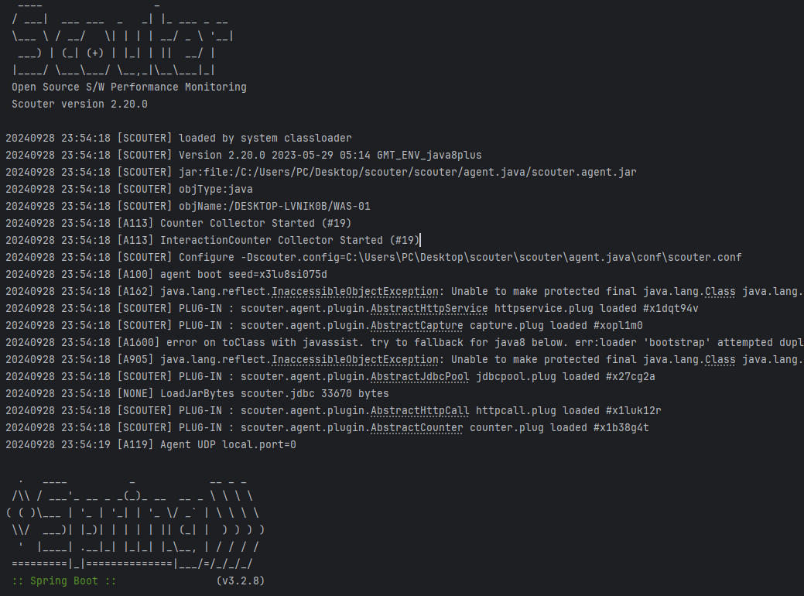
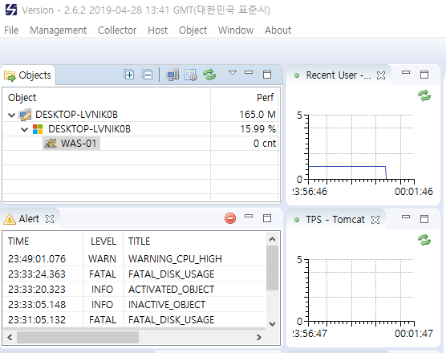

# Scouter 설치 및 실행

 - 참고 블로그
    - https://blog.naver.com/smj9030/222548585671
    - https://velog.io/@onestone/%EC%98%A4%ED%94%88%EC%86%8C%EC%8A%A4-APM-Scouter-%EC%84%A4%EC%B9%98-%EB%B0%8F-%EC%82%AC%EC%9A%A9%EB%B2%95
 - Scouter 다운로드
    - https://github.com/scouter-project/scouter/releases

## Scouter 실행

- Scouter 서버(Collector)
    - scouter/server/startup.bat
    - Collector 서버는 에이전트로부터 실시간 모니터링 정보를 수집 및 가공한다.
    - 포트 확인: netstat -an | grep 6100
```bash
# 스카우터 서버 ID, 수집 서버가 여러 대 있을 경우 구분을 위해 ID 지정 필요
server_id=

# 서버 리스닝 TCP/UDP 포트, 디폴트 6100
net_tcp_listen_port=
net_udp_listen_port=

# 저장되는 데이터 경로 (디렉토리명 : database)
db_dir=

# 로그 경로 (디렉토리명 : logs)
log_dir=
```

- Scouter 클라이언트(Viewer)
    - scouter/scouter.client/scouter.exe
    - 클라이언트는 모니터링 화면을 제공한다.

- 호스트 에이전트
    - scouter/agent.host/host.bat
    - 호스트 에이전트는 해당 서버의 CPU, 메모리 등 리소스 정보를 수집한다.
    - 'conf/scouter.conf' 파일에서 설정값을 변경할 수 있다.
```conf
# 수집 서버 IP 및 리스닝 포트
net_collector_ip=
net_collector_udp_port=
net_collector_tcp_port=

# 오프젝트명 (클라이언트에 표시될 이름)
obj_name=

# 호스트명
# 이 호스트에서 자바 에이전트도 실행한다면, 자바 에이전트 설정 파일에 obj_host_name 동일하게 설정  
host_name=
```

- 자바 에이전트
    - scouter/agent.java/scouter.agent.jar
    - JVM 리소스 정보를 수집한다.
    - 애플리케이션 갯수만큼 'conf' 폴더에 scouter1.conf 파일을 만든다.
```conf
# 수집 서버 IP 및 리스닝 포트
net_collector_ip=
net_collector_udp_port=
net_collector_tcp_port=

# 오프젝트명 (클라이언트에 표시될 이름)
obj_name=

# 호스트 에이전트 설정 파일에서 기재한 host_name과 동일하게 작성
obj_host_name=
```

 - 애플리케이션 실행
    - 애플리케이션을 실행할 때, Scouter 자바 에이전트를 함께 실행해준다. 이때, Scouter의 설정 파일 경로와 Collector 서버 IP를 함께 넣어준다.
    - 애플리케이션과 Scouter 자바 에이전트가 함께 실행된다.
    - 'javaagent' 옵션: Java 에이전트 JAR 파일을 지정하여, JVM이 애플리케이션을 실행하는 동안 해당 에이전트가 클래스 로딩 또는 애플리케이션 실행 과정에 개입하도록 한다.
    - '-D' 옵션: JVM 시스템 속성을 설정하는 옵션
```bash
-javaagent:${SCOUTER_AGENT_DIR}/scouter.agent.jar 
-Dscouter.config=${SCOUTER_AGENT_DIR}/conf/scouter.conf 
-Dnet_collector_ip=${COLLECTOR_IP}
```

<div align="center">
    
</div>
<br/>

## Scouter 실행 예시

 - 자바 에이전트 설정
```
# scouter.conf 파일
obj_name=WAS-01
net_collector_ip=127.0.0.1
net_collector_udp_port=6100
net_collector_tcp_port=6100
```

 - 애플리케이션 실행 옵션
```bash
-javaagent:C:\Users\PC\Desktop\scouter\scouter\agent.java\scouter.agent.jar 
-Dscouter.config=C:\Users\PC\Desktop\scouter\scouter\agent.java\conf\scouter.conf 
-Dnet_collector_ip=127.0.0.1
```
<div align="center">
    <br/>
    클라이언트에서 WAS-01 애플리케이션 확인 가능
</div>
<br/>
