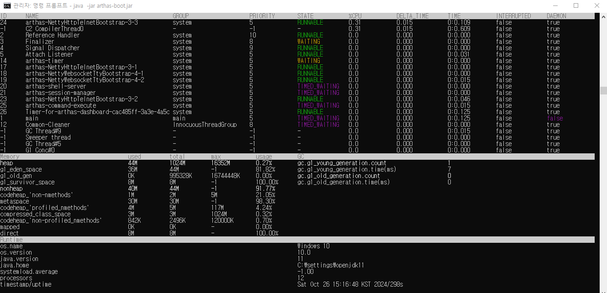
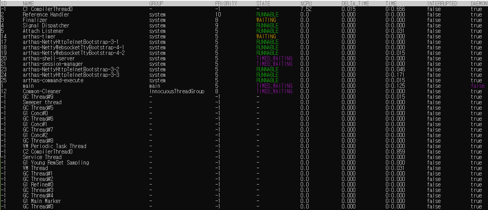
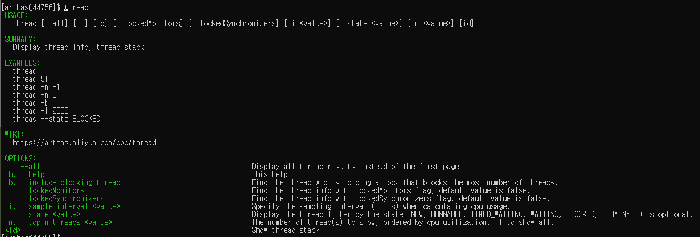

# 자바 분석 도구

## 1. 자바 종합 분석 도구인 Arthas

### 1-1. Arthas

Arthas(아서스)는 중국의 알리바바에서 만든 자바 분석 도구다. 운영 서버에 문제가 생겼을 때 서버를 재시작하지 않고 문제의 원인을 분석하는 것이 이 도구를 사욯아는 가장 큰 목적이다.  

 - 깃허브 주소: https://github.com/alibaba/arthas
 - 깃허브 주소2: https://alibaba.github.io/
 - 공식 문서: https://arthas.aliyun.com/en/doc/
 - __주요 기능__
    - 클래스가 로딩되었는지, 어디에서 로딩되었는지 확인 가능
    - 코드가 예상한 대로 실행되는지를 확인하기 위한 클래스 역컴파일 기능
    - 클래스 로더의 통계 확인
    - 메서드 호출 상세 정보
    - 지정한 메서드가 호출되었을 때의 스택 추적 정보
    - 느린 하위 호출을 찾기 위한 메서드 호출 추적
    - 메서드 호출 통계
    - 시스템 메트릭, 스레드 상태, GC 통계
    - 텔넷과 웹소켓 지원
44756
### 1-2. 아서스 사용하기

깃허브 홈에서 releases 탭으로 이동하면 각종 릴리즈를 확인할 수 있다. arthas-x.x.x-bin.zip과 arthas-x.x.x-doc.zip 파일을 다운로드한다. bin.zip은 실행 파일이며, doc.zip은 가이드 문서 파일이다.  

```
arthas-agent.jar
arthas-boot.jar
arthas-client.jar
arthas-core.jar
arthas-demo.jar
arthas-spy.jar
as.bat
as.sh
install-local.sh
```

#### 데모 실행

```bash
# 데모 프로그램 실행
java -jar arthas-demo.jar

# 아서스 실행 후 분석하고자 하는 프로세스 아이디 입력
java -jar arthas-boot.jar

C:\Users\PC\Desktop\arthas-bin>java -jar arthas-boot.jar
[INFO] JAVA_HOME: C:\settings\openjdk11
[INFO] arthas-boot version: 4.0.2
[INFO] Process 44756 already using port 3658
[INFO] Process 44756 already using port 8563
[INFO] Found existing java process, please choose one and input the serial number of the process, eg : 1. Then hit ENTER.
* [1]: 44756 math-game.jar
  [2]: 11664
  [3]: 45256
  [4]: 41996 org.jetbrains.jps.cmdline.Launcher

[INFO] arthas home: C:\Users\PC\Desktop\arthas-bin
[INFO] The target process already listen port 3658, skip attach.
[INFO] arthas-client connect 127.0.0.1 3658
  ,---.  ,------. ,--------.,--.  ,--.  ,---.   ,---.
 /  O  \ |  .--. ''--.  .--'|  '--'  | /  O  \ '   .-'
|  .-.  ||  '--'.'   |  |   |  .--.  ||  .-.  |`.  `-.
|  | |  ||  |\  \    |  |   |  |  |  ||  | |  |.-'    |
`--' `--'`--' '--'   `--'   `--'  `--'`--' `--'`-----'

wiki       https://arthas.aliyun.com/doc
tutorials  https://arthas.aliyun.com/doc/arthas-tutorials.html
version    4.0.2
main_class
pid        44756
time       2024-10-26 15:12:26.462
```

### 1-3. 아서스 주요 명령어

아서스 주요 명령어는 dashboard, thread, jvm, sysprop, sysenv, getstatic, ognl, sc, sm, dump, jad, classloader, mc, redefine, monitor, watch, trace, stack, tt, cat, pwd, options, help, shutdown 등이 있다.  
 - 전반적인 현황을 확인하는 명령어: dashboard, thread, jvm, sysprop, sysenv
 - 특정 스레드/클래스/파일 등 분석하기 위한 명령어: getstatic, ognl, sc, sm, dump, jad, classloader, mc, redefine, monitor, watch, trace, stack, tt, cat
 - 도구들: pwd, options, help, shutdown

#### dashboard

가장 상단에 있는 스레드의 상태에는 CPU 사용량이 높은 스레드를 우선적으로 봐야 하며, 그다음에는 누적 시간이 많은 스레드는 어떤 것인지도 살펴봐야 한다. 그리고 나서 STATE 값이 RUNNABLE인지 BLOCKED인지도 유심히 확인해봐야 한다.

 - 가장 상단에 스레드 상태 제공
 - 중간에는 메모리
 - 가장 밑에는 시스템의 전반적인 상황

<div align="center">
    
</div>


#### thread

__스레드의 전반적인 통계 정보를 나타낸다.__
 - __RUNNABLE이 높은 경우__: 아주 정상적인 상태일 수도 있지만, 너무 비정상적으로 높을 경우 RUNNABLE인 스레드를 확인하여 CPU 사용량이 높은 것을 찾아내야만 한다.
 - __BLOCKED가 높은 경우__: 이 값이 높은 경우는 어디선가 락을 잡고 놓지 않고 있다는 뜻으로 락을 잡고 있는 스레드를 찾아내야만 한다.
 - __WAITING이나 TIMED_WATING이 높은 경우__: 대부분의 경우 스레드가 대기하고 있는 상태이기 떄문에 문제가 되지 않는다.
 - thread 옵션
    - -h: 사용 방법 확인


<div align="center">
    <br/>
    
</div>
<br/>

#### jvm

__jvm 명령은 전반적인 시스템의 환경 정보를 확인할 때 사용된다. 기본적인 JVM의 버전 및 상태 정보부터 클래스 로딩, 컴파일, OS, 스레드, 파일 관련 설정들까지 매우 다양한 현재의 상태를 확인할 수 있다.__  

```bash
[arthas@44756]$ jvm
 RUNTIME
------------------------------------------------------------------------------------------------------------------------------------------------------------------------------------------
 MACHINE-NAME                                         44756@DESKTOP-LVNIK0B
 JVM-START-TIME                                       2024-10-26 15:11:49
 MANAGEMENT-SPEC-VERSION                              2.0
 SPEC-NAME                                            Java Virtual Machine Specification
 SPEC-VENDOR                                          Oracle Corporation
 SPEC-VERSION                                         11
 VM-NAME                                              OpenJDK 64-Bit Server VM
 VM-VENDOR                                            Oracle Corporation
 VM-VERSION                                           11+28
 INPUT-ARGUMENTS                                      []
 CLASS-PATH                                           math-game.jar
 BOOT-CLASS-PATH
 LIBRARY-PATH                                         C:\settings\openjdk11\bin;C:\Windows\Sun\Java\bin;C:\Windows\system32;C:\Windows;C:\Program Files (x86)\VMware\VMware Player\bin\;C
                                                      :\Windows\system32;C:\Windows;C:\Windows\System32\Wbem;C:\Windows\System32\WindowsPowerShell\v1.0\;C:\Windows\System32\OpenSSH\;C:\
                                                      Program Files (x86)\NVIDIA Corporation\PhysX\Common;C:\Program Files\NVIDIA Corporation\NVIDIA NvDLISR;C:\Program Files\Git\cmd;C:\
                                                      Program Files\TortoiseSVN\bin;C:\Program Files\VisualSVN Server\bin;C:\Program Files (x86)\IncrediBuild;C:\settings\openjdk11\bin;C
                                                      :\Program Files\Docker\Docker
                                                      esources\bin;C:\ProgramData\DockerDesktop\version-bin;C:\Users\PC\AppData\Roaming\nvm;C:\Program Files\nodejs;C:\ProgramData\chocol
                                                      atey\bin;C:\Program Files (x86)\Yarn\bin\;C:\Program Files\dotnet\;C:\Users\PC\AppData\Local\Programs\Python\Python310\Scripts\;C:\
                                                      Users\PC\AppData\Local\Programs\Python\Python310\;C:\Users\PC\AppData\Local\Microsoft\WindowsApps;C:\Program Files\Bandizip\;C:\Use
                                                      rs\PC\AppData\Local\Programs\Microsoft VS Code\bin;C:\Users\PC\AppData\Roaming\npm;C:\Program Files\JetBrains\IntelliJ IDEA Communi
                                                      ty Edition 2022.3.1\bin;C:\Program Files\JetBrains\IntelliJ IDEA 2024.1.4\bin;C:\tools\dart-sdk\bin;C:\Users\PC\AppData\Roaming\Pub
                                                      \Cache\bin;C:\Users\PC\AppData\Local\Yarn\bin;C:\Program Files\JetBrains\PyCharm Community Edition 2023.2.5\bin;C:\Users\PC\AppData
                                                      \Local\JetBrains\Toolbox\scripts;.

------------------------------------------------------------------------------------------------------------------------------------------------------------------------------------------
 CLASS-LOADING
------------------------------------------------------------------------------------------------------------------------------------------------------------------------------------------
 LOADED-CLASS-COUNT                                   4761
 TOTAL-LOADED-CLASS-COUNT                             4761
 UNLOADED-CLASS-COUNT                                 0
 IS-VERBOSE                                           false

------------------------------------------------------------------------------------------------------------------------------------------------------------------------------------------
 COMPILATION
------------------------------------------------------------------------------------------------------------------------------------------------------------------------------------------
 NAME                                                 HotSpot 64-Bit Tiered Compilers
 TOTAL-COMPILE-TIME                                   1339
 [time (ms)]

------------------------------------------------------------------------------------------------------------------------------------------------------------------------------------------
 GARBAGE-COLLECTORS
------------------------------------------------------------------------------------------------------------------------------------------------------------------------------------------
 G1 Young Generation                                  name : G1 Young Generation
 [count/time (ms)]                                    collectionCount : 2
                                                      collectionTime : 12
 G1 Old Generation                                    name : G1 Old Generation
 [count/time (ms)]                                    collectionCount : 0
                                                      collectionTime : 0

------------------------------------------------------------------------------------------------------------------------------------------------------------------------------------------
 MEMORY-MANAGERS
------------------------------------------------------------------------------------------------------------------------------------------------------------------------------------------
 CodeCacheManager                                     CodeHeap 'non-nmethods'
                                                      CodeHeap 'profiled nmethods'
                                                      CodeHeap 'non-profiled nmethods'
 Metaspace Manager                                    Metaspace
                                                      Compressed Class Space
 G1 Young Generation                                  G1 Eden Space
                                                      G1 Survivor Space
                                                      G1 Old Gen
 G1 Old Generation                                    G1 Eden Space
                                                      G1 Survivor Space
                                                      G1 Old Gen

------------------------------------------------------------------------------------------------------------------------------------------------------------------------------------------
 MEMORY
------------------------------------------------------------------------------------------------------------------------------------------------------------------------------------------
 HEAP-MEMORY-USAGE                                    init : 1073741824(1.0 GiB)
 [memory in bytes]                                    used : 24143888(23.0 MiB)
                                                      committed : 1073741824(1.0 GiB)
                                                      max : 17146314752(16.0 GiB)
 NO-HEAP-MEMORY-USAGE                                 init : 7667712(7.3 MiB)
 [memory in bytes]                                    used : 42973032(41.0 MiB)
                                                      committed : 47054848(44.9 MiB)
                                                      max : -1(-1 B)
 PENDING-FINALIZE-COUNT                               0

------------------------------------------------------------------------------------------------------------------------------------------------------------------------------------------
 OPERATING-SYSTEM
------------------------------------------------------------------------------------------------------------------------------------------------------------------------------------------
 OS                                                   Windows 10
 ARCH                                                 amd64
 PROCESSORS-COUNT                                     12
 LOAD-AVERAGE                                         -1.0
 VERSION                                              10.0

------------------------------------------------------------------------------------------------------------------------------------------------------------------------------------------
 THREAD
------------------------------------------------------------------------------------------------------------------------------------------------------------------------------------------
 COUNT                                                15
 DAEMON-COUNT                                         14
 PEAK-COUNT                                           16
 STARTED-COUNT                                        19
 DEADLOCK-COUNT                                       0

------------------------------------------------------------------------------------------------------------------------------------------------------------------------------------------
 FILE-DESCRIPTOR
------------------------------------------------------------------------------------------------------------------------------------------------------------------------------------------
 MAX-FILE-DESCRIPTOR-COUNT                            -1
 OPEN-FILE-DESCRIPTOR-COUNT                           -1
```

#### sc/sm

__sc 명령은 search class의 약자이고, sm 명령은 search method의 약자다. 즉, 클래스와 메서드에 대한 정보를 확인하기 위한 명령이다.__  

```bash
# 메서드가 어떻게 선언되어 있는지, 매개변수가 무엇인지, 리턴값이 무엇인지
[arthas@44756]$ sm -d *StringUtils replace
 declaring-class  com.taobao.arthas.core.util.StringUtils
 method-name      replace
 modifier         public,static
 annotation
 parameters       java.lang.String
                  java.lang.String
                  java.lang.String
 return           java.lang.String
 exceptions
 classLoaderHash  4df80928

Affect(row-cnt:1) cost in 17 ms.
```

#### monitor

__monitor 명령은 특정 메서드를 추적하는 용도로 사용된다.__ 기본적으로 통계를 제공하는 주기가 120초이기 때문에 -c 명령을 통해 통계 제공 주기를 임의로 줄 수 있으며, 그다음에는 클래스 이름과 메서드 이름을 지정하면 된다.  
 - 해당 메서드가 호출된 총횟수와 성공적으로 실행한 횟수, 실패한 횟수 등을 제공한다. 그다음에는 밀리초 단위의 수행 시간과 실패율을 수치로 보여준다.
 - 만약, 어떤 메서드가 지속해서 오류를 발생시킨다면 이 명령을 사용하여 해당 메서드의 상황을 모니터링하면 도움이 될 것이다.

```bash
[arthas@44756]$ monitor -c 5 demo.MathGame primeFactors
Press Q or Ctrl+C to abort.
Affect(class count: 1 , method count: 1) cost in 66 ms, listenerId: 1
 timestamp                    class                                      method                                    total          success       fail          avg-rt(ms)     fail-rate
------------------------------------------------------------------------------------------------------------------------------------------------------------------------------------------
 2024-10-26 15:26:53.289      demo.MathGame                              primeFactors                              5              1             4             0.26           80.00%

 timestamp                    class                                      method                                    total          success       fail          avg-rt(ms)     fail-rate
------------------------------------------------------------------------------------------------------------------------------------------------------------------------------------------
 2024-10-26 15:26:58.322      demo.MathGame                              primeFactors                              5              5             0             0.40           0.00%

 timestamp                    class                                      method                                    total          success       fail          avg-rt(ms)     fail-rate
```

#### stack/trace

 - stack 명령
    - stack 명령은 클래스의 메서드 간에 호출 관계를 확인할 때 사용한다.
    - 이 명령은 부하가 적지만 정보가 약하기 때문에 trace 명령을 사용할 것을 추천한다.
```bash
[arthas@44756]$ stack demo.MathGame primeFactors
Press Q or Ctrl+C to abort.
Affect(class count: 1 , method count: 1) cost in 17 ms, listenerId: 2
ts=2024-10-26 15:29:03.534;thread_name=main;id=1;is_daemon=false;priority=5;TCCL=jdk.internal.loader.ClassLoaders$AppClassLoader@28c97a5
    @demo.MathGame.primeFactors()
        at demo.MathGame.run(MathGame.java:24)
        at demo.MathGame.main(null:16)

ts=2024-10-26 15:29:04.544;thread_name=main;id=1;is_daemon=false;priority=5;TCCL=jdk.internal.loader.ClassLoaders$AppClassLoader@28c97a5
    @demo.MathGame.primeFactors()
        at demo.MathGame.run(MathGame.java:24)
        at demo.MathGame.main(null:16)

ts=2024-10-26 15:29:05.553;thread_name=main;id=1;is_daemon=false;priority=5;TCCL=jdk.internal.loader.ClassLoaders$AppClassLoader@28c97a5
    @demo.MathGame.primeFactors()
        at demo.MathGame.run(MathGame.java:24)
        at demo.MathGame.main(null:16)
```

 - trace 명령
    - trace 명령은 지정 메서드를 실행할 때의 스택 정보를 실시간으로 보고자 할 때 매우 유용하다.
    - trace 명령 뒤에 클래스, 메서드 이름을 지정하면 해당 메서드의 스택 정보를 기본적으로 제공하고, 그 하위에 호출된 클래스와 메서드의 정보들도 제공한다.
```bash
[arthas@44756]$ trace demo.MathGame primeFactors
Press Q or Ctrl+C to abort.
Affect(class count: 1 , method count: 1) cost in 15 ms, listenerId: 5
`---ts=2024-10-26 15:30:59.667;thread_name=main;id=1;is_daemon=false;priority=5;TCCL=jdk.internal.loader.ClassLoaders$AppClassLoader@28c97a5
    `---[0.044ms] demo.MathGame:primeFactors()

`---ts=2024-10-26 15:31:00.671;thread_name=main;id=1;is_daemon=false;priority=5;TCCL=jdk.internal.loader.ClassLoaders$AppClassLoader@28c97a5
    `---[0.1443ms] demo.MathGame:primeFactors()

`---ts=2024-10-26 15:31:01.678;thread_name=main;id=1;is_daemon=false;priority=5;TCCL=jdk.internal.loader.ClassLoaders$AppClassLoader@28c97a5
    `---[0.2344ms] demo.MathGame:primeFactors()

`---ts=2024-10-26 15:31:02.689;thread_name=main;id=1;is_daemon=false;priority=5;TCCL=jdk.internal.loader.ClassLoaders$AppClassLoader@28c97a5
    `---[0.0857ms] demo.MathGame:primeFactors() [throws Exception]
        `---throw:java.lang.IllegalArgumentException #46 [number is: -207412, need >= 2]
```

### 추가적인 내용

Arthas는 Java Virtual Machine (JVM)과 Java 애플리케이션의 런타임 메모리 구조에 접근하여 정보를 수집합니다. 특별한 옵션 없이도 Arthas가 애플리케이션 상태를 파악할 수 있는 이유는, JVM이 기본적으로 제공하는 Java Attach API와 Instrument API를 활용하기 때문입니다. 이 두 가지 API는 JVM의 프로세스에 동적으로 붙어서 진단할 수 있는 기능을 제공합니다.  

#### Arthas가 정보에 접근하는 원리

 - __Java Attach API__
    - Java Attach API는 실행 중인 JVM 프로세스에 외부에서 접근할 수 있는 기능을 제공합니다. 이를 통해 JVM에 애플리케이션을 실행한 후에도 진단 도구를 붙일 수 있습니다.
    - Arthas는 이 API를 사용하여 대상 JVM에 붙어서 진단 에이전트를 주입합니다. 주입된 에이전트는 Instrument API를 통해 대상 애플리케이션의 코드와 상태에 접근할 수 있게 됩니다.
    - 이 과정은 런타임에 동적으로 일어나기 때문에, JVM 실행 시 특별한 옵션을 지정하지 않아도 Arthas가 실행 중인 JVM 프로세스에 연결할 수 있습니다.
 - __Java Instrument API__
    - Attach API로 JVM에 연결한 뒤, Instrument API를 사용하여 애플리케이션의 클래스와 메서드를 동적으로 분석합니다.
    - Instrument API는 클래스 로더에 의해 로드된 클래스들을 동적으로 바이트코드 수준에서 수정하거나 정보를 수집할 수 있는 기능을 제공합니다. 이를 통해 Arthas는 특정 메서드의 호출 빈도, CPU 사용량, 메모리 상태 등과 같은 정보를 가져옵니다.
    - 예를 들어, trace 명령어를 실행하면 Arthas는 Instrument API를 통해 특정 메서드의 실행 경로와 시간을 측정하는 코드를 삽입하여 각 호출의 성능 데이터를 수집합니다.
 - __JVM 진단 명령어 (JVM TI)__
    - Arthas는 JVM이 제공하는 기본 진단 명령어들도 사용할 수 있습니다. 예를 들어, 쓰레드 정보나 힙 상태와 같은 JVM 내부 정보를 조회하는 명령어들이 있습니다. 이 명령어는 JVM 자체가 제공하는 것이므로, 별도의 설정 없이도 JVM에 연결하면 사용할 수 있습니다.
    - Arthas는 이러한 진단 명령어를 통해 쓰레드, 메모리, 클래스 로더 등의 상태를 실시간으로 조회하고 모니터링합니다.

#### Arthas 성능 영향 요인
 - __Instrument API 사용__
    - Instrument API로 메서드를 추적하거나 바이트코드를 삽입할 때마다 일부 오버헤드가 발생합니다. 특히 trace, monitor, watch와 같이 메서드 호출 경로나 호출 빈도 등을 실시간으로 모니터링하는 기능을 사용하면 메서드의 실행 시간이 증가할 수 있습니다.
    - 이 오버헤드는 추적하는 메서드 수와 추적 빈도에 따라 증가하므로, 너무 많은 메서드를 동시에 추적하거나 고빈도의 메서드를 추적할 경우 성능에 영향을 줄 수 있습니다.
 - __메모리 사용량 증가__
    - Arthas는 내부적으로 데이터를 수집하고 메모리에 저장합니다. 사용되는 메모리 양은 모니터링하고 있는 항목의 수와 데이터의 복잡성에 따라 다릅니다. 특히 큰 객체나 많은 쓰레드를 추적하는 경우에는 메모리 사용량이 증가할 수 있습니다.
    - 또한, heapdump 명령어를 사용하면 힙 덤프를 생성하기 위해 일시적으로 메모리 사용량이 증가할 수 있습니다.
 - __네트워크 및 I/O 오버헤드__
    - Arthas는 사용자와의 인터페이스를 위해 네트워크 소켓을 사용하여 명령어를 전달받고 결과를 반환합니다. 이로 인해 약간의 I/O 오버헤드가 발생할 수 있습니다. 이 오버헤드는 네트워크 연결 속도에 영향을 받으나, 일반적으로 미미한 수준입니다.
 - __CPU 사용량 증가__
    - Arthas의 일부 기능은 CPU 리소스를 소모합니다. 예를 들어 dashboard 명령어로 실시간 상태를 모니터링하거나 trace로 메서드 호출을 추적하면 CPU 사용량이 늘어날 수 있습니다.
    - 특히, 높은 빈도의 메서드 추적을 하거나 트랜잭션의 흐름을 실시간으로 모니터링할 경우 성능에 영향을 줄 수 있으므로 필요한 경우에만 제한적으로 사용하는 것이 좋습니다.

#### 바이트코드 변경 동작 원리

Arthas의 trace 명령어로 삽입된 바이트코드는 JVM 메모리 내에서 일시적으로 적용되며, Arthas를 종료하거나 trace를 중지하면 JVM이 원래 상태로 되돌아갑니다. 이는 Java Instrumentation API의 특징 중 하나로, JVM이 종료되거나 클래스가 다시 로드될 경우 바이트코드 변경이 자동으로 제거됩니다.

 - __동적 바이트코드 삽입__
    - trace 명령어는 Java Instrumentation API를 통해 대상 메서드에 바이트코드를 동적으로 삽입합니다. 이 바이트코드는 애플리케이션의 메모리 상에만 존재하며, 애플리케이션의 실제 클래스 파일이나 JAR 파일에는 영향을 미치지 않습니다.
 - __일시적 적용__
    - Arthas는 Instrument API를 사용하여 메서드에 실행 추적 코드를 삽입합니다. 이 추가된 바이트코드는 Arthas가 연결된 동안에만 유지됩니다.
    - Arthas에서 trace 명령을 중지하거나, Arthas를 종료할 경우 Instrument API는 삽입된 바이트코드를 자동으로 제거합니다.
 - __JVM 재시작 시 원래 상태로 복원__
    - JVM을 재시작하면 모든 바이트코드 변경이 사라지고, 클래스는 원래 상태로 로드됩니다. 이는 Instrumentation API가 JVM 메모리에만 영향을 주기 때문에 가능한 동작입니다.

