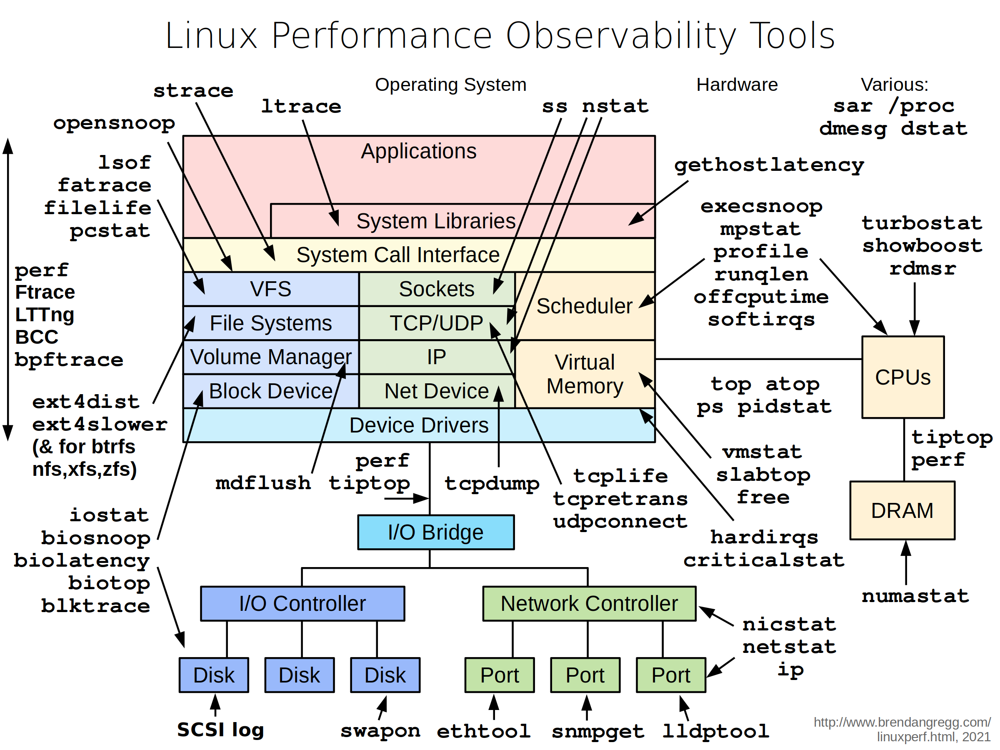
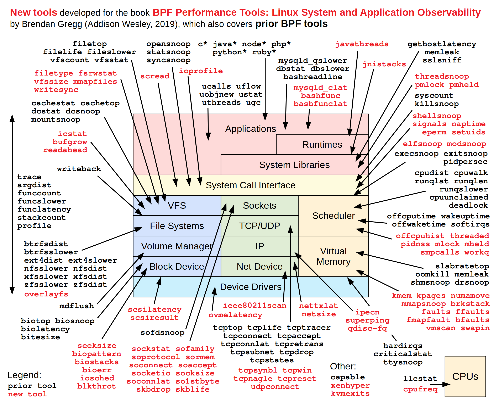
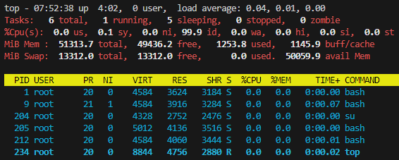
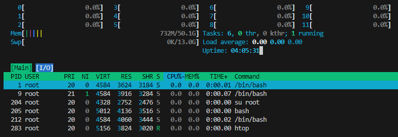

# 리눅스 진단하기

## 1. 리눅스 성능 진단 도구의 구성

### 1-1. 진단 도구 한눈에 살펴보기

넷플릭스의 브렌든 그레그라는 엔지니어가 운영하는 블로그에 각종 성능과 관련된 좋은 정보/글들이 정리되어 있다.

 - https://www.brendangregg.com/linuxperf.html
<div align="center">
    <br/>
    
</div>
<br/>

### 1-2. 60,000 밀리초에 리눅스 시스템 분석하기

 - 원제목: Linux Performance Analysis in 60,000 Milliseconds
    - 아래 명령어 중 일부는 리눅스에 기본으로 설치되어 있는 것도 있고, sysstat 이라는 패키지를 설치해야 하는 경우도 있다.
```bash
uptime
dmesg | t ail
vmstat 1
mpstat -P ALL 1
pidstat 1
iostat -xz 1
free -m
sar -n DEV 1
sar -n TCP,ETCP 1
top
```

#### uptime

__uptime은 서버가 시작한 지 얼마나 되는지를 확인하기 위한 명령이다.__
 - load average는 1분, 5분, 15분간의 평균값이다.
 - 이 값은 0에 가까우면 좋고, 클수록 좋지 않다.
```bash
root@c94d3b6890db:/# uptime
 07:39:14 up  5:39,  0 user,  load average: 0.15, 0.03, 0.01
```

#### dmesg | tail

__dmesg 명령은 시스템 메시지를 확인하는 명령어__ 이며, 파이프와 tail을 사용했기 떄문에 최근 시스템 메시지를 확인해 볼 수 있다.

```bash
# 권한이 없는 경우
root@c94d3b6890db:/# dmesg | tail
dmesg: read kernel buffer failed: Operation not permitted

# 더 많은 권한으로 실행
C:\Users\PC>docker run -it --privileged ubuntu
root@516c6159696e:/# dmesg | tail
[20515.519895] docker0: port 1(veth6326945) entered blocking state
[20515.519897] docker0: port 1(veth6326945) entered disabled state
[20515.519914] device veth6326945 entered promiscuous mode
[20515.519943] docker0: port 1(veth6326945) entered blocking state
[20515.519944] docker0: port 1(veth6326945) entered forwarding state
[20515.520069] docker0: port 1(veth6326945) entered disabled state
[20515.775463] eth0: renamed from vethe5196d1
[20515.835373] IPv6: ADDRCONF(NETDEV_CHANGE): veth6326945: link becomes ready
[20515.835406] docker0: port 1(veth6326945) entered blocking state
[20515.835407] docker0: port 1(veth6326945) entered forwarding state
```

#### vmstat 1

__vmstat 명령은 가상 메모리의 상황을 확인하는 도구지만, 아주 많은 정보를 제공한다.__ 주요 항목으로는 r, free, swap(si, so), cpu(us, sy, id, wa, st) 이다.

 - r은 CPU의 Run Queue를 의미하며, CPU가 바빠서 자기 차례를 기다리는 프로세스의 개수를 뜻한다. 즉, __CPU 코어 갯수보다 이 숫자가 많으면 서버가 아주 바쁜 상황__ 으로 판단할 수 있다.
 - free는 KB 단위의 메모리 여유를 의미하며, 가용 메모리가 많은지 확인해 봐야 한다.
 - __swap은 메모리가 부족할 때 디스크를 메모리처럼 사용하는 영역이다. 그래서 이 영역은 반드시 사용하지 않고 있어야만 한다고 생각하는 것이 좋다.__
    - si는 swap in, so는 swawp out
- cpu는 us(user CPU), sy(system CPU), wa(wait I/O CPU), st(stolen time) 중 어떤 것이 높은지 봐야 한다.

```bash
root@516c6159696e:/# vmstat 1
procs -----------memory---------- ---swap-- -----io---- -system-- -------cpu-------
 r  b   swpd   free   buff  cache   si   so    bi    bo   in   cs us sy id wa st gu
 1  0      0 50729220  23772 1063304    0    0    46   209   68    0  0  0 100  0  0  0
 0  0      0 50728952  23772 1063320    0    0     0     0   36  343  0  0 100  0  0  0
 0  0      0 50727904  23772 1063320    0    0     0     0  135  802  0  0 100  0  0  0
 0  0      0 50725100  23772 1063320    0    0     0     0   49  252  0  0 100  0  0  0
```

#### mpstat -P ALL 1

__mpstat 명령어는 CPU별 사용량을 확인할 수 있다.__ 이를 통해 단일 CPU만 열심히 일하고 있는지, 여러 CPU가 분산되어 일하고 있는지를 볼 수 있다.

```bash
# 패키지 설치
apt update
apt install -y sysstat

# 명령어 수행
root@516c6159696e:/# mpstat -P ALL 1
Linux 5.10.16.3-microsoft-standard-WSL2 (516c6159696e)  10/26/24        _x86_64_        (12 CPU)

07:51:43     CPU    %usr   %nice    %sys %iowait    %irq   %soft  %steal  %guest  %gnice   %idle
07:51:44     all    0.00    0.00    0.17    0.00    0.00    0.08    0.00    0.00    0.00   99.75
07:51:44       0    0.00    0.00    0.00    0.00    0.00    0.99    0.00    0.00    0.00   99.01
07:51:44       1    0.00    0.00    0.00    0.00    0.00    0.00    0.00    0.00    0.00  100.00
07:51:44       2    0.00    0.00    0.00    0.00    0.00    0.00    0.00    0.00    0.00  100.00
07:51:44       3    0.00    0.00    0.00    0.00    0.00    0.00    0.00    0.00    0.00  100.00
07:51:44       4    0.00    0.00    0.00    0.00    0.00    0.00    0.00    0.00    0.00  100.00
07:51:44       5    0.00    0.00    0.00    0.00    0.00    0.00    0.00    0.00    0.00  100.00
07:51:44       6    0.00    0.00    0.00    0.00    0.00    0.00    0.00    0.00    0.00  100.00
07:51:44       7    0.00    0.00    0.00    0.00    0.00    0.00    0.00    0.00    0.00  100.00
07:51:44       8    0.00    0.00    1.98    0.00    0.00    0.00    0.00    0.00    0.00   98.02
07:51:44       9    0.00    0.00    0.00    0.00    0.00    0.00    0.00    0.00    0.00  100.00
07:51:44      10    0.00    0.00    0.00    0.00    0.00    0.00    0.00    0.00    0.00  100.00
07:51:44      11    0.00    0.00    0.00    0.00    0.00    0.00    0.00    0.00    0.00  100.00
```

#### pidstat 1

pidstat은 프로세스별 CPU 사용량을 확인하는 명령이다.

```bash
root@516c6159696e:/# pidstat 1
Linux 5.10.16.3-microsoft-standard-WSL2 (516c6159696e)  10/26/24        _x86_64_        (12 CPU)

07:52:20      UID       PID    %usr %system  %guest   %wait    %CPU   CPU  Command

07:52:21      UID       PID    %usr %system  %guest   %wait    %CPU   CPU  Command
```

#### iostat -xz 1

__iostat은 I/O 상황을 확인하는 용도로 사용된다.__

 - await 값은 읽기나 쓰기를 하기 위해서 대기하는 시간의 평균값을 뜻하는데, 이 값이 높으면 정상적인 읽기나 쓰기 작업을 할 수 없다고 볼 수 있다.
 - avgqu-sz는 해당 ㅣㄷ바이스의 평균 요청 개수를 뜻한다.
 - %util은 디바이스 사용 비율을 의미한다. 만약 이 값이 60%를 넘어가면 I/O 성능이 매우 안 좋다고 보면 된다.

```bash
root@516c6159696e:/# iostat -xz 1
Linux 5.10.16.3-microsoft-standard-WSL2 (516c6159696e)  10/26/24        _x86_64_        (12 CPU)

avg-cpu:  %user   %nice %system %iowait  %steal   %idle
           0.01    0.00    0.05    0.00    0.00   99.94

Device            r/s     rkB/s   rrqm/s  %rrqm r_await rareq-sz     w/s     wkB/s   wrqm/s  %wrqm w_await wareq-sz     d/s     dkB/s   drqm/s  %drqm d_await dareq-sz     f/s f_await  aqu-sz  %util
loop0            0.00      0.05     0.00   0.00    0.02    20.38    0.00      0.00     0.00   0.00    0.00     0.00    0.00      0.00     0.00   0.00    0.00     0.00    0.00    0.00    0.00   0.00
loop1            0.06      4.68     0.00   0.00    0.12    73.66    0.00      0.00     0.00   0.00    0.00     0.00    0.00      0.00     0.00   0.00    0.00     0.00    0.00    0.00    0.00   0.00
sda              0.00      0.01     0.00   0.00    6.98     3.95    0.39    198.15     0.01   3.65    0.48   504.93    0.00      0.00     0.00   0.00    0.00     0.00    0.00    1.11    0.00   0.10
sdb              0.02      1.00     0.00  19.29    1.61    54.22    0.00      0.02     0.00  47.42    1.78     7.61    0.00      0.00     0.00   0.00    5.50     6.00    0.00    2.92    0.00   0.00
sdc              0.43     39.44     0.14  24.06    2.30    91.78    0.26     16.47     0.68  72.70   12.25    64.14    0.02      1.59     0.00   0.00    0.24    93.05    0.11    0.75    0.00   0.08


avg-cpu:  %user   %nice %system %iowait  %steal   %idle
           0.00    0.00    0.00    0.00    0.00  100.00

Device            r/s     rkB/s   rrqm/s  %rrqm r_await rareq-sz     w/s     wkB/s   wrqm/s  %wrqm w_await wareq-sz     d/s     dkB/s   drqm/s  %drqm d_await dareq-sz     f/s f_await  aqu-sz  %util
```

#### free -m

__free는 메모리 사용량을 확인하는 명령이다.__

 - -m 옵션은 메모리의 크기를 메가바이트 단위로 제공한다.
 - -h 옵션은 사람이 읽기 좋은 단위로 보여준다.

```bash
root@516c6159696e:/# free -m
               total        used        free      shared  buff/cache   available
Mem:           51313        1305       49260           1        1260       50008
Swap:          13312           0       13312

root@516c6159696e:/# free -h
               total        used        free      shared  buff/cache   available
Mem:            50Gi       1.3Gi        48Gi       1.9Mi       1.2Gi        48Gi
Swap:           13Gi          0B        13Gi
```

#### sar -n

__sar 명령은 여러 서버의 정보들을 취합하는 데 사용되며, -n 옵션을 사용하면 네트워크의 상태를 확인할 수 있다.__  

 - sar -n DEV 1
    - DEV는 모든 네트워크 디바이스의 상태를 보겠다는 의미로 사용된다.
    - rxkB/s는 초당 받은 킬로바이트 크기를 뜻한다.
```bash
root@516c6159696e:/# sar -n DEV 1
Linux 5.10.16.3-microsoft-standard-WSL2 (516c6159696e)  10/26/24        _x86_64_        (12 CPU)

08:43:53        IFACE   rxpck/s   txpck/s    rxkB/s    txkB/s   rxcmp/s   txcmp/s  rxmcst/s   %ifutil
08:43:54           lo      0.00      0.00      0.00      0.00      0.00      0.00      0.00      0.00
08:43:54        tunl0      0.00      0.00      0.00      0.00      0.00      0.00      0.00      0.00
08:43:54         sit0      0.00      0.00      0.00      0.00      0.00      0.00      0.00      0.00
08:43:54         eth0      0.00      0.00      0.00      0.00      0.00      0.00      0.00      0.00
```

 - sar -n TCP,ETCP 1
    - TCP의 경우 TCP를 통한 네트워크 처리 현황을 확인할 수 있으며, ETCP는 TCP 처리 시에 발생한 에러들의 개수를 확인하는 데 유용하다.
    - active/s는 장비에서 외부로 초기화된 초당 TCP 연결의 개수를 뜻하며,ㅣ 이 값이 많다면 해당 서버에 새롭게 접근한 클라이언트 수가 많다는 의미가 된다.
    - passive/s는 외부에서 장비로 초기화된 초당 TCP 연결의 개수를 가리키는 것으로, accept() 메서드에 해당한다.
    - retrans/s는 초장 재전송된 세그먼트의 총개수를 뜻하는데, 일반적인 경우에는 이와 같은 재전송이 발생하지 않기 때문에 이 값이 0보다 클 경우에는 네트워크나 서버에 문제가 발생햇을 확률이 높다.
```bash
sar -n TCP,ETCP 1
```

#### top

top은 시스템의 전반적인 현황을 한 눈에 실시간으로 볼 수 있다는 장점이 있지만, CPU를 많이 사용하므로 부하가 심하다는 단점도 존재한다.  

```bash
root@516c6159696e:/# top
top - 08:01:37 up  6:01,  0 user,  load average: 0.12, 0.04, 0.01
Tasks:   7 total,   1 running,   6 sleeping,   0 stopped,   0 zombie
%Cpu(s):  0.0 us,  0.0 sy,  0.0 ni,100.0 id,  0.0 wa,  0.0 hi,  0.0 si,  0.0 st
MiB Mem :  51313.7 total,  49250.1 free,   1315.1 used,   1260.4 buff/cache
MiB Swap:  13312.0 total,  13312.0 free,      0.0 used.  49998.6 avail Mem

  PID USER      PR  NI    VIRT    RES    SHR S  %CPU  %MEM     TIME+ COMMAND
    1 root      20   0    4584   4092   3492 S   0.0   0.0   0:00.01 bash
  139 root      20   0   85368  76160   7608 S   0.0   0.1   0:01.34 apt
  717 root      20   0    6804   3628   2296 S   0.0   0.0   0:00.01 dpkg
  721 root      20   0   18256  15620   5716 S   0.0   0.0   0:00.07 frontend
  730 root      20   0    2796   1036    940 S   0.0   0.0   0:00.00 tzdata.config
  732 root      20   0    4584   4136   3536 S   0.0   0.0   0:00.00 bash
  748 root      20   0    8844   5208   3080 R   0.0   0.0   0:00.03 top
```

## 2. CPU 모니터링하기

### 2-1. 시스템 모니터링 도구 설치하기

모니터링 도구들은 대부분 리눅스에 설치되어 있지만, 몇몇 필요한 모니터링 도구들은 기본적으로 설치되어 있지 않다. 그래서 꼭 설치해야 하는 모듈 중 하나가 sysstat이다. 이 모듈을 설치하면 sar, iostat, mpstat, pidstat 등의 유용한 명령어를 사용할 수 있다.

```bash
apt-get install sysstat

# 글자가 깨지는 경우 LANG 설정
export $LANG=ko_KR
```

### 2-2. mpstat의 기본적인 사용 방법

mpstat은 프로세서와 관련된 통계를 제공하는 도구이다. 각각의 사용 가능한 CPU의 사용 상황을 제공해주며, 각 데이터 출력 간격과 수행 횟수를 기본적으로 지정할 수 있다.  
 - 옵션없이 mpstat만 수행하면 현재의 CPU 사용량 정보만을 출력한다.
 - %usr: 사용자 레벨에서 수행되는 동안 사용한 CPU 시간의 비율
 - %nice: nice 우선순위로 사용자 레벨에서 수행되는 동안 사용한 CPU 시간의 비율
 - %sys: 시스템 레벨에서 수행되는 동안 사용한 CPU 시간의 비율. 이 값은 하드웨어와 소프트웨어의 인터럽트를 처리하는 데 수행된 시간은 포함되지 않는다.
 - %iowait: 시스템 디스크의 I/O 요청을 처리하는 동안 CPU가 유휴 상태인 시간의 비율
 - %irq: 하드웨어 인터럽트를 CPU에서 처리하는 데 사용한 CPU 시간의 비율
 - %soft: 소프트웨어 인터럽트를 처리하는 데 사용한 CPU 시간의 비율
 - %steal: 하이퍼바이저가 다른 가상 프로세서를 처리할 때 가상 CPU에서 어쩔 수 없이 대기하는 데 사용한 시간의 비율
 - %guest: 가상 프로세서를 수행하기 위해서 CPU에서 사용한 CPU 시간의 비율
 - %idle: CPU가 유휴 상태인 시간의 비율
```bash
root@516c6159696e:/# mpstat
Linux 5.10.16.3-microsoft-standard-WSL2 (516c6159696e)  10/26/24        _x86_64_        (12 CPU)

08:46:52     CPU    %usr   %nice    %sys %iowait    %irq   %soft  %steal  %guest  %gnice   %idle
08:46:52     all    0.01    0.00    0.04    0.00    0.00    0.01    0.00    0.00    0.00   99.94
```

#### mpstat 옵션들

 - `mpstat -I { SUM | CPU | ALL }`
    - I 옵션은 인터럽트에 대한 통계를 제공한다.
        - SUM: 모든 CPU의 초당 인터럽트 수의 합
        - CPU: 각 CPU별로 상세한 인터럽트 정보
        - ALL: SUM과 CPU를 모두 선택한 결과
    - 리눅스의 '/proc/interrupts' 파일 참조
```bash
root@516c6159696e:/# mpstat -I ALL
Linux 5.10.16.3-microsoft-standard-WSL2 (516c6159696e)  10/27/24        _x86_64_        (12 CPU)

04:53:45     CPU    intr/s
04:53:45     all     66.17

04:53:45     CPU        8/s        9/s      NMI/s      LOC/s      SPU/s      PMI/s      IWI/s      RTR/s      RES/s      CAL/s      TLB/s      HYP/s      HRE/s      HVS/s      ERR/s      MIS/s      PIN/s      NPI/s      PIW/s
04:53:45       0       0.00       0.00       0.00       0.00       0.00       0.00       0.00       0.00       4.94       0.32       0.00      27.73       0.00      19.37       0.00       0.00       0.00       0.00       0.00
04:53:45       1       0.00       0.00       0.00       0.00       0.00       0.00       0.00       0.00       3.37       0.18       0.00       0.84       0.00       3.68       0.00       0.00       0.00       0.00       0.00
04:53:45       2       0.00       0.00       0.00       0.00       0.00       0.00       0.00       0.00       8.80       0.14       0.00       1.70       0.00      16.68       0.00       0.00       0.00       0.00       0.00
04:53:45       3       0.00       0.00       0.00       0.00       0.00       0.00       0.00       0.00       3.03       0.12       0.00       0.01       0.00       4.78       0.00       0.00       0.00       0.00       0.00
04:53:45       4       0.00       0.00       0.00       0.00       0.00       0.00       0.00       0.00       6.84       0.15       0.00       0.00       0.00      14.36       0.00       0.00       0.00       0.00       0.00
04:53:45       5       0.00       0.00       0.00       0.00       0.00       0.00       0.00       0.00       2.76       0.12       0.00       0.03       0.00       4.23       0.00       0.00       0.00       0.00       0.00
04:53:45       6       0.00       0.00       0.00       0.00       0.00       0.00       0.00       0.00       7.84       0.13       0.00       0.00       0.00      15.06       0.00       0.00       0.00       0.00       0.00
04:53:45       7       0.00       0.00       0.00       0.00       0.00       0.00       0.00       0.00       4.16       0.12       0.00       0.00       0.00       7.49       0.00       0.00       0.00       0.00       0.00
04:53:45       8       0.00       0.00       0.00       0.00       0.00       0.00       0.00       0.00       7.79       0.14       0.00       0.00       0.00      15.89       0.00       0.00       0.00       0.00       0.00
04:53:45       9       0.00       0.00       0.00       0.00       0.00       0.00       0.00       0.00       3.90       0.11       0.00       0.03       0.00       7.00       0.00       0.00       0.00       0.00       0.00
04:53:45      10       0.00       0.00       0.00       0.00       0.00       0.00       0.00       0.00       8.29       0.14       0.00       0.00       0.00      13.40       0.00       0.00       0.00       0.00       0.00
04:53:45      11       0.00       0.00       0.00       0.00       0.00       0.00       0.00       0.00       2.65       0.12       0.00       0.00       0.00       4.46       0.00       0.00       0.00       0.00       0.00

04:53:45     CPU       HI/s    TIMER/s   NET_TX/s   NET_RX/s    BLOCK/s IRQ_POLL/s  TASKLET/s    SCHED/s  HRTIMER/s      RCU/s
04:53:45       0       0.00       1.48       0.00       0.02       0.00       0.00      27.55       5.35       0.00       5.05
04:53:45       1       0.00       0.58       0.00       0.01       0.00       0.00       0.84       0.86       0.00       0.75
04:53:45       2       0.00       3.10       0.00       0.02       0.00       0.00       1.70       6.65       0.00       5.54
04:53:45       3       0.00       0.24       0.00       0.01       0.00       0.00       0.00       1.00       0.00       0.94
04:53:45       4       0.00       2.21       0.00       0.02       0.05       0.00       0.00       8.34       0.00       7.26
04:53:45       5       0.00       0.24       0.00       0.03       0.10       0.00       0.00       1.12       0.00       1.11
04:53:45       6       0.00       2.03       0.00       0.01       0.04       0.00       0.00       5.90       0.00       5.23
04:53:45       7       0.00       0.51       0.00       0.00       0.03       0.00       0.00       2.00       0.00       1.88
04:53:45       8       0.00       3.43       0.00       0.01       0.03       0.00       0.00       6.45       0.00       5.02
04:53:45       9       0.00       1.40       0.00       0.03       0.00       0.00       0.00       3.03       0.00       2.90
04:53:45      10       0.00       1.39       0.00       0.01       0.04       0.00       0.00       5.79       0.00       5.50
04:53:45      11       0.00       0.31       0.00       0.00       0.03       0.00       0.00       1.02       0.00       0.99
```

 - `mpstat -u`
  - 데이터 출력 간격과 수행 횟수만 지정한 것과 동일한 결과를 출력한다.
```bash
Linux 5.10.16.3-microsoft-standard-WSL2 (516c6159696e)  10/27/24        _x86_64_        (12 CPU)

04:57:42     CPU    %usr   %nice    %sys %iowait    %irq   %soft  %steal  %guest  %gnice   %idle
04:57:42     all    0.02    0.00    0.04    0.00    0.00    0.01    0.00    0.00    0.00   99.92
```

 - `mpstat -P { cpu [,...] | ALL }`
  - P 옵션을 사용하면 지정한 프로세서, 혹은 모든 프로세서에 대한 사용량을 출력한다.
```bash
root@516c6159696e:/# mpstat -P 3
Linux 5.10.16.3-microsoft-standard-WSL2 (516c6159696e)  10/27/24        _x86_64_        (12 CPU)

04:58:52     CPU    %usr   %nice    %sys %iowait    %irq   %soft  %steal  %guest  %gnice   %idle
04:58:52       3    0.01    0.00    0.01    0.00    0.00    0.00    0.00    0.00    0.00   99.97

# 모든 프로세서
root@516c6159696e:/# mpstat -P ALL
Linux 5.10.16.3-microsoft-standard-WSL2 (516c6159696e)  10/27/24        _x86_64_        (12 CPU)

04:59:40     CPU    %usr   %nice    %sys %iowait    %irq   %soft  %steal  %guest  %gnice   %idle
04:59:40     all    0.02    0.00    0.04    0.00    0.00    0.01    0.00    0.00    0.00   99.92
04:59:40       0    0.02    0.00    0.08    0.01    0.00    0.07    0.00    0.00    0.00   99.83
04:59:40       1    0.04    0.00    0.01    0.01    0.00    0.01    0.00    0.00    0.00   99.93
04:59:40       2    0.03    0.00    0.06    0.01    0.00    0.00    0.00    0.00    0.00   99.91
04:59:40       3    0.01    0.00    0.01    0.00    0.00    0.00    0.00    0.00    0.00   99.97
04:59:40       4    0.03    0.00    0.18    0.00    0.00    0.00    0.00    0.00    0.00   99.79
04:59:40       5    0.01    0.00    0.01    0.00    0.00    0.00    0.00    0.00    0.00   99.98
04:59:40       6    0.03    0.00    0.05    0.00    0.00    0.00    0.00    0.00    0.00   99.92
04:59:40       7    0.01    0.00    0.01    0.00    0.00    0.00    0.00    0.00    0.00   99.97
04:59:40       8    0.04    0.00    0.05    0.00    0.00    0.00    0.00    0.00    0.00   99.91
04:59:40       9    0.01    0.00    0.02    0.00    0.00    0.00    0.00    0.00    0.00   99.96
04:59:40      10    0.04    0.00    0.04    0.00    0.00    0.00    0.00    0.00    0.00   99.92
04:59:40      11    0.01    0.00    0.01    0.00    0.00    0.00    0.00    0.00    0.00   99.97
```

 - `mpstat -A`
  - A 옵션은 지금까지 알아본 모든 옵션에 대한 결과를 모두 출력한다.
```bash
root@516c6159696e:/# mpstat -A
Linux 5.10.16.3-microsoft-standard-WSL2 (516c6159696e)  10/27/24        _x86_64_        (12 CPU)

05:00:16     CPU    %usr   %nice    %sys %iowait    %irq   %soft  %steal  %guest  %gnice   %idle
05:00:16     all    0.02    0.00    0.04    0.00    0.00    0.01    0.00    0.00    0.00   99.92
05:00:16       0    0.02    0.00    0.08    0.01    0.00    0.07    0.00    0.00    0.00   99.83
05:00:16       1    0.04    0.00    0.01    0.01    0.00    0.01    0.00    0.00    0.00   99.93
..
05:00:16      11    0.01    0.00    0.01    0.00    0.00    0.00    0.00    0.00    0.00   99.97

05:00:16     CPU    intr/s
05:00:16     all     67.05
05:00:16       0     39.54
05:00:16       1      2.81
..
05:00:16      11      2.55

05:00:16     CPU        8/s        9/s      NMI/s      LOC/s      SPU/s      PMI/s      IWI/s      RTR/s      RES/s      CAL/s      TLB/s      HYP/s      HRE/s      HVS/s      ERR/s      MIS/s      PIN/s      NPI/s      PIW/s
05:00:16       0       0.00       0.00       0.00       0.00       0.00       0.00       0.00       0.00       5.08       0.31       0.00      27.78       0.00      19.67       0.00       0.00       0.00       0.00       0.00
05:00:16       1       0.00       0.00       0.00       0.00       0.00       0.00       0.00       0.00       3.33       0.18       0.00       0.76       0.00       4.55       0.00       0.00       0.00       0.00       0.00
..
05:00:16      11       0.00       0.00       0.00       0.00       0.00       0.00       0.00       0.00       2.66       0.12       0.00       0.00       0.00       4.88       0.00       0.00       0.00       0.00       0.00

05:00:16     CPU       HI/s    TIMER/s   NET_TX/s   NET_RX/s    BLOCK/s IRQ_POLL/s  TASKLET/s    SCHED/s  HRTIMER/s      RCU/s
05:00:16       0       0.00       1.47       0.00       0.02       0.00       0.00      27.60       5.37       0.00       5.07
05:00:16       1       0.00       0.53       0.00       0.00       0.00       0.00       0.76       0.81       0.00       0.70
..
05:00:16      11       0.00       0.35       0.00       0.00       0.03       0.00       0.00       1.11       0.00       1.07
```

### 2-3. CPU를 모니터링하는 이유


#### 사용해 봐야 하는 CPU 사용량 순서

 - User CPU: 사용자 프로세스에 의해 사용된 CPU 비율
 - System CPU: 커널 모드에서 사용된 CPU 비율
 - I/O Wait CPU: CPU가 I/O 작업을 기다리는 비율
 - 기타 CPU

가장 일반적인 경우 User:System CPU 사용량 비율은 10:1 ~ 8:1 이다. 만약, 이 비율이 1:1이나 3:2 정도라면 해당 애플리케이션에서는 커널 CPU를 많이 쓴다는 의미가 되며, 이는 정상적인 자바 애플리케이션이라고 볼 수 없다. __순수한 자바 애플리케이션 로직 수행시 User CPU 사용량이 높아야 한다.__  

I/O Wait가 높다면, 자바 애플리케이션에서 I/O 작업이 많다는 의미다. I/O Wait가 높다면, 어디서 I/O가 많은지 찾아야한다.  

#### Java 애플리케이션 CPU 사용량

 - __User CPU 사용이 올라가는 경우__
    - __연산 작업__: 복잡한 계산, 데이터 처리, 정렬 등의 작업이 많은 경우.
    - __멀티스레딩__: 여러 스레드를 사용하여 동시성 작업이 많이 수행될 때.
    - __집약적인 루프 처리__: 루프에서 많은 계산을 수행하거나 데이터 변환 작업을 할 때.
    - __애플리케이션 로직이 복잡한 경우__: 비즈니스 로직이 복잡하거나 많은 메서드를 반복적으로 호출하는 경우.
    - 이 경우 CPU는 대부분 사용자 모드에서 Java 코드 실행에 집중하므로, User CPU 사용량이 올라갑니다.
 - __System CPU 사용이 올라가는 경우__
    - __파일 시스템 접근__: 파일 읽기/쓰기 작업이 많을 때, 특히 대규모 파일 I/O가 이루어질 때.
    - __네트워크 작업__: 네트워크 소켓을 통해 데이터를 전송하거나 수신할 때.
    - __메모리 관리__: JVM이 가비지 컬렉션을 자주 수행하거나, 메모리 할당이 많이 발생할 때 (특히 System CPU는 가비지 컬렉션 같은 시스템 호출에 의존하기 때문).
    - __하드웨어 리소스 접근__: 디스크나 네트워크 인터페이스와 같은 시스템 자원을 자주 호출할 때.
    - System CPU는 운영체제 커널에서 실행되는 작업이 많을 때 증가합니다. 예를 들어, JNI(Java Native Interface)를 통해 시스템 API를 호출하는 경우도 System CPU를 사용하게 됩니다.
 - __I/O Wait CPU 사용이 올라가는 경우__
    - __디스크 I/O 지연__: 데이터베이스 쿼리 또는 파일 접근 시 디스크에서 데이터를 읽고 쓰는 시간이 오래 걸릴 때.
    - __네트워크 지연__: 네트워크를 통해 외부 서버 또는 API와 통신하는데 지연이 발생할 때.
    - __외부 API 호출__: API 요청에서 응답 대기 시간이 길어지는 경우.
    - __데이터베이스 호출 지연__: 데이터베이스에서 쿼리 처리가 느리게 진행될 때, 애플리케이션이 응답을 기다리게 됩니다.
    - I/O Wait CPU는 CPU가 다른 작업을 수행하지 못하고 I/O 작업이 완료되기를 기다리는 상태입니다. 일반적으로 디스크나 네트워크 대기 시간이 길어질 때 나타납니다.
  
## 3. 전반적인 상황 모니터링하기 - vmstat와 sar

### 3-1. vmstat

vmstat은 report Virtual Memory STATistics의 약자로 가상 메모리의 통계 정보를 제공한다. 프로세스, 메모리, 페이징, 블록 I/O, 트랩스, 디스크, CPU에 대한 정보들을 제공한다.  

 - Procs
    - r: 실행하기 위해서 대기하고 있는 프로세스 수
    - b: 중단 불가능한 슬립 상태에 있는 프로세스 수
 - Memory
    - swpd: 가상 메모리를 사용한 크기
    - free: 사용하지 않는 메모리의 크기
    - buff: 버퍼로 사용하는 메모리의 크기
    - cache: 캐시로 사용하는 메모리의 크기
 - Swap
    - si: 초당 디스크에서 읽은 스왑된 메모리의 크기
    - so: 초당 디스크로 스왑된 메모리의 크기
 - I/O
    - bi: 블록 디바이스에서 받은 블록 수
    - bo: 블록 디바이스로 보낸 블록 수
 - System
    - in: 클록을 포함한 초당 인터럽트 수
    - cs: 초당 컨텍스트 전환 개수
 - CPU
    - us: 사용자 코드를 수행하는 데 소요된 시간
    - sy: 커널 코드를 수행하는 데 소요된  시간
    - id: idle 상태에서 수행된 시간
    - wa: I/O를 대기하는 데 소요된 시간
    - st: 가상 머신에서 뺏긴 시간
```bash
# 5초 간격으로 데이터 출력 -> 5초간의 평균값이 출력된다.
root@516c6159696e:/# vmstat 5
procs -----------memory---------- ---swap-- -----io---- -system-- -------cpu-------   
 r  b   swpd   free   buff  cache   si   so    bi    bo   in   cs us sy id wa st gu   
 3  0      0 50803872  23244 977740    0    0   175   758   66    0  0  0 100  0  0  0
 0  0      0 50803580  23244 977740    0    0     0     0   58  397  0  0 100  0  0  0
 0  0      0 50804352  23244 977740    0    0     0     0   59  383  0  0 100  0  0  0
```

#### vmstat 옵션들

 - delay: 결과가 출력되는 주기. 이 값을 지정하지 않으면, 한 번만 수행하고 종료된다.
 - count: 데이터를 몇 번이나 출력할지를 의미한다. 지정하지 않으면 계속 수행된다.
 - -a: buff와 cache 대신 active와 inative 메모리 사용량에 대한 결과를 출력한다.
 - -n: 주기적으로 헤더를 출력하지 않도록 지정한다. 즉, 단 한 번만 헤더 정보를 출력한다.
 - -S 단위: 출력되는 데이터의 단위를 지정할 수 있다. 단위로는 k(1000), K(1024), m(1000000), M(1048576)으로 나눈 값 네가지가 있다.
 - -f: 부팅되었을 때부터 OS상에서 생성된 작업의 총 개수를 말한다. fork, vfork, clone 시스템  호출 작업이 여기에 포함된다.
 - -s: 부팅되었을 때부터 OS상에서 수행된 이벤트와 메모리 사용량에 대한 통계를 제공한다.
 - -m: slab에 대한 정보를 출력한다. 이 명령은 delay를 지정하면, 지정된 간격으로 결과를 출력하며, -n 옵션을 지정하면, 결과 내에 단 한 번의 헤더를 출력한다.
 - -d: 디스크의 사용량 통계를 각 영역별로 보여준다.
 - -D: 이 옵션은 단 한 번만 결과를 출력하며, 전체적인 디스크의 통계를 출력해 준다. 즉, 소문자 d 옵션은 각 디스크별 결과를 제공하지만, 대문자 D는 전체 디스크의 합이라고 보면 된다.
 - -p 디스크 파티션: 지정한 디스크 파티션에 대한 통계 정보를 확인할 수 있다.
```bash
vmstat 옵션 delay count
```

#### vmstat 옵션 출력 예시

```bash
# inact와 inative 메모리 사용량을 5초 평균값을 3번 출력
root@516c6159696e:/# vmstat -a -n 5 3
procs -----------memory---------- ---swap-- -----io---- -system-- -------cpu-------
 r  b   swpd   free  inact active   si   so    bi    bo   in   cs us sy id wa st gu
 2  0      0 50805944 1296356 236172    0    0   154   665   66    0  0  0 100  0  0  0
 0  0      0 50805936 1296740 236172    0    0     0     0   67  457  0  0 100  0  0  0
 0  0      0 50806700 1296760 236172    0    0     0     0   55  386  0  0 100  0  0  0

# -S 옵션으로 단위로 나눈값으로 출력
root@516c6159696e:/# vmstat -S K 1 3
procs -----------memory---------- ---swap-- -----io---- -system-- -------cpu-------
 r  b   swpd   free   buff  cache   si   so    bi    bo   in   cs us sy id wa st gu
 2  0      0 50804088  23244 977756    0    0   150   647   67    0  0  0 100  0  0  0
 0  0      0 50806136  23244 977756    0    0     0     0  155  853  0  0 100  0  0  0
 0  0      0 50806136  23244 977756    0    0     0     0  177 1245  0  0 100  0  0  0
root@516c6159696e:/# vmstat -S M 1 3
procs -----------memory---------- ---swap-- -----io---- -system-- -------cpu-------
 r  b   swpd   free   buff  cache   si   so    bi    bo   in   cs us sy id wa st gu
 2  0      0  49612     22    954    0    0   150   649   67    0  0  0 100  0  0  0
 0  0      0  49612     22    954    0    0     0     0   29  387  0  0 100  0  0  0
 0  0      0  49612     22    954    0    0     0     0   72  532  0  0 100  0  0  0

# 13614번의 fork를 수행 확인
root@516c6159696e:/# vmstat -f
        13614 forks 

# 이벤트와 메모리 사용량 통계
root@516c6159696e:/# vmstat -s
     52545180 K total memory
      1251548 K used memory
       236384 K active memory        
      1296444 K inactive memory      
     50804740 K free memory
        23244 K buffer memory        
       977760 K swap cache
     13631488 K total swap
            0 K used swap
     13631488 K free swap
         1771 non-nice user cpu ticks
            0 nice user cpu ticks    
         3428 system cpu ticks       
      7891622 idle cpu ticks
          174 IO-wait cpu ticks
            0 IRQ cpu ticks
          607 softirq cpu ticks
            0 stolen cpu ticks
            0 non-nice guest cpu ticks
            0 nice guest cpu ticks
       975662 K paged in
      4205804 K paged out
            0 pages swapped in
            0 pages swapped out
       443294 interrupts
      2660535 CPU context switches
   1730001018 boot time
        13702 forks

# 디스크별 통계
root@516c6159696e:/# vmstat -D
           27 disks
            0 partitions
        11413 total reads
         3485 merged reads
      1951196 read sectors
        12612 milli reading
         9834 writes
         1232 merged writes
      8411608 written sectors
         3919 milli writing
            0 inprogress IO
           28 milli spent IO
           16 milli weighted IO
```

### 3-2. sar

sar은 vmstat보다 상세한 정보를 알 수 있다. sar은 기본적으로 제공되지 않아 sysstat 라이브러리를 설치해야 한다.  
sar은 시스템의 작업 정보를 수집, 보고, 저장하는 도구로 시스템의 상황을 모니터링하는 것은 vmstat와 거의 비슷하지만, 크게 다른 점은 모니터링 결과를 파일로 저장할 수 있는 옵션을 제공한다.  

 - 초기 실행 에러
    - sar 명령어가 성능 데이터 파일에 접근하려 했지만, 해당 파일이 없거나 데이터 수집이 비활성화되어 오류가 발생할 수 있다.
```bash
# 수행 확인
root@516c6159696e:/# sar
Cannot open /var/log/sysstat/sa27: No such file or directory
Please check if data collecting is enabled

# '/etc/default/sysstat' 파일 내용 수정
apt install vim
vi /etc/default/sysstat

ENABLED="true"

/etc/init.d/sysstat start

# 수행 확인
root@516c6159696e:/# sar
Linux 5.10.16.3-microsoft-standard-WSL2 (516c6159696e)  10/27/24        _x86_64_        (12 CPU)

05:46:11     LINUX RESTART      (12 CPU)
```

#### sar 사용 예시

```bash
# sar [ options ] [ <interval> [ <count> ] ]

root@516c6159696e:/# sar 5 3
Linux 5.10.16.3-microsoft-standard-WSL2 (516c6159696e)  10/27/24        _x86_64_        (12 CPU)

05:48:50        CPU     %user     %nice   %system   %iowait    %steal     %idle
05:48:55        all      0.00      0.00      0.05      0.00      0.00     99.95
05:49:00        all      0.00      0.00      0.05      0.00      0.00     99.95
05:49:05        all      0.02      0.00      0.08      0.00      0.00     99.90
Average:        all      0.01      0.00      0.06      0.00      0.00     99.93
```

#### sar 명령어 옵션들

 - -A: 모든 옵션을 통합하여 보여주는 옵션
 - -b: I/O와 전송률에 대한 통계
 - -B: 페이징에 대한 통계(리눅스 커널 2.5+에서만 제공)
 - -d: 각 블록 디바이스에 대한 상황(리눅스 커널 2.4+에서만 제공)
 - -p: 디바이스 이름
 - -I: 지정한 인터럽트에 대한 통계 정보
    - `int [,...] | SUM | ALL | XALL`
    - int 뒤에는 인터럽트 번호를 콤마로 구분하여 지정
    - SUM: 초당 받은 인터럽트 수 출력
    - ALL: 처음 16개의 인터럽트 통계 출력
    - XALL: APIC 인터럽트 소스를 포함한 통계 출력
 - -m: 전원 관리 통계
 - -n: 네트워크 통계
    - 해당 옵션 뒤에는 DEV, EDEV, NFS, NFSD, SOCK, IP, EIP, ICMP, EICMP, TCP, ETCP, UDP, SOCK6, IP6, EIP6, ICMP6, EICMP6, UDP6가 붙는다.
 - -P: 프로세서 통계
    - 해당 옵션 뒤에는 CPU 번호를 콤마로 분리하여 나열하거나, ALL을 지정
 - -u: CPU 사용 정보
    - ALL을 이 옵션 뒤에 지정하면 보다 상세한 CPU 정보를 보여준다.  이 옵션은 모든 CPU의 합을 제공하는 데 반해 -P 옵션은 각 CPU 코어별 정보를 보여준다.
 - -q: 큐 길이와 부하 평균
 - -r: 메모리 사용량 통계
 - -R: 메모리 초당 사용량
 - -S: 스왑 영역의 사용량 통계
 - -W: 스왑 영역의 초당 사용량
 - -v: inode, 파일, 다른 커널 테이블에 대한 정보
 - -w: 작업이 생성되고 컨텍스트 스위치가 발생한 정보
 - -y: TTY 디바이스 작업 정보

## 4. 프로세스 상황 모니터링하기

### 4-1. 프로세스 사이의 관계

대부분 프로세스는 혼자 떠 있지 않다. 하나의 프로세스가 다른 프로세스를 띄우고, 그 프로세스가 다른 프로세스를 띄울 수도 있다.  

pstree 명령어는 리눅스의 프로세스 계층 구조를 트리 형태로 표시하는 명령어이다. 프로세스가 어떤 부모-자식 관계로 연결되어 있는지 시각적으로 쉽게 확인할 수 있다.

```bash
# psmisc 패키지 설치
apt install psmisc

# pstree
pstree
```

#### pstree를 언제 사용하는가

간혹 자바를 포함한 어떤 프로세스는 비활성화되어 kill -9를 사용해도 죽지 않는 경우가 발생한다. 이러한 경우 해당 프로세스의 부모 프로세스를 죽여야 비로소 그 프로세스가 죽는다. 그럴 때 유용한 것이 pstree이다.  

### 4-2. ps 명령어

ps 명령어는 현재 실행 중인 프로세스의 상태를 확인할 때 사용하는 Linux 명령어입니다. 프로세스의 PID, 실행 중인 사용자, CPU 및 메모리 사용량, 실행 시간 등 다양한 정보를 확인할 수 있다.

```bash
# 표준 문법을 사용하여 시스템의 모든 프로세스를 확인한다.
ps -e
ps -ef
ps -eF
ps -ely

# BSD 문법을 사용하여 시스템의 모든 프로세스를 확인한다.
ps ax
ps aux

# 프로세스 트리를 출력한다.
ps -ejH
ps axjf

# 스레드에 대한 정보를 확인한다.
ps -eLf
ps axms

# 보안에 대한 정보를 확인한다.
ps -eo euser,ruser,suser,fuser,f,comm,label
ps axZ
ps -eM

# 사용자가 정의한 포맷으로 프로세스를 확인한다.
ps -eo pid,tid,class,rtprio,ni,pri,psr,pcpu,stat,wchan:14,comm
ps axo stat,euid,ruid,tty,tpgid,sess,pgrp,ppid,pid,pcpu,comm
ps -eopid,tt,user,fname,tmout,f,wchan

# 지정한 프로세스 이름을 갖는 프로세스들의 목록 확인
ps -C 프로세스이름
```

#### ps 사용 예시

```bash
# 자바 프로세스 찾기
ps -ef | grep java
ps -C java
jps -v

# 스레드 정보 확인
ps -eLf | grep java
ps -Lf -p {pid}
```

### 4-3. pidstat: 프로세스별로 CPU 사용량 모니터링하기

pidstat 명령어는 프로세스별로 CPU, 메모리, I/O 사용량 등을 추적할 수 있는 유틸리티이다. 특정 PID(Process ID) 또는 모든 프로세스에 대한 정보를 제공하여 리소스 사용 상태를 모니터링하는 데 유용하다. pidstat는 sysstat 패키지에 포함되어 있으므로, sysstat 패키지가 설치되어 있어야 사용할 수 있다.  
서버에서 수행되는 작업의 통계를 제공하는 도구로 리눅스 커널에서 수행 중인 각각의 작업에 대한 사용량을 제공한다. 기본 옵션으로는 CPU 사용량만 제공하지만, 추가 옵션을 지정하면 프로세스의 메모리, I/O 등에 대한 정보도 확인할 수 있다.  

```bash
# 해당 서버에서 작동 중인 모든 프로세스의 CPU 사용량
root@516c6159696e:/# pidstat
Linux 5.10.16.3-microsoft-standard-WSL2 (516c6159696e)  10/27/24        _x86_64_        (12 CPU)

06:14:17      UID       PID    %usr %system  %guest   %wait    %CPU   CPU  Command
06:14:17        0         9    0.00    0.00    0.00    0.00    0.00     5  bash
```

#### pidstat 옵션들

 - -C 커맨드명: 커맨드명이 포함된 명령어를 수행 중인 작업 목록에 출력
 - -d: I/O 통계 정보 (리눅스 커널 2.6.20+ 에서만 제공)
 - -h: 각 작업들을 한 줄씩 출력
 - -l: 프로세스 명령어 이름과 그 뒤에 붙인 옵션도 포함하여 출력
 - -p pid: pid를 붙이면 해당 프로세스에 대한 정보를 출력
    - `pid [,...] | SELF | ALL`
    - SELF: pidstat 명령어 자체의 통계 정보
    - ALL: 시스템에서 수행되는 모든 프로세스의 통계 정보
 - -r: 페이지 오류와 메모리 사용 상태
 - -t: 선택한 작업과 관련된 스레드의 통계 정보
 - -T: 전반적인 통계
    - `TASK | CHILD | ALL`
    - TASK: 각 작업에 대한 통계
    - CHILD: 각 작업의 하위 작업들에 대한 통계
    - ALL: TASK 결과 + CHILD 결과 순으로 결과 출력
 - -u: CPU 사용 상황
 - -w: 스위치 작업에 대한 통보 출력 (리눅스 커널 2.6.23+ 에서만 제공)
```bash
# CPU 사용률 확인
# 각 프로세스별 CPU 사용률을 표시합니다.
# 기본 출력에는 %usr(사용자 모드 CPU 사용률), %system(시스템 모드 CPU 사용률), %guest(가상 CPU 사용률) 등이 포함됩니다.
pidstat -u

# 메모리 사용량 확인
# 각 프로세스의 메모리 사용량(VSZ, RSS 등)을 표시
pidstat -r

# I/O 사용량 확인
# 각 프로세스의 I/O 관련 정보를 표시합니다.
# kB_rd/s(초당 읽기 속도), kB_wr/s(초당 쓰기 속도), kB_ccwr/s(초당 취소된 쓰기 속도) 등을 확인할 수 있다.
pidstat -d

# 프로세스 ID가 1,2번인 프로세스에 대해서 5초 간격으로 3회 반복
pidstat -p 1,2 5 3
```

### 4-4. pmap: 프로세스의 메모리 상황 확인

pmap 명령어는 특정 프로세스의 메모리 맵을 출력하는 Linux 명령어입니다. 프로세스가 사용하는 메모리 영역의 세부적인 정보를 확인할 수 있어, 메모리 사용 패턴을 분석하거나 메모리 누수 문제를 진단할 때 유용합니다.  

 - -x: Extended의 약자로 보다 확장된 데이터 출력
 - -d: 디바이스 포맷으로 결과 출력
 - -q: 몇몇 상단과 하단 정보를 생략하고 정보 출력
```bash
# 기본 사용법
pmap [옵션] <PID>
```

## 5. I/O 상황 모니터링하기

시스템 장애가 발생하는 빈번한 원인 중 하나가 바로 I/O 문제다. 웹 로그나 시스템 로그를 저장하는 저장소의 용량이 꽉 찰 경우에는 시스템이 아무런 출력을 하지 못하므로, 시스템이 멈추어 버리는 행 현상이 발생한다. 따라서, 주기적으로 로그 파일을 백업 및 압축, 이동 등의 관리를 하는 것도 매우 중요하다.  

 - 디스크 관련 명령어: df, du
 - I/O 상황 모니터링 명령어: iostat, lsof

### 5-1. 디스크 사용량 알아보기

#### du 명령어: 디렉토리 및 파일별 디스크 사용량 확인

du는 디렉토리와 파일별로 사용 중인 디스크 용량을 표시하는 명령어입니다. 특정 디렉토리나 파일이 얼마나 많은 디스크 공간을 차지하고 있는지 확인할 때 유용합니다.

```bash
# 기본 사용법
du [옵션] [경로]

# 총합만 표시
du -sh
du -sh /usr
du -sh /usr/*

# 하위 디렉토리 깊이 지정
du -h --max-depth=1
```

#### df 명령어: 파일 시스템 단위 디스크 사용량 확인

df는 파일 시스템 전체의 디스크 사용량을 보여줍니다. 주로 디스크의 총 용량, 사용된 용량, 남은 용량을 확인할 때 사용됩니다.

```bash
# 기본 사용법
df [옵션]

# 인간 친화적 형식
df -h

# 특정 파일 시스템 확인
root@516c6159696e:/# df -T
Filesystem     Type    1K-blocks     Used Available Use% Mounted on
overlay        overlay 263174212 14271848 235464208   6% /
tmpfs          tmpfs       65536        0     65536   0% /dev
tmpfs          tmpfs    26272588        0  26272588   0% /sys/fs/cgroup
shm            tmpfs       65536        0     65536   0% /dev/shm
/dev/sdc       ext4    263174212 14271848 235464208   6% /etc/hosts
```

### 5-2. I/O 상황 모니터링

#### iostat 명령어: 시스템의 입출력(I/O) 통계 확인

iostat는 CPU 사용량과 디스크 I/O 활동에 대한 통계를 제공합니다. 특히 디스크와 CPU의 성능 상태를 모니터링하는 데 유용합니다.

```bash
# 기본 사용법
iostat [옵션] [주기] [반복 횟수]

# 기본 CPU 및 디스크 I/O 통계
iostat

# 디스크별 I/O 통계만 출력 (-d)
iostat -d

# CPU 통계만 출력 (-c)
iostat -c

# 디스크 I/O 통계를 상세하게 표시 (-x)
iostat -x
```

#### lsof 명령어: 열린 파일 및 네트워크 소켓 정보 확인

lsof는 현재 열려 있는 파일 및 소켓을 표시하는 명령어입니다. 시스템에서 어떤 파일이나 네트워크 연결이 어떤 프로세스에 의해 열려 있는지 확인할 수 있어, 파일 잠금 상태나 포트 사용 상태를 모니터링할 때 유용합니다.

```bash
# 기본 사용법
lsof [옵션]

# 모든 열린 파일 보기
lsof

# 특정 파일이 열린 프로세스 확인 (<파일 경로>)
lsof /path/to/file

# 특정 사용자에 의해 열린 파일 보기 (-u)
lsof -u username

# 특정 프로세스 ID(PID)가 열어 둔 파일 보기 (-p)
lsof -p {PID}

# TCP 및 UDP 연결 확인 (-iTCP 및 -iUDP)
lsof -iTCP
lsof -iUDP
```

 - 파일 I/O 예제 코드
```java
import java.io.BufferedWriter;
import java.io.File;
import java.io.FileWriter;
import java.util.Scanner;

public class LsofSample {
  String fileName;

  public LsofSample(String fileName) {
    this.fileName = fileName;
  }

  public static void main(String[] args) {
    LsofSample sample = new LsofSample("sample.txt");
    sample.ioJob();
  }

  private void ioJob() {
    long runCount = 0;
    while (true) {
      runCount++;
      String tempFileName = runCount + "_" + fileName;
      System.out.print(tempFileName + "--> ");
      writeFile(tempFileName);
      readFfile(tempFileName);
      deleteFile(tempFileName);
    }
  }

  private void writeFile(String tempFileName) {
    try {
      System.out.print("Writing...");
      BufferedWriter bw = new BufferedWriter(new FileWriter(tempFileName));
      for (int loop = 0; loop < 100; loop++) {
        bw.write(loop);
        bw.newLine();
        Thread.sleep(100);
      }
      bw.close();
    } catch (Exception e) {
      e.printStackTrace();
    }
  }

  private void readFile(String tempFileName) {
    try {
      System.out.print("Reading...");
      File readFile = new File(tempFileName);
      Scanner scanner = new Scanner(readFile);
      while(scanner.hasNextLine()) {
        String fileData = scanner.nextLine();
        Thread.sleep(100);
      }
    } catch (Exception e) {
      e.printStackTrace();
    }
  }

  private void deleteFile(String tempFileName) {
    try {
      File deleteFile = new File(tempFileName);
      deleteFile.delete();
      System.out.println("Deleted");
    } catch (Exception e) {
      e.printStackTrace();
    }
  }
}
```

## 6. 네트워크 상황 모니터링하기

 - sar: 전체적으로 네트워크를 얼마나 사용하는지 확인할 때 사용
 - lsof: 애플리케이션이 어떤 포트를 사용하는지, 어떤 서버와 연결되어 있는지 확인할 때 사용
 - tcpdump: 애플리케이션이 주고받는 데이터를 확인할 때 사용

### 6-1.네트워크 사용 환경 준비

서버에서 네트워크 접속이 발생하도록 준비한다.  

 - 톰캣 설치 후 실행
    - http://tomcat.apache.org/
```bash
# 윈도우
catalina.bat start

# 유닉스
./catalina.sh start
```

 - 자바 애플리케이션에서 네트워크 접속
    - "http://localhost:8080/" 경로로 통신한다.
```java
import java.net.URL;
import java.net.URLConnection;

public class URLCall {

  public static void main(String[] args) {
    int callCount = 60;
    URLCall call = new URLCall();
    call.callMain(callCount);
  }

  public void callMain(int callCount) {
    try {
      for (int loop =1; loop <= callCount; loop++) {
        URL url = new URL("http", "localhost", 8080, "/");
        URLConnection connection = url.openConnection();
        connection.connect();

        System.out.print(".");
        if (loop % 10 == 0) {
          System.out.println("-" + loop);
        }
        Thread.sleep(10000);
      }
    } catch (Exception e) {
      e.printStackTrace();
    }
  }
}
```

### 6-2. sar로 네트워크 사용량 확인하기

```bash
# IPv4를 사용하는 소켓의 통계
sar -n SOCK 5 5

# TCPv4를 사용하는 네트워크의 사용량 통계
sar -n TCP 5 5

# TCPv4를 사용하는 네트워크의 에러 통계
sar -n ETCP 5 5
```

### 6-3. lsof로 연결된 네트워크 정보 확인하기

```bash
lsof -i

# IPv6 목록
lsof -i6

# TCP 프로토콜 정보
lsof -iTCP

# 호스트 이름으로 목록 조회
lsof -i@localhost
```

### 6-4. 사라질 네트워크 명령어들

몇 년 전부터 nestat를 포함한 자주 사용하는 네트워크 명령어들이 더 이상 유지 보수를 지속하지 않는 deprecated로 선언되었다. ifconfig, netstat, arp, iwconfig, iptunnel, nameif, route가 deprecated로 선언되어 이를 대체하는 명령으로 ip, ss, lw 등이 있다.  

 - 관련 문서: https://www.tecmint.com/deprecated-linux-networking-commands-and-their-replacements/
 - ip 명령어 사용 가이드: https://www.cyberciti.biz/faq/linux-ip-command-examples-usage-syntax/
 - arp -> ip n
 - ifconfig -> ip a, ip link, ip -s
 - iptunnel -> ip tunnel
 - iwconfig -> Iw
 - nameif -> ip link, ifrename
 - netstat -> ss, ip route, ip -s link, ip maddr
 - route -> ip r

## 7. 실시간으로 시스템 모니터링하기

### 7-1. top 명령어

top 명령어는 Linux에서 실시간으로 시스템의 프로세스 및 리소스 사용 상태를 모니터링하는 데 사용되는 명령어입니다. CPU, 메모리, 스왑 사용률, 각 프로세스의 상태 등을 실시간으로 확인할 수 있어, 시스템 성능을 분석하고 모니터링할 때 유용합니다.  

 - __top 주요 정보 영역__
    - 요약 정보 (상단)
        - CPU, 메모리, 스왑의 사용 상태와 같은 시스템 전반의 리소스 사용 상황을 표시합니다.
        - load average: 마지막 1, 5, 15분간 시스템 부하 평균을 나타냅니다. 값이 높을수록 시스템이 과부하 상태일 수 있습니다.
        - tasks: 현재 프로세스 상태 (실행 중, 대기 중, 중지됨, 좀비).
        - CPU(s): 사용자 모드(us), 시스템 모드(sy), 대기(wa), 유휴(id) 등 CPU 사용 상태를 나눠 표시합니다.
        - Mem: 현재 사용 중인 메모리와 사용 가능 메모리, 버퍼/캐시 메모리를 포함한 메모리 상태.
        - Swap: 현재 사용 중인 스왑 메모리와 스왑 메모리 사용 가능 상태.
    - 프로세스 정보 (하단)
        - 각 프로세스의 PID, 사용자, CPU 및 메모리 사용률, 실행 시간, 명령어 등을 나열합니다.
        - 프로세스 목록은 기본적으로 CPU 사용률이 높은 순으로 정렬됩니다.
```
top - 07:43:13 up  3:52,  0 user,  load average: 0.00, 0.00, 0.00
Tasks:   6 total,   1 running,   5 sleeping,   0 stopped,   0 zombie
%Cpu(s):  0.1 us,  0.0 sy,  0.0 ni, 99.9 id,  0.0 wa,  0.0 hi,  0.0 si,  0.0 st
MiB Mem :  51313.7 total,  49435.9 free,   1254.1 used,   1145.9 buff/cache
MiB Swap:  13312.0 total,  13312.0 free,      0.0 used.  50059.6 avail Mem

  PID USER      PR  NI    VIRT    RES    SHR S  %CPU  %MEM     TIME+ COMMAND                                   
    1 root      20   0    4584   3624   3184 S   0.0   0.0   0:00.00 bash
    9 root      20   0    4584   3916   3284 S   0.0   0.0   0:00.07 bash
  204 root      20   0    4328   2752   2476 S   0.0   0.0   0:00.00 su
  205 root      20   0    5012   4136   3516 S   0.0   0.0   0:00.00 bash
  212 root      20   0    4584   4060   3444 S   0.0   0.0   0:00.01 bash
  232 root      20   0    8844   4740   2864 R   0.0   0.0   0:00.00 top
```

#### top 단축키

 - 사용 방법: h
 - top 종료: q
 - 정렬 기준
    - R: 정렬 기준(오름차순/내림차순)
    - P: CPU 사용률 기준
    - M: 메모리 사용률 기준
    - N: 프로세스 이름 기준
 - 프로세스 변경
    - k: 프로세스 종료 (k -> PID 입력 -> 종료신호 9)
    - r: 우선순위 변경 (r -> PID 입력 -> 우선순위 번호)
 - 하이라이트
    - y: 실행 중인 프로세스만 하이라이트 표시
 - 화면 구성 변경
    - Z: 화면에 보여주는 데이터의 색 변경
    - z: 컬러모드 출력 여부(컬러모드/흑백모드)
    - B: 강조되는 내용 굵은 글씨 출력
    - f: 화면에 출력되는 항목 지정
    - o: 화면에 출력되는 항목 순서 지정
    - b: x나 y로 강조되어 있는 상황에서 해당 항목들을 반전된 글씨로 보여줄지 지정

<div align="center">
  
</div>
<br/>

### 7-2. htop

htop 명령어는 Linux의 시스템 모니터링 툴로, top 명령어의 확장 버전입니다. 사용자 친화적인 인터페이스와 실시간 업데이트 기능을 제공하여, CPU, 메모리, 프로세스 등의 시스템 리소스 상태를 직관적으로 확인할 수 있습니다. htop은 top보다 보기 쉬운 그래픽 UI를 갖추고 있어, 시스템 성능 분석과 리소스 관리에 매우 유용합니다.

```bash
# htop 설치
sudo apt update
sudo apt install htop
```

#### htop 주요 기능과 인터페이스

 - __상단 바__
    - CPU 사용률, 메모리 사용량, 스왑 메모리 사용량을 막대 그래프로 표시하여, 현재 시스템의 리소스 상태를 시각적으로 보여줍니다.
    - CPU 코어별 사용률을 막대그래프로 확인할 수 있어, CPU 부하를 직관적으로 파악할 수 있습니다.
 - __프로세스 목록__
    - 각 프로세스의 ID(PID), 사용자, CPU 사용률, 메모리 사용률, 실행 시간, 명령어 등을 나열합니다.
    - 기본적으로 CPU 사용률이 높은 순으로 정렬되지만, 정렬 기준을 쉽게 변경할 수 있습니다.
 - __상호작용 기능__
    - htop은 커서를 사용해 특정 프로세스를 선택하고 다양한 작업을 수행할 수 있는 인터랙티브한 기능을 제공합니다.

<div align="center">
  
</div>
<br/>

## 8. scouter로 리소스 모니터링하기

scouter 에서는 서버의 리소스를 모니터링하기 위한 다양한 기능 및 그래프들을 제공한다. 따라서 반드시 서버에 접속해서 명령어를 입력하지 않아도, scouter를 통해서 많은 지표들을 확인할 수 있으니 필요한 그래프들은 화면에 추가해서 쉽게 확인할 수 있다.  

### 8-1. scouter에서 제공하는 리소스 모니터링 종류

 - Collector -> OS 종류
    - CPU
    - Memory/SWAP Total
    - Disk ReadBytes/WriteBytes
    - Net RX Bytes/TX Bytes

### 8-2. 실시간 프로세스 목록 확인하기

top의 프로세스 목록 부분을 scouter에서도 확인할 수 있다.  
 - Objects 창 -> Object Request -> top
 - 데이터를 가져올 떄 서버에 부하를 줄 수 있기 때문에 목록 갱신은 수동으로 해야 한다.

### 8-3. 소켓 정보 확인하기

 - Objects 창 -> Object Request -> Socket
