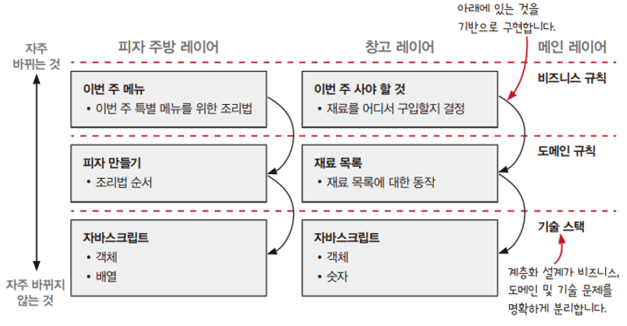

# CHAPTER 2. 현실에서의 함수형 사고

현실적인 문제에 함수형 사고를 적용해보고, 소프트웨어 구조를 잡는 데 계층형 설계가 좋은 이유를 설명한다.  

<br/>

## 토니 피자에 오신 것을 환영합니다

 - 내용
```
1. 액션과 계산, 데이터
토니는 요리 재료와 기타 필요 자원을 사용하는 코드를 액션으로 구분하고 나머지 코드는 계산으로 구분하였다.
토니의 코드에서 액션과 계산, 데이터 각 분류에 해당하는 예를 살펴보고 코드에 적용한 계층형 설계 원칙을 알아본다.

2. 일급 추상
가게 주방에는 많은 로봇이 함께 피자를 만든다.
이것은 분산 시스템이라고 할 수 있다.
토니는 여러 로봇이 협력할 수 있도록 함수를 인자로 받는 일급 함수를 사용했다.
```

<br/>

 - A. 액션과 계산, 데이터
```
1. 액션
액션으 호출 횟수와 시점에 의존한다.
오븐이나 배달차 같은 자원과 요리 재료를 사용하는 것은 액션이다.
 - ex) 반죽 펴기, 피자 배달, 재료 주문

2. 계산
어떤 것을 결정하거나 계획하는 것은 계산이다.
계산은 실행해도 다른 곳에 영향을 주지 않는다.
 - ex) 조리법에 나온 것을 두 배로 만들기, 쇼핑 목록 결정

3. 데이터
결제, 재고, 피자 조리법 같은 것은 데이터이다.
데이터는 유연하기 때문에 저장하거나 네트워크로 전송하는 등 다양하게 쓸 수 있다.
 - ex) 고객 주문, 영수증, 조리법
```

<br/>

 - A-2. 변경 가능성에 따라 코드 나누기
    - 위쪽으로 갈수록 자주 바뀌는 코드가 있고, 아래쪽으로 갈수록 자주 바뀌지 않는 코드
    - 각 계층은 그 아래에 있는 계층을 기반으로 만들어진다. 그래서 각 계층에 있는 코드는 더 안정적인 기반 위에 작성할 수 있다.

<div align="center">
    
</div>

<br/>

 - 일급 추상
    - 타임라인 다이어그램으로 피자를 만들기 위한 액션을 나열한다.
    - 단 한 대의 로봇이 일을 차례대로 한다. (효율성 X)
```
치즈 피자 만들기
1. 주문 접수
2. 반죽 만들기 (준비)
3. 반죽 펴기 (사용)
4. 소스 만들기 (준비)
5. 소스 뿌리기 (사용)
6. 치즈 갈기 (준비)
7. 치즈 뿌리기 (사용)
8. 오븐에 넣기
9. 10분 기다리기
10. 서빙
```

<br/>

 - 분산 시스템을 타임라인으로 시각화하기
    - 로봇 한 대로 피자를 만들면은 일을 차례대로 처리하여 효율적이지 못하다.
    - 반죽 만들기, 소스 만들기, 치즈 갈기 작업을 나누고 로봇 3대가 동시에 일을 하면 더 빠르고 효율적으로 일을 처리할 수 있다.
    - __중요한 점은 타임 라인의 순서가 맞추지 않은 분산 시스템은 예측 불가능한 순서로 실행된다. 로봇들이 반죽, 치즈, 소스 준비가 끝나면 피자를 만들도록 해야 한다.__

<br/>

 - 타임라인 커팅: 로봇이 서로를 기다릴 수 있게 하기
    - 타임라인 커팅은 여러 타임라인이 동시에 진행될 떄 서로 순서를 맞추는 방법이다.
    - 각 타임라인은 독립적으로 동작하고 작업이 완료되면 다른 타임라인 끝나기를 기다리기 때문에 어떤 타임라인이 먼저 끝나도 괜찮다.
```
1. 주문 접수
2. 반죽만들기, 치즈갈기, 소스만들기 [3대 로봇]
--------- // 컷: 모든 작업이 끝날 떄까지 대기
3. 반죽 펴기
4. 소스 뿌리기
5. 치즈 뿌리기
6. 오븐에 넣기
7. 10분 기다리기
8. 서빙
```

<br/>

## 요점 정리

 - 액션과 계산, 데이터를 구분하는 일은 함수형 프로그래밍에서 가장 중요하고 첫 번쨰로 해야하는 일이다.
 - 함수형 프로그래머는 유지보수를 잘 하기 위해 계층형 설계를 사용한다. 각 계층은 코드의 변경 가능성에 따라 나눈다.
 - 타임라인 다이어그램은 시간에 따라 변하는 액션을 시각화하는 방법이다. 타임라인 다이어그램으로 액션이 다른 액션과 어떻게 연결되는지 볼 수 있다.
 - 타임라인 커팅은 액션이 올바른 순서로 실행할 수 있도록 보장해준다.
