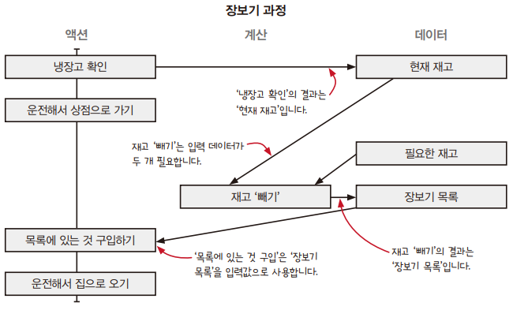
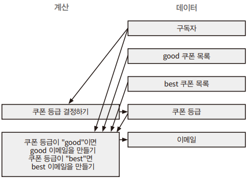

# CHAPTER 3. 액션과 계산, 데이터의 차이를 알기

현실 세계의 문제를 통해 코드에서 액션과 계산, 데이터를 찾아 적용하는 방법을 알아본다.  

<br/>

## 액션과 계산, 데이터

__액션__ 은 실행 시점과 횟수에 의존한다. 다른 말로 부수 효과, 부수 효과가 있는 함수, 순수하지 않은 함수라고 부르기도 한다.  
__계산__ 은 입력으로 출력을 계산한다. 다른 말로 순수 함수, 수학 함수라고 부르기도 한다.  
__데이터__ 는 이벤트에 대한 사실을 의미한다.  
 - A. 문제에 대해 생각할 때
    - 문제를 액션과 계산, 데이터로 나눠 생각해 볼 수 있다.
    - 특별히 주의해야 할 부분(액션)과 데이터로 처리해야 할 부분, 결정을 내려야 하는 부분(계산)을 명확히 알 수 있다.
 - B. 코딩할 떄
    - 코딩을 할 떄도 액션과 계산, 데이터를 구분할 수 있다.
    - 최대한 액션에서 계산을 빼내려고 한다. 또 계산에서는 데이터를 분리할 수 있는지 생각한다.
    - 더 나아가 액션이 계산이 될 수 있는지, 계산은 데이터가 될 수 있는지 고민한다.
 - C. 코드를 읽을 떄
    - 코드를 읽을 때 액션과 계산, 데이터 중 어떤 것에 속하는지 잘 살펴봐야 한다.
    - 특히, 액션은 시간에 의존하기 때문에 더 조심해야 한다.

<br/>

### 장보기 과정

 - 타임라인 다이어그램
```
1. 냉장고 확인하기 (액션)
 - 냉장고를 확인하는 시점에 따라 냉장고에 있는 제품이 다르다.

2. 운전해서 상점으로 가기 (액션)
 - 두 번 운전해서 상점에 가면 연료가 두 배로 든다.

3. 필요한 것 구입하기 (액션)
 - 누군가 브로콜리를 구입하면 브로콜리가 다 떨어질 수 있다. 즉, 구입 시점이 중요하다.

4. 운전해서 집으로 오기 (액션)
 - 언제 하는지가 중요하다.
```

<br/>

 - 단계별로 다시 살펴보기
    - __액션 안에는 계산과 데이터, 또 다른 액션이 숨어 있을 수 있다.__
        - 단순해 보이는 액션도 또 다른 액션이나 계산, 데이터로 나눌 수 있다.
        - 함수형 프로그래밍에서는 액션을 더 작은 액션과 계산, 데이터로 나누고 나누는 것을 언제 멈춰야 할지 아는 것이 중요하다.
    - __계산은 더 작은 계산과 데이터로 나누고 연결할 수 있다.__
        - 계산을 더 작은 계산으로 나눌 수 있는 상황도 있다.
        - 계산을 나누면 첫 번쨰 계산의 결과 데이터가 두 번째 계산의 입력이 된다.
    - __데이터는 데이터만 조합할 수 있다.__
        - 데이터는 다른 영향을 주지 않는 그냥 데이터이다.
        - 떄문에, 데이터를 찾는 일을 먼저 해야 한다.
```
1. 냉장고 확인하기 (액션)
 - 냉장고에 가지고 있는 제품은 데이터이다. (현재 재고)

2. 운전해서 상점으로 가기 (액션)
 - 운전해서 상점으로 가는 것은 복잡한 행동이고 명확히 액션이다.
 - 여기서 상점 위치나 가는 경로는 데이터로 볼 수 있다.

3. 필요한 것 구입하기
 - 구입하는 일도 확실히 액션이다.
 - 하지만, 구입 과정은 몇 단계로 나눌 수 있다.
    - 현재 재고: 데이터
    - 필요한 재고: 데이터
    - 재고 빼기: 계산
    - 장보기 목록: 데이터
    - 목록에 있는 것 구입하기: 액션

4. 운전해서 집으로 오기 (액션)
```

<div align="center">
    
</div>

<br/>

## 새로 만드는 코드에 함수형 사고 적용하기

쿠폰독은 쿠폰에 관심 있는 구독자들에게 이메일로 쿠폰을 매주 보내주는 서비스이다.  
쿠폰독 CMO는 사용자를 더 늘리기 위해 친구 10명을 추천하면 더 좋은 쿠폰을 보내주려고 한다.  

<br/>

 - 액션, 계산, 데이터 분류
    - 액션: A
    - 계산: C
    - 데이터: D
```
이메일 보내기 [A]
데이터베이스에서 구독자 가져오기 [A]
쿠폰에 등급 매기기 [D]
데이터베이스에서 쿠폰 읽기 [A]
이메일 제목 [D]
이메일 주소 [D]
추천 수 [D]
어떤 이메일이 쿠폰을 받을지 결정하기 [C]
구독자 DB 레코드 [D]
쿠폰 DB 레코드 [D]
쿠폰 목록 DB 레코드 [D]
구독자 목록 DB 레코드 [D]
이메일 본문 [D]
```

<br/>

 - 쿠폰 보내는 과정 그려보기
```
1. 데이터베이스에서 구독자를 가져온다. [액션]
쿠폰을 이메일로 보내려면 먼저 데이터베이스에서 구독자를 가져온다.
구독자는 계속 바뀌기 때문에 조회 시점마다 구독자가 다를 수 있다.
가져온 구독자 목록은 데이터이다.

2. 데이터베이스에서 쿠폰 목록 가져오기 [액션]
쿠폰 데이터베이스는 계속 바뀌기 때문에 가져오는 시점이 중요하다.
가져온 쿠폰 목록은 데이터이다. 쿠폰 목록 데이터는 DB 쿼리 이벤트에 대한 사실이라고 할 수 있다.

3. 보내야 할 이메일 목록 만들기 [계산]
구독자 목록와 쿠폰 목록을 보고 이메일 목록을 계획한다.
생성된 이메일 목록은 다음 단계에서 사용할 데이터이다.

4. 이메일 전송하기 [액션]
```

<br/>

 - 이메일 만드는 부분 자세히 살펴보기
    - 계산을 나누면 구현하기 쉽다.
    - 하지만, 충분히 구현하기 쉽다고 생각되는 시점에서 더 나누는 것을 멈춰야 한다.
```
1. 구독자 목록과 쿠폰 목록 데이터를 입력받아 이메일 목록을 계획할 수 있다.
 - 구독자 목록, 쿠폰 목록[데이터] > 이메일 목록 계획하기[액션] > 이메일 목록[데이터]

2. 이메일 목록을 계획하는 계산을 더 작은 계산으로 나눌 수 있다.
2-1. 쿠폰 목록에서 'good' 쿠폰 목록과 'best' 쿠폰 목록을 계산한다.
 - 쿠폰 목록[데이터] > good 쿠폰 선택하기[계산] > good 쿠폰 목록[데이터]
 - 쿠폰 목록[데이터] > best 쿠폰 선택하기[계산] > best 쿠폰 목록[데이터]

2-2. 어떤 구독자가 good 쿠폰을 받을지 best 쿠폰을 받을지 결정한다.
 - 구독자[데이터] > 쿠폰 등급 결정하기[계산] > 쿠폰 등급[데이터]
```

<div align="center">
    
</div>

<br/>

 - 쿠폰 보내는 과정 구현하기
    - 계산은 함수로 구현한다. 입력값은 함수 인자이고 출력값은 함수의 리턴값이다.
```JS
// 데이터베이스에서 가져온 구독자 데이터
var subscriber = {
  email: "sam@pmail.com",
  rec_count: 16
};

// 쿠폰 등급은 문자열
var rank1 = "best";
var rank2 = "good";

// 쿠폰 등급을 결정하는 함수 (계산)
function subCouponRank(subscriber) {
  if(subscriber.rec_count >= 10)
    return "best";
  else
    return "good";
}

// 데이터베이스에서 가져온 쿠폰 데이터
var coupon = {
  code: "10PERCENT",
  rank: "bad"
};

// 특정 등급의 쿠폰 목록을 선택하는 함수 (계산)
// 같은 쿠폰 목록와 등급을 넣으면 항상 같은 쿠폰 목록이 반환된다. (호출 횟수 영향 X)
function selectCouponsByRank(coupons, rank) {
  var ret = []; // 빈 배열로 초기화
  for(var c = 0; c < coupons.length; c++) { // 모든 쿠폰에 대해 반복
    var coupon = coupons[c];
    if(coupon.rank === rank)
      ret.push(coupon.code);
  }
  return ret;
}

// 이메일 데이터
var message = {
  from: "newsletter@coupondog.co",
  to: "sam@pmail.com",
  subject: "Your weekly coupons inside",
  body: "Here are your coupons ..."
};

// 구독자가 받을 이메일을 계획하는 함수 (계산)
// 외부에 어떤 영향도 주지 않고 입력값에 따라 이메일을 결정하고 반환
function emailForSubscriber(subscriber, goods, bests) {
  var rank = subCouponRank(subscriber); // 쿠폰 등급 계산
  if(rank === "best")
    return {
      from: "newsletter@coupondog.co",
      to: subscriber.email,
      subject: "Your best weekly coupons inside",
      body: "Here are the best coupons: " + bests.join(", ")
    };
  else // rank === "good"
    return {
      from: "newsletter@coupondog.co",
      to: subscriber.email,
      subject: "Your good weekly coupons inside",
      body: "Here are the good coupons: " + goods.join(", ")
    };
}

// 보낼 이메일 목록 준비 (계산)
function emailsForSubscribers(subscribers, goods, bests) {
  var emails = [];
  for(var s = 0; s < subscribers.length; s++) {
    var subscriber = subscribers[s];
    var email = emailForSubscriber(subscriber, goods, bests);
    emails.push(email);
  }
  return emails;
}

// 이메일 보내기 (액션)
function sendIssue() {
  var coupons     = fetchCouponsFromDB(); // 쿠폰 목록 조회
  var goodCoupons = selectCouponsByRank(coupons, "good"); // good 쿠폰 목록 계산
  var bestCoupons = selectCouponsByRank(coupons, "best"); // best 쿠폰 목록 계산
  var subscribers = fetchSubscribersFromDB(); // 구독자 목록 조회
  var emails = emailsForSubscribers(subscribers, goodCoupons, bestCoupons); // 보낼 이메일 목록 계산
  for(var e = 0; e < emails.length; e++) {
    var email = emails[e];
    emailSystem.send(email);
  }
}
```

<br/>

 - 개선하기
    - 사용자가 많다면 메모리 부족으로 시스템이 동작하지 않을 수도 있다.
    - emailsForSubscribers() 함수는 구독자를 배열로 받는다. 이 함수에 모든 구독자 목록을 한꺼번에 배열로 넘기지 않아도 된다.
    - fetchSubscribersFromDB() 함수는 모든 구독자를 리턴하는데, 일부 구독자만 리턴하도록 바꿔야 한다.
    - __계산은 고치지 않고, 데이터베이스에서 메모리로 읽어오는 액션만 고쳐서 최적화한다.__
```JS
function sendIssue() {
  var coupons = fetchCouponsFromDB();
  var goodCoupons = selectCouponsByRank(coupons, "good");
  var bestCoupons = selectCouponsByRank(coupons, "best");
  var page = 0;
  var subscribers = fetchSubscribersFromDB(page);
  while(subscribers.length > 0) {
    var emails = emailsForSubscribers(subscribers, goodCoupons, bestCoupons);
    for(var e = 0; e < emails.length; e++) {
      var email = emails[e];
      emailSystem.send(email);
    }
    page++;
    subscribers = fetchSubscribersFromDB(page);
  }
}
```

<br/>

## 이미 있는 코드에 함수형 사고 적용하기

제나가 자회사에 수수료를 보내기 위해 만든 코드로, sendPayout() 함수는 실제 은행 계좌로 송금하는 액션이다.  

 - 예제 코드
    - 아래 코드는 함수형 코드로 보기 어렵다.
    - A. 액션의 정의에 따르면 액션은 호출 시점이나 횟수에 의존한다. figurePayout() 함수는 액션인 sendPayout() 함수를 호출하기 때문에 역시 호출 시점과 횟수에 의존하게 된다.
    - 액션은 코드 전체로 퍼진다. 액션을 부르는 함수가 있다면 그 함수도 액션이 된다. 또 그 함수를 부르는 다른 함수도 역시 액션이 된다. 이런식으로 작은 액션 하나가 코드 전체로 퍼져 나간다.
```JS
// 함수 안에서 액션을 호출하고 있기 떄문에 함수 전체가 액션이 된다.
function figurePayout(affiliate) {
  var owed = affiliate.sales * affiliate.commission;
  if(owed > 100) // don’t send payouts less than $100
    sendPayout(affiliate.bank_code, owed); // 계좌 이체 함수 (액션)
}

// figurePayout() 함수는 액션이기 떄문에 이 함수를 호출하는 곳도 액션이 된다.
function affiliatePayout(affiliates) {
  for(var a = 0; a < affiliates.length; a++)
    figurePayout(affiliates[a]);
}

// 모든 것이 액션이다.
function main(affiliates) {
  affiliatePayout(affiliates);
}
```

<br/>

## 액션은 다양한 형태로 나타난다.

자바스크립트 언어에서는 나도 모르게 액션을 호출하고 있을지도 모른다. 그리고 그것으로 인해 코드가 복잡해질 수 있다. 액션을 관리하기 위해서 액션이 코드에서 어떤 형태로 나타나는지 알아야 한다.  

```JS
// 함수 호출
alert("Hello World!"); // 팝업 창이 뜨는 것은 액션이다.

// 메서드 호출
console.log("Hello"); // 콘솔에 출력한다.

// 생성자
new Date(); // 부르는 시점에 현재 날짜와 시간을 초기화하기 떄문에 호출되는 시점에 따라 다른 값을 가진다.

// 표현식
y; // 변수 참조: y가 공유되고 변경 가능한 변수라면 읽는 시점에 따라 값이 다를 수 있다.
user.first_name; // 속성 참조: user가 공유되고 변경 가능한 객체라면 읽는 시점에 따라 다를 수 있다.
stack[0]; // 배열 참조: stack이 공유되고 변경 가능한 배열이라면 읽는 시점에 따라 값이 다를 수 있다.

// 상태
z = 3; // 값 할당: 공유하기 위해 값을 할당했고 벼녁ㅇ 가능한 변술면 다른 코드에 영향을 준다.
delete user.first_name; // 속성 삭제: 속성을 지우는 것은 다른 코드에 영향을 준다.
```
