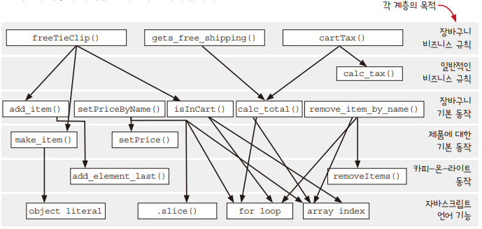
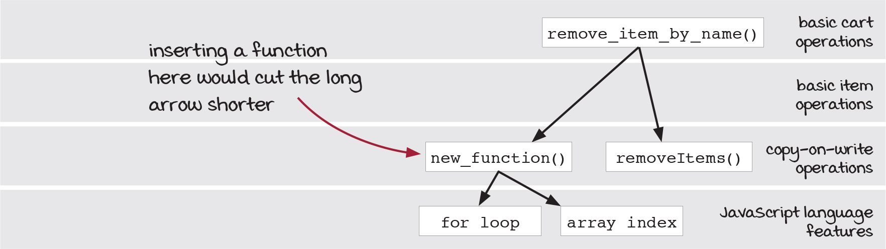
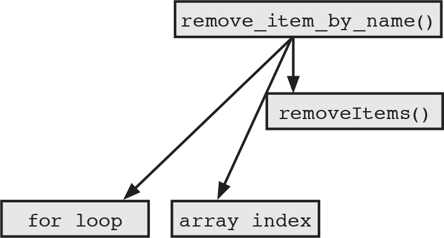
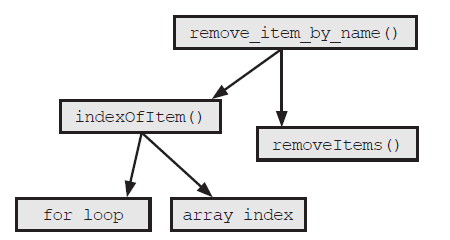
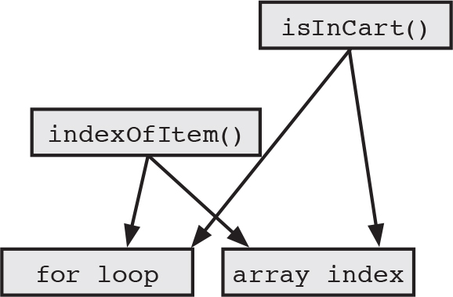
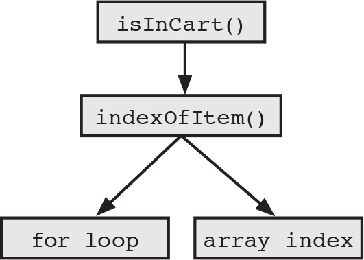

# CHAPTER 8. 계층형 설계 I

소프트웨어 설계에 대한 실용적인 정의를 소개하고, 계층형 설계 이해와 어떤 도움이 되는지 알아본다.  

<br/>

## 계층형 설계

계층형 설계는 소프트웨어를 계층으로 구성하는 기술이다. 각 계층에 있는 함수는 바로 아래 계층에 있는 함수를 이용해 정의한다.  

<br/>

### 계층형 설계 감각을 키우기 위한 입력

계층형 설계 감각을 키우기 위해 다양한 입력을 생각해 볼 수 있다. 그리고 이러한 입력들은 계층형 설계에 대한 단서가 된다.  
 - 함수 본문
    - 길이
    - 복잡성
    - 구체화 단계
    - 함수 호출
    - 프로그래밍 언어의 기능 사용
 - 계층 구조
    - 화살표 길이
    - 응집도
    - 구체화 단계
 - 함수 시그니처
    - 함수명
    - 인자 이름
    - 인자값
    - 리턴값

<br/>

### 계층형 설계 감각을 키우기 위한 출력

 - 조직화
    - 새로운 함수를 어디에 놓을지 결정
    - 함수를 다른 곳으로 이동
 - 구현
    - 구현 바꾸기
    - 함수 추출하기
    - 데이터 구조 바꾸기
 - 변경
    - 새 코드를 작성할 곳 선택하기
    - 적절한 수준의 구체화 단계 결정하기

<br/>

### 계층형 설계 패턴

 - 모든 함수가 그래프에 있어야 한다.
 - 함수 안에서 다른 함수를 호출한다면 반드시 표시되어야 한다.
 - 화살표는 옆이나 위가 아닌 아래로 향해야 한다.
 - 같은 계층에 있는 함수는 같은 목적을 가져야 한다.

<div align="center">
    
</div>
<div align="center">
    freeTieClip(): 넥타이를 하나 사면 무료로 넥타이 클립을 줍니다. <br/>
    gets_free_shipping(): 일정 금액이상 장바구니에 담으면 무료 배송 표시를 해줍니다. <br/>
    cartTax() : 장바구니 총액에 따라 세금을 표시합니다.
</div>

```JS
function freeTieClip(cart) {
  var hasTie = isInCart(cart, "tie");
  var hasTieClip = isInCart(cart, "tie clip");
  if(hasTie && !hasTieClip) {
    var tieClip = make_item("tie clip", 0);
    return add_item(cart, tieClip);
  }
  return cart;
}

function isInCart(cart, name) {
  for(var i = 0; i < cart.length; i++) {
    if(cart[i].name === name)
      return true;
  }
  return false;
}
```

<br/>

### 연습 문제

 - 반복문 빼내기
```JS
/// Before
function remove_item_by_name(cart, name) {
  var idx = null;
  for(var i = 0; i < cart.length; i++) {
    if(cart[i].name === name)
      idx = i;
  }
  if(idx !== null)
    return removeItems(cart, idx, 1);
  return cart;
}

/// After
function remove_item_by_name(cart, name) {
  var idx = indexOfItem(cart, name);
  if(idx !== null)
    return removeItems(cart, idx, 1);
  return cart;
}

function indexOfItem(cart, name) {
  for(var i = 0; i < cart.length; i++) {
    if(cart[i].name === name)
      return i;
  }
  return null;
}
```
<div align="center">
    
</div>
<div align="center">
    
</div>
<div align="center">
    
</div>
<div align="center">
    이미지 출처 - https://livebook.manning.com/book/grokking-simplicity/chapter-8/1
</div>

<br/>

 - 비슷한 부분 사용하기
```JS
/// Before
function isInCart(cart, name) {
  for(var i = 0; i < cart.length; i++) {
    if(cart[i].name === name)
      return true;
  }
  return false;
}

function indexOfItem(cart, name) {
  for(var i = 0; i < cart.length; i++) {
    if(cart[i].name === name)
      return i;
  }
  return null;
}

/// After
function isInCart(cart, name) {
  return indexOfItem(cart, name) !== null;
}
    
function indexOfItem(cart, name) {
  for(var i = 0; i < cart.length; i++) {
    if(cart[i].name === name)
      return i;
  }
  return null;
}
```

<div align="center">
    
</div>
<div align="center">
    
</div>
