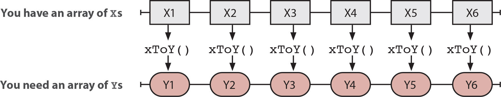
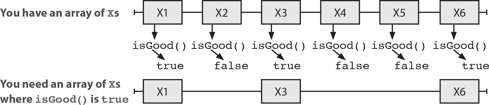
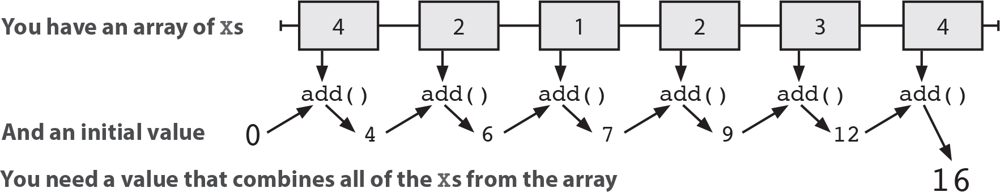

# CHAPTER 12. 함수형 반복

함수형 프로그래밍 언어에는 컬렉션 데이터를 다룰 수 있는 다양하고 강력한 추상 함수가 존재한다.  

 - map
    - map은 어떤 배열의 모든 항목에 함수를 적용해 새로운 배열로 변경한다.
    - 각 항목은 지정한 콜백 함수에 의해 변환된다.
```JS
function map(array, f) {
  var newArray = [];
  forEach(array, function(element) {
    newArray.push(f(element)); // 원래 배열 항목으로 새로운 항목을 만든다.
  });
  return newArray; // 새로운 배열을 리턴한다.
}
```

<div align="center">
    
</div>

<br/>

 - filter
    - filter는 어떤 배열의 하위 집합을 선택해 새로운 배열로 만든다.
    - 술어를 전달해서 특정 항목을 선택할 수 있다.
```JS
function filter(array, f) {
  var newArray = [];
  forEach(array, function(element) {
    if(f(element))
      newArray.push(element); // 조건에 맞으면 새로운 배열에 항목을 추가한다.
  });
  return newArray; // 새로운 배열을 리턴한다.
}
```

<div align="center">
    
</div>

<br/>

 - reduce
    - reduce는 초깃값을 가지고 어떤 배열의 항목을 조합해 하나의 값을 만든다. 데이터를 요약하거나 시퀀스를 하나의 값으로 만들 때 주로 사용된다.
    - 배열을 순회하면서 값을 누적할 수 있다.
    - reduce()를 이용하면 map(), filter()를 만들 수 있다. 반대는 불가능하다.
    - reduce()를 이용하면 실행 취소/실행 복귀, 시간 여행 디버깅, 회계 감사 추적 등 많은 일을 할 수 있다.
```JS
function reduce(array, init, f) { // 배열, 초깃값, 누적 함수
  var accum = init; // 누적된 값을 초기화한다.
  forEach(array, function(element) {
    accum = f(accum, element); // 누적 값을 계산하기 위해 현재 값과 배열 항목으로 f() 함수를 호출
  });
  return accum; // 누적된 값을 리턴
}

// reduce 사용
function sum(numbers) {
  return reduce(numbers, 0, function(total, num) {
    return total + num;
  });
}

function product(numbers) {
  return reduce(numbers, 1, function(total, num) {
    return total * num;
  });
}

function min(numbers) {
  return reduce(numbers, Number.MAX_VALUE, function(m, n) {
    if(m < n) return m;
    else return n;
  });
}

function max(numbers) {
  return reduce(numbers, Number.MIN_VALUE, function(m, n) {
    if(m > n) return m;
    else return n;
  });
}

function map(array, f) {
  return reduce(array, [], function(ret, item) {
    ret.push(item);
    return ret;
  });
}

function filter(array, f) {
  return reduce(array, [], function(ret, item) {
    if(f(item))
      ret.push(item);
    return ret;
  });
}
```

<div align="center">
    
</div>

<br/>