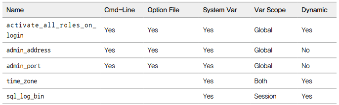

# 서버 설정

일반적으로 MySQL 서버는 단 하나의 설정 파일을 사용한다. 유닉스 계열에서는 my.cnf 파일, 윈도우 계열에서는 my.ini 파일을 사용한다. MySQL 서버는 시작될때만 이 설정 파일을 참조하는데, MySQL 서버는 지정된 여러 개의 디렉토리를 순차적으로 탐색하면서 처음 발견된 my.cnf 파일을 사용하게 된다.  

만약, MySQL 서버가 어느 디렉토리에서 my.cnf 파일을 읽는지 궁금한 경우 mysqld 프로그램을 '--verbose --help' 옵션을 주어 실행하면 된다.  

```bash
$ mysql --verbose --help
...
Default options ..
/etc/my.cnf /etc/mysql/my.cnf /usr/etc/my.cnf ~/.my.cnf
...
```

<br/>

## 설정 파일 구성

하나의 MySQL 설정 파일 안에 여러 개의 설정 그룹을 담을 수 있으며, 대체로 실행 프로그램 이름을 그룹명으로 사용한다.  

mysqldump 프로그램은 [mysqldump] 설정 그룹을 참고하고, mysql 프로그램은 [mysqld] 설정 그룹을 참조한다.  

```cnf
[mysqld_safe]
malloc-lib = /opt/lib/libtcmalloc_minimal.so

[mysqld]
socket = /usr/local/mysql/tmp/mysql.sock
port = 3306

[mysql]
default-character-set = utf8mb4
socket = /usr/local/mysql/tmp/mysql.sock
port = 3304

[mysqldump]
default-character-set = utf8mb4
socket = /usr/local/mysql/tmp/mysql.sock
port = 3305
```

<br/>

## MySQL 시스템 변수의 특징

MySQL 서버는 기동하면서 설정 파일의 내용을 읽어 메모리나 작동 방식을 초기화하고, 접속된 사용자를 제어하기 위해 이러한 값을 별도로 저장해 둔다. 각 시스템 변수는 MySQL 서버에 접속해 SHOW VARIABLES 또는 SHOW GLOBAL VARIABLES 명령으로 확인할 수 있다.  

```bash
mysql> SHOW GLOBAL VARIABLES;
```

시스템 변수 값이 어떻게 MySQL 서버와 클라이언트에 영향을 미치는지 판단하려면 각 변수가 글로벌 변수인지 세션 변수인지 구분할 수 있어야 한다.  

 - Cmd-Line: MySQL 서버의 명령행 인자로 설정될 수 있는지 여부를 나타낸다. 이 값이 'Yes'인 경우 명령행 인자로 이 시스템 변수의 값이 대체될 수 있다.
 - Option file: MySQL 설정 파일인 my.cnf로 제어할 수 있는지 여부를 나타낸다.
 - System Var: 시스템 변수인지 아닌지를 나타낸다.
 - Var Scope: 시스템 변수의 적용 범위를 나타낸다. 이 시스템 변수가 영향을 미치는 곳이 MySQL 서버 전체를 대상으로 하는지, 아니면 MySQL 서버와 클라이언트 간의 커넥션(세션)만인지 구분한다.
 - Dynamic: 시스템 변수가 동적인지 정적인지 구분하는 변수

<div align="center">
    
</div>
<br/>

## 글로벌 변수와 세션 변수

글로벌 범위의 시스템 변수는 하나의 MySQL 서버 인스턴스에서 전체적으로 영향을 미치는 시스템 변수를 의미하며, 주로 MySQL 서버 자체에 관련된 설정일 때가 많다.  

세션 범위의 시스템 변수는 MySQL 클라이언트가 MySQL 서버에 접속할 때 기본으로 부여하는 옵션의 기본값을 제어하는 데 사용된다. 여기서 기본값은 글로벌 시스템 변수이며, 각 클라이언트가 가지는 값이 세션 시스템 변수다.  
예를 들어, 각 클라이언트에서 쿼리 단위로 자동 커밋을 수행할지 여부를 결정하는 autocommit 변수가 예가 될 수 있다. autocommit을 ON으로 설정해 두면 해당 서버에 접속하는 모든 커넥션은 기본으로 자동 커밋 모드로 시작되지만, 각 커넥션에서 autocommit 변수의 값을 OFF로 변경해 자동 커밋 모드를 비활성화할 수도 있다.  

세션 범위의 시스템 변수 가운데 MySQL 서버의 설정 파일에 명시해 초기화할 수 있는 변수는 대부분 범위가 'Both'로 명시된다. Both로 명시된 시스템 변수는 MySQL 서버가 기억만 하고 있다가 실제 클라이언트와 커넥션이 생성되는 순간에 해당 커넥션의 기본값으로 사용되는 값이다.  

<br/>

## 정적 변수와 동적 변수

시스템 변수는 MySQL 서버가 기동 중인 상태에서 변경 가능 여부에 따라 동적 변수와 정적 변수로 구분된다.  
예를 들어, 디스크에 저장된 설정 파일의 내용을 변경하더라도 MySQL 서버가 재시작하기 전에는 적용되지 않는다. 하지만, SHOW 명령으로 MySQL 서버에 적용된 변수값을 확인하거나, SET 명령을 이용해 값을 바꿀 수도 있다.  

 - `SHOW와 SET 명령어`
    - SET 명령은 설정 파일(my.cnf)에 반영되는 것은 아니고, 현재 기동 중인 MySQL 인스턴스에만 유효하다.
    - MySQL 서버의 설정을 영구히 적용하려면 설정 파일(my.cnf)에 반드시 변경해야 한다.
    - MySQL 8.0 버전부터는 SET PERSISTS 명령으로 실행 중인 MySQL 인스턴스에 적용과 설정 파일에 자동으로 기록할 수 있다.
        - SET PERSIST 명령으로 시스템 변수를 변경하면 MySQL 서버는 변경된 값을 즉시 적용함과 동시에 별도의 설정 파일(mysqld-auto.cnf)에 변경 내용을 기록한다.
        - MySQL 서버가 시작될 때 기본 설정 파일(my.cnf)와 자동 생성된 mysqld-auto.cnf 파일을 참조해 시스템 변수를 적용한다.
        - 만약, 현재 실행 중인 MySQL 서버에 적용하지 않고, 재시작할 때 mysqld-auto.cnf 파일에만 변경 내용을 기록하고 싶다면 SET PERSIST_ONLY 명령을 사용한다.
```bash
mysql> SHOW GLOBAL VARIALBES LIKE '%max_connections%';
mysql> SET GLOBAL max_connections=500;

# 현재 MySQL 인스턴스 적용 + 자동 설정 파일 생성
SET PERSIST maxconnections=5000;

# 자동 설정 파일만 생성
SET PERSIST_ONLY maxconnections=5000;
```

 - `RESET PERSIST 명령어`
    - mysqld-auto.cnf 파일의 내용을 직접 변경할 때 내용상 오류를 만들어, MySQL 서버가 시작되지 못하게 될 수도 있다.
    - 그래서, RESET PERSIST 명령어를 이용하면 안전하게 제거할 수 있다.
```bash
# 특정 시스템 변수 삭제
mysql> RESET PERSIST max_connections;
mysql> RESET PERSIST IF EXISTS max_connections;

# mysqld-auto.cnf 파일 모든 시스템 변수 삭제
mysql> RESET PERSIST
```

<br/>

## my.cnf 파일

MySQL 8.0 서버의 시스템 변수는 약 570개로, 사용하는 플러그인이나 컴포넌트에 따라 더 늘어날 수도 있다. 모든 시스템 변수를 알 필요는 없지만, MySQL 서버를 제대로 사용하기 위해서는 시스템 변수에 대한 이해가 필요하다.  

