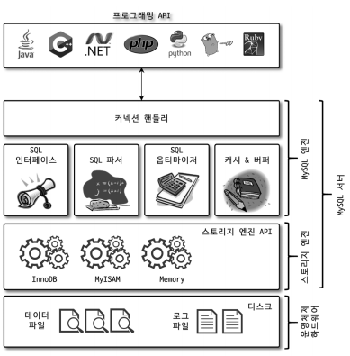
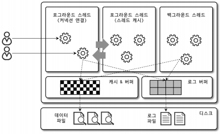
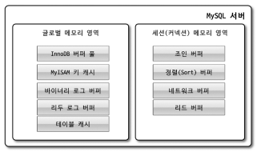
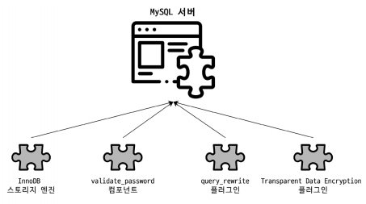
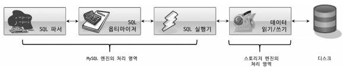
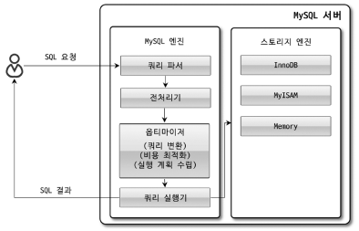

# 아키텍처

 - MySQL 엔진, 스토리지 엔진(InnoDB, MyISAM)

<br/>

## 1. MySQL 엔진 아키텍처

MySQL은 일반 상용 RDBMS와 같이 대부분의 프로그래밍 언어로부터 접근 방법을 모두 지원한다.  
MySQL은 고유의 C API부터 JDBC, ODBC, .NET 표준 드라이버를 제공하며, 이러한 드라이버를 이용해 C/C++, PHP, 자바, 펄, 파이썬, 루비, .NET 및 코볼까지 모든 언어로 MySQL 서버에서 쿼리를 사용할 수 있도록 지원한다.  
 - MySQL 서버는 MySQL 엔진과 스토리지 엔진으로 구분할 수 있다.

<div align="center">
    
</div>
<br/>

### 1-1. MySQL 엔진

MySQL 엔진은 클라이언트로부터 접속 및 쿼리 요청을 처리하는 커넥션 핸들러와 SQL 파서 및 전처리기, 쿼리의 최적화된 실행을 위한 옵티마이저가 중심을 이룬다.  
 - 클라이언트 커넥션 핸들링
 - SQL 인터페이스
 - SQL 파서
 - SQL 옵티마이저
 - 캐시&버퍼

<br/>

### 1-2. 스토리지 엔진

MySQL 엔진은 요청된 SQL 문장을 분석하거나 최적화하는 등 DBMS의 두뇌에 해당하는 처리를 수행하고 실제 데이터를 디스크 스토리지에 저장하거나 디스크 스토리지로부터 데이터를 읽어오는 부분은 스토리지 엔진이 전담한다.  
 - MySQL 서버안에 MySQL 엔진은 하나만 사용 가능하지만, 스토리지 엔진은 여러 개를 동시에 사용할 수 있다.
 - 각 스토리지 엔진은 성능 향상을 위해 키 캐시(MyISAM 스토리지 엔진)나 InnoDB 버퍼 풀(InnoDB 스토리지 엔진) 같은 기능을 내장하고 있다.
```sql
-- test_table을 생성한다.
-- 해당 테이블의 모든 읽기와 변경 작업은 INNODB 스토리지 엔진이 처리한다.
CREATE TABLE test_table (fd1 INT, fd2 INT) ENGINE=INNODB;
```
<br/>

### 1-3. 핸들러 API

MySQL 엔진의 쿼리 실행기에서 데이터를 쓰거나 읽을 때 각 스토리지 엔진에 쓰기 또는 읽기를 요청한다.  
이러한 요청을 핸들러 요청이라고 하며, 여기서 사용되는 API를 핸들러 API라고 한다.  
 - InnoDB 스토리지 엔진 또한 핸들러 API를 이용해 MySQL 엔진과 데이터를 주고 받는다.

```sql
-- 핸들러 API 통계 확인
SHOW GLOBAL STATUS LIKE 'Handler%';
```
<br/>

## 2. MySQL 스레딩 구조

<div align="center">
    
</div>
<br/>

MySQL 서버는 프로세스 기반이 아니라 쓰레드 기반으로 동작하며, 포그라운드 쓰레드와 백그라운드 쓰레드로 구분할 수 있다.  

```sql
-- MySQL 서버에서 실행 중인 쓰레드 목록 확인
SELECT thread_id, name, type, processlist_user, processlist_host
FROM performance_schema.threads
ORDER BY type, thread_id;
```
<br/>

### 2-1. 포그라운드 쓰레드(클라이언트 쓰레드)

포그라운드 쓰레드는 최소한 MySQL 서버에 접속된 클라이언트의 수만큼 존재하며, 주로 각 클라이언트 사용자가 요청하는 쿼리 문장을 처리한다. 클라이언트 사용자가 작업을 마치고 커넥션을 종료하면 해당 커넥션을 담당하던 쓰레드는 다시 쓰레드 캐시로 되돌아간다.  

포그라운드 쓰레드는 데이터를 MySQL의 데이터 버퍼나 캐시로부터 가져오며, 버퍼나 캐시에 없는 경우에는 직접 디스크이 데이터나 인덱스 파일로부터 데이터를 읽어와서 작업을 처리한다. MyISAM 테이블은 디스크 쓰기 작업까지 포그라운드 쓰레드가 처리하지만, InnoDB 테이블은 데이터 버퍼나 캐시까지만 포그라운드 쓰레드가 처리하고, 나머지 버퍼로부터 디스크까지 기록하는 작업은 백그라운드 쓰레드가 처리한다.  

<br/>

### 2-2. 백그라운드 쓰레드

InnoDB는 여러 가지 작업을 백그라운드로 처리한다.  
 - 인서트 버퍼를 병합하는 쓰레드
 - 로그를 디스크로 기록하는 쓰레드
 - InnoDB 버퍼 풀의 데이터를 디스크에 기록하는 쓰레드
 - 데이터를 버퍼로 읽어 오는 쓰레드
 - 잠금이나 데드락을 모니터링하는 쓰레드

일반적인 상용 DBMS에는 대부분 쓰기 작업을 버퍼링해서 일괄 처리하는 기능이 탑재되어 있다. InnoDB 또한 이러한 방식을 사용하여 INSERT, UPDATE, DELETE 쿼리로 데이터가 변경되는 경우 데이터가 디스크의 데이터 파일로 완전히 저장될 때까지 기다리지 않아도 된다. 하지만, MyISAM은 사용자 쓰레드가 쓰기 작업까지 함께 처리하도록 설계되어 있어 일반적인 쿼리는 쓰기 버퍼링 기능을 사용할 수 없다.  

<br/>

## 3. 메모리 할당 및 사용 구조

<div align="center">
    
</div>
<br/>

MySQL의 메모리 공간은 크게 글로벌 메모리 영역과 로컬 메모리 영역으로 구분한다.  
글로벌 메모리 영역은 MySQL 서버가 시작되면서 운영체제로부터 할당된다.  

<br/>

### 3-1. 글로벌 메모리 영역

글로벌 영역은 하나의 메모리 공간만 할당되며, 모든 쓰레드에 의해 공유된다.  

 - 테이블 캐시
 - InnoDB 버퍼 풀
 - InnoDB 어댑티브 해시 인덱스
 - InnoDB 리두 로그 버퍼

<br/>

### 3-2. 로컬 메모리 영역

로컬 메모리 영역은 세션 메모리 영역이라고 불리며, 클라이언트가 쿼리를 처리하는 데 사용하는 메모리 영역이다.  
클라이언트가 MySQL 서버에 접속하면 클라이언트 커넥션으로부터 요청을 처리하기 위해 쓰레드를 하나씩 할당하게 된다. 이러한 클라이언트 쓰레드가 사용하는 메모리 공간이라고 해서 클라이언트 메모리 영역이라고도 불린다.  

로컬 메모리는 각 클라이언트 쓰레드별로 독립적으로 할당되며 절대 공유되어 사용되지 않는다.  
 - 최악의 경우(가능성은 희박) MySQL 서버가 메모리 부족으로 멈춰 버릴 수도 있다. 적절한 메모리 공간 설정이 필요하다.
 - 소트 버퍼, 조인 버퍼 등에 사용
 - 정렬 버퍼, 조인 버퍼, 바이너리 로그 캐시, 네트워크 버퍼 등

<br/>

## 4. 플러그인 스토리지 엔진 모델

<div align="center">
    
</div>
<br/>

플러그인을 통해 스토리지 엔진, 검색어 파서, 사용자 인증(Native Authentication, Caching SHA-2 Authentication) 등을 플러그인으로 구현되어 제공된다.  
MySQL은 이미 기본적으로 많은 스토리지 엔진을 가지고 있지만, 수많은 사용자의 요구 조건을만족시키기 위해 기본으로 제공되는 스토리지 엔진 이외에 부가적인 기능을 더 제공하는 스토리지 엔진이 필요할 수 있으며, 사용자가 직접 스토리지 엔진을 개발하는 것도 가능하다.  

MySQL에서 쿼리가 실행되는 과정은 MySQL 엔진에서 많은 부분 처리되고, 마지막 데이터 읽기와 쓰기 작업만 스토리지 엔진에 의해 처리된다.  

<div align="center">
    
</div>
<br/>

실질적인 GROUP BY나 ORDER BY 등 복잡한 처리는 스토리지 엔진 영역이 아니라 MySQL 엔진의 처리 영역인 쿼리 실행기에서 처리된다.  
하나의 쿼리 작업은 여러 하위 작업으로 나뉘는데, 각 하위 작업이 MySQL 엔진 영역에서 처리되는지, 스토리지 엔진 영역에서 처리되는지 구분할 줄 알아야 한다.  

```sql
-- 지원되는 스토리지 엔진 확인
SHOW ENGINES;

-- 플러그인 확인
SHOW PLUGINS;
```
<br/>

## 5. 컴포넌트

MySQL 8.0부터는 기존의 플러그인 아키텍처를 대체하기 위해 컴포넌트 아키텍처가 지원된다.  
 - 플러그인 문제점
    - 플러그인은 오직 MySQL 서버와 인터페이스할 수 있고, 플러그인끼리는 통신할 수 없다.
    - 플러그인은 MySQL 서버의 변수나 함수를 직접 호출하기 떄문에 안전하지 않다.(캡슐화 불가)
    - 플러그인은 상호 의존 관계를 설정할 수 없어서 초기화가 어렵다.

```sql
-- validate_password 컴포넌트 설치
INSTALL COMPONENT 'file://component_validate_password';

-- 설치된 컴포넌트 확인
SELECT * FROM mysql.component;
```
<br/>

## 6. 쿼리 실행 구조

<div align="center">
    
</div>
<br/>

### 6-1. 쿼리 파서

쿼리 파서는 사용자 요청으로 들어온 쿼리 문장을 토큰으로 분리해 트리 형태의 구조로 만들어 내는 작업을 의미한다.  
쿼리 문장의 기본 문법 오류는 이 과정에서 발견되고 사용자에게 오류 메시지를 전달하게 된다.  
 - 토큰: MySQL이 인식할 수 있는 최소 단위의 어휘나 기호

<br/>

### 6-2. 전처리기

파서 과정에서 만들어진 파서 트리를 기반으로 쿼리 문장에 구조적인 문제점이 있는지 확인한다.  
각 토큰을 테이블 이름이나 컬럼 이름, 또는 내장 함수와 같은 개체를 매핑해 해당 객체의 존재 여부와 객체의 접근 권한 등을 확인하는 과정을 이 단계에서 수행한다.  
실제 존재하지 않거나 권한상 사용할 수 없는 개체의 토큰은 이 단계에서 걸려진다.  

<br/>

### 6-3. 옵티마이저

옵티마이저는 사용자의 요청으로 들어온 쿼리 문장을 저렴한 비용으로 가장 빠르게 처리할지를 결정하는 역할을 담당하며, DBMS의 두뇌에 해당한다.  

<br/>

### 6-4. 실행 엔진

옵티마이저가 두뇌라면 실행 엔진과 핸들러는 손과 발에 비유할 수 있다.  
실행 엔진은 만들어진 계획대로 각 핸들러에게 요청해서 받은 결과를 또 다른 핸들러 요청의 입력으로 연결하는 역할을 수행한다.  

```
# 옵티마이저가 GROUP BY를 처리하기 위해 임시 테이블을 사용하기로 결정
1. 실행 엔진이 핸들러에게 임시 테이블을 만들라고 요청
2. 다시 실행 엔진은 WHERE 절에 일치하는 레코드를 읽어오라고 핸들러에게 요청
3. 읽어온 레코드들을 1번에서 준비한 임시 테이블로 저장하라고 다시 핸들러에게 요청
4. 데이터가 준비된 임시 테이블에서 필요한 방식으로 데이터를 읽어 오라고 핸들러에게 다시 요청
5. 최종적으로 실행 엔진은 결과를 사용자나 다른 모듈로 넘김
```
<br/>

### 6-5. 핸들러(스토리지 엔진)

핸들러는 MySQL 서버의 가장 밑단에서 MySQL 실행 엔진의 요청에 따라 데이터를 디스크로 저장하고 디스크로부터 읽어 오는 역할을 담당한다.  
핸들러는 결국 스토리지 엔진을 의미하게 된다.  

<br/>

## 7. 쿼리 캐시

쿼리 캐시는 빠른 응답을 필요로 하는 웹 기반의 응용 프로그램에서 매우 중요한 역할을 담당했다.  
쿼리 캐시는 SQL의 실행 결과를 메모리에 캐시하고, 동일 SQL 쿼리가 실행되면 테이블을 읽지 않고 즉시 결과를 반환하여 매우 빠른 성능을 보였다.  
하지만, 쿼리 캐시는 테이블의 데이터가 변경되면 캐시에 저장된 결과 중에서 변경된 테이블과 관련된 것들은 모두 삭제해야 했다.  
이는 심각한 동시 처리 성능 저하를 유발하며, MySQL 서버가 발전하면서 성능이 개선되는 과정에서 쿼리 캐시는 계속된 동시 처리 성능 저하와 많은 버그의 원인이 되기도 했다.  

 - MySQL 8.0+ 부터 쿼리 캐시 기능은 완전히 제거되고, 관련된 시스템 변수도 모두 제거됐다.

<br/>

## 8. 쓰레드 풀

MySQL 엔터프라이즈 버전에서는 쓰레드 풀 기능을 제공하지만, 커뮤니티 버전은 쓰레드 풀 기능을 지원하지 않는다.  

MySQL 엔터프라이즈 쓰레드 풀 기능은 MySQL 서버 프로그램에 내장돼 있지만, Percona Server의 쓰레드 풀은 플러그인 형태로 작동하게 구현돼 있다는 차이점이 있다. 만약 MySQL 커뮤니티 버전에서도 쓰레드 풀 기능을 사용하고자 한다면 동일 버전의 Percona Server에서 쓰레드 풀 플러그인 라이브러리를 MySQL 커뮤니티 에디션 서버에 설치해서 사용하면 된다.  

쓰레드 풀은 내부적으로 사용자의 요청을 처리하는 쓰레드 개수를 줄여서 동시 처리되는 요청이 많더라도 MySQL 서버의 CPU가 제한된 개수의 쓰레드 처리에만 집중할 수 있게 하여 서버의 자원 소모를 줄이는 것이 목적이다. Percona Server의 쓰레드 풀은 기본적으로 CPU 코어의 개수만큼 쓰레드 구릅을 생성하는데, 쓰레드 그룹의 개수는 thread_pool_size 시스템 변수를 변경해서 조정할 수 있다. 일반적으로는 CPU 코어의 개수와 맞추는 것이 CPU 프로세서 친화도를 높이는 데 좋다.  

<br/>

## 9. 트랜잭션 지원 메타데이터

데이터베이스 서버에서 테이블의 구조 정보와 스토어드 프로그램 등의 정보를 데이터 딕셔너리 또는 메타데이터라고 한다. MySQL 5.7까지는 테이블의 구조를 FRM 파일에 저장하고 일부 스토어드 프로그램 또한 파일(*.TRN, *.TRG, *.PAR) 기반으로 관리했다. 하지만, 이러한 파일 기반의 메타데이터는 생성 및 변경 작업이 트랜잭션을 지원하지 않기 떄문에 테이블의 생성 또는 변경 도중에 MySQL 서버가 비정상적으로 종료되면 일관되지 않은 상태로 남는 문제가 있었다.  

MySQL 8.0+ 부터는 이러한 문제를 해결하기 위해 테이블 구조 정보나 스토어드 프로그램의 코드 관련 정보를 모두 InnoDB의 테이블에 저장하도록 개선됐다. MySQL 8.0+ 부터 데이터 딕셔너리와 시스템 테이블이 모두 트랜잭션 기반의 InnoDB 스토리지 엔진에 저장되도록 개선되면서 스키마 변경 작업 중간에 MySQL 서버가 비정상적으로 종료된다고 하더라도 스키마 변경이 완전한 성공 또는 완전한 실패로 정리된다. 기존의 파일 기반 메타데이터를 사용할 떄와 같이 작업 진행 중인 상태로 남으면서 문제를 유발하지 않게 개선된 것이다.  

