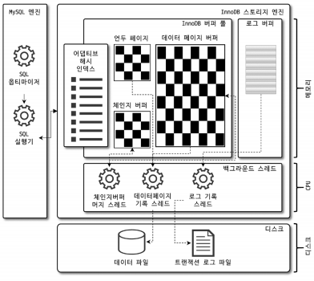

# InnoDB 스토리지 엔진 아키텍처

InnoDB는 MySQL에서 사용할 수 있는 스토리지 엔진 중 거의 유일하게 레코드 기반의 잠금을 제공하며, 그 때문에 높은 동시성 처리가 가능하고 안정적이며 성능이 뛰어나다.  

<div align="center">
    
</div>
<br/>

## 1. 프라이머리 키에 의한 클러스터링

InnoDB의 모든 테이블은 기본적으로 PK를 기준으로 클러스터링되어 저장된다. 즉, PK 값의 순서대로 디스크에 저장된다.  
 - 프라이머리 키가 클러스터링 인덱스로 PK를 이용한 레인지 스캔은 상당히 빨리 처리된다.
 - 쿼리 실행 계획에서 PK는 기본적으로 다른 보조 인덱스에 비해 비중이 높게 설정된다.
 - 오라클 DB의 IOT(Index Organized Table)와 동일한 구조가 InnoDB에서는 일반적인 테이블 구조가 된다.

<br/>

InnoDB 스토리지 엔진과는 달리 MyISAM 스토리지 엔진에서는 클러스터링 키를 지원하지 않는다. MyISAM 테이블의 PK 키를 포함한 모든 인덱스는 물리적인 레코드의 주소 값(ROWID)을 가진다.  

<br/>

## 2. 외래 키 지원

외래 키에 대한 지원은 InnoDB 스토리지 엔진 레벨에서 지원하는 기능으로 MyISAM이나 MEMORY 테이블에서는 사용할 수 없다.  
InnoDB에서는 외래 키는 부모 테이블과 자식 테이블 모두 해당 컬럼에 인덱스 생성이 필요하고, 변경 시에는 반드시 부모 테이블이나 자식 테이블에 데이터가 있는지 체크하는 작업이 필요하므로 잠금이 여러 테이블로 전파되고, 그로 인해 데드락이 발생할 수 있기 때문에 외래 키 존재에 주의해야 한다.  
 - 서비스 문제로 긴급하게 조치가 필요한 경우 foreign_key_checks 시스템 변수를 OFF로 설정하면 외래 키 관계에 대한 체크 작업을 일시적으로 멈출 수 있다.
```bash
SET foreign_key_checks=OFF;
SET foreign_key_checks=ON;
```
<br/>

## 3. MVCC(Multi Version Concurrency Control)

일반적으로 레코드 레벨의 트랜잭션을 지원하는 DBMS가 제공하는 기능으로, MVCC의 가장 큰 목적은 잠금을 사용하지 않는 일관된 읽기를 제공하는 데 있다.  
멀티 버전은 하나의 레코드에 대해 여러 개의 버전이 동시에 관리되는 것이다.  

<br/>

UPDATE 쿼리가 실행되면 InnoDB 버퍼 풀은 즉시 새로운 데이터로 변경되고 기존 데이터는 언두영역으로 복사된다. 이 상태에서 COMMIT 명령을 실행하면 InnoDB는 더 이상의 변경 작업 없이 지금의 상태를 영구적인 데이터로 만든다. 하지만 롤백을 실행하면 InnoDB는 언두 영역에 있는 백업된 데이터를 InnoDB 버퍼 풀로 다시 복구하고, 언두 영역의 내용을 삭제해버린다. 커밋이 된다고 언두 영역의 백업 데이터가 항상 바로 삭제되는 것은 아니고, 이 언두 영역을 필요로 하는 트랜잭션이 더 이상 없을 때 비로소 삭제가 된다.  

<br/>

## 4. 자동 데드락 감지

InnoDB 스토리지 엔진은 내부적으로 잠금이 교착 상태에 빠지지 않았는지 체크하기 위해 잠금 대기 목록을 그래프 형태로 관리한다.  
InnoDB 스토리지 엔진은 데드락 감지 스레드를 가지고 있어 데드락 감지 스레드가 주기적으로 잠금 대기 그래프를 검사해 교착 상태에 빠진 트랜잭션을 찾아 그중 하나를 강제 종료한다. 
 - innodb_table_locks 시스템 변수를 활성화하면 InnoDB 스토리지 엔진 내부의 레코드 잠금뿐만 아니라 테이블 레벨의 잠금까지 감지할 수 있다. 

<br/>

## 5.자동화된 장애 복구

InnoDB에는 손실이나 장애로부터 데이터를 보호하기 위한 여러 가지 메커니즘이 탑재돼 있다.  
이러한 메커니즘을 이용해 MySQL 서버가 시작될 때 완료되지 못한 트랜잭션이나 디스크에 일부만 기록된 데이터 패키지 등에 대한 일련의 복구 작업이 자동으로 진행된다.  

만약, MySQL 서버와 무관하게 디스크나 서버 하드웨어 이슈로 InnoDB 스토리지 엔진이 자동으로 복구 못하는 경우가 발생할 수 있는데, 한 번 문제가 생기면 복구하기가 쉽지 않다. MySQL 서버가 실행될 때 자동 복구될 수 없는 손상이 있다면 자동 복구를 멈추고 MySQL 서버는 종료돼 버린다. 이러한 경우 MySQL 서버의 설정 파일에 innodb_force_recovery 시스템 변수를 설정해서 MySQL 서버를 시작해야 한다.  
 - InnoDB의 로그 파일이 손상됐다면 6으로 설정하고 MySQL 서버를 기동한다.
 - InnoDB 테이블의 데이터 파일이 손상됐다면 1로 설정하고 MySQL 서버를 기동한다.
 - 어떤 부분이 문제인지 알 수 없다면 innodb_force_recovery 설정값을 1부터 6까지 변경하면서 MySQL을 재시작해 본다.
 - 1(SRV_FORCE_IGNORE_CORRUPT): InnoDB의 테이블스페이스의 데이터나 인덱스 페이지에서 손상된 부분이 발견돼도 무시하고 MySQL 서버를 시작한다.
 - 2(SRV_FORCE_NO_BACKGROUND): InnoDB는 쿼리의 처리를 위해 여러 종류의 백그라운드 스레드를 동시에 사용한다. 이 복구 모드에서는 이러한 백그라운드 스레드 가운데 메인 스레드를 시작하지 않고 MySQL 서버를 시작한다. (InnoDB의 메인 스레드가 언두 데이터를 삭제하는 과정에서 장애가 발생하면 이 모드로 복구한다.)
 - 3(SRV_FORCE_NO_TRX_UNDO): InnoDB에서 트랜잭션이 실행되면 롤백에 대비해 변경 전의 데이터를 언두 영역에 기록한다. 일반적으로 MySQL 서버는 다시 시작하면서 언두 영역의 데이터를 먼저 데이터 파일에 적용하고 그 다음 리두 로그의 내용을 다시 덮어써서 장애 시점의 데이터 상태를 만들어낸다. (커밋되지 않고 종료된 트랜잭션은 계속 그 상태로 남아 있게 MySQL 서버를 시작하는 모드다.)
 - 4(SRV_FORCE_NO_IBUF_MERGE): InnoDB는 INSERT, UPDATE, DELETE 등의 데이터 변경으로 인한 인덱스 변경 작업을 상황에 따라 즉시 처리할 수도 있고 인서트 버퍼에 저장해두고 나중에 처리할 수도 있다. 이렇게 인서트 버퍼에 기록된 내용은 언제 데이터 파일에 병합될 지 알 수 없다. 만약, MySQL이 재시작되면서 인서트 버퍼의 손상을 감지하면 InnoDB는 에러를 발생시키고 MySQL 서버를 시작하지 못한다. 4로 설정시 InnoDB 스토리지 엔진이 인서트 버퍼의 내용을 무시하고 강제로 MySQL을 시작한다. 인서트 버퍼는 실제 데이터와 관련된 부분이 아니라 인덱스 관련된 부분으로 테이블을 덤프한 후 다시 데이터베이스를 구축하면 데이터 손실 없이 복구할 수 있다.
 - 5(SRV_FORCE_NO_UNDO_LOG_SCAN): MySQL 서버가 장애나 정상적으로 종료되는 시점에 진행 중인 트랜잭션이 있었다면 MySQL은 단순히 그 커넥션을 강제로 끊어 버리고 별도의 정리 작업 없이 종료한다. MySQL이 다시 시작하면 InnoDB 엔진은 언두 레코드를 이용해 데이터 페이지를 복구하고 리두 로그를 적용해 종료 시점이나 장애 발생 시점의 상태를 재현ㄴ해 낸다. 그리고 InnoDB는 마지막으로 커밋되지 않은 트랜잭션에서 변경한 작업은 모두 롤백 처리한다. 그런데, InnoDB의 언두 로그를 사용할 수 없다면 InnoDB 엔진의 에러로 MySQL 서버를 시작할 수 없다.
 - 6(SRV_FORCE_NO_LOG_REDO): InnoDB 스토리지 엔진의 리두 로그가 손상되면 MySQL 서버가 시작되지 못한다. 이 복구 모드로 시작하면 InnoDB 엔진은 리두 로그를 모두 무시한 채로 MySQL 서버가 시작된다.

<br/>

## 6. InnoDB 버퍼 풀

InnoDB 버퍼 풀은 디스크이 데이터 파일이나 인덱스 정보를 메모리에 캐시해 두는 공간이다.  
쓰기 작업을 지연시켜 일괄 작업으로 처리할 수 있게 해주는 버퍼 역할도 같이 한다.  

<br/>

### 6-1. 버퍼 풀의 크기 설정

MySQL 5.7+ 부터는 InnoDB 버퍼 풀의 크기를 동적으로 조절할 수 있다. 그래서, InnoDB 버퍼 풀의 크기를 작은 값으로 설정하고 조금씩 증가시키는 방법이 최적이다.  
운영체제의 전체 메모리 공간이 8GB 미만이라면 50% 정도만 InnoDB 버퍼 풀로 설정하고 나머지 메모리 공간은 MySQL 서버와 운영체제, 그리고 다른 프로그램이 사용할 수 있는 공간으로 확보해주는 것이 좋다. 전체 메모리 공간이 그 이상이라면 InnoDB 버퍼 풀의 크기를 전체 메모리의 50%에서 시작해서 조금씩 올려가면서 최적점을 찾는다.  
 - InnoDB 버퍼 풀은 innodb_buffer_pool_size 시스템 변수로 크기를 설정할 수 있으며, 동적으로 버퍼 풀의 크기를 확장할 수 있다.
 - 버퍼 풀의 크기 변경은 크리티컬한 변경이므로 가능하면 MySQL 서버가 한가한 시점에서 진행한다.
 - 버퍼 풀의 크기 증가는 시스템 영향도가 작지만, 버퍼 풀의 크기 감소는 시스템 영향도가 크다.
 - innodb_buffer_pool_instances 시스템 변수를 이용해 버퍼 풀을 여러 개로 분리해서 관리할 수 있다. 기본적으로 버퍼 풀 인스턴스의 개수는 8개로 초기화되며, 메모리가 1GB 미만이라면 1개만 생성된다.
    - 버퍼 풀 메모리 공간이 40GB 이하라면 8을 유지하고, 메모리가 크다면 버퍼 풀 인스턴스당 5GB 정도 되는 인스턴스 개수를 설정하는 것이 좋다.

<br/>

### 6-2. 버퍼 풀의 구조

InnoDB 스토리지 엔진은 버퍼 풀이라는 거대한 메모리 공간을 페이지 크기의 조각으로 쪼개어 InnoDB 스토리지 엔진이 데이터를 필요로 할 때 해당 데이터 페이지를 읽어서 각 조각에 저장한다.  

처음 한 번 읽힌 데이터 페이지가 이후 자주 사용된다면 그 데이터 페이지는 InnoDB 버퍼 풀의 MRU 영역에서 계속 살아남게 되고, 반대로 거의 사용되지 않는다면 새롭게 디스크에서 읽히는 데이터 페이지들에 밀려서 LRU의 끝으로 밀려나 결국은 InnoDB 버퍼 풀에서 제거된다.  

<br/>

## 언두 로그

InnoDB 스토리지 엔진은 트랜잭션과 격리 수준을 보장하기 위해 DML로 변경되기 이전 버전의 데이터를 별도로 백업한다. 이렇게 백업된 데이터를 언두 로그라고 한다.  
 - 트랜잭션 보장: 트랜잭션이 롤백되면 도중 변경된 데이터를 변경 전 데이터로 복구해야 하는데, 이때 언두 로그에 백업해둔 이전 버전의 데이터를 이용해 복구한다.
 - 격리 수준 보장: 특정 커넥션에서 데이터를 변경하는 도중에 다른 커넥션에서 데이터를 조회하면 트랜잭션 격리 수준에 맞게 변경 중인 레코드를 읽지 않고 언두 로그에 백업해둔 데이터를 읽어서 반환하기도 한다.

```sql
# 언두 로그 레코드 건수 확인
SHOW ENGINE INNODB STATUS \G

# MySQL 8.0+ 에서 사용 가능한 명령
SELECT count
FROM information_schema.innodb_metrics
WHERE SUBSYSTEM='transaction' AND NAME='trx_rseg_history_len';
```
<br/>

### 언두 테이블스페이스 관리

MySQL 5.6 이전에서는 언두 로그가 모두 시스템 테이블스페이스에 저장됐다.  
MySQL 5.6  버전에서는 innodb_undo_tablespaces 시스템 변수가 도입됐고, innodb_undo_tablespaces 시스템 변수를 2보다 큰 값을 설정하면 InnoDB 스토리지 엔진은 더이상 언두 로그를 시스템 테이블스페이스에 저장하지 않고 별도의 언두 로그 파일을 사용한다.  
MySQL 8.0부터는 innodb_undo_tablespaces 시스템 변수 역할이 사라지고, 기본적으로 별도 로그 파일에 기록되도록 개선됐다.  

<br/>

## 리두 로그 및 로그 버퍼

리두 로그는 트랜잭션 4가지 요소인 ACID 중에서 D(Durable)에 해당하는 영속성과 가장 밀접하게 연관돼 있다.  
리두 로그는 하드웨어나 소프트웨어 등 여러 가지 문제점으로 인해 MySQL 서버가 비정상적으로 종료됐을 때 데이터 파일에 기록되지 못한 데이터를 잃지 않게 해주는 안전장치다.  
 - 데이터베이스 서버에서 리두 로그는 트랜잭션이 커밋되면 즉시 디스크로 기록되도록 시스템 변수를 설정하는 것을 권장한다.
 - 하지만, 트랜잭션이 커밋될 때마다 리두 로그를 디스크에 기록하는 작업은 많은 부하를 유발한다. 그래서, InnoDB 스토리지 엔진에서 리두 로그를 어느 주기로 디스크에 동기화할지를 결정하는 innodb_flush_log_at_trx_commit 시스템 변수를 제공한다.

