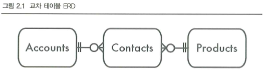

# 무단횡단

버그 추적 애플리케이션에서 제품의 담당자를 지정하는 기능을 개발한다.  
원래 설계에서는 각 제품당 한 명의 담당자를 등록할 수 있었다.  
그러나 주어진 제품에 대해 여러 명의 담당자를 등록할 수 있게 해달라는 요청을 받았다.  

담당자 계정 아이디를 쉼표로 분리된 목록으로 저장하도록 하였다.  
이러한 경우 아이디의 길이가 짧으면 담당자를 많이 등록할 수 있고, 아이디의 길이가 길면 담당자를 적게 등록할 수 있다.  

즉, 다대다 관계를 위한 교차테이블 생성을 피하기 위해 쉼표로 구분된 목록을 사용하는 것을 무단횡단 안티패턴(교차로를 피하는 행위)이라고 부른다.  

<br/>

## 1. 목표: 다중 값 속성 저장

 - 컬럼이 하나의 값을 가지는 경우
    - Products 테이블의 정수 컬럼을 사용해 제품과 담당자를 연관시킨다.
    - 각 계정은 많은 제품에 대응되고, 각 프로젝트는 담당자를 하나만 참조한다. (제품과 계정은 다대일 관계이다.)
```sql
CREATE TABLE Products (
  product_id        SERIAL PRIMARY KEY,
  product_name      VARCHAR(1000),
  account_id        BIGINT UNSIGNED,
  ...
  FOREIGN KEY (account_id) REFERENCES Accounts(account_id)
);

INSERT INTO Products (product_id, product_name, account_id)
VALUES (DEFAULT, 'Visual TurboBuilder', 12);
```
<br/>

프로젝트가 커지면서, 제품의 담당자가 여러 명일 수도 있다는 사실을 깨닫는다.  
제품과 계정의 관계에서 다대일 관계뿐 아니라 일대다 관계도 지원해야 한다.  
Products 테이블에서의 한 행이 하나 또는 그 이상의 담당자를 가질 수 있다.  

<br/>

## 2. 안티패턴: 쉼표로 구분된 목록에 저장

데이터베이스 구조 변경 최소화를 위해 account_id 컬럼을 VARCHAR로 변경하고, 여러 개의 계정 아이디를 쉼표로 구분해 나열하기로 한다.  

```sql
CREATE TABLE Products (
  product_id   SERIAL PRIMARY KEY,
  product_name VARCHAR(1000),
  account_id   VARCHAR(100), -- 쉼표로 구분된 목록
  ...
);

INSERT INTO Products (product_id, product_name, account_id)
VALUES (DEFAULT, 'Visual TurboBuilder', '12,34');
```
<br/>

 - __특정 계정에 대한 제품 조회__
    - 하나의 필드에 쉼표로 구분된 FK 값이 존재한다. 때문에 더 이상 같은지를 비교할 수 없고, 어떤 패턴에 맞는지를 검사해야 한다.
    - 패턴 매칭을 사용하면 잘못된 결과가 조회될 수 있고, __인덱스도 활용하지 못한다.__
```sql
SELECT * FROM Products WHERE account_id REGEXP '[[:<:]]12[[:>:]]';
```
<br/>

 - __주어진 제품에 대한 계정 정보 조회__
    - 쉼표로 구분된 목록을 참조하는 테이블의 대응되는 행과 __조인하기 불편하고 비용이 많이 든다.__
```sql
SELECT * 
FROM Products AS p 
    JOIN Accounts AS a 
        ON p.account_id REGEXP '[[:<:]]' || a.account_id || '[[:>:]]'
WHERE p.product_id = 123;
```
<br/>

 - __집계 쿼리__
    - 집계 쿼리는 COUNT(), SUM(), AVG() 같은 함수를 이용한다.
    - 이러한 함수는 행의 그룹에 대해 사용하도록 설계되었다.
    - 쉼표로 구분된 목록에 대해 사용하도록 설계된 것이 아니기 떄문에 추가 작업이 필요하며, 특정 집계 쿼리는 만들기 어렵다.
```sql
SELECT product_id, LENGTH(account_id) - LENGTH(REPLACE(account_id, ',', '')) + 1
    AS contacts_per_product
FROM Products;
```
<br/>

 - __특정 제품에 대한 계정 갱신__
    - 목록의 마지막에 문자열 연결을 통해 새로운 아이디를 추가할 수 있다. 다만, 목록이 정렬된 상태도 유지되지 않는다.
```sql
UPDATE Products
SET account_id = account_id || ',' || 56
WHERE product_id = 123;
```
<br/>

 - __목록에서 항목 삭제__
    - 목록에서 항목을 삭제하기 위해서는 두 개의 SQL 쿼리를 실행해야 한다.
    - 하나는 목록을 불러오고, 하나는 목록을 갱신한다.
```php
<?php

$stmt = $pdo->query(
  "SELECT account_id FROM Products WHERE product_id = 123");
$row = $stmt->fetch();
$contact_list = $row['account_id'];

// change list in PHP code
$value_to_remove = "34";
$contact_list = split(",", $contact_list);
$key_to_remove = array_search($value_to_remove, $contact_list);
unset($contact_list[$key_to_remove]);
$contact_list = join(",", $contact_list);

$stmt = $pdo->prepare(
  "UPDATE Products SET account_id = ?
   WHERE product_id = 123");
$stmt->execute(array($contact_list));
```
<br/>

 - __제품 아이디 유효성 검증__
    - 숫자가 아닌 특정 문자열을 입력하는 것에 대해서 방지하기 어렵다.
```sql
INSERT INTO Products (product_id, product_name, account_id)
VALUES (DEFAULT, 'Visual TurboBuilder', '12,34,banana');
```
<br/>

 - __구분자 문자 선택__
    - 구분자 문자가 문자열 목록에 포함되는 경우가 있을 수 있다.
    - 쉼표가 아닌 다른 문자로 구분자를 사용할 수 있지만, 그 문자도 항목에 포함되지 않는다는 보장이 없다.
 - __목록 길이 제한__
    - VARCHAR(30) 컬럼에는 얼마나 많은 목록 항목을 저장할 수 있을지 생각하면, 항목의 길이에 따라 갯수가 다르게 된다.
    - 각 항목의 길이가 2라면 쉼표를 포함하여 10개를 저장할 수 있다.
    - 각 항목의 길이가 6이라면 쉼표를 포함하여 4개를 저장할 수 있다.

<br/>

## 3. 안티패턴 인식 방법

 - 이 목록이 지원해야 하는 최대 항목 수는 얼마나 될까?
    - VARCHAR 컬럼의 최대 길이를 선정할 때
 - SQL에서 단어의 경계를 어떻게 알아내는지 알아?
    - 문자열의 일부를 찾아내기 위해 정규 표현식을 사용 시, 이런 부분을 별도로 저장해야 할 수도 있다.
 - 이 목록에서 절대 나오지 않을 문자가 어떤게 있을까?
    - 어떤 구분자를 쓰든 언젠가는 그 문자가 목록의 값에 나타날 것이라 예상해야 한다.

<br/>

## 4. 안티패턴 사용이 합당한 경우

어떤 종류의 쿼리는 데이터베이스에 반정규화를 적용해 성능을 향상시킬 수 있다. 목록을 쉼표로 구분된 문자열로 저장하는 것도 반정규화의 예이다.  
애플리케이션에서 쉼표로 구분된 형식의 데이터를 필요로 하고, 목록 안의 개별 항목에는 접근할 필요가 없을 수 있다. 또, 애플리케이션이 다른 출처에서 쉼표로 구분된 형식으로 데이터를 받아 데이터베이스에 그대로 저장하고 나중에 동일한 형식으로 불러내야 하며, 목록 안의 개별 값을 분리할 필요가 없다면 안티패턴을 사용할 수 있다.  
 - 반정규화를 사용하기로 결정할 때는 보수적이어야 한다.
 - 데이터베이스를 정규화하는 것이 먼저다. 정규화는 애플리케이션 코드를 좀더 융통성 있게 하고, 데이터베이스의 정합성을 유지할 수 있다.

<br/>

## 5. 해법: 교차 테이블 생성

account_id를 별도의 테이블에 저장한다.  
어떤 테이블이 FK로 두 테이블을 참조할 때 이를 교차 테이블이라 한다.  
교차 테이블은 참조되는 두 테이블 사이의 다대다 관계를 구현한다. 각 제품은 교차 테이블을 통해 여러 개의 계정과 연관되며, 각 계정도 여러 개의 제품과 연관된다.  

```sql
CREATE TABLE Contacts (
  product_id  BIGINT UNSIGNED NOT NULL,
  account_id  BIGINT UNSIGNED NOT NULL,
  PRIMARY KEY (product_id, account_id),
  FOREIGN KEY (product_id) REFERENCES Products(product_id),
  FOREIGN KEY (account_id) REFERENCES Accounts(account_id)
);

INSERT INTO Contacts (product_id, account_id)
VALUES (123, 12), (123, 34), (345, 23), (567, 12), (567, 34);
```
<div align="center">
    
</div>
<br/>

 - __계정으로 제품 조회하기와 제품으로 계정 조회하기__
    - 주어진 계정에 대한 모든 제품의 속성을 조회하기 위해 Products 테이블과 Contacts 테이블을 조인한다.
```sql
SELECT p.*
FROM Products AS p 
    JOIN Contacts AS c 
        ON p.product_id = c.product_id
WHERE c.account_id = 34;

SELECT a.*
FROM Accounts AS a 
    JOIN Contacts AS c 
        ON a.account_id = c.account_id
WHERE c.product_id = 123;
```
<br/>

 - __집계 쿼리 만들기__
```sql
-- 제품당 계정 수
SELECT product_id, COUNT(*) AS accounts_per_product
FROM Contacts
GROUP BY product_id;

-- 계정당 제품 수
SELECT account_id, COUNT(*) AS products_per_account
FROM Contacts
GROUP BY account_id;

-- 가장 많은 담당자를 할당 받은 제품
SELECT c.product_id, c.contacts_per_product
FROM (
  SELECT product_id, COUNT(*) AS accounts_per_product
  FROM Contacts
  GROUP BY product_id
) AS c
ORDER BY c.contacts_per_product DESC 
LIMIT 1
```
<br/>

 - __특정 제품에 대한 계정 갱신__
    - 목록에 항목을 추가하거나 삭제하는 것은 교차 테이블에 행을 삽입하거나 삭제하는 방법으로 할 수 있다.
```sql
INSERT INTO Contacts (product_id, account_id) VALUES (456, 34);

DELETE FROM Contacts WHERE product_id = 456 AND account_id = 34;
```
<br/>

 - __제품 아이디 유효성 검증__
    - 다른 테이블에 있는 합당한 값에 대해 유효한지 확인하기 위해 FK를 사용할 수 있다.
    - Contacts.account_id가 Accounts.account_id를 참조하도록 선언해, 참조 정합성을 데이터베이스가 강제하도록 할 수 있다.
        - 교차 테이블에 실제로 존재하는 계정 아이디가 들어있음을 확신할 수 있다.
    - 항목을 제한하는 데 SQL 데이터 타입을 사용할 수 있다.
 - __구분자 문자 선택__
    - 각 항목을 별도의 행으로 저장하여 구분자를 사용하지 않는다.
 - __목록 길이 제한__
    - 각 항목이 교차 테이블에 별도 행으로 존재하여 한 테이블에 물리적으로 젖아할 수 있는 행 수에만 제한을 받는다.
    - 항목 수를 제한하고 싶다면, 목록의 항목을 합한 길이를 보는 것보다는 애플리케이션에서 항목 수를 세어 정책을 강제해야 한다.
 - __교차 테이블의 다른 장점__
    - 인덱스를 활용하여 쉼표로 구분된 목록에서 부분 문자열 매칭보다 성능이 훨씬 좋다.
    - 교차 테이블에 컬럼을 추가해 각 항목에 추가 속성을 넣을 수 있다.
        - 주어진 제품에 담당자가 할당된 날짜 저장
        - 누가 주 담당자이고, 누가 부 담당자인지 표시하는 속성 추가

