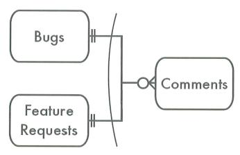

# 다형성 연관

하나의 버그에 여러 개의 댓글이 달릴 수 있지만, 하나의 댓글은 하나의 버그하고만 관계된다.  
Bugs와 Comments는 일대다 관계이다.  

```sql
CREATE TABLE Comment (
    comment_id      SERIAL PRIMARY KEY,
    bug_id          BIGINT NOT NULL,
    author_id       BIGINT NOT NULL,
    comment_date    DATETIME NOT NULL,
    comment         TEXT NOT NULL
    FOREIGN KEY (author_id) REFERENCES Accounts(account_id),
    FOREIGN KEY (bug_id) REFERENCES Bugs(bug_id)
);
```

댓글(Comments)이 버그(Bugs) 말고도 다른 테이블에도 달릴 수도 있다.  
Bugs와 Feature Request는 별도 테이블에 저장하기는 하지만 비슷한 엔티티이다.  
이러한 경우 버그나 기능요청 중 어느 이슈 타입과 관계되든 Comments를 하나의 테이블에 저장하고 싶을 수 있다.  
 - 하지만, 여러 개의 부모 테이블을 참조하는 FK는 만들 수 없다.
```sql
CREATE TABLE Comment (
    ...
    REFERENCES Bugs(issue_id) OR FeatureRequests(issue_id)
);
```

<br/>

## 1. 목표: 여러 부모 참조

Comments테이블은 Bugs테이블의 행이나 FeatureRequests테이블의 행 중 하나와만 대응한다.  
이러한 관계를 ERD로 표기하면 아래와 같다. (Exclusive 관계)  

<div align="center">
    
</div>
<br/>

## 2. 안티패턴: 이중 목적의 FK 사용

이것은 여러 테이블을 참조하기 때문에 난잡한 연관이라 불리기도 한다.  

<br/>

### 다형성 연관 정의

다형성 연관을 위해서 별도의 컬럼을 추가해야 한다.  
이 별도 컬럼에는 현재 행이 참조하는 부모 테이블 이름을 넣는다. 여기서는 issue_type이라는 컬럼명으로 사용한다.  
 - 이떄, FK 선언은 제외한다. FK는 하나의 테이블만 참조할 수 있다.
 - FK가 없으므로 부모테이블에 있는 값과 대응되도록 강제할 수 없고, 데이터 정합성도 보장할 수 없다.
```sql
CREATE TABLE Comment (
    comment_id      SERIAL PRIMARY KEY,
    issue_type      VARCHAR(20),     -- "Bugs" 또는 "FeatureRequests"
    issue_id        BIGINT NOT NULL, -- 공통으로 사용하기 위해 issue_id로 사용한다.
    author_id       BIGINT NOT NULL,
    comment_date    DATETIME NOT NULL,
    comment         TEXT NOT NULL
    FOREIGN KEY (author_id) REFERENCES Accounts(account_id)
);
```
<br/>

### 다형성 연관에서의 조회

Comments 테이블의 issue_id 컬럼 값은 Bugs와 FeatureRequests 부모 테이블의 PK 컬럼에 나타날 수 있다.  
떄문에, 자식 테이블을 부모 테이블과 조인할 때 issue_type을 정확하게 사용하는 것이 중요하다.  

```sql
-- Bugs와 연관 댓글 조회
SELECT *
FROM Bugs AS b
    JOIN Comments AS c
        ON b.issue_id = c.issue_id
        AND c.issue_type = 'Bugs'
WHERE b.issue_id = 1234;

-- Bugs와 FeatureRequests의 연관 댓글 조회
SELECT *
FROM Comments AS c 
    LEFT OUTER JOIN Bugs AS b 
        ON b.issue_id = c.issue_id
        AND c.issue_type = 'Bugs'
    LEFT OUTER JOIN FeatureRequests AS f 
        ON f.issue_id = c.issue_id
        AND c.issue_type = 'FeatureRequests'
WHERE b.issue_id = 1234;
```
<br/>

## 3. 안티패턴 인식 방법

 - 이 태깅 스키마는 데이터베이스 내의 어떤 리소스에도 태그를 달 수 있다.
    - EAV와 마찬가지로, 무제한적인 유연성을 주장하는 경우에는 의심해야 한다.
 - 우리 데이터베이스 설계에서는 FK를 선언할 수 없어
    - FK는 관계형 데이터베이스에서 가장 기본적이면서도 중요한 기능이다.
    - 적절한 참조 정합성을 강제할 수 없는 설계는 많은 문제를 유발한다.

Ruby on Rails 프레임워크에서는 액티브 레코드 클래스 :polymorphic 속성을 선언하면 다형성 연관을 사용할 수 있다.  
Java를 위한 Hibernate 프레임워크도 다양한 스키마 선언을 통해 다형성 연관을 지원한다.  

<br/>

## 4. 안티패턴 사용이 합당한 경우

다형성 연관 안티패턴은 사용을 피하고, FK와 같은 제약조건을 사용해 참조 정합성을 보장해야 한다. 다형성 연관은 메타데이터 대신 애플리케이션 코드에 지나치게 의존하게 만든다.  

ORM 프레임워크를 사용하는 경우 안티패턴 사용이 불가피한 경우가 있다. 이 경우 애플리케이션 로직을 캡슐화하여 참조 정합성 유지에 도움을 주도록 한다.  

<br/>

## 5. 해법: 관계 단순화

다형성 연관의 단점을 피하면서 필요한 데이터 모델을 지원하기 위해서는 데이터베이스를 다시 설계하는 것이 낫다.  
그 외에는 데이터 관계를 그대로 수용하면서 정합성을 강제하기 위해 메타데이터를 더 잘 활용하는 몇 가지 방법이 있다.  

<br/>

### 역 참조

자식 테이블 Comments에서는 여러 부모 테이블을 참조할 수 없다.  
때문에, Comments 테이블을 참조하는 여러 개의 FK를 사용하도록 한다.  
 - 각 부모에 대해 별도의 교차 테이블을 생성하고, 교차 테이블에는 각 부모 테이블에 대한 FK뿐 아니라 Comments에 대한 FK도 포함시킨다.
 - 이 방법을 사용하면 Comments 테이블의 issue_type이 필요없다.
    - 연관 관계를 오류 없이 관리하는 데 애플리케이션 코드에 의지하지 않아도 된다.
    - 메타데이터로 데이터 정합성을 강제할 수 있다.
```sql
CREATE TABLE BugsComment (
    issue_id    BIGINT NOT NULL,
    comment_id  BIGINT NOT NULL,
    PRIMARY KEY (issue_id, comment_id)
    FOREIGN KEY (issue_id) REFERENCES Bugs(issue_id),
    FOREIGN KEY (comment_id) REFERENCES Comments(comment_id),
);

CREATE TABLE FeaturesComment (
    issue_id    BIGINT NOT NULL,
    comment_id  BIGINT NOT NULL,
    PRIMARY KEY (issue_id, comment_id)
    FOREIGN KEY (issue_id) REFERENCES FeatureRequests(issue_id),
    FOREIGN KEY (Comment_id) REFERENCES Comments(Comment_id)
);
```
<br/>

#### 신호등 설치

역 참조의 잠재적 약점은 허용하고 싶지 않은 연관이 생길 수 있다는 것이다.  
교차 테이블은 보통 다대다 관계를 모델링하는 데 사용된다. 즉, 댓글이 여러 개의 버그나 기능요청과 연관될 수 있다.  

<div align="center">
    
</div>
<br/>

각 댓글은 하나의 버그 또는 하나의 기능요청과 관계되어야 한다.  
이러한 규칙을 부분적으로 강제할 수 있는데, 각 교차 테이블의 comment_id 컬럼에 UNIQUE 제약 조건을 선언하여 사용한다.  
 - 특정 댓글이 교차 테이블에 한 번만 참조됨을 보장한다.
 - 다만, 특정 댓글이 버그와 기능요청 양쪽에 동시에 연관되는 것은 방지할 수 없다. (애플리케이션 코드의 책임으로 남는다.)
```sql
CREATE TABLE BugsComment (
    ...
    UNIQUE KEY (comment_id)
);
```
<br/>

#### 조회 쿼리

```sql
-- 특정 버그에 대한 댓글 조회
SELECT *
FROM BugsComments AS b
    JOIN Comments AS c USING (comment_id)
WHERE b.issue_id = 1234;

-- 특정 댓글에 대응되는 버그와 기능요청 모두 조회
SELECT *
FROM Comments AS c
    LEFT JOIN (BugsComments JOIN Bugs AS b USING (issue_id)) USING (comment_id)
    LEFT JOIN (FeaturesComments JOIN FeatureRequests AS f USING (issue_id)) USING (comment_id)
WHERE c.comment_id = 9876;
```
<br/>

### 공통 수퍼테이블 생성

자식 테이블인 Comments에 베이스 테이블을 참조하는 FK를 추가한다.  
 - Bugs와 FeatureRequests의 issue_id 컬럼은 PK인 동시에 FK이다.
 - Bugs와 FeatureRequests에 있는 issue_id 컬럼은 각자 새로운 키 값을 생성하지 않고 Issues 테이블에서 생성한 대체키 값을 참조한다.
 - Issues 테이블에 속성을 정의하지 않은 경우 조회시에 이 테이블을 포함시킬 필요가 없다. Bugs와 Comments가 직접 조인할 수 있다.

<div align="center">
    
</div>
<br/>

#### 조회 쿼리

 - Issues와 같은 조상 테이블을 사용하면 FK를 통해 데이터베이스 정합성을 강제할 수 있다.
```sql
SELECT *
FROM Comments AS c
    LEFT JOIN Bugs AS b USING (issue_id)
    LEFT JOIN FeatureRequests AS f USING (issue_id)
WHERE c.comment_id = 9876;

SELECT *
FROM Bugs AS b
    JOIN Comments AS c USING (issue_id)
WHERE b.issue_id = 1234;
```

