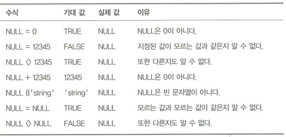
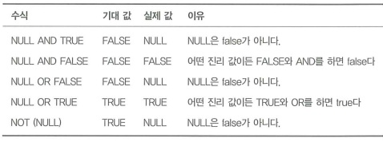

# 모르는 것에 대한 두려움

## 1. 목표: 누락된 값을 구분하기

데이터베이스의 어떤 컬럼에 값이 없는 것을 피할 수 없다.  
모든 컬럼에 대한 값을 알기 전에 행을 삽입해야 할 수도 있고, 또는 일부 컬럼은 어떤 상황에서는 의미 있는 값을 가지지 않을 수도 있다. SQL에서는 특수한 값인 NULL을 지원한다.  
 - 적용 가능한 값이 없는 경우에 NULL 값 사용
 - 함수 인수로 DAY('2024-12-32') 같이 유효하지 않은 값이 입력되는 경우 NULL 반환
 - 외부 조인에서 매치되지 않는 행의 컬럼 값의 자리를 채우는 데 NULL 값 사용

<br/>

## 2. 안티패턴: NULL을 일반 값처럼 사용

SQL에서는 NULL을 0이나 false 또는 빈 문자열과 다른 특별한 값으로 취급한다.  
 - Oracle과 Sybase에서는 NULL이 길이가 0인 문자열과 동일하다.

<br/>

### 수식에서 NULL 사용

 - 수식에서 값과 NULL을 연산하면 NULL이 반환된다. (1 + NULL = NULL)
 - 불리언 수식을 적용해도 NULL이 된다.

<br/>

### NULL을 가질 수 있는 컬럼 검색

```sql
-- 값이 123인 행 조회
SELECT *
FROM Bugs
WHERE assigned_to = 123;

-- 값이 123이 아닌 행 조회: assigned_to 컬럼값이 NULL인 값도 제외된다.
SELECT *
FROM Bugs
WHERE NOT(assigned_to = 123);

-- NULL 조회 ❌: WHERE 절 조건은 수식이 true 일 때만 만족되지만, NULL 과의 비교는 절대 true가 될 수 없다.
SELECT *
FROM Bugs
WHERE assigned_to = NULL;

SELECT *
FROM Bugs
WHERE assigned_to <> NULL;
```
<br/>

### 쿼리 파라미터로 NULL 사용

 - 일반 정수를 넣어주면 예측 가능한 결과를 리턴하지만, null을 파라미터로 사용할 수 없다.
```sql
SELECT *
FROM Bugs
WHERE assigned_to = ?;
```
<br/>

### 문제 회피하기

NULL을 조작하는 것이 쿼리를 복잡하게 만드는 경우, 개발자가 데이터베이스에서 NULL을 허용하지 않도록 하고 '알수없음'같은 문자나 -1 같은 음수를 사용한다.  

 - 숫자 타입의 미정을 위해 -1을 사용했다고 가정한다.
 - 하지만, -1은 SUM()이나 AVG() 같은 계산할 떄 포함된다.
```sql
CREATE TABLE Bugs (
    bug_id          SERIAL PRIMARY KEY,
    ...
    assigned_to     BIGINT UNSIGNED NOT NULL,
    hours           NUMERIC(9,2) NOT NULL,
    FOREIGN KEY (assigned_to) REFERENCES Accounts(account_id)
);

INSERT INTO Bugs(assigned_to, hours) VALUES (-1, -1);
```
<br/>

## 3. 안티패턴 사용이 합당한 경우

NULL을 사용하는 것은 안티패턴이 아니다.  
NULL을 일반적인 값처럼 사용하거나 일반적인 값을 NULL처럼 사용하는 것이 안티패턴이다.  

<br/>

## 4. 해법: 유일한 값으로 NULL을 사용하라

### 스칼라 수식에서의 NULL

<div align="center">
    
</div>
<br/>

### 불리언 수식에서의 NULL

 - NULL 값은 true, false가 아니다.
 - NULL 값에 NOT을 적용했을 때 true를 예상하지만, 여전히 NULL 이다.

<div align="center">
    
</div>
<br/>

### NULL 검색하기

NULL을 검색하기 위해서는 다른 연산이 필요하다.  
SQL 표준에는 IS NULL 연산자가 정으되어 있는데, 피연산자가 NULL이면 true를 리턴한다. 반대로 IS NOT NULL은 피연산자가 NULL이면 false를 리턴한다.  

```sql
-- NULL 이면 true
SELECT * FROM Bugs WHERE assigned_to IS NULL;

-- NULL이 아니면 true
SELECT * FROM Bugs WHERE assigned_to IS NOT NULL;
```
<br/>

SQL-99 표준에서는 IS DISTINCT FROM 이란 비교연산자가 정의었는데, <> 과 비슷하게 동작한다.  
다른점은 피연산자가 NULL이더라도 항상 ture 또는 false를 리턴한다는 것이다.  
 - PostgreSQL, IBM DB2, Firebird는 이를 지원하지만, Oracle와 Microsoft SQL Server는 지원하지 않는다.
 - MySQL은 IS DISTINCT FROM 처럼 동작하는 전용 연산자로 '<=>'를 지원한다.
```sql
SELECT * FROM Bugs WHERE assigned_to  IS NULL OR assigned_to <> 1;
SELECT * FROM Bugs WHERE assigned_to IS DISTINCT FROM 1;
```
<br/>

### 컬럼을 NOT NULL로 선언하기

NULL 값이 애플리케이션 정책을 위반하거나 또는 으미가 없는 경우에는 컬럼에 NOT NULL 제약조건을 선언하는 것이 권장사항이다.  
 - 컬럼마다 NULL 값이 합당한지, 불합당한지 정해야 한다.
    - reported_by, status 컬럼에는 NULL이 아닌 값을 가지도록 하는 것이 타당하다.

<br/>

### 동적 디폴트

어떤 쿼리에서는 쿼리 로직을 단순화하기 위해 컬럼이나 수식이 NULL이 되지 않도록 강제할 필요가 있겠지만, 그 값이 저장되길 원하지 않을 수 있다.  
 - NVL(), ISNULL(), COALESCE()
```sql
SELECT first_name || COALESCE(' ' || middle_initial || ' ', '') || last_name AS full_name
FROM Accounts;
```

