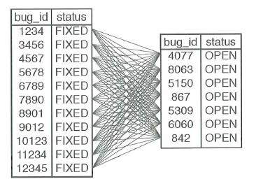
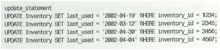

# 스파게티 쿼리

## 1. 안티패턴: 복잡한 문제를 한 번에 풀기

SQL은 표현력이 뛰어난 언어다. 하나의 쿼리나 문장으로 많은 것을 할 수 있다.  
그러나 모든 작업을 한 줄의 코드로 해치워야 한다는 접근방법이 좋은 생각은 아니다.  

<br/>

### 의도하지 않은 제품

모든 결과를 하나의 쿼리로 만들려고 시도할 때 카타시안 곱이 발생할 수 있다.  
 - 두 테이블을 조인하면, 첫 번째 테이블의 모든 행과 다른 테이블의 모든 행이 짝이 되고, 이런 각각의 짝이 결과 집합의 행이 된다.
 - 기대했던 것보다 훨씬 많은 행이 나오게 된다.
```sql
SELECT p.product_id,
    COUNT(f.bug_id) AS count_fixed,
    COUNT(o.bug_id) AS count_open
FROM BugsProducts p
    LEFT OUTER JOIN (BugsProducts bpf JOIN Bugs f USING (bug_id)) f 
        ON (p.bug_id = f.bug_id AND f.status = 'FIXED')
    LEFT OUTER JOIN (BugsProducts bpo JOIN Bugs o USING (bug_id)) o 
        ON (p.bug_id = o.bug_id AND o.status = 'OPEN')
WHERE p.product_id = 1
GROUP BY p.product_id;
```

<div align="center">
    
</div>
<br/>

### 그래도 충분하지 않다면

이러한 쿼리는 잘못된 결과를 얻을 수 있고, 작성하기 어렵고, 수정하기도 어렵고, 디버깅하기도 어렵다.  
SQL 쿼리를 복잡하게 작성하면, 이를 개선하는 데 더 많은 비용과 시간이 필요하게 된다.  
 - 많은 조인과, 상호 연관된 서브 쿼리, 그리고 다른 연산을 사용해야 하는 복잡한 SQL 쿼리는 SQL 엔진이 빠르게 최적화하여 실행하기도 어렵다.
 - __하나의 괴물 같은 쿼리보다 여러 개의 단순한 쿼리를 사용하는 편이 훨씬 경제적이다.__

<br/>

## 2. 안티패턴 사용이 합당한 경우

모든 결과를 정렬된 순서로 묶어서 봐야한 경우 DB에서 처리하는 것이 효율적일 수 있다.  

<br/>

## 3. 해법: 분할해서 정복하기

### 한 번에 하나씩

```sql
SELECT p.product_id, COUNT(f.bug_id) AS count_fixed
FROM BugsProducts p
LEFT OUTER JOIN Bugs f ON (p.bug_id = f.bug_id AND f.status = 'FIXED')
WHERE p.product_id = 1
GROUP BY p.product_id; 

SELECT p.product_id, COUNT(o.bug_id) AS count_open
FROM BugsProducts p
LEFT OUTER JOIN Bugs o ON (p.bug_id = o.bug_id AND o.status = 'OPEN')
WHERE p.product_id = 1
GROUP BY p.product_id;
```
<br/>

### UNION 연산

UNION 연산을 사용하면 여러 쿼리의 결과를 하나의 결과 집합으로 묶을 수 있다.  

```sql
(SELECT p.product_id, f.status, COUNT(f.bug_id) AS bug_count
 FROM BugsProducts p
 LEFT OUTER JOIN Bugs f ON (p.bug_id = f.bug_id AND f.status = 'FIXED')
 WHERE p.product_id = 1
 GROUP BY p.product_id, f.status)

 UNION ALL

(SELECT p.product_id, o.status, COUNT(o.bug_id) AS bug_count
 FROM BugsProducts p
 LEFT OUTER JOIN Bugs o ON (p.bug_id = o.bug_id AND o.status = 'OPEN')
 WHERE p.product_id = 1
 GROUP BY p.product_id, o.status)

ORDER BY bug_count;
```
<br/>

### SQL을 이용한 SQL 자동 생성

```sql
SELECT CONCAT('UPDATE Inventory '
  ' SET last_used = ''', MAX(u.usage_date), '''',
  ' WHERE inventory_id = ', u.inventory_id, ';') AS update_statement
FROM ComputerUsage u
GROUP BY u.inventory_id;
```

<div align="center">
    
</div>

