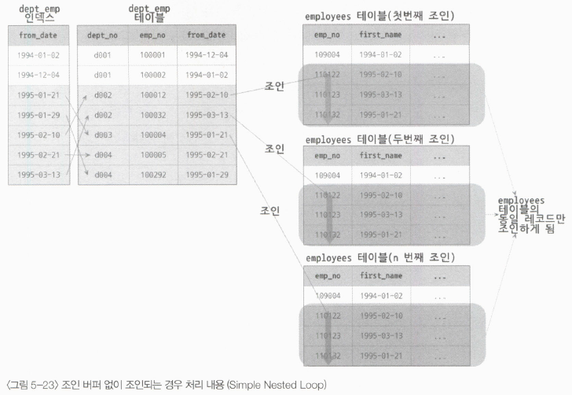
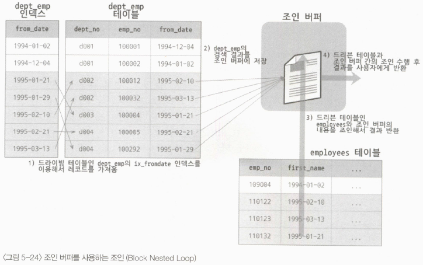
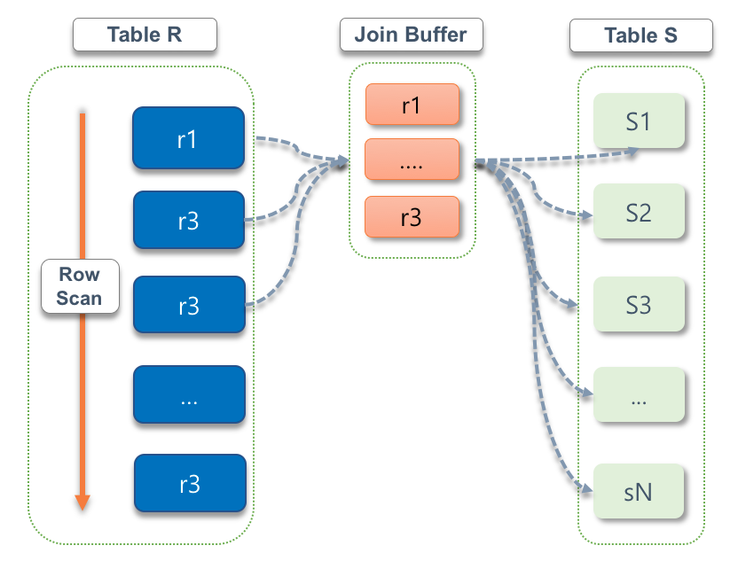
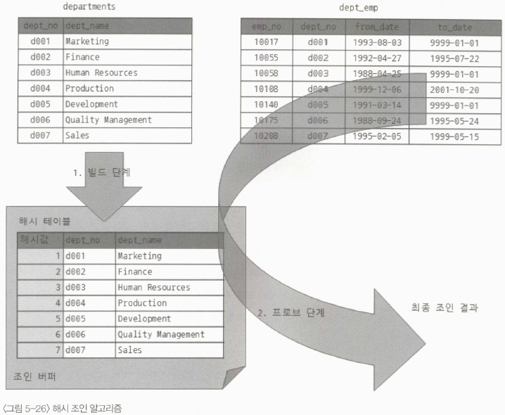

# SQL 튜닝 용어를 직관적으로 이해하기

## 물리 엔진과 오브젝트 용어

SQL 튜닝에 필요한용어들을 거시적 관점에서 소개하고, DBMS를 구성하는 엔진들과 내부 프로세스, 데이터를 저장하는 오브젝트를 가리키는 용어를 소개한다.  

<br/>

#### `DB 엔진 용어`

 - SQL 요청 흐름
    - 사용자는 DB에서 원하는 데이터를 가져오고자 SQL 문을 실행한다.
    - 실행된 SQL 문은 MySQL 엔진에서 문법 에러가 있는지, DB에 존재하는 테이블 대상으로 SQL 문을 작성했는지와 같은 세부 사항을 다양한 문법 및 구문으로 검사한다.
    - 이후 사용자가 요청한 데이터를 빠르고 효율적으로 찾아가는 전략적 계획을 수립한다. (옵티마이저)
    - 이 계획을 토대로 스토리지 엔진에 위치한 데이터까지 찾아간 뒤 해당 데이터를 MySQL 엔진으로 전달한다.
    - MySQL 엔진은 전달된 데이터에서 불필요한 부분을 필터링하고 필요한 연산을 수행한 뒤 사용자에게 최종 결과를 알려준다.
 - 스토리지 엔진
    - 스토리지 엔진은 사용자가 요청한 SQL 문을 토대로 DB에 저장된 디스크나 메모리에서 필요한 데이터를 가져오는 역할을 수행한다. 이후 해당 데이터를 MySQL 엔진으로 보내준다. 스토리지 엔진이 데이터를 저장하는 방식에 따라 각각의 스토리지 엔진을 선택하여 사용할 수 있으며, 필요하다면 외부에서 스토리지 엔진 설치 파일을 가져와 활성화하여 즉시 사용할 수 있다.
    - 일반적으로 트랜잭션 발생으로 데이터를 처리하는 OLTP 환경이 대다수인 만큼 주로 InnoDB 엔진을 사용한다. 그 밖에도 대량의 쓰기트랜잭션이 발생하면 MyISAM 엔진을, 메모리 데이터를 로드하여 빠르게 읽는 효과를 내려면 Memory 엔진을 사용하는 식으로 응용하여 스토리지 엔진을 선택할 수 있다.
    - MySQL 스토리지 엔진 확인: SELECT ENGINE, TRANSACTIONS, COMMENT FROM information_Schema.engines;
 - MySQL 엔진
    - MySQL 엔진은 사용자가 요청한 SQL 문을 넘겨받은 뒤 SQL 문법 검사와 적절한 오브젝트 활용 검사를 하고, SQL 문을 최소 단위로 분리하여 원하는 데이터를 빠르게 찾는 경로를 모색하는 역할을 수행한다. 이후 스토리지 엔진으로부터 전달받은 데이터 대상으로 불필요한 데이터는 제거하거나 가공 및 연산하는 역할을 한다.
    - 즉, SQL 문의 시작 및 마무리 단계에 MySQL 엔진이 관여하며, 스토리지 엔진으로부터 필요한 데이터만을 가져오는 핵심 역할을 담당한다.

<br/>

#### `SQL 프로세스 용어`

사용자가 SQL 문을 수행하면, 파서는 MySQL이 이해할 수 있는 최소 단위로 구성 요소를 분리하고 해당 구성 요소를 트리로 만든다. 트리를 만드는 과정에서는 문법 오류가 있는지 검토한다. 트리의 최소 단위는 '>', '<', '=' 등의 기호나 SQL 키워드로 분리한다. 만약 트리에 허용되지 않는 문법이 포함된다면 에러 발생과 동시에 실행이 종료된다.  

이후 전처리기는 생성된 트리 결과를 토대로, 이미 만들어진 테이블이나 뷰 등으로 구성되지는 않는지, 존재하지 않은 열을 포함하지는 않는지, 조회 권한이 없는 테이블을 조회하는지 등 유효성을 검증한다. 만약 유효하지 않은 오브젝트가 있거나 권한이 없는 오브젝트를 호출하면 바로 에러를 발생하여 사용자에게 표시한다.  

이후 옵티마이저는 트리를 구성하는 오브젝트의 데이터를 효율적으로 가져오기 위해 시간은 적게 소요되면서도 비용 효율적인 경로로 데이터를 검색하는 방법에 관한 실행 계획을 수립한다. 엔진 실행기는 이전에 수립된 실행 계획으로 스토리지 엔진을 호출해 필요한 데이터를 가져온다. 이후 엔진 실행기는 스토리지 엔진을 통해서 가져온 데이터 중 불필요한 데이터를 필터링하여 사용자가 원하는 결과를 전달한다.  

 - 파서
    - MySQL 엔진에 포함되는 오브젝트로, 사용자가 요청한 SQL 문을 쪼개 최소 단위로 분리하고 트리를 만든다.
    - 트리를 만들면서 문법 검사를 수행한다.
 - 전처리기
    - MySQL 엔진에 해당하는 오브젝트로, 파서에서 생성한 트리를 토대로 SQL 문에 구조적인 문제가 없는 파악한다.
    - SQL 문에 작성된 테이블, 열, 함수, 뷰와 같은 오브젝트가 실질적으로 이미 생성된 오브젝트인지, 접근 권한은 부여되어 있는지 확인하는 역할을 한다.
 - 옵티마이저
    - MySQL의 핵심 엔진 중 하나로, 전달된 파서 트리를 토대로 필요하지 않은 조건은 제거하거나 연산 과정을 단순화한다. 나아가 어떤 순서로 테이블에 접근할지, 인덱스를 사용할지, 사용한다면 어떤 인덱스를 사용할지, 정렬할 때 인덱스를 사용할지 아니면 임시 테이블을 사용할지와 같은 실행 계획을 수립한다.
    - 실행 계획으로 도출할 수 있는 경우의 수가 지나치게 많을 때는 실행 계획을 수립하고 비용을 산정하여 최적의 실행 계획을 선택하기까지 시간이 오래 걸리는 만큼 모든 실행 계획을 판단하지는 않는다. 즉, 옵티마이저가 선택한 최적의 실행 계획이 최상의 실행 계획이 아닐 수 있다.
 - 엔진 실행기
    - MySQL 엔진과 스토리지 엔진 영역 모두에 걸치는 오브젝트로, 옵티마이저에서 수립한 실행 계획을 참고하여 스토리지 엔진에서 데이터를 가져온다. 이후 MySQL 엔진에서는 읽어온 데이터를 정렬하거나 조인하고, 불필요한 데이터는 필터링 처리하는 추가 작업을 한다.
    - MySQL 엔진의 부하를 줄이려면 스토리지 엔진에서 가져오는 데이터양을 줄이는 게 매우 중요하다.

<br/>

#### `DB 오브젝트 용어`

데이터베이스를 구성하는 요소 중 하나로 오브젝트라 불리는 객체가 존재한다.  
관계형 데이터베이스에서 표는 테이블, 열은 컬럼, 행은 로우라는 용어로 사용한다.  

 - 테이블
    - 테이블은 데이터를 저장하는 오브젝트로 행과 열의 정보를 담는다.
    - 테이블에서는 저장 방식과 저장 구조에 따라 스토리지 엔진 속성을 정의할 수 있다.
    - InnoDB 스토리지 엔진은 보통 OLTP 환경에서 주로 사용하는 기본 DB 엔진이며 그 외에도 MyISAM, Memory, Blackhole 엔진 등이 존재한다.
 - 로우(행)
    - 로우는 행에 해당하는 용어로, 테이블에서 동일한 구조의 데이터 항목들의 집합을 가리킨다.
    - 행 수가 많아지면 데이터에 접근하는 과정에서 시간이 오래 소요될 수 있다. 이때, 파티셔닝 기법으로 SQL 문의 성능 향상을 검토해볼 수 있다.
 - 컬럼(열)
    - 컬럼은 열에 해당하는 용어로, 사전에 정의한 데이터 유형으로 데이터값을 저장하며 열별로 다른 데이터 유형을 가질 수 있다.
 - 기본 키(PK)
    - 기본 키는 특정 행을 대표하는 열을 가리키는 용어로 주 키라고도 부른다.
    - 2개 이상의 열을 조합해 기본 키를 구성할 수도 있다.
    - MySQL에서는 기본 키는 클러스터형 인덱스로 작동한다. 이는 기본 키의 구성 열 순서를 기준으로 물리적인 스토리지에 데이터가 쌓인다는 뜻이다. 즉, 비슷한 기본 키 값들이 근거리에 적재되어 기본 키를 활용하여 인덱스 스캔을 수행하면 테이블 데이터에 더 빠르게 접근할 수 있다.
 - 외래 키(FK)
    - 외래 키는 외부에 있는 테이블을 항상 참조하면서, 외부 테이블의 데이터가 변경되면 함께 영향을 받는 관계를 설정하는 키다.
 - 인덱스
    - 인덱스는 데이터베이스에서 키값으로 실제 데이터 위치를 식별하고 데이터 접근 속도를 높이고자 생성되는, 키 기준으로 정렬된 오브젝트이다.
    - 고유 인덱스: 인덱스를 구성하는 열들의 데이터가 유일한 인덱스이다. 차례로 정렬되는 인덱스 열의 데이터는 서로 중복되지 않고 유일성을 유지한다.
    - 비고유 인덱스: 고유 인덱스에서 데이터의 유일한 속성만 제외한 키이다. 데이터가 신규 입력되어 인덱스가 재정렬되더라도 인덱스 열의 중복 체크를 거치지 않고 단순한 정렬 작업을 수행한다.
 - 뷰
    - 뷰는 일명 가상 테이블로 이해할 수 있다.
    - 뷰를 사용하여 일부 데이터에 대해서만 데이터를 공개하고, 노출에 민감한 데이터에 대해서는 제약을 설정할 수 있는 보안성이 제공된다.
    - 또한, 여러 개의 테이블을 병합해서 활용할 때는 성능을 고려한 최적화된 뷰를 생성함으로써 일관된 성능을 제공할 수도 있다.
```SQL
-- 외래 키(FK) DDL 예시
CREATE TABLE 전공 (
    전공코드 CHAR(2) NOT NULL,
    전공명 VARCHAR(10) NOT NULL,
    PRIMARY KEY (전공코드)
);
CREATE TABLE 학생 (
    학번 INT(10) NOT NULL,
    이름 VARCHAR(10) NOT NULL,
    생년월일 CHAR(8),
    연락처 VARCHAR(15),
    전공코드 CHAR(2),
    PRIMARY KEY (학번),
    CONSTRAINT 학생_FK1 FOREIGN KEY (전공코드) REFERENCES 전공(전공코드)
);

-- 고유 인덱스 예시
ALTER TABLE 학생
ADD UNIQUE INDEX 연락처_인덱스(연락처);

-- 비고유 인덱스 예시
ALTER TABLE 학생
ADD INDEX 이름_인덱스 (이름);

-- 뷰 예시
CREATE VIEW 학생_뷰 AS
SELECT 학번, 이름
FROM 학생;
```

<br/>

## 논리적인 SQL 개념 용어

SQL 문 작성에 필요한 주변 오브젝트와 SQL 문의 상호관계, 연관성과 알고리즘에 관한 논리적 개념 용어를 다룬다.  

<br/>

#### `서브쿼리 위치에 따른 SQL 용어`

서브쿼리란 쿼리 안의 보조쿼리를 가리키는 용어이다.  
가장 바깥쪽의 SELECT 문인 메인쿼리를 기준으로 내부에 SELECT 문을 추가로 작성해서 서브쿼리를 만들 수 있다.  
이처럼 SELECT 문 안쪽에 위치한 SELECT 문은 어느 위치에 작성되었는지에 다라 부르는 용어가 달라지게 된다.  

 - 스칼라 서브쿼리
    - 메인쿼리의 SELECT 절에 있는 또 다른 SELECT 절을 스칼라 서브쿼리라고 한다.
    - 스칼라 서브쿼리의 결괏값이 2개 이상 나온다면 에러가 발생한다.
 - 인라인 뷰
    - 메인쿼리의 FROM 절에 있는 또 다른 SELECT 절을 인라인 뷰라고 한다.
    - FROM 절 내부에서 일시적으로 뷰를 생성하는 방식으로 인라인 뷰로 불린다.
    - 인라인 뷰의 결과는 내부적으로 메모리 또는 디스크에 임시 테이블을 생성하여 활용한다.
 - 중첩 서브쿼리
    - 메인쿼리의 WHERE 절에 있는 또 다른 SELECT 절을 중첩 서브쿼리라고 한다.
    - WHERE 절에서 단숞나 값을 비교 연산하는 대신, 서브쿼리를 추가하여 비교 연산하기 위해 중첩 서브쿼리를 사용한다.
    - 중첩 서브쿼리와 비교할 때 비교 연산자와 IN, EXISTS, NOT IN, NOT EXISTS 문을 많이 사용한다.
```SQL
-- 서브쿼리 용어
SELECT (SELECT .. FROM ..) -- SELECT 절: 스칼라 서브쿼리
FROM (SELECT .. FROM ..) -- FROM 절: 인라인 뷰
WHERE 컬럼명 IN (SELECT .. FROM ..) -- WHERE 절: 중첩 서브쿼리

-- 스칼라 서브쿼리 예시
SELECT 
    이름,
    (
        SELECT COUNT(*)
        FROM 학생 AS 학생2
        WHERE 학생2.이름 = 학생1.이름
    ) AS 카운트
FROM 학생 AS 학생1;

-- 인라인 뷰 예시
SELECT 학생2.학번, 학생2.이름
FROM (
        SELECT *
        FROM 학생
        WHERE 성별 = '남'
    ) 학생2;

-- 중첩 서브쿼리 예시
SELECT *
FROM 학생
WHERE 학번 = (
        SELECT MAX(학번)
        FROM 학생
    )
```

<br/>

#### `메인쿼리와의 관계성에 따른 SQL 용어`

 - 비상관 서브쿼리
    - 메인쿼리와 서브쿼리 간에 관계성이 없음을 의미한다.
    - 서브쿼리가 독자적으로 실행된 뒤 메인쿼리에게 그 결과를 던져주는 형태이다.
    - 즉, 비상관 서브쿼리는 서브쿼리가 먼저 실행된 뒤에 그 결과를 메인쿼리가 활용한다. (서브쿼리 실행 -> 메인쿼리 실행)
 - 상관 서브쿼리
    - 상관 서브쿼리는 메인쿼리와 서브쿼리 간에 관계성이 있음을 의미한다.
    - 서브쿼리가 수행되려면 메인쿼리의 값을 받아야 하므로 서브쿼리와 메인쿼리는 서로 끈끈한 관계를 유지한다.
```SQL
-- 비상관 서브쿼리 예시
SELECT *
FROM 학생
WHERE 학번 IN (
        SELECT 학번
        FROM 학생
        WHERE 성별 = '남'
    );

-- 상관 서브쿼리 예시
SELECT *
FROM 학생
WHERE 학번 IN (
        SELECT 학번
        FROM 학생
        WHERE 성별 = '남'
    );
```

<br/>

#### `반환 결과에 따른 SQL 용어`

서브쿼리의 결과 유형은 수치적 기준으로 구분할 수 있다.  
1건의 행 데이터만 반환하는 경우와 2개 이상의 행 데이터를 반환하는 경우, 그리고 2개 이상의 행과 열 데이터를 반환하는 경우로 나눌 수 있다.  

 - 단일행 서브쿼리
    - 단일행 서브쿼리는 서브쿼리 결과가 1건의 행으로 반환되는 쿼리이다.
    - 조건절에서 '=', '<', '>' 등의 연산자와 비교한다.
 - 다중행 서브쿼리
    - 다중행 서브쿼리는 서브쿼리 결과가 여러 건의 행으로 반환되는 쿼리이다.
    - 조건절에서 IN 구문으로 비교한다.
 - 다중열 서브쿼리
    - 다중열 서브쿼리는 서브쿼리 결과가 여러 개의 열과 행으로 반환된다.
    - 조건절에서 IN 구문과 함께 서브쿼리에서 반환될 열들을 동일하게 나열해 비교한다.

<br/>

#### `조인 연산방식 용어`

관계형 데이터베이스에는 다수의 테이블이 있고 필요한 데이터도 여기저기 흩어져 있다.  
이때 필요한 데이터끼리 결합할 때 조인이라는 방식을 사용한다.  
분리된 데이터 간의 공통된 정보, 즉 동일한 열값 또는 키값 기준으로 데이터를 논리적으로 연결할 수 있다.  
조인 방식에는 내부조인, 왼쪽외부조인, 오른쪽외부조인, 전체외부조인, 교차조인, 자연조인 등이 있다.  
 - 내부 조인
    - 교집합에 해당하는 방식으로, 양쪽에 모두 존재하는 데이터만 반환한다.
    - 'JOIN' 혹은 'INNER JOIN' 키워드를 이용하여 조인 대상 테이블을 작성하고 'ON' 절에 조인할 비교조건을 작성한다.
 - 왼쪽 외부 조인
    - 왼쪽 테이블 기준으로 오른쪽 테이블과 조인을 수행하지만, 조인 조건에 일치하지 않더라도 왼쪽 테이블의 결과는 최종 결과에 포함된다.
    - 'LEFT OUTER JOIN' 또는 'LEFT JOIN' 키워드를 사용한다.
 - 오른쪽 외부 조인
    - 오른쪽 테이블 기준으로 왼쪽 테이블과 조인을 수행하지만, 조인 조건에 일치하지 않더라도 오른쪽 테이블의 결과는 최종 결과에 포함된다.
    - 'RIGHT OUTER JOIN' 또는 'RIGHT JOIN' 키워드를 사용한다.
 - 전체 외부 조인
    - 전체 외부 조인은 왼쪽 외부 조인과 오른쪽 외부 조인이 통합된 조인방식이다.
    - MySQL과 MariaDB에서는 지원하지 않는다.
 - 교차 조인
    - 교차 조인은 수학적 관점에서 봤을 때 데카르트 곱이라고 하는 곱집합 개념으로, 조인에 참여하는 테이블에서 발생할 수 있는 모든 조합을 찾아내어 반환한다.
    - 조인 연산과정의 시간적, 공간적 리소스 점유 측면에서 오버헤드가 발생할 수 있어 주의가 필요하다.
    - 'CROSS JOIN' 키워드를 사용한다.
 - 자연 조인
    - 자연 조인은 2개 테이블에 동일한 열명이 있을 때 조인 조건절을 따로 작성하지 않아도 자동으로 조인을 수행해주는 방식이다.
    - 조인이 제대로 성사되면 내부 조인과 동일한 결과가 출력된다. 이때, 조인하는 열들의 데이터 유형이 서로 달라도 자연 조인이 수행된다.
    - 만약, 동일한 열명이 없다면 발생 가능한 경우의 수를 모두 조합하는 교차 조인이 수행된다.
    - 즉, 동일한 열명이 있으면 내부 조인이 수행되고, 그렇지 않으면 교차 조인이 수행된다.
    - 'NATURAL JOIN' 키워드를 사용한다.
```SQL
-- 내부 조인 예시
SELECT 학생.학번, 학생.이름, 지도교수.교수명
FROM 학생
    JOIN 지도교수 ON 학생.학번 = 지도교수.학번

SELECT 학생.학번, 학생.이름, 지도교수.교수명
FROM 학생, 지도교수
WHERE 학생.학번 = 지도교수.학번

-- 왼쪽 외부 조인 예시
SELECT 학생.학번, 학생.이름, 지도교수.교수명
FROM 학생
    LEFT JOIN 지도교수 ON 학생.학번 = 지도교수.학번

-- 오른쪽 외부 조인 예시
SELECT 학생.학번, 학생.이름, 지도교수.교수명
FROM 학생
    RIGHT JOIN 지도교수 ON 학생.학번 = 지도교수.학번

-- 교차 조인 예시
SELECT 학생.학번, 학생.이름, 지도교수.학번, 지도교수.교수명
FROM 학생
    CROSS JOIN 지도교수

SELECT 학생.학번, 학생.이름, 지도교수.학번, 지도교수.교수명
FROM 학생, 지도교수

-- 자연 조인 예시
SELECT 학생.*, 지도교수.*
FROM 학생
    NATURAL JOIN 지도교수
```

<br/>

#### `조인 알고리즘 용어`

다수의 테이블에서 조인을 수행할 때는 첫 번쨰로 접근할 테이블, 두 번째로 접근할 테이블 등 내부적으로 순번을 정하고, 차례로 테이블에 접근한 결과를 다음 순번의 테이블로 전달한다.  
이때, 테이블에 접근하는 선후 관계에 따라 드라이빙 테이블과 드리븐 테이블이라는 용어로 구분한다. 또한, 각 테이블에 접근해 조인을 수행하는 알고리즘에도 여러 가지 방식이 있다.  

<br/>

 - 드라이빙 테이블과 드리븐 테이블
    - 먼저 접근하는 테이블을 드라이빙 테이블이라고 하고, 그 결과를 통해 후에 데이터를 검색하는 테이블을 드리븐 테이블이라고 한다.
    - 드라이빙 테이블에서 많은 건수가 반환되면 해당 결과를 가지고 드리븐 테이블에 접근하게 되는 만큼 드라이빙 테이블을 무엇으로 선정할지는 매우 중요한 문제이다. 가능하면 적은 결과가 반환될 것으로 예상되는 드라이빙 테이블을 선정하고, 조인 조건절의 열이 인덱스로 설정되도록 구성해야 한다.
```SQL
-- 1. 학생.학번 IN (1, 100) 조건으로 학생 테이블의 데이터를 먼저 찾아본다.
-- 2. 학생 테이블에서 찾은 결과로 비상연락망 테이블에서 학번 1과 100을 검색한다.
-- 즉, 학생 테이블이 드라이빙 테이블이고 비상연락망 테이블이 드리븐 테이블이다.
SELECT 학생.학번, 학생.이름, 비상연락망.관계, 비상연락망.연락처
FROM 학생
    JOIN 비상연락망 ON 학생.학번 = 비상연락망.학번
WHERE 학생.학번 IN (1, 100);
```

<br/>

 - 중첩 루프 조인 (NL 조인)
    - 중첩 루프 조인은 드라이빙 테이블의 데이터 1건당 드리븐 테이블을 반복해 검색하며 최종적으로 양쪽 테이블에 공통된 데이터를 출력한다.
    - 인덱스는 인덱스로 정의된 열 기준으로 순차 정렬되지만, 인덱스를 이용해 테이블의 데이터를 찾아가는 과정에서 임의 접근 방식인 랜덤 액세스가 발생한다. 따라서 랜덤 액세스를 줄일 수 있도록 데이터의 액세스 범위를 좁히는 방향으로 인덱스를 설계하고 조건절을 작성해야 한다.
    - 단, 랜덤 액세스를 유발하는 인덱스는 기본 키가 아닌 비고유 인덱스일 경우에 해당한다. 기본 키는 클러스터형 인덱스이므로 기본 키의 순서대로 테이블의 데이터가 적재되어 있어 조회 효율이 매우 높다.
```SQL
-- 인덱스가 없는 경우 (2200)
    -- 1. 학번 1을 학생 테이블에서 검색하려고 학생 테이블의 데이터 100건에 모두 접근한다.
    -- 이후 학번 1과 동일한 데이터를 가졌는지 비교해보려고 비상연락망 테이블의 데이터 1,000건에 모두 접근한다.
    -- 2. 다음으로 학번 100의 학생 정보를 찾고자 학생 테이블의 데이터 100건에 모두 접근한다.
    -- 이후 학번 1과 동일한 데이터를 가졌는지 비교해보려고 비상연락망 테이블의 데이터 1,000건에 모두 접근한다.
-- 인덱스가 잇는 경우
    -- 1. 학번 1인 데이터를 조회한다.
    -- 이후 비상연락망 테이블의 데이터 중 학번 1인 데이터를 조회한다. (N개)
SELECT 학생.학번, 학생.이름, 비상연락망.관계, 비상연락망.연락처
FROM 학생
    JOIN 비상연락망 ON 학생.학번 = 비상연락망.학번
WHERE 학생.학번 IN (1, 100);
```
<div align="center"> 
    
</div>

<br/>

 - 블록 중첩 루프 조인 (BNL 조인)
    - 블록 중첩 루프 조인은 중첩 루프 조인의 효율성을 높이고자 탄생하였다.
    - 드라이빙 테이블에 대해 조인 버퍼라는 개념을 도입하여 조인 성능의 향상을 꾀할 수 있다.
```
# 블록 중첩 루프 조인 메커니즘
1. 드라이빙 테이블인 학생 테이블에서 학번 1과 100에 해당하는 데이터를 검색한다. 검색된 데이터를 조인 버퍼에 가득 채워질 때까지 적재한다.
2. 조인 버퍼와 비상연락망 테이블의 데이터를 비교한다. 즉, 조인 버퍼와 데이터를 비교하고, 다시 조인 버퍼와 데이터를 조인하는 식으로 반복하여 비상연락망 데이터에 모두 접근한다.
이처럼 조인 버퍼의 데이터들과 비상연락망 테이블의 한 번의 테이블 풀 스캔으로 원하는 데이터를 모두 찾을 수 있다.
이 과정은 비상연락망 테이블의 테이블 풀 스캔을 줄이는 게 목적으로, 성능 저하를 개선하는 조인 알고리즘 방식이다.
```
<div align="center"> 
    
</div>
<div align="center"> 
    
</div>
<div align="center">
    블록 중첩 루프 조인 메커니즘<br/>
    이미지 출처 - https://hoing.io/archives/24491
</div>

<br/>

 - 배치 키 액세스 조인 (BKA 조인)
    - 중첩 루프 조인 방식은 필연적으로 데이터 접근 시 인덱스에 의한 랜덤 액세스가 발생하여 액세스할 데이터의 범위가 넓다면 비효율적인 조인 방식이 된다. 이러한 랜덤 액세스의 단점을 해결하고자 접근할 데이터를 미리 예상하고 가져오는 데 착안한 조인 알고리즘을 배치 키 액세스 조인이라고 한다.
    - 블록 중첩 루프 조인에서 활용한 드라이빙 테이블의 조인 버퍼 개념을 그대로 사용한다. 또한, 드리븐 테이블에 필요한 데이터를 미리 예측하고 정렬된 상태로 담는 랜덤 버퍼의 개념을 도입한다. 이때, 드리븐 테이블의 데이터를 예측하고 정렬된 상태로 버퍼에 적재하는 기능을 다중 범위 읽기(MRR)라고 한다.
    - 즉, 미리 예측된 데이터를 가져와 정렬된 상태에서 랜덤 버퍼에 담기 때문에, 드리븐 테이블에 대해 랜덤 액세스가 아닌 시퀀셜 액세스룰 새항하는 방식이다.

<br/>

 - 해시 조인 (Hash 조인)
    - 해시 조인은 MySQL 8.0.18 버전부터 지원되는 조인 방식이다.
    - MariaDB에서는 MariaDB 5.3 이후 블록 중첩 루프 해시라는 이름으로 해시 조인 기능을 제공한다.
    - 해시 조인은 선후 관계를 두고 조인을 수행하는 중첩 루프 조인 방식과 달리, 조인에 참여하는 각 테이블의 데이터를 내부적으로 해시값으로 만들어 내부 조인을 수행한다. 해시값으로 내부 조인을 수행한 결과는 조인 버퍼에 저장되므로 조인 열의 인덱스를 필수로 요구하지 않아도 된다.
<div align="center"> 
    
</div>

<br/>

## 개념적인 튜닝 용어

#### `오브젝트 스캔 유형`

오브젝트 스캔 유형은 테이블 스캔과 인덱스 스캔으로 구분한다.  
테이블 스캔은 인덱스를 거치지 않고 바로 디스크에 위치한 테이블 데이터에 접근하는 유형이며, 인덱스 스캔은 인덱스로 테이블 데이터를 찾아가는 유형이다.  
테이블 스캔 유형으로는 테이블 풀 스캔 방식이 있고, 인덱스 스캔 유형으로는 인덱스 범위 스캔, 인덱스 풀 스캔, 인덱스 고유 스캔, 인덱스 루스 스캔, 인덱스 병합 스캔 방식이 있다.  
 - 테이블 풀 스캔
    - 테이블 풀 스캔은 인덱스를 거치지 않고 테이블로 바로 직행하여 처음부터 끝까지 데이터를 훑어보는 방식이다.
    - WHERE 절의 조건문을 기준으로 활용할 인덱스가 없거나, 전체 데이터 대비 대량의 데이터가 필요할 때 테이블 풀 스캔을 수행한다. (인덱스 없이 사용하는 유일한 방식)
 - 인덱스 범위 스캔
    - 인덱스 범위 스캔은 인덱스를 범위 기준으로 스캔한 뒤 스캔 결과를 토대로 테이블의 데이터를 찾아가는 방식이다.
    - SQL 문에서 'BETWEEN A AND B' 구문이나 '<', '>', LIKE 구문 등 비교 연산 및 구문에 포함될 경우 인덱스 범위 스캔을 수행한다.
    - 좁은 범위를 스캔할 때는 성능적으로 매우 효율적인 방식이지만 넓은 범위를 스캔할 때는 비효율적인 방식으로 볼 수 있다.
 - 인덱스 풀 스캔
    - 인덱스 풀 스캔은 인덱스를 처음부터 끝까지 수행하는 방식이다.
    - 단, 테이블에 접근하지 않고 인덱스로 구성된 열 정보만 요구하는 SQL 문에서 인덱스 풀 스캔이 수행된다.
    - 인덱스는 테이블보다 상대적으로 적은 양을 차지하므로 테이블 풀 스캔 방식보다는 인덱스 풀 스캔 방식이 성능상 유리하다.
 - 인덱스 고유 스캔
    - 인덱스 고유 스캔은 기본 키나 고유 인덱스로 테이블에 접근하는 방식이다.
    - 인덱스를 사용하는 스캔 방식 중 가장 효율적인 스캔 방식이다.
    - WHERE 절에 '=' 조건으로 작성하며, 해당 조인 열이 기본 키 또는 고유 인덱스의 선두 열로 설정되었을 때 수행된다.
 - 인덱스 루스 스캔
    - 인덱스 루스 스캔은 인덱스의 필요한 부분들만 골라 스캔하는 방식이다.
    - WHERE 절 조건문 기준으로 필요한 데이터와 필요하지 않은 데이터를 구분한 뒤 불필요한 인덱스 키는 무시한다.
    - 인덱스 루스 스캔은 보통 GROUP BY 구문이나 MAX(), MIN() 함수가 포함되면 작동한다. 이미 오름차순으로 정렬된 인덱스에서 최댓값이나 최솟값이 필요한 경우가 이에 해당한다.
 - 인덱스 병합 스캔
    - 인덱스 병합 스캔은 테이블 내에 생성된 인덱스들을 통합해서 스캔하는 방식이다.
    - WHERE 문 조건절의 열들이 서로 다른 인덱스로 존재하면 옵티마이저가 해당하는 인덱스를 가져와서 모두 활용하는 방식으로 취한다.

<br/>

#### `디스크 접근 방식`

MySQL은 원하는 데이터를 찾으려고 데이터가 저장된 스토리지의 페이지에 접근한다.  
페이지란 데이터를 검색하는 최소 단위로, 페이지 단위로 데이터 읽고 쓰기를 수행할 수 있다.  
서로 연결된 페이지를 차례대로 읽을 수도 있고, 여기저기 원하는 페이지를 임의로 열어보면서 데이터를 읽을 수도 있다.  

 - 시퀀셜 액세스
    - 시퀀셜 액세스는 물리적으로 인접한 페이지를 차례대로 읽는 순차 접근 방식으로 보통 테이블 풀 스캔에서 활용된다.
    - 데이터를 찾고자 이동하는 디스크 헤더의 움직임을 최소화하여 작업 시간과 리소스 점유 비용을 줄일 수 있다.
    - 테이블 풀 스캔일 때는 인접한 페이지를 여러 개 읽는 다중 페이지 읽기 방식으로 수행한다.
 - 랜덤 액세스
    - 랜덤 액세스는 물리적으로 떨어진 페이지들에 임의로 접근하는 임의 접근 방식으로 페이지가 위치한 물리적인 위치를 고려하지 않고 접근한다.
    - 페이지에 접근하는 디스크 헤더가 정해진 순서 없이 이동하는 만큼 디스크의 물리적인 움직임이 필요하고 다중 페이지 읽기가 불가능하기 때문에, 데이터의 접근 수행 시간이 오래 걸린다.

<br/>

#### `조건 유형`

SQL 문의 WHERE 절 조건문 기준으로 데이터가 저장된 디스크에 접근하게 된다.  
이때 필요한 데이터에 엑세스하는 조건문으로 데이터를 가져오고, 가져온 데이터에서 다시 한번 출력할 데이터만 추출한다.  
맨 처음 디스크에서 데이터를 검색하는 조건을 액세스 조건이라고 하고, 디스크에서 가져온 데이터에서 추가로 추출하거나 가공 및 연산하는 조건을 필터 조건이라고 한다.  

 - 액세스 조건
    - 액세스 조건은 디스크에 있는 데이터에 어떻게 접근할 것인지를 다루는 조건이다.
    - 옵티마이저는 WHERE 절의 특정 조건문을 이용해 소량의 데이터를 가져오고, 인덱스를 통해 시간 낭비를 줄이는 조건절을 선택하여, 스토리지 엔진의 데이터에 접근하고 MySQL 엔진으로 데이터를 가져온다.
 - 필터 조건
    - 필터 조건은 액세스 조건을 이용해 MySQL 엔진으로 가져온 데이터를 기준으로 추가로 불필요한 데이터를 제거하거나 가공하는 조건이다.

<br/>

## 응용 용어

#### `선택도`

선택도란 테이블의 특정 열을 기준으로 해당 열의 조건절에 따라 선택되는 데이터 비율을 의미한다.  
해당 열에 중복되는 데이터가 많다면 '선택도가 높다'고 평가할 수 있고, 실제로 조건절에 따라 대량의 데이터가 선택될 것이다.  
해당 열에 중복되는 데이터가 적다면 '선택도가 낮다'고 평가할 수 있고, 조건절에 따라 매우 적은 양의 데이터가 선택될 것이다.  
 - 낮은 선택도를 가지는 열은 데이터를 조회하는 SQL 문에서 원하는 데이터를 빨리 찾기 위한 인덱스 열을 생성할 때 주요 고려대상이 된다.
 - 선택도 = 선택한 데이터 건수 / 전체 데이터 건수
 - 변형된 선택도 = 1 / DISTINCT(COUNT 열명)

```SQL
-- 전체 데이터 건수 구하기
SELECT COUNT(*) FROM 학생;

-- 학번 데이터에서 중복을 제외한 개수 구하기
SELECT OCUNT(DISTINCT 학번) FROM 학생;

-- 선택도 구하기
SELECT 1 / COUNT(DISTINCT 학번) FROM 학생;
```

<br/>

#### `카디널리티`

카디널리티의 사전적 정의는 '하나의 데이터 유형으로 정의되는 데이터 행의 개수'로 여기서는 전체 데이터에 접근한 뒤 출력될 것이라 예상되는 데이터 건수를 가리킨다.  
카디널리티는 전체 데이터 건수에 해당 열의 선택도를 곱하여 계산할 수 있다. 만약, 열별 선택도를 알고 있다면 카디널리티를 정량적 수치로 산출할 수 있다.  
 - 특정 열에 중복된 값이 많다면 카디널리티가 낮다고 할 수 있으며, 해당 열을 조회하면 상당수의 데이터를 거르지 못한 채 대량의 데이터가 출력되리라 예측할 수 있다.
 - 중복도가 높으면 카디널리티가 낮고 중복도가 낮으면 카디널리티가 높다.
 - 카디널리티 = 전체 데이터 건수 * 선택도
```
# 주민등록번호
주민등록번호는 다른 사람과 절대 중복되지 않는 유일한 값으로 중복성이 0에 가까운 데이터이다.
이 외에도 휴대폰 번호, 계좌 번호 등은 1인 대상으로 발급되는 개인정보인 만큼 카디널리티가 높다고 할 수 있다.

# 이름
이름은 중복될 수 있다.
따라서 카디널리티가 낮지도 높지도 않은 중간수준의 열에 해당한다고 볼 수 있다.

# 성별
성별은 여성과 남성이라는 2가지 종류만 있으므로 중복 데이터가 매우 높다.
따라서 카디널리티가 낮다고 할 수 있다.
```

<br/>

#### `힌트`

데이터베이스에게 데이터를 빨리 찾을 수 있도록 추가 정보를 전달하는 것을 힌트라고 한다.  
기본적으로 옵티마이저가 고유의 계산 방법으로 테이블을 조회할 때 인덱스를 이용하여 데이터를 찾도록 한다.  
하지만, 옵티마이저의 판단이 항상 올바르지 않을 수 있다.  
이러한 경우 특정 인덱스를 사용하여 데이터를 조회하도록 힌트를 줄 수 있다.  
추가적으로 옵티마이저는 무조건 힌트를 참고하지는 않는다. 옵티마이저가 비효율적이라고 예측하면 사용자가 작성한 힌트는 무시될 수 있다.  

 - MySQL 주요 힌트 목록
    - STRAIGHT_JOIN: FROM 절에 작성된 테이블 순으로 조인을 유도하는 힌트
    - USE INDEX: 특정 인덱스를 사용하도록 유도하는 힌트
    - FORCE INDEX: 특정 인덱스를 사용하도록 강하게 유도하는 힌트
    - IGNORE INDEX: 특정 인덱스를 사용하지 못하도록 유도하는 힌트
 - 힌트 주의점
    - 만약, SQL 문에 인덱스 힌트를 작성하였는데 해당 인덱스가 삭제되어 존재하지 않을 경우 오류가 발생하게 된다.
    - 즉, 작성된 힌트의 오브젝트가 존재하지 않으면 에러가 발생하여 주의가 필요하다.
    - 오라클은 부적절하게 작성되었거나 존재하지 않는 오브젝트를 명시하면 해당 힌트를 무시하고 SQL 문을 정상 실행한다.
```SQL
SELECT 학번, 전공코드
FROM 학생
WHERE 이름 = '유재석';

-- 학생_IDX01을 이용하여 데이터를 찾도록 힌트를 명시한다.
SELECT 학번, 전공코드
FROM 학생 /*! USE INDEX (학생_IDX01) */
WHERE 이름 = '유재석';
```

<br/>

#### `콜레이션`

콜레이션은 특정 문자셋으로 데이터베이스에 저장된 값을 비교하거나 정렬하는 작업의 규칙을 의미한다.  
콜레이션은 데이터베이스 단위, 테이블 단위, 열 단위까지 세세하게 설정할 수 있다.  
 - 캐릭터셋: 데이터 저장을 어떻게 할 것인가?
    - 영문 + 숫자
    - 중국어
    - 다국어
    - ex) utf8(다국어), utf8mb4(다국어 + 이모지)
 - 콜레이션: 데이터 정렬을 어떻게 할 것인가?
    - a와 A간의 대소관계 정의
    - a와 b간의 대소관계 정의
    - ex) utf8_general_ci, utf8_bin(다국어 + 이모지)

<br/>

#### `통계정보`

옵티마이저는 통계정보에 기반을 두고 SQL 문의 실행 계획을 수립한다.  
MySQL은 시스템 변수를 통해 활용할 통계정보의 수준을 정의할 수 있다. 기본적으로 테이블 통계정보와 인덱스 통계정보, 선택적인 열 통계정보를 토대로 어떤 인덱스를 활용해 데이터에 엑세스할 것인지, 어떤 테이블을 드라이빙 테이블로 선택할지 등을 결정한다.  

<br/>

#### `히스토그램`

히스토그램은 테이블의 열값이 어떻게 분포되어 있는지를 확인하는 통계정보이다.  
옵티마이저가 실행 계획을 최적화하고자 참고하는 정보로, 잘못된 히스토그램 정보가 있다면 잘못된 실행 계획으로 SQL 문이 수행될 수 있다.  
MySQL에서 내부적으로 열의 분포를 저장할 때는 높이균형 히스토그램 방식을 사용한다. 즉, 저장된 데이터값의 종류가 수백, 수천, 수만 개 이상이므로 이 데이터 값들을 그룹화하고, 정해진 양동이만큼 분리해서 열의 통계정보 데이터를 저장한다.  
 - MySQL
    - 히스토그램 정보 직접 생성하기: ANALYZE TABLE 테이블명 UPDATE HISTOGRAM ON 컬럼명;
    - 히스토그램 확인: SELECT * FROM INFORMATION_SCHEMA.COLUMN_STATISTICS;
 - MariaDB
    - 히스토그램 정보 직접 생성하기: ANALYZE TABLE 테이블명 PERSISTENT FOR COLUMNS (컬럼명) INDEXES (인덱스명)
    - 히스토그램 확인: SELECT * FROM mysql. column_stats;

<br/>

## 참고하면 좋은 글

 - Real MariaDB 조인(구루비): http://www.gurubee.net/lecture/4198
