# SQL 튜닝의 실행 계획 파헤치기

## 실습 환경 구성하기

MySQL과 MariaDB를 설치하고 SQL 튜닝을 실습할 데이터를 구성한다.  
MySQL 8.0.21 버전, MariaDB 10.5.4 버전을 설치한다.  
 - DB 설치
    - MySQL: https://dev.mysql.com/downloads/
    - MariaDB: https://mariadb.org/download/
 - DB Client 툴
    - HeidiSQL: https://www.heidisql.com/download.php
 - 데이터 세팅하기
    - MySQL 공식 사이트: https://dev.mysql.com/doc/index-other.html
    - 저자 깃허브: https://github.com/7ieon/SQLtune

<br/>

## Docker를 이용한 실습 환경 구성하기

깃허브 링크를 통해 테스트 데이터 입력 SQL 문을 다운로드 받는다.  
이후 원하는 디렉토리에 압축해제를 진행한다.  
Docker를 통해 MySQL과 MariaDB 이미지를 다운로드 받고, 컨테이너를 띄울 때 볼륨을 통해 테스트 데이터 디렉토리 경로를 잡아준다.  
이후 컨테이너에 접속하여 해당 SQL 문을 실행해준다.  

 - mysql.cnf
    - 인코딩 확인: show variables like 'c%';
```cnf
# 1. 한글 + 이모지
[Client]
default-character-set=utf8mb4

[mysql]
default-character-set=utf8mb4

[mysqld]
character-set-server=utf8mb4
collation-server=utf8mb4_unicode_ci
skip-character-set-client-handshake

[mysqldump]
default-character-set=utf8mb4


# 2. 한글
[client]
default-character-set=utf8

[mysql]
default-character-set=utf8

[mysqld]
collation-server=utf8_unicode_ci
init-connect='SET NAMES utf8'
character-set-server=utf8

```

 - MySQL
    - MySQL은 3305 포트로 접근한다.
```Bash
# MySQL 컨테이너 실행
$ docker pull mysql:8.0.21
$ docker run --name mysql-tune `
    -e MYSQL_ROOT_PASSWORD=1234 `
    -v C:\Users\PC\Desktop\test\SQLtune-main:/db-data `
    -d -p 3305:3306 mysql:8.0.21 `
    --character-set-server=utf8 `
    --collation-server=utf8_general_ci

# MySQL 접속 후 테스트 데이터 입력
$ docker exec -it mysql-tune /bin/bash
$ apt-get update
$ apt-get install vim
$ vi /etc/mysql/conf.d/mysql.cnf

# 테스트 데이터 입력
$ cd /db-data
$ mysql -uroot -p < data_setting.sql

# 테스트 데이터 확인
$ mysql -uroot -p
mysql> use tuning;
mysql> show tables;
mysql> select count(1) from 사원;
```
 - MariaDB
    - MariaDB는 3306 포트로 접근한다.
```Bash
# MariaDB 컨테이너 실행
$ docker pull mariadb:10.5.4
$ docker run --name mariadb-tune `
    -e MYSQL_ROOT_PASSWORD=1234 `
    -v C:\Users\PC\Desktop\test\SQLtune-main:/db-data `
    -d -p 3306:3306 mariadb:10.5.4

# MariaDB 접속 및 인코딩 설정
$ docker exec -it mariadb-tune /bin/bash
$ apt-get update
$ apt-get install vim
$ vi /etc/mysql/conf.d/mysql.cnf

# 테스트 데이터 입력
$ cd /db-data
$ mysql -uroot -p < data_setting.sql

# 테스트 데이터 확인
$ mysql -uroot -p
mysql> use tuning;
mysql> show tables;
mysql> select count(1) from 사원;
```

<br/>

## 실행 계획 수행

실행 계획이란 SQL 문으로 요청한 데이터를 어떻게 불러올 것인지에 관한 계획, 즉 경로를 의미한다.  

<br/>

### 기본 실행 계획 수행

실행 계획을 확인하는 키워드로는 EXPLAIN, DESCRIBE, DESC가 있다.  
3가지 중 어떤 키워드를 사용해도 실행 계획의 결과는 동일하다.
 - EXPLAIN SQL문;
 - DESCRIBE SQL문;
 - DESC SQL문;

<br/>

#### `MySQL의 실행 계획 수행`

SQL 문 앞에 EXPLAIN 키워드를 입력하고 실행하면 옵티마이저가 만든 실행 계획이 출력된다.  
EXPLAIN 대신 DESCRIBE나 DESC 키워드를 입력해도 동일하다.  
```SQL
EXPLAIN
SELECT *
FROM 사원
WHERE 사원번호 BETWEEN 100001 AND 200000;
```
<div align="center">
    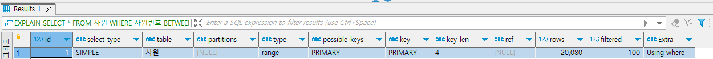
</div>

<br/>

### 기본 실행 계획 항목 분석

EXPLAIN 키워드로 실행 계획을 조회하면 id, select_type, table, type, key 등의 정보가 출력된다.  
이때 출력되는 항목의 의미를 명확히 이해해야 SQL 문이 비효율적으로 수행되지 않는지, 튜닝을 어떻게 해야 할지 등에 관한 방향을 잡을 수 있다.  

<br/>

#### `id`

id는 실행 순서를 표시하는 숫자이다.  
SQL 문이 수행되는 차례를 ID로 표기한 것으로 조인할 때는 똑같은 ID가 표시된다.  
즉, ID의 숫자가 작을수록 먼저 수행된 것이고 ID가 같은 값이라면 두 개 테이블의 조인이 이루어졌다고 해석할 수 있다.  
```SQL
EXPLAIN
SELECT 사원.사원번호, 사원.이름, 사원.성, 급여.연봉,
       (SELECT MAX(부서번호) 
        FROM 부서사원_매핑 as 매핑 WHERE 매핑.사원번호 = 사원.사원번호) 카운트
FROM 사원, 급여
WHERE 사원.사원번호 = 10001
AND 사원.사원번호 = 급여.사원번호;
```
<div align="center">
    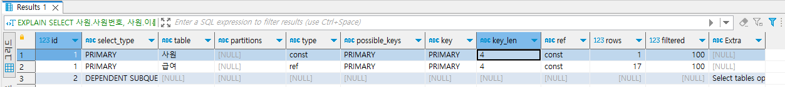
</div>
<div align="center">
    ID가 1인 첫 번째 행과 두 번째 행의 조인이 이루어진 뒤에 세 번째 행이 수행됨
</div>

<br/>

#### `select_type`

SQL 문을 구성하는 SELECT 문의 유형을 출력하는 항목이다.  
SELECT 문이 단순히 FROM 절에 위치한 것인지, 서브쿼리인지, UNION 절로 묶인 SELECT 문인지 등의 정보를 제공한다.  

 - SIMPLE
    - UNION이나 내부 쿼리가 없는 SELECT 문을 의미하는 유형
    - 단순한 SELECT 구문으로만 작성된 경우를 가리킨다.
```SQL
EXPLAIN 
SELECT * FROM 사원 WHERE 사원번호 = 100000;

EXPLAIN
SELECT 사원.사원번호, 사원.이름, 사원.성, 급여.연봉
FROM 사원,
     (SELECT 사원번호, 연봉
      FROM 급여
      WHERE 연봉 > 80000) AS 급여
WHERE 사원.사원번호 = 급여.사원번호
AND 사원.사원번호 BETWEEN 10001 AND 10010;
```
<div align="center">
    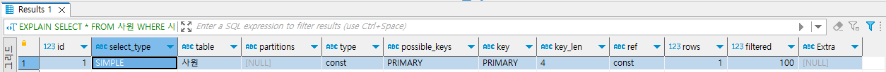
</div>
<div align="center">
    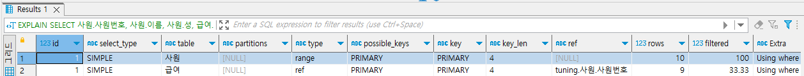
</div>

<br/>

 - PRIMARY
    - 서브쿼리가 포함된 SQL 문이 있을 때 첫 번째 SELECT 문에 해당하는 구문에 표시되는 유형
    - 즉, 서브쿼리를 감싸는 외부 쿼리이거나, UNION이 포함된 SQL 문에서 첫 번째로 SELECT 키워드가 작성된 구문에 표시된다.
```SQL
EXPLAIN
SELECT 사원.사원번호, 사원.이름, 사원.성,
       (SELECT MAX(부서번호) 
        FROM 부서사원_매핑 as 매핑 WHERE 매핑.사원번호 = 사원.사원번호) 카운트
FROM 사원
WHERE 사원.사원번호 = 100001;

EXPLAIN
SELECT 사원1.사원번호, 사원1.이름, 사원1.성
FROM 사원 as 사원1
WHERE 사원1.사원번호 = 100001
UNION ALL
SELECT 사원2.사원번호, 사원2.이름, 사원2.성
FROM 사원 as 사원2
WHERE 사원2.사원번호 = 100002;
```
<div align="center">
    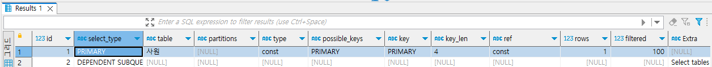
</div>
<div align="center">
    부서사원_매핑 테이블이 포함된 스칼라 서브쿼리가 있을 때 <br/>
    외부 쿼리의 사원 테이블에 우선적으로 접근한다는 의미로 PRIMARY 출력
</div>
<div align="center">
    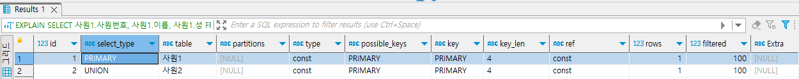
</div>
<div align="center">
    UNION ALL 구문으로 통합된 SQL 문에서 <br/>
    처음 SELECT 구문이 작성된 쿼리가 먼저 접근한다는 의미로 PRIMARY 출력
</div>

<br/>

 - SUBQUERY
    - 독립적으로 수행되는 서브쿼리를 의미한다.
```SQL
EXPLAIN
SELECT (SELECT COUNT(*)
        FROM 부서사원_매핑 as 매핑
        ) as 카운트,
       (SELECT MAX(연봉)
        FROM 급여
        ) as 급여;
```
<div align="center">
    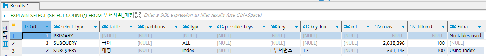
</div>
<div align="center">
    SELECT 절의 스카라라 서브쿼리와 WHERE 절의 중첩 서브쿼리일 경우 해당
</div>

<br/>

 - DERIVED
    - FROM 절에 작성된 서브쿼리를 의미한다.
    - 즉, FROM 절의 별도 임시 테이블인 인라인 뷰를 말한다.
```SQL
EXPLAIN
SELECT 사원.사원번호, 급여.연봉
FROM 사원,
       (SELECT 사원번호, MAX(연봉) as 연봉
        FROM 급여
        WHERE 사원번호 BETWEEN 10001 AND 20000
        GROUP BY 사원번호) as 급여
WHERE 사원.사원번호 = 급여.사원번호;
```
<div align="center">
    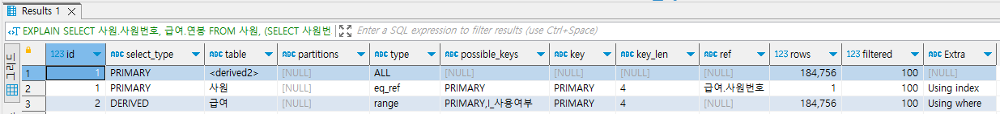
</div>
<div align="center">
    메인쿼리의 FROM 절에서 급여 테이블의 데이터를 가져오는 인라인 뷰
</div>

<br/>

 - UNION
    - UNION 및 UNION ALL 구문으로 합쳐진 SELECT 문에서 첫 번째 SELECT 구문을 제외한 이후의 SELECT 구문에 해당한다는 것을 의미한다.
    - 이때 UNION 구문의 첫 번째 SELECT 절은 PRIMARY 유형으로 출력된다.
<div align="center">
    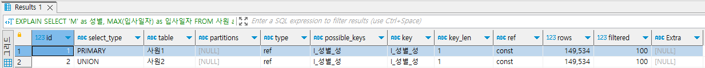
</div>

<br/>

 - UNION RESULT
    - UNION ALL이 아닌 UNION 구문으로 SELECT 절을 결합했을 때 출력된다.
    - UNION은 출력 결과에 중복이 없는 유일한 속성을 가지므로 각 SELECT 절에서 데이터를 가져와 정렬하여 중복 체크하는 과정을 거친다. 따라서 UNION RESULT는 별도의 메모리 또는 디스크에 임시 테이블을 만들어 중복을 제거하겠다는 의미로 해석할 수 있다.
    - UNION 구문으로 결합되기 전의 각 SELECT 문이 중복되지 않는 결과가 보장될 때는 UNION 구문보다는 UNION ALL 구문으로 변경하는 SQL 튜닝을 수행한다.
```SQL
EXPLAIN
SELECT 사원_통합.* 
FROM ( 
      SELECT MAX(입사일자) as 입사일자
      FROM 사원 as 사원1
      WHERE 성별 = 'M' 
      
	  UNION 

      SELECT MIN(입사일자) as 입사일자
      FROM 사원 as 사원2
      WHERE 성별 = 'M' 
    ) AS 사원_통합; 
```
<div align="center">
    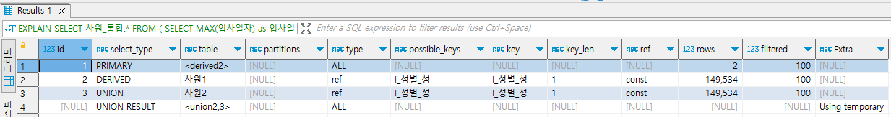
</div>

<br/>

 - DEPENDENT SUBQUERY
    - UNION 또는 UNION ALL을 사용하는 서브쿼리가 메인 테이블의 영향을 받는 경우를 나타낸다.
    - UNION으로 연결된 단위 쿼리들 중에서 처음으로 작성한 단위 쿼리에 해당되는 경우이다.
    - 즉, UNION으로 연결되는 첫 번째 단위 쿼리가 독립적으로 수행하지 못하고 메인 테이블로부터 값을 하나씩 공급받는 구조로 성능적으로 불리하여 SQL 문이 튜닝 대상이 된다.
```SQL
DESC
SELECT 관리자.부서번호,
       ( SELECT 사원1.이름
         FROM 사원 AS 사원1
         WHERE 성별= 'F'
         AND 사원1.사원번호 = 관리자.사원번호

         UNION ALL
 
         SELECT 사원2.이름
         FROM 사원 AS 사원2
         WHERE 성별= 'M'
         AND 사원2.사원번호 = 관리자.사원번호
       ) AS 이름
FROM 부서관리자 AS 관리자;
```
<div align="center">
    
</div>

<br/>

 - DEPENDENT UNION
    - UNION 또는 UNION ALL을 사용하는 서브쿼리가 메인 테이블의 영향을 받는 경우를 나타낸다.
    - UNION으로 연결된 단위 쿼리 중 첫 번째 단위 쿼리를 제외하고 두 번째 단위 쿼리에 해당되는 경우이다.
    - 즉, UNION으로 연결되는 두 번째 이후의 단위 쿼리가 독립적으로 수행하지 못하고 메인 테이블로부터 값을 하나씩 공급받는 구조로 성능적으로 불리하여 SQL 문의 튜닝 대상이 된다.
```SQL
DESC
SELECT 관리자.부서번호,
       ( SELECT 사원1.이름
         FROM 사원 AS 사원1
         WHERE 성별= 'F'
         AND 사원1.사원번호 = 관리자.사원번호

         UNION ALL

         SELECT 사원2.이름
         FROM 사원 AS 사원2
         WHERE 성별= 'M'
         AND 사원2.사원번호 = 관리자.사원번호
       ) AS 이름
FROM 부서관리자 AS 관리자;
```
<div align="center">
    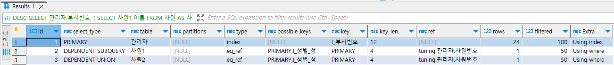
</div>

<br/>

 - UNCACHEABLE SUBQUERY
    - 메모리에 상주하여 재활용되어야 할 서브쿼리가 재사용되지 못할 때 출력되는 유형이다.
    - 해당 서브쿼리 안에 사용자 정의 함수나 사용자 변수가 포함되거나, RAND(), UUID() 함수 등을 사용하여 매번 조회 시마다 결과가 달라지는 경우에 해당된다.
    - 만약, 자주 호출되는 SQL 문이라면 메모리에 서브쿼리 결과가 상주할 수 있도록 변경하는 방향으로 SQL 튜닝을 검토할 수 있다.
```SQL
DESC
SELECT *
FROM 사원
WHERE 사원번호 = (SELECT ROUND(RAND()*1000000));
```
<div align="center">
    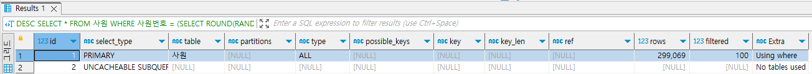
</div>

<br/>

 - MATERIALIZED
    - IN 절 구문에 연결된 서브쿼리가 임시 테이블을 생성한 뒤, 조인이나 가공 작업을 수행할 때 출력되는 유형이다.
    - 즉, IN 절의 서브쿼리를 임시 테이블로 만들어서 조인 작업을 수행한다.
```SQL
DESC
SELECT *
FROM 사원
WHERE 사원번호 IN (SELECT 사원번호 FROM 급여 WHERE 시작일자>'2020-01-01' );
```
<div align="center">
    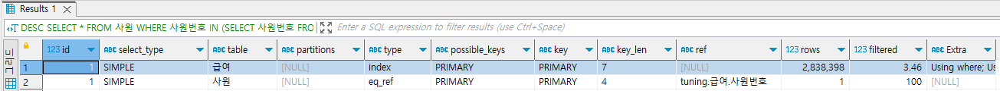
</div>

<br/>

#### `table`

table은 이름 그대로 테이블명을 표시하는 항목이다.  
실행 계획 정보에서 테이블명이나 테이블 별칭을 출력하며, 서브쿼리나 임시 테이블을 만들어서 별도의 작업을 수행할 때는 '<subquery#>' 혹은 '<derived#>'으로 출력된다.  
```SQL
EXPLAIN
SELECT 사원.사원번호, 급여.연봉
FROM 사원,
      (SELECT 사원번호, MAX(연봉) as 연봉
       FROM 급여
       WHERE 사원번호 BETWEEN 10001 AND 20000
       GROUP BY 사원번호) as 급여
WHERE 사원.사원번호 = 급여.사원번호;
```
<div align="center">
    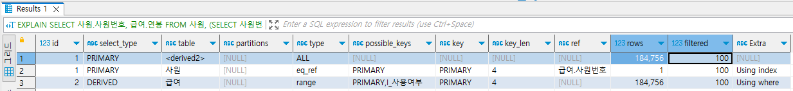
</div>

<br/>

#### `partitions`

실행 계획의 부가 정보로 데이터가 저장된 논리적인 영역을 표시하는 항목이다.  
사전제 정의한 전체 파티션 중 특정 파티션에 선택적으로 접근하는 것이 SQL 성능 측면에서 유리하다.  
만약 너무 많은 영역의 파티션에 접근하는 것으로 출력된다면 파티션 정의를 튜닝해야 한다.  

<br/>

#### `type`

테이블의 데이터를 어떻게 찾을지에 관한 정보를 제공하는 항목이다.  
테이블을 처음부터 끝까지 전부 확인할지 아니면 인덱스를 통해 바로 데이터를 찾아갈지 등을 해석할 수 있다.  

<br/>

 - system
    - 테이블에 데이터가 없거나 한 개만 있는 경우로 성능상 최상의 type으로 볼 수 있다.
```SQL
-- 예시 테이블 생성
CREATE TABLE myisam_테이블 (
사원번호 int NOT NULL,
생년월일birth_date date NOT NULL,
이름 varchar(14) NOT NULL,
성 varchar(16) NOT NULL,
성별 enum('M','F') NOT NULL,
입사일자 date NOT NULL,
PRIMARY KEY (사원번호)
) ENGINE=MyISAM DEFAULT CHARSET=utf8;

-- 데이터 1건 입력
INSERT INTO myisam_테이블
VALUES (10001, '1953-09-02', 'Georgi', 'Facello', 'M', '1986-06-26');

-- 데이터가 1건으로 type이 system
EXPLAIN
SELECT * FROM myisam_테이블;
```

<br/>

 - const
    - 조회되는 데이터가 단 1건일 때 출력되는 유형으로 성능상 매우 유리한 방식이다.
    - 고유 인덱스나 기본 키를 사용하여 단 1건의 데이터에만 접근하면 되므로 속도나 리소스 사용 측면에서 지향해야 할 타입이다.
```SQL
EXPLAIN
SELECT *
FROM 사원
WHERE 사원번호 = 10001;
```

<br/>

 - eq_ref
    - 조인이 수행될 때 드리븐 테이블의 데이터에 접근하며 고유 인덱스 또는 기본 키로 단 1건의 데이터를 조회하는 방식이다.
    - 드라이빙 테이블과의 조인 키가 드리븐 테이블에 유일하므로 조인이 수행될 때 성능상 가장 유리한 경우로 볼 수 있다.
```SQL
EXPLAIN
SELECT 매핑.사원번호, 부서.부서번호, 부서.부서명
FROM 부서사원_매핑 as 매핑,
     부서
WHERE 매핑.부서번호 = 부서.부서번호
AND 매핑.사원번호 BETWEEN 100001 AND 100010;
```
<div align="center">
    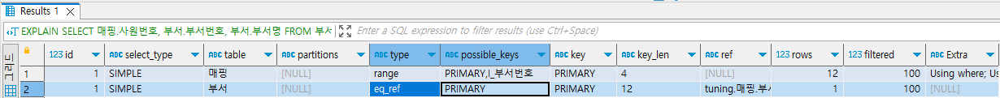
</div>
<div align="center">
    첫 번째와 두 번째 ID가 1로 동일하다. <br/>
    즉, 부서사원_매핑 테이블과 부서 테이블이 조인을 수행한 것을 의미한다. <br/>
    먼저 작성된 첫번째 행의 부서사원_매핑 테이블이 드라이빙 테이블이고, <br/>
    두 번째 행의 부서 테이블이 드리븐 테이블로 해석된다. <br/>
    여기서 type 유형이 eq_ref로 출력되어 <br/>
    조인 수행시 기본키나 고유 인덱스를 활용하여 1건의 데이터씩만 검색된다고 확인이 가능하다.
</div>

<br/>

 - ref
    - eq_ref 유형과 유사한 방식으로 조인을 수행할 때 드리븐 테이블의 데이터 접근 범위가 2개 이상일 경우를 의미한다.
    - 즉, 드라이빙 테이블과 드리븐 테이블이 조인을 수행하면 일대다 관계가 된다.
    - 드라이빙 테이블(1):드리븐 테이블(N)
    - 이때, 기본 키나 고유 인덱스를 활용하면 2개 이상의 데이터가 검색되거나, 유일성이 없는 비고유 인덱스를 사용하게 된다.
```SQL
EXPLAIN
SELECT 사원.사원번호, 직급.직급명
FROM 사원, 직급
WHERE 사원.사원번호 = 직급.사원번호
AND 사원.사원번호 BETWEEN 10001 AND 10100;
```
<div align="center">
    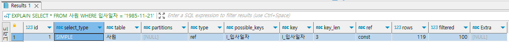
</div>

<br/>

 - ref_or_null
    - ref 유형과 유사하지만 IS NULL 구문에 대해 인덱스를 활용하도록 최적화된 방식이다.
    - 테이블에서 검색할 NULL 데이터양이 적다면 ref_of_null 방식을 활용했을 때 효율적인 SQL 문이 되지만, 검색할 NULL 데이터양이 많다면 SQL 튜닝의 대상이 된다.
```SQL
EXPLAIN
SELECT *
FROM 사원출입기록
WHERE 출입문 IS NULL
OR 출입문 = 'A';
```

<div align="center">
    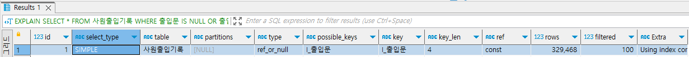
</div>

<br/>

 - range
    - 테이블 내의 연속된 데이터 범위를 조회하는 유형으로 '=', '<>', '>', '>=', '<', '<=', '<=>', IS, NULL, BETWEEN, IN 연산을 통해 범위 스캔을 수행하는 방식이다.
    - 주어진 데이터 범위 내에서 행 단위로 스캔하지만, 스캔할 범위가 넓으면 성능 저하의 요인이 될 수 있으므로 SQL 튜닝 검토 대상이 된다.
```SQL
EXPLAIN
SELECT *
FROM 사원
WHERE 사원번호 BETWEEN 10001 AND 100000;
```

<div align="center">
    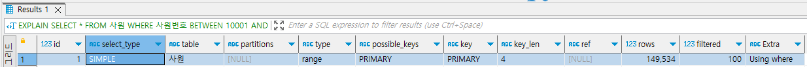
</div>

<br/>

 - fulltext
    - 텍스트 검색을 빠르게 처리하기 위해 전문 인덱스를 사용하여 데이터에 접근하는 방식이다.

<br/>

 - index_merge
    - 결합된 인덱스들이 동시에 사용되는 유형이다.
    - 즉, 특정 테이블에서 생성된 두 개 이상의 인덱스가 병합되어 동시에 적용된다. 이떄, 전문 인덱스는 제외된다.
```SQL
EXPLAIN
SELECT * 
FROM 사원 
WHERE 사원번호 BETWEEN 10001 AND 100000 
AND 입사일자 = '1985-11-21'; 
```

<br/>

 - index
    - type 항목의 index 유형은 인덱스 풀 스캔을 의미한다.
    - 즉, 물리적인 인덱스 블록을 처음부터 끝까지 훑는 방식을 의미한다.
    - 이떄, 데이터를 스캔하는 대상이 인덱스라는 점이 다를 뿐, ALL 유형(테이블 풀 스캔)과 유사하다.
```SQL
EXPLAIN
SELECT 사원번호
FROM 직급
WHERE 직급명 = 'Manager';
```
<div align="center">
    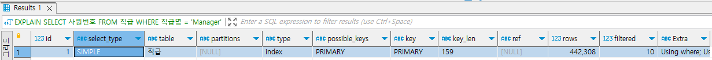
</div>

<br/>

 - ALL
    - 테이블을 처음부터 끝까지 읽는 테이블 풀 스캔 방식에 해당되는 유형이다.
    - ALL 유형은 활용 할 수 있는 인덱스가 없거나, 인덱스를 활용하는 게 오히려 비효율적이라고 옵티마이저가 판단했을 때 선택된다.
    - ALL 유형일 때는 인덳그를 새로 추가하거나 기존 인덱스를 변경하여 인덱스를 활용하는 방식으로 SQL 튜닝을 할 수 있으나, 전체 테이블 중 10 ~ 20% 이상 분량의 데이터를 조회할 때는 ALL 유형이 오히려 성능상 유리할 수도 있다.
```
EXPLAIN
SELECT * FROM 사원;
```

<br/>

#### `possible_keys`

옵티마이저가 SQL 문을 최적화하고자 사용할 수 있는 인덱스 목록을 출력한다.  
다만, 실제 사용한 인덱스는 아니고 사용할 수 있는 후보군의 기본 키와 인덱스 목록만 보여주므로 SQL 튜닝의 효용성은 없다.  

<br/>

#### `key`

옵티마이저가 SQL 문을 최적화하고자 사용한 기본 키(PK) 또는 인덱스명을 의미한다.  
어느 인덱스로 데이터를 검색했는지 확인할 수 있다.  
비효율적인 인덱스를 사용했거나 인덱스 자체를 사용하지 않았다면 SQL 튜닝 대상이 된다.  
 - type 컬럼의 값이 ALL인 것으로도 인덱스를 활용하지 않았음을 확인할 수 있다.
```SQL
EXPLAIN
SELECT 사원번호
FROM 직급
WHERE 직급명 = 'Manager';

EXPLAIN
SELECT * FROM 사원;
```

<br/>

#### `key_len`

인덱스를 사용할 때는 인덱스 전체를 사용하거나 일부 인덱스만 사용한다.  
key_len은 사용한 인덱스의 바이트 수를 의미한다.  
UTF-8 캐릭터셋 기준으로 INT 데이터 유형은 단위당 4바이트, VARCHAR 데이터 유형은 단위당 3바이트로 계산된다.

<br/>

#### `ref`

ref는 reference의 약자로 테이블 조인을 수행할 때 어떤 조건으로 해당 테이블에 액세스되었는지를 알려주는 정보이다.  

```SQL
EXPLAIN
SELECT 사원.사원번호, 직급.직급명
FROM 사원, 직급
WHERE 사원.사원번호 = 직급.사원번호
	AND 사원.사원번호 BETWEEN 10001 AND 10100;
```
<div align="center">
    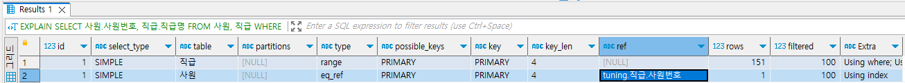
</div>
<div align="center">
    드리븐 테이블인 직급 테이블의 데이터에 접근하면 사원 번호로 데이터를 검색한다.
</div>

<br/>

#### `rows`

SQL 문을 수행하고자 접근하는 데이터의 모든 행 수를 나타내는 예측 항목이다.  
즉, 디스크에서 데이터 파일을 읽고 메모리에서 처리해야 할 행 수를 예상하는 값이고, 수시로 변공되는 MySQL의 통계정보를 참고하여 산출하는 값이다.  
최종 출력될 행수는 아니다.  
 - SQL 문의 최종 결과 건수와 비교해 rows 수가 크게 차이 날 때는 불필요하게 MySQL 엔진까지 데이터를 많이 가져왔다는 뜻으로 SQL 튜닝 대상이 될 수 있다.

<br/>

#### `filtered`

SQL 문을 통해 DB 엔진으로 가져온 데이터 대상으로 필터 조건에 따라 어느 정도 비율로 데이터를 제거했는지를 의미하는 항목이다.  
 - filtered에 나타나는 값의 단위는 % 이다.

<br/>

#### `extra`

SQL 문을 어떻게 수행할 것인지에 관한 추가 정보를 보여주는 항목이다.  
부가적인 정보들은 세미콜론(;)으로 구분하여 여러 가지 정보를 나열할 수 있으며 30여 가지 항목으로 정리할 수 있다.  
MySQL 8.0 extra 정보: https://docs.oracle.com/cd/E17952_01/mysql-8.0-en/explain-output.html  
MariaDB extra 정보: https://mariadb.com/kb/en/explain/  

 - Distinct
    - 중복이 제거되어 유일한 값을 찾을 때 출력되는 정보이다.
    - 중복 제거가 포함되는 distinct 키워드나 union 구문이 포함된 경우 출력된다.
 - Using where
    - WHERE 절의 필터 조건을 사용해 MySQL 엔진으로 가져온 데이터를 추출할 것을 의미한다.
 - Using Temporary
    - 데이터의 중간 결과를 저장하고자 임시 테이블을 생성할 것을 의미한다.
    - 데이터를 가져와 저장한 뒤에 정렬 작업을 수행하거나 중복을 제거하는 작업 등을 수행한다.
    - 보통 DISTINCT, GROUP BY, ORDER BY 구문이 포함된 경우 Using temporary 정보가 출력된다.
 - Using index
    - 물리적인 데이터 파일을 읽지 않고 인덱스만을 읽어서 SQL 문의 요청사항을 처리할 수 있는 경우를 의미한다.
    - 일명 커버링 인덱스 방식이라고 부르며, 인덱스로 구성된 열만 SQL 문에서 사용할 경우 이 방식을 활용한다.
    - 물리적으로도 테이블보다 인덱스가 작고 정렬되어 있으므로 적은 양의 데이터에 접근할 때 성능 측면에서 효율적이다.
 - Using filesort
    - 정렬이 필요한 데이터를 메모리에 올리고 정렬 작업을 수행한다는 의미이다.
    - 보통 이미 정렬된 인덱스를 사용하면 추가적인 정렬 작업이 필요 없지만, 인덱스를 사용하지 못할 때는 정렬을 위해 메모리 영역에 데이터를 올리게 된다.
    - Using filesort는 추가적인 정렬 작업이므로 인덱스를 활용하도록 SQL 튜닝 검토 대상이 될 수 있다.
 - Using join buffer
    - 조인을 수행하기 위해 중간 데이터 결과를 저장하는 조인 버퍼를 사용한다는 의미이다.
    - 즉, 드라이빙 테이블의 데이터에 먼저 접근한 결과를 조인 버퍼에 담고 난 뒤, 조인 버퍼와 드리븐 테이블 간에 서로 일치하는 조인 키값을 찾는 과정을 수행한다. 이러한 조인 버퍼를 활용하는 일련의 과정이 존재하면 Using join buffer 정보가 출력된다.
 - Using union/ Using intersect/ Using sort_union
    - 실행 계획의 type 항목에서 두 개 이상의 인덱스가 병합되어 데이터에 접근하는 경우 index_merge 유형이 출력된다.
    - 이렇게 인덱스가 병합되어 실행되는 SQL 문의 extra 항목에는 인덱스를 어떻게 병합했는지에 관한 상세 정보가 출력되는데, 그 정보가 Using union, Using intersect, Using sort_union 이다.
    - Using union: 인덱스들을 합집합처럼 모두 결합하여 데이터에 접근 (OR 구문)
    - Using intersect: 인덱스들을 교집합처럼 추출하는 방식으로 AND 구문으로 작성된 경우
    - Using sort_union: Using union과 비슷하지만, WHERE 절의 OR 구문이 동등조건이 아닌 경우
 - Using index condition
    - MySQL 엔진에서 인덱스로 생성된 열의 필터 조건에 따라 요청된 데이터만 필터링하는 Using where 방식과 달리, 필터 조건을 스토리지 엔진으로 전달하여 필터링 작업에 대한 MySQL 엔진의 부하를 줄이는 방식이다.
    - 스토리지 엔진의 데이터 결과를 MySQL 엔진으로 전송하는 데이터양을 줄여 성능 효율을 높일 수 있는 옵티마이저의 최적화 방식이다.
 - Using index condition(BKA)
    - tppe 정보의 Using index condition 유형과 비슷하지만, 데이터를 검색하기 위해 배치 키 액세스를 사용하는 방식이다.
 - Using index for group-by
    - GROUP BY 구문이나 DISTINCT 구문이 포함될 때는 인덱스로 정렬 작업을 수행하여 최적화한다.
    - 이때, Using index for group-by는 인덱스로 정렬 작업을 수행하는 인덱스 루스 스캔일 때 출력되는 부가 정보이다.
 - Not exists
    - 하나의 일치하는 행을 찾으면 추가로 행을 더 검색하지 않아도 될 때 출력되는 유형이다.
    - 해당 메커니즘은 왼쪽 외부 조인 또는 오른쪽 외부 조인에서 테이블에 존재하지 않는 데이터를 명시적으로 검색할 때 발생한다.

<br/>

## 좋고 나쁨을 판단하는 기준

실행 계획을 수행하여 출력된 정보를 살펴보았을 때, SQL 튜닝 대상인 실행 계획과 튜닝이 필요하지 않은 실행 계획에 대해서 명확하게 구분하기란 어려운 작업이다.  

꼭 어느 것이 좋고 어느 것이 나쁘다고 단언하기는 어렵지만, 나름의 기준을 수립하고 각자의 상황에 맞게 검토 대상을 추출할 수 있다.  

 - select_type 항목의 판단 기준
    - 좋음: SIMPLE, PRIMARY, DERIVED
    - 나쁨: DEPENDENT *, UNCACHEABLE *
 - type 항목의 판단 기준
    - 좋음: system, const, eq_ref
    - 나쁨: index, all
 - extra 항목의 판단 기준
    - 좋음: Using index
    - 나쁨: Using filesort, Using temporary

<br/>

## 확장된 실행 계획 수행

기본적으로 실행 계획을 확인하는 키워드로 EXPLAIN을 사용할 수 있다.  
추가적으로 추가 정보를 확인하고자 할 때 DB에서 각각 지원하는 키워드로 추가 정보를 확인할 수 있다.  

<br/>

#### `MySQL의 확장된 실행 계획 수행`

 - EXPLAIN FORMAT = TRADITIONAL
    - 기본적인 실행 계획은 EXPLAIN 키워드로 입력하며 기본 포맷은 TRADITIONAL이다.
    - 따라서 명시하지 않아도 기본적인 실행 계획 정보가 출력된다.
 - EXPLAIN FORMAT = TREE
    - 형식값에 TREE 옵션을 입력하면 트리 형태로 추가된 실행 계획 항목을 확인할 수 있다.
 - EXPLAIN FORMAT = JSON
    - 형식값에 JSON 옵션을 입력하면 JSON 형태로 추가된 실행 계획 항목을 확인할 수 있다.
 - EXPLAIN ANALYZE
    - 기존 실행 계획은 예측된 실행 계획에 관한 정보이다. 만약, 실제 측정한 실행 계획 정보를 출력하고 싶다면 ANALYZE 키워드를 사용한다.
    - 실제 수행된 소요 시간과 비용을 측정하여 실측 실행 계획과 예측 실행 계획 모두를 확인하려면 EXPLAIN ANALYZE 키워드를 활용한다.
```SQL
-- 기본 형식
EXPLAIN FORMAT = TRADITIONAL
SELECT *
FROM 사원
WHERE 사원번호 BETWEEN 100001 AND 200000;

-- TREE 형식
EXPLAIN FORMAT = TREE
SELECT *
FROM 사원
WHERE 사원번호 BETWEEN 100001 AND 200000;

-- JSON 형식
EXPLAIN FORMAT = JSON
SELECT *
FROM 사원
WHERE 사원번호 BETWEEN 100001 AND 200000;

-- ANALYZE (실측 시간)
EXPLAIN ANALYZE 
SELECT * 
FROM 사원 
WHERE 사원번호 BETWEEN 100001 AND 200000; 
```

<br/>

#### `MariaDB의 확장된 실행 계획 수행`

 - EXPLAIN PARTITIONS
    - 파티션으로 설정된 테이블에 대해 접근 대상인 파티션 정보를 출력한다.
 - EXPLAIN EXTENDED
    - 스토리지 엔진에서 가져온 데이터를 다시 MySQL 엔진에서 추출한 비율인 filtered 열의 값을 추가로 출력한다.
 - ANALYZE
    - MariaDB 10.1 이상에서 ANALYZE 키워드만으로 실제 측정한 실행 계획 정보가 출력된다.
    - 실제 액세스한 데이터 건수(r_rows)와 MySQL 엔진에서 가져온 데이터에서 추가로 추출한 데이터의 비율(r_filtered)을 확인할 수 있다.
```SQL
-- 파티션 정보
EXPLAIN PARTITIONS
SELECT *
FROM 사원
WHERE 사원번호 BETWEEN 100001 AND 200000;

-- EXTENDED
EXPLAIN EXTENDED
SELECT *
FROM 사원
WHERE 사원번호 BETWEEN 100001 AND 200000;

-- ANALYZE (실측 시간)
ANALYZE
SELECT *
FROM 사원
WHERE 사원번호 BETWEEN 100001 AND 200000;
```

<br/>

## 프로파일링

SQL 문에서 프로파일링은 문제가 되는 병목 지점을 찾고자 사용하는 수단이나 툴을 가리킨다.  
느린 쿼리나 문제가 있다고 의심되는 SQL 문의 원인을 확인할 수 있다.  
 - 프로파일을 확인하는 과정은 툴이 아닌 명령줄에서 수행한다. 툴은 사용자의 의도와 무관하게 백그라운드에서 호출되는 SQL 문이 존재하므로, 예상치 않은 SQL 문이 프로파일링 되지 않도록 명령줄을 활용한다.

<br/>

#### `SQL 프로파일링 실행하기`

실습 대상 DB에 접속한 뒤 프로파일링의 설정값을 확인한다.  
MySQL은 기본적으로 비활성화(OFF)되어 있으므로, OFF로 되어있다면 활성화 작업을 진행해야 한다.  
SET 키워드로 프로파일링을 활성화(ON) 상태로 변경한다. 접속한 세션에 한해서만 적용되므로 다른 접속 세션에는 영향을 미치지 않는다.

 - show profiles: 프로파일 목록을 출력한다.
 - show profile for query 쿼리ID: 특정 쿼리 ID에 대한 상세 내용을 출력한다.
 - show profile 키워드 for query 쿼리ID: 특정 쿼리 ID에 대한 해당 키워드로 확장된 정보의 상세 내용을 출력한다. (Block I/O, CPU, SWAP 횟수 등 OS 수준의 확장된 정보 제공)
    - ALL: 모든 정보 표시
    - BLOCK IO: 블록 입력 및 출력 작업의 횟수를 표시
    - CONTEXT SWITCHES: 자발적 및 비자발적인 컨텍스트 스위치 수를 표시
    - CPU: 사용자 및 시스템 CPU 사용 기간을 표시
    - IPC: 보내고 받은 메시지의 수를 표시
    - PAGE FAULTS: 주 페이지 오류 및 부 페이지 오류 수를 표시
    - SOURCE: 함수가 발생하는 파일 이름과 행 번호와 함께 소스 코드의 함수 이름을 표시
    - SWAPS: 스왑 카운트 표시
```Bash
# 프로파일링 확인 및 활성화
mysql> show variables like 'profiling%';
mysql> set profiling = 'ON';

# 프로파일링 수행
mysql> SELECT 사원번호 FROM 사원 WHERE 사원번호=100000;
mysql> show profiles; 

# 특정 쿼리 ID에 대해서만 프로파일링된 상세 정보 확인
mysql> show profile for query 쿼리ID;

# 특정 쿼리 ID에 대해서 모든 프로파링일 정보 출력 (CPI, Block I/O, 컨텍스트 스위칭 등)
mysql> show profile all for query 쿼리ID;

# SQL 수행 단계별로 점유한 CPU 양 출력
mysql> show profile cpu for query 쿼리ID;

# 데이터 접근 단위인 블록 수준의 입력과출력에 관한 정보 출력
mysql> show profile block io for query 쿼리ID;
```
<div align="center">
    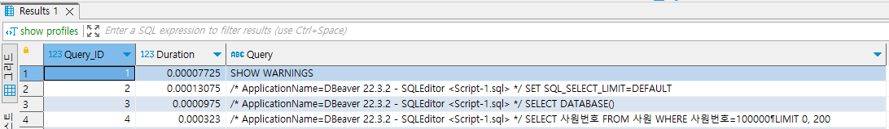
</div>
<div align="center">
    show profiles
</div>
<div align="center">
    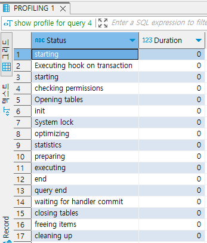
</div>
<div align="center">
    show profile for query 4
</div>

<br/>

 - 일반적인 프로파일링 항목
```
starting: SQL 문 시작
checking permissions: 필요 권한 확인
Opening tables: 테이블 열기
After opening tables: 테이블을 연 이후
System lock: 시스템 잠금
Table lock: 테이블 잠금
init: 초기화
optimizing: 최적화
statistics: 통계
preparing: 준비
executing: 실행
Sending data: 데이터 보내기
end: 끝
query end: 질의 끝
closing tables: 테이블 닫기
Unlocking tables: 테이블 잠금 해제
freeing items: 항목 해방
updating status: 상태 업데이트
cleaning up: 청소
```

 - 확장된 프로파일링 출력 항목
```
QUERY_ID: Query_ID
SEQ: 동일한 QUERY_ID를 갖는 행의 표시 순서를 보여주는 일련번호
STATE: 프로파일링 상태
DURATION: 명령문이 현재 상태에 있었던 시간(초)
CPU_USER: 사용자 CPU 사용량(초)
CPU_SYSTEM: 시스템 CPU 사용량(초)
CONTEXT_VOLUNTARY: 자발적 컨텍스트 전환의 수
CONTEXT_INVOLUNTARY: 무의식적인 컨텍스트 전환의 수
BLOCK_OPS_IN: 블록 입력 조작의 수
BLOCK_OPS_OUT: 블록 출력 조작의 수
MESSAGES_SENT: 전송된 통신 수
MESSAGES_RECEIVED: 수신된 통신 수
PAGE_FAULTS_MAJOR: 메이저 페이지 폴트의 수
PAGE_FAULTS_MINOR: 마이너 페이지 폴트의 수
SWAPT: 스왑 수
SOURCE_FUNCTION: 프로파일링된 상태로 실행되는 소스 코드의 기능
SOURCE_FILE: 프로파일링된 상태로 실행된 소스 코드의 파일
SOURCE_LINE: 프로파일링된 상태로 실행된 소스 코드의 행
```
