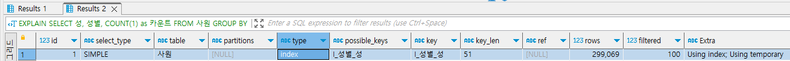
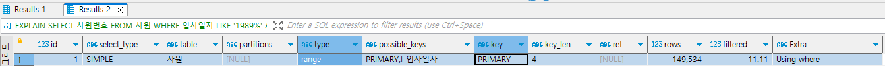

# 악성 SQL 튜닝으로 초보자 탈출하기

해당 예제는 MySQL 8.0.20 버전으로 실습한다.  
일부 MySQL 버전별 또는 DB 유형별로 SQL 문을 처리하는 옵티마이저 로직이 다를 수 있다.  
그러나 SQL 튜닝에서 기본적인 문제점을 도출하는 방향과 해결하는 방식은 크게 다르지 않다.  

<br/>

## SQL 튜닝 준비하기

### 실습 데이터 이해하기

사원과 부서 중심의 총 7개 테이블로 실습한다.  

<br/>

#### `사원 테이블`

해당 기업에 소속된 직원들의 정보를 저장하는 테이블
 - 사원번호: 오브젝트를 유일하게 구분할 수 있는 숫자
 - 생년월일: 년/월/일에 대한 정보로 날짜 타입으로 구성
 - 이름
 - 성
 - 성별: M(남성)과 F(여성)
 - 입사일자: 날짜 타입으로 구성

<br/>

#### `부서 테이블`

조직에서 관리하는 업무 부서에 관한 정보를 저장하는 테이블
 - 부서번호: 부서를 유일하게 식별할 수 있는 문자열
 - 부서명
 - 비고: 해당 부서가 윻료한지를 나타내는 정보로 NULL 값이 포함될 수 있음

<br/>

#### `부서사원_매핑 테이블`

부서 테이블과 사원 테이블 간의 매핑 정보를 담은 테이블  
즉, 한 명의 사원은 특정 부서에 소속되므로 그에 해당하는 연결 정보를 저장한다.
 - 사원번호
 - 부서번호
 - 시작일자: 사원이 해당 부서에 소속된 일자
 - 종료일자: 사원이 해당 부서에 소속 해지된 일자

<br/>

#### `부서관리자 테이블`

부서를 대표하는 관리자 사원의 정보가 저장되는 테이블
 - 사원번호
 - 부서번호
 - 시작일자: 해당 부서에 사원이 관리자 역할로 임명된 일자
 - 종료일자: 해당 부서에 사원이 관리자 역할에서 해지된 일자

<br/>

#### `직급 테이블`

사원이 위치한 포지션을 나타내는 테이블  
과거의 직급 정보부터 현재의 직급 정보까지 적재한다.  
 - 사원번호
 - 직급명
 - 시작일자: 해당 직급이 부여된 일자
 - 종료일자: 해당 직급이 만료된 일자, NULL일 때는 종료일자가 정해지지 않음을 의미

<br/>

#### `급여 테이블`

사원별로 매년 계약한 연봉 정보가 저장되는 테이블  
과거 급여부터 현재 급여까지 매번 적재한다.  
 - 사원번호:
 - 연봉
 - 시작일자: 해당 연봉 정보가 유효한 시작 일자
 - 종료일자: 해당 연봉 정보가 만료되는 일자
 - 사용여부: 해당 연봉정보의 활성화 여부를 나타내는 문자, NULL 값이 포함될 수 있음

<br/>

#### `사원출입기록 테이블`

지역별, 출입문별로 출입한 이력에 관한 시간 정보를 적재하는 테이블
 - 순번: 자동적으로 숫자가 증가하는 AUTO_INCREMENT 숫자
 - 사원번호
 - 입출입시간: 출입한 시간 정보로 TIMESTAMP 형식으로 적재
 - 입출입구분: I(입력), O(출력)
 - 출입문: 출입문 코드로 NULL이 포함될 수 있음
 - 지역: 지역 코드로 NULL이 포함될 수 있음

<br/>

#### `테이블 데이터 건수`

 - 급여 테이블: 2,844,047
 - 부서 테이블: 9
 - 부서관리자 테이블: 24
 - 부서사원_매핑 테이블: 331,603
 - 사원 테이블: 300,024
 - 사원출입기록 테이블: 660,000
 - 직급 테이블: 443,308
```SQL
SELECT COUNT(1) FROM 테이블명
```

<br/>

#### `테이블별 인덱스 목록`

 - 급여 테이블
    - PK: 사원번호 + 시작일자
    - INDEX: I_사용여부
 - 부서 테이블
    - PK: 부서번호
    - UNIQUE INDEX: 부서명
 - 부서관리자 테이블
    - PK: 사원번호 + 부서번호
    - INDEX: 부서번호
 - 부서사원_매핑 테이블
    - PK: 사원번호 + 부서번호
    - INDEX: 부서번호
 - 사원 테이블
    - PK: 사원번호
    - INDEX: 입사일자
    - INDEX: 성별 + 성
 - 사원출입기록 테이블
    - PK: 순번 + 사원번호
    - INDEX: 출입문
    - INDEX: 지역
    - INDEX: 시간
 - 직급 테이블
    - PK: 사원번호 + 직급명 + 시작일자
```SQL
SHOW INDEX FROM 테이블명;
```

<br/>

#### `실무적인 SQL 튜닝 절차`

SQL 문의 구성요소는 크게 두 가지로 구분할 수 있다.  
가시적으로는 테이블 현황과 조건절, 그루핑 열, 정렬되는 열, SELECT 절의 열이고,  
비가시적으로는 실행 계획, 인덱스 현황, 조건절 열들의 데이터 분포, 데이터의 적재 소곧, 업무 특성 등이다.  
즉, 다양한 항목을 분석한 뒤 SQL 문의 튜닝 방향을 잡을 수 있다.  

```
1. SQL문 실행결과 & 현황 파악
 - 결과 및 소요시간 확인
 - 조인/서브쿼리 구조
 - 동등/범위 조건

2. SQL 구성요소 파악
 - 가시적: 테이블 데이터 건수, SELECT절 컬럼 분석, 조건절 컬럼 분석, 그루핑/정렬 컬럼
 - 비가시적: 실행계획, 인덱스 현황, 데이터 변경 추이, 업무적특징

3. 튜닝 바향 판단 & 개선/적용
```

<br/>

## SQL 문 단순 수정으로 착한 쿼리 만들기

### `기본 키를 변형하는 나쁜 SQL 문`

 - 튜닝 전 SQL 문 (130 ~ 140 ms)
    - 사원번호를 그대로 사용하지 않고, SUBSTRING(사원번호, 1, 4)와 LENGTH(사원번호)와 같이 가공하여 작성하면, 기본 키를 사용하지 않고 테이블 풀 스캔을 수행하게 된다.
    - 실행 계획을 확인하면 Type 항목이 ALL로 나타난다. (테이블 풀 스캔)
```SQL
-- 사원번호가 1100으로 시작하면서 사원번호가 5자리인 사원의 정보를 출력한다.
SELECT *
FROM 사원
WHERE SUBSTRING(사원번호,1,4) = 1100
    AND LENGTH(사원번호) = 5;
```
<div align="center">
    
</div>

 - 튜닝 수행 (60 ~ 70 ms)
    - 사원 테이블을 구성하는 기본 키와 인덱스
        - show index from 사원;
        - PRIMARY KEY: 사원번호
        - 인덱스: 입사일자, 성별
    - 튜닝 내용
        - WHERE 절에 사원 번호(기본키)를 가공하지 않고, 기본키를 그대로 사용한다.
    - 튜닝 후 실행 계획
        - 사원 테이블에만 접근하면 되므로 1개 행으로 출력
        - type(range): 기본키의 특정 범위 스캔
        - rows(10): 10개 데이터
        - filtered(100): 필터링 100%
```SQL
-- 5자리이면서 1100으로 시작하는 사원번호를 찾는 것으로 BETWEEN 구문으로 범위 검색을 수행한다.
SELECT *
FROM 사원
WHERE 사원번호 BETWEEN 11000 AND 11009

SELECT *
FROM 사원
WHERE 사원번호 >= 11000 AND 사원번호 <= 11009
```

<br/>

### `사용하지 않는 함수를 포함하는 나쁜 SQL 문`

 - 튜닝 전 SQL 문 (1100 ~ 1200 ms)
    - 키 항목이 I_성별_성 인덱스로 인덱스 풀 스캔 방식이 수행된다.
    - Extra 항목이 Using temporary로 임시 테이블을 생성한다는 것을 알 수 있다.
```SQL
-- 사원 테이블에서 성별 기준으로 몇 명의 사원이 있는지 출력
SELECT IFNULL(성별,'NO DATA') AS 성별, COUNT(1) 건수
FROM 사원
GROUP BY IFNULL(성별,'NO DATA');
```
<div align="center">
    
</div>

 - 튜닝 수행 (40 ~ 50 ms)
    - 사전 테이블 내용
        - 사원 테이블의 성별 열에는 NULL 값이 존재하지 않고 M(남)과 F(여) 값만을 저장한다.
        - 떄문에, 굳이 IFNULL()을 이용하여 값이 없으면 'NO DATA'로 변환하는 함수가 필요가 없다. DB 내부적으로 IFNULL() 함수를 처리하기 위해 별도의 임시 테이블을 만들어서 NULL 값의 여부를 검사할 필요가 없다.
    - 튜닝 내용
        - IFNULL() 함수를 제거하고 성별 열만 그대로 사용한다.
     - 튜닝 후 실행 계획
        - 키 항목이 I_성별_성 인덱스로 인덱스 풀 스캔 방식으로 수행되지만,
        - Extra 항목이 Using index이므로 임시 테이블 없이 인덱스만 사용하여 데이터를 추출한다.
```SQL
SELECT 성별, COUNT(1) 건수
FROM 사원
GROUP BY 성별;
```

<br/>

### `형변환으로 인덱스를 활용하지 못하는 나쁜 SQL 문`

 - 튜닝 전 SQL 문 (300 ~ 500 ms)
    - 키 항목이 I_사용여부 인덱스로 인덱스 풀 스캔 방식이 수행된다. (type = index)
    - filtered 항목이 10.00으로 MySQL 엔진으로 가져온 데이터 중 10%를 추출해서 최종 데이터를 출력한다.
    - 즉, rows 항목에 표시된 2,838,398건의 데이터를 스토리지 엔진에서 MySQL 엔진으로 가져온 뒤 그중 약 10%에 해당하는 4만 건의 데이터가 최종 출력된다.
```SQL
-- 급여 테이블에서 현재 유효한 급여 정보만 조회하고자 사용 여부 열의 값이 1인 데이터를 출력
SELECT COUNT(1)
FROM 급여
WHERE 사용여부 = 1;
```
<div align="center">
    
</div>

 - 튜닝 수행 (50 ~ 60 ms)
    - 사전 테이블 내용
        - 사용여부 컬럼에는 0, 1, 공백 데이터가 저장된다.
        - 튜닝 대상인 SQL 문의 조건절에 작성된 사용여부 컬럼의 값 1인 데이터는 전체 데이터의 10% 이하이다.
    - 급여 테이블을 구성하는 기본 키와 인덱스
        - show index from 급여;
        - PRIMARY KEY: 사원번호, 시작일자
        - 인덱스: 사용여부 (CHAR형)
    - 튜닝 내용
        - 사용여부 열은 char(1) 데이터 유형으로 구성된다. 이처럼 문자 유형인 사용여부 열을 튜닝 전 SQL 문에서는 WHERE '사원번호 = 1'과 같이 숫자 유형으로 써서 데이터에 접근했으므로 DBMS 내부의 묵시적 형변환이 발생한다. 그 결과 I_사용여부 인덱스를 제대로 활용하지 못하고 전체 데이터를 스캔한다.
        - 형변환이 발생하지 않도록 SQL 문을 조정한다.
    - 튜닝 후 실행 계획
        - 키 항목에서 I_사용여부 인덱스를 사용하여 데이터에 접근한다.
        - 튜닝 전과 달리 사용여부 = '1' 조건절이 스토리지 엔진에서 전달되어 필요한 데이터만 가져온다.
```SQL
SELECT COUNT(1)
FROM 급여
WHERE 사용여부 = '1';
```

<br/>

### `열을 결합하여 사용하는 나쁜 SQL 문`

 - 튜닝 전 SQL 문 (140 ~ 160 ms)
    - 사원 테이블에만 접근하여 데이터를 가져오므로 하나의 행에 대해서만 실행 계획이 출력된다.
    - 테이블 풀 스캔(type: ALL)으로 데이터를 처음부터 끝까지 스캔한다.
    - type: ALL, rows: 300,024개, filtered: 100% (모든 데이터를 가져오고, 필터링도 되지 않는다.)
```SQL
-- 사원 테이블에서 성별의 값과 1칸의 공백, 성의 값을 모두 결합한 결과가 'M Radwan'인 데이터 조회
SELECT *
FROM 사원
WHERE CONCAT(성별, ' ', 성) = 'M Radwan';
```
<div align="center">
    
</div>

 - 튜닝 수행 (50 ~ 60 ms)
    - 사원 테이블을 구성하는 기본 키와 인덱스
        - show index from 사원;
        - PRIMARY KEY: 사원번호
        - 인덱스: 입사일자, 성별 + 성
    - 튜닝 내용
        - 인덱스 열들을 가공하는 CAONCAT() 함수를 제거한다.
    - 튜닝 후 실행 계획
        - type: ref, rows: 102, filtered: 100%
        - 동등 비교를 통해 인덱스를 사용해서 사원 테이블에 접근한다. 튜닝 전에는 인덱스 키 값으로 비교하지 않고, 가공된 값으로 비교하여 30만 건의 데이터를 접근하여 비교를 했다면, 인덱스 키 값 자체로 비교하여 102 건의 데이터에만 접근한다.
```SQL
SELECT *
FROM 사원
WHERE 성별 = 'M'
	AND 성 = 'Radwan';
```

<br/>

### `습관적으로 중복을 제거하는 나쁜 SQL 문`

 - 튜닝 전 SQL 문 (60 ~ 70 ms)
    - DISTINCT 연산으로 SELECT 절에 작성된 사원번호, 이름, 성, 부서번호 순으로 정렬한 뒤 중복된 데이터를 제외하고 출력된다.
    - 두러아방 태아불안 뷰속헌라저 태아붉허 두라분 태아불안 사원 테이블의 ID 값이 둘 다 1로 동일하게 나타난다. 즉, 서로 조인하고 있다.
    - 부서관리자 테이블의 type 항목이 index로 인덱스 풀 스캔을 수행한다.
    - 사원 테이블의 type 항목이 eq_ref로 사원번호라는 기본 키를 사용해 단 1건의 데이터를 조회하는 방식으로 조인된다.
    - 또한, Extra 항목의 Using temporary를 통해 DISTINCT를 수행하고자 별도의 임시 테이블을 만들고 있음을 확인할 수 있다.
```SQL
-- 부서 관리자의 사원번호와 이름, 성, 부서번호 데이터를 중복 제거하여 조회
SELECT DISTINCT 사원.사원번호, 이름, 성, 부서번호
FROM 사원
    JOIN 부서관리자 ON (사원.사원번호 = 부서관리자. 사원번호);
```
<div align="center">
    
</div>

 - 튜닝 수행 (60 ~ 70 ms)
    - 사전 테이블 내용
        - SELECT 절에 작성된 사원.사원번호에는 중복된 데이터가 없다.
        - 때문에, 굳이 DISTINCT라는 키워드로 정렬 작업을 하고 중복을 제거하는 작업이 필요한지 고민해야 한다.
    - 튜닝 내용
        - DISTINCT 키워드를 제거한다. (사원번호 컬럼은 이미 기본키로 중복 데이터가 없다.)
    - 튜닝 후 실행 계획
        - 실제 소요 시간은 튜닝 전에도 빠르게 수행되어 변화가 거의 없다.
        - 하지만, 실행 계획을 보면 EXTRA 항목의 uSING TEMPORARY가 삭제되었다.
        - 즉, 임시 테이블에서 정렬과 중복 제거를 수행하지 않아도 되므로 불필요한 작업을 제거하였다.
```SQL
SELECT 사원.사원번호, 이름, 성, 부서번호
FROM 사원
    JOIN 부서관리자 ON (사원.사원번호 = 부서관리자. 사원번호);
```

<br/>

### `다수 쿼리를 UNION 연산자로만 합치는 나쁜 SQL 문`

 - 튜닝 전 SQL 문 (80 ~ 90 ms)
    - 작은 데이터로 실습하여 SQL 수행 시간은 매우 짧다.
    - ID가 1, 2인 행에서 I_성별_성 인덱스로 데이터를 조회하고, ID가 NULL인 행에서 행의 결과를 통합하여 중복을 제거하는 작업을 처리한다.
    - ID가 NULL인 행은 메모리에 임시 테이블을 생성(Extra: Using temporary)하고, 그 내부에서 각 결과의 UNION 연산 작업을 수행한다. 만약, 메모리에 상주하기 어려울 만큼 ID 1, 2 행의 데이터가 많다면, 메모리가 아닌 디스크에 임시 파일을 생성하여 UNION 작업을 수행하게 된다.
```SQL
-- 두 개의 SELECT 문을 UNION 연산자로 합친다.
-- 첫 번쨰 SELECT문은 성이 Baba이면서 성별이 M(남)인 사원 데이터를 조회한다.
-- 두 번째 SELECT문은 성이 Baba이면서 성별이 F(여)인 데이터를 조회한다.
SELECT 'M' AS 성별, 사원번호
  FROM 사원 
 WHERE 성별 = 'M'
   AND 성 ='Baba'

 UNION

SELECT 'F', 사원번호
  FROM 사원
 WHERE 성별 = 'F'
   AND 성 = 'Baba';
```
<div align="center">
    
</div>

 - 튜닝 수행 (50 ~ 60 ms)
    - 사전 내용
        - SQL 문에 WHERE 절에 성별과 성이 동등(=) 조건으로 작성되어 있다. 즉, 성별과 성 인덱스를 활용하여 데이터를 빠르게 조회할 것이다.
        - UNION 연산자로 2번의 SELECT 문을 수행하고, 결과를 합친 뒤에 중복을 제거하는 과정을 수행하게 된다.
        - 이때, 이미 사원번호라는 기본 키가 출력되는 SQL 문에서 중복을 제거하는 과정이 필요한지 고민해야 한다.
    - 튜닝 내용
        - UNION으로 결합될 데이터가 이미 중복되지 않는 데이터로 중복을 제거하는 작업이 필요하지 않다.
        - 따라서 임시 테이블을 만들고 정렬한 뒤, 중복을 제거하는 UNION 연산자 대신 단순히 결과를 합치는 UNION ALL 연산자로 대체한다.
    - 튜닝 후 실행 계획
        - ID 1, 2의 실행 계획은 동일하다. 하지만, 임시 테이블을 만들어 정렬하고 중복을 제거하는 실행 계획이 사라졌다. (불필요한 리소스 낭비 방지)
```SQL
SELECT 'M' as 성별, 사원번호
  FROM 사원 
 WHERE 성별 = 'M'
   AND 성 ='Baba'

 UNION ALL

SELECT 'F' as 성별, 사원번호
  FROM 사원
 WHERE 성별 = 'F'
   AND 성 ='Baba';
```

<br/>

### `인덱스 고려 없이 열을 사용하는 나쁜 SQL 문`

 - 튜닝 전 SQL 문 (190 ~ 200 ms)
    - 사원 테이블의 I_성별_성 인덱스를 활용하고, 임시 테이블(Extra: Using temporary)을 생성하여 성과 성별을 그루핑해 카운트 연산을 수행한다.
    - 또한, 인덱스의 구성 열이 GROUP BY 절에 포함되어, 테이블 접근 없이 인덱스만 사용하는 커버링 인덱스(Extra: Using index)로 수행된다.
```SQL
-- 성과 성별 순서로 그루핑하여 몇 건의 데이터가 있는지 조회
SELECT 성, 성별, COUNT(1) as 카운트
FROM 사원
GROUP BY 성, 성별;
```
<div align="center">
    
</div>

 - 튜닝 수행 (50 ~ 60 ms)
    - 사전 내용
        - 튜닝 전 SQL 문에서 사원 테이블의 인덱스를 활용하는데 메모리나 디스크에 임시 테이블을 꼭 생성해야 하는지 고민해야 한다.
        - 인덱스만으로 카운트 연산을 수행할 수는 없는지 확인하기 위해 인덱스 목록을 살펴봐야 한다.
        - I_성별_성 인덱스는 성별 컬럼과 성 컬럼 순으로 생성된 오브젝트이다. 즉, 성별 컬럼 기준으로 정렬된 뒤 성 컬럼 기준으로 정렬되었다. 이러한 인덱스의 순서를 활용할 수 없는가?
    - 튜닝 내용
        - 그루핑을 성, 성별 순서로 수행할 때와 성별, 성 순서로 수행할 때의 결과가 동일하다.
        - 따라서, 이미 존재하는 인덱스를 활용하기 위해 그루핑도 인덱스 순서대로 사용한다. 그러면, 별도의 임시 테이블을 생성하지 않고도 그루핑과 카운트 연산을 수행할 수 있다.
    - 튜닝 후 실행 계획
        - Extra 항목에 Using temporary 항목이 사라졌다. 즉, GROUP BY시 필요한 임시 테이블을 만들고 정렬할 필요가 없다.
```SQL
SELECT 성, 성별, COUNT(1) as 카운트
FROM 사원
GROUP BY 성별, 성;
```

<br/>

### `엉뚱한 인덱스를 사용하는 나쁜 SQL 문`

 - 튜닝 전 SQL 문 (100 ~ 120 ms)
    - 사원 테이블의 기본키(key: PRIMARY)로 범위 스캔(type: range)을 수행한다.
    - 스토리지 엔진으로부터 기본키를 구성하는 사원번호를 조건으로 데이터를 가져온 뒤, MySQL 엔진에서 남은 필터 조건(입사일자 LIKE '1989%')으로 추출하여 filtered 항목에 11.11% 예측값을 출력한다.
```SQL
-- 사원 테이블에서 입사일자 열의 값이 '1989'로 시작하면서 사원번호가 10만을 초과하는 데이터 조회
SELECT 사원번호
FROM 사원
WHERE 입사일자 LIKE '1989%'
    AND 사원번호 > 100000;
```
<div align="center">
    
</div>

 - 튜닝 수행 (60 ~ 70 ms)
    - 사전 내용
        - 실행 계획을 보면 기본키(key: PRIMARY)를 통해 범위 스캔을 하고, 입사일자가 1989년도인 데이터를 조회한다.
        - 사원번호가 10만 이상인 데이터는 전체 데이터의 70%이고, 입사일자가 1989년도인 데이터는 전체 데이터의 10% 이다.
        - 즉, 스토리지 엔진에서 데이터에 접근할 때 사원번호로 접근하는 것이 효율적인지 검토해야 한다. 입사일자로 데이터 액세스를 한다면 더 적은 데이터로 접근할 수 있다. (입사일자 인덱스 이용)
    - 튜닝 내용
        - 입사일자 인덱스를 강제하도록 USE INDEX 힌트를 설정한다.
        - 입사일자에 대해 LIKE 조건절보다는 부등호 조건을 이용하여 데이터 접근 범위를 줄인다.
    - 튜닝 후 실행 계획
        - I_입사일자 인덱스를 활용하여 범위 스캔(type: range)를 수행한다.
        - 테이블에 접근하지 않고 I_입사일자 인덱스만으로 최종 결과를 출력한다. 커버링 인덱스 스캔(Extra: Using index)
        - 스토리지 엔진으로부터 I_입사일자 인덱스에 있는 데이터를 가져온 뒤 MySQL 엔진에서 사원번호에 대한 필터 조건으로 데이터를 추출한다.
```SQL
SELECT COUNT(1) FROM 사원; -- 3000024
SELECT COUNT(1) FROM 사원 WHERE 입사일자 LIKE '1989%'; -- 28394
SELECT COUNT(1) FROM 사원 WHERE 사원번호 > 100000; -- 210024

-- 인덱스 루스 스캔 방식에 의해 인덱스를 스킵하는 오버헤드가 발생할 수 있다.
SELECT 사원번호
FROM 사원 USE INDEX(I_입사일자)
WHERE 입사일자 LIKE '1989%'
    AND 사원번호 > 100000;

SELECT 사원번호
FROM 사원
WHERE 입사일자 >= '1989-01-01' AND 입사일자 < '1990-01-01'
    AND 사원번호 > 100000;
```

<br/>

### `동등 조건으로 인덱스를 사용하는 나쁜 SQL 문`

 - 튜닝 전 SQL 문 (2600 ~ 2800 ms)
    - I_출입문 인덱스를 사용하여 데이터에 접근한다.
```SQL
-- B 출입문으로 출입한 이력이 있는 정보를 조회
SELECT *
FROM 사원출입기록
WHERE 출입문 = 'B';
```
<div align="center">
    
</div>

 - 튜닝 수행
    - 사전 내용
        - 출입문 B는 총 66만 건의 전체 데이터 중 30만건을 차지한다.
        - I_출입문 인덱스로 인덱스 스캔을 수행한다. 인덱스에 접근한 뒤 테이블에 랜덤 액세스하는 방식이다.
        - 하지만, 전체 데이터의 약 50%에 달하는 데이터를 조회하려고 인덱스를 활용하는 게 효율적인지 고민해야 한다.
    - 튜닝 내용
        - 내부 실행되는 인덱스를 무시할 수 있도록 IGNORE INDEX 힌트를 명시한다.
    - 튜닝 후 실행 계획
        - 테이블 풀 스캔(type: ALL)으로 데이터를 조회한다.
        - 랜덤 액세스가 발생하지 않고, 한 번에 다수의 페이지에 접근하는 테이블 풀 스캔 방식으로 수행된다.
```SQL
-- 출입문 갯수 확인 (A:25만, B:30만, C:1만, D:10만)
SELECT 출입문, COUNT(1)
FROM 사원출입기록
GROUP BY 출입문;

-- 인덱스 사용하지 않도록 명시
SELECT *
FROM 사원출입기록 IGNORE INDEX(I_출입문)
WHERE 출입문 = 'B';
```

<br/>

### `범위 조건으로 인덱스를 사용하는 나쁜 SQL 문`

__MySQL 버전에 따라 상이하지만, 필자는 자동으로 테이블 풀 스캔으로 적용되었다.__  

 - 튜닝 전 SQL 문
    - I_입사일자 인덱스로 범위 스캔을 수행한다.
    - Extra 항목의 Using index condition을 통해 스토리지 엔진에서 입사일자의 조건절로 인덱스 스캔을 수행함을 알 수 있다.
    - Using MRR을 통해 인덱스가 랜덤 액세스가 아닌 순차 스캔으로 최적화하여 처리됨을 알 수 있다.
```SQL
-- 입사일자가 1994년 1월 1일부터 2000년 12월 31일까지인 사원들의 이름과 성을 출력
SELECT 이름, 성
FROM 사원
WHERE 입사일자 BETWEEN STR_TO_DATE('1994-01-01', '%Y-%m-%d') 
    AND STR_TO_DATE('2000-12-31', '%Y-%m-%d');
```

 - 튜닝 수행
    - 사전 내용
        - 사원 테이블의 전체 데이터는 30만 건이다.
        - 튜닝 전 SQL 문의 결과 건수는 4만 8천건으로 전체 데이터의 약 17%에 해당된다.
        - 이때, 인덱스를 사용하는 것이 효율적일지, 아니면 인덱스 없이 테이블에 바로 접근하는 것이 효율적인지 고려해야 한다.
        - 입사일자 열 기준으로 매번 수 년에 걸친 데이터를 조회하는 경우가 잦다면, 인덱스 스캔으로 랜덤 액세스의 부하가 발생하도록 하기보다는 테이블 풀 스캔 방식으로 고정적으로 설정하는 게 나을 수 있다.
    - 튜닝 내용
        - 입사일자 열로 생성한 인덱스를 사용하지 않도록 의도적으로 인덱스 열을 변형한다.
    - 튜닝 후 실행 계획
        - 테이블 풀 스캔(type: ALL) 방식으로 데이터에 접근한다.
        - 인덱스 없이 테이블에 직접 접근하며 한 번에 다수의 페이지에 접근하므로 더 효율적으로 수행된다.
```SQL
SELECT 이름, 성
FROM 사원
WHERE YEAR(입사일자) BETWEEN '1994' AND '2000';
```

<br/>

## 테이블 조인 설정 변경으로 착한 쿼리 만들기

MySQL과 MariaDB는 두 개 테이블의 데이터를 결합하는 조인 알고리즘은 대부분 중첩 루프 조인으로 진행된다.  

<br/>

### `작은 테이블이 먼저 조인에 참여하는 나쁜 SQL 문`

- 튜닝 전 SQL 문 (300 ~ 400 ms)
    - 드라이빙 테으빌인 부서 테이블과 드리븐 테이블인 부서사원_매핑 테이블은 중첩 루프 조인을 수행한다.
    - 작은 크기의 부서 테이블에서 UI_부서명 인덱스를 통해 인덱스 풀 스캔을 한다.
    - 한편 상대적으로 큰 크기의 부서사원_매핑 테이블은 I_부서번호 인덱스로 인덱스 스캔을 수행한다. 이때, rows 항목의 41,392라는 수치는 SQL 문을 수행하고자 조사한 행의 예측 건수로, 인덱스 스캔을 하고 랜덤 액세스로 테이블에 접근하게 된다.
    - 이처럼 드리븐 테이블에서 대량의 데이터에 대해 랜덤 액세스하면 비효율적이다.
    - 또한, 부서사원_매핑 테이블에 30만 건 이상의 데이터가 있으나, MySQL 엔진으로 가져온 모든 데이터에 대해 WHERE 절의 필터조건을 수행한다.
```SQL
-- 부서사원_매핑 테이블과 부서 테이블을 조인하여 
-- 부서 시작일자가 '2002-03-01' 이후인 사원의 데이터를 조회
SELECT 매핑.사원번호, 부서.부서번호
FROM 부서사원_매핑 매핑, 부서
WHERE 매핑.부서번호 = 부서.부서번호
AND 매핑.시작일자 >= '2002-03-01';
```
<div align="center">
    
</div>

 - 튜닝 수행 (100 ~ 120 ms)
    - 사전 내용
        - 드라이빙 테이블인 부서 테이블에는 9건의 데이터가 있다.
        - 드리븐 테이블인 부서사원_매핑 테이블에는 약 33건의 데이터가 있다.
        - SQL 문의 수행 결과로 1,341건의 데이터가 출력된다. (전체 데이터 건수 대비 0.4%)
        - 상대적으로 규모가 큰 부서사원_매핑 테이블의 조건을 먼저 적용한다면 조인할 때 비교 대상이 줄어들 것이다.
    - 튜닝 내용
        - STRAIGHT_JOIN 힌트를 사용하여 FROM 절에 작성된 테이블 순서대로 조인에 참여하도록 한다.
        - 즉, 부서사원_매핑 테이블에 먼저 접근하고, 이후 부서 테이블에 반복하여 접근하여 최종 결과를 추출한다.
    - 튜닝 후 실행 계획
        - ID가 1인 부서사원_매핑 테이블과 부서 테이블은 각각 중첩 루프 조인으로 처리된다.
        - 드라이빙 테이블은 부서사원_매핑 테이블로, 테이블의 랜덤 액세스 없이 풀 스캔(type: ALL)으로 한 번에 다수의 페이지에 접근한다.
        - 그리고 드라이빙 테이블에서 추출된 데이터만큼 반복하여 접근하게 되는 드리븐 테이블은 부서 테이블이 된다.
```SQL
-- 테이블 데이터 확인
SELECT COUNT(1) FROM 부서사원_매핑; -- 331,603
SELECT COUNT(1) FROM 부서; -- 9
SELECT COUNT(1) FROM 부서사원_매핑 WHERE 시작일자>='2002-03-01'; -- 1341

-- STRAIGHT_JOIN 힌트 사용
SELECT STRAIGHT_JOIN 매핑.사원번호, 부서.부서번호
FROM 부서사원_매핑 매핑, 부서
WHERE 매핑.부서번호 = 부서.부서번호
	AND 매핑.시작일자 >= '2002-03-01';
```

<br/>

### `메인 테이블에 계속 의존하는 나쁜 SQL 문`

 - 튜닝 전 SQL 문 (260 ~ 280 ms)
    - 메인쿼리인 사원 테이블에서는 WHERE 조건절에서 사원번호 추출 대상을 정의하고,
    - 중첩 서브쿼리의 급여 테이블에서는 메인 테이블의 사원번호를 매번 받아와 해당 사원의 최대 연봉 데이터를 확인한다.
    - FROM 절의 메인 테이블인 사원 테이블에 접근하고, ID가 1인 사원 테이블이 기본키(key: PRIMARY)를 활용해서 범위 스캔(type: range)을 수행한다.
    - ID가 2인 급여 테이블에 접근하는데, 해당 쿼리는 외부의 사원 테이블로부터 조건절을 전달받아 수행해야 하는 의존성을 가진 쿼리(select_type: DEPENDENT SUBQUERY) 이다. 또, 급여 테이블은 기본키(key: PRIMARY)를 활용한다.
```SQL
-- 사원번호가 450,000보다 크고 최대 연봉이 100,000보다 큰 데이터를 출력
SELECT 사원.사원번호, 사원.이름, 사원.성
  FROM 사원
 WHERE 사원번호 > 450000
   AND ( SELECT MAX(연봉)
           FROM 급여
          WHERE 사원번호 = 사원.사원번호
       ) > 100000;
```
<div align="center">
    
</div>

 - 튜닝 수행
    - 사전 내용
        - 사원 테이블에는 약 30만 건의 데이터가 있다.
        - 급여 테이블에는 약 50만 건의 데이터가 있다.
        - 사원번호가 450,000을 초과하는 데이터는 49,999 건으로 전체 데이터의 15% 수준이다.
    - 튜닝 내용
        - 실행 계획의 select_type 항목에 DEPENDENT라는 키워드가 있으면, 외부 테이블에서 조건절을 받은 뒤 처리되어야 하므로 튜닝 대상으로 고려할 수 있다.
        - WHERE 절의 서브쿼리에서 외부 테이블인 사원 테이블의 사원정보를 조건절로 받아야 하는가를 고려해야 한다. (서브쿼리 대신 조인으로 변경할 수는 없는가?)
        - WHERE 절의 서브쿼리를 조인으로 변경하면서 GROUP BY 절과 HAVING 절을 이용하여 그룹별 최댓값을 계산한다.
    - 튜닝 수 실행 계획
        - ID가 1인 두개 행에서 먼저 접근하는 드라이빙 테이블은 급여 테이블이고, 그 다음으로 접근하는 드리븐 테이블은 사원 테이블이다.
        - 급여 테이블의 DEPENDENT SUBQUERY 방식은 제거되고, 사원 테이블과 급여 테이블이 단순히 조인하는 방식으로 변경되어 수행 효율이 향상된다.
```SQL
-- 데이터 확인
SELECT COUNT(1) FROM 사원; -- 300,024
SELECT COUNT(1) FROM 급여; -- 2,844,047
SELECT COUNT(1) FROM 사원 WHERE 사원번호 > 450000; -- 49,999

-- 조인으로 변경
SELECT 사원.사원번호,
       사원.이름,
       사원.성
  FROM 사원,
       급여
 WHERE 사원.사원번호 > 450000
   AND 사원.사원번호 = 급여.사원번호
 GROUP BY 사원.사원번호
HAVING MAX(급여.연봉) > 100000;
```

<br/>

### `불필요한 조인을 수행하는 나쁜 SQL 문`

 - 튜닝 전 SQL 문 (320 ~ 450 ms)
    - 드라이빙 테이블인 사원출입기록 테이블은 I_출입문 인덱스를 활용하여 A 출입문에 관한 기록이 있는 사원번호를 구한다. WHERE 절에서 값이 'A'인 상수와 직접 비교하므로 ref 항목이 const로 출력되고, 인덱스를 사용한 동등(=) 비교를 수행하므로 type 항목이 ref로 표시된다.
    - 드리븐 테이블인 사원 테이블은 기본키(key: PRIMARY)를 사용해서 조인 조건절인 사원번호 열로 데이터를 비교한다. type 항목의 eq_ref는 드리븐 테이블에서 기본키를 사용하므로 표시된다.
```SQL
-- 사원 테이블과 사원출입기록 테이블로 작성한 인라인 뷰를 사원번호 열로 내부 조인
-- A 출입문으로 출입한 사원이 총 몇 명인지 출력
SELECT COUNT(DISTINCT 사원.사원번호) as 데이터건수
  FROM 사원,
       ( SELECT 사원번호
           FROM 사원출입기록 기록
          WHERE 출입문 = 'A'
       ) 기록
 WHERE 사원.사원번호 = 기록.사원번호;
```
<div align="center">
    
</div>

 - 튜닝 수행 (160 ~ 240 ms)
    - 튜닝 내용
        - 사원출입기록 테이블의 데이터는 최종 결과에 사용하지 않고 단지 존재 여부만 파악하면 되므로 EXISTS 구문으로 변경한다.
        - 출입문 A에 관한 기록이 있는 사원번호에 대해 조인을 수행한 뒤, 해당하는 데이터만 집계한다.
    - 튜닝 후 실행 계획
        - ID가 1인 항목의 드라이빙 테이블은 사원 테이블이고, subquery2는 드리븐 테이블이다. subquery2는 id가 2인 사원출력기록 테이블로서, 사원출력기록 테이블은 EXISTS 연산자로 데이터 존재 여부를 파악하기 위해 임시 테이블을 생성하는 MATERIALIZED로 표기된다.
```SQL
SELECT COUNT(1) as 데이터건수
  FROM 사원
 WHERE EXISTS (SELECT 1
                 FROM 사원출입기록 기록
                WHERE 출입문 = 'A'
                AND 기록.사원번호 = 사원.사원번호);
```
