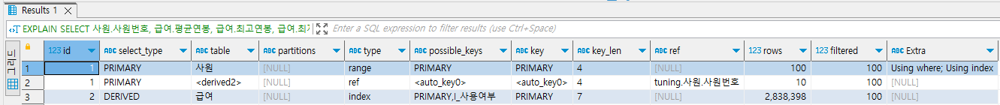

# 악성 SQL 튜닝으로 전문가 되기

더 복잡한 쿼리를 토대로 직접적인 인덱스 변경, 테이블 속성 및 구조 변경, SQL 문 자체 재작성으로 쿼리 튜닝을 수행한다.  

<br/>

## SQL 문 재작성으로 착한 쿼리 만들기

기존에 작성한 쿼리의 조인 방식, 서브쿼리 형태, 조인 조건절 등을 변경하여 SQL 문을 튜닝한다.  

### `처음부터 모든 데이터를 가져오는 나쁜 SQL 문`

 - 튜닝 전 SQL 문 (900 ~ 1000 ms)
    - ID가 1인 두개 행에 먼저 접근하며, 중첩 루프 조인을 하는 두 개 테이블은 사원 테이블과 derived2 테이블이다. 먼저 출력된 사원 테이블이 드라이빙 테이블이고, 나중에 출력된 derived2 테이블이 드리븐 테이블이다.
    - derived2 테이블은 ID가 2인 select_type 항목이 DERIVED로 작성된 세 번째 행의 인라인 뷰를 가리킨다. FROM 절에서 급여 테이블로 수행한 그루핑 결과를 새로 생성한 임시 테이블의 메모리나 디스크에 올려놓는다. 이후 WHERE 절의 사원.사원번호 = 급여.사원번호 구문으로 데이터를 추출하고 조인한다.
```SQL
-- 사원번호가 10,001 ~ 10,100인 사원들의 평균연봉과 최고연봉, 최저연봉을 조회
-- FROM 절의 급여 테이블에 사원별 평균/최고/최저 연봉을 조회하는 인라인 뷰가 있고,
-- 사원 테이블의 사원번호 컬럼과 내부 조인하여 최종 통계 결과를 출력한다.
SELECT 사원.사원번호, 
       급여.평균연봉, 
         급여.최고연봉, 
         급여.최저연봉
 FROM 사원,
       (SELECT 사원번호,
            ROUND(AVG(연봉),0) 평균연봉,
            ROUND(MAX(연봉),0) 최고연봉,
            ROUND(MIN(연봉),0) 최저연봉
        FROM 급여
        GROUP BY 사원번호
       ) 급여
WHERE 사원.사원번호 = 급여.사원번호
    AND 사원.사원번호 BETWEEN 10001 AND 10100;
```
<div align="center">
    
</div>

 - 튜닝 수행 (50 ~ 60 ms)
    - 사전 내용
        - type 항목의 index 유형은 인덱스 풀 스캔을 수행하는 방식으로, FROM 절의 급여 테이블을 그루핑하면서 수행된다.
        - 이때, 조건절 없이 그루핑을 수행하므로 지나치게 많은 데이터에 접근하지 않는지 고려해본다. rows 항목의 2,838,398 수치는 전체 데이터 건수와 유사한 값으로, 모든 데이터에 접근할 것이라고 예측할 수 있다. 그 외에도 BETWEEN 구문으로 데이터에 접근하여 type 항목의 range 유형을 통해 범위 검색을 수행할 것을 알 수 있다.
        - 사원 테이블의 전체 데이터는 약 30만 건이다. 하지만, BETWEEN 구문으로 추출하는 데이터는 10건뿐이다.
    - 튜닝 내용
        - 사원 테이블에서 WHERE 절의 BETWEEN 구문으로 100건의 데이터만 가져온다.
        - 때문에, 전체 사원 데이터가 아닌 필요한 사원정보에만 접근한 뒤, 급여 테이블에서 각 사원번호별 평균연봉, 최고연봉, 최저연봉을 구한다.
        - 급여 테이블에 3번이나 접근하여 비효율적인지 의문이 들지만, WHERE 절에서 추출하려는 사원 테이블의 데이터가 사원 테이블의 전체 데이터 대비 극히 소량(0.0003%)에 불과하므로, 인덱스를 활용해서 수행하는 3번의 스칼라 서브쿼리는 많은 리소스를 소모하지 않는다.
    - 튜닝 후 실행 계획
        - 사원 테이블의 사원번호 조건을 SELECT 절의 3개 스칼라 서브쿼리에서 매번 받으므로 select_type 항목은 DEPENDENT SUBQUERY로 출력된다. 이는 호출을 반복해 일으키므로 지나치게 자주 반복 호출될 경우에는 지양해야 할 유형이다.
        - 하지만, 100건의 데이터가 추출되는 사원 테이블 기준에서는 3개의 스칼라 서브쿼리를 갖는 급여 테이블에 100번만 접근하므로, 성능 측면에서 비효율적인 부분이 없다.

```SQL
SELECT COUNT(1) FROM 사원; -- 300,024
SELECT COUNT(1) FROM 사원 WHERE 사원번호 BETWEEN 10001 AND 10100; -- 100

-- 급여테이블에서 각 사원번호별 평균연봉, 최고연봉, 최저연봉을 구한다.
SELECT 사원.사원번호,
       ( SELECT ROUND(AVG(연봉),0)
           FROM 급여 as 급여1
          WHERE 사원번호 = 사원.사원번호
       ) AS 평균연봉,
       ( SELECT ROUND(MAX(연봉),0)
           FROM 급여 as 급여2
          WHERE 사원번호 = 사원.사원번호
       ) AS 최고연봉,
       ( SELECT ROUND(MIN(연봉),0)
           FROM 급여 as 급여3
          WHERE 사원번호 = 사원.사원번호
       ) AS 최저연봉
  FROM 사원
 WHERE 사원.사원번호 BETWEEN 10001 AND 10100;
```

<br/>

### `비효율적인 페이징을 수행하는 나쁜 SQL 문`

 - 튜닝 전 SQL 문 (180 ~ 220 ms)
    - 드라이빙 테이블인 사원 테이블과 드리븐 테이블인 급여 테이블을 조인한다.
    - 사원 테이블과 급여 테이블은 각각 기본키(key: PRIMARY)로 데이터에 접근한다.
    - 이때, 드라이빙 테이블인 사원 테이블은 그루핑과 정렬 연산을 위해 임시 테이블(Extra: Using temporary)을 생성한 뒤 정렬 작업(Extra: Using filesort)을 수행한다.
```SQL
-- 사원번호가 10,001 ~ 50,000 사이에 해당하는 데이터들을 
-- 사원번호 기준으로 그루핑한 뒤 연봉 합계 기준으로 내림차순
-- LIMIT 연산자로 150번째 데이터부터 10건의 데이터만 가져오도록 한다.
SELECT 사원.사원번호, 사원.이름, 사원.성, 사원.입사일자
  FROM 사원,
       급여       
 WHERE 사원.사원번호 = 급여.사원번호
   AND 사원.사원번호 BETWEEN 10001 AND 50000
 GROUP BY 사원.사원번호
 ORDER BY SUM(급여.연봉) DESC
 LIMIT 150,10;
```
<div align="center">
    
</div>

 - 튜닝 수행 (120 ~ 140 ms)
    - 사전 내용
        - LIMIT 연산으로 10건의 데이터를 가져오기 위해 수십만 건의 데이터 대상으로 조인을 수행한 뒤 그루핑과 정렬 작업을 수행한다. 이처럼 전체 데이터를 가져온 뒤 마지막으로 10건의 데이터만 조회하는 것이 효율적인지 고민해야 한다.
    - 튜닝 내용
        - 급여 테이블에서 GROUP BY 절을 통한 그루핑과 ORDER BY 절을 통한 정렬 작업을 FROM 절의 인라인 뷰로 대체한다.
        - 인라인 뷰에 필요한 데이터 건수만큼 LIMIT 절로 제약을 설정하여 사원 테이블과 조인할 수 있는 데이터 건수를 줄인다.
    - 튜닝 후 실행 계획
        - ID가 1인 derived2 테이블과 사원 테이블 대상으로 중첩 루프 조인을 수행한다.
        - 드라이빙 테이블인 derived2 테이블은 ID가 2에 해당되는 급여 테이블로, 드리븐 테이블은 사원 테이블이 된다.
        - derived2 테이블은 WHERE 절의 조건절에 따라 범위 스캔(type: range)을 수행하는 인라인 뷰로, 스토리지 엔진에서 가져온 데이터를 임시 테이블(extra: Using temporary)에 상주시켜 정렬(extra: Using filesort) 작업을 수행하게 된다.
        - 인라인 뷰인 급여 테이블 기준으로 사원 테이블에 반복해 접근하고 WHERE 절의 사원번호 조건절로 조인을 수행한다. 이때, 드라이빙 테이블은 테이블 풀 스캔(type: ALL)한다. 드리븐 테이블은 기본키를 활용하여 데이터를 추출(type: eq_ref)하며, 중첩 루프 조인에 따라 기본 키를 매번 가져오므로 rows 항목에는 1개 데이터만 접근한 것으로 출력된다.
```SQL
SELECT 사원.사원번호, 사원.이름, 사원.성, 사원.입사일자
  FROM (SELECT 사원번호
          FROM 급여
           WHERE 사원번호 BETWEEN 10001 AND 50000
           GROUP BY 사원번호
           ORDER BY SUM(급여.연봉) DESC
           LIMIT 150,10) 급여,
        사원
 WHERE 사원.사원번호 = 급여.사원번호;
```

<br/>

### `필요 이상으로 많은 정보를 가져오는 나쁜 SQL 문`

 - 튜닝 전 SQL 문 (130 ~ 140 ms)
    - 드라이빙 테이블은 사원 테이블이고, 드리븐 테이블은 부서관리자 테이블이다.
    - 사원 테이블은 I_성별_성 인덱스(key: I_성별_성)로 성별이 'M'인 상수 값(ref: const)으로 조회되었다.
    - 부서 관리자 테이블은 사원 테이블과 조인(type: ref)하여 사원번호 인덱스만을 이용하여 조회되었다. (ref: 사원.사원번호, Extra: Using index)
```SQL
-- 사원 테이블에서 성별이 M(남)이고, 사원번호가 300,000을 초과하는 사원 대상으로
-- 부서관리자 테이블과 외부 조인을 수행한 뒤, 해당하는 사원번호의 개수 출력
SELECT COUNT(사원번호) AS 카운트
  FROM (
         SELECT 사원.사원번호, 부서관리자.부서번호
           FROM ( SELECT *
                   FROM 사원
                  WHERE 성별= 'M'
                    AND 사원번호 > 300000
                ) 사원
           LEFT JOIN 부서관리자
                 ON 사원.사원번호 = 부서관리자.사원번호
       ) 서브쿼리;
```
<div align="center">
    
</div>

 - 튜닝 수행
    - 사전 내용
        - 최종 결과로 사원 테이블의 사원번호 데이터 건수를 집계한다.
        - 이때, 부서관리자 테이블과 외부 조인하는 조건이 꼭 필요한지 고민해야 한다.
    - 튜닝 내용
        - 최종적으로 필요한 사원번호의 건수를 구하는 과정에서 부서관리자 테이블이 필요하지 않다. 따라서 부서관리자 테이블과 관련된 부분을 제거한다.
    - 튜닝 후 실행 계획
        - 부서관리자 테이블 연산 작업이 제거되었다.
```SQL
SELECT COUNT(사원번호) as 카운트
  FROM 사원
 WHERE 성별 = 'M'
   AND 사원번호 > 300000;
```

<br/>

### `대량의 데이터를 가져와 조인하는 나쁜 SQL 문`

 - 튜닝 전 SQL 문 (390 ~ 420 ms)
    - 드라이빙 테이블은 부서사원_매핑 테이블이고, 드리븐 테이블은 부서관리자 테이블로 중첩 루프 조인을 수행한다.
    - 부서사원_매핑 테이블은 인덱스 풀 스캔(type: index, key: I_부서번호) 방식으로 데이터를 접근한다.
    - 부서관리자 테이블은 부서번호 조건절(type: ref, key: I_부서번호)로 데이터에 접근한다. 이때, 중복을 제거하는 DISTINCT 연산(Extra: Distinct)도 수행한다.
```SQL
-- 부서관리자 테이블과 부서사원_매핑 테이블을 부서번호 열로 조인하고
-- 중복을 제거한 부서번호를 출력한다.
-- 이떄, DISTINCT 연산으로 최종 부서번호 결과에서 중복을 제거하고
-- ORDER BY 절로 부서번호를 오름차순 정렬한다.
SELECT DISTINCT 매핑.부서번호
  FROM 부서관리자 관리자,
       부서사원_매핑 매핑
 WHERE 관리자.부서번호 = 매핑.부서번호
 ORDER BY 매핑.부서번호;
```
<div align="center">
    
</div>

 - 튜닝 수행 (60 ~ 70 ms)
    - 사전 내용
        - 최종 결과로 중복이 제거된 부서번호 열을 출력한다.
        - 이때, 조인을 수행하는 부서번호 컬럼이 부서관리자 테이블과 부서사원_매핑 테이블에 모두 존재한다. 떄문에, 두 테이블 모두 데이터에 접근한 뒤 부서번호가 같은지 일일이 확인하는 과정이 필요한지 고려해야 한다.
        - FROM 절과 WHERE 절로 조인을 수행한 뒤 그 조인 결과에서 DISTINCT 작업을 수행한다. 이렇게 수십만 개의 데이터를 조인하기 전에 미리 중복 제거를 할 수 없는지 고민해야 한다.
    - 튜닝 내용
        - FROM 절에서 부서사원_매핑 테이블의 데이터를 가져올 대 부서번호 데이터를 미리 중복 제거한다.
        - 간소화된 데이터에 대해 부서관리자 테이블은 같은 부서번호 데이터가 있는지 여부만 판단한다.
        - 즉, 굳이 부서관리자 테이블의 데이터를 모두 확인하지 않고 동일한 부서번호가 있다면 이후의 데이터에는 더 접근하지 않는 EXISTS 연산자를 활용한다.
     - 튜닝 후 실행 계획
        - 부서관리자 테이블과 derived2 테이블이 조인을 수행한다.
        - derived2 테이블은 id가 2인 행의 인라인 뷰로, FROM 절에 DISTINCT 작업까지 마친 매핑 테이블이다. DISTINCT 작업을 수행하고자 I_부서번호 인덱스로 정렬한 뒤에 중복을 제거하겠다는 의미로 Extra 항목에 Using index for group-by가 표시된다.
        - 드라이빙 테이블인 부서관리자 테이블은 전체 24개 데이터를 인덱스 풀 스캐느로 수행한 뒤에 드리븐 테이블인 중복 제거된 부서사원_매핑 테이블과 조인한다. 이떄, 부서관리자 테이블에 EXISTS 연산자로 비교할 부서번호가 있다면 이후로 동일한 부서번호 데이터는 확인하지 않고 건너뛰므로 Extra 항목에 LooseScan으로 표시된다.
```SQL
SELECT 매핑.부서번호
  FROM ( SELECT DISTINCT 부서번호 
           FROM 부서사원_매핑 매핑
       ) 매핑
 WHERE EXISTS (SELECT 1 
                 FROM 부서관리자 관리자
                WHERE 부서번호 = 매핑.부서번호)
 ORDER BY 매핑.부서번호;
```

<br/>

## 인덱스 조정으로 착한 쿼리 만들기

### `인덱스 없이 작은 규모의 데이터를 조회하는 나쁜 SQL 문`

 - 튜닝 전 SQL 문
    - 사원 테이블을 테이블 풀 스캔(type: ALL)한다.
    - 스토리지 엔진에서 가져온 전체 데이터 중에서 WHERE 조건절로 필요한 데이터를 추출(Extra: Using where)하여 출력한다.
```SQL
-- 이름이 Georgi이고 성이 Wielonsky인 사원 정보를 출력
SELECT *
  FROM 사원
 WHERE 이름 = 'Georgi'
   AND 성 = 'Wielonsky';
```
<div align="center">
    
</div>

 - 튜닝 수행
    - 사전 내용
        - 이름과 성 컬럼에 대한 갯수를 파악한다.
        - 데이터 범위를 더 축소할 수 있는 성 열을 선두 열로 삼아 인덱스를 생성한다.
    - 튜닝 내용
        - 성 + 이름으로 복합 인덱스를 생성한다.
    - 튜닝 후 수행 결과
        - I_사원_성_이름 인덱스(key: I_사원_성_이름)를 통해 인덱스 스캔을 수행한다.
        - 스토리지 엔진에서 성과 이름 컬럼에 조건절을 써서 데이터에 접근하므로 1건의 데이터만 최종 반환된다.
```SQL
-- 이름, 성 컬럼을 대상으로 인덱스를 생성하기 전 더 많은 값이 있는 컬럼 파악
-- 이름: 1275, 성: 1637, 전체: 300024
SELECT COUNT(DISTINCT(이름)) 이름_개수, COUNT(DISTINCT(성  )) 성_개수, COUNT(1) 전체
FROM 사원;

-- 복합 인덱스 생성 (성 + 이름)
ALTER TABLE 사원 ADD INDEX I_사원_성_이름 (성,이름);
show index from 사원;

-- 쿼리 수행
SELECT *
  FROM 사원
 WHERE 이름 = 'Georgi'
   AND 성 = 'Wielonsky';

-- 다른 예제를 위한 인덱스 제거
alter table 사원 drop index I_사원_성_이름;
```

<br/>

### `인덱스를 하나만 사용하는 나쁜 SQL 문`

 - 튜닝 전 SQL 문 (130 ~ 140 ms)
    - 사원 테이블을 테이블 풀 스캔(type: ALL)한다.
    - 스토리지 엔진으로 모든 데이터를 가져온 뒤 MySQL 엔진에서 2개의 조건절을 활용하여 데이터를 필터링한다.
```SQL
-- 이름이 Matt 이거나 입사일자가 1987년 3월 31일인 사원 정보 조회
SELECT *
  FROM 사원
 WHERE 이름 = 'Matt'
    OR 입사일자 = '1987-03-31';
```
<div align="center">
    
</div>

 - 튜닝 수행
    - 사전 내용
        - 이름이 'Matt'인 사람은 233건, 입사일자가 '1987-03-31'인 사람은 111건으로 전체 데이터(30만)에 비해서 매우 적다. 이러한 경우 인덱스 스캔이 효율적이다.
        - 입사일자에 대한 인데스가 존재하지만, 이름에 대한 인덱스가 존재하지 않아서 결국에 테이블 풀 스캔이 발생하였다.
    - 튜닝 내용
        - 이름에 대한 인덱스를 생성한다.
    - 튜닝 후 실행 계획
        - 2개의 조건절 열이 각각 인덱스 스캔으로 수행되고 각 결과는 병합(type: index_merge, Extra: Using union(I_이름, I_입사일자)) 된다.
        - 만약, WHERE 절 ~ OR 구문에서 한쪽의 조건절이 동등 조건이 아닌 범위 조건이라면 버전에 따라 내부 메커니즘에 차이로 index_merge로 처리되지 않을 수 있다. 이러한 경우 실행 계획을 확인하여 UNION이나 UNION ALL 구문 등으로 분리하는 것을 고려할 수 있다.
```SQL
-- 데이터 건수 확인
select count(1) from 사원; -- 300,024
select count(1) from 사원 where 이름='Matt'; -- 233
select count(1) from 사원 where 입사일자='1987-03-31'; -- 111
show index from 사원;

-- 인덱스 생성
ALTER TABLE 사원 ADD INDEX I_이름(이름);

-- 인덱스 삭제
ALTER TABLE 사원 DROP INDEX I_이름;
```

<br/>

### `큰 규모의 데이터 변경으로 인덱스에 영향을 주는 나쁜 SQL 문`

Command 명령어에 대한 테스트로 오토커밋을 해제하고 진행한다.  
'select @@autocommit;' 명령어를 사용하면 autocommit 이라는 세션 기준의 시스템 변수를 확인할 수 있다.  
autocommit이 1이면 자동 커밋이고, 0이면 자동 커밋이 아니다.  
'set autocommit=0;' 명령문을 통해 자동 커밋되지 않도록 임의 설정할 수 있다.  

 - 튜닝 전 SQL 문 (7000 ~ 8000 ms)
    - 기본키(key: PRIMARY)로 사원출입기록 테이블에 접근한 뒤 출입문 = 'B' 조건절에 해당하는 데이터만 'X'라는 출입문 변경(select_type: update)한다.
```SQL
-- 오토커밋 확인
SELECT @@autocommit;
set autocommit=0;

-- 사원출입기록 테이블의 출입문 열에 'B'로 저장된 데이터를 'X'로 변경
UPDATE 사원출입기록
SET 출입문 = 'X'
WHERE 출입문 = 'B';

-- 원복
ROLLBACK;
```
<div align="center">
    
</div>

 - 튜닝 수행 (1200 ~ 1400 ms)
    - 사전 내용
        - 조회한 데이터를 변경하는 범위에 테이블뿐만 아니라 인덱스가 포함된다.
        - 즉, 인덱스가 많은 테이블의 데이터를 변경할 때는 성능적으로 불리하다.
        - 사원출입기록 테이블같은 이력용 테이블에서는 보통 지속적인 데이터 저장만 이루어진다. 때문에, I_출입문 인덱스의 활용도가 없다면 삭제하여 튜닝할 것을 고려할 수 있다.
        - 또, 업데이트 작업이 새벽 또는 서비스에 미치는 영향이 적은 시간대에 수행되는 배치성 작업이라면, 인덱스를 일시적으로 삭제한 뒤 대량 업데이트 작업을 수행하고 다시 생성하는 방식으로 SQL 문 효율을 높일 수 있다.
    - 튜닝 내용
        - 인덱스 삭제
    - 튜닝 후 실행 계획
        - 
```SQL
-- 인덱스 확인
show index from 사원출입기록;

-- 인덱스 삭제
ALTER TABLE 사원출입기록 DROP INDEX I_출입문;

-- 인덱스 생성
ALTER TABLE 사원출입기록 ADD INDEX I_출입문(출입문);
```

<br/>

### `비효율적인 인덱스를 사용하는 나쁜 SQL 문`

 - 튜닝 전 SQL 문
    - I_성별_성 인덱스를 활용(key: I_성별_성)하여 테이블에 접근한다.
    - 성별과 성 열에 고정된 값으로 조건절(ref: const, const)을 작성하여, 스토리지 엔진에서 인덱스 스캔으로 원하는 데이터를 가져온다.
```SQL
-- 성별이 M(남성)이고 성이 Baba인 사원 조회
SELECT 사원번호, 이름, 성
  FROM 사원
 WHERE 성별 = 'M'
   AND 성 = 'Baba';
```
<div align="center">
    
</div>

 - 튜닝 수행
    - 사전 내용
        - '성별 + 성' 순으로 구성한 I_성별_성 인덱스를 사용하여 데이터를 가져온다.
        - 하지만, 성별 컬럼보다는 성 컬럼이 더 다양한 종류의 값(1,638개)을 가진다.
        - 때문에, 성 열을 먼저 활용하면 데이터 접근 범위를 상당히 줄일 수 있다.
    - 튜닝 내용
        - '성별 + 성' 순서로 구성된 인덱스를 '성 + 성별' 순서의 인덱스로 변경한다.
```SQL
-- 데이터 확인
-- 성: 1637, 성별: 2
SELECT COUNT(DISTINCT 성) 성_개수, COUNT(DISTINCT 성별) 성별_개수  
FROM 사원 ;

-- 인덱스 삭제 및 생성
ALTER TABLE 사원
DROP INDEX I_성별_성,
ADD INDEX I_성_성별(성, 성별);

-- 원복
ALTER TABLE 사원
DROP INDEX I_성_성별,
ADD INDEX I_성별_성(성별, 성);
```

<br/>

## 적절한 테이블 및 열 속성 설정으로 착한 쿼리 만들기

### `잘못된 열 속성으로 비효율적으로 작성한 나쁜 SQL 문`

 - 튜닝 전 SQL 문
```SQL
-- 부서 테이블의 비고 열 값이 'active'일 때의 데이터를 조회
SELECT 부서명, 비고
  FROM 부서
 WHERE 비고 = 'active'
   AND ASCII(SUBSTR(비고,1,1)) = 97
   AND ASCII(SUBSTR(비고,2,1)) = 99;
```

 - 튜닝 수행
    - 사전 내용
        - 콜레이션이 utf8_general_ci이면 대소문자 구분이 없다.
        - 소문자 여부를 판단하기 위해 굳이 아스키 코드를 추출하는 함수를 사용할 필요가 있는지 고려해야 한다. 콜레이션을 변경하면 대소문자가 구분이 된다.
    - 튜닝 내용
        - 컬럼의 콜레이션을 'UTF8MB4_bin'으로 변경한다.
        - 소문자 비교를 위한 ASCII 함수를 제거한다.
```SQL
-- 콜레이션 조회
-- utf8_general_ci
SELECT COLUMN_NAME, collation_name
FROM information_schema.COLUMNS
WHERE table_schema = 'tuning'
AND TABLE_NAME = '부서';

-- 콜레이션 변경
-- UTF8MB4_bin: 대소문자 구분, 이모지 지원
ALTER TABLE 부서
CHANGE COLUMN 비고 비고 VARCHAR(40) NULL DEFAULT NULL COLLATE 'UTF8MB4_bin';

-- 튜닝 쿼리
SELECT 부서명, 비고
FROM 부서
WHERE 비고 = 'active';

-- 콜레이션 원복
ALTER TABLE 부서
CHANGE COLUMN 비고 비고 VARCHAR(40) NULL DEFAULT NULL COLLATE 'utf8_general_ci';
```

<br/>

### `대소문자가 섞인 데이터와 비교하는 나쁜 SQL 문`

 - 튜닝 전 SQL 문
    - WHERE 절 조건문에 이름과 입사일자 컬럼이 명시되어 있지만 테이블 풀 스캔(type: ALL)이 일어난다.
    - 입사일자가 1990년도 이상인 레코드가 많아서 해당 인덱스를 사용하지 않는다.
    - 이름 컬럼은 LOWER() 함수로 가공하여 인덱스를 사용하지 않는다.
```SQL
-- 사원 테이블에서 입사일자가 1990년 이후이고 이름이 MARY인 사원정보 조회
SELECT 이름, 성, 성별, 생년월일
FROM 사원
WHERE LOWER(이름) = LOWER('MARY')
    AND 입사일자 >= STR_TO_DATE('1990-01-01', '%Y-%m-%d');
```
<div align="center">
    
</div>

 - 튜닝 수행
    - 사전 내용
        - 이름 항목에 mary, Mary, marY, maRy, MARY 등이 입력되더라도 대소문자의 구분 없이 Mary라는 결과를 출력하게 만들어야 한다.
        - 시스템 테이블인 information_schema.columns에서 사원 테이블의 콜레이션을 확인하면 user8_bin으로 데이터 정렬과 비교시 대소문자를 구분한다.
        - 그렇다면, 이름 컬럼에 대해 대소문자 구분없이 비교 처리를 수행하는 별도의 컬럼이 있다면? 즉, 대소문자를 구문하지 않는 utf8_general_ci로 이름 컬럼을 한 번더 받는 것을 고려해볼 수 있다.
    - 튜닝 내용
        - 대소문자를 구분하지 않는 콜레이션으로 이름을 받는 새로운 컬럼을 만든다.
        - WHERE 조건에 LOWER() 함수를 제거하고, 소문자_이름 컬럼으로 조회한다.
    - 튜닝 후 실행 계획
        - 카디널리티가 높은 소문자_이름 열로 인덱스(key: I_소문자이름)을 활용하여 데이터를 조회한다.
```SQL
-- 컬럼 생성 및 소문자 이름 업데이트
ALTER TABLE 사원 ADD COLUMN 소문자_이름 VARCHAR(14) NOT NULL AFTER 이름;
UPDATE 사원 SET 소문자_이름 = LOWER(이름);

-- 소문자 이름 인덱스 생성
ALTER TABLE 사원 ADD INDEX I_소문자이름(소문자_이름);

-- 쿼리 변경
SELECT 이름, 성, 성별, 생년월일
FROM 사원
WHERE 소문자_이름= 'MARY'
    AND 입사일자 >= '1990-01-01';

-- 원복
ALTER TABLE 사원 DROP COLUMN 소문자_이름;
```

<br/>

### `분산 없이 큰 규모의 데이터를 사용하는 나쁜 SQL 문`

 - 튜닝 전 SQL 문
    - I_사용여부 인덱스(key: I_사용여부)를 활용해서 커버링 인덱스를 수행한다.
```SQL
-- 급여 테이블에서 시작일자가 2000년도에 해당하는 데이터 집계 쿼리
SELECT COUNT(1)
  FROM 급여
  WHERE 시작일자 BETWEEN STR_TO_DATE('2000-01-01', '%Y-%m-%d')
                     AND STR_TO_DATE('2000-12-31', '%Y-%m-%d');
```
<div align="center">
    
</div>

 - 튜닝 수행
    - 사전 내용
        - 급여 테이블에 대해서 연도별 데이터 건수를 확인하여 분포도를 확인한다. (데이터 편차가 조금 있으나 골고루 퍼져있다.)
        - 특정 월 또는 연 대상으로 서비스가 호출되는 경우 모든 연도의 데이터에 접근할 필요가 없다.
        - 하나의 테이블로 구성된 급여 테이블을 시작일자라는 열로 논리적으로 분할하는 파티셔닝을 할 수 있다.
    - 튜닝 내용
        - 시작일자 컬럼을 기준으로 연도별 파티셔닝 생성
    - 튜닝 후 실행 계획
        - 범위 파티션을 설정하여 시작일자 데이터가 2000년도인 파티션에만 접근하여 SQL 문 효율을 올릴 수 있다.
        - 2000년도 데이터만 있는 p00 파티션에 접근한 뒤, 2000-12-31 시작일자의 다음 데이터도 2000년인지 확인하는 작업이 수행되므로 2001년 데이터까지 접근한다. 따라서 partitions 항목에 p00, p01이 출력된다.
```SQL
-- 데이터 편차 조회
SELECT YEAR(시작일자), COUNT(1)
FROM 급여
GROUP BY YEAR(시작일자);

-- 연도별 파티셔닝 생성
ALTER TABLE 급여
partition by range COLUMNS (시작일자)
(
    partition p85 values less than ('1985-12-31'),
    partition p86 values less than ('1986-12-31'),
    partition p87 values less than ('1987-12-31'),
    partition p88 values less than ('1988-12-31'),
    partition p89 values less than ('1989-12-31'),
    partition p90 values less than ('1990-12-31'),
    partition p91 values less than ('1991-12-31'),
    partition p92 values less than ('1992-12-31'),
    partition p93 values less than ('1993-12-31'),
    partition p94 values less than ('1994-12-31'),
    partition p95 values less than ('1995-12-31'),
    partition p96 values less than ('1996-12-31'),
    partition p97 values less than ('1997-12-31'),
    partition p98 values less than ('1998-12-31'),
    partition p99 values less than ('1999-12-31'),
    partition p00 values less than ('2000-12-31'),
    partition p01 values less than ('2001-12-31'),
    partition p02 values less than ('2002-12-31'),
    partition p03 values less than (MAXVALUE)
);

-- 원복(파티셔닝 제거)
ALTER TABLE 급여 REMOVE PARTITIONING;
```