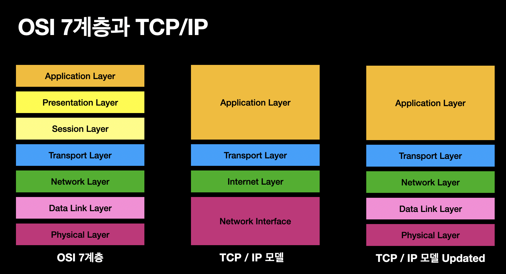

# 01장. 네트워크 기초

## 네트워크란

### 네트워크의 역사

1960년대 초기에는 한 대의 대형 컴퓨터(메인프레임)의 처리를 짧은 시간으로 나누어 여러 사람이 사용하는 TTS(Time Sharing System, 시분할 시스템) 방식으로 컴퓨터를 이용하였다. 원격지에 있는 사용자는 TTS 단말에서 대형 컴퓨터에 전화를 걸어 접속한 뒤, 마치 이를 전용 컴퓨터처럼 취급할 수 있었다.  

1960년대 후반부터 1970년대에는 대형 컴퓨터뿐만 아니라 개인용 컴퓨터와 같은 소형 컴퓨터가 등장하여 많은 컴퓨터를 병렬로 연결한 현재의 네트워크의 원형이 만들어지기 시작하였다. ARPANET은 미국 방위 고등 연구 계획국이 학술 목적으로 만든 네트워크로, 데이터를 패킷(Packet)이라 부르는 작은 단위로 잘라서 취급하는 패킷 교환 방식이라는 전송 방식을 처음으로 채용하였다.  
 - TTS 방식은 CPU를 병렬로 처리하지 않고, 요청이 오면 CPU의 처리 시간을 짧게 나누어 각 단말에 할당하여 처리한다.

<br/>

### 회선 교환 방식과 패킷 교환 방식

회선 교환 방식은 데이터를 교환하기 전에 일대일의 전송로(데이터 통로)를 만들고, 교환을 마칠때까지 전송을 계속 사용하는 방식이다. 회선 교환 방식은 회선을 점유하기 때문에 안정적인 통신 품질을 유지할 수 있지만, 데이터가 흐르지 않을 대도 회선이 연결되어 있기 때문에 회선 이용 효율이 낮아 데이터 교환에 적합한 통신 방식이라고 할 수 없다.  

회선 이용 효율 향상 목적으로 새롭게 고안된 것이 바로 패킷 교환 방식이다. 패킷 교환 방식은 데이터를 패킷이라 부르는 작은 단위로 나누어 네트워크로 보내는 방식이다. 송신 측 컴퓨터는 데이터에 헤더(header)라는 정보를 붙여 패킷 교환기로 구성된 패킷 교환 네트워크로 패킷을 보낸다. 헤더에는 수신 컴퓨터 정보, 데이터 중 몇 번째에 해당하는 패킷인지에 관한 정보 등 다양한 정보가 포함되어 있다.  

패킷 교환 네트워크는 헤더 정보를 보고 수신 컴퓨터로 패킷을 전달하며, 수신 컴퓨터의 헤더의 정보를 보고 원 데이터로 복원한다.  

<br/>

## 통신을 위한 규칙, 프로토콜

네트워크 세계에서는 패킷을 처리하기 위한 규칙이 존재하는데, 이 규칙을 프로토콜이라 부른다. 프로토콜은 통신에 필요한 기능별로 명확하게 규정되어 있기 때문에 PC 제조사나 운영체제(OS), 유무선에 관계없이 동일하게 패킷을 교환할 수 있다.  

<br/>

### 프로토콜에 결정되어 있는 것

 - `물리적 사양`
    - LAN 케이블 소재나 커넥터 형태, 핀 할당에 이르기까지 네트워크에서 눈에 보이는 것들은 모두 프로토콜에 정의되어 있다. 또, 와이파이 환경에서의 전파의 주파수, 패킷을 전파로 변환(변조)하는 방식도 프로토콜에 정의되어 있다.  
    - PC의 NIC(NetworkInterface Card)는 프로토콜에 정의된 내용에 기반해 케이블이나 전파 등의 전송 매체에 패킷을 보낸다.
 - `송신 상대 특정`
    - 네트워크 세계에서도 현실 세계와 같이 주소를 할당해서 송신 상대를 구별한다. (IP 주소)
 - `패킷 전송`
    - 헤더: 생존기간, 패킷식별자, 수신지IP주소, 송신지IP주소 등을 포함
    - 송신 상대를 특정한 뒤에는 패킷을 상대에게 전달해야 한다. 컴퓨터는 데이터를 패킷으로 작게 나누어 네트워크로 보내는데, 이때 헤더를 포함하여 보낸다. 헤더에는 송신지, 수신지뿐만 아니라 원래 데이터로 복원하기 위한 순번이나 서버(서비스) 정보 등 전송에 필요한 제어 정보가 포함되어 있다.  
    - 프로토콜에는 헤더의 어디에서 어디까지 어떤 정보를 포함하고 어떤 순서로 교환하는지 등이 정의되어 있다. 패킷 교환 네트워크를 구성하는 패킷 교환기는 헤더의 정보를 기반으로 릴레이처럼 패킷을 전송한다.  
 - `신뢰성 확립`
    - 패킷은 네트워크를 따라 산, 계곡, 바다 등을 건너 전 세계로 전파된다. 때문에, 언제, 어디에서, 어떤 상황에서 패킷이 손상되거나 사라지는지 알 수 없다. 프로토콜은 그런 상황이 발생해도 이상이 없도록 에러를 알리거나 데이터를 재전송하는 구조를 제공하며, 유한한 네트워크 자원이 패킷으로 가득차서 잠기지 않도록 하기 위한 구조를 제공한다.
 - `보안 확보`
    - 프로토콜은 중요한 정보를 안심하고 교환할 수 있도록 올바른 통신 상대인지 인증하고 통신을 암호화하는 구조를 제공한다.  

<br/>

### 프로토콜은 계층으로 정리한다.

프로토콜로 정의된 다양한 통신 기능은 그 처리에 맞춰 계층 구조로 되어 있다. 데이터 송신자가 되는 컴퓨터는 계층별로 준비된 프로토콜에 걸쳐 상위 계층부터 순서대로 데이터를 처리해 패킷 상태로 전송 매체로 보낸다. 반대로 그 패킷을 받은 컴퓨터는 하위 계층에서 순서대로 계층별로 송신지 컴퓨터와 동일한 프로토콜을 따라 데이터를 처리하고, 최종적으로 원 데이터로 복원한다.  

<br/>

### 두 가지 계층 구조 모델

계층 모델은 크게 TCP/IP 참조 모델과 OSI 참조 모델이 존재한다. 이 두 계층 구조 모델은 만들어진 곳이 다를 뿐, 통신에 필요한 기능을 계층적(레이어)으로 정리한 점에서는 동일하다.  

 - `TCP/IP 참조 모델`
    - 1970년대 미국 방위 고등 연구 계획국(DARPA)이 개발한 계층 모델
    - 링크 계층, 인터넷 계층, 트랜스포트 계층, 애플리케이션 계층으로 총 4개의 계층으로 구성된다.
    - 각 계층의 역할이 명확하게 구분되어 있으며, 자신의 처리가 완료되면 다음 계층으로 데이터를 전달한 뒤, 다음 처리에는 관여하지 않는다. (특정 계층이 다른 프로토콜로 대체되더라도 동일하게 통신이 가능하며, 계층별 문제 해결이 용이)
    - 링크 계층
        - 디지털 데이터를 물리적인 전송 매체로 보내는 변환/변조 및 그 신뢰성을 확보하는 처리 수행
        - 같은 네트워크에 있는 단말과의 연결성 확보
        - 예시) IEEE 802.3, IEEE 802.11 등
    - 인터넷 계층
        - 수신지가 되는 컴퓨터까지의 통신 경로를 확보하는 처리 수행
        - 다른 네트워크에 잇는 단말과의 연결성 확보
        - 예시) IP, ICMP 등
    - 트랜스포트 계층
        - 애플리케이션을 식별하고, 그에 따라 통신을 제어
        - 예시) TCP, UDP 등
    - 애플리케이션 계층
        - 사용자에게 애플리케이션 제공
        - 예시) HTTP, DNS, FTP, SSL/TLS, Syslog, SNMP, NTP 등
 - `OSI 참조 모델`
    - 국제 표준화 기구(ISO)가 1984년에 책정한 계층 구조 모델
    - 물리 계층, 데이터 링크 계층, 네트워크 계층, 트랜스포트 계층, 세션 계층, 프레젠테이션 계층, 애플리케이션 계층으로 총 7개 계층으로 구성된다.
    - 물리 계층
        - 디지털 데이터를 물리적 전송 매체로 보내기 위한 변환/변조 처리
        - 디지털 데이터를 전기 신호나 광 신호, 전파로 변환해 네트워크로 보낸다.
    - 데이터 링크 계층
        - 물리 계층의 신뢰성을 확보하는 처리 수행
        - 물리 계층의 신뢰성을 확보하고, 같은 네트워크에 있는 단말과의 연결성을 확보한다.
    - 네트워크 계층
        - 수신지가 되는 컴퓨터까지의 통신 경로를 확보하는 처리 수행
        - 다른 네트워크에 있는 단말과의 연결성을 확보한다.
    - 트랜스포트 계층
        - 애플리케이션 식별 및 그에 맞는 통신 제어
    - 세션 계층
        - 로그인 및 로그아웃 등 애플리케이션 레벨의 통신을 관리
    - 프레젠테이션 계층
        - 애플리케이션 계층에서 알 수 있도록 데이터를 변환
    - 애플리케이션 계층
        - 애플리케이션의 기능을 제공

<div align="center">
    
</div>

<br/>

### 표준화 단체가 프로토콜을 결정한다

네트워크에는 많은 프로토콜이 존재하며, 대부분 IEEE, IETF라는 두 단체가 표준화하고 있다.  
IEEE는 비교적 하드웨어 처리에 가까운 프로토콜, IETF는 비교적 소프트웨어 처리에 가까운 프로토콜을 표준화하고 있다.  

 - `IEEE`
    - 전기 기술 또는 통신 공학 등의 분야를 전문으로 연구하는 전기 전자 기술학회
    - 네트워크 인터페이스나 케이블 등 비교적 하드웨어와 관련한 네트워크 기술의 표준화를 연구하고 논의
 - `IETF`
    - 인터넷 관련된 기술의 표준화를 추진하는 임의의 조직
    - HTTP나 SSL/TLS 등 OS나 애플리케이션에서 처리되는 비교적 소프트웨어에 가까운 프로토콜 표준화를 연구하고 논의
    - IETF에서 표준화된 규칙은 RFC(Request For Comments)라는 형태로 문서화되어 인터넷에 공개된다.

<br/>

### 각 계층이 연계하여 동작하는 구조

 - `캡슐화와 비캡슐화`
    - 송신 단말은 애플리케이션 계층에서 순서대로 각 계층에서 페이로드에 헤더를 붙여 PDU로 만들어 한 단계 아래 계층으로 전달한다.
        - 이떄, 헤더를 추가하는 처리를 캡슐화라고 한다.
        - 애플리케이션 계층은 애플리케이션에서 입력된 데이터를 L7 페이로드로 인식하고, L7 헤더를 추가해 메시지로 만들어 트랜스포트 계층으로 전달한다.
        - 트랜스포트 계층은 전달받은 메시지를 L4 페이로드로 인식하고, L4 헤더를 붙여 세그먼트/데이터그램으로 만들어 네트워크 계층으로 전달한다.
        - 네트워크 계층은 전달받은 세그먼트/데이터그램을 L3 페이로드로 인식하고, L3 헤더를 붙여 패킷으로 만들어 데이터링크 계층으로 전달한다.
        - 데이터링크 계층은 전달받은 패킷을 L2 페이로드로 인식하고, L2 헤더/트레일러를 붙여 프레임으로 만들어 물리 계층으로 전달한다.
        - 물리 계층은 프레임을 비트로 인식하고, 전송 매체(케이블, 전파 등)로 보낸다.
    - 수신 단말은 물리 계층에서 순서대로, 각 계층에서 PDU로부터 헤더를 제거하고 페이로드만을 한 단계 위 계층으로 전달한다.
        - 물리 계층은 전송매체로부터 전달받은 비트를 데이터링크 계층으로 전달한다.
        - 데이터링크 계층은 전달받은 비트를 프레임으로 인식하고, L2 헤더/트레일러를 제거한 뒤 L2 페이로드만을 네트워크 계층으로 전달한다.
        - 네트워크 계층은 전달받은 L2 페이로드를 패킷으로 인식하고, L3 헤더를 제거한 뒤 L3 페이로드만을 트랜스포트 계층으로 전달한다.
        - 트랜스포트 계층은 전달받은 L3 페이로드를 세그먼트/데이터그램으로 인식하고, L4 헤더를 제거한 뒤 L4 페이로드만을 애플리케이션 계층으로 전달한다.
        - 애플리케이션 계층은 전달받은 L4 페이로드를 메시지로 인식한다.
```
★ 송신 단말 (각 계층의 PDU가 아래 계층의 페이로드가 된다.)
 - 애플리케이션 계층
    - L7 페이로드: 애플리케이션 데이터
    - 메시지: 애플리케이션 데이터, L7 헤더
 - 트랜스포트 계층
    - L4 페이로드: 애플리케이션 데이터, L7 헤더
    - 세그먼트/데이터그램: 애플리케이션 데이터, L7 헤더, L4 헤더
 - 네트워크 계층
    - L3 페이로드: 애플리케이션 데이터, L7 헤더, L4 헤더
    - 패킷: 애플리케이션 데이터, L7 헤더, L4 헤더, L3 헤더
 - 데이터링크 계층
    - L2 페이로드: 애플리케이션 데이터, L7 헤더, L4 헤더, L3 헤더
    - 프레임: 애플리케이션 데이터, L7 헤더, L4 헤더, L3 헤더, L2 헤더
 - 물리 계층
    - 변환(부호화): 디지털 데이터를 전기 신호나 광 신호, 전파로 변환해 네트워크로 보낸다.

★ 수신 단말 (각 계층의 페이로드가 위 계층의 PDU가 된다.)
 - 물리 계층
    - 변환(복호화)
 - 데이터링크 계층
    - 프레임: L2 헤더, L3 헤더, L4 헤더, L7 헤더, 애플리케이션 데이터, L2 트레일러
    - L2 페이로드: L3 헤더, L4 헤더, L7 헤더, 애플리케이션 데이터
 - 네트워크 계층
    - 패킷: L3 헤더, L4 헤더, L7 헤더, 애플리케이션 데이터
    - L3 페이로드: L4 헤더, L7 헤더, 애플리케이션 데이터
 - 트랜스포트 계층
    - 세그먼트/데이터그램: L4 헤더, L7 헤더, 애플리케이션 데이터
    - L4 페이로드: L7 헤더, 애플리케이션 데이터
 - 애플리케이션 계층
    - 메시지: L7 헤더, 애플리케이션 데이터
    - L7 페이로드: 애플리케이션 데이터
```

<br/>

 - `커넥션 타입과 커넥션리스 타입`
    - 각 계층의 프로토콜은 커넥션 타입(연결형) 또는 커넥션리스 타입(비연결형)이라는 두 종류의 데이터 전송 서비스를 상위 계층에 제공한다.
    - 커넥션 타입은 데이터 송신전 통신 상대에 대해 커넥션을 확립하고, 데이터를 교환한 뒤 종료한다. 커넥션 타입은 확실하게 정해진 순서를 따르므로 전송에는 다소 시간이 걸리지만 데이터를 확실하게 전송할 수 있다.
    - 커넥션리스  타입은 곧바로 데이터를 보내면서 커넥션을 확립한 뒤 마음대로 종료한다. 때문에, 송신한 데이터가 반드시 상대에게 도착한다고 단정할 수 없으나, 전송 시간을 줄일 수 있다.

<br/>

 - `대표 프로토콜`
    - 네트워크에는 많은 프로토콜이 존재하지만, 실제 인터넷 환경에서 이용되는 프로토콜은 극히 드물다.
    - 물리 계층과 데이터링크 계층은 프로토콜로서는 합쳐져 있으며 유선 환경은 이더넷(IEEE802.3), 무선 환경은 IEEE802.11를 이용한다.
    - 네트워크 계층은 IP 프로토콜을 이용한다.
    - 트랜스포트 계층은 TCP 또는 UDP 중 하나를 사용하며, 통신에 신뢰성이 요구될 때는 TCP, 실시간성이 요구될 때는 UDP를 이용한다.
    - 애플리케이션 계층은 HTTP, HTTPS, QUIC, DNS 4가지를 많이 사용한다.
    - 실제 통신할 떄는 NIC 장치 드라이버나 운영체제, 애플리케이션이 각 계층에서 이용하는 프로토콜을 선택하며, 송신 단말은 캡슐화, 수신 단말은 비캡슐화해서 통신한다. 이 처리가 모두 자동으로 이루어지기 떄문에, 사용자가 의식하는 일은 없다.

<br/>

## 네트워크 구성 기기

 - 물리 계층: NIC, 리피터, 리피터 허브, 미디어 컨버터
 - 데이터링크 계층: 브리지, L2 스위치
 - 네트워크 계층: 라우터, L3 스위치
 - 트랜스포트 계층: 방화벽
 - 애플리케이션 계층: 차세대 방화벽, WAF, 부하 분산 장치

<br/>

### 물리 계층에서 동작하는 기기

물리 계층은 케이블이나 커넥터 형태, 핀 할당 등 물리적인 사양에 관해 모두 정의되어 잇는 계층이다.  
물리 계층에서 동작하는 기기는 패킷을 광 신호/전기 신호로 변환하거나, 전파로 변조하는 기능을 갖고 있다.  

 - `NIC(Network Interface Card)`
    - PC나 서버 등 컴퓨터를 네트워크에 연결하기 위해 필요한 하드웨어 부품
    - 기존에 확장 슬롯에 연결하는 카드 타입 제품이 많아 '카드'라는 명칭이 있지만, 최근에는 USB 포트와 연결하는 USB 타입, 마더 보드에 내장되어 있는 온보드 타입 등을 포함해 네트워크에 연결하기 위한 하드웨어를 통틀어 NIC라고 부른다. 사람에 따라 '네트워크 인터페이스', '네트워크 어댑터' 라고 부르기도 한다.
    - __모든 네트워크 단말은 애플리케이션과 운영체제가 처리한 패킷을 NIC를 이용해 LAN 케이블이나 전파로 보낸다.__
 - `리피터(Repeater)`
    - 리피터는 파형을 한 번 더 증폭해서 정돈한 뒤 다른쪽으로 전송한다.
    - LAN 케이블에 흐르는 전기 신호는 전송 거리가 길수록 감쇠하며, 100m 정도에서 파형이 깨진다. 리피터를 이용함으로써 전송 거리를 늘려 패킷을 더 멀리까지 도달하게 한다.
    - 최근에는 전송 거리가 매우 긴 광 신호를 전송하는 광섬유 케이블이 보급됨에 따라 자주 사용되지 않는다.
 - `리피터 허브(Repeater Hub)`
    - 전달받은 패킷의 복사본을 그대로 다른 모든 포트에 전송하는 기기
    - 최근에는 L2 스위치로 대체되어 이제는 보기 힘들다.
 - `미디어 컨버터(Media Converter)`
    - 전기 신호와 광 신호를 서로 교환하는 기기
    - 광섬유 케이블을 연결하지 못하는 기기만 있는 상황에서 네트워크를 연결하고자 할 때 사용된다.
    - 전송 흐름: 네트워크 기기 > LAN 케이블 (100m) > 미디어 컨버터(전기 신호를 광신호로 컨버터) > 광 케이블 > 미디어 컨버터(광 신호를 전기 신호로 컨버터) > LAN 케이블 (100m) > 네트워크 기기
 - `액세스 포인트(Access Point)`
    - 패킷을 전파로 변조/복조하는 기기 (무선과 유선 사이의 다리 역할)
    - 와이파이가 있는 곳에는 반드시 액세스 포인트가 있다. 와이파이에 접속해 있을 때는 액세스 포인트를 우선 경유해서 유선 네트워크로 들어간다. 접하기 쉬운 액세스 포인트로는 가정용 와이파이 라우터가 있다. 와이파이 라우터는 액세스 포인트 기능을 이용해서 집 안에 전파를 송출한다.

<br/>

### 데이터링크 계층에서 동작하는 기기

데이터링크 계층은 물리 계층의 신뢰성을 확보하고, 같은 네트워크에 있는 단말과 연결할 수 있도록 하는 계층이다.  
데이터링크 계층에서 동작하는 기기는 프레임 헤더에 포함된 MAC 주소의 정보에 기반해 프레임을 전송한다.  
MAC 주소는 데이터링크 계층에서의 주소(식별자)이다.  

 - `브리지(Bridge)`
    - 포트와 포트 사이의 다리 역할을 담당한다.
    - 단말에서 받아들인 MAC 주소를 MAC 주소 테이블로 관리하고, 전송 처리한다.
    - 전송 흐름
        - L2 헤더에 MAC 주소가 포함된다. (L2 페이로드: 송신지 AMC, 수신지 MAC)
        - MAC 주소 테이블로 전송 처리를 관리한다.
 - `L2 스위치`
    - L2 스위치는 많은 포트를 가진 브리지로, 스위칭 허브 혹은 스위치라 부르기도 한다.
    - 단말에서 받아들인 프레임의 MAC 주소를 MAC 주소 테이블로 관리하고, 전송 처리한다. (L2 스위칭)
    - 브리지보다 많은 단말에 접속할 수 있어 범용성이 높으며, 대부분 많이 사용되는 유선 단말의 경우 L2 스위치를 통해 네트워크에 연결되어 있다.
    - 전송 흐름
        - 단말 1(A)에서 요청을 보낸다. (L2 페이로드: 송신지 MAC(A), 수신지 MAC(D)) 이떄, 단말1의 요청은 1번 포트로 전송된다.
        - MAC 주소 테이블로 포트별 MAC 주소를 관리한다.
            - 1번포트: 단말 1(A)
            - 2번포트: 단말 2(B)
            - 3번포트: 단말 3(C)
            - 4번포트: 단말 4(D)
        - 수신지 MAC(D)인 4번 포트로 요청이 전송된다.

<br/>

### 네트워크 계층에서 동작하는 기기

네트워크 계층은 네트워크와 네트워크를 연결하는 계층이다.  
네트워크 계층에서 동작하는 기기는 IP 패킷의 헤더에 포함된 IP 주소의 정보에 기반해 패킷을 전송한다.  
IP 주소는 네트워크 계층에서의 주소(식별자)에 해당한다.  

 - `라우터(Router)`
    - 단말로부터 받아들인 IP 패킷의 IP 주소를 보고, 자신이 속한 네트워크를 넘은 범위에 잇는 단말로 전달하는 역할을 담당
    - 인터넷은 여러 라우터가 그물 형태로 네트워크를 연결함으로써 만들어진다. 라우터는 IP 패킷을 패키지 릴레이해서, 목적지로 날려 보낸다. 이 패키지 릴레이를 라우팅이라고 부른다.
    - 라우터는 라우팅 테이블이라는 테이블에 기반해서 패킷을 전송할 대상지를 관리한다. 라우팅 테이블의 정보를 참조해 전달받은 IP 패킷의 IP 주소에 따라 전송을 처리한다.
    - 전송 흐름
        - 송신 단말에서 요청을 보낸다.
            - 물리 계층 > 데이터링크 계층 > 네트워크 계층을 지나 L3 페이로드와 L3 헤더(송신지 IP, 수신지 IP)를 만든다.
        - 라우터 테이블 정보를 참조해 전달받은 IP 패킷의 IP 주소에 따라 전송을 처리한다.
            - 전송 대상자: 라우터 (2)
            - 수신지 네트워크: IP 주소를 (2)를 포함한 네트워크
        - 여러 라우터를 거쳐서 수신 단말(2) IP 주소에 요청된다.
 - `L3 스위치`
    - L3 스위치는 쉽게, 라우터에 L2 스위치를 추가한 기기이다.
    - 여러 포트가 있기 떄문에 여러 단말을 연결할 수있고, IP 패킷을 라우팅할 수도 있다.
    - MAC 주소 테이블과 라우팅 테이블을 조합한 정보를 FPGA나 ASIC 등의 패킷 전송 처리 전용 하드웨어에 기록하고, 그 정보를 기반으로 스위칭 혹은 라우팅한다.

<br/>

### 트랜스포트 계층에서 동작하는 기기

트랜스포트 계층은 애플리케이션을 식별하고, 그 요건에 맞게 통신 제어하는 계층이다.  
트랜스포트 계층에서 동작하는 기기는 세그먼트(TCP) 또는 데이터그램(UDP)의 헤더를 포함한 포트번호에 기반하여 패킷 전송한다.  
포트 번호는 식별하기 위한 번호로 HTTP는 80번, HTTPS는 443번 등 애플리케이션 계층의 서비스와 함께 연결되어 있다.  

 - `방화벽`
    - 네트워크의 안전을 지키기 위해 이용되는 기기
    - 단말 사이에서 교환되는 패킷의 IP 주소나 포트 번호를 보고, 통신을 허가하거나 차단한다.
    - 방화벽 정책
        - 송신지 IP, 수신지 IP, 송신지 포트, 수신지 포트, 액션(허가/거부)
        - 포트 번호와 IP 주소를 보고 허가/거부를 판단한다.

<br/>

### 애플리케이션 계층에서 동작하는 기기

애플리케이션 계층은 사용자에게 애플리케이션을 제공하는 계층이다.  
애플리케이션 계층에서 동작하는 기기는 메시지 헤더에 포함된 각종 정보를 기반으로 패키지 전송한다.  

 - `차세대 방화벽`
    - 스테이트풀 인스펙션과 함께 VPN이나 IDS(Intrusion Detection System, 침입 탐지 시스템)/IPS(Intrusion Prevention System, 침입 차단 시스템) 등 다양한 보안 기능을 넣은 통합화를 추구한다.
    - IP 주소나 포트 번호 뿐만 아니라, 다양한 정보를 애플리케이션 레벨에서 해석함에 따라 높은 차원의 보안, 운용 관리성을 제공한다.
    - 사용자 식별, 애플리케이션 식별, 보고 기능, 안티 바이러스, 콘텐츠 필터, 안티 스팸 등
 - `WAF`
    - WAF(Web Application Firewall, 웹 방화벽)는 웹애플리케이션 서버의 안전을 지키기 위해 사용하는 기기이다.
    - WAF는 클라이언트 서버 사이에서 교환되는 정보의 움직임을 애플리케이션 레벨에서 하나하나 검사하고 필요에 따라 차단한다.
 - `부하 분산 장치(L7 스위치)`
    - 부하 분산 장치는 서버의 부하를 분산하는 기기이다. (로드 밸런서, L7 스위치)
    - 부하 분산 방식을 이용해 뒤쪽에 여러 서버들로 나눔으로써 시스템 전체적으로 처리 가능한 트래픽 양을 확장하는 것을 목표로 한다.
    - 헬스 체크(HC, Health Check)를 통해 정기적으로 서버를 감시함으로써, 장애가 발생한 서버를 부하 분산 대상에서 제외해 서비스의 가용성을 향상함을 목표로 한다.

<br/>

## 다양한 네트워크 기기 형태

데이터링크 계층 위에서 동작하는 네트워크 기기는 크게 물리 어플라이언스와 가상 어플라이언스 2가지 종류로 나눌 수 있다.  

 - `물리 어플라이언스`
    - 물리 어플라이언스는 패킷을 처리하는 소프트웨어가 동작하기 위해, 최적의 하드웨어로 구성된다.
    - 단순한 처리를 하거나, 복잡한 처리를 하는 것을 별도의 전용 하드웨어가 담당하게 함으로써 처리 효율과 성능을 향상시키는 것을 목표로 한다.
 - `가상 어플라이언스`
    - 가상 어플라이언스는 가상화 기술을 제공하는 소프트웨어 위에서 동작하는 네트워크 기기이다.
    - 가상화 기술은 물리 서버를 소프트웨어적으로 가상화한 여러 서버나 네트워크 기기로 나누어 이용하는 기술로, 하드웨어(CPU, 메모리, NIC, 하드 디스크 등)을 가상으로 나누고, OS에 할당해 물리 서버를 나눈다. 이렇게 가상화 기술로 만들어진 기기를 가상 머신이라고 부른다.
    - 가상화 기술은 물리적으로 여러 대의 기기를 한 대의 서버에 집약해서 설비 공간을 절약하거나, 여유가 있는 자원을 유효하게 활용할 수 있기 떄문에 시스템 관리자에게 비용 절감 이상의 장점을 제공한다.

<br/>

## 네트워크 형태

### LAN

LAN은 Local Area Network의 약자로, 가정이나 기업 등 한정된 범위의 네트워크를 의미한다.  
가정용 단말은 브로드밴드 라우터가 제공하는 LAN에 우선 연결되고 이후 인터넷으로 연결된다.  
기업의 LAN의 경우 규모에 따라 10,000대 이상의 단말이 LAN에 동시에 연결될 수 있다. 또한, 다중화 기능이나 L2 루프 방지 기능 등 네트워크 운용 유지성을 담보하는 기능을 가진 기기로 구성되어 있다. 기업 내 LAN 단말은 액세스 포인트나 엣지 포인트 등에 우선 연결되고, 엣지 스위치를 집약하는 코어 스위치를 경유해 인터넷이나 사내 서버에 연결된다.  

<br/>

### WAN

WAN은 Wide Area Network의 약자로 거리상 멀리 떨어진 범위의 네트워크를 의미한다.  
WAN은 크게 인터넷과 VPN을 사용한 내부망으로 나눌 수 있으며, 그 용도가 크게 다르다.  

 - `인터넷`
    - 인터넷은 간단히 라우터의 집합으로, 인터넷 서비스 제공자나 연구 기관, 기업 등이 가진 수많은 라우터가 산과 계곡을 넘고, 바다를 건너고, 국경을 넘어 연결되어 셀 수 없이 많은 패킷을 운반하고 있다.
    - 각 ISP에는 AS 번호라는 인터넷상 일련의 관리 번호가 할당된다. 인터넷에서는 몇 번과 몇 번의 AS 번호를 어떻게 연결하는가, 어떤 AS 번호에 대한 경로를 우선 사용하는가 등을 엄밀하게 규정하고 있으며, 패킷은 이 규칙을 따라 인터넷을 이동한다.
 - `폐역 VPN 망`
    - 폐역 VPN망은 LAN과 LAN을 연결하는 네트워크를 의미한다. (기업 네트워크 환경 같이 본사와 지사를 연결하는 경우)
    - 직접 구출할 때는 라우터나 방화벽의 거점 간 VPN 기능을 이용한다. IPsec이라는 프로토콜을 이용해 거점 사이를 피어-투-피어(peer-to-peer), 즉 일대일로 연결하고 해당 통신을 암호화한다.

<br/>

### DMZ

DMZ는 DeMilitarized Zone의 약자로 인터넷에 공개하는 서버를 설치한 네트워크를 의미한다.  
DMZ에서는 어떤 기기가 고장나더라도, 어떤 케이블이 끊어지더라도 경로가 즉시 전환되어 서비스를 계속 제공할 수 있도록 동일한 종류의 네트워크 기기를 병렬로 배치한다.  
기기 배열 순서는 사이트 요구 사항에 따라 다르지만, 일반적인 구성으로는 L3 스위치로 ISP의 인터넷 회선을 받아, 방화벽으로 받어하고, 부하 분산 장치로 여러 서버로 트래픽을 나눈다.  
 - 인터넷 > L3 스위치 > 방화벽 > L2 스위치> 부하 분산 장치 > L2 스위치 > 서버

<br/>

## 새로운 네트워크 형태

 - `SDN`
    - SDN은 Software Defined Network의 약자로 소프트웨어에 의해 관리 및 제어되는 가상적 네트워크 또는 이를 구성하기 위한 기술을 의미한다.  
    - SDN은 네트워크 전체를 제어하는 제어 영역과 패킷을 전송하는 데이터 영역으로 구성된다. 제어 영역에 잇는 SDN 컨트롤러는 데이터 영역에 있는 물리적인 네트워크를 설정해서 가상적인 네트워크를 만든다.
 - `CDN`
    - CDN은 Content Delivery Network의 약자로 이미지, 동영상, HTML, CSS 등 웹 콘텐츠로 사용되는 다양한 파일을 대량으로 송신하기 위해 최적화된 인터넷 상의 서버 네트워크를 의미한다.
    - CDN은 오리지널 웹 콘텐츠를 가진 오리진 서버와 그 캐시를 갖는 엣지 서버로 구성된다. 사용자는 물리적으로 거리가 가까운 엣지 서버에 접속하며, 엣지 서버는 캐시를 갖지 않았거나 그 유효 기간이 만료되었을 때만 오리진 서버에 접속한다.
    - 데이터를 교환하는 서버와의 거리가 가까우므로 웹 콘텐츠의 다운로드 속도가 극적으로 향상될 뿐만 아니라 서버의 처리 부하도 분산할 수 있다.
 - `IoT`
    - IoT는 Internet of Thins의 약자로 주변에 있는 다양한 것(차, 가전, 센서나 전원 스위치 등)들이 인터넷에 연결된 구조를 의미한다.
    - IoT는 대표적으로 트랜스포트 계층에 UDP를 사용한 CoAP, TCP 상에서 동작하는 브로커 타입인 MQTT 프로토콜을 사용한다.
 - `IaaS`
    - IaaS는 Infrastructure as a Service의 약자로 서버나 네트워크 등의 인프라를 인터넷 상에서 구축하는 클라우드 서비스의 하나이다.

