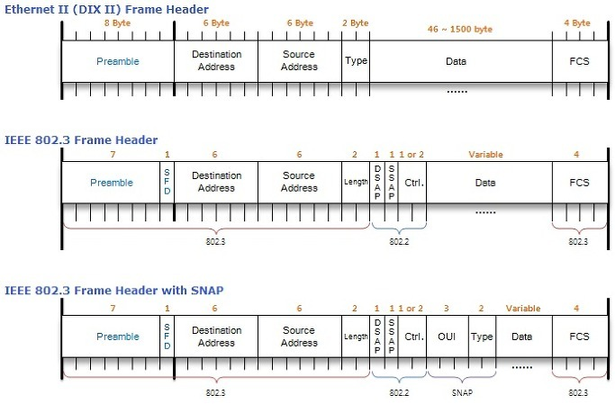
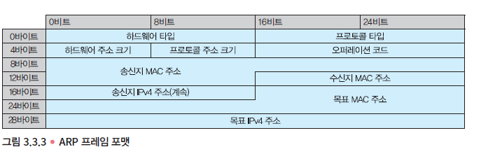

# 03장. 데이터링크 계층

물리 계층은 컴퓨터에서 다루는 0과 1로 구성된 디지털 데이터와 LAN 케이블 또는 전파에서 다루는 신호를 상호 변환하는 역할을 담당한다.  
데이터링크 계층은 같은 네트워크에 있는 단말을 식별하고, 물리 계층 위에서 비트열을 전송하는 구조를 제공한다.  

데이터링크 계층은 디지털 데이터 전체의 정합성을 체크함으로써 물리 계층에서 정정할 수 없는 에러를 감지하고 디지털 데이터의 신뢰성을 담보한다.  
또한, MAC 주소라는 네트워크상의 주소를 사용해 송신 단말과 수신 단말을 식별한다.  

<br/>

## 유선 LAN(IEEE802.3)

### 이더넷의 프레임 포맷

이더넷에 의해 캡슐화된 패킷을 이더넷 프레임이라 부르며, 이더넷 프레임 포맷에는 이더넷 II 규약과 IEEE802.3 규약 2종류가 있다.  
웹, 메일, 파일 공유에서 인증에 이르기까지 TCP/IP로 교환하는 대부분의 패킷이 이더넷 II 규약을 사용하고 있다.  

이더넷 II의 프레임 포맷은 1982년 발표된 이후부터 현재에 이르기까지 전혀 변하지 않았다.  
이더넷 II는 프리앰블, 수신지/송신지 MAC 주소, 타입, 이더넷 페이로드, FCS라는 5개 필드로 구성되어 있다.  
이 중 프리앰블, 수신지/송신지 MAC 주소, 타입을 합쳐 이더넷 헤더라고 부르며, FCS는 이더넷 트레일러라고 부른다.  

 - `프리앰블`
    - 송신측과 수신측의 비트 동기화를 위해 사용하는 8바이트의 특별한 비트 패턴
    - 상위 7Byte: 비트 동기화를 위해 10101010로 된 비트열을 전달
    - 하위 1Byte: 프레임 시작을 알리는 10101011을 전달
 - `수신지/송신지 MAC 주소`
    - MAC은 이더넷 네트워크에 접속하고 있는 단말을 식별하는 6바이트의 ID이다.
    - 송신측
        - 6Byte 주소의 첫 번쨰 비트가 1이면 Multicast를 의미한다.
        - 6Byte 주소의 모든 비트가 1이면 Broadcast를 의미한다.
 - `타입`
    - 타입은 네트워크 계층에서 어떤 프로토콜을 사용하는지 나타내는 2바이트의 ID이다.
    - IPv4라면 0x0800, IPv6라면 0x86DD 등 사용하는 프로토콜이나 버전에 따라 값이 결정된다.
 - `이더넷 페이로드`
    - 이더넷 페이로드는 네트워크 계층의 데이터 자체를 나타낸다.
    - 최소 46 Byte ~ 최대 1,500 Byte
    - 만약, 데이터의 크기가 작은 경우 패딩(padding) 이라는 더미 데이터를 추가하여 46 Byte로 만든다.
 - `FCS`
    - FCS는 이더넷 프레임이 송산되지 않았는지 확인하기 위해 4바이트 필드이다.
    - 송신 측 단말은 이더넷 프레임을 송신할 때 수신지 MAC 주소, 송신지 MAC 주소, 타입, 이더넷 페이로드에 대해 일정한 계산(체크섬 계산, CRC)을 수행하고, 그 결과를 FCS로 프레임 마지막에 추가한다.
    - 수신 측 단말은 전달받은 이더넷 프레임에 대해 동일한 계산을 수행하고, 그 값이 FCS와 같다면 손상되지 않은 올바른 이더넷 프레임이라고 판단한다. 만약, 값이 다르면 전송 도중 이더넷 프레임이 송산되었다고 판단하고 파기한다.
    - FCS가 이더넷에서 에러 감지의 전부를 담당한다.

<div align="center">
    
</div>

<br/>

### MAC 주소

MAC 주소는 이더넷 네트워크에 접속되어 있는 단말의 식별 ID이다.  
6바이트로 구성되며, '00-0c-29-43-5e-be' 같이 1바이트씩 하이픈이나 콜론으로 구분해 12자리의 16진수로 표기한다.  

MAC 주소는 상위 3바이트와 하위 3바이트로 나누며, 상위 3바이트는 IEEE가 벤더별로 할당한 벤더 코드로 OUI라 부른다. 해당 부분을 통해 통신하는 단말의 NIC를 어떤 벤더가 제조한지 알 수 있다. 하위 3바이트는 UAA라 부르며, 출하 시 벤더에서 할당하거나 무작위로 생성한 값이다.  
MAC 주소가 반드시 고유한 값을 갖지는 않는다. 때문에, 이더넷 네트워크에서 같은 MAC 주소의 단말이 여럿 존재하면 중복되지 않는 MAC 주소로 수정해야 한다.  

 - `유니캐스트`
    - 유니캐스트(Unicast)는 네트워크에서 하나의 송신자가 하나의 특정 수신자에게 데이터를 전송하는 통신 방식을 나타낸다. (1:1 통신)
 - `브로드캐스트`
    - 브로드캐스트는 네트워크에서 모든 장치에 데이터를 전송하는 통신 방식을 나타낸다. 이는 이더넷 네트워크에 접속되어 있는 자신 외에 모든 단말을 의미한다.(1:N)
    - 브로드캐스트는 특정한 MAC 주소나 IP 주소를 명시하지 않고, 대신에 특수한 주소를 사용하여 데이터를 모든 장치에게 전송합니다.
    - 브로드캐스트는 ARP와 같은 네트워크상의 모든 단말에 알림/문의를 하는 프로토콜에서 사용한다.
 - `멀티캐스트`
    - 멀티캐스트(Multicast)는 네트워크에서 특정 그룹의 장치들에게 데이터를 전송하는 통신 방식을 의미한다. (1:N)
    - 멀티캐스트는 여러 장치에 동시에 정보를 전달해야 할 때 유용하게 사용된다. 예를 들어, 동일한 데이터를 여러 사용자에게 전송해야 하는 멀티미디어 스트리밍, 온라인 회의, 또는 멀티캐스트 그룹에 속한 장치 간의 데이터 교환 등에 활용된다. (동영상 전송, 주식 거래 애플리케이션 등)

<br/>

### L2 스위치

L2 스위치는 이더넷 헤더에 포함된 송신지 MAC 주소와 자신의 포트 번호를 MAC 주소 테이블이라는 메모리상의 테이블로 관리하면서, 이더넷 프레임의 전송 대상지를 바꾸어 통신 효율을 높인다. 이러한 이더넷 프레임의 전송 대상지를 바꾸는 기능을 L2 스위칭이라 부른다.  

 - `L2 스위칭 과정`
```
1. PC1은 PC2에 대한 이더넷 프레임을 만들어 케이블로 보낸다.
이때, 송신지 MAC 주소는 PC1의 MAC 주소, 수신지 MAC 주소는 PC2의 MAC주소 이다.
이 시점에 L2 스위치의 MAC 주소 테이블은 비어있다.

2. PC1의 프레임을 전달받은 L2 스위치는 이더넷 프레임의 송신지 MAC 주소와
프레임을 전달받은 물리 포트 번호를 MAC 주소 테이블에 등록한다.

3. 이 시점에서 L2 스위치는 PC2가 자신의 어떤 물리 포트에 접속되어 있는지 모른다.
PC1의 이더넷 프레임의 사본을 PC1에 접속된 포트를 제외한 모든 물리 포트로 전송한다. (플러딩)
브로드 캐스트의 경우 MAC 주소는 송신지 MAC 주소가 될 수 없으므로 MAC 주소 테이블에 등록하지는 않는다.

4. 복사한 프레임을 전달받은 PC2는 PC1에 대한 응답 프레임을 만들어 케이블로 보낸다.
또한, 플러딩에 의해 PC1과 PC2와의 통신에 관계없는 단말은 같은 이더넷 프레임을 전달받지만 관계없는 이더넷 프레임으로 판단해 파기한다.

5. PC2의 이더넷 프레임을 전달받은 L2 스위치는 이더넷 프레임의 송신지 MAC 주소에 들어 있는
PC2의 MAC 주소와 프레임을 전달받은 물리 포트의 번호를 MAC 주소 테이블에 등록한다.

6. 이제 L2 스위치는 PC1과 PC2가 어떤 물리 포트에 접속되어 있는지 확인하였다.
이후에는 PC1과 PC2 사이의 통신을 직접 전송한다. 플러딩 단계는 수행하지 않는다.

7. L2 스위치는 PC1 또는 PC2가 일정 시간 동안 통신하지 않으면 MAC 주소 테이블 중 이들과 관련한 부분을 삭제한다.
삭제할 때까지의 대기 시간은 기기에 따라 다르지만, 임의로 변경할 수도 있다.
```

<br/>

 - `VLAN`

VLAN은 1대의 L2 스위치를 여러 대의 L2 스위치로 가상 분할하는 기술이다.  
L2 스위치의 포트에 VLAN 식별 번호인 VLAN ID 숫자를 설정하고, 다른 VLAN ID가 설정된 포트에는 프레임을 전송하지 않도록 한다.  

 - `포트 기반 VLAN`
   - 포트 기반 VLAN은 하나의 포트에 하나의 VLAN을 할당하는 기능이다.
   - 서로 같은 VLAN 단말끼리는 통신이 가능하고, 다른 VLAN 단말은 통신이 불가능하다.
   - 포트 기반 VLAN은 VLAN 수만큼 포트와 케이블을 준비해야 한다.
 - `태그 VLAN`
   - 태그 VLAN은 이더넷 프레임에 VLAN 정보를 VLAN 태그로 붙이는 기능이다.
   - 태그 VLAN은 VLAN의 수에 관계없이 포트 하나, 케이블 하나로 완료된다.
   - 태그 VLAN을 이용해 VLAN을 식별하고, 하나의 포트와 하나의 케이블로 여러 VLAN 이더넷 프레임을 보낼 수 있게 한다.
 - `PoE`
   - PoE는 트위스트 페어 케이블을 사용해 전원을 공급하는 기능이다.

<br/>

## 무선 LAN(IEEE 802.11)

무선 LAN은 눈에 보이지 않는 전팔고 패킷을 교환하기 때문에 유선 LAN보다 복잡한 통신 제어나 보안 제어가 필요하다. IEEE802.11에서는 캡슐화하는 포맷과 프레임을 안전하게 교환하는 방법이 정의하고 있다.  

 - `프리앰블`
   - 프리앰블은 가변 길이 필드로 IEEE802.11 프레임 전송을 판단할 수 있다.
 - `프레임 제어`
   - 프레임 제어는 프레임 제어에 필요한 정보를 포함한 2바이트 필드로 프레임의 종류나 송신지/수신지의 종류, 프래그먼트 정보, 전력 상태 등이 설정되어 있따.
   - 무선 LAN에서는 프레임의 종류로 데이터 프레임, 관리 프레임, 제어 프레임 3가지가 있다.
   - 데이터 프레임: IP 패킷을 송수신하기 위한 프레임
   - 관리 프레임: 어떤 액세스 포인트와 어떻게 접속할 것인지 관리하는 프레임
   - 제어 프레임: 데이터 프레임의 전송을 돕기 위해 존재하는 프레임
 - `Duration/ID`
   - Duration/ID는 무선 회선을 점유할 예정 시간의 알림이나 단말의 배터리 소비량을 제어하는 전원 관리 식별자에 사용되는 2바이트 필드이다.
 - `MAC 주소 1/2/3/4`
   - IEEE802.11의 프레임은 최대 4개의 MAC 주소 필드를 가질 수 있어 프레임 종류나 네트워크 구성에 따라 그 수와 용도가 달라진다.
   - 데이터 프레임의 MAC 주소는 네트워크 구성에 따라 달라진다. 무선 LAN 네트워크 구성에는 인프라 모드, 애드혹 모드, WDS 모드 3종류가 있다.
   - 인프라 모드
      - 무선 LAN 단말이 반드시 액세스 포인트를 경유해 통신하는 네트워크 구성으로 인프라로 교환되는 프레임의 MAC 주소 필드에는 첫 번째에 무선 구간의 수신지 MAC 주소, 두 번쨰에 무선 구간의 송신지 MAC 주소, 세 번째에 무선 LAN 단말의 송신지 MAC 주소나 수신지 MAC 주소가 설정되어 있다.
         - MAC 주소 1: 액세스 포인트
         - MAC 주소 2: 단말 A
         - MAC 주소 3: 단말 B
         - MAC 주소 4: -
   - 애드혹 모드
      - 애드혹 모드는 액세스 포인트를 거치지 않고, 무선 LAN 단말끼리 직접 통신하는 네트워크 구성이다.
         - MAC 주소 1: 단말 B
         - MAC 주소 2: 단말 A
         - MAC 주소 3: 사용자 정의
         - MAC 주소 4: -
   - WDS 모드
      - WDS 모드는 액세스 포인트끼리 통신하는 네트워크 구성이다.
         - MAC 주소 1: 액세스 포인트 B
         - MAC 주소 2: 액세스 포인트 A
         - MAC 주소 3: 단말 B
         - MAC 주소 4: 단말 A
 - `시퀀스 제어`
   - 시퀀스 제어는 4비트의 프래그먼트 신호와 12비트의 시퀀스 신호로 구성된 필드로 프래그멘테이션된 프레임을 재결합하거나 중복된 프레임을 파기할 때 사용한다.
   - 무선 LAN은 ACK 프레임으로 확인 응답하면서 통신을 진행한다. 만약, 액세스 포인트로부터 ACK 프레임이 도착하지 않으면 일정 시간 기다린 뒤에 재전송을 시도한다.
 - `IEEE802.11 페이로드`
   - 데이터 프레임의 경우 네트워크 계층의 프로토콜 정보를 의미하는 타입 필드를 포함하는 LLC 헤더로 한 번 더 캡슐화한 뒤, 네트워크 계층의 데이터 IP 패킷을 설정한다.

<br/>

### 무선 LAN 단말이 접속되기까지

무선 LAN은 누구나 전파를 수신할 수 있는 공공 공간을 사용해서 통신한다.  
무선 LAN은 어소시에이션 > 인증 > 공유키 생성 > 암호화 통신 4단계를 거쳐 암호화 통신한다.  

 - `어소시에이션 단계`
   - __스캔__
      - 스캔은 액세스 포인트와 무선 LAN 단말이 서로의 존재를 인식하는 단계이다.
   - __인증__
      - 인증 방식에는 오픈 시스템 인증과 공유키 인증 2가지 종류가 있다.
      - 오픈 시스템 인증은 인증 처리를 하지 않고, 모든 인증 요청에 대해 인증 허가한다.
      - 공유키 인증은 미리 무선 LAN 단말과 액세스 포인트에서 공유한 비밀번호에 기반해 인증한다. WEP 암호화와 같은 방식이다.
   - __어소시에이션__
      - 어소시에이션은 최종 확인 단계로 무선 LAN 단말은 접속할 액세스 포인트에 대해 어소시에이션 요청을 송싱한다.
      - 액세스 포인트는 어소시에이션 응답을 반환하고 접속을 확립한다.
 - `SSID`
   - SSID는 무선 LAN을 식별하기 위한 문자열로 무선 LAN의 이름이다.
   - 무선 LAN은 SSID 문자열을 사용해 네트워크를 식별한다.
 - `인증 단계`
   - 무선 LAN 인증 방식에는 퍼스널 모드와 엔터프라이즈 모드가 있다.
   - __퍼스널 모드__
      - 퍼스널 모드는 비밀번호로 인증하는 방식이다.
      - 무선 LAN 단말과 액세스 포인트는 어소시에이션이 완료되면 비밀번호로부터 마스터키라 부르는 공유키의 소재를 생성한다.
   - __엔터프라이즈 모드__
      - 엔터프라이즈 모드는 디지털 인증서나 ID/비밀번호, SIM 카드 등을 사용해 인증하는 방식으로 IEEE802.1x로 표준화되었다.
      - 인증 서버에서 일괄적으로 인증이 가능해 기업의 무선 LAN 환경 등에서 주로 사용된다.
 - `공유키 생성 단계`
   - 공유키 생성 단계는 인증 단계에서 생성한 마스터키로부터 실제 암호화/복호화에서 사용하는 공유키를 생성하는 단계이다.
 - `암호화 통신 단계`
   - 공유키가 만들어졌다면 실제 암호화 통신을 시작한다.
   - 무선 LAN에서 사용하는 암호화 방식에는 WEP, WPA, WPA2, WPA3 4가지 종류가 있다.
   - __WEP__
      - 초기 무선 LAN에서 사용된 암호화 방식
      - RC4 암호화 구조 이용
      - WEP는 같은 공유키를 계속해서 사용할 뿐만 아니라, RC4 자체에 치명적인 취약성이 발견되어 현재에는 거의 사용하지 않는다.
   - __WPA__
      - WEP를 개량해 취약성을 낮추는 것을 목적으로 한 암호화 방식
      - RC4에 공유키를 생성해 일정 간격으로 변경하는 TKIP를 추가해 보안 수준 향상
      - WEP의 취약성이 발견되어 이를 기반으로한 WPA 역시 문제가 있다고 지적되고 있다.
   - __WPA2__
      - WPA를 한층 개량한 암호화 방식
      - 암호화 알고리즘으로 AES를 채용
   - __WPA3__
      - WPA2를 한층 개량한 암호화 방식
      - 엔터프라이즈 모드의 암호화 방식으로 AES보다 더욱 안전한 CNSA에 대응
      - 4웨이 핸드셰이크에 SAE 핸드셰이크 단계, 관리 프레임을 암호화하는 PMF 등을 추가해 더욱 강력한 보안 수준 구현

<br/>

### 무선 LAN의 형태

 - `분산 관리형`
   - 액세스 포인트를 1대씩 설정하고 각각 운용 관리하는 형태
   - 가정이나 소규모 사무실의 무선 LAN 환경에서 일반적으로 사용
 - `집중 관리형`
   - 무선 LAN 컨트롤러 서버를 사용해 많은 액세스 포인트를 운용 관리하는 형태
   - 중간 규모부터 대규모 사무실의 무선 LAN 환경에서 일반적으로 사용
   - 액세스 포인트 수가 많아져도 무선 LAN 컨트롤러를 통해 일괄적으로 운용 관리할 수 있어 용이
 - `클라우드 관리형`
   - 무선 LAN 컨트롤러의 기능을 클라우드에 갖도록 한 클라우드 컨트롤러에서 액세스 포인트를 관리하는 형태
   - 액세스 포인트가 인터넷에 접속해야 하지만, 무선 LAN 컨트롤러를 별도로 준비하지 않고 집중 관리형과 같은 장점을 유지할 수 있어 각광받고 있음

<br/>

### 무선 LAN과 관련된 다양한 기능

 - `게스트 네트워크`
   - 방문자에게 제공되는 무선 LAN 환경
   - 게스트 네트워크 기능을 이용하면 인터넷에는 접속할 수 있지만, 가정 네트워크에는 접속할 수 없는 SSID 네트워크를 만들 수 있다.
 - `MAC 주소 필터링`
   - 단말의 MAC 주소를 기반으로 필터링하는 기능
   - 액세스 포인트나 무선 LAN 컨트롤러에 접속 가능한 단말의 MAC 주소를 등록하고, 그 외 단말의 접속을 거부한다.
   - 무선 LAN 단말이 적은 경우에 사용
   - MAC 주소 위장시 대응 할 수 없고, 단말 수가 많아지면 복잡해지기 쉬운 단점이 있음
 - `웹 인증`
   - 웹 브라우저에서 사용자 이름과 비밀번호를 입력해 인증하는 방식
 - `밴드 스티어링`
   - 2.4GHz 대역과 5GHz 대역의 양쪽 주파수 대역에 대응하는 무선 LAN 단말을 전파 간섭이 발생하기 어려운 5GHz 대역으로 유도한다.

<br/>

## ARP

MAC 주소는 NIC 자체에 내장되어 있는 물리적 주소로 데이터링크 계층에서 동작한다.  
IP 주소는 OS상에서 설정한 논리적인 주소로 네트워크 계층에서 동작한다.  

이 두가지 주소를 접속해 데이터링크 계층과 네트워크 계층의 다리 역할을 하는 프로토콜이 ARP이다.  
ARP에서 수신지 IPv4 주소로부터 수신지 MAC 주소를 구한다. (주소 결정)  

<br/>

### ARP 프레임 포맷

ARP는 L2 헤더의 타입 코드에 '0x0806'으로 정의되어 있다.  
또, L2 페이로드에 데이터링크 계층이나 네트워크 계층의 정보를 담음으로써, MAC 주소와 IP 주소를 접속할 수 있다.  

 - `하드웨어 타입`
   - 레이어2 프로토콜을 의미하는 2바이트 필드
   - 다양한 레이어2 프로토콜이 정의되어 있으며, 이더넷에서는 0x0001이 들어간다.
 - `프로토콜 타입`
   - 레이어3 프로토콜을 의미하는 2바이트 필드
   - 다양한 레이어3 프로토콜이 정의되어 있으며, IPv4에서는 '0x0800'이 들어간다.
 - `하드웨어 주소 크기`
   - 하드웨어 주소 크기, 즉 MAC 주소의 길이를 바이트 단위로 나타내는 1바이트 필드
   - MAC 주소는 6바이트(48Bit)로 '6'이 들어간다.
 - `프로토콜 주소 크기`
   - 네트워크 계층에서 사용하는 주소 크기, 즉 IP 주소의 길이를 바이트 단위로 나타내는 1바이트 필드
   - IP 주소의 길이는 4바이트(32Bit)로 '4'가 들어간다.
 - `오퍼레이션 코드`
   - ARP 프레임의 종류를 나타내는 2바이트 필드
   - ARP Request는 '1', ARP Reply는 '2'
 - `송신지 MAC 주소/송신지 IPv4 주소`
   - ARP를 송신하는 단말의 AMC 주소와 IPv4 주소를 나타내는 가변 길이 필드
 - `목표 MAC 주소/목표 IPv4 주소`
   - ARP로 주소를 결정하려는 MAC 주소와 IPv4 주소를 나타내는 가변 길이 필드

<div align="center">
   
</div>

<br/>

### ARP에 의한 주소 결정 흐름

ARP Request는 같은 네트워크에 있는 단말 모두에게 브로드캐스트로 패킷을 송싱한다.  
ARP Reply는 1:1 유니캐스트로 송신된다.  
ARP는 이 두 패킷만으로 MAC 주소와 IP 주소를 연결한다.  

 - `구체적인 주소 결졍 흐름`
   - 네트워크 계층에서 전달받은 IP 패킷에 포함된 수신지 IPv4 주소를 보고, 자신의 ARP 테이블을 검색한다. (초기에는 ARP 테이블이 비어있어 ARP Request 처리한다.)
   - ARP Request를 송신하기 위해, ARP의 각 필드 정보를 조합한다. 이때, 오퍼레이션 코드는 ARP Request를 나타내는 '1'이고, 송신지 MAC 주소와 IPv4를 입력한다. 브로드캐스트로 ARP가 같은 네트워크에 모든 단말에게 전달된다.
   - 주소 결정 대상 단말은 자신에 대한 ARP 프레임이라고 판단하고 해당 요청을 받아들인다. 이후, ARP Reply 응답하기 위해 ARP의 각 필드 정보를 조합하고, 오퍼레이션 코드는 ARP Reply를 나타내는 '2', 목표 MAC 주소와 IPv4 주소 등 이더넷 헤더를 조합한다. ARP Reply는 유니캐스트를 사용한다.
   - 송신 단말은 ARP Reply의 ARP 필드에 포함된 송신지 MAC 주소와 IPv4 주소를 보고 해당 단말의 MAC 주소를 인식하며, 해당 정보를 ARP 테이블에 기록하고 잠시 동안 저장한다.
