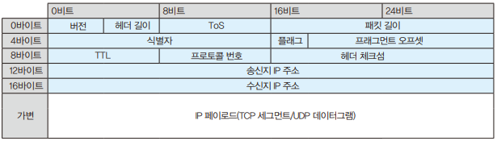
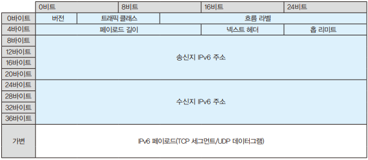

# 04장. 네트워크 계층

네트워크 계층은 이더넷이나 무선 LAN에서 만들어진 네트워크를 함께 연결해 다른 네트워크에 있는 단말과의 연결성을 확보하는 계층이다.  
데이터링크 계층은 같은 네트워크 안에 존재하는 단말들의 연결까지만 담당한다.  

 

## IPv4

IPv4는 1981년에 발행된 RFC791로 표준화된 커넥션리스 타입 프로토콜로 L2 헤더의 타입 코드에는 '0x0800'으로 정의되어 있다.  

 

### IPv4의 패킷 포맷

IP에 의해 캡슐화되는 패킷을 IP 패킷이라 부른다.  
IP 패킷은 다양한 제어 정보를 설정하는 IP 헤더, 데이터 자체를 나타내는 IP 페이로드로 구성되어 있다.  

 - `버전`
    - 버전은 IP의 버전을 나타내는 4비트 필드로 IPv4에서는 '4'를 나타내는 '0100'이 들어간다.
 - `헤더 길이`
    - 헤더 길이는 IPv4 헤더의 길이를 나타내는 4비트 필드로 IHML이라 부른다.
    - 패킷을 받아들인 단말은 이 값을 보고, 어디까지 IPv4 헤더인지 알 수 있다.
 - `ToS`
    - ToS는 IPv4 패킷의 우선도를 나타내는 1바이트 필드로 우선 제어나 대역 제어, 혼잡 제어 등 QoS에서 사용한다.
    - ToS는 앞 6비트의 DSCP 필드, 남은 2비트의 ECN 필드로 구성된다.
 - `패킷 길이`
    - 패킷 길이는 IPv4 헤더와 IPv4 페이로드를 합친 패킷 전체의 길이를 나타내는 2바이트(16Bit) 필드이다.
    - 패킷을 받아들인 단말은 이 값을 보고, 어디까지 IPv4 패킷인지 알 수 있다.
    - 이더넷의 기본 MTU까지 데이터가 들어있는 IPv4 패킷의 경우 패킷 길이 값은 '1500'이 된다.
 - `식별자`
    - 패킷 교환 방식 통신에서는 데이터를 그 상태 그대로 송신하지 않고, 송신하기 쉽도록 작게 나누어 송신한다.
    - IP에서 데이터를 작게 나누는 처리를 IP 프래그멘테이션이라 부른다.
 - `플래그`
    - 플래그는 3비트로 구성되어 있으며 1번째 비트는 사용하지 않는다.
    - 2번쨰 비트는 DF 비트라 불리며 IP 패킷을 프래그멘테이션해도 좋을지 의미한다. '0'이면 허가, '1'이면 허가하지 않음
    - 3번째 비트는 MF 비트라 부르며 프래그멘테이션된 IPv4 패킷이 뒤에 계속되는가를 나타낸다. '0'이면 계속하지 않고, '1'이면 계속된다.
 - `프래그먼트 오프셋`
    - 프래그먼트 오프셋은 프래그멘테이션한 뒤, 그 패킷이 오리지널 패킷의 앞쪽부터 어느 위치에 있는지를 나타내는 13비트 필드이다.
 - `TTL`
    - TTL은 패킷의 수명을 나타내는 1바이트 필드로 IP 세계에서는 IP 패킷의 수명은 '경유하는 라우터의 수'를 의미한다. (홉 수)
    - TTL 값은 네트워크상에서 라우터를 경유할 때마다 1씩 감소하며, 값이 '0'이 되면 패킷이 파기된다.
    - 패킷을 파기한 라우터는 'Time-to-live exceed'라는 ICMPv4 패킷을 반환하고, 패킷을 파기한 것을 송신지 단말에 전달한다.
 - `프로토콜 번호`
    - 프로토콜 번호는 IPv4 페이로드가 어떤 프로토콜로 구성되어 있는지를 나타내는 1바이트 필드이다.
    - FRC890에 표준화되어 있다.
        - 1:ICMP, 2:IGMP, 6:TCP, 17:UDP, 47:GRE, 50:ESP, 88:EIGRP, 89:OSPF, 112:VRRP
 - `헤더 체크섬`
    - 헤더 체크섬은 IPv4 헤더의 정합성을 체크하기 위해 사용되는 2바이트(16Bit) 필드이다.
    - 헤더 체크섬 계산은 RFC1071에 정의되어 있으며, 1의 보수 연산 계산 방법을 채용하고 있다.
 - `송신지/수신지 IPv4 주소`
    - IPv4 주소는 IPv4 네트워크에 연결되어 있는 단말을 나타내는 4바이트(32Bit) 식별 ID 이다.
    - PC나 서버의 NIC, 라우터나 방화벽, L2 스위치 중에서도 관리 가능한 L2 스위치 등 IP 네트워크에서 통신하는 단말은 모두 IP 주소를 가지고 있어야 한다.
    - 단말은 하나의 IP만 가질 수 있는 것이 아니라, 기기 종류나 용도에 따라 여러 IP 주소를 가질 수도 있다.
    - 이더넷 네트워크에서 통신하기 위해서는 MAC 주소가 필요하고, IP 네트워크에서 통신하기 위해서는 IP 주소가 필요하다.
 - `옵션`
    - 옵션은 IPv4 패킷 송신에 대한 확장 기능을 저장한 가변 길이 필드이다.
    - 패킷이 지나는 경로를 기록하는 Record Route, 지정한 경로를 통과하도록 지정하는 Loose source route 등 다양한 기능이 제공된다.
 - `패딩`
    - 패딩은 IPv4 헤더의 비트 수를 정렬하기 위해 사용되는 필드이다.

    

 

### IPv4 주소와 서브넷 마스크

IPv4 주소는 네트워크 부분과 호스트 부분 2개로 구성되어 있다.  
네트워크 부분은 어떤 IPv4 네트워크에 있는지를 나타내고, 호스트 부분은 해당 네트워크에 어떤 단말인지를 나타낸다.  

서브넷 마스크는 이 2개를 구분하는 것으로 '1'의 비트가 네트워크 부분, '0'비트가 호스트 부분을 나타낸다.  
IPv4 주소와 서브넷 마스크를 조합해서 어떤 IPv4 네트워크에 있는 어떤 단말인지를 식별할 수 있다.  

 - `10진수 표기와 CIDR 표기`
    - 서브넷 마스크는 10진수 표기와 CIDR 표기 2종류 표기 방법이 있다.
    - 10 진수 표기
        - IPv4 주소와 같이 32비트를 8비트씩 4개 그룹으로 나눠, 10진수로 변환하고 점으로 구분해서 표기한다.
        - ex) 192.168.100.1 IP 주소의 '255.255.255.0' 서브넷 마스크
    - CIDR 표기
        - IPv4 주소 뒤에 '/'와 서브넷 마스크이 '1'의 비트 수를 표기한다.
        - ex) 192.168.100.1 IP 주소의 '255.255.255.0' 서브넷 마스크: '192.168.100.1/24'

 

### 다양한 IPv4 주소

IPv4 주소는 '0.0.0.0'에서 '255.255.255.255'까지 약 43억개가 존재한다.  

 - `사용 용도에 따른 분류`
    - IPv4 주소는 사용 용도에 따라 클래스 A에서 클래스 E까지 3개 주소 그룹으로 분류할 수 있다.
    - 클래스 A
        - 용도: 유니캐스트(대규모)
        - 구간: 0.0.0.0 ~ 127.255.255.255
        - 네트워크 8비트, 호스트 24비트
        - 최대 할당 가능 IP 주소: 16,777,214
    - 클래스 B
        - 용도: 유니캐스트(중규모)
        - 구간: 128.0.0.0 ~ 191.255.255.255
        - 네트워크 16비트, 호스트 16비트
        - 최대 할당 가능 IP 주소: 65,354
    - 클래스 C
        - 용도: 유니캐스트(소규모)
        - 구간: 192.0.0.0 ~ 223.255.255.255
        - 네트워크 24비트, 호스트 8비트
        - 최대 할당 가능 IP 주소: 254
    - 클래스 D
        - 용도: 멀티캐스트
        - 구간: 224.0.0.0 ~ 239.255.255.255
    - 클래스 E
        - 용도: 연구, 예약용
        - 구간: 240.0.0.0 ~ 255.255.255.255
 - `클래스풀 어드레싱`
    - 주소 클래스에 기반해 IPv4 주소를 할당하는 방식을 클래스풀 어드레싱이라 부른다.
 - `클래스리스 어드레싱`
    - 8비트 단위의 주소 클래스에 관계없이 IPv4 주소를 할당하는 방식을 클래스리스 어드레싱이라 부른다. (서브네팅, CIDR 등으로 불린다.)
    - 클래스리스 어드레싱은 네트워크 부분과 호스트 부분 외 서브넷 부분이라는 새로운 개념을 도입해 새로운 네트워크를 만들어낸다.
    - __CIDR 예시__
        - '/24(255.255.255.0)'
            - 최대 IP: 254(256 - 2)
            - 할당 네트워크: 192.168.1.0
        - '/25(255.255.255.128)'
            - 최대 IP: 126(128 - 2)
            - 할당 네트워크: 192.168.1.0, 192.168.1.128
        - '/26(255.255.255.192)'
            - 최대 IP: 62(64 - 2)
            - 할당 네트워크: 192.168.1.0, 192.168.1.64, 192.168.1.128, 192.168.1.192
        - '/27(255.255.255.224)'
            - 최대 IP: 30(32 - 2)
            - 할당 네트워크: *.0, *.32, *.64, *.96, *.128, *.160, *.192, *.224
        - '/28(255.255.255.240)'
            - 최대 IP: 14(16 - 2)
            - 할당 네트워크: 0, 16, 32, 48, 64, 80, 96, 112, 128, 144, 160, 176, 192, 208, 224, 240
 - `시간 장소에 따른 분류`
    - IPv4 주소는 사용하는 장소에 따라 글로벌 IPv4 주소(공인IP)와 프라이빗 IPv4 주소(개인 IP) 2종류로 분류한다.
    - __글로벌 IPv4 주소(공인 IP)__
        - 글로벌 IPv4 주소는 ICANN이라는 비영리 법인의 한 기능인 IANA와 그 하부 조직(RIR, NIR, LIR)에 따라 계층적으로 관리되며, 자유롭게 할당할 수 없는 IPv4 주소이다.
        - RIR: 지역 인터넷 레지스트리, NIR: 국가 인터넷 레지스트리, LIR: 로컬 인터넷 레지스트리
    - __프라이빗 IPv4 주소(개인 IP)__
        - 프라이빗 IPv4 주소는 조직 안에서 자유롭게 할당할 수 있는 IPv4 주소이다.
        - 조직 내에서만 유효한 IP 주소로 인터넷에 직접 접속되지 않는다. 인터넷에 접속시에는 개인 IP 주소를 공인 IP 주소로 변환해야 한다.
        - RFC1918로 표준화되어있다.
            - 클래스 A
                - IP 주소 범위: 10.0.0.0 ~ 10.255.255.255
                - 서브넷 마스크: 255.0.0.0(/8)
                - 최대 할당 노드 수: 16,777,214 (2의 24제곱 - 2)
            - 클래스 B
                - IP 주소 범위: 172.16.0.0 ~ 172.132.255.255
                - 서브넷 마스크: 255.240.0.0(/12)
                - 최대 할당 노드 수: 1,048,574 (2의 20제곱 - 2)
            - 클래스 C
                - IP 주소 범위: 192.168.0.0 ~ 192.168.255.255
                - 서브넷 마스크: 255.0.0.0(/16)
                - 최대 할당 노드 수: 65,534 (2의 16제곱 - 2)
 - `예외 주소`
    - __네트워크 주소__
        - 네트워크 주소는 호스트 부분의 비트가 모두 '0'인 IP 주소로 네트워크 자체를 나타낸다.
        - 예를 들어, '192.168.100.1' 이라는 IP 주소에 '255.255.255.0' 이라는 서브넷 마스크가 설정되어 있는 경우 '192.168.100.0'이 네트워크 주소가 된다.
    - __브로드캐스트 주소__
        - 브로드캐스트 주소는 호스트 부분의 비트가 모두 '1'인 IPv4 주소이며 같은 네트워크에 존재하는 모든 단말을 나타낸다.
        - 예를 들어, '192.168.100.1' 이라는 IP 주소에 '255.255.255.0' 이라는 서브넷 마스크가 설정되어 있는 경우 '192.168.100.255'가 브로드캐스트 주소가 된다.
    - __루프백 주소__
        - 루프백 주소는 자기 자신을 나타내는 IP 주소로 RFC1122로 표준화되었다.
        - 루프백 주소는 1 옥텟이 '127'인 IPv4 주소로 1옥텟이 '127'이라면 어떤 주소를 사용해도 관계없지만, '127.0.0.1/8'을 많이 사용한다.
        - Windows, macOS 모두 통신에 사용하는 IPv4 주소와 별도로 자동으로 '127.0.0.1/8'이 설정되어 있다.

 

## IPv6

IPv6는 2017년에 RFC8200에 표준화된 프로토콜로 L2 헤더의 타입 코드에서는 '0x86DD'로 정의되어 있다.  

 

### IPv6 패킷 포맷

IPv6 헤더는 주소가 길어진 만큼 전체 길이도 길어졌지만, 필드 종류가 줄고 길이가 고정되어 포맷이 간단하다.  

 - `헤더 길이`
    - IPv6는 IPv4에서 거의 사용되지 않던 옵션 필드를 '확장 헤더'라는 다른 헤더로 분리해서 IP 페이로드 앞에 배치하여 헤더 길이를 40바이트(320Bit)로 고정하고 있다.
    - 헤더 길이가 고정되어 있어 받은 패킷 헤더의 길이를 하나하나 조사할 필요가 없어졌다.
 - `필드 수 감소`
    - IPv4는 향후를 고려해 다양한 기능을 여럿 포함한 형태로 책정되었다. IPv6는 성능 향상에 도움이 되지 않는 필드를 줄여 단순함을 표방하였다.
    - IPv4 헤더: 버전(4Bit), 헤더 길이(4Bit), ToS(8Bit), 패킷 길이(16Bit), 식별자(16Bit), 프래그먼트(3Bit), 프래그먼트 오프셋(13Bit), TTL(8Bit), 프로토콜 번호(8Bit), 헤더 체크섬(16Bit), 송신지 IPv4 주소(32Bit), 수신지 IPv4 주소(32Bit), 옵션 + 패딩(가변길이)
    - IPv6 헤더: 버전(4Bit), 트래픽 클래스(8Bit), 흐름 라벨(20Bit), 페이로드 길이(16Bit), 넥스트 헤더(8Bit), 홉 리미트(8Bit), 송신지 IPv6 주소(128Bit), 수신지 IPv6 주소(128Bit)
        - 헤더 길이: IPv6 헤더 길이는 고정이므로 파기
        - 식별자, 프래그먼트, 프래그먼트 오프셋: 프래그먼트에 관한 필드는 확장 헤더로서 부여
        - 헤더체크섬: 기능 자체를 트랜스포트 계층에 위임하므로 파기
        - 옵션 + 패딩: 필드로서는 파기, 확장 헤더로 부여
 - `버전`
    - IP 버전을 나타내는 4비트 필드 (2진수 표기로 '0110')
 - `트래픽 클래스`
    - IPv6 패킷의 우선도를 나타내는 1바이트 필드
    - IPv4의 ToS 필드에 해당하며 우선 제어나 대역 제어, 혼잡 제어 등 QoS에서 사용
 - `플로우 라벨`
    - 통신 흐름을 식별하는 20비트 필드
 - `페이로드 길이`
    - IPv6 페이로드의 길이를 나타내는 2바이트 필드
 - `넥스트 헤더`
    - IPv6 헤더 바로 뒤에 이어지는 헤더를 나타내는 1바이트 필드
    - 확장 헤더가 있다면 확장 헤더를 나타내는 값이 들어가며, 확장 헤더가 없다면 IPv4의 프로토콜 번호와 같은 역할을 한다.
 - `홉 리미트`
    - 홉 수의 상한값을 나타내는 1바이트 필드
    - IPv4의 TTL에 해당
 - `송신지/수신지 IPv6 주소`
    - IPv6 네트워크에 연결하는 단말을 나타내는 16바이트 식별 ID

    

 

### IPv6 주소와 프리픽스

IPv6 주소는 약 340간만큼 IP 주소를 할당할 수 있다.  
128비트를 16비트씩 ':'을 이용해 8개로 구분해 16진수로 표기한다. (ex: 2001:0db8:1234:5678:90ab:cdef:1234:5678)  

 - `서브넷 프리픽스와 인터페이스 ID`
    - IPv6 주소는 네트워크를 식별하는 서브넷 프리픽스와 단말을 식별하는 인터페이스 ID 2개로 구성된다.
    - IPv4의 CIDR 표기와 같이 '/' 이후의 숫자로 서브넷 프리픽스와 인터페이스 ID를 구분한다.
 - `IPv6 주소 표기 규칙`
    - IPv6 주소 길이는 128비트로 16진수로 표기해도 32문자가 된다.
    - 너무 길기 때문에 IPv6 주소에 관한 몇 가지 표기 규칙이 RFC4291과 RFC5952로 표준화되어있다.
    - __각 필드 맨 앞에 연속한 '0'은 생략할 수 있다.__
        - '0001'인 경우 '1'로 생략할 수 있다.
        - '0000'인 경우 '0'으로 생략할 수 있다.
    - __여러 필드에 걸쳐 '0'이 이어질 때는 '::'으로 생략할 수 있다.__
        - 생략은 1번만 가능하며, 하나의 필드만 모두 '0'일 때는 생략할 수 없다.
        - '2001:db8:0:0:0:0:0:1234'의 경우 '2001:db8::1234'로 표기할 수 있다.
        - '2001:db8:0:0:1234:0:0:abcd'의 경우 '2001:db8::1234::abcd'는 될 수 없다. ('2001:db8::1234:0:0:abcd')
    - __소문자로 표기한다.__
        - IPv6는 알파뱃 소문자로 표기해야 한다.
        - 16진수 표기로 a부터 f까지 여섯 개의 알파뱃 문자가 포함된다.

 

### 다양한 IPv6 주소

 - `유니캐스트 주소`
    - 유니캐스트 주소는 1:1 유니캐스트 통신에서 사용하는 IPv4 주소로 웹이나 메일 통신은 클라이언트와 서버 사이에서만 패킷이 교환되는 유닛캐스트이다.
    - __글로벌 유니캐스트 주소(2000::/3)__
        - 글로벌 유니캐스트 주소는 IPv4 주소의 공인 IP 주소에 해당한다.
        - 인터넷상에서의 고유한 IPv6 주소로 ICANN과 그 하부 조직(RIR, NIR, LIR)에 의해 세계적, 계층적으로 관리되고 있다.
        - 서브넷 프리픽스(글로벌 라우팅 프리픽스 m비트 개(ISP에서 할당) + 서브넷 ID n 비트 개(조직 안에서 할당))
        - 인터페이스 ID: 128 - (m+n) 비트 개(단말의 NIC에 할당, LAN 환경은 64 비트)
 - `유니크 로컬 주소(fc00::/7)`
    - 유니크 로컬 주소는 IPv4 주소의 프라이빗 IP 주소에 해당하여, 조직 내 유일한 IPv6 주소이다.
 - `링크 로컬 주소(fe80::/10)`
    - 링크 로컬 주소는 같은 IPv6 네트워크에서만 통신할 수 있는 IPv6 주소이다.
    - IPv4의 ARP에 해당하는 NDP나 라우팅 프로토콜인 OSPFv3 등에서 사용한다.
 - `멀티캐스트 주소`
    - 멀티캐스트 주소는 IPv4 주소의 클래스 D(224.0.0.0/4)에 대응하는 IPv6 주소로 특정 그룹에 대한 통신에서만 사용한다.
    - 멀티캐스트 주소는 앞 8비트가 모두 '1'인 주소로 16진수로 'ff00::/8'이 된다.
    - 이어지는 4비트는 IANA에 의해 예약되어 있으며 영구적인 주소인지 아닌지를 의미한다.
    - 뒤에 이어지느 4비트는 멀티캐스트 도달하는 범위를 나타내며, 마지막 112비트는 멀티캐스트 그룹을 식별하는 ID를 나타낸다.
 - `애니캐스트 주소`
    - 애니캐스트 주소는 여러 단말에 의해 공유되어 있는 글로벌 애니캐스트 주소이다.

 

## IP 라우팅

네트워크 계층에서 동작하는 네트워크 기기는 라우터와 L3 스위치가 있다.  
라우터나 L3 스위치는 수신지 IP 주소, 수신지 네트워크 정보, IP 패킷을 전송할 근접 기기의 IP 주소를 나타내는 네트워크 홉 정보를 관리함으로써 IP 패킷의 전송 대장지를 바꾼다.  
이때, IP 패킷의 전송 대상지를 바꾸는 기능을 라우팅이라 부르고, 수신지 네트워크와 네트워크 홉을 관리하는 테이블을 라우팅 테이블이라 부른다.  

 - `정적 라우팅`
    - 정적 라우팅은 수동으로 라우팅 테이블을 만드는 방법으로 수신지 네트워크와 넥스트 홉을 하나하나 설정한다.
 - `동적 라우팅`
    - 동적 라우팅은 근접한 라우터끼리 자신이 가진 경로 정보를 교환해 자동으로 라우팅 테이블을 만드는 방법이다.

 

### 라우팅 프로토콜

라우팅 프로토콜은 제어 범위에 따라 IGP(내부 게이트 웨이), EGP(외부 게이트 웨이) 2자리 종류로 나눌 수 있다.  
조직 내부를 제어하는 라우팅 프로토콜이 IGP, 조직과 조직 사이를 제어하는 라우팅 프로토콜이 EGP가 된다.  

 - `라우팅 알고리즘`
    - __디스턴스 벡터 타입__
        - 디스턴스 벡터 타입은 거리와 방향에 기반해 경로를 계산하는 라우팅 프로토콜이다.
        - 거리는 수신지에 이를 때까지 경유하는 라우터의 수(홉 수)를 나타내고, 방향이란 출력 인터페이스를 나타낸다.
        - 수신지까지 얼마나 많은 라우터를 경유하는지가 최적 경로의 판단 기준이 된다.
    - __링크 스테이트 타입__
        - 링크 스테이트 타입은 링크 상태에 기반해 최적 경로를 계산하는 라우팅 프로토콜이다.
        - 각 라우터가 자신의 링크 상태나 대역 폭, IP 주소 등 다양한 정보를 교환해 DB를 만들고, 그 정보를 기반으로 라우팅 테이블을 만든다.
 - `메트릭`
    - 메트릭은 수신지 네트워크까지의 거리를 나타낸다.
    - __RIP__
        - RIP는 디스턴스 벡터 타입의 라우팅 프로토콜로 경로 도중에 대역폭이 작다 하더라도, 홉 수가 적은 경로를 최적 경로로 판단해버리는 문제가 있다.
        - 라우팅 알고리즘: 디스턴스 벡터 타입
        - 메트릭: 홉수
        - 적용 규모: 소규모
    - __OSPF__
        - OSPF는 링크 스테이트 타입의 라우팅 프로토콜로 각 라우터가 링크 상태나 대역폭, IP 주소, 서브넷 마스크 등 다양한 정보를 교환하면서 링크 스테이트 DB를 만든다. 거기에서 최적의 경로 정보를 계산하고 라우팅 테이블을 만든다.
        - 라우팅 알고리즘: 링크 스테이트 타입
        - 메트릭: 비용
        - 적용 규모: 중규모 ~ 대규모
    - __EIGRP__
        - EIGRP는 디스턴스 벡터 타입 프로토콜을 확장한 것으로 RIP와 OSPF를 적절히 조합한 라우팅 프로토콜이다. 최초에 자신이 가진 경로 정보를 교환하며, 각각 토폴로지 테이블을 만들고, 해당 테이블로부터 최적의 경로 정보만을 추출해 라우팅 테이블을 만든다.
        - 라우팅 알고리즘: 디스턴스 벡터 타입(하이브리드)
        - 메트릭: 대역폭 + 지연
        - 적용 규모: 중규모

 

## IP 주소 할당 방법

단말(NIC)에 IP 주소를 할당하는 방법은 크게 정적 할당과 동적 할당 2가지가 있다.  

 - `정적 할당`
    - 정적 할당은 각 단말별로 수동으로 IP 주소를 설정하는 방법이다.
    - 시스템 관리자가 직접 비어 있는 IP 주소를 지급하고 수동으로 설정한다.
 - `동적 할당`
    - 동적 할당은 단말에 대해 자동으로 IP 주소를 설정하는 방법이다.
    - 동적 할당은 DHCP를 필두로 하는 몇 가지 프로토콜을 구사해 비어 있는 IP 주소 할당을 자동화한다.
    - 동적 할당은 언제, 어느 단말에, 어떤 IP 주소가 설정되었는지 알기 어렵다
 - `IPv4 동적 할당`
    - IPv4 주소 동적 할당에는 DHCPv4를 사용한다.
    - DHCPv4는 DHCPv4 서버에서 단말에 대해 네트워크에 연결하기 위해 필요한 설정을 배포하는 프로토콜이다.
    - DHCPv4는 브로드캐스트와 유니캐스트 양쪽을 사용하면서 UDP로 교환한다.
 - `IPv6 동적 할당`
    - IPv6 주소의 동적 할당에는 SLAAC와 DHCPv6 2가지 방법이 있다.
    - __SLAAC__
        - SLAAC는 라우터에서 배포되는 네트워크 정보를 기반으로 IPv6 주소를 자동 설정하는 기능이다.
        - SLAAC는 멀티캐스트와 유니캐스트 양쪽을 사용하면서 ICMPv6로 교환한다.
    - __DHCPv6__
        - DHCPv6는 DHCPv6 서버에서 단말에 대해 IP 주소를 배포한다는 점에서 DHCPv4와 같다.

 

## NAT

IP 주소를 변환하는 기술을 NAT이라 부른다.  
NAT을 사용하면 부족한 공인 IP 주소를 절약할 수 있고, 같은 네트워크 주소를 가진 시스템 사이에서 통신할 수 있는 등 IP 환경에 내재된 다양한 문제를 해결할 수 있다.  
NAT은 변환 전후의 IP 주소나 포트 번호를 NAT 테이블이라는 메모리상의 테이블로 묶어서 관리한다.  

 - `정적 NAT` 
    - 정적 NAT은 내부와 외부의 IP 주소를 1:1로 묶어서 변환한다.
 - `NAPT`
    - NAPT는 내부와 외부의 IP 주소를 n:1로 연결해서 변환한다.
    - 가정에서 사용되는 브로드밴드 라우터나 테더링하는 스마트폰은 이 NAPT를 사용해서 PC를 인터넷에 연결한다.
 - `CGNAT`
    - CGNAT는 NAPT를 통신 사업자나 ISP에서 사용할 수 있도록 확장한 것이다.
    - NAPT에 포트 할당 기능이나 EIM/EIF 기능, 커넥션 리미트 기능 등 통신 사업자나 ISP에 필요한 기능을 추가해서 확장한 것이다.
    - 스마트폰 패킷은 통신 사업자의 LTE 네트워크에서 글로벌 IPv4 주소에 CGNAT되어 인터넷으로 송출된다.
        - 스마트폰은 개인 IPv4 주소를 갖고, 인터넷 접속시 CGNAT 장비를 통해서 접근하게 된다.

 

## ICMPv4

ICMP는 IP 레벨의 통신을 확인하거나 다양한 에러를 알리는 등 IP 네트워크에서 없어서는 안 될 매우 중요한 역할을 담당한다.  
ping은 ICMP 패킷을 송신할 때 사용하는 네트워크 진단 프로그램이다.  
ICMP는 IPv4 포맷으로 구성된 ICMPv4와 IPv6 포맷으로 구성된 ICMPv6로 크게 나눌 수 있다.  

 

### ICMPv4 동작

 - `에코 요청/응답`
    - IP 레벨의 통신 상태를 확인할 때 사용되는 ICMPv4 패킷이 에코 요청과 에코 응답이다.
 - `Destination Unreachable`
    - IPv4 패킷을 수신지 IPv4 주소의 단말까지 라우팅하지 못했을 때, 에러를 알리는 ICMPv4 패킷이 Destination Unreachable(수신지 도달 불가)이다.
    - IPv4 패킷을 라우팅하지 못한 라우터는 대상이 되는 IP 패킷을 파기하는 동시에 타입인 '3'인 Destination Unreachable을 송신지 IPv4 주소로 반환한다.
 - `Time-to-live exceeded`
    - IPv4 패킷의 TTL이 '0'이 되어 파기했을 때, 그것을 송신지 단말에 알리는 패킷이 Time-to-live exceeded 이다.
    - __라우팅 루프 방지__
        - 라우팅 설정 실수에 의해 IP 패킷이 여러 라우터를 통해 재귀하는 현상을 라우팅 루프라고 한다.
        - 이더넷이나 무선 LAN에는 루프를 감지해서 멈추는 필드가 없어 한 번에 루프되어 버리면 계속해서 루프되는 치명적인 약점이 있다.
        - 한편, IPv4에는 그 약점을 피하는 필드로 TTL이 있다.
    - __통신 경로 확인__
        - TTL Exceeded의 동작을 응용해서 통신 경로를 확인하는 프로그램이 traceroute와 tracert 이다.
        - traceroute는 TTL을 '1'에서 하나씩 증가시킨 IPv4 패킷을 보내서 어떤 경로를 통해 수신지 IP 주소까지 도달하는지 확인한다.

 

### ICMPv6

ICMPv6은 ICMPv4가 가진 기능에 더해 MAC 주소를 학습하는 기능이나 주소 중복을 감지하는 기능, 네트워크 정보를 제공하는 기능 등이 있다.  

 - `IPv6 주소 중복 감지`
    - IPv6 단말에는 SLAAC에서 IPv6 주소를 스스로 만들거나 DHCPv6 서버에서 배포받는 등 다양한 형태로 IP 주소를 설정한다.
    - 이때, 주소가 중복되지 않았는지 확인하는 DAD라는 처리를 넣는다.
 - `수신지 IPv6 주소에서 수신지 MAC 주소 구하기`
    - IPv6에서 주소 결정에 ICMPv6의 NS 패킷과 NA 패킷을 사용한다.

 

## IPsec

IPsec은 네트워크 계층에서 IP 패킷의 캡슐화나 인증, 암호화하고 인터넷상에서 가상의 전용선(터널)을 만드는 가상화 기술이다.  

 - `거점 간 IPsec VPN`
    - IPsec을 사용해 인터넷상에 터널을 만들고, 마치 전용선으로 연결된 것과 같이 거점 네트워크를 연결한다.
    - VPN 장치와 VPN 장치간에 IPsec 터널을 만든다. (지역 A 지사의 VPN 장비와 지역 B 지사 VPN 장비 연결)
 - `리모트 액세스 IPsec VPN`
    - 리모트 액세스 IPsec VPN은 모바일 사용자나 원격 근무자의 리모트 액세스에서 사용된다.
    - OS 표준 기능이나 서드 파티 VPN 소프트웨어 등을 사용해 VPN용의 가상 NIC를 만들고, VPN 장치에 IPsec 터널을 만든다.
    - VPN 소프트웨어가 직접 VPN 장치와 IPsec 터널을 만든다.

 

### IPsec 프로토콜 기능

IPsec은 IKE, ESP, AH라는 3개의 프로토콜을 조합해 VPN을 만들기 위해 필요한 기능을 제공한다.  

 - `IPsec이 제공하는 기능`
    - 키 교환 기능(IKE): 암호화에 사용하는 암호키를 VPN을 만들 때 교환하고 정기적으로 교환한다.
    - 상대방 인증 기능(IKE): 공유키나 증명서 등을 사용해서 상대를 인증한다.
    - 터널 기능(ESP/AH): IP 패킷을 새로운 IP 헤더로 캡슐화해서 VPN을 만든다.
    - 암호화 기능(ESP): VPN을 안전하게 보호하기 위해 3DES나 AES를 사용해서 데이터를 암호화한다.
    - 메시지 인증 기능(IKE/ESP/AH): 변조를 감지하기 위해 메시지 인증 코드(MAC)를 사용해서 메시지를 인증한다.
    - 리플레이 방어 기능(IKE/ESP/AH): 송신 패킷에 대해 시퀀스 번호나 난수를 부여하고, 같은 패킷을 복사해 보내는 리플레이 공격에 대항한다.
 - `IKE`
    - IPsec은 안전한 통신을 위해 사전 준비를 한 뒤 터널을 만든다. 이러한 사전 준비에 사용하는 프로토콜을 IKE라 부른다.
    - IKE는 송신지포트 번호와 수신지 포트 번호가 500번인 UDP 패킷으로 IKEv1, IKEv2의 2가지 버전이 있다.
    - __IKEv1__
        - 단계 1: 터널을 제어하는 ISAKMP SA를 만드는데, 설정 합의나 암호키 공유, 접속 상대 인증을 수행한다.
            - 암호화 알고리즘: DES, 3DES, AES 등
            - 해시 함수: MD5, SHA-1, SHA-2 등
            - 인증 방식: Pre-Shared Key, 디지털 증명서, 공개키 암호, 개선된 공개키 암호
            - 키 교환 방식 :DH Group1, DH Group2, DH Group5 등
            - 라이프타임: 초
        - 단계 2: 실제 데이터를 교환하는 IPsec SA를 만든다.
            - 암호화 알고리즘: DES, 3DES, AES 등
            - 해시 함수: MD5, SHA-1, SHA-2 등
            - 캡슐화 프로토콜: AH, ESP
            - 동작 모드: 터널 모드, 트랜스포트 모드
            - 라이프타임: 초
    - __IKEv2__
        - IKEv2은 오랜기간 IPsec VPN을 지탱하는 프로토콜이였지만, 시대가 변함에 따라 다양한 확장 기능이 추가되어 제조사나 기기 종류, 버전에 다른 구현 상황이 달라 호환 문제가 발생하기 쉽다.
        - 이러한 혼란을 해소하기 위해 다양한 기능을 통합해서 새롭게 표준화된 프로토콜이 IKEv2이다.
        - IKEv2는 IKE_SA_INIT과 IKE_AUTH 2단계로 구성된다.
        - IKE_SA_INIT
            - 터널을 제어하는 커넥션인 IKE_SA를 만드는 단계
            - IKE SA를 만들기 위해 필요한 설정이나 암호키를 공유하고, IKE SA가 만들어지면 IKE_AUTH 단계를 수행한다.
        - IKE_AUTH
            - 실제 데이터를 교환하는 터널인 Child SA를 만드는 단계
            - IKE_SA_INIT에서 만들어진 IKE SA 상에 Child SA를 만들기 위해 필요한 설정이나 암호키를 공유, 연결 상대를 인증하고, 상향 통신용과 하향 통신용의 2개 Child SA를 만든다.
 - `ESP/AH`
    - IKE를 이용한 사전 준비가 완료되면 IPsec/Child SA 상에서 데이터 전송을 시작한다.
    - IPsec/Child SA 에서는 ESP 또는 AH 중 하나의 프로토콜을 사용한다.

