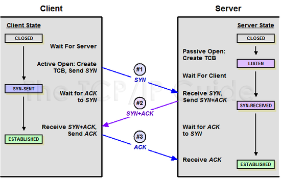
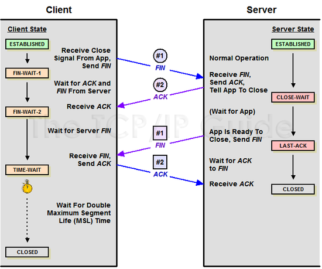

# 05장. 트랜스포트 계층

트랜스포트 계층은 애플리케이션 식별과 요구에 맞는 전송 제어를 수행함으로써 네트워크와 애플리케이션을 연결한다.  
네트워크 계층은 다양한 네트워크를 넘어 통신 상대에 패킷이 도달하도록 하는 것까지 책임을 진다.  

트랜스포트 계층에서는 포트 번호로 패킷을 전달하는 애플리케이션을 식별하고, 애플리케이션 요건에 따라 패킷 송수신량을 제어하거나 전송 도중에 손실된 패킷을 재전송한다.  
트랜스포트 계층에서는 UDP, TCP 프로토콜을 사용한다. 즉시성을 요구할 떄는 UDP, 신뢰성을 요구할 때는 TCP를 사용한다.  

 

## UDP

UDP는 음성 통신, 이름 결정, DHCP, 시각 동기화 등 즉시성을 요하는 애플리케이션에서 사용한다.  
커넥션리스 타입 프로토콜로 UDP 커넥션이라는 통신로를 만들고 애플리케이션 데이터를 송신하며, 포맷을 간단하게 하거나 확인 응답을 생략하는 등 즉시성을 향상하는 것을 목표로 한다.  

 

### UDP 패킷 포맷

UDP는 RFC768로 표준화된 프로토콜로 IP 헤더의 프로토콜 번호는 '17'로 정의되어 있다.  
UDP는 즉시성을 중시하여 패킷 포맷또한 매우 간단하다. 구성하는 헤더 필드는 4개뿐이고, 헤더의 길이도 8바이트밖에 되지 않는다.  

 - `송신지/수신지 포트 번호`
    - 포트 번호는 애플리케이션 식별에 사용되는 2바이트 필드이다.
    - 클라이언트는 커넥션을 만들 때, OS가 정한 범위에서 무작위로 할당한 값을 송신지 포트 번호로, 애플리케이션별로 정의된 값을 수신지 포트 번호로 설정하고 서버에 전송한다.
    - 데이터그램을 받은 서버는 수신지 포트 번호를 보고, 어떤 애플리케이션의 데이터인지 판별해 해당 애플리케이션에 데이터를 전달한다.
 - `UDP 데이터그램 길이`
    - UDP 데이터그램 길이는 UDP 헤더와 UDP 페이로드를 합친 데이터 전체 길이를 나타내는 2바이트 필드이다.
    - 최솟값은 UDP 헤더만으로 구성된 경우 '8', 최댓값은 MTU에서 IP 헤더의 길이를 뺸 값이다.
 - `체크섬`
    - 체크섬은 받아들인 UDP 데이터그램의 손상 여부 정합성 체크에 사용되는 2바이트 필드이다.
    - UDP 체크섬 검증에는 IP 헤더 체크섬과 마찬가지로 '1의 보수 연산'을 사용한다.

 

### 포트 번호

송신지 포트 번호는 돌아올 패킷을 위해 부여한다.  
수신지 포트 번호를 보고 서버 애플리케이션을 식별한다.  
 - HTTP 서버 애플리케이션: TCP/80
 - HTTPS 서버 애플리케이션: TCP/443
 - DNS 서버 애플리케이션: UDP/53
 - NTP 서버 애플리케이션: UDP/123

 

포트 번호는 애플리케이션에서 동작하는 애플리케이션을 식별하는 2바이트 숫자로 0 ~ 65535번까지 있으며, System Ports, User Ports, Dynamic and/ or Private Ports 3가지로 분류된다.  
이중에 System Ports와 User Ports는 주로 서버 애플리케이션을 식별하는 포트 번호로 수신지 포트 번호에 사용된다.  
Dynamic and/or Private Ports는 주로 클라이언트 애플리케이션을 식별하는 포트 번호로 송신지 포트 번호에 사용된다.  
 - 0 ~ 1023 포트: , 일반적인 애플리케이션에서 사용
 - 1024 ~ 49151 포트: User Ports, 제조사의 고유 애플리케이션에서 사용
 - 49152-53325 포트: Dynamic and/or Private Ports, 클라이언트 측에서 무작위로 할당 관리
 - `System Ports(wll-known ports)`
    - 0 ~ 1023 포트를 사용하며, 웰노운 포트로 알려져 있다.
    - System Ports는 ICANN의 인터넷 자원 관리 기능인 IANA에 의해 관리되며, 일반적인 서버 애플리케이션에 사용한다.
        - UDP 123번은 ntpd나 xntpd 등 시각 동기화에 사용하는 NTP 서버 애플리케이션으로 사용
        - TCP 80번은 Apache나 IIS, nginx 등 웹사이트에 사용하는 HTTP 서버 애플리케이션으로 사용
        - FTP 데이터(TCP 20번 포트), FTP 제어(TFP 21번 포트), SSH(TCP 22번  포트), Telnet(TCP 23번 포트), SMTP(TCP 25번 포트), DNS(UDP 및 TCP 53번 포트), HTTP(TCP 80번 포트), POP3(TCP 110번 포트), HTTPS(TCP 443번 포트)
 - `User Ports`
    - 1024 ~ 49151 포트를 사용한다.
    - SQL Server(TCP 1433번 포트), Oracle DB(TCP 1521번 포트), MySQL(TCP 3306번 포트), Apache Tomcat(TCP 8080번 포트) 등
 - `Dynamic and/or Private Ports`
    - 49512 ~ 65535 포트를 사용한다.
    - IANA에 의해 관리되지 않으며, 클라이언트 애플리케이션이 커넥션을 만들 때 송신지 포트 번호로 무작위로 할당한다.
    - OS마다 무작위로 할당하는 포트 번호의 범위는 조금씩 다르다.

 

### 방화벽 동작(UDP)

방화벽은 송신지/수신지 IP 주소나 트랜스포트 계층 프로토콜, 송신지/수신지 포트 번호로 커넥션을 식별하고, 송신을 제어하는 기기이다.  
방화벽이 가진 통신 제어 기능을 스테이트풀 인스펙션이라 부르며, 통신 허가/거부를 정의하는 필터링 규칙, 통신을 관리하는 커넥션 규칙을 사용해 통신을 제어한다.  

 - `필터링 규칙`
    - 필터링 규칙은 허가할 통신과 거부할 통신의 형태를 정의한다.
    - 송신지 IP 주소, 수신지 IP 주소, 프로토콜, 송신지 포트 번호, 수신지 포트 번호, 통신 제어 등의 설정 항목으로 구성된다.
    - 필터링 규칙 예시
        - 송신지 IP 주소: 192.168.1.0/24
        - 수신지 IP 주소: ANY
        - 프로토콜: TCP
        - 송신지 포트 번호: ANY
        - 수신지 포트 번호: 80
        - 통신 제어: 허가
 - `커넥션 테이블`
    - 방화벽은 자신을 경유하는 커넥션 정보를 커넥션 테이블이라는 메모리상의 테이블로 관리한다.
    - 송신지 IP 주소, 수신지 IP 주소, 프로토콜, 송신지 포트 번호, 수신지 포트 번호, 커넥션 상태, 아이들 타임아웃 등 각종 요소로 만들어지는 복수의 커넥션 엔트리로 구성된다.

 

## TCP

TCP는 메일이나 파일 전송, 웹브라우저 등 데이터를 전송의 신뢰성을 요구하는 애플리케이션에서 사용한다.  
TCP는 애플리케이션 데이터를 송신하기 전에 TCP 커넥션이라는 논리적인 통신로를 만들어 통신 환경을 구축하고, TCP 커넥션은 각각의 단말에서 볼 때, 송신 전용으로 사용하는 송신 파이프와 수신 전용으로 사용하는 수신 파이프로 구성된다.  

 

### TCP 패킷 포맷

TCP는 RFC793을 기반으로 표준화된 프로토콜로 IP 헤더의 프로토콜 번호는 '6'으로 정의되어 있다.  

 - `송신지/수신지 포트 번호`
    - 애플리케이션의 식별에 사용되는 2바이트 필드
    - 클라이언트는 OS가 결정한 범위에서 무작위로 할당한 값을 송신지 포트 번호에, 애플리케이션별로 정의된 값을 수신지 포트 번호에 설정하고 서버에 송신한다.
 - `시퀀스 번호`
    - TCP 세그먼트를 올바른 순서로 정렬하기 위해 사용되는 4바이트 필드
    - 송신측 단말은 애플리케이션에서 받은 데이터의 각 바이트에 대해 초기 시퀀스 번호에서 연번을 부여한다. 수시측 단말은 받은 TCP 세그먼트의 시퀀스 번호를 확인하고, 번호순으로 정렬해 애플리케이션에 전달한다.
    - 시퀀스 번호는 3Way-Handshake할 때 무작위 값이 초기 시퀀스 번호로 설정되어 TCP 세그먼트를 송신할 때마다 송신한 바이트 수만큼 더해진다. 4바이트를 넘으면 '0'부터 다시 증가한다.
 - `확인 응답 번호`
    - 확인 응답 번호(ACK 번호)는 다음으로 받을 데이터 순번을 전달하기 위해 사용되는 4바이트 필드
    - 쉽게, 클라이언트가 서버에게 다음에 이 시퀀스 번호 이후의 데이터를 전달해주면 된다고 알리기 위해 보낸다.
    - TCP는 시퀀스 번호와 확인 응답 번호(ACK 번호)를 활용해 데이터 신뢰성을 확보한다.
 - `데이터 오프셋`
    - TCP 헤더의 길이를 나타내는 4비트 필드
    - 단말은 이 값을 보고, 어디까지 TCP 헤더인지 알 수 있다.
    - TCP 헤더의 길이가 4바이트 단위로 환산한 값이 들어간다.
 - `컨트롤 비트`
    - 커넥션의 상태를 제어하는 필드
    - 8비트 플래그로 구성된다.
        - 1번째 비트(CWR): ECN-Echo에 따라 혼잡 윈도우가 줄어든 것을 알리는 플래그
        - 2번재 비트(ECE): 혼잡이 발생한 것을 통신 상대에게 알리는 플래그
        - 3번째 비트(URG): 긴급을 나타내는 플래그
        - 4번쨰 비트(ACK): 확인 응답을 나타내는 플래그
        - 5번째 비트(PSH): 빠르게 애플리케이션에 데이터를 전달하는 플래그
        - 6번쨰 비트(RST): 커넥션을 강제로 끊는 플래그
        - 7번쨰 비트(SYN): 커넥션을 여는 플래그
        - 8번째 비트(FIN): 커넥션을 닫는 플래그
 - `윈도우 크기`
    - 받은 데이터 크기를 알리기 위한 필드
    - 윈도우 크기는 2바이트로 구성되며, 최대 65535 바이트까지 알릴 수 있어 '0'이 더이상 받을 수 없음을 나타낸다.
    - 송신측 단말은 윈도우 크기가 '0'인 패킷을 받으면 일단 송신을 멈춘다.
 - `체크섬`
    - 받은 TCP 세그먼트가 손상되지 않았는지 정합성을 체크하기 위해 사용하는 2바이트 필드
    - '1의 보수 연산'을 사용한다.
    - TCP 세그먼트를 받은 단말은 검증에 성공하면 세그먼트를 받는다.
 - `긴급 포인터`
    - 컨트롤 비트의 URG 플래그가 '1'로 설정되었을 대만 유효한 2바이트 필드
    - 긴급 데이터가 있을 때 긴급 데이터를 나타내는 가장 마지막 바이트의 시쿠너스 번호가 설정된다.
 - `옵션`
    - TCP에 관련된 확장 기능을 알리기 위해 사용되는 4바이트 필드
    - 옵션 리스트의 조합은 OS나 그 옵션에 따라 다르다.

 

### TCP에서의 상태 전이

TCP 에서는 컨트롤 비트를 구성하는 8개 플래그를 '0'또는 '1'로 설정해 TCP 커넥션 상태를 제어한다.  

 - `접속 시작 단계`
   - TCP 커넥션은 3 Way HandShake로 커넥션을 여는 것에서 시작한다.
   - 1번째: 3Way HandShake를 시작하기 전 클라이언트는 Closed, 서버는 Listen 상태이다.
   - 2번째: 클라이언트는 SYN 플래그를 '1', 시퀀스 번호에 무작위값을 설정한 SYN 패킷을 송신하고, 오픈 처리에 들어간다. 이 처리에 따라 클라이언트는 SYN-SENT 상태로 이동하고, 계속해서 SYN/ACK 패킷을 기다린다.
   - 3번쨰: SYN 패킷을 받아들인 서버는 패시브 오픈 처리에 들어간다. SYN 플래그와 ACK 플래그를 '1'로 설정한 SYN/ACK 패킷을 반호나하고 SYN-RECEIVED 상태로 이동한다. 또한, 이때의 시퀀스 번호는 무작위, 확인 응답 번호는 SYN 패킷의 시퀀스 번호에 '1'을 더한 값이 된다.
   - 4번째: SYN/ACK 패킷을 받아들인 클라이언트는 ACK 플래그를 '1'로 설정한 ACK 패킷을 반환하고, ESTABLISHED 상태로 이동한다. (커넥션 완료) 이 상태가 되면 처음으로 실제 애플리케이션 데이터를 송수신할 수 있게 된다.
   - 5번째: ACK 패킷을 받아들인 서버는 ESTABLISHED 상태로 이동한다. 이제까지의 시퀀스 번호와 확인 응답 번호의 교환에 따라, 애플리케이션 데이터의 최초에 부여된 시퀀스 번호가 각각 확정한다.
 - `접속 확립 단계`
   - 3 Way HandShake가 완료되면 실제 애플리케이션 데이터의 교환이 시작한다. TCP는 애플리케이션 데이터 전송의 신뢰성을 확보하기 위해 흐름 제어, 혼잡 제어, 재전송 제어 3가지 제어를 조합해 전송한다.
   - __흐름 제어__
      - 흐름 제어는 수신측 단말이 수행하는 흐름양 조정이다.
      - 수신측 단말은 윈도우 크기 필드를 사용해 자신이 받을 수 있는 데이터양을 알린다.
      - 송신측 단말은 윈도우 크기 이내에는 확인 응답(ACK)을 기다리지 않고 계속 TCP 세그먼트를 보내지만, 그 이상의 데이터는 보내지 않는다.
   - __혼잡 제어__
      - 혼잡 제어는 송신측 단말이 수행하는 흐름양 조정이다.
      - TCP는 대량의 송신 패킷에 의해 네트워크가 혼잡하지 않도록 혼잡 제어 알고리즘을 이용해 패킷 송신 수를 제어한다. (혼잡하면 혼잡 윈도우를 줄이고, 혼잡하지 않으면 윈도우를 늘린다.)
      - 혼잡 제어 알고리즘은 로그 기반, 지연 기반, 하이브리드 기반 3가지로 나눌 수 있다.
         - 로그 기반: 패킷 로스(유실)가 발생하면 혼잡이라고 판단
         - 지연 기반: 지연이 발생하면 혼잡이라고 판단
         - 하이브리드 기반: 패킷 유실과 지연 양쪽을 종합적으로 고려해 혼잡이라고 판단
   - __재전송 제어__
      - 재전송 제어는 패킷 유실이 발생했을 때 수행하는 패킷 재전송 기능이다.
      - TCP는 ACK 패킷을 통해 패킷 유실을 감지하고, 패킷을 재전송한다.
      - 중복 ACK: 수신측 단말은 받은 TCP 세그먼트의 시퀀스 번호가 듬성하면 패킷 유실이 발생했다고 판단해 확인 응답이 같은 ACK 패킷을 연속해서 송출한다. 이 ACK 패킷을 중복 ACK라 부르며, 송신측 단말은 일정 수 이상 중복 ACK를 받으면 대상이 되는 TCP 세그먼트를 재전송한다.
      - 재전송 타임아웃: 송신측 단말은 TCP 세그먼트를 송신한 뒤 ACK(확인 응답) 패킷을 기다리기까지의 시간을 재전송 타이머로 유지한다.
 - `접속 종료 단계`
   - 애플리케이션 데이터 교환을 마치면 커넥션 종료 처리에 들어간다.
   - 커넥션을 종료할 때는 4 Way HandShake 과정을 거치게 된다.
      - 1번쨰: 클라이언트는 데이터 교환 이후에 애플리케이션으로부터 Close 요청이 들어오면 액티브 클로즈 처리를 시작한다. FIN 플래그와 ACK 플래그를 '1'로 한 FIN/ACK 패킷을 송싱한다.
      - 2번째: FIN/ACK 패킷을 받은 서버는 패시브 클로즈 처리를 시작한다. FIN/ACK 패킷에 대한 ACK 패킷을 송신하고, 애플리켕션에 대해 Close 처리 요청한다. (CLOSE-WAIT 상태)
      - 3번째: ACK를 받은 클라이언트는 서버로부터의 FIN/ACK 패킷을 기다리는 FIN-WAIT2 상태로 이동한다.
      - 4번재: 서버는 애플리케이션으로부터 Close 요청이 있으면 FIN/ACK 패킷을 송신하고 자신이 송신한 FIN/ACK 패킷에 대한 ACK 패킷, 클로즈 처리에 대한 최후의 ACK를 기다리는 LAST-ACK 단계로 이동한다.
      - 5번째: 서버로부터 FIN/ACK를 받은 클라이언트는 그에 대해 ACK 패킷을 반송하고 TIME_WAIT 상태로 이동한다.
      - 6번째: ACK 패킷을 받은 서버는 CLOSED 상태로 이동하고, 커넥션을 삭제한다. (커넥션에 확보하고 있던 자원을 모두 해제, 패시브 클로즈 종료)
      - 7번째: TIME-WAIT에 이동한 클라이언트는 설정된 시간을 기다리는 CLOSED 상태로 이동해 커넥션을 삭제한다.

    
   접속 시간 단계 
   1. 클라이언트는 서버에 접속을 요청하는 SYN 패킷을 보내며, SYN/ACK 응답을 기다리는 SYN_SENT 상태가 된다. 
   2. 서버는 SYN 요청을 받고 클라이언트에 ACK와 SYN flag가 설정된 패킷을 발송하며, 클라이언트의 ACK 응답을 기다리는 SYN_RECEIVED 상태가 된다. 
   3. 클라이언트는 서버에 ACK를 보내며, 데이터를 송수신할 수 있는 ESTABLISHED 상태가 된다.

 

    
   접속 종료 단계 
   1. 클라이언트는 연결을 종료하겠다는 FIN 플래그를 전송한다.  
   2. 서버는 확인 응답(ACK)을 보내고, 자신의 통신이 끝날때까지 기다리는 TIME_WAIT 상태가 된다. 
   3. 서버는 통신이 끝났으면 클라이언트에게 연결이 종료되었다는 FIN 플래그를 전송한다. 
   4. 클라이언트는 확인 응답(ACK)을 보낸다.

 

### 다양한 옵션 기능

 - `TCP Fast Open`
   - 3 Way HandShake는 TCP 커넥션을 만들기 위해 필요한 처리이다. 하지만, 한 번의 왕복 지연 시간 + 처리 지연 시간 동안 데이터를 송신할 수 없기 때문에 시간이 오래걸린다.
   - 최초의 3 Way HandShake 과정을 거치고, 이후 옵션 필드로 TCP Fast Open에 필요한 정보(TFO Cookie)를 교환한다.
 - `Nagle 알고리즘`
   - 데이터 크기가 작은 TCP 세그먼트를 모아서 송신하는 기능
   - TCP는 신뢰성을 확보하기 위해 확인 응답을 하면서 데이터를 송신한다.
   - Naggle 알고리즘은 MSS보다 작은 TCP 세그먼트를 모아서 송신함으로써 교환할 TCP 세그먼트 수를 줄이는 동시에 패킷의 왕복도 줄인다.
 - `지연 ACK`
   - 데이터 크기가 작은 TCP 세그먼트에 대한 확인 응답을 늦추는 기능
   - 지연 ACK는 MSS를 가득 채우지 않은 작은 TCP 세그먼트에 대해 확인 응답을 일정 시간 또는 일정 개수만큼 늦춰 여러 ACK를 하나로 모아서 반환하여 통신 효율을 높인다.
 - `Early Retransmit`
   - Fast Retransmit이 발동하지 않는 특정 TCP 환경에서의 중복 ACK의 임계값을 낮춰서 Fast Retransmit을 유발하는 기능
 - `Tail Loss Probe`
   - 송신한 일련의 TCP 세그먼트 중 가장 마지막 부분이 유실되었을 때 재전송 타임아웃보다 빠르게 재전송을 시도하는 기능

