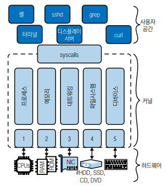
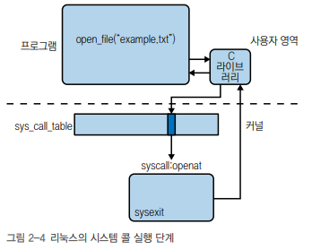
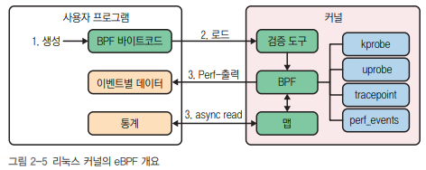

# 리눅스 커널

## 1. 리눅스 아키텍처

 - __하드웨어 계층__
    - CPU와 메인 메모리부터 디스크 드라이브, 네트워크 인터페이스, 키보드, 모니터 등 주변 디바이스까지 모두 일컫는다.  
 - __커널 계층__
    - 커널과 사용자 영역 사이에는 init 시스템과 시스템 서비스처럼 많은 구성요소가 있다.
 - __사용자 영역 계층__
    - 셸 같은 운영체제 구성요소, ps나 ssh 같은 유틸리티, X윈도우 시스템 기반 데스크톱 같은 그래픽 사용자 인터페이스(GUI)를 비롯해 대부분의 앱이 실행되는 곳을 일컫는다.

<div align="center">
    
</div>
<br/>

셸이나 grep, find, ping 같은 유틸리티처럼 일반적으로 리눅스 운영체제 일부로 많은 것이 커널의 일부가 아니라 사용자 영역의 일부이다.  
모든 앱이 사용자 영역에서 실행되기 때문에 커널 개발자가 아닌 이상 거의 항상 커널 모드를 무시할 수 있다.  

<br/>

## 2. CPU 아키텍처

유닉스와 리눅스는 전통적으로 자체 부트스트랩을 위해 BIOS를 사용한다. 리눅스 노트북은 전원을 켜고 나면 완전히 하드웨어로 제어된다. 하드웨어는 BIOS의 일부인 POST(Power On Self Test)를 실행하도록 연결된다. POST는 하드웨어(RAM 등)가 지정된 대로 동작하는 지 확인한다.  

모던 환경에서는 이러한 BIOS 기능이 운영체제와 플랫폼 펌웨어 간의 소프트웨어 인터페이스를 정의하는 공개 사양인 UEFI(Unified Extensible Firmware Interface)로 대체됐다.  

<br/>

### BIOS (Basic Input/Output System)

BIOS는 컴퓨터의 전원을 켤 때 가장 먼저 실행되는 펌웨어로, 하드웨어의 초기화 및 기본 입출력 기능을 제공합니다. BIOS는 ROM(Read-Only Memory)에 저장되어 있으며, 컴퓨터를 부팅할 때 마더보드의 BIOS 칩에서 실행됩니다.  
 - 부팅 로더(Boot Loader): BIOS는 하드 디스크나 다른 부팅 가능한 장치로부터 운영 체제를 로드하는 부팅 로더를 실행합니다.
 - 하드웨어 초기화(Hardware Initialization): BIOS는 컴퓨터의 주요 하드웨어 구성 요소를 초기화하고 감지합니다. 이는 CPU, 메모리, 그래픽 카드, 저장 장치 등을 포함합니다.
 - 시스템 설정 관리(System Configuration Management): BIOS는 사용자가 시스템 설정을 변경하고 관리할 수 있는 인터페이스를 제공합니다. 이는 부팅 장치의 우선 순위, 시간 설정, 하드웨어 구성 등을 포함합니다.

<br/>

### UEFI (Unified Extensible Firmware Interface)
UEFI는 BIOS의 후속 기술로, 더욱 유연하고 강력한 부팅 인터페이스를 제공합니다. UEFI는 BIOS보다 더욱 강력한 그래픽 사용자 인터페이스와 네트워크 부팅 지원을 포함한 다양한 기능을 제공합니다.  
 - 그래픽 사용자 인터페이스(GUI): UEFI는 BIOS의 텍스트 기반 인터페이스 대신 그래픽 사용자 인터페이스를 제공하여 사용자가 시스템 설정을 더욱 직관적으로 관리할 수 있습니다.
 - 네트워크 부팅 지원(Network Booting Support): UEFI는 네트워크를 통해 운영 체제를 부팅할 수 있는 기능을 제공하여 관리자가 리모트로 시스템을 관리하고 복구할 수 있도록 합니다.
 - 보안 기능(Security Features): UEFI는 BIOS보다 더욱 강력한 보안 기능을 제공합니다. 이는 Secure Boot와 같은 기능을 통해 시스템의 부팅 과정을 보호하고 악성 코드의 실행을 방지합니다.

<br/>

#### CPU 확인하기

```bash
$ lscpu
$ cat /proc/cpuinfo
```
<br/>

 - __x86 아키텍처__
    - x86 아키텍처는 원래 인텔에서 개발했으며 나중에 AMD에도 라이선스된 명령어 세트 제품군으로, 커널 내에서 x64는 인텔 64비트 프로세서를 나타내고 x86은 인텔 32비트를 뜻하며, amd64는 AMD 64비트 프로세서를 말한다.
 - __ARM 아키텍처__
    - ARM은 RISC 아키텍처 제품군으로 RISC는 일반적으로 더 빠르게 실행할 수 있는 작은 명령어 세트와 많은 일반 CPU 레지스터로 구성된다.
    - ARM은 x86 칩보다 빠르고 저렴하며 발열량이 적기 때문에 데이터 센터에서 AWS 그래비톤 같은 ARM 기반 CPU가 점점 더 많이 발견된다.
 - __RISC-V 아키텍처__
    - RISC-V는 원래 UC버클리에서 개발한 개방형 RISC 표준이다.

<br/>

## 3. 커널 구성요소

리눅스 커널은 모놀리식 커널이지만, 코드베이스에는 특정 역할을 식별하고 부여할 수 있는 기능 영역이 나뉘어 있다.  
 - 프로세스 관리: 실행 파일을 기반으로 프로세스를 시작함
 - 메모리 관리: 프로세스에 메모리를 할당하거나 파일을 메모리에 매핑함
 - 네트워킹: 네트워크 인터페이스 관리나 네트워크 스택 제공함
 - 파일시스템: 파일 관리를 제공하고, 파일 생성과 삭제를 지원함
 - 캐릭터 디바이스와 디바이스 드라이버 관리

<br/>

### 프로세스 관리

커널에는 프로세스 관리와 관련된 부분이 많이 존재하며, 그중 일부는 인터럽트 같은 CPU 아키텍처 관련 사항을 처리하고, 다른 부분은 프로그램 실행과 스케줄링에 중점을 둔다.  

 - __세션__: 하나 이상의 프로세스 그룹을 포함하고 선택적으로 tty가 연결된 상위 수준의 사용자 대면 유닛을 나타낸다. 커널은 세션 ID(SID)라는 번호를 통해 세션을 식별한다.
 - __프로세스 그룹__: 하나 이상의 프로세스가 포함돼 있으며 한 세션에는 포어그라운드 프로셋스 그룹이 둘 이상일 수 없다. 커널은 프로세스 그룹 ID(PGID)라는 숫자를 통해 프로세스 그룹을 식별한다.
 - __프로세스__: 여러 리소스를 그룹으로 추상화한 것이며, 커널은 /proc/self를 통해 현재 프로세스를 사용자에게 노출한다. 커널은 프로세스 ID(PID)라는 숫자를 통해 프로세스를 식별한다.
 - __스레드__: 커널에 의해 프로세스로 구현된 유닛을 말한다. 즉 스레드를 나타내는 전용 데이터 구조는 없고, 스레드는 특정 리소스를 다른 프로세스와 공유하는 프로세스다. 커널은 스레드 ID(TID)와 스레드 그룹(TGID)를 통해 스레드를 식별하며, 공유된 TGID 값은 멀티스레드 프로세스를 의미한다.
 - __태스크__: 커널에는 sched.h에 정의된 task_struct라는 데이터 구조가 있으며, 이는 프로세스와 스레드 구현의 기반을 형성한다. 이 데이터 구조는 스케줄링 관련 정보, 식별자, 시그널 처리기, 성능이나 보안과 관련된 기타 정보를 수집한다.

<br/>

### 메모리 관리

물리 메모리와 가상 메모리는 모두 페이지라고 부르는 고정 길이의 청크로 나뉜다. 페이지 테이블은 프로세스의 가상 페이지를 주 메모리(RAM)의 물리적 페이지에 매핑한다.  

각 프로세스 수준의 페이지 테이블을 통해 여러 가상 페이지가 동일한 물리적 페이지를 가리킬 수 있다. 즉, 기존 공간을 최적으로 사용하면서 각 프로세스에 그들의 페이지가 실제로 RAM에 존재한다는 효과를 일으킨다.  

CPU가 프로세스의 가상 페이지에 접근할 때마다 원칙적으로는 CPU는 프로세스가 사용하는 가상 주소를 이에 해당하는 물리적 주소로 변환해야 한다. 최신 CPU 아키텍처는 이 프로세스의 속도를 높이기 위해 TLB라는 조회용 온칩을 지원한다. TLB는 매우 작은 캐시로, 누락된 경우 CPU가 프로세스 페이지를 통해 페이지의 물리적 주소를 계산하고 TBL를 업데이트한다.  

```bash
# 물리적 메모리(Ram)에 대한 세부 정보 나열
$ grep MemTotal /proc/meminfo

# 가상 메모리에 대한 세부 정보 나열
$ grep VmallocTotal /proc/meminfo

# 대형(huge) 페이지 정보 나열
$ grep Huge /proc/meminfo
```
<br/>

### 네트워킹

커널의 중요한 기능 중 하나는 네트워킹 기능이다. 웹을 검색하거나 원격 시스템에 데이터를 복사하려면 네트워크에 의존한다. 리눅스의 네트워크 스택은 계층화된 아키텍처를 따른다.  

아래 3 가지 작업은 커널이 처리하며, HTTP나 SSH 같은 애플리케이션 계층 프로토콜은 주로 사용자 영역에서 구현된다.  

 - __소켓__: 추상화 커뮤니케이션을 위해 필요
 - __전송 제어 프로토콜(TCP) 및 사용자 데이터그램 프로토콜(UDP)__: 각각 연결형 통신과 비연결형 통신용
 - __인터넷 프로토콜(IP)__: 기기의 주소 지정을 위해 필요

```bash
# ip route는 라우팅 정보를 제공한다.
$ ip link
```
<br/>

### 파일시스템

리눅스는 파일시스템을 사용해 하드 디스크 드라이브(HDD), 솔리드 스테이트 드라이브(SSD), 플래시 메모리 같은 저장 디바이스의 파일과 디렉토리를 구성한다. ext4, btrfs, NTFS 같은 다양한 유형의 파일시스템이 있으며 동일한 파일시스템의 인스턴스도 여러 개 사용할 수 있다.  

가상 파일시스템은 원래 여러 파일 시스템 유형과 인스턴스를 지원하기 위해 도입됐다. VFS의 최상위 계층은 열기, 닫기, 읽기, 쓰기 기능 등 공통 API 추상화를 제공하며, VFS의 최하위 계층은 주어진 파일시스템에 대한 플러그인이라고 불리는 파일시스템 추상화이다.  

<br/>

### 디바이스 드라이버

드라이버는 커널에서 실행되는 코드로 키보드, 마우스, 하드 디스크 드라이브 같은 실제 하드웨어 디바이스나 /dev/pts/ 아래의 의사 터미널 같은 의사 디바이스를 관리하는 것이다.  
 - 드라이버는 커널에 정적으로 빌드될 수도 있고, 필요할 떄 동적으로 로드될 수 있도록 커널 모듈로 빌드될 수도 있다.

```bash
# 리눅스 시스템 디바이스 개요 출력
$ ls -al /sys/devices/

# 마운트된 디바이스 목록 출력
$ mount
```
<br/>

### 시스템 콜

새로운 파일을 생성하거나, 파일을 다운로드하기 위해 바이트 읽기와 같은 상위 수준의 명령을 일련의 구체적인 아키텍처 종속 단계로 전환하도록 리눅스에 요청하게 된다. 즉, 커널이 노출하는 서비스 인터페이스와 해당 사용자 영역의 엔티티 호출은 시스템 호출의 모음이라 하며, 스스템 콜이라 부른다.  

리눅스에는 수백 개의 시스템 콜이 존재한다. 우리 프로그램은 일반적으로 시스템 콜을 직접 호출하지 않고 C 표준 라이브러리라고 부르는 것을 통해 호출한다. 표준 라이브러리는 래퍼 기능을 제공하며 glibc나 musl 같은 다양한 구현체에서 사용할 수 있다.  

래퍼 라이브러리는 시스템 콜 실행의 반복적인 저수준 처리를 다룬다. 시스템 콜은 소프트웨어 인터럽트로 구현되기에 예외 처리기로 제어권을 넘기는 예외를 발생시킨다.  

 - 1. syscall.h와 아키텍처 종속 파일에 정의되어 메모리에 있는 함수 포인터 배열을 통해 시스템 콜과 해당 핸들러를 추적한다.
 - 2. 시스템 콜 멀티플렉서처럼 동작하는 system_call() 함수를 사용하면 먼저 하드웨어 컨텍스트를 스택에 저장한 다음 검사를 수행하고, 그 이후에 sys_call_table의 각 시스템 콜 번호의 인덱스가 가리키는 함수로 점프한다.
 - 3. sysexit로 시스템 콜이 완료되면 래퍼 라이브러리는 하드웨어 컨텍스트를 복원하고, 프로그램 실행은 사용자 영역에서 다시 시작된다.

<div align="center">
   
</div>
<br/>

 - `strace 명령어`
   - strace는 시스템 내부에서 무슨 일이 일어나고 있는지 확인하기 위해 사용할 수 있다.
   - strace는 사용자 영역과 커널 사이에 이벤트 라이브 스트림을 가로채는 방식으로 어떤 시스템 호출이 어떤 순서로 어떤 인수를 사용해 호출되었는지 정확하게 파악하기 위해 유용하다.
```bash
# ls 명령어의 내부 이벤트 확인
$ strace ls
```
<br/>

 - `시스템 콜 예시`
   - 프로세스 관리: clone, fork, execve, wait, exit, getpid, setuid, setns, getrusage, capset, ptrace
   - 메모리 관리: brk, mmap, munmap, mremap, mlock, mincore
   - 네트워킹: socket, setsockopt, getsockopt, bind, listen, accept, connect, shutdown, recvfrom, recvmsg, sendto, sethostname, bpf
   - 파일시스템: open, openat, close, mknod, rename, truncate, mkdir, rmdir, getcwd, chdir, chroot, getdents, link, symlink, unlink, umask, stat, chmod, utime, access, ioctl, flock, read, write, lseek, sync, select, poll, mount
   - 시간: time, clock_settime, timer_create, alarm, nanosleep
   - 시그널: kill, pause, signalfd, eventfd
   - 전역: uname, sysinfo, syslog, acct, _sysctl, iopl, reboot

<br/>

### 커널 확장

 - `현재 사용 중인 커널 버전 확인`
```bash
$ uname -srm
```
<br/>

#### 모듈

모듈은 요청 시 커널에 로드할 수 있는 프로그램이다. 즉, 커널을 다시 컴파일하거나 시스템을 재부팅할 필요가 없다. 최근의 리눅스는 대부분의 하드웨어를 자동으로 감지해 해당 모듈을 자동으로 로드한다.  

```bash
# 사용 가능한 모듈 목록 출력
$ find /lib/modules/$(uname -r) -type f -name '*.ko*'

# 커널이 실제로 로드한 모듈 목록 출력
$ lsmod

# 종속성 목록 확인
$ modprobe --show-depends async_memcpy
```
<br/>

#### 커널을 확장하는 현대적인 방법: eBPF

eBPF(extended Berkeley Packet Filter)는 리눅스 커널에서 실행되는 프로그램의 형태로, 네트워크 처리, 보안, 트레이싱 및 성능 모니터링과 같은 다양한 용도로 사용됩니다. eBPF는 초기의 Berkeley Packet Filter(BPF)를 확장하여 더욱 강력한 기능과 유연성을 제공합니다.  
 - __eBPF는 리눅스 커널의 기능이며, 이를 활용하려면 리눅스 커널 버전 3.15+ 필요하다.__
 - 커널 내부에서 실행: eBPF 프로그램은 리눅스 커널 내부에서 실행되므로, 커널의 자원 및 기능에 접근할 수 있습니다. 이를 통해 커널 내에서 동적으로 패킷 처리, 시스템 콜 훅, 이벤트 추적 등 다양한 작업을 수행할 수 있습니다.
 - 유연한 프로그래밍 모델: eBPF는 프로그래밍 언어로 C 언어를 사용하며, JIT(just-in-time) 컴파일러를 통해 실행 코드로 변환됩니다. 이를 통해 다양한 용도에 맞는 높은 수준의 최적화와 유연성을 제공합니다.
 - 동적 프로그램 로딩: eBPF는 동적으로 프로그램을 로드하고 언로드할 수 있습니다. 따라서 시스템이 실행 중일 때도 새로운 기능을 도입하거나 수정할 수 있습니다.
 - 다양한 용도: eBPF는 네트워크 패킷 처리, 보안 및 인터넷 트래픽 필터링, 시스템 콜 추적 및 모니터링, 컨테이너 및 마이크로서비스 보안 등 다양한 용도로 사용됩니다.
 - 성능 향상: eBPF는 커널 내에서 실행되므로 매우 효율적이며, 최적화된 JIT 컴파일러를 사용하여 높은 성능을 제공합니다.

<div align="center">
   
</div>
<br/>

 - __eBPF 활용 사례__
   - 쿠버네티스에서 포드 네트워킹을 활성화하기 위한 CNI 플러그인
      - 대표적인 예로, 실리움과 프로젝트 칼리코에서 사용된다. 또한, 서비스 확장성을 위해서도 사용된다.
   - 관측가능성용
      - iovisor/bpftrace 같은 리눅스 커널 추적과 허블을 사용한 클러스터 설정의 경우를 위해 사용된다.
   - 보안 제어 역할
      - CNCF 팔코와 같은 프로젝트에서 활용하듯이 컨테이너 런타임 스캔을 수행할 수 있다.
   - 네트워크 로드밸런싱용
      - 페이스북의 L4 카트란 라이브러리에서 활용하듯이 로드밸런서로도 사용된다.
