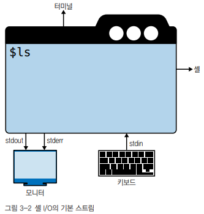
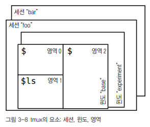

# 셸과 스크립팅

 - 셸의 구성과 기본 작업
 - 여러 세션으로 작업할 수 있게 하는 터미널 멀티플렉서
 - 스크립트를 사용한 작업 자동화
 - 스크립트를 린트로 검증하고 테스트

<br/>

## 1. 기본 개요

### 1-1. 터미널

터미널은 텍스트로 된 사용자 인터페이스(UI)를 제공하는 프로그램으로, 키보드에서 문자를 읽어 화면에 표시하는 기능을 지원한다.  
기본적인 문자 중심의 입력과 출력 이외에도 터미널은 커서, 화면 처리, 그리고 잠재적인 색상 지원이 가능하도록 이스케이프 시퀀스 또는 이스케이프 코드를 지원한다.  
 - 터미널은 고전적인 xterm, rxvt, Gnome terminator 뿐만 아니라 Alacritty, kitty, wrap 같은 GPU를 활용하는 차세대 터미널도 있다.

<br/>

### 1-2. 셸

셸은 터미널 내부에서 실행되며 명령 인터프리터 역할을 하는 프로그램으로 스트림을 통해 입력, 출력을 처리하고, 변수를 지원하며, 사용 가능한 내장 명령을 갖고 있으며, 명령 실행 및 사앹를 처리하고, 일반적으로 대화식 사용과 스크립트 사용을 모두 지원한다.  

공식적으로 셸은 sh로 정의하며, 종종 POSIX 셸 이라는 용어를 접하지만, 이는 스크립트와 이식성 맥락에서 더욱 중요하다. 창안자의 이름을 따 본 셸인 sh가 많이 쓰였지만, 최근에는 대부분 배시 셸이 sh의 자리를 대체해 기본으로 널리 쓰이고 있다.  

```bash
# 사용 중인 셸 확인: 대부분 배시 셸(bash)이 사용된다.
$ file -h /bin/sh
$ echo $0
$ echo $SHELL
```
<br/>

### 1-3. 스트림

셸은 입력과 출력을 위한 세 가지 기본 파일 디스크립터(stdin, stdout, stderr)를 모든 프로세스에 제공한다.  
이 FD들은 기본적으로 화면과 키보드에 각각 연결되어 있으며, 특정하게 지정하지 않는 한 셸에 입력하는 명령은 키보드에서 입력(stdin)을 가져오고 출력(stdout)을 화면에 전달한다.  

<div align="center">
    
</div>
<br/>

만약, 셸이 제공하는 기본값을 사용하지 않으려면 스트림을 재지정할 수 있다.  

```bash
# 2> 는 stderr 스트림을 재지정한다는 의미다.
# 1> 과 > 는 stdout이 기본값이므로 동일한 뜻이다.
# stdout과 stderr을 모두 재지정하려면 &>를 사용한다.
# 스트림을 제거하려면 /dev/null을 사용하면 된다.

# 예시 1. stdout과 stderr을 모두 /dev/null로 재지정해 모든 출력값을 버린다.
$ curl https://example.com &> /dev/null

# 예시 2. 출력값과 상태값을 다른 파일로 재지정한다.
$ curl https://example.com > /tmp/content.txt 2> /tmp/curl-status

# 예시 3. 대화식으로 값을 입력하고 파일에 저장한다. Ctrl+D를 사용해 캡처를 중지하고 콘텐츠를 저장한다.
$ cat > /tmp/interactive-input.txt

# 예시 4. stdin에서 값을 읽는 tr 명령을 사용해 모든 단어를 소문자로 만든다.
$ tr < /tmp/curl-status [A-Z] [a-z]
```
<br/>

#### 셸에서 사용되는 특수 문자

 - __앰퍼샌드(&)__: 명령 마지막에 배치되며 백그라운드에서 명령을 실행한다.
 - __백슬래시(\\)__: 긴 명령의 가독성을 높이기 위해 다음 행에서 명령을 계속할 때 사용한다.
 - __파이프(|)__: 한 프로세스의 stdout 값을 다음 프로세스의 stdin과 연결해 데이터를 파일에 임시로 저장하지 않고 바로 전달할 수 있다.

```bash
# HTML 파일을 다운로드한 다음 파일의 내용을 wc 도구를 이용해 파이프로 연결해 HTML 파일에 포함된 행 수 출력
$ curl https://example.com 2> /dev/null | \
    wc -l

# 1. curl로 URL에서 콘텐츠를 다운로드
# 2. stderr(2번) 출력은 /dev/null로 버린다.
# 3. 기본 출력인 stdout 값은 wc 명령에 입력(stdin)되며, -l 옵션으로 행의 개수를 계산하게 된다.
```
<br/>

#### 변수

변수를 사용해 값을 저장하고 변경할 수 있다. 변수는 환경변수와 셸 변수 2 가지로 나뉜다.  
셸 변수는 현재 셸에서만 유효하고, 환경 변수는 모든 셸에서 접근 가능하다.  

 - 환경 변수: 셸 전체의 설정, env 명령어로 목록을 나열한다.
 - 셸 변수: 현재 실행 상황에서만 유효하다. 배시에서 set 명령어로 목록을 나열할 수 있다. 하위 프로세스는 셸 변수를 상속하지 않는다.
 - 배시(bash)에서는 export 명령어를 사용해 환경 변수를 만들 수 있고, 변수의 값에 접근하고 싶을 때는 $를 붙이고, 변수를 제거하고 싶을 때는 unset을 사용한다.
```bash
# 셸 변수 만들기
$ set MY_VAR=42

# 환경 변수 만들기
$ export MY_GLOBAL_VAR="fun with vars"
```
<br/>

#### 종료 상태

셸은 종료 상태라고 하는 것을 사용해 명령 실행 완료를 명령 호출자에게 알린다. 일반적으로 리눅스 명령은 종료될 때 상태를 반환한다.  

종료 상태 값은 0은 명령이 오류 없이 성공적으로 실행됐음을 의미하는 반면 1~255 사이의 값은 실패를 나타낸다.  

<br/>

#### 내장 명령어

셸에는 여러 내장 명령어가 있다. 기본적으로 yes, echo, cat, read 등이 있으며, help 명령을 사용해 내장 명령어 목록을 확인할 수 있다.  
그 외 모든 것은 보통 /usr/bin(사용자 명령) 이나 /usr/sbin(관리자 명령)에 있는 셸 외부 프로그램이다.  

```bash
# ls 명령어 실행 파일 위치 찾기
$ which ls
$ type ls
```
<br/>

#### 작업 제어

작업 제어는 대부분의 셸이 지원하는 기능이다.  
기본적으로 명령을 입력하면 그 명령은 일반적으로 화면과 키보드를 제어하며, 포어그라운드에서 실행된다.  
만약, 대화식으로 실행하지 않고 stdin 입력이 전혀 없는 서버 같은 경우에 백그라운드로 프로세스를 실행해야 한다.  

```bash
# 명령 끝에 '&'를 넣으면 백그라운드에서 명령이 실행된다.
$ watch -n 5 "ls" &

# 모든 작업(job)의 목록 출력
$ jobs

# 프로세스를 포어그라운드로 가져올 수 있다.
$ fg
```
<br/>

셸은 닫은 후에도 백그라운드 프로세스를 계속 실행하려면 nohup 명령을 추가하면 된다.  
만약, 이미 실행 중인 프로세스의 경우 셸을 닫아도 계속 실행하길 원한다면 disown을 사용할 수 있다.  
마지막으로 실행 중인 프로세스를 제거하려면 kill 명령을 사용할 수 있다.  

<br/>

### 1-4. 모던 리눅스 명령어

디렉토리 이동(cd), 디렉토리 내용 나열(ls), 파일 찾기(find), 파일 내용 표시(cat, less) 명령은 너무나 자주 사용된다. 이러한 명령어는 자주 사용되는 만큼 최대한 효율적으로 사용하는 편이 좋다.  
자주 사용되는 명령 중 일부에는 이를 대체할 수 있는 모던 명령어가 있다.  

<br/>

#### exa로 디렉토리 내용 나열하기

디렉토리에 무엇이 들어있는지 알기 위해서는 ls 명령어와 매개변수를 사용한다.  
배시에서 l을 사용하며 앨리어스로는 'ls -GAhltr'을 지정하는 방식을 사용한다.  

그보다 더 나은 방법으로는 러스트 언어로 작성되고, 깃과 트리 렌더링에 대한 지원이 내장된 exa 명령어를 사용할 수 있다.  

```bash
# 현재 디렉토리 파일 및 디렉토리 목록 출력
$ exa

# 세부 정보 표시: 파일 및 디렉토리에 대한 자세한 정보(권한, 소유자, 크기 등)를 표시
$ exa -l

# 색상으로 구분된 출력: 파일 및 디렉토리 색상 구분
$ exa --color=auto

# 아이콘 표시: 파일 및 디렉토리 아이콘 표시
$ exa --icons

# 크기 단위 지정: 파일 및 디렉토리 크기를 읽기 쉬운 형식(KB, MB)으로 표시
$ exa -l -h

# 정렬: 파일 및 디렉토리를 크기 순으로 정렬하여 표시
$ exa -l -S
```
<br/>

#### bat로 파일 내용 보기

bat 명령어는 cat 명령어의 대체제로, 코드 뷰어 및 파일 검색 도구인 bat을 설치합니다. bat 명령어는 코드 파일 및 텍스트 파일을 보기 위한 강화된 형태의 출력을 제공하며, 기존의 cat 명령어보다 더 많은 기능을 제공합니다.  

bat 명령어는 주로 개발자 및 시스템 관리자들에게 유용하며, 코드 리뷰 및 파일 검색 등의 작업에 자주 사용됩니다. 단순한 파일 보기에서부터 Git 저장소 내 파일의 변경 내용 확인까지 다양한 용도로 활용됩니다.  

 - 문법 강조(Syntax Highlighting): bat은 다양한 프로그래밍 언어 및 파일 형식에 대해 문법 강조 기능을 제공하여 코드의 가독성을 향상시킵니다. 예를 들어, 코드의 키워드, 문자열, 주석 등이 색으로 구분됩니다.
 - 파일 헤더 표시: bat은 파일의 첫 부분에 파일 이름, 크기, 수정 일자 및 권한과 같은 정보를 표시합니다. 이는 파일의 기본 정보를 빠르게 확인할 수 있도록 돕습니다.
 - Git 통합: bat은 Git 저장소에서 파일을 보고 있을 때 파일의 변경 내용과 변경된 줄을 강조하여 보여줍니다. 이를 통해 파일의 변경 이력을 빠르게 파악할 수 있습니다.
 - 페이징 지원: bat은 파일을 화면에 맞게 페이징하여 보여줍니다. 따라서 큰 파일을 볼 때 효과적으로 스크롤링 및 탐색할 수 있습니다.
 - 선택적 줄 번호 표시: 사용자는 필요에 따라 줄 번호를 표시하거나 숨길 수 있습니다.

<br/>

#### rg로 파일에서 콘텐츠 찾기

rg 명령어는 리눅스 시스템에서 텍스트를 빠르게 검색하는 목적으로 사용되는 강력한 텍스트 검색 도구인 "ripgrep"의 줄임말입니다. rg 명령어는 텍스트 파일 또는 디렉토리 트리 내에서 패턴을 검색하여 해당 패턴이 포함된 모든 줄을 출력합니다. rg 명령어는 grep 명령어와 유사하지만 보다 빠르고 사용하기 쉽습니다.  

rg 명령어는 주로 소프트웨어 개발자, 시스템 관리자 및 일반 사용자들에게 유용하며, 코드베이스, 로그 파일, 구성 파일 등의 다양한 텍스트 데이터를 빠르게 검색하는 데 사용됩니다.  

 - 매우 빠른 검색 속도: rg는 병렬 처리 및 압축된 입력 파일 지원 등의 최적화 기술을 사용하여 매우 빠른 검색 속도를 제공합니다. 따라서 대량의 파일이나 디렉토리를 검색할 때도 빠르게 결과를 반환합니다.
 - 정규 표현식 지원: rg는 정규 표현식을 사용하여 검색 패턴을 지정할 수 있습니다. 이를 통해 더욱 유연하고 강력한 검색을 수행할 수 있습니다.
 - Git 저장소 지원: rg는 Git 저장소 내 파일을 검색할 때 Git 저장소의 무시 파일(.gitignore)을 자동으로 적용하여 결과를 필터링합니다. 이를 통해 보다 정확한 검색 결과를 얻을 수 있습니다.
 - 다양한 출력 형식: rg는 검색 결과를 색상으로 하이라이트하여 보여주며, 파일 경로와 줄 번호를 함께 표시합니다. 또한 파일 이름 뒤에 매치된 줄의 내용을 간략하게 표시합니다.
 - 텍스트 파일 외에도 바이너리 파일은 자동으로 제외: rg는 기본적으로 텍스트 파일만 검색 대상으로 삼으며, 바이너리 파일은 자동으로 제외합니다. 이를 통해 검색 결과가 혼동되지 않습니다.

```bash
# 'sample' 문자열이 포함된 YAML 파일 찾기

# grep 명령어
$ find . -type f -name "*.yaml" -exec grep "sample" '{}' \; -print

# rg 명령어
$ rg -t "yaml" sample
```
<br/>

#### jq로 처리하는 JSON 데이터

jq 명령어는 JSON 데이터를 파싱하고 처리하기 위한 유용한 도구입니다. 주로 리눅스 환경에서 JSON 형식의 데이터를 다루는데 사용되며, 필터링, 매핑, 변환 등의 작업을 수행할 수 있습니다. jq는 간단한 명령어로 복잡한 JSON 데이터를 처리하는데 효과적이며, JSON 데이터를 효율적으로 분석하고 조작할 수 있도록 도와줍니다.  

jq 명령어는 주로 명령 줄에서 사용되며, 다른 명령어 또는 스크립트와 함께 파이프라인을 구성하여 JSON 데이터를 효율적으로 처리합니다. 예를 들어, API 응답에서 필요한 데이터를 추출하거나 JSON 로그를 분석하는 등의 작업에 유용하게 사용됩니다.  

 - 필터링(Filtering): jq는 JSON 데이터에서 필요한 부분만 추출할 수 있도록 필터링 기능을 제공합니다. 특정 키의 값을 선택하거나 배열의 원소를 필터링하여 원하는 데이터만 추출할 수 있습니다.
 - 매핑(Mapping): jq는 JSON 데이터를 변환하고 새로운 형태로 매핑할 수 있습니다. 예를 들어, 데이터의 구조를 변경하거나 새로운 필드를 추가할 수 있습니다.
 - 변환(Transformation): jq는 JSON 데이터를 다른 형식으로 변환할 수 있습니다. 예를 들어, JSON 데이터를 CSV 형식으로 변환하거나 다른 프로그래밍 언어에서 사용할 수 있는 형태로 변환할 수 있습니다.
 - 조건부 처리(Conditional Processing): jq는 조건문을 사용하여 JSON 데이터를 처리할 수 있습니다. 이를 통해 특정 조건을 만족하는 데이터만 선택하거나 처리할 수 있습니다.
 - 반복(Iteration): jq는 반복문을 사용하여 JSON 배열 내의 모든 원소를 처리할 수 있습니다. 이를 통해 배열의 각 원소에 대해 동일한 작업을 반복할 수 있습니다.

```json
// 예시 데이터
{
  "name": "John",
  "age": 30,
  "city": "New York",
  "pets": [
    {
      "name": "Buddy",
      "type": "dog"
    },
    {
      "name": "Fluffy",
      "type": "cat"
    }
  ]
}
```
<br/>

 - `jq 명령어 사용 예시`
```bash
# 특정 필드 선택: "John"
$ cat data.json | jq '.name'

# 배열 요소 선택: "Buddy"
$ cat data.json | jq '.pets[0].name'

# 조건부 필터링: { "name": "Buddy", "type": "dog" }
$ cat data.json | jq '.pets[] | select(.type == "dog")'

# 새로운 필드 추가
cat data.json | jq '. + {"isAdult": (.age >= 18)}'

# 배열 길이 확인
cat data.json | jq '.pets | length'
```
<br/>

### 1-5. 일반 작업

 - __1. 자주 사용하는 명령어 단축__
    - 앨리어스를 통해 자주 사용하는 명령어를 단축어로 만들어 사용한다.
 - __2. 행 탐색과 조작__
    - 셸 프롬프트에 명령을 비역할 떄는 행을 탐색하거나 행을 조작하는 등 다양한 작업을 한다.
    - 행의 시작으로 커서 이동(Ctrl+a), 행의 마지막으로 커서 이동(Ctrl+e), 현재 문자 삭제(Ctrl+d) 등 다양한 단축키가 있다.
 - __3. 파일 내용 관리__
    - 단 한 행의 텍스트를 추가하기 위해 매번 vi 같은 편집기를 실행하는 것은 번거로울 수 있다.
    - 입출력 특수문자와 파이프라인 등을 이용해 파일에 내용을 추가 조작할 수 있다.
 - __4. 긴 파일 보기__
    - less 또는 bat 등을 이용해 페이저를 사용하여 페이지별로 내용을 볼 수 있다.
    - head와 tail을 이용해 시작 혹은 마지막 부분의 일부 내용만을 볼 수도 있다.
    - tail -f 을 이용해 지속적으로 파일의 실시간 변경 내용을 볼 수 있다.
 - __5. 날짜와 시간 처리__
    - date 명령은 유닉스 타임스탬프 등 여러 형식으로 날짜를 생성하고 다양한 날짜와 시간 형식 간에 변환할 수 있다.
    - 해당 명령어를 통해 고유한 파일 이름을 생성할 수 있다.
        - "date +%s"
        - "date -d @값 '+%m/%d/%Y:%H:%M:%S'"

<br/>

## 2. 인간 친화적인 셸

배시 셸은 가장 널리 사용되는 셸이지만, 1980년대 후반에 나온만큼 인간 친화적인 셸은 아니다.  

<br/>

### 2-1. 피시 셸

Fish Shell은 "Friendly Interactive Shell"의 약자로, 사용자 친화적이고 상호 작용적인 명령 줄 셸입니다. Bash 및 Zsh와 같은 기존의 셸과 비교하여 더욱 직관적이고 사용하기 편리한 문법을 제공합니다. Fish Shell은 명령어 자동 완성, 색상 구문 강조, 명령어 히스토리 및 기타 기능을 통해 사용자 경험을 향상시킵니다.  

 - 피시 셸 공식 사이트: https://fishshell.com
 - 명령어 자동 완성: Fish Shell은 사용자가 명령어를 입력할 때 자동으로 가능한 완성 사항을 제안하여 사용자가 보다 빠르고 정확하게 명령어를 입력할 수 있도록 돕습니다. 이는 파일 이름, 명령어 옵션, 변수 이름 등에 대해 작동합니다.
 - 색상 구문 강조: Fish Shell은 명령어와 출력을 색상으로 강조하여 사용자가 쉽게 읽고 이해할 수 있도록 돕습니다. 이를 통해 명령어의 실행 결과 및 오류 메시지를 빠르게 식별할 수 있습니다.
 - 명령어 히스토리: Fish Shell은 사용자가 이전에 실행한 명령어의 히스토리를 저장하고 검색할 수 있는 기능을 제공합니다. 이를 통해 사용자는 이전에 사용한 명령어를 다시 실행하거나 편리하게 찾아볼 수 있습니다.
 - 직관적인 문법: Fish Shell은 기존의 셸과는 다르게 직관적인 문법을 제공하여 사용자가 명령어를 쉽게 이해하고 사용할 수 있도록 합니다. 이러한 특징은 셸 스크립트 작성을 보다 쉽고 간편하게 만듭니다.
 - 사용자 친화적인 설정: Fish Shell은 사용자가 다양한 셸 설정을 쉽게 관리할 수 있도록 돕습니다. 사용자는 셸 프롬프트, 색상 테마, 플러그인 등을 사용자 정의하여 셸 환경을 자신에게 맞게 조정할 수 있습니다.

<br/>

#### 피시 셸 참조

```bash
# 값이 VAL인 환경변수 KEY 내보내기
$ set -x KEY VAL

# 환경변수 KEY 삭제
$ set -e KEY

# cmd 명령의 인라인 환경변수 KEY
$ env KEY=VAL cmd

# 경로 길이를 1로 변경
$ set -g fish_prompt_pwd_dir_length 1

# 약어 관리
$ abbr

# 함수 관리
$ functions
$ funcd
```
<br/>

#### 추천 약어

```bash
abbr -a -U -- :q exit
abbr -a -U -- cat bat
abbr -a -U -- cd z
abbr -a -U -- curl /usr/local/opt/curl/bin/curl
abbr -a -U -- d 'git diff --color-moved'
abbr -a -U -- g git
abbr -a -U -- grep 'grep --color=auto'
abbr -a -U -- k kubectl
abbr -a -U -- l 'exa --long --all --git'
abbr -a -U -- ll 'ls -GAhltr'
abbr -a -U -- m make
abbr -a -U -- n fzf\ --preview\ \'bat\ --style=numbers\ --color=always\ --line-range\ :500\ \{\}
abbr -a -U -- p 'git push'
abbr -a -U -- pu 'git pull'
abbr -a -U -- s 'git status'
abbr -a -U -- stat 'stat -x'
abbr -a -U -- tree 'tree -C'
abbr -a -U -- vi nvim
abbr -a -U -- wget 'wget -c'
```
<br/>

### 2-2. Z셸

Z셸(Zsh)은 Bourne 셸(Bourne Shell) 및 Korn 셸(Korn Shell)의 확장으로 개발된 Unix 및 Unix 계열 운영 체제용 명령 줄 셸입니다. Z셸은 매우 강력한 기능과 사용자 정의 가능성을 제공하여 셸 환경을 개선하고 사용자의 생산성을 향상시킵니다.  

 - 자동 완성 기능: Z셸은 입력 중에 자동 완성 기능을 제공하여 파일 이름, 명령어, 변수 이름 등을 쉽게 완성할 수 있습니다. 이를 통해 사용자가 명령어를 빠르게 입력하고 오류를 줄일 수 있습니다.
 - 색상 구문 강조: Z셸은 명령어와 출력을 색상으로 강조하여 사용자가 쉽게 읽고 이해할 수 있도록 돕습니다. 이는 명령어 실행 결과, 오류 메시지 및 다양한 출력을 쉽게 식별할 수 있도록 도와줍니다.
 - 전문적인 프롬프트 설정: Z셸은 다양한 프롬프트 스타일과 테마를 제공하여 사용자가 셸 환경을 자신에게 맞게 커스터마이징할 수 있습니다. 이를 통해 사용자는 셸의 외관을 개선하고 더욱 효율적으로 사용할 수 있습니다.
 - 배열 및 연관 배열 지원: Z셸은 배열과 연관 배열을 지원하여 데이터를 효율적으로 저장하고 조작할 수 있습니다. 이를 통해 복잡한 데이터 구조를 다루는데 유용합니다.
 - 플러그인 및 확장 기능: Z셸은 다양한 플러그인 및 확장 기능을 제공하여 사용자가 셸 환경을 보다 강력하게 확장할 수 있습니다. 이를 통해 다양한 작업을 자동화하고 복잡한 작업을 쉽게 처리할 수 있습니다.

<br/>

#### Z셸 시작 파일

zsh는 5개의 시작 파일을 사용한다.  

 - __$ZDOTDIR/.zshenv__: 셸의 모든 호출에 제공된다. 검색 경로와 기타 중요한 환경변수를 설정하는 명령이 포함돼야 한다.
 - __$ZDOTDIR/.zprofile__: ksh 영역을 위한 .zlogin의 대안으로 사용된다. zlogin과 유사하지만 .zshrc 이전에 제공된다.
 - __$ZDOTDIR/.zshrc__: 대화형 셸에 제공된다. 앨리어스, 함수, 옵션, 키 바인딩 등을 설정하는 명령이 포함돼야 한다.
 - __$ZDOTDIR/.zlogin__: 로그인 셸에 제공된다. 로그인 셸에서만 실행돼야 하는 명령이 포함된다. .zlogin은 앨리어스 정의, 옵션, 환경변수를 설정하는 파일이 아니다.
 - __$ZDOTDIR/.zlogout__: 로그인 셸이 종료되는 시점에 제공된다.

<br/>

### 2-3. 그 밖의 최신 셸

fish와 zsh 외에도 흥미로운 셸이 많지만, 항상 배시 셸과 호환되는 것은 아니다. 다양한 셸을 살펴볼 떄는 해당 셸이 무엇을 중시하는지, 관련 커뮤니티 활동이 얼마나 활발한 지 등을 찾아보아야 한다.  

 - __오일 셸__
    - 공식 사이트: https://www.oilshell.org
    - 파이썬과 자바스크립트 사용자를 대상으로 한다. 즉, 대화식 사용보다는 스크립팅에 더 중점을 둔다.
 - __뮤렉스__
    - 공식 사이트: https://murex.rocks
    - 통합 테스트 프레임워크, 유형이 지정된 파이프라인, 이벤트 주도 개발 프로그래밍 같은 흥미로운 기능을 제공하는 POSIX 셸이다.
 - __누셸__
    - 공식 사이트: https://nushell.sh
    - 강력한 쿼리 언어로 표 형식의 출력을 제공하는 새롭고 실험적인 셸 패러다임이다.
 - __파워셸__
    - 윈도우 파워셸의 포크로 시작한 크로스 플랫폼 셸로서, POSIX 셸과는 다른 시맨틱 목록과 대화식 사용을 제공한다.

<br/>

## 3. 터미널 멀티플렉서

터미널 멀티플렉서(terminal multiplexer)는 하나의 터미널 창에서 여러 개의 가상 터미널 세션을 관리하고 조작할 수 있는 도구입니다. 이는 여러 작업을 동시에 수행하거나 서버에 원격으로 접속할 때 유용하며, 작업 간에 전환하거나 여러 작업을 병렬로 실행할 수 있도록 돕습니다. 가장 널리 사용되는 터미널 멀티플렉서 중에는 GNU Screen과 tmux가 있습니다.  

 - __가상 터미널 생성__: 터미널 멀티플렉서를 사용하면 하나의 터미널 창에서 여러 개의 가상 터미널을 생성할 수 있습니다. 각 가상 터미널은 독립적으로 작동하며 여러 작업을 수행할 수 있습니다.
 - __세션 분할__: 터미널 멀티플렉서를 사용하면 하나의 가상 터미널을 여러 영역으로 분할하여 여러 작업을 동시에 실행할 수 있습니다. 이를 통해 작업 간에 손쉽게 전환하거나 병렬로 작업을 수행할 수 있습니다.
 - __세션 유지__: 터미널 멀티플렉서를 사용하면 원격 서버에 접속한 상태에서 세션을 유지할 수 있습니다. 따라서 네트워크 연결이 끊어지더라도 작업을 유지하고 나중에 다시 접속하여 작업을 계속할 수 있습니다.
 - __다중 사용자 지원__: 터미널 멀티플렉서는 여러 사용자가 동시에 접속하여 작업을 공유할 수 있는 기능을 제공합니다. 이는 팀 작업이나 리모트 지원 작업에서 유용하게 사용될 수 있습니다.
 - __스크린 캡처__: 터미널 멀티플렉서는 스크린 캡처 기능을 제공하여 현재 터미널 창의 스크린샷을 저장하거나 공유할 수 있습니다. 이를 통해 작업 중인 내용을 쉽게 공유하거나 문제 해결을 위해 스크린샷을 저장할 수 있습니다.

<br/>

### 3-1. screen

GNU Screen은 터미널 멀티플렉서 중 하나로, 여러 가상 터미널 세션을 관리하고 터미널 창을 분할하는 데 사용되는 유닉스 및 유닉스 계열 운영 체제용 소프트웨어입니다. Screen은 사용자가 원격 서버에 접속하여 여러 작업을 동시에 실행하고 세션을 유지하는 데 특히 유용합니다.  

 - 최근 screen은 유지 관리가 활발하지 않고, 유연하지 않으며, 최신 터미널 멀티플렉서들에 이미 탑재된 여러 기능들이 많이 부족하다.

<br/>

### 3-2. tmux

tmux(Terminal Multiplexer)는 터미널 멀티플렉서 중 하나로, 하나의 터미널 창에서 여러 개의 가상 터미널 세션을 관리하고 다룰 수 있는 도구입니다. tmux는 유닉스 및 유닉스 계열 운영 체제에서 사용되며, GNU Screen과 유사한 기능을 제공하지만 몇 가지 추가적인 기능을 포함하고 있습니다.  

 - __가상 터미널 관리__: tmux를 사용하면 하나의 터미널 창에서 여러 개의 가상 터미널을 생성하고 관리할 수 있습니다. 이를 통해 여러 작업을 동시에 수행하고 터미널 창 간에 손쉽게 전환할 수 있습니다.
 - __세션 분할__: tmux는 터미널 창을 수평 또는 수직으로 분할하여 다중 작업을 동시에 실행할 수 있는 기능을 제공합니다. 이를 통해 하나의 터미널 창에서 여러 작업을 병렬로 수행할 수 있습니다.
 - __세션 유지__: tmux를 사용하면 원격 서버에 접속한 상태에서 세션을 유지할 수 있습니다. 네트워크 연결이 끊어지더라도 작업을 계속할 수 있으며, 나중에 다시 접속하여 이전 작업을 복원할 수 있습니다.
 - __다중 사용자 지원__: tmux는 여러 사용자가 동시에 접속하여 작업을 공유하고 협업할 수 있는 기능을 제공합니다. 이는 팀 작업이나 원격 지원 작업에서 유용하게 사용될 수 있습니다.
 - __스크린 캡처__: tmux는 스크린 캡처 기능을 제공하여 현재 터미널 창의 스크린샷을 저장하거나 공유할 수 있습니다. 이를 통해 작업 중인 내용을 쉽게 공유하거나 문제 해결을 위해 스크린샷을 저장할 수 있습니다.

<div align="center">
    
</div>
<br/>

```
 - tmux 세션 시작
$ tmux

 - 새 윈도우 생성
tmux 세션 내에서 새로운 윈도우를 생성합니다.
키보드 단축키: Ctrl + b, c

 - 윈도우 간 전환
여러 윈도우가 열려있을 때, 다른 윈도우로 전환합니다.
키보드 단축키: Ctrl + b, n (다음 윈도우), Ctrl + b, p (이전 윈도우)

 - 분할 윈도우 생성
현재 윈도우를 분할하여 여러 패널로 나눕니다.
수평 분할: Ctrl + b, %
수직 분할: Ctrl + b, "

 - 패널 간 이동
분할된 패널 사이를 이동합니다.
키보드 단축키: Ctrl + b, 화살표 키

 - 패널 크기 조절
분할된 패널의 크기를 조절합니다.
키보드 단축키: Ctrl + b, Ctrl + 화살표 키

 - tmux 세션 종료
tmux 세션을 종료합니다.
키보드 단축키: exit 또는 현재 윈도우나 패널을 닫습니다.
```
<br/>

### 3-3. 그 밖의 멀티플렉서

 - __tmuxinator__: tmux 세션을 관리할 수 있는 메타 도구
 - __Byobu__: screen이나 tmux의 래퍼로, 우분투나 데비안 기반의 리눅스 배포판을 사용하는 경우 괜찮은 선택이 될 수 있다.
 - __Zellij__: 터미널 작업 공간이라 불리는 멀티플렉서로 러스트로 작성됐다. 레이아웃 엔진과 강력한 플러그인 시스템을 포함해 tmux 이상의 기능을 제공한다.
 - __dvtm__: 터미널에 타일링 윈도 관리 개념을 도입했다. 기능은 강력하지만 tmux 처럼 처음 배우기에는 러닝커브가 있다.
 - __3mux__: 고 언어로 작성된 간단한 터미널 멀티플렉서. 사용하기 쉽지만 tmux만큼 강력하지는 않다.

<br/>

## 4. 스크립팅

셸 스크립트(Shell Script)는 셸(Shell) 명령어와 제어 구조를 사용하여 작성된 스크립트로, 리눅스 및 유닉스 기반 운영 체제에서 작업을 자동화하거나 반복적인 작업을 수행하기 위해 사용됩니다. 셸 스크립트는 텍스트 파일로 작성되며, 실행 권한을 부여하여 실행할 수 있습니다.  
셸 스크립트는 기본적으로 셸의 명령어와 제어 구조를 사용하여 작성되며, 변수, 함수, 조건문, 반복문 등을 활용하여 다양한 작업을 수행할 수 있습니다. 셸 스크립트는 간단한 명령어 하나부터 복잡한 작업 흐름을 다루는데까지 다양하게 활용될 수 있습니다.  

```sh
# 1. 배열 다루기
os=('Linux', 'macOS', 'Windos') # 배열 생성
echo "${os[0]}" # Linux
numberofos="${#os[@]}" # 배열의 길이: 3

# 2. 흐름 제어
# 2-1. 디렉토리를 반복하며 각 파일명 출력
for afile in /tmp/* ; do
    echo "$afile"
done

# 2-2. 범위 루프
for i in {1..10}; do
    echo "$i"
done

# 3. 무한 루프, Ctrl + C로 탈출한다.
while true; do
    ...
done

# 3. 함수
# 3-1. 함수 정의, 매개변수는 $n을 통해 암시적으로 전달된다.
sayhi() {
    echo "Hi $1 hope you are well!"
}

# 3-2. 함수 호출
sayhi "Michael"

# 4. 고급 I/O
# read를 사용하면 런타임 입력을 유도할 수 있다.
read name # 사용자 입력에서 값을 읽는다.
printf "Hello $s" "$name"
```
<br/>

### 4-1. 이식 가능한 배시 스크립트 작성

"이식 가능한 배시 스크립트"란, 다른 환경이나 플랫폼으로 쉽게 이식할 수 있는 Bash 스크립트를 의미합니다. 이식 가능한 스크립트는 특정 운영 체제나 환경에 종속되지 않고, 가능한 한 다양한 환경에서 동작할 수 있도록 작성됩니다.  

<br/>

#### 스크립트 실행 과정

스크립트는 실제로 단순한 텍스트 파일이다. 관례로 '.sh' 확장자를 사용하지만, 이런 텍스트 파일을 실행 가능한 스크립트로 바꾸며 셸에서 실행할 수 있게 된다.  
 - 1. 텍스트 파일은 첫 번째 행에서 #!로 작성하는 셔뱅을 사용해 인터프리터를 선언한다.
 - chmod +x 등을 사용해 스크립트를 실행 가능하게 만든다. 단, 아무나 실행할 수 없도록 연관된 사용자만 사용할 수 있는 chmod 750 으로 하는 편이 좋다.

<br/>

#### 스켈레톤 템플릿

해시뱅(#!)은 프로그램 로더에게 배시를 사용해 이 스크립트를 해석하도록 지시한다.

```sh
#!/usr/bin/env bash
set -o errexit # 오류가 발생하면 스크립트 실행을 중지하도록 정의
set -o nounset # 설정되지 않은 변수를 오류로 처리하도록 정의
set -o pipefail # 파이프의 한 부분이 고장나면 전체 파이프가 고장난 것으로 간주

firstargument="${1:-somedefaultvalue}"

echo "$firstargument"
```
<br/>

### 4-2. 스크립트 린트와 테스트

스크립트 린트(Lint)와 테스트(Test)는 소프트웨어 개발에서 코드의 품질을 향상시키고 오류를 최소화하기 위해 중요한 단계입니다. 이를 통해 코드의 일관성을 유지하고 버그를 사전에 찾아내어 프로그램의 안정성을 향상시킬 수 있습니다.  

또한, Continuous Integration(CI) 및 Continuous Deployment(CD) 파이프라인을 구축하여 스크립트를 자동으로 린트 및 테스트하고, 코드가 저장소에 푸시될 때마다 이러한 단계를 실행할 수 있습니다. 이를 통해 코드의 품질을 지속적으로 유지하고 개발자들 간의 협업을 용이하게 할 수 있습니다.  

 - __스크립트 린트__
    - 스크립트 린트는 코드에 있는 문제를 식별하고 경고를 발생시키는 도구입니다. 스크립트의 문법 오류, 잠재적인 버그, 코드 스타일의 일관성 등을 검사합니다.
    - Bash 스크립트의 경우, shellcheck와 같은 도구를 사용하여 코드를 린트할 수 있습니다. shellcheck는 Bash 스크립트에 대한 정적 분석 도구로, 문제가 있는 코드 줄을 식별하고 해결 방법을 제안합니다.
 - __스크립트 테스트__
    - 스크립트 테스트는 스크립트의 동작을 확인하고 예상치 못한 동작을 방지하기 위해 필요합니다. 테스트는 코드의 각 부분이 예상대로 동작하는지 확인합니다.
    - Bash 스크립트의 경우, shUnit2나 Bats와 같은 테스트 프레임워크를 사용하여 스크립트를 테스트할 수 있습니다. 이러한 도구를 사용하여 스크립트의 각 함수 또는 기능에 대한 단위 테스트를 작성하고 실행할 수 있습니다.

<br/>

#### ShellCheck

ShellCheck는 Bash 및 POSIX 호환 셸 스크립트를 위한 정적 분석 도구로, 스크립트에 존재하는 문제를 찾고 사용자에게 권고 사항을 제공합니다. ShellCheck는 주로 Bash 스크립트를 작성하거나 유지보수하는데 사용되며, 코드의 품질을 향상시키고 버그를 예방하는데 도움을 줍니다.  
 - 문법 검사: ShellCheck는 스크립트의 문법을 검사하여 셸 스크립트에서 발생할 수 있는 문제를 식별합니다. 이는 잘못된 명령어 사용, 올바르지 않은 구문, 누락된 인용 부호 등을 포함합니다.
 - 코드 스타일 검사: ShellCheck는 코드의 스타일을 검사하여 일관성을 유지하고 가독성을 향상시킵니다. 이는 들여쓰기, 변수 및 함수 명명 규칙, 주석 사용 등을 포함합니다.

<br/>

### 4-3. 스크립트 예제: 깃허브 사용자 정보 스크립트

깃허브의 사용자 핸들을 가져온 후 사용자가 가입한 연도 및 성과 이름이 포함된 메시지를 출력하는 예제 스크립트를 구현한다.  

 - `gh-user-info.sh`
    - curl을 이용해 깃허브 API에 접속해 사용자 정보를 JSON 파일로 다운로드해서 임시 파일에 저장하고, jq를 사용해 필요한 필드를 꺼낸다.
    - 해당 스크립트는 './gh-user-info.sh' 로 실행한다.
```sh
#!/usr/bin/env bash

set -o errexit
set -o errtrace
set -o nounset
set -o pipefail

### Command line parameter(커맨드 라인 매개변수)
targetuser="${1:-mhausenblas}"

### Check if our dependencies are met(의존성 충족 확인)
if ! [ -x "$(command -v jq)" ]
then
  echo "jq is not installed" >&2
  exit 1
fi

### Main(주 내용)
githubapi="https://api.github.com/users/"
tmpuserdump="/tmp/ghuserdump_$targetuser.json"

# curl을 이용해 깃허브 API 이용
result=$(curl -s $githubapi$targetuser)
echo $result > $tmpuserdump

name=$(jq .name $tmpuserdump -r)
created_at=$(jq .created_at $tmpuserdump -r)

joinyear=$(echo $created_at | cut -f1 -d"-")
echo $name joined GitHub in $joinyear
```

