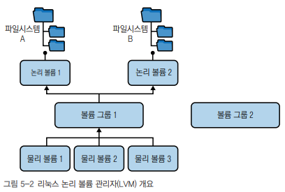

# 파일 시스템

## 1. 기본 개요

 - __드라이브__: 하드 디스크 드라이브 또는 솔리드 스테이트 드라이브(SSD)와 같은 블록 디바이스. 가상 머신의 드라이브는 에뮬레이션될 수도 있다. (/dev/sda, /dev/sdb, /dev/hda)
 - __파티션__: 드라이브를 스토리지 섹터의 집합인 파티션으로 논리적으로 분할할 수 있다. HDD에 두 개의 파티션을 생성하면 /dev/sdb1과 /dev/sdb2로 표시된다.
 - __볼륨__: 볼륨은 파티션과 비슷하지만 더 유연하며, 특정 파일시스템용으로 포맷되기도 한다.
 - __슈퍼 블록__: 시스템이 포맷되면 파일시스템의 시작 부분에 파일시스템의 메타데이터를 캡처하는 특수 섹션이 생긴다. 여기에는 파일시스템의 유형, 블록, 상태, 블록당 아이노드 수 등이 담긴다.
 - __아이노드__: 파일시스템의 아이노드는 크기, 소유자, 위치, 날짜, 권한과 같은 파일의 메타데이터를 저장하지만 파일명과 실제 데이터는 저장하지 않는다. 이 데이터는 디렉토리에 보관되며, 디렉토리는 아이노드를 파일명에 매핑하는 특별한 종류의 일반 파일이라 할 수 있다.

<br/>

### 1-1. 저수준의 파일시스템과 블록 디바이스 명령 모음

 - lsblk: 모든 블록 디바이스 나열
 - fdisk, parted: 디스크 파티션 관리
 - blkid: UUID와 같은 블록 디바이스 속성 표시
 - hwinfo: 하드웨어 정보 표시
 - file -s: 파일 시스템과 파티션 정보 표시
 - stat, df -i, ls -i: 아이노드와 관련된 정보 표시 및 목록 출력

<br/>

### 1-2. 링크

 - __하드 링크__: 아이노드를 참조하며 디렉토리는 참조할 수 없다. 또한, 파일시스템이 서로 다르면 동작하지 않는다.
 - __심볼릭 링크__: 파일의 내용이 다른 파일의 경로를 나타내는 문자열인 특수 파일(단축 아이콘)

```bash
# 1. myfile에 대한 하드 링크 생성
$ ln myfile somealias

# 2. myfile에 대한 소프트 링크 생성
$ ln -s myfile somesoftalias

# 3. 파일 목록 출력
$ ls -al *alias

# 4. 하드링크의 파일 내역 표시
$ stat somealias

# 5. 소프트링크의 파일 내역 표시
$ stat somesoftalias
```
<br/>

## 2. 가상 파일시스템

리눅스는 가상 파일시스템이라는 추상화를 통해 다양한 종류의 리소스에 파일과 유사한 접근을 제공할 수 있다.  
VFS는 파일 체계를 기반으로 클라이언트가 동일한 방법으로 리소스에 접근할 수 있게 해주는 커널의 추상화 계층이다.  

 - ext3, XFS, FAT, NTFS 같은 로컬 파일시스템
    - 해당 파일 시스템은 드라이버를 사용하여 HDD나 SSD와 같은 로컬 블록 디바이스에 접근한다.
 - 장기 저장 디바이스가 지원하지 않지만 주 메모리(RAM)에 상주하는 tmpfs와 같은 인메모리 파일 시스템
    - 커널 인터페이스와 디바이스 추상화에 사용된다.
 - NFS, 삼바, 넷웨어 등의 네트워크 파일시스템
    - 이런 파일시스템도 드라이버를 사용하지만, 실제 데이터가 상주하는 저장 디바이스는 로컬이 아니라 원격으로 연결되어있다.
    - 즉, 드라이버에 네트워크 작업이 포함되어 있다.

<br/>

### 2-1. 논리 볼륨 관리자

 - __물리 볼륨(PV)__
    - 디스크 파티션, 전체 디스크 드라이브, 기타 디바이스 등이 있다.
 - __논리 볼륨(LV)__
    - 볼륨 그룹(VG)에서 생성된 블록 디바이스, 이들은 개념적으로 파티션과 비슷하다.
    - 논리 볼륨을 사용하려면 먼저 논리 볼륨에 파일시스템을 생성해야 한다.
    - 사용 중에 논리 볼륨의 크기를 쉽게 조정할 수 있다.
 - __볼륨 그룹(VG)__
    - 물리 볼륨과 논리 볼륨 사이의 중개자.
    - 볼륨 그룹이란 공동으로 리소스를 제공하는 물리 볼륨 풀이라고 생각하면 된다.

<div align="center">
    
</div>
<br/>

#### LVM 볼륨 관리 도구

 - __PV 관리 도구__
    - lvmdiskscan
    - pvdisplay
    - pvcreate
    - pvscan
 - __볼륨 그룹 관리 도구__
    - vgs
    - vgdisplay
    - vgcreate
    - vgextend
 - __논리 볼륨 관리 도구__
    - lvs
    - lvscan
    - lvcreate

<br/>

### 2-2. 파일시스템 작업

#### 파일시스템 생성

파일시스템을 사용하기 위해서는 파일시스템을 생성해야 한다.  
즉, 파티션이나 볼륨을 입력으로 받아 파일시스템을 구성하는 관리적인 부분을 설정해야 한다.  

```bash
# ext4 유형의 파일시스템을 생성한다.
$ mkfs -t ext4 /dev/some_vg/some_lv
```
<br/>

#### 파일시스템 마운트

마운트는 파일시스템 트리에 이를 연결함을 의미한다.  

```bash
$ mount -t ext4, tmpfs
```
<br/>

### 2-3. 범용 파일시스템 레이아웃

#### 범용 최상위 디렉토리

 - bin, sbin: 시스템 프로그램과 명령
 - boot: 커널 이미지와 관련 구성 요소
 - dev: 디바이스(터미널, 드라이브 등)
 - etc: 시스템 구성 파일
 - home: 사용자 홈 디렉토리
 - lib: 공유 시스템 라이브러리
 - mnt, media: 이동식 미디어용 마운트 지정(USB 등)
 - opt: 배포판 지정 디렉토리, 패키지 관리자 파일을 호스팅할 수 있다.
 - proc, sys: 커널 인터페이스
 - tmp: 임시 파일용
 - usr: 사용자 프로그램(일바적으로 읽기 전용)
 - var: 사용자 프로그램(로그, 백업, 네트워크 캐시 등)

<br/>

## 4. 일반 파일

### 4-1. 범용 파일시스템

 - ext2
    - 지원시기: 1993년
    - 파일크기: 2TB
    - 볼륨크기: 32TB
    - 파일 개수: 10^18
 - ext3
    - 지원시기: 2001년
    - 파일크기: 2TB
    - 볼륨크기: 32TB
    - 파일 개수: 변동 가능
 - ext4
    - 오늘날 많은 배포판에서 기본적으로 널리 사용되는 파일시스템, ext3와 호환되는 진화 버전으로 저널링 기능을 제공한다.
    - 지원시기: 2008년
    - 파일크기: 16TB
    - 볼륨크기: 1EB
    - 파일 개수: 40억
 - btrfs
    - 지원시기: 2009년
    - 파일크기: 16EB
    - 볼륨크기: 16EB
    - 파일 개수: 2^18
 - XFS
    - 1990년대 초 실리콘그래픽스가 워크스테이션용으로 설계한 저널링 파일 시스템으로 대용량 파일과 고속 I/O를 지원하며, 현재는 레드햇 배포판 제품군에서 사용된다.
    - 지원시기: 2001년
    - 파일크기: 8EB
    - 볼륨크기: 8EB
    - 파일 개수: 2^64
 - ZFS
    - 2001년 썬 마이크로시스템즈에서 개발한 ZFS는 파일시스템과 볼륨 관리자 기능을 결합했다.
    - 지원시기: 2006년
    - 파일크기: 16EB
    - 볼륨크기: 2^128 바이트
    - 파일 개수: 디렉토리당 10^14개 파일
 - NTFS
    - 지원시기: 1997년
    - 파일크기: 16TB
    - 볼륨크기: 256TB
    - 파일 개수: 2^32
 - vfat
    - 지원시기: 1995년
    - 파일크기: 2GB
    - 볼륨크기: 해당 사항 없음
    - 파일 개수: 디렉토리당 2^16

