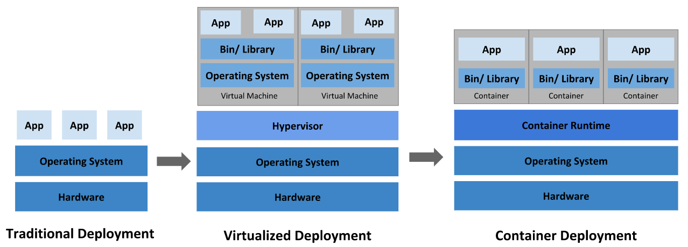
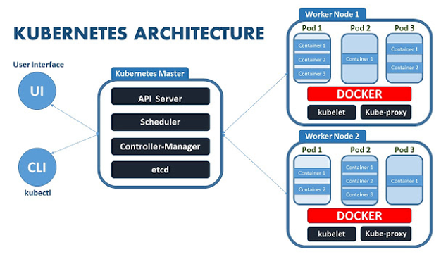
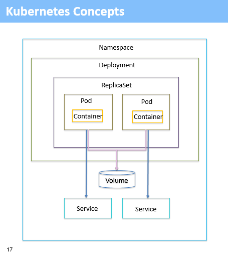

# 01장. 컨테이너 기술 보급과 쿠버네티스

## 컨테이너

일반적인 가상 머신은 호스트 OS에 하이퍼바이저를 설치하고 그 위에 게스트 OS를 동작시키는 형태로 동작한다. 컨테이너 기술은 호스트 OS에 컨테이너 런타임을 올리고 그 위에 프로세스로서 컨테이너를 동작시킨다.  

컨테이너란 호스트 OS의 커널을 공유하면서 분리된 프로세스로서 실행해 마치 가상 머신이 움직이고 있는 것처럼 보이게 하는 기술이다.

     
    출처 - https://itwiki.kr/w/컨테이너_가상화

 

## 도커

도커는 컨테이너를 동작시키기 위한 엔진 중 하나로 2013년에 닷클라우드에 의해 발표되었다.  

도커에서는 Dockerfile이라는 정의 파일을 작성하여 동일한 컨테이너 이미지를 간단히 만들 수 있다. 이는 IaC를 구현하는 데 매우 적합한 소프트웨어다. 또한, 컨테이너 이미지에는 애플리케이션과 그 실행 환경 설정이 포함되어 있어 도커 엔진만 설치되어 있다면 애플리케이션의 동작이 보장된다.  

도커에서는 컨테이너 이미지를 저장, 공유하기 위한 에코시스템이 준비되어있다. 도커 허브라고 하는 컨테이너 이미지를 저장 및 공유할 수 있는 컨테이너 레포지토리가 제공된다. docker push/pull 명령으로 간단히 도커 허브에 컨테이너 이미지를 전송하거나 다운로드할 수 있다.  

 

## 쿠버네티스

쿠버네티스는 2014년 구글에서 발표되었다. 이는 구글의 자사 서비스를 호스트하기 위해 개발한 보그라는 오케스트레이션 도구가 그 기원이라고 할 수 있다. 구글은 2015년 07월 21일 버전 1.0을 발표함과 동시에 리눅스 파운데이션과 공동으로 클라우드 네이티브 컴퓨팅 파운데이션을 설립하여 쿠버네티스를 CNCF에 기증했다.  

쿠버네티스에서는 데이터 플레인이라고 불리는 서버를 여러 대 실행시켜 그 위에 가상 오케스트레이션 계층을 구축하고 해당 공간에서 컨테이너가 동작한다. 컨테이너 이용자는 이를 통해 컨테이너 그룹을 하나의 큰 머신 리소스로 보고 인프라를 추상화할 수 있다.  

또한, 쿠버네티스는 어떤 가상 머신에서 어느 정도의 컨테이너를 동작시킬지를 관리하거나, 새로운 컨테이너를 배포할 때 어떤 가상 머신에 배포하면 좋을지 등을 자동으로 판단한다. 장애가 발생한 컨테이너를 정지시키고 재시작하는 구조도 갖고 있다. 이러한 기능은 컨트롤 플레인이라는 마스터 노드 그룹에서 구현된다.  

     
    출처 - https://itwiki.kr/w/쿠버네티스

 

### 쿠버네티스의 기본 오브젝트

 - `파드`
    - 파드는 쿠버네티스의 최소 단위이며, 파드 하나 안에서는 하나 이상의 컨테이너를 동작시킬 수 있다.
    - 파드에는 어떤 컨테이너 이미지를 사용할지 등을 설정한다.
 - `래플리카셋`
    - 레플리카셋은 파드를 얼마나 동작시킬지 관리하는 오브젝트다.
    - 레플리카셋에서 파드의 수를 설정하면 그만큼의 파드가 동작하는 것을 보장한다.
 - `디플로이먼트`
    - 디플로이먼트는 배포 이력을 관리한다.
    - 쿠버네티스 운영 중에 애플리케이션의 새로운 버전을 릴리스하거나 부하 증가에 따라 레플리카셋 수를 변경하는 등 여러 가지 동작이 발생하는데 이들을 디플로이먼트로 관리할 수 있다.
    - 디플로이먼트는 적용 이력을 관리하여 새로운 버전 릴리스에서 문제가 발생하면 바로 이전 버전으로 쉽게 롤백할 수 있다.
 - `서비스`
    - 서비스는 배포한 파드를 쿠버네티스 클러스터 외부에 공개하기 위한 구조를 제공한다.
    - 클러스터 내에 여러 개를 동작시킨 경우 그 앞단에 로드밸런서를 배치하여 특정 파드를 클러스터 외부로 공개할 수 있다.

     
    출처 - https://developer.ibm.com/kr/cloud/container /2019/03/05/kubernetes_practice/

 

## Amazon EKS

Amazon EKS는 쿠버네티스를 제어하는 컨트롤 플레인을 제공하는 관리형 서비스이다. AWS re:Invent 2017에 발표되었으며 서울 리전에 2019년 1월에 출시되었다.  

쿠버네티스에서는 여러 컴폰넌트들이 서로 독립적이고 비동기로 동작하며 전체를 구성한다. 때문에, 각각의 구성 요소를 정상적으로 동작시키기 위한 설정이나 유지, 운영 장애가 발생했을 때의 복구 방법이 간단하지 않다. EKS의 경우 이런 유지, 운영을 AWS에서 대신해준다.  

 

### EKS의 특징

EKS는 쿠버네티스와 완전한 호환성을 갖고 있다.  
즉, 이미 구축된 쿠버네티스 클러스터에서 동작하는 애플리케이션을 수정하지 않고 동작시킬 수 있다. 또한, AWS의 각종 서비스와 통합되어 AWS의 다른 서비스들과 연결하거나 기존 구조와 같은 환경으로 이용할 수 있다.  

 - `VPC와 통합`
    - 일반적으로 쿠버네티스 클러스터는 파드 네트워크로 데이터 플레인의 네트워크와는 다른 자체 네트워크 체계를 배치한다. 때문에, 클러스터 외부에서 파드에 명시적으로 엔드포인트를 생성하지 않으면 통신이 불가능하다.
    - EKS에서는 Amazon VPC 통합 네트워킹을 지원하여 파드에서 VPC 내부 주소 대역을 사용할 수 있고, 클러스터 외부와의 통신을 심리스하게 구현할 수 있다.
 - `IAM을 통한 인증과 인가`
    - 쿠버네티스 클러스터는 kubectl이라는 명령줄 도구를 사용하여 조작한다. 이때, 해당 조작이 허가된 사용자에 의한 것임을 올바르게 인증해야 하며, 어떤 조작을 허가할지에 대한 인가 구조도 필요하다.
    - EKS에서는 IAM과 연결한 인증 및 인가 구조를 제공한다.
 - `ELB와의 연계`
    - EKS에서는 쿠버네티스의 서비스 타입 중 하나인 LoadBalancer를 설정하면 자동적으로 AWS의 로드밸런서 서비스인 ELB가 생성된다.
    - 이것으로 HTTPS나 경로 기반 라우팅 등의 L7 로드밸런서 기능을 AWS 서비스로 구현할 수 있다.
 - `데이터 플레인 선택`
    - 쿠버네티스는 컨트롤 플레인과 데이터 플레인으로 구성된다.
    - EKS 서비스 제공 초기에는 AWS가 자동화된 구축 방식으로 데이터 플레인을 제공했고, EKS와는 별도로 EC2를 관리해야 했다. 이후, AWS가 발전해 데이터 플레인 관리를 도와주는 기능이 제공되었다. EKS 클러스터의 유지 관리나 버전을 업그레이드할 때 필요한 가상 머신 설정을 쉽게 해주는 관리형 노드 그룹 구조와 처음부터 가상 머신을 의식하지 않고 파드를 배포할 수 있는 파게이트라는 서비스가 여기에 속한다.

