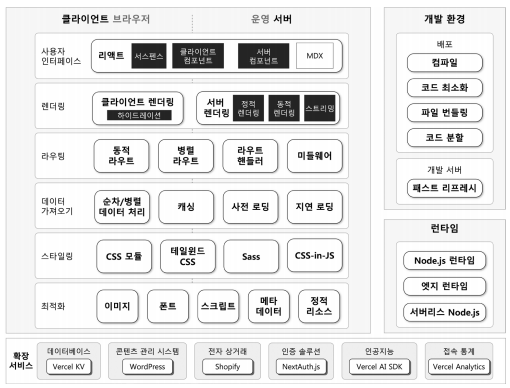

# 리액트와 Nest.js를 통한 웹 개발 혁신

## 1. 리액트와 Nest.js는 무엇인가?

### 1-1. 리액트

리액트는 메타에서 개발한 사용자 인터페이스를 구축하는 자바스크립트 라이브러리로 가상 DOM을 사용하는 클라이언트 사이드 렌더링을 핵심 기능으로 하여 사용자가 초기 로딩 후 빠르게 페이지를 전환하고 UI를 동적으로 변경하게 한다.

- 웹 페이지의 모든 내용이 자바스크립트를 통해 동적으로 생성되어 첫 페이지 로딩 속도가 느려질 수 있다.
- 검색 엔진이 자바스크립트를 실행하지 않으면 페이지의 내용을 파악하기 어려워 검색 엔진 최적화(SEO)에 어려움이 있다.

<br/>

### 1-2. Next.js

Next.js는 풀 스택 웹 애플리케이션을 구축하는 리액트 프레임워크로 프론트엔드와 백엔드를 아우르는 풀 스택 웹 애플리케이션 개발을 지원한다. 리액트 컴포넌트를 이용해 사용자 인터페이스를 구축하며 Next.js는 복잡한 설정과 최적화 및 도구를 자동화하여 개발자 편의를 중대시킨다.

Next.js는 서버 사이드 렌더링(Server Side Rendering, SSR)과 하이드레이션(Hydration) 기능으로 리액트의 한계를 극복하고 웹 애플리케이션의 성능과 사용자 경험을 향상하는 데 중요한 역할을 한다.

- SSR은 서버에서 페이지의 HTML을 미리 생성해 클라이언트에 전송한다. 이를 통해 사용자는 데이터 로딩을 기다리지 않고 초기 버전의 웹 페이지를 빠르게 볼 수 있다.
- 하이드레이션은 SSR을 통해 생성된 HTML 페이지를 클라이언트 측 자바스크립트와 연동하여 완전히 기능을 하는 웹 페이지로 변환하는 과정으로 정적으로 렌더링된 페이지가 클라이언트의 상호 작용을 수용하며 활성화된다.

<br/>

### 1-3. 최신 리액트와 Next.js의 진화와 혁신

SSR은 모든 데이터를 서버에서 처리해야 하므로 API 호출로 인한 지연이 발생할 수 있다. 하이드레이션은 SSR을 통해 생성된 HTML 페이지를 자바스크립트로 활성화하여 사용자 상호 작용이 가능하도록 하지만, 모든 컴포넌트가 완전히 활성화되기 전까지는 사용자의 상호 작용이 지연될 수 있다.

이러한 문제점을 인식하고 리액트 18에서는 여러 변화와 개선 사항이 도입되었다. 가장 주목할 만한 변화 중 하나는 서버와 클라이언트 컴포넌트의 도입으로 서버에서 렌더링되는 컴포넌트와 클라이언트에서 동작하는 컴포넌트를 구분하고 최적화하여 렌더링 효율성을 높일 수 있다. 또한, 서스펜스가 업그레이드되면서 데이터 가져오기를 수행하는 컴포넌트의 로딩 관리가 더욱 세밀하고 효율적으로 처리될 수 있게 되었다.

- 증분적 정적 재생성은 데이터 변화에 따라 정적 페이지를 재생성함으로써 최신 정보 반영과 성능 최적화를 동시에 실현한다.
- 하이브리드 렌더링은 하나의 웹 페이지를 여러 리액트 컴포넌트로 분할하여 데이터 상태에 따라 서버에서 미리 생성하거나 사용자의 요청에 맞추어 클라이언트 내에서 즉각적으로 생성하거나 변경한다.
- 서스펜스 스트리밍은 서버에서 렌더링 된 페이지의 일부를 우선 클라이언트에게 전송하고 나머지 부분이 로드되는 동안 사용자에게 로딩 상태를 표시함으로써 신속한 상호 작용을 제공한다.

<br/>

### 1-4. Nest.js 주요 특징

- 내장된 최적화 도구: 사용자 경험과 성능을 향상하고자 이미지, 폰트, 스크립트를 자동으로 최적화하는 기능 제공
- 서스펜스 스트리밍: 리액트 서스펜스와 통합되어 서버에서 UI를 즉시 스트리밍한다.
- 리액트 서버 컴포넌트: 리액트 서버와 클라이언트 컴포넌트 기능을 기반으로 한다.
- 데이터 가져오기: Next.js는 서버와 클라이언트 양쪽 모두에서 데이터 가져오기를 지원한다.
- CSS 지원: 테일윈드 CSS, Sass 등 여러 도구로 애플리케이션을 스타일링한다.
- 클라이언트 및 서버 렌더링: 컴포너트 단위로 유연한 렌더링 및 데이터 캐싱 옵션을 제공한다.
- Node.js 및 엣지 런 타임: 서버리스 함수로 확장 가능한 솔루션을 구축하고 이를 통해 빠르고 동적인 운영 환경을 제공한다.
- 라우터 핸들러: 프론트엔드가 외부 서비스와 안전하게 연결될 수 있도록 백엔드에서 데이터를 불러오는 API 엔드 포인트를 구축한다.
- 고급 라우팅 및 중첩 레이아웃: 파일 시스템을 사용하여 라우트를 생성하며 고급 라우팅 및 패턴 및 UI 레이아웃을 지원한다.
- 미들웨어: 인증과 보안 및 국제화하는 라우팅과 접근 규칙을 코드로 정의한다.
- 타입스크립트 지원: 타입 검사와 더욱 효율적인 컴파일을 통해 타입스크립트를 더욱 잘 지원한다.

<br/>

### 1-5. Nest.js 주요 구성 요소

<div align="center">
    
</div>
<br/>

## 2. 리액트와 Next.js로 얻는 사용자 경험 향상

### 2-1. 웹 사용자 경험의 중요성

웹 사용자 경험(User eXperience, UX)는 사용자가 웹 애플리케이션을 어떻게 인식하고 느끼며 상호 작용하는지에 영향을 미치는 다양한 요소를 포함한다.

- 모바일 호환성은 증가하는 모바일 장치 사용에 따라 매우 중요해졌다.
- 직관적인 내비게이션은 사용자가 원하는 정보를 쉽게 찾도록 한다.
- 콘텐츠의 품질과 유용성은 사용자들이 웹사이트에 머무르게 하고 다시 방문하게 만드는 주요 요인이다.
- 개인화된 콘텐츠와 경험을 제공하는 것은 사용자 참여를 증진하고 만족도를 높인다.
- 사용자 데이터 보호와 보안은 웹사이트의 신뢰성을 높이는 데 중요하다.

<br/>

### 2-2. 즉각적인 사용성: 리액트와 Next.js가 제공하는 신속한 반응성

웹 애플리케이션은 사용자의 요청에 신속히 응답해야 한다. 즉각적인 응답은 사용자의 신뢰를 높이고 참여를 촉진하며 전반적인 사용자 경험을 향상한다.

리액트의 가상 DOM은 사용자 인터페이스의 업데이트를 신속하게 처리하여 사용자에게 빠른 피드백을 제공하고, 상호 작용에 즉시 반응한다. Next.js는 서스펜스 기반의 로딩 UI, 사전 로딩, 지연 로딩 등 다양한 기능을 통해 데이터 세트가 크거나 트래픽이 많은 상황에서도 애플리케이션의 반응 속도를 빠르게 유지한다.

<br/>

### 2-3. 시각적 부드러움: Next.js를 활용한 매끄러운 페이지 전환

Next.js는 리액트 기반의 싱글 페이지 애플리케이션 패러다임을 이용하여, 사용자의 내비게이션을 효율적으로 만들어주는 Link 컴포넌트를 도입했다. 이 컴포넌트를 활용하면 전체 페이지를 다시 불러오지 않고 즉시 다른 페이지로 이동할 수 있다.

- 이러한 기능은 Next.js의 미리 가져오기 기능으로 링크의 리소스를 미리 로드하여 사용자가 링크를 클릭하는 순간 바로 페이지를 볼 수 있도록 하여 대기 시간을 없앤다.

<br/>

### 2-4. 빠르면서 신뢰성 있는 정보 제공: 효율적인 데이터 관리와 전달

기존 웹 애플리케이션의 CSR 방식에는 몇 가지 문제가 있다. 데이터를 불러오는 과정에서 네트워크 지연이 발생하면 페이지 로딩 시간이 길어지고 이는 사용자 경험을 저하시킨다. 또한, 사용자의 모든 요청이 서버로 전송됨에 따라 서버에 과부하가 걸리고 이는 UI 성능 저하로 이어질 수 있다. 정보 불일치 문제 역시 발생할 수 있는데 이는 서버와 클라이언트 간 데이터 동기화의 문제 때문이다. 서버 데이터가 변경될 때 클라이언트의 데이터가 즉시 업데이트되지 않으면 사용자에게 오래된 정보가 표시될 위험이 있다.

- 리액트는 상태와 속성의 도입으로 데이터 관리 방식을 혁신했다.
- 컴포넌트의 상태는 컴포넌트의 생명 주기 동안 변경 가능한 데이터를 나타내며 이를 통해 더 반응적으로 렌더링된다.

<br/>

### 2-5. 항상 준비된 콘텐츠 전달: Next.js로 안정성과 속도 확보하기

리액트는 컴포넌트 기반의 구조를 채택하여 안정성을 향상하고 지연 로딩을 도입하여 초기 로딩 속도를 개선한다. 또한, Next.js는 고정적인 데이터에 대해서는 SSG로 빌드 시 웹 페이지를 렌더링하여 사용자에게 매우 빠른 콘텐츠 전달이 가능하다.

- ISR을 사용하면 전체 사이트 재구축할 필요 없이 특정 페이지만 어벧이트할 수 있어 항상 최신 콘텐츠를 제공할 수 있다.

<br/>

### 2-6. 다양한 모바일 장치를 위한 웹 최적화: 리액트와 Nest.js로 적응형 인터페이스 구현

Next.js는 반응형 웹 디자인을 강화하는 다양한 기능을 제공한다. CSS와 테일윈드 CSS에 대한 지원을 통해 미디어 쿼리를 효율적으로 사용하게 해준다.

- 모바일 우선 접근법: 먼저 모바일 장치를 위해 디자인하고 더 큰 화면에 맞게 확장한다.
- CSS 미디어 쿼리 사용: 장치의 특성인 뷰포트 너비와 높이에 따라 스타일을 적용한다.
- 유연한 그리드: 사이트 레이아웃에 고정 단위 대신 백분율을 사용한다.
- 유연한 이미지: 이미지가 유연하며 포함 요소 내에서 크기 조정이 가능하다.
- 테스트: 다양한 장치에서 테스트하거나, 브라우저 개발 도구로 다양한 장치를 시뮬레이션한다.

<br/>

## 3. 리액트와 Next.js를 통한 개발자 생산성의 제고

리액트는 컴포넌트 기반의 구조로 코드 재사용과 유지 보수를 용이하게 하고, 반면 Next.js는 라우팅, 이미지 최적화, 웹 스트리밍 등 다양한 기능을 제공하여 웹 개발 프로세스를 간소화하고 속도를 향상한다.

<br/>

### 3-1. 리액트 개발을 편리하게 만드는 Next.js

```bash
npx create-next-app@latest {project-name}
```

- Next.js의 파일 시스템 기반 자동 라우팅
  - Next.js는 페이지를 이동하는 라우팅 메커니즘에서 설정 대신 규약을 우선한다.
  - app 폴더 내부에 하위 폴더를 생성하고 페이지 파일을 추가하는 것만으로도 자동으로 라우트가 생성되므로 별도의 설정이나 라우팅 테이블 업데이트가 필요 없다.
- Next.js 이미지 컴포넌트를 활용한 이미지 최적화
  - Next.js의 Image 컴포넌트는 HTML img 요소를 확장하여 이미지 최적화 기능을 자동으로 제공한다.
  - 이 컴포넌트는 뷰포트를 기반으로 이미지 크기를 자동 조절하고 WebP 및 AVIF 등의 이미지 포맷을 사용하여 이미지를 최적화한다.
  - 또한, 이미지 로딩 시 레이아웃 이동을 자동으로 방지하고 이미지가 뷰포트에 들어올 때만 이미지를 로드하여 페이지 로딩 속도를 높인다.
- Next.js에서 스타일링의 확장성: 자바스크립트와 CSS의 결합
  - Next.js는 자바스크립트와 CSS를 서로 연계하여 개발자에게 로직과 데이터를 분리하여 컴포넌트를 동적으로 스타일링하는 능력을 부여한다.
  - 테일윈드 CSS 외에도 Sass과 CSS-in-JS 스타일링 방법이 지원되어 애플리케이션의 확장성에 따라 스타일 관리의 효율성을 가진다.

<br/>

### 3-2. 개발자 친화적 기능과 도구

- 패스트 리프레시: 빠른 새로 고침으로 컴포넌트 상태를 잃지 않고 실시간 피드백 제공
  - 패스트 리프레시는 리액트의 개선된 핫 리로딩으로 개발자가 변경 사항을 만들면서 컴포넌트가 실시간으로 다시 렌더링되도록 하며 현재 상태를 잃지 않는다.
- 고급 라우팅: 빠른 백엔드를 개발하는 라우트 핸들러와 효율적으로 페이지를 관리하는 동적 라우팅
  - Next.js 애플리케이션에서 클라이언트에서도 안전하게 외부 데이터에 접근하도록 API 엔드 포인트 구축 기능을 제공한다.
  - 라우트 핸들러 기능을 사용하여 프론트엔드와 백엔드 통합을 원활하게 제공한다.
- 내장된 타입스크립트 지원
  - Next.js는 복잡한 설정 없이 타입스크립트의 장점을 쉽게 활용할 수 있도록 기본적으로 타입스크립트 지원을 포함한다.
  - 개발자는 단순히 tsconfig.json 파일을 Next.js 프로젝트에 추가하고 필요한 타입스크립트 패키지를 설치하면 프레임워크가 자동으로 환경을 설정해주어 타입스크립트의 강력한 기능을 즉시 사용할 수 있다.
- 효율적인 오류 처리
  - Next.js는 향상된 오류 보고 시스템을 통해 문제의 원인을 명확하게 드러내어 개발자가 실수를 빨리 발견하고 수정하도록 도와준다.
  - Next.js는 중첩된 라우트에서 발생할 수 있는 런타임 오류를 error.js 파일을 활용해 우아하게 처리할 방법을 제공한다.

<br/>

## 4. 왜 Next.js인가?

- 서버 사이드 렌더링: Next.js는 초기 로드 속도와 SEO 향상
- 파일 시스템 기반 라우팅: 폴더와 파일 추가로 간편한 라우팅 설정
- 성능 최적화: 자동 코드 분할로 빠른 페이지 로드
- 개선된 개발자 경험: 핫 코드 리로딩과 패스트 리프레시로 실시간 변경 확인

리액트의 기본 구조를 활용하면서 중복 작업을 줄이고 개발 프로세스를 단순화하고자 Next.js는 파일 시스템 기반 라우팅, 내장 API 라우팅, CSS 지원, 자동 이미지 최적화 등의 맞춤형 기능을 제공한다.  
Next.js는 SSR을 통해 페이지 로딩 시간을 단축하고 SEO를 강화하여 사용자 경험을 향상한다. SSG는 빌드 시 페이지를 사전 렌더링하여 빠른 로딩 속도를 제공하며 실시간 데이터가 필요 없는 상황에서 이상적이다. ISR은 정적 콘텐츠를 사용자 요청 시 필요한 데이터만 업데이트하여 최신 정보를 유지한다.

### 4-1. 리액트와 Next.js vs 다른 인기 프레임워크

- 리액트와 Next.js
  - 성능: 높음(SSG & SSR)
  - SEO: 우수
  - 개발자 경험: 최상
  - 커뮤니티 및 생태계: 강력
  - 유연성: 높음(모듈형 아키텍처)
- 앵귤러
  - 성능: 높음
  - SEO: 좋음(앵귤러 유니버셜)
  - 개발자 경험: 좋음(학습 곡선이 가파름)
  - 커뮤니티 및 생태계: 성숙(오래된 프레임워크)
  - 유연성: 중간
- 뷰
  - 성능: 매우 높음(가벼운 가상 DOM)
  - SEO: 좋음 (SSR 플러그인)
  - 개발자 경험: 우수
  - 커뮤니티 및 생태계: 활기참
  - 유연성: 높음
- 스벨트
  - 성능: 극히 높음 (가상 DOM 없음)
  - SEO: 좋음 (새퍼로)
  - 개발자 경험: 매우 좋음
  - 커뮤니티 및 생태계: 신흥
  - 유연성: 높음

리액트의 기본 구조를 활용하면서 중복 작업을 줄이고 개발 프로세스를 단순화하고자 Next.js는 파일 시스템 기반 라우팅, 내장 API 라우팅, CSS 지원, 자동 이미지 최적화 등의 맞춤형 기능을 제공한다. Next.js는 리액트만으로는 할 수 없는 성능 향상과 최적화를 위한 다양한 렌더링 기법을 제공한다. SSR을 통해 페이지 로딩 시간을 단축하고 SEO를 강화하여 사용자 경험을 향상한다. SSG는 빌드 시 페이지를 사전 렌더링하여 빠른 로딩 속도를 제공하며 실시간 데이터가 필요 없는 상황에서 이상적이다. ISR은 정적 콘텐츠를 사용자 요청 시 필요한 데이터만 업데이트하여 최신 정보를 유지한다.

## 5. 요약

리액트의 한계를 극복하고자 Next.js가 탄생하였다. Next.js는 풀스택 프레임워크로 SSR과 더불어 즉각적인 사용성과 시각적 유동성 등의 기능을 제공하여 사용자와 갭라자 모두에게 큰 이점을 가져다 준다. Next.js는 리액트를 기반으로 하면서도 개발자의 편의성을 더욱 강화한다. 파일 시스템 기반의 자동 라우팅, 이미지 최적화, 고급 라우팅 등의 기능을 통해 개발자는 복잡한 설정 없이 빠르게 웹사이트를 구축할 수 있다.

- 리액트는 사용자 인터페이스를 구축하는 **자바스크립트** 라이브러리이다.
- 리액트는 **가상 DOM** 방식으로 화면을 갱신하므로 전체 페이지를 새로 고침 하지 않고도 빠른 화면 전환을 경험할 수 있다.
- Next.js는 리액트를 기반으로 하는 서버 사이드 **렌더링** 프레임워크이다.
- Next.js는 초기 페이지 로딩 속도를 향상하고자 **서버 사이드** 렌더링을 지원한다.
- 리액트와 Next.js는 주로 **자바스크립트 또는 타입스크립트** 언어로 작성된다.
- Next.js는 여러 페이지 구조를 쉽게 관리할 수 있도록 페이지별로 **폴더** 구조를 추천한다.
- 라우팅은 웹페이지 간 이동을 관리하는 기능인데, Next.js는 **파일 시스템 기반** 라우팅을 제공하여 개발자가 별도의 설정 없이 라우팅을 쉽게 구현할 수 있게 한다.
- 리액트는 컴포넌트 기반의 구조로 재사용 가능한 UI **컴포넌트** 를 생성하게 해준다.
- Next.js의 **서스펜스 스티리밍 또는 웹 스트리밍** 기능을 활용하면, 사용자에게 필요한 데이터만을 먼저 보여주고 나머지 부분은 나중에 불러온다.

### 스토리 기반 연습 문제: 로켓 발사 프로젝트

- 문제 상황
  - 로켓 발사 웹 프로젝트 진행
  - 요구사항 1. 웹 애플리케이션의 첫 페이지 로딩 시간이 너무 길다.
  - 요구사항 2. 로켓 발사 정보를 실시간으로 받아오는 API 호출이 빈번하게 발생하여 서버에 과부하가 걸리고 있다.
  - 요구사항 3. 사용자가 웹 애플리케이션 내에서 다양한 페이지를 자유롭게 이동할 수 없다.
- 첫 페이지 로딩 시간이 긴 원인을 파악하고 최적화
  - 클라이언트 사이드에서 많은 데이터를 로드하거나 복잡한 연산을 진행하거나 외부 API 호출이 느린 경우
  - Next.js의 SSR을 활용하여 이러한 문제를 해결할 수 있다.
- 실시간으로 정보를 받아오는 API 호출 문제 해결
  - 빈번한 API 호출은 서버에 과부하를 준다.
  - Next.js의 정적 사이트 생성으로 미리 페이지를 생성할 수 있지만 실시간성을 유지하는 데 적합하지 않다.
  - 적당한 시간 간격으로 정적 페이지를 재생성하는 증분적 정적 재생성(ISR) 방식을 사용하거나 클라이언트 사이드에서 캐싱 기법을 활용하여 최근 데이터를 저장하고, 일정 시간 동안은 캐시된 데이터를 사용하는 방법을 고려할 수 있다.
- 다양한 페이지 이동
  - 파일 시스템 기반 라우팅 이용
