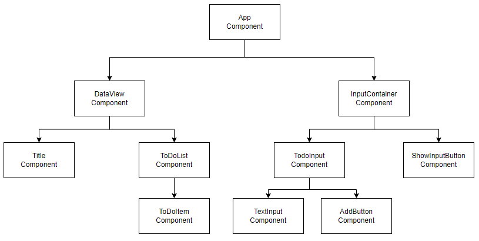

# 06. 할 일 목록 앱 - Context API

## 6.1 Context API

리액트는 부모 컴포넌트에서 자식 컴포넌트로 데이터를 전달하는 방법인 Props와 한 컴포넌트 안에서 변경이 가능한 데이터를 다루는 State가 있다.  
리액트는 이런 Props와 State 이외에도 전역 데이터를 다루는 Context가 존재한다.  

<br/>

리액트에서 Props와 State를 사용하여 데이터를 다루게 되면, 부모 컴포넌트에서 자식 컴포넌트, 위에서 아래, 한쪽 방향으로 데이터가 이동하게 된다.  
만약, 같은 부모의 서로 다른 컴포넌트에서 사용하는 데이터를 다루고 싶다면 고려해야 할 상황이 생긴다.  
리액트에서 데이터는 위에서 아래로, 한 쪽 방향으로만 전달할 수 있다.  
그러므로 같이 사용하고 싶은 데이터와 이 데이터를 사용할 위치에 공통 부모 컴포넌트에 State를 만들고, 사용하고자 하는 데이터를 Props를 통해 해당 컴포넌트로 전달하여 이 문제를 해결할 수 있다.  

<br/>

하지만, 이와 같이 컴포넌트 사이에 공유되는 데이터를 위해 매번 공통 부모 컴포넌트를 수정하고 데이터를 사용하는 컴포넌트까지의 모든 컴포넌트에 Props를 전달하여 데이터를 사용하는 것은 매우 비효율적이다.  
이와 같은 비효율적인 문제를 해결하기 위해 리액트에서는 Flux라는 개념을 도입했고, 그에 맞는 Context API를 제공하기 시작했다.  
Context는 부모 컴포넌트로부터 자식 컴포넌트로 전달되는 데이터의 흐름과 상관없이 전역적으로 데이터를 관리할 수 있도록 한다.  
전역 데이터를 Context에 저장한 후 필요한 컴포넌트에서 해당 데이터를 불러와 사용할 수 있다.  
 - Context: https://ko.reactjs.org/docs/context.html

<br/>

## 6.2 프로젝트 준비

```Bash
$ npx create-react-app todo --template=typescript

$ cd todo
$ npm install --save @emotion/react @emotion/styled
$ npm install --save-dev prettier eslint

$ npx eslint --init
You can also run this command directly using 'npm init @eslint/config'.
√ How would you like to use ESLint? · problems    
√ What type of modules does your project use? · esm
√ Which framework does your project use? · react
√ Does your project use TypeScript? · No / Yes
√ Where does your code run? · browser
√ What format do you want your config file to be in? · JavaScript
@typescript-eslint/eslint-plugin@latest eslint-plugin-react@latest @typescript-eslint/parser@latest
√ Would you like to install them now? · No / Yes
√ Which package manager do you want to use? · npm

$ npm run format:fix
$ npm run lint:fix
$ npm run format
$ npm run lint
$ npm start
```

<br/>

 - 설정 파일
```JS
// tsconfig.json
{
  "compilerOptions": {
    ..
    "jsx": "react-jsx",
    "baseUrl": "src"
  },
}

// .prettierrc.js
module.exports = {
  singleQuote: true,
  trailingComma: 'all',
  printWidth: 100,
};

// .eslintrc.js: ESLint 룰 설정
module.exports = {
  settings: {
    react: {
      version: "detect",
    },
  },
  ..
  rules: {
    "react/react-in-jsx-scope": "off",
  },
};

// package.json: ESLint, Prettier 명령어 추가
{
  ..
  "scripts": {
    ..
    "format": "prettier --check ./src",
    "format:fix": "prettier --write ./src",
    "lint": "eslint ./src",
    "lint:fix": "eslint --fix ./src"
  },
}
```

<br/>

## 6.3 State와 Props로 할 일 목록 앱 개발

### 기능
    - 할 일 목록 출력
    - 할 일 삭제 기능
    - 할 일 추가 기능

<br/>

### 컴포넌트 구조
    - 할 일 목록과 할 일 데이터를 전역 데이터 보관소인 Context에 저장하고 이를 제공하기 위해 Provider를 공통 컴포넌트인 <App/> 컴포넌트에서 사용한다.
    - 이렇게 생성한 전역 데이터인 Context를 Consumer를 통해 할 일 목록을 표시하는 <ToDoList/> 컴포넌트와 할 일을 입력하는 <ToDoInput/> 컴포넌트에서 사용한다.
<p style="text-align: center;">
     
</p>

<br/>

### 소스 코드

Props와 State만을 사용하여 할 일 목록 앱을 개발하면, 변경이 가능한 State 데이터를 사용하기 위해 공통 부모 컴포넌트로부터 해당 데이터를 사용하는 컴포넌트까지 Props로 데이터를 전달해야 한다. 따라서 해당 데이터를 실제로 사용하지 않는 컴포넌트들도 부모 컴포넌트로부터 해당 데이터를 전달받아야 하고, 전달받은 데이터를 다시 자식 컴포넌트로 전달해야 하는 문제가 발생한다.  

<br/>

Context API를 사용하기 위해서는 Context를 생성하여 공통 부모 컴포넌트에는 Provider를 제공하고, 데이터를 사용하는 곳에서는 Consumer를 통해 데이터를 사용해야 한다.  
 - Context를 생성하기 위해서는 createContext라는 훅을 사용한다. Context도 하나의 리액트 컴포넌트로 변경이 가능한 데이터를 사용하기 위해서는 useState 훅을 사용하여 State 변수를 생성해야 한다.
 - Context도 하나의 리액트 컴포넌트로 리액트의 함수 컴포넌트와 동일한 구조를 가진다. 예제 코드에서는 부모 컴포넌트로부터 한 개 또는 복수 개의 리액트 컴포넌트를 children으로 전달받도록 했다.
 - 공통 부모 컴포넌트에서 ToDoListContextProvider를 사용하여 데이터를 제공하고, 데이터를 사용하는 곳에서는 useContext 훅을 사용하여 생성한 ToDoListContext에서 필요한 내용을 가져와 사용한다.
```TS
import { createContext, useState } from 'react';

interface Context {
  readonly toDoList: string[];
  readonly onAdd: (toDo: string) => void;
  readonly onDelete: (toDo: string) => void;
}

// Context 생성
const ToDoListContext = createContext<Context>({
  toDoList: [],
  /* eslint-disable @typescript-eslint/no-empty-function */
  onAdd: (): void => {},
  onDelete: (): void => {},
  /* eslint-enable @typescript-eslint/no-empty-function */
});

interface Props {
  children: JSX.Element | JSX.Element[];
}

// 
const ToDoListContextProvider = ({ children }: Props) => {
  // 전역으로 관리할 할 일 목록 데이터를 생성한다. (State)
  const [toDoList, setToDoList] = useState(['리액트 공부하기', '운동하기', '책 읽기']);

  // 할 일 목록 데이터에 이미 존재하는 데이터를 제거하기 위한 onDelete 함수 정의
  const onDelete = (todo: string) => {
    setToDoList(toDoList.filter((item) => item !== todo));
  };

  // 할 일 목록 데이터에 새로운 할 일을 등록하기 위한 onAdd 함수 정의
  const onAdd = (toDo: string) => {
    setToDoList([...toDoList, toDo]);
  };

  // Context의 Provider를 사용하여 할 일 목록 데이터(toDoList)와 onAdd, onDelete 함수 설정
  // Provider 하위에 부모 컴포넌트로부터 전달받은 리액트 컴포넌트 표시
  return (
    <ToDoListContext.Provider
      value={{
        toDoList,
        onAdd,
        onDelete,
      }}
    >
      {children}
    </ToDoListContext.Provider>
  );
};

export { ToDoListContext, ToDoListContextProvider };
```

<br/>

 - App 컴포넌트
    - Context를 사용하기 위해 데이터를 사용하는 컴포넌트의 공통 부모 컴포넌트에 Context의 Provider를 제공해야 한다.
```TS
function App() {
  return (
    <Container>
      <ToDoListContextProvider>
        <DataView />
        <InputContainer />
      </ToDoListContextProvider>
    </Container>
  );
}
```

 - DataView, ToDoItem, ToDoList 컴포넌트
    - DataView: ToDoList와 Title을 포함한다.
    - ToDoItem: 할 일 목록 중 할 일 하나를 표시한다.
    - ToDoList: ToDoItem 컴포넌트를 사용하여 할 일 목록을 표시한다.
      - map 함수를 통해 루프를 돌면서 동일한 컴포넌트를 반복한다. 이때, key를 설정하여야 한다. key는 동일한 컴포넌트 안에서 해당 컴포넌트를 인식하기 위한 것으로, 리액트는 복수의 동일한 컴포넌트에서 key를 통해 각각의 컴포넌트를 인지할 수 있게 된다.
      - Context를 사용하기 위해서는 리액트에서 제공하는 useContext 훅과 createContext로 만든 Context를 사용하여 필요한 내용을 가져와 사용한다.
```TS
// DataView
export const DataView = () => {
  return (
    <Container>
      <Title label="할 일 목록" />
      <ToDoList />
    </Container>
  );
};

// ToDoItem
interface Props {
  readonly label: string;
  readonly onDelete?: () => void;
}

export const ToDoItem = ({ label, onDelete }: Props) => {
  return (
    <Container>
      <Label>{label}</Label>
      <Button label="삭제" onClick={onDelete} />
    </Container>
  );
};

// ToDoList
export const ToDoList = () => {
  const { toDoList, onDelete } = useContext(ToDoListContext);

  return (
    <Container>
      {toDoList.map((todo) => (
        <ToDoItem
          key={todo}
          label={todo}
          onDelete={() => {
            if (typeof onDelete === 'function') onDelete(todo);
          }}
        />
      ))}
    </Container>
  );
};
```

<br/>

 - InputContainer, ToDoInput, ShowInputButton 컴포넌트
    - InputContainer: ToDoInput과 ShowInputButton을 포함한다.
    - ToDoInput: 할 일 데이터를 입력한다.
      - useContext를 통해 onAdd 함수를 가져온다. Input 태그에 할 일을 입력하고, 추가를 하면 Context의 onAdd 함수를 통해 Context의 할 일 데이터가 추가된다.
      - 그 외 Input 태그에 입력되는 할 일(todo)는 현재 페이지에서 관리하는 값으로 State로 만든다.
    - ShowInputButton: 상태에 따라 버튼의 출력 값을 동적으로 사용한다.

```TS
// InputContainer
export const InputContainer = () => {
  const [showToDoInput, setShowToDoInput] = useState(false);

  const onClose = () => {
    setShowToDoInput(false);
  };

  return (
    <>
      {showToDoInput && <ToDoInput onClose={onClose} />}
      <ShowInputButton show={showToDoInput} onClick={() => setShowToDoInput(!showToDoInput)} />
    </>
  );
};

// ToDoInput
export const ToDoInput = ({ onClose }: Props) => {
  const { onAdd } = useContext(ToDoListContext);
  const [toDo, setToDo] = useState('');

  const onAddTodo = () => {
    if (toDo === '') return;

    onAdd(toDo);
    setToDo('');
    onClose();
  };

  return (
    <Container>
      <Background />
      <Contents>
        <Title label="할 일 추가" />
        <InputContainer>
          <TextInput value={toDo} onChange={setToDo} />
          <Button label="추가" color="#304FFE" onClick={onAddTodo} />
        </InputContainer>
      </Contents>
    </Container>
  );
};

// TextInput
export const TextInput = ({ value, onChange }: Props) => {
  return <Input value={value} onChange={(event) => onChange(event.target.value)} />;
};

// ShowInputButton
export const ShowInputButton = ({ show, onClick }: Props) => {
  return (
    <Container>
      <Button
        label={show ? '닫기' : '할 일 추가'}
        color={show ? undefined : '#304FFE'}
        onClick={onClick}
      />
    </Container>
  );
};
```

<br/>

## 6.5 요약

Context는 앱 전체의 여러 부분에서 사용되는 데이터를 한 곳에서 쉽게 관리할 수 있게 해주며, 불필요한 Props 전달 과정을 없애주고 데이터 사용이 필요한 컴포넌트에서 직접 데이터를 사용할 수 있도록 해준다.  

<br/>

부모 컴포넌트로부터 데이터를 전달받기 위한 Props, 한 컴포넌트 안에서 동적인 데이터를 다루기 위한 State 그리고 리액트 앱 전체에서 전역 데이터를 다루는 Context API가 있다.  

<br/>

리액트에서는 16.3.0 전에는 전역 상태 관리하기 위한 Context API를 제공하지 않았다.  
단지, Flux라는 갠며을 통해 전역 상태, 컴포넌트의 상태를 관리하는 방법론만 제시했다.  
때문에, Context API가 나오기 전에 리액트에서 전역 상태를 관리하기 위해서 Redux, Mobx와 같이 Flux 개념을 구현한 외부 라이브러리를 사용해야 했다.  
Context API 나온 후에도 많은 프로젝트가 이미 Redux, Mobx와 같은 상태 관리 라이브러리를 사용하고 있고, 현재에도 이러한 라이브러리 사용이 선호되고 있다.  
 - Redux: https://redux.js.org/
 - Mobx: https://mobx.js.org/

<br/>

최근에 페이스북에서는 리액트의 전역 데이터를 관리하기 위한 리코일(Recoil)이라는 라이브러리를 릴리스했다.  
Redux나 Mobx는 리액트 이외의 프로젝트에서도 사용 가능한 구조를 가지고 있기 때문에 조금 복잡하지만, 리코일은 리액트 전용으로 개발되어 리액트 친화적이고 사용하기 간편하다.  
 - 리코일: https://recoiljs.org/