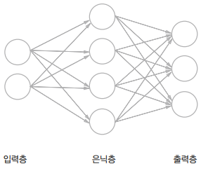

# 신경망 추론

신경망은 간단히 말해 함수라고 할 수 있다. 함수는 무엇인가를 입력하면 무엇인가를 출력하는 변환기이다.  

2차원 데이터를 입력하여 3차원 데이터를 출력하는 함수가 있다고 가정한다.  
이 함수를 신경망으로 구현하려면 입력층에는 뉴런 2개를, 출력층에는 3개를 준비한다.  
그리고 은닉층(중간층)에도 적당한 수의 뉴런을 배치한다.  

화살표에는 가중치가 존재하여, 그 가중치와 뉴런의 값을 각각 곱해서 그 합이 다음 뉴런의 입력으로 쓰인다. 이때, 각 층에서는 이전 뉴런의 값에 영향받지 않는 정수도 더해진다. 이 정수는 편향이라고 한다. 덧붙여 신경망은 인접하는 층의 모든 뉴런과 연결되어 있다는 뜻에서 완전연결계층이라고 한다.  

<div align="center">
    
</div>

<br/>

 - `완전연결계층 예시`
    - 완전연결계층에 의한 변환은 선형 변환이다. 여기에 비선형 효과를 부여하는 것이 바로 활성화 함수로, 비선형 활성화 함수를 이용함으로써 신경망의 표현력을 높일 수 있다. 시그모이드 함수는 알파뱃 'S'자 모양의 곡선 함수이다.
```python
import numpy as np

# 시그모이드 함수
def sigmoid(x):
    return 1 / (1 + np.exp(-x))

if __name__ == '__main__':
    x = np.random.randn(10, 2) # 입력

    W1 = np.random.randn(2, 4) # 가중치
    b1 = np.random.randn(4)    # 편향
    W2 = np.random.randn(4, 3) # 가중치
    b2 = np.random.randn(3)    # 편향

    h = np.matmul(x, W1) + b1
    a = sigmoid(h)
    s = np.matmul(a, W2) + b2
```

<br/>

### 계층으로 클래스화 및 순전파 구현

여기에서는 완전연결계층에 의한 변환을 Affine 계층으로, 시그모이드 함수에 의한 변환을 Sigmoid 계층으로 구현할 것이다. 완전연결계층에 의한 변환은 기하학에서는 아핀(affine) 변환에 해당하기 때문에 Affine 계층이라고 이름을 지었다. 각 계층은 파이썬 클래스로 구현하며, 기본 변환을 수행하는 메서드의 이름은 forward()로 한다.  

신경망 추론 과정에서 하는 처리는 신경망의 순전파에 해당한다. 순전파란 입력층에서 출력층으로 향하는 전파를 마한다. 그 반대로는 역전파가 있다.  

 - `forward_net.py`
    - Sigmoid 계층은 시그모이드 함수를 클래스로 구현했으며, 주 변환 처리는 forward(x) 메서드가 담당한다.
    - Affine 계층은 초기화될 때 가중치와 편향을 받는다.
    - Sigmoid와 Affine 계층을 이용하여 신경망의 추론 처리를 구현한다.
        - 입력 x가 Affine 계층, Sigmoid 계층, Affine 계층을 차례로 거쳐 점수인 s를 출력하게 된다.
        - 해당 신경망을 TwoLayerNet이라는 클래스로 추상화하고, 주 추론 처리는 predict(x) 메서드로 구현한다.
```python
import numpy as np

class Sigmoid:
    def __init__(self):
        self.params = []
    
    def forward(self, x):
        return 1 / (1 + np.exp(-x))

class Affine:
    def __init__(self, W, b):
        self.params = [W, b]
    
    def forward(self, x):
        W, b = self.params
        out = np.matmul(x, W) + b
        return out

class TwoLayerNet:
    def __init__(self, input_size, hidden_size, output_size):
        I, H, O = input_size, hidden_size, output_size

        # 가중치와 편향 초기화
        W1 = np.random.randn(I, H)
        b1 = np.random.randn(H)
        W2 = np.random.randn(H, O)
        b2 = np.random.randn(O)

        # 계층 생성
        self.layers = [
            Affine(W1, b1),
            Sigmoid(),
            Affine(W2, b2)
        ]

        # 모든 가중치를 리스트에 모은다.
        self.params = []
        for layer in self.layers:
            self.params += layer.params

    def predict(self, x):
        for layer in self.layers:
            x = layer.forward(x)
        return x

if __name__ == '__main__':
    # 무작위로 생성된 10x2 크기의 입력 데이터 x를 사용하여 모델을 초기화하고 예측값 출력
    x = np.random.randn(10, 2)
    model = TwoLayerNet(2, 4, 3)
    s = model.predict(x)
    print(s)
```

