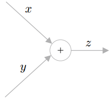
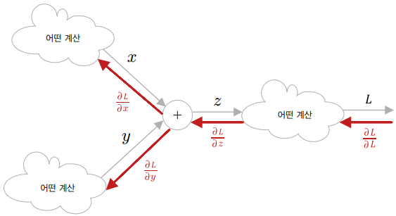
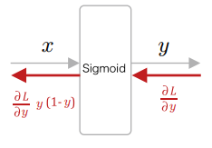
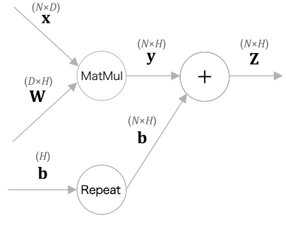
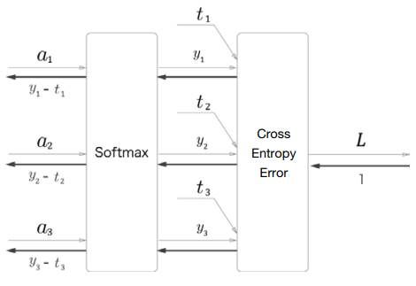

# 신경망의 학습

학습되지 않은 신경망은 좋은 추론을 해낼 수 없다. 때문에, 학습을 먼저 수행하고 학습된 매개변수를 이용해 추론을 수행하는 흐름이 일반적이다.  

<br/>

## 손실 함수

손실 함수란 머신러닝 모델이 예측한 값과 실제 값 사이의 차이를 측정하는 함수로, 모델이 얼마나 정확한지를 평가하고 학습 중에 이 차이를 최소화하도록 모델의 매개변수를 조정하는 데 사용된다.  
다중 클래스 분류 신경망에서는 손실 함수로 교차 엔트로피 오차를 많이 이용한다. 이것은 두 확률 분포 간의 차이를 측정하는 방법으로, 모델이 예측한 확률 분포와 실제 레이블에 대한 분포 사이의 차이를 계산한다.  

소프트맥스 함수의 출력의 각 원소는 0.0 이상 1.0 이하의 실수가 된다. 그리고 이 원소들을 모두 더하면 1.0이 된다.  
소프트맥스의 출력인 이 확률이 다음 차례인 교차 엔트로피 오차에 입력된다.  

 - `layers.py`
    - 소프트맥스 함수와 교차 엔트로피 오차를 계산하는 계층을 Softmax with Loss 계층 하나로 구현
```python
class SoftmaxWithLoss:
    def __init__(self):
        self.params, self.grads = [], []
        self.y = None  # softmax의 출력
        self.t = None  # 정답 레이블

    def forward(self, x, t):
        self.t = t
        self.y = softmax(x)

        # 정답 레이블이 원핫 벡터일 경우 정답의 인덱스로 변환
        if self.t.size == self.y.size:
            self.t = self.t.argmax(axis=1)

        loss = cross_entropy_error(self.y, self.t)
        return loss

    def backward(self, dout=1):
        batch_size = self.t.shape[0]

        dx = self.y.copy()
        dx[np.arange(batch_size), self.t] -= 1
        dx *= dout
        dx = dx / batch_size

        return dx
```

<br/>

## 미분과 기울기

신경망 학습의 목표는 손실을 최소화하는 매개변수를 찾는 것이다. 이떄, 중요한 것이 __미분과 기울기__ 이다.  

'행렬과 그 기울기의 형상이 같다'라는 성질을 이용하면 매개변수 갱신과 연쇄 법칙을 쉽게 구현할 수 있다.  

<br/>

## 연쇄 법칙

학습 시 신경망은 학습 데이터를 주면 손실을 출력한다.  
각 매개변수에 대한 손실의 기울기를 얻을 수 있다면, 그것을 사용해 매개변수를갱신할 수 있다.  
신경망의 기울기를 구하기 위해 __오차역전파법__ 이 등장하였고, 이것을 이해하기 위해서는 __연쇄 법칙__ 을 알아야 한다.  

<br/>

연쇄 법칙(Chain Rule)은 미적분학에서 함수의 합성에 대한 도함수를 계산하는 규칙 중 하나입니다. 연쇄 법칙은 합성 함수의 도함수를 구하는 공식으로, 여러 함수로 이루어진 합성 함수의 도함수를 각 함수의 도함수를 이용하여 계산할 수 있게 도와줍니다.  
 - 연쇄 법칙이란 합성함수에 대한 미분 법칙이다.
 - 연쇄 법칙이 중요한 이유는 우리가 다루는 함수가 아무리 복잡하다 하더라도, 즉 아무리 많은 함수를 연결하더라도, 그 미분은 개별 함수의 미분들을 이용해 구할 수 있기 때문이다.
 - 달리 말해, 각 함수의 극소적인 미분을 계산할 수 있다면 그 값들을 곱해서 전체의 미분을 구할 수 있다.
 - __신경망은 여러 함수가 연결된 것으로 볼 수 있고, 오차역전파법은 그 여러 함수에 대한 연쇄 법칙을 효율적으로 적용하여 기울기를 구해낸다.__

<br/>

## 계산 그래프

계산 그래프는 계산 과정을 시각적으로 보여준다.  
계산 그래프를 이용하면 계산을 시각적으로 파악할 수 있고, 기울기도 직관적으로 구할 수 있다.  

<div align="center">
    <br/>
    z = x + y를 나타내는 계산 그래프
</div>
<br/>

<div align="center">
    <br/>
   계산 그래프의 역전파<br/>
   연쇄 법칙에 따르면 역전파로 흐르는 미분 값은 상류로부터 흘러온 미분과 각 연산 노드의 극소적인 미분을 곱해 계산할 수 있다.
</div>
<br/>


 - `예시`
```python
# Repeat 노드
# 길이가 D인 배열을 N개로 복제
    # np.repeat() 메서드가 원소 복제를 수행, axis로 방향 지정
    # 역전파에서 총합을 구할 떄 np.sum() 이용
import numpy as np
D, N = 8, 7
x = np.random.randn(1, D)   # 입력
y = np.repeat(x, N, axis=0) # 순전파
dy = np.random.randn(N, D)  # 무작위 기울기
dx = np.sum(dy, axis=0, keepdims=True) # 역전파

# Sum 노드
# N*D 배열에 대해 그 총합을 0축에 대해 구하는 계산
import numpy as np
D, N = 8, 7
x = np.random.randn(N, D)   # 입력
y = np.sum(x, axis=0, keepdims=True) # 순전파

dy = np.random.randn(1, D)  # 무작위 기울기
dx = np.repeat(dy, N, axis=0) # 역전파

# MatMul 노드
# 행렬의 곱셈을 MatMul 노드로 표현한다.
    # 학습하는 매개변수를 params에 보관
    # 대응시키는 형태로, 기울기는 grads에 보관
    # 역전파에서는 dx와 dW를 구해 가중치의 기울기를 grads에 저장
class MatMul:
    def __init__(self, W):
        self.params = [W]
        self.grads = [np.zeros_like(W)]
        self.x = None

    def forward(self, x):
        W, = self.params
        out = np.dot(x, W)
        self.x = x
        return out

    def backward(self, dout):
        W, = self.params
        dx = np.dot(dout, W.T)
        dW = np.dot(self.x.T, dout)
        self.grads[0][...] = dW
        return dx
```

<br/>

## 기울기 도출과 역전파 구현

Sigmoid 계층, 완젼연결계층의 Affine 계층, Softmax with Loss 계층 구현  


 - `Sigmoid 계층`
    - 출력 쪽 계층으로부터 전해진 기울기에 시그모이드 함수의 미분을 곱하고, 그 값을 입력 쪽 계층에 전파한다.
    - 순전파 때는 출력을 인스턴스 변수 out에 저장하고, 역전파를 계산할 때 이 out 변수를 사용한다.
```python
class Sigmoid:
    def __init__(self):
        self.params, self.grads = [], []
        self.out = None

    def forward(self, x):
        out = 1 / (1 + np.exp(-x))
        self.out = out
        return out

    def backward(self, dout):
        dx = dout * (1.0 - self.out) * self.out
        return dx
```

<div align="center">
    
</div>
<br/>

 - `Affine 계층`
    - Affine 계층의 순전파는 y = np.matmul(x, W) + b로 구현할 수 있다.
    - 편향을 더할 때는 넘파이의 브로드캐스트가 사용된다.
    - Affine의 역전파는 MatMul 노드와 Repeat 노드의 역전파를 수행하면 구할 수 있다. Repeat 노드의 역전파는 np.sum() 메서드로 계산할 수 있는데, 이때 행렬의 형상을 잘 살펴보고 어느 축(axis)으로 합을 구할지 명시해야 한다. 마지막으로, 가중치 매개변수의 기울기를 인스턴스 변수 grads에 저장한다.
```python
class Affine:
    def __init__(self, W, b):
        self.params = [W, b]
        self.grads = [np.zeros_like(W), np.zeros_like(b)]
        self.x = None

    def forward(self, x):
        W, b = self.params
        out = np.dot(x, W) + b
        self.x = x
        return out

    def backward(self, dout):
        W, b = self.params
        dx = np.dot(dout, W.T)
        dW = np.dot(self.x.T, dout)
        db = np.sum(dout, axis=0)

        self.grads[0][...] = dW
        self.grads[1][...] = db
        return dx
```

<div align="center">
    
</div>
<br/>

 - `Softmax with Loss 계층`
    - Softmax 계층은 입력 (a1,a2,a3)를 정규화하여 (y1,y2,y3)를 출력한다.
    - Cross Entropy Error 계층은 Softmax의 출력(y1,y2,y3)와 정답 레이블(t1,t2,t3)를 받고, 이 데이터로부터 손실 L을 구해 출력한다.
```python
class SoftmaxWithLoss:
    def __init__(self):
        self.params, self.grads = [], []
        self.y = None  # softmax의 출력
        self.t = None  # 정답 레이블

    def forward(self, x, t):
        self.t = t
        self.y = softmax(x)

        # 정답 레이블이 원핫 벡터일 경우 정답의 인덱스로 변환
        if self.t.size == self.y.size:
            self.t = self.t.argmax(axis=1)

        loss = cross_entropy_error(self.y, self.t)
        return loss

    def backward(self, dout=1):
        batch_size = self.t.shape[0]

        dx = self.y.copy()
        dx[np.arange(batch_size), self.t] -= 1
        dx *= dout
        dx = dx / batch_size

        return dx
```

<div align="center">
    
</div>
<br/>

## 가중치 갱신

오차역전파법으로 기울기를 구했으면, 해당 기울기를 사용해 신경망의 매개변수를 갱신한다.  

 - `신경망 학습 과정`
    - 먼저 미니배치에서 데이터를 선택하고, 오차역전파법으로 가중치의 기울기를 얻는다.
    - 이 기울기는 현재의 가중치 매개변수에서 손실을 가장 크게하는 방향을 가리킨다. 따라서 매개변수를 그 기울기와 반대 방향으로 갱신하여 손실을 줄일 수 있다.
    - 이것을 경사하강법이라고 한다.
```
1. 미니배치
 - 훈련 데이터 중에서 무작위로 다수의 데이터를 골라낸다.

2. 기울기 계산
 - 오차역전파법으로 각 가중치 매개변수에 대한 손실 함수의 기울기를 구한다.

3. 매개변수 갱신
 - 기울기를 사용하여 가중치 매개변수를 갱신한다.

4. 반복
 - 1 ~ 3 단계를 필요한 만큼 반복한다.
```

 - `확률적경사하강법`
    - 기울기는 함수의 특정 지점에서의 변화율을 나타내며, 경사하강법은 현재 위치에서의 기울기가 가장 크게 감소하는 방향으로 이동하여 함수의 최솟값을 찾습니다.
    - 매개변수를 갱신하는 클래스는 update(params, grads)라는 공통 메서드를 구현한다.
        - params에는 신경망의 가중치
        - grads에는 기울기
        - params와 grads 리스트에는 대응하는 매개변수와 기울기가 같은 위치에 저장되어 있다고 가정한다.
```python
class SGD:
    '''
    확률적 경사하강법(Stochastic Gradient Descent)
    '''
    def __init__(self, lr=0.01):
        self.lr = lr
        
    def update(self, params, grads):
        for i in range(len(params)):
            params[i] -= self.lr * grads[i]


if __name__ == '__main__':
    # 1. 모델 초기화
    model = TwoLayerNet(..)

    # 2. 확률적 경사하강법
    optimizer = SGD()

    for i in range(10000):
        ...

        # 3. 미니배치를 가져온다.
        x_batch, t_batch = get_mini_batch(..)

        # 4. forward 메서드로 예측을 수행하고, 손실을 계산
        loss = model.forward(x_batch, t_batch)

        # 5. backward 메서드로 역전파를 수행하여 기울기 계산
        model.backward()

        # 6. update 메서드로 모델의 파라미터 업데이트
        # 모델의 가중치와 편향을 최적화하여 손실 함수를 최소화 하도록 기여
        optimizer.update(model.params, model.grads)
```

