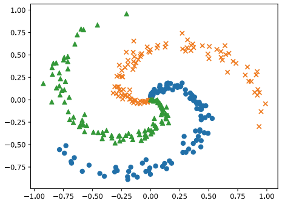

# 신경망으로 문제를 풀다

## 스파이럴 데이터셋

x가 입력 데이터이고, t가 정답 레이블이다.  
x와 t의 형상은 각각 300개의 샘플 데이터를 담고 있으며, x는 2차원 데이터이고 t는 3차원 데이터이다.  
t는 원핫 벡터로, 정답에 해당하는 클래스에는 1이, 그 외에는 0이 레이블되어 있다.  

```python
import sys
sys.path.append('..') # 부모 디렉토리의 파일을 가져올 수 있도록 설정
from dataset import spiral
import matplotlib.pyplot as plt

x, t = spiral.load_data()
print('x', x.shape) # (300, 2)
print('t', t.shape) # (300, 3)
```

<div align="center">
    
</div>
<br/>


## 신경망 구현

 - `two_layer_net.py`
```python
# coding: utf-8
import sys
sys.path.append('..')  # 부모 디렉터리의 파일을 가져올 수 있도록 설정
import numpy as np
from common.layers import Affine, Sigmoid, SoftmaxWithLoss


class TwoLayerNet:
    # 초기화: 입력층, 은닉층, 출력층 뉴런수를 받는다.
    # 우선 편향을 영벡터로 초기화하고, 가중치는 작은 무작위 값으로 초기화한다.
    def __init__(self, input_size, hidden_size, output_size):
        I, H, O = input_size, hidden_size, output_size

        # 가중치와 편향 초기화
        W1 = 0.01 * np.random.randn(I, H)
        b1 = np.zeros(H)
        W2 = 0.01 * np.random.randn(H, O)
        b2 = np.zeros(O)

        # 계층 생성
        self.layers = [
            Affine(W1, b1),
            Sigmoid(),
            Affine(W2, b2)
        ]
        self.loss_layer = SoftmaxWithLoss()

        # 모든 가중치와 기울기를 리스트에 모은다.
        self.params, self.grads = [], []
        for layer in self.layers:
            self.params += layer.params
            self.grads += layer.grads

    # 추론 수행
    def predict(self, x):
        for layer in self.layers:
            x = layer.forward(x)
        return x

    # 순전파
    def forward(self, x, t):
        score = self.predict(x)
        loss = self.loss_layer.forward(score, t)
        return loss

    # 역전파
    def backward(self, dout=1):
        dout = self.loss_layer.backward(dout)
        for layer in reversed(self.layers):
            dout = layer.backward(dout)
        return dout
```

<br/>

## 학습용 코드

 - `train_custom_loop.py`
    - 처음으로는 하이퍼파라미터를 설정한다.
        - 학습하는 에폭 수, 미니배치 크기, 은닉층의 뉴런 수, 학습률을 설정한다.
    - 다음으로 데이터를 읽어들이고, 신경망과 옵티마이저를 생성한다.
    - 학습은 미니배치 방식으로 진행되며 데이터를 무작위로 선택한다. 에폭 단위로 데이터를 뒤섞고, 뒤섞은 데이터 중 앞에서 순서대로 뽑아내는 방식을 사용한다.
```python
# coding: utf-8
import sys
sys.path.append('..')  # 부모 디렉터리의 파일을 가져올 수 있도록 설정
import numpy as np
from common.optimizer import SGD
from dataset import spiral
import matplotlib.pyplot as plt
from two_layer_net import TwoLayerNet


# 하이퍼파라미터 설정
max_epoch = 300
batch_size = 30
hidden_size = 10
learning_rate = 1.0

# 데이터 읽기, 모델과 옵티마이저 생성
x, t = spiral.load_data()
model = TwoLayerNet(input_size=2, hidden_size=hidden_size, output_size=3)
optimizer = SGD(lr=learning_rate)

# 학습에 사용하는 변수
data_size = len(x)
max_iters = data_size // batch_size
total_loss = 0
loss_count = 0
loss_list = []

for epoch in range(max_epoch):
    # 데이터 뒤섞기
    idx = np.random.permutation(data_size)
    x = x[idx]
    t = t[idx]

    for iters in range(max_iters):
        batch_x = x[iters*batch_size:(iters+1)*batch_size]
        batch_t = t[iters*batch_size:(iters+1)*batch_size]

        # 기울기를 구해 매개변수 갱신
        loss = model.forward(batch_x, batch_t)
        model.backward()
        optimizer.update(model.params, model.grads)

        total_loss += loss
        loss_count += 1

        # 정기적으로 학습 경과 출력
        if (iters+1) % 10 == 0:
            avg_loss = total_loss / loss_count
            print('| 에폭 %d |  반복 %d / %d | 손실 %.2f'
                  % (epoch + 1, iters + 1, max_iters, avg_loss))
            loss_list.append(avg_loss)
            total_loss, loss_count = 0, 0


# 학습 결과 플롯
plt.plot(np.arange(len(loss_list)), loss_list, label='train')
plt.xlabel('반복 (x10)')
plt.ylabel('손실')
plt.show()

# 경계 영역 플롯
h = 0.001
x_min, x_max = x[:, 0].min() - .1, x[:, 0].max() + .1
y_min, y_max = x[:, 1].min() - .1, x[:, 1].max() + .1
xx, yy = np.meshgrid(np.arange(x_min, x_max, h), np.arange(y_min, y_max, h))
X = np.c_[xx.ravel(), yy.ravel()]
score = model.predict(X)
predict_cls = np.argmax(score, axis=1)
Z = predict_cls.reshape(xx.shape)
plt.contourf(xx, yy, Z)
plt.axis('off')

# 데이터점 플롯
x, t = spiral.load_data()
N = 100
CLS_NUM = 3
markers = ['o', 'x', '^']
for i in range(CLS_NUM):
    plt.scatter(x[i*N:(i+1)*N, 0], x[i*N:(i+1)*N, 1], s=40, marker=markers[i])
plt.show()
```

<br/>

## 계산 고속화

신경망의 학습과 추론에 드는 연산량은 상당하다. 때문에, 신경망에서는 얼마나 빠르게 계산하느냐가 매우 중요한 주제다.  

<br/>

 - `비트 정밀도`
    - 넘파이의 부동소수점 수는 기본적으로 64비트 데이터 타입을 사용한다.
    - 신경망의 추론과 학습은 32비트 부동소수점 수로도 문제없이 수행할 수 있다. 계산 속도 측면에서도 32비트 부동소수점 수가 일반적으로 더 빠르다.
```python
# 타입 확인
import numpy as np
a = np.random.randn(3)
a.dtype # dtype('float64')

# 타입 변환
b = np.random.randn(3).astype(np.float32)
b.dtype # dtype('float32')

c = np.random.randn(3).astype('f')
c.dtype # dtype('float32')
```

<br/>

 - `GPU(쿠파이)`
    - 딥러닝의 계싼은 대량의 곱하기 연산으로 구성된다. 이 대량의 곱하기 연산 대부분은 병렬로 계산할 수 있는데, 이점에서 CPU보다 GPU가 유리하다.
    - 쿠파이는 GPU를 이용해 병렬 계산을 수행해주는 라이브러리로, 엔비디아의 GPU에서만 동작한다. 또한, CUDA라는 GPU 전용 범용 병렬 컴퓨팅 플랫폼을 설치해야 한다.
    - 쿠파이를 사용하면 엔비디아 GPU를 사용해 병렬 계산을 수행하며, 쿠파이는 넘파이와 호환되는 API를 제공한다.
```python
import cupy as cp
x = cp.arange(6).reshape(2, 3).astype('f')
x.sum(axis=1)
```

