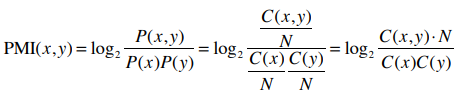

# 자연어와 단어의 분산 표현

## 자연어 처리란

자연어는 인간이 일상적으로 사용하는 언어를 의미합니다. 이는 사람들이 의사 소통과 정보 전달을 위해 사용하는 언어로, 문장, 단어, 문법 등을 포함합니다. __자연어는 사회 및 문화적 맥락에서 발전하며, 각 지역 및 고유한 커뮤니티에서 특화된 언어형태를 가지고 있습니다.__  

자연어 처리는 기계가 자연어로 작성된 문장을 이해하고, 정보를 추출하며, 필요에 따라 생성하거나 변형하는 작업을 포함합니다. 쉽게, 컴퓨터가 우리의 말을 알아듣게 만드는 것을 말합니다.  

일반적으로 컴퓨터가 이해할 수 있는 언어라고 하면 __프로그래밍 언어__ 와 __마크업 언어__ 같은 것이 있다. 이러한 언어는 코드의 의미를 고유하게 해석할 수 있도록 문법이 정의되어 있고, 컴퓨터는 이 정해진 규칙에 따라서 코드를 해석한다. 즉, 기계적이고 고정되어 있다.  

반면, 영어나 한국어 같은 자연어는 같은 의미의 문장도 여러 형태로 표현할 수 있고, 문장의 뜻이 애매할 수 있거나, 그 의미나 형태가 유연하게 바뀐다. 세월이 흐르면서 새로운 말이나 새로운 의미가 생겨나거나 있던 것이 사라지기까지 한다. 이 모두가 자연어가 부드럽기 때문이다.  

이처럼 부드러운 언어인 자연어를 컴퓨터에게 이해시키기란 엄청나게 어려운 도전이다. 하지만, 그 난제를 해결할 수 있다면, 수많은 사람에게 도움되는 일을 컴퓨터에게 시킬 수 있게 된다.  

<br/>

### 단어의 의미

우리 말은 문자로 구성되며, 말의 의미는 단어로 구성됩니다.  
즉, 단어는 의미의 최소 단위로 컴퓨터에게 자연어를 이해시키기 위해서는 단어의 의미를 이해시키는게 중요하다.  
단어의 의미를 잘 파악하기 위한 기법으로는 시소러스, 통계 기반 기법, 추론 기반 기법 등이 있다.  
 - 시소러스: 사람의 손으로 만든 유의어 사전인 시소러스를 이용하는 방법
 - 통계 기반 기법: 통계 정보로부터 단어를 표현
 - 추론 기반 기법: 신경망을 활용 (word2vec)

<br/>

## 시소러스

시소러스란 사전적 용어로 아래와 같다.  

 - 단어를 의미에 따라 분류·배열한 일종의 유의어 사전
 - 컴퓨터 등의 정보 검색에서 정확한 정보를 가려내기 위하여 사용되는 검색어의 어휘집

즉, 시소러스란 유의어 사전으로, '뜻이 같은 단어(동의어)'나 '뜻이 비슷한 단어(유의어)'가 한 그룹으로 분류되어 있다.  

<div align="center">
    <br/>
    "car", "auto", "automobile" 등은 모두 자동차를 뜻하는 동의어
</div>
<br/>

또한, 자연어 처리에 이용되는 시소러스에서는 단어 사이의 __상위와 하위__ 혹은 __전체와 부분__ 등 더 세세한 관계까지 정의해둔 경우도 있다.  

<div align="center">
    <br/>
    상·하위 관계 단어 그래프<br/>
    자동차의 상위 개념으로 동력차 라는 단어가 존재한다. <br/>
    반대로, 하위 개념으로 소형차, 해치백 등이 있다.
</div>
<br/>

이처럼 모든 단어에 대한 유의어 집합을 만든 다음, 단어들의 관계를 그래프로 표현하여 단어 사이의 연결을 정의할 수 있다. 이러한, 단어 네트워크를 이용하여 컴퓨터에게 단어 사이의 관계를 가르칠 수 있다.  

<br/>

### WordNet

WordNet은 프린스턴 대학교에서 1985년부터 구축하기 시작한 전통 있는 시소러스로, 지금까지 많은 연구와 다양한 자연어 처리 애플리케이션에서 활용되고 있다.  
WordNet을 사용하면 유의어를 얻거나 단어 네트워크를 이용할 수 있다. 또한, 이 단어 네트워크를 사용해 단어 사이의 유사도를 구할 수 있다.  
 - WordNet URL 링크: http://wordnetweb.princeton.edu/perl/webwn

<br/>

### 시소러스의 문제점

시소러스에는 수 많은 단어에 대한 동의어와 계층 구조 등의 관계가 정의되어 있다. 이러한 시소러스를 이용하면 단어의 의미를 컴퓨터에 전달할 수 있다.  
하지만, 이처럼 사람이 수작업으로 레이블링하는 방식에는 크나큰 결점이 존재한다.  

 - 시대 변화에 대응하기 어렵다
    - 우리가 사용하는 말은 때때로 새로운 단어가 생겨나고, 옛말은 언젠가 잊혀진다.
    - 또한, 시대에 따라 언어의 의미가 변하기도 한다. 예컨대 'heavy'라는 단어는 '무거운' 이라는 뜻이지만, '심각하다'라는 뜻도 있다.
 - 사람을 쓰는 비용은 크다.
    - 시소러스를 만드는 데 엄청난 인적 비용이 발생한다.
    - 현존하는 영어 단어의 수는 1,000만 개가 넘고, WordNet에 등록된 단어는 20만 개 이상이다.

<br/>

## 통계 기반 기법

말뭉치 또는 코퍼스(영어: corpus, 복수형: corpora)의 사전적 용어로 연언어 연구를 위해 특정한 목적을 가지고 언어의 표본을 추출한 집합을 말한다. 쉽게, 말뭉치의 담긴 문장들은 사람이 쓴 글로 자연어에 대한 사람의 지식이 충분히 담겨 있다. (문장을 쓰는 방법, 단어를 선택하는 방법, 단어의 의미 등)

이러한 말뭉치를 이용해 통계 분석 및 가설 검증을 수행하거나, 특정한 언어 영역 내에서 언어 규칙 발생의 검사와 그 규칙의 정당성 입증에 사용된다. 통계 기반 기법의 목표는 이처럼 사람의 지식으로 가득한 말뭉치에서 자동으로 핵심을 추출하는 것이다.  

<br/>

### 파이썬으로 말뭉치 전처리하기

말뭉치는 다양한 형태로 수집될 수 있습니다. 예를 들어, 웹 문서, 소설, 뉴스 기사, 전자메일, 소셜 미디어 게시물 등이 포함될 수 있습니다. 또한, 말뭉치는 특정 주제나 분야에 특화된 것일 수도 있고, 보다 일반적인 대화체나 문학 작품을 포함하는 것일 수도 있습니다.  
 - 위키백과와 구글 뉴스 등의 텍스트 데이터를 들 수 있다.

<br/>

 - `예제 코드`
    - 파이썬을 이용하여 매우 작은 텍스트 데이터(말뭉치)에 전처리를 진행한다.
    - 텍스트 데이터를 단어로 분할하고 그 분할된 단어들을 단어 ID 목록으로 변환하는 일을 한다.
```python
text = 'You say goodbye and I say hello.'

text = text.lower()
text = text.replace('.', ' .')
print(text) # You say goodbye and I say hello .

words = text.split(' ')
print(words) # ['you', 'say', 'goodbye', 'and', 'i', 'say', 'hello', '.']

# 단어에 ID를 부여하고, ID의 리스트를 이용할 수 있도록 가공
word_to_id = {} # 단어 > 단어 ID
id_to_word = {} # 단어 ID > 단어

for word in words:
    if word not in word_to_id:
        new_id = len(word_to_id)
        word_to_id[word] = new_id
        id_to_word[new_id] = word

print(word_to_id) # {'you': 0, 'say': 1, 'goodbye': 2, 'and': 3, 'i': 4, 'hello': 5, '.': 6}
print(id_to_word) # {0: 'you', 1: 'say', 2: 'goodbye', 3: 'and', 4: 'i', 5: 'hello', 6: '.'}

id_to_word[1] # 'say'
word_to_id['hello'] # 5
```

<br/>

 - `내포 표기 사용 예시`
    - 내포란 리스트나 딕셔너리 등의 반복문 처리를 간단하게 쓰기 위한 기법이다.
    - 파이썬의 내포 표기를 사용하여 단어 목록에서 단어 ID 목록으로 변환하고, 넘파이 배열로 변환한다.
```python
import numpy as np

corpus = [word_to_id[w] for w in words] # words -> w 순회 -> word_to_id[w]
corpus = np.array(corpus)
print(corpus) # [0 1 2 3 4 1 5 6]
```

<br/>

 - `말뭉치 전처리 수행 정리`
    - corpus는 단어 ID 목록, word_to_id는 단어에서 단어 ID로의 딕셔너리, id_to_word는 단어 ID에서 단어로 딕셔너리
```python
def preprocess(text):
    text = text.lower()
    text = text.replace('.', ' .')
    words = text.split(' ')

    word_to_id = {}
    id_to_word = {}
    for word in words:
        if word not in word_to_id:
            new_id = len(word_to_id)
            word_to_id[word] = new_id
            id_to_word[new_id] = word
    
    corpus = np.array([word_to_id[w] for w in words])

    return corpus, word_to_id, id_to_word

text = 'You say goodbye and I say hello.'
corpus, word_to_id, id_to_word = preprocess(text)
```

<br/>

### 단어의 분산 표현

색을 표현하는 방법으로는 '코발트블루', '싱크레드' 같은 고유한 이름을 붙이는 방법이 있고, RGB 라는 3원색을 비율로 섞어 표현하는 방법이 있다. 이 2가지 방법 중 RGB 같은 벡터 표현이 색을 더 정확하게 명시할 수 있다. 또한, 모든 색을 단 3개의 성분으로 간결하게 표현할 수 있고, 어떤 색인지 짐작하기도 쉽다.  

단어의 의미를 정확하게 파악하기 위한 방법으로도 벡터 표현을 이용할 수 있는데, __단어를 고정된 차원의 실수 벡터로 표현하는 방법을 단어의 분산 표현__ 이라고 한다.  

<br/>

### 분포 가설

분포 가설은 "단어의 의미는 주변 단어에 의해 형성된다"라는 가설로, 단어를 벡터로 표현하는 최근 연구도 대부분 이 가설에 기초한다. 쉽게, 분포 가설은 단어의 의미가 주변 문맥과 연관되어 있으며, 비슷한 문맥에서 나타나는 단어들은 비슷한 의미를 갖는다고 가정합니다.  

분포 가설이 말하고자 하는 바는 단처 자체에는 의미가 없고, 그 단어가 사용된 맥락이 의미를 형셩한다는 것이다. 맥락이란 특정 단어를 중심에 둔 그 주변 단어를 말하며, 맥락의 크기를 '윈도우 크기' 라고도 한다. 윈도우 크기가 1이면 좌우 한 단어씩, 2이면 좌우 두 단어씩이 맥락에 포함된다.  

<div align="center">
    
</div>
<br/>

### 동시발생 행렬

동시발생 행렬(Co-occurrence Matrix)은 자연어 처리와 텍스트 마이닝에서 사용되는 표현 방법 중 하나로, 문서나 문장에서 단어들이 함께 등장하는 빈도를 나타내는 행렬입니다. 이 행렬은 단어 간의 관계를 파악하고, 단어들 간의 유사성을 측정하는 데 활용됩니다.  
 - 단어에 주목했을 때, 그 주변에 어떤 단어가 몇 번이나 등장하는지를 세어 집계하는 방법
```python
import sys
sys.path.append('..')
import numpy as np
from common.util import preprocess

text = 'You say goodbye and I say hello.'
corpus, word_to_id, id_to_word = preprocess(text)

print(corpus) # [0 1 2 3 4 1 5 6]
print(id_to_word) # {0: 'you', 1: 'say', 2: 'goodbye', 3: 'and', 4: 'i', 5: 'hello', 6: '.'}
```

<div align="center">
    <br/>
    동시발생 단어 표
</div>
<br/>

 - `동시발생 행렬 코드`
    - 동시발생 행렬을 사용하면 단어의 벡터를 얻을 수 있다.
```python
C = np.array([
    [0, 1, 0, 0, 0, 0, 0],
    [1, 0, 1, 0, 1, 1, 0],
    [0, 1, 0, 1, 0, 0, 0],
    [0, 0, 1, 0, 1, 0, 0],
    [0, 1, 0, 1, 0, 0, 0],
    [0, 1, 0, 0, 0, 0, 1],
    [0, 0, 0, 0, 0, 1, 0],
], dtype=np.int32)

print(C[0]) # [0 1 0 0 0 0 0]
print(C[4]) # [0 1 0 1 0 0 0]
print(C[word_to_id['goodbye']]) # [0 1 0 1 0 0 0]
```

<br/>

 - `동시발생 행렬 만들기`
```python
'''동시발생 행렬 생성
:param corpus: 말뭉치(단어 ID 목록)
:param vocab_size: 어휘 수
:param window_size: 윈도우 크기(윈도우 크기가 1이면 타깃 단어 좌우 한 단어씩이 맥락에 포함)
:return: 동시발생 행렬
'''
def create_co_matrix(corpus, vocab_size, window_size=1):

    corpus_size = len(corpus)

    # 0으로 채워진 2차원 배열로 초기화
    co_matrix = np.zeros((vocab_size, vocab_size), dtype=np.int32)

    for idx, word_id in enumerate(corpus):
        for i in range(1, window_size + 1):
            left_idx = idx - i
            right_idx = idx + i

            if left_idx >= 0:
                left_word_id = corpus[left_idx]
                co_matrix[word_id, left_word_id] += 1

            if right_idx < corpus_size:
                right_word_id = corpus[right_idx]
                co_matrix[word_id, right_word_id] += 1

    return co_matrix
```

<br/>

### 벡터 간 유사도

벡터 간 유사도를 측정하는 방법으로는 베겉의 내적이나 유클리드 거리 등을 사용할 수 있다. 하지만, 보통 단어 벡터의 유사도를 나타낼 때는 __코사인 유사도__ 를 자주 사용한다. 코사인 유사도를 직관적으로 풀면, '두 벡터가 가리키는 방향이 얼마나 비슷한가'이다. 두 벡터의 방향이 완전히 같다면 코사인 유사도가 1이 되며, 완전히 반대라면 -1이 된다.  

분자에는 벡터의 내적, 분모에는 각 베겉의 노름이 등장한다. 노름은 벡터의 크기를 나타낸 것이다. 식의 핵심은 벡터를 정규화하고 내적을 구하는 것이다.  

<div align="center">
    <br/>
</div>
<br/>


 - `코사인 유사도 함수`
```python
'''코사인 유사도 산출
:param x: 벡터
:param y: 벡터
:param eps: '0으로 나누기'를 방지하기 위한 작은 값
:return:
'''
def cos_similarity(x, y, eps=1e-8):
    nx = x / (np.sqrt(np.sum(x ** 2)) + eps)
    ny = y / (np.sqrt(np.sum(y ** 2)) + eps)
    return np.dot(nx, ny)


# 'you'와 'i'의 유사도
import sys
sys.path.append('..')
from common.util import preprocess, create_co_matrix, cos_similarity

text = 'You say goodbye and I say hello.'
corpus, word_to_id, id_to_word = preprocess(text)
vocab_size = len(word_to_id)
C = create_co_matrix(corpus, vocab_size)

c0 = C[word_to_id['you']]  # "you"의 단어 벡터
c1 = C[word_to_id['i']]    # "i"의 단어 벡터
print(cos_similarity(c0, c1) # 0.7071..
```

<br/>

### 유사 단어의 랭킹 표시

코사인 유사도 함수를 활용해 어떤 단어가 검색어로 주어지면, 그 검색어와 비슷한 단어를 유사도 순으로 출력하는 함수를 구현한다.  

```python
'''유사 단어 검색
:param query: 쿼리(텍스트)
:param word_to_id: 단어에서 단어 ID로 변환하는 딕셔너리
:param id_to_word: 단어 ID에서 단어로 변환하는 딕셔너리
:param word_matrix: 단어 벡터를 정리한 행렬. 각 행에 해당 단어 벡터가 저장되어 있다고 가정한다.
:param top: 상위 몇 개까지 출력할 지 지정
'''
def most_similar(query, word_to_id, id_to_word, word_matrix, top=5):

    if query not in word_to_id:
        print('%s(을)를 찾을 수 없습니다.' % query)
        return

    print('\n[query] ' + query)
    query_id = word_to_id[query]
    query_vec = word_matrix[query_id]

    # 코사인 유사도 계산
    # 검색어의 단어 벡터와 다른 모든 단어 벡터와의 코사인 유사도를 각각 구한다.
    vocab_size = len(id_to_word)
    similarity = np.zeros(vocab_size)
    for i in range(vocab_size):
        similarity[i] = cos_similarity(word_matrix[i], query_vec)

    # 코사인 유사도를 기준으로 내림차순으로 출력
    # 계산한 코사인 유사도 결과를 기준으로 값이 높은 순서대로 출력한다.
    count = 0
    for i in (-1 * similarity).argsort():
        if id_to_word[i] == query:
            continue
        print(' %s: %s' % (id_to_word[i], similarity[i]))

        count += 1
        if count >= top:
            return


# "you"를 검색어로 지정해 유사한 단어들을 출력
import sys
sys.path.append('..')
from common.util import preprocess, create_co_matrix, most_similar


text = 'You say goodbye and I say hello.'
corpus, word_to_id, id_to_word = preprocess(text)
vocab_size = len(word_to_id)
C = create_co_matrix(corpus, vocab_size)

most_similar('you', word_to_id, id_to_word, C, top=5)

'''
결과: 말뭉치의 크기가 너무 작아 제대로된 유사도 확인이 불가
[query] you
goodbye: 0.707106..
i: 0.707106..
hello: 0.707106..
say: 0.0
and: 0.0
'''
```

<br/>

## 통계 기반 기법 개선하기

### 상호정보량

동시발생 행렬을 통해 두 단어가 동시에 발생한 횟수를 얻을 수 있다. 하지만, 발생 횟수로는 그리 좋은 특징으로 사용할 수 없다.  
예컨대, 말뭉치에서 "the"와 "car"의 동시 발생을 생각해보면, "the car" 라는 문구가 자주 보일 것이다. 따라서, 두 단어의 동시발생 횟수가 아주 높을 것이다. 한편, "car"와 "drive"는 관련이 높은 단어이다. 하지만, 단순히 등장 횟수만을 볼때 "the car"가 "car drive" 보다 관련성이 높다고 나온다.  

이러한 고빈도 단어에 관련성이 높게 나오는 것을 해결하기 위해 점별 상호정보량(PMI)이라는 척도를 사용할 수 있다. P(x)는 x가 일어날 확률, P(y)는 y가 일어날 확률, P(x,y)는 x와 y가 동시에 일어날 확률을 뜻한다. 이 PMI 값이 높을수록 관련성이 높게 된다.  

동시발생 행렬을 사용하여 다시 식을 변경하면, C는 동시발생 행렬, C(x,y)는 단어 x와 y가 동시발생하는 횟수, C(x)와 C(y)는 각각 단어 x와 y의 등장 횟수이다. 이때, 말뭉치에 포함된 단어 수를 N으로 표현할 수 있다.  

<div align="center">
    <br/>
</div>
<br/>

PMI를 이용하면 단어가 단독으로 출현하는 횟수가 고려되어 고빈도 단어에 대한 관련성이 높게 나오는 것을 해결할 수 있다.  
PMI에는 한 가지 문제가 있는데 바로 두 단어의 동시발생 횟수가 0이면 log20 = -inf 가 된다. 이 문제를 해결하기 위해 실제로 구현할 때는 양의 상호정보량(PPMI)를 사용한다.  

<div align="center">
    <br/>
</div>
<br/>

 - `PPMI 함수`
```python
'''PPMI(점별 상호정보량) 생성
:param C: 동시발생 행렬
:param verbose: 진행 상황을 출력할지 여부
:return:
'''
def ppmi(C, verbose=False, eps = 1e-8):

    M = np.zeros_like(C, dtype=np.float32)
    N = np.sum(C)
    S = np.sum(C, axis=0)
    total = C.shape[0] * C.shape[1]
    cnt = 0

    for i in range(C.shape[0]):
        for j in range(C.shape[1]):
            pmi = np.log2(C[i, j] * N / (S[j]*S[i]) + eps)
            M[i, j] = max(0, pmi)

            if verbose:
                cnt += 1
                if cnt % (total//100 + 1) == 0:
                    print('%.1f%% 완료' % (100*cnt/total))
    return M


# 동시발생 행렬을 PPMI 행렬로 변환
import sys
sys.path.append('..')
import numpy as np
from common.util import preprocess, create_co_matrix, cos_similarity, ppmi


text = 'You say goodbye and I say hello.'
corpus, word_to_id, id_to_word = preprocess(text)
vocab_size = len(word_to_id)
C = create_co_matrix(corpus, vocab_size)
W = ppmi(C)

np.set_printoptions(precision=3)  # 유효 자릿수를 세 자리로 표시
print('동시발생 행렬')
print(C)
print('-'*50)
print('PPMI')
print(W)
```

<br/>

PPMI 행렬에는 여전히 문제가 하나 있는데 말뭉치의 어휘 수가 증가함에 따라 각 단어 벡터의 차원 수도 증가한다는 큰 문제가 있다. 예를 들어, 말뭉치의 어휘 수가 10만 개라면 그 벡터의 차원 수도 10만이 된다.  

또한, 행렬의 원소 대부분이 0이다. 벡터의 원소 대부분이 중요하지 않는 값으로 표현되는데, 각 원소의 중요도가 낮다는 뜻이다. 이런 벡터는 노이즈에 약하고 견고하지 못하다는 약점이 있다.  

<br/>

### 차원 감소

차원 감소(Dimensionality Reduction)는 고차원 데이터의 특성을 보존하면서 데이터의 차원을 줄이는 과정을 의미합니다. 고차원 데이터는 많은 특성을 가지고 있어 복잡하게 구성되어 있을 수 있지만, 차원 감소를 통해 데이터를 더 낮은 차원으로 표현함으로써 계산 효율성을 향상하거나 데이터를 시각화하고 이해하기 쉽게 만들 수 있습니다.  

 - 벡터의 차원을 줄이는 방법 (중요한 정보는 최대한 유지하면서)
 - 원소 대부분이 0인 행렬을 희소행렬 또는 희소벡터라고 한다. 차원 감소의 핵심은 희소벡터에서 중요한 축을 찾아내어 더 적은 차원으로 다시 표현하는 것으로, 차원 감소의 결과로 원래의 희소벡터는 원소 대부분이 0이 아닌 밀집 벡터로 변환된다.

<br/>

### 특잇값 분해

특잇값분해(Singular Value Decomposition, SVD)는 행렬을 세 행렬의 곱으로 분해하는 기법 중 하나이다. 이 분해는 주로 선형 대수학 및 통계학에서 사용되며 차원 감소, 행렬 근사, 행렬의 랭크 결정 등 다양한 응용 분야에서 활용된다.  

SVD는 임의의 행렬 X를 U, S, V 라는 세 행렬의 곱으로 분해한다. 여기서 U와 V는 직교행렬이고, 그 열벡터는 서로 직교한다. 또한, S는 대각행렬이다.  

<div align="center">
    <br/>
</div>
<br/>

U는 직교행렬로, 이 직교행렬은 어떠한 공간의 축(기저)을 형성한다. 즉, U 행렬을 __단어 공간__ 으로 취급할 수 있다.  
S는 대각 행렬로, 대각성분에는 __특이값__ 이 큰 순서로 나열되어 있다. 특잇값이란, 쉽게 말해 해당 축의 중요도로 간주할 수 있다.  

행렬 S에서 특잇값이 작다면 중요도가 낮다는 뜻이므로, 행렬 U에서 여분의 열벡터를 깎아내어 원래의 행렬을 근사할 수 있다.

 - A=UΣV^T
    - U는 A의 왼쪽 특이벡터 행렬(Left Singular Vectors Matrix)입니다.
    - Σ는 A의 특이값 대각행렬(Singular Values Diagonal Matrix)입니다.
    - V^T는 A의 오른쪽 특이벡터 행렬의 전치(Right Singular Vectors Matrix Transpose)입니다.

<div align="center">
    <br/>
</div>
<br/>

### SVD에 의한 차원 감소

 - `count_method_small.py`
    - SVD는 넘파이의 linalg 모듈이 제공하는 svd 메서드로 실행할 수 있다.
    - linalg는 선형대수의 약어로 선형대수학 관련 함수를 제공한다.
```python
# coding: utf-8
import sys
sys.path.append('..')
import numpy as np
import matplotlib.pyplot as plt
from common.util import preprocess, create_co_matrix, ppmi


text = 'You say goodbye and I say hello.'
corpus, word_to_id, id_to_word = preprocess(text) # 전처리: 말뭉치, word_to_id, id_to_word 얻기
vocab_size = len(id_to_word)
C = create_co_matrix(corpus, vocab_size, window_size=1) # 동시발생 행렬 만들기
W = ppmi(C) # PPMI 행렬 변환

# SVD
U, S, V = np.linalg.svd(W)

np.set_printoptions(precision=3)  # 유효 자릿수를 세 자리로 표시
print(C[0]) # [0 1 0 0 0 0 0]
print(W[0]) # [ 0. 1.807 0. 0. 0. 0. 0. ]
print(U[0]) # [ 3.409e-01 -1.110e-16 -1.205e-01 -4.441e-16 0.000e+00 -9.323e-01 2.226e-16]

# 플롯
for word, word_id in word_to_id.items():
    plt.annotate(word, (U[word_id, 0], U[word_id, 1]))
plt.scatter(U[:,0], U[:,1], alpha=0.5)
plt.show()
```

<br/>

### PTB 데이터셋

PTB(Penn Treebank) 데이터셋은 주로 자연어 처리 및 언어 모델링 연구에 사용되는 표준화된 영어 텍스트 데이터셋 중 하나입니다. 이 데이터셋은 문장 구조를 나타내는 트리 구조로부터 추출된 텍스트로 구성되어 있습니다.  

PTB 데이터셋은 주로 트리뱅크 프로젝트의 일부로 개발되었으며, Penn Treebank에 수록된 원래의 월스트리트 저널(WSJ) 기사들에서 파생되었습니다. PTB 데이터셋은 문장 내 단어의 품사 태깅, 문법 트리, 문장 구조 등의 다양한 언어적 정보를 제공하며, 이를 통해 자연어 처리 모델을 학습하고 평가하는 데 사용됩니다.  
 - PTB 말뭉치는 텍스트 파일로 제공
 - 기존 PTB 문장에 몇가지 전처리가 되어있음
    - 희소한 단어를 '<unk>' 라는 특수 문자로 치환하거나, 구체적인 숫자를 'N'으로 대체하는 등 작업 적용

```python
# PTB 데이터셋 확인
# coding: utf-8
import sys
sys.path.append('..')
from dataset import ptb


corpus, word_to_id, id_to_word = ptb.load_data('train')

print('말뭉치 크기:', len(corpus)) # 929589
print('corpus[:30]:', corpus[:30])
print()
print('id_to_word[0]:', id_to_word[0]) # aer
print('id_to_word[1]:', id_to_word[1]) # banknote
print('id_to_word[2]:', id_to_word[2]) # berlitz
print()
print("word_to_id['car']:", word_to_id['car']) # 3856
print("word_to_id['happy']:", word_to_id['happy']) # 4428
print("word_to_id['lexus']:", word_to_id['lexus']) # 7426
```

<br/>

### PTB 데이터셋 평가

PTB 데이터셋에 통계 기반 기법을 적용한다.  

메서드는 무작위 수를 사용한 Truncated SVD로, 특이값이 큰 것들만 계산하여 기본적인 SVD보다 훨씬 빠르다.  

```python
# coding: utf-8
import sys
sys.path.append('..')
import numpy as np
from common.util import most_similar, create_co_matrix, ppmi
from dataset import ptb


window_size = 2
wordvec_size = 100

corpus, word_to_id, id_to_word = ptb.load_data('train')
vocab_size = len(word_to_id)
print('동시발생 수 계산 ...')
C = create_co_matrix(corpus, vocab_size, window_size)
print('PPMI 계산 ...')
W = ppmi(C, verbose=True)

print('calculating SVD ...')
try:
    # truncated SVD (빠르다!)
    from sklearn.utils.extmath import randomized_svd
    U, S, V = randomized_svd(W, n_components=wordvec_size, n_iter=5,
                             random_state=None)
except ImportError:
    # SVD (느리다)
    U, S, V = np.linalg.svd(W)

word_vecs = U[:, :wordvec_size]

querys = ['you', 'year', 'car', 'toyota']
for query in querys:
    most_similar(query, word_to_id, id_to_word, word_vecs, top=5)
```

<br/>

## 요약

컴퓨터에게 단어의 의미를 이해시키기 위해 시소러스를 이용한 기법과 통계 기반 기법이 있다.  
시소러스 기반 기법은 단어들의 관련성을 사람이 수작업으로 정의한다. 이 작업은 매우 힘들고 표현력에도 한계가 있다.  
통계 기반 기법은 말뭉치로부터 단어의 의미를 자동으로 추출하고, 그 의미를 벡터로 표현한다. 구체적으로는 단어의 동시발생 행렬을 만들고, PPMI 행렬로 변환한 다음, 안전성을 높이기 위해 SVD를 이용해 차원을 감소시켜 각 단어의 분산 표현을 만들어낸다.  
 - WordNet 등의 시소러스를 이용하면 유의어를 얻거나 단어 사이의 유사도를 측정하는 등 유용한 작업을 할 수 있다.
 - 시소러스 기반 기법은 시소러스를 작성하는 데 엄청난 인적 자원이 들고, 새로운 단어에 대응하기 어렵다는 문제가 있다.
 - 현재는 말뭉치를 이용해 단어를 벡터화하는 방식이 주로 쓰인다.
 - 최근의 단어 벡터화 기법들은 대부분 단어의 의미는 주변 단어에 의해 형성된다는 분포 가설에 기초한다.
 - 통계 기반 기법은 말뭉치 안의 각 단어에 대해서 그 단어의 주변 단어의 빈도를 집계한다. (동시발생 행렬)
 - 동시발생 행렬을 PPMI 행렬로 변환하고 다시 차원을 감소시킴으로써, 거대한 희소벡터를 작은 밀집벡터로 변환할 수 있다.
 - 단어의 벡터 공간에서는 의미가 가까운 단어는 그 거리도 가까울 것으로 기대된다.

