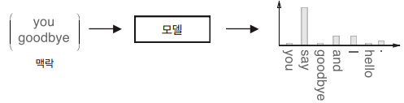
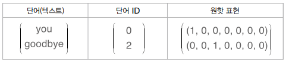
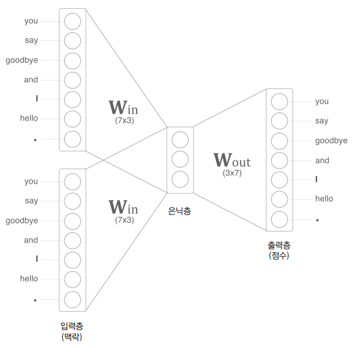
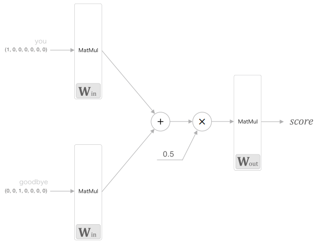
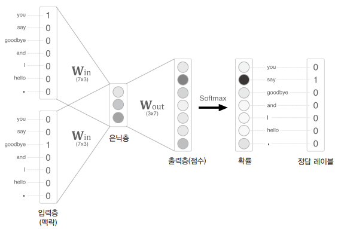
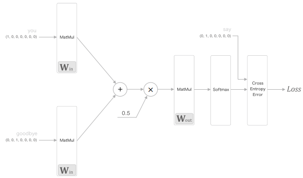
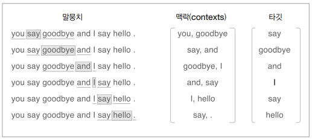
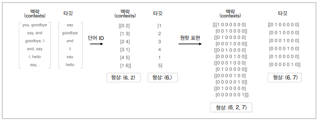
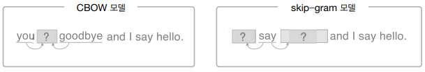
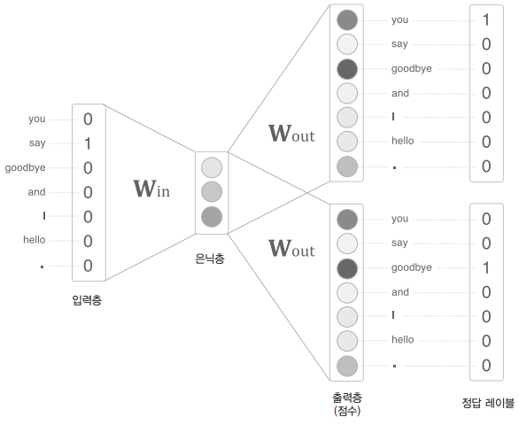

# word2vec

## 1. 추론 기반 기법과 신경망

### 통계 기반 기법의 문제점

통계 기반 기법에서는 주변 단어의 빈도를 기초로 단어를 표현한다. 구체적으로 단어의 동시발생 행렬을 만들고, 그 행렬에 SVD를 적용하여 밀집벡터를 얻는다. 이러한 경우 어휘가 100만 개라면, 통계 기반 기법에서는 100만 * 100만 이라는 거대한 행렬을 만들게 되는 문제가 있다.  

통계 기반 기법은 학습 데이터를 한꺼번에 처리한다. 이에 반해 추론 기반 기법은 학습 데이터의 일부를 사용하여 순차적으로 학습한다. 즉, 말뭉치의 어휘 수가 많아 SVD 등 계산량이 큰 작업을 처리하기 어려운 경우에도 신경망을 학습시킬 수 있다.  

<br/>

### 추론 기반 기법 개요

추론이란 주변 단어(맥락)가 주어졌을 때, 해당 주변 단어 사이에 어떤 단어가 들어가는지를 추측하는 작업을 말한다.  
즉, 추론 문제를 풀고 학습하는 것이 __추론 기반 기법__ 이 다루는 문제이다. 이러한 추론 문제를 반복해 풀면서 단어의 출현 패턴을 학습한다.  

<div align="center">
    <br/>
    
</div>
<br/>

### 신경망에서의 단어 처리

신경망을 이용해 단어를 처리할 때, 신경망은 "you", "say" 등 단어를 있는 그대로 처리할 수 없다. 때문에, 단어를 고정 길이 벡터로 변환해야 하는데 이때 사용하는 대표적인 방법이 단어를 __원핫 표현__ 으로 변환하는 것이다. 원핫 표현은 벡터의 원소 중 하나만 1이고 나머지는 모두 0인 벡터를 말한다.  

<div align="center">
    <br/>
    단어, 단어 ID, 원핫 표현
</div>
<br/>

'You say goodbye and I say hello.'라는 말뭉치가 있을 때, 입력층의 뉴런은 "you", "say", "goodbye", "and", "I", "hello", "." 으로 7개가 된다. 단어를 벡터로 나타낼 수 있고, 신경망을 구성하는 계층들은 벡터를 처리할 수 있다.  

<div align="center">
    
</div>
<br/>

 - `완전연결계층 예시`
    - 완전연결계층의 계산은 행렬 곱으로 수행할 수 있고, 행렬 곱은 넘파이의 np.matmul()이 해결해준다. (편향 생략시)
    - 맥락 c와 가중치 W의 곱으로 해당 위치의 행벡터를 추출한다.
```python
# Numpy matmul() 이용
import numpy as np

c = np.array([[1, 0, 0, 0, 0, 0]]) # 입력
W = np.random.randn(7, 3) # 가중치
h = np.matmul(c, W) # 중간 노드
print(h)

# common/MatMul 이용
import sys
sys.path.append('..')
import numpy as np
from common.layers import MatMul

c = np.array([[1, 0, 0, 0, 0, 0, 0]]) # 입력
W = np.random.randn(7, 3) # 가중치
layer = MatMul(W) # MatMul 계층의 가중치 설정
h = layer.forward(c) # 순전파 수행
print(h)
```

<br/>

## 2. 단순한 word2vec

기존의 word2vec 이라는 용어는 프로그램이나 도구를 가르키는 데 사용되었다. 하지만, 해당 용어가 유명해지면서 문맥에 따라서 신경망 모델을 가리키는 경우도 많이 볼 수 있게 되었다.  
CBOW 모델과 skip-gram 모델은 word2vec에서 사용되는 신경망이다.  

### CBOW 모델의 추론 처리

CBOW 모델은 맥락으로부터 타깃을 추측하는 용도의 신경망으로 쉽게, 주변 단어들을 이용하여 특정 단어를 예측하는 모델을 말한다.  

CBOW 모델의 신경망은 입력층 2개가 있고, 은닉층을 거쳐 출력층에 도달한다.  
은닉층의 뉴런은 입력층의 완전연결계층에 의해 변환된 값이 되며, 입력층이 여러 개이면 전체를 평균하면 된다. (입력층이 2개인 경우 (h1 + h2) / 2 )  
출력층의 뉴런은 총 7개로, 해당 뉴런 하나하나가 각각의 단어에 대응한다. 출력층 뉴런은 각 단어의 점수를 뜻하며, 값이 높을수록 대응 단어의 출현 확률이 높아진다.  
여기서 핵심은 은닉층의 뉴런수를 입력층의 뉴런수보다 적게하는 것이다. 이렇게 해야 은닉층에는 단어 예측에 필요한 정보를 간결하게 담게 되며, 결과적으로 밀집벡터 표현을 얻을 수 있다.  

<div align="center">
    
</div>
<br/>

 - `CBOW 모델 추론 처리`
    - 
```python
import sys
sys.path.append('..')
import numpy as np
from common.layers import MatMul

# 샘플 맥락 데이터
c0 = np.array([[1, 0, 0, 0, 0, 0, 0]])
c1 = np.array([[0, 0, 1, 0, 0, 0, 0]])

# 가중치 초기화
W_in = np.random.randn(7, 3)
W_out = np.random.randn(3, 7)

# 계층 생성
in_layer0 = MatMul(W_in) # MatMul 계층의 가중치 설정
in_layer1 = MatMul(W_in) # MatMul 계층의 가중치 설정 
out_layer = MatMul(W_out) # MatMul 계층의 가중치 설정

# 순전파
h0 = in_layer0.forward(c0) # 완전연결계층의 계산
h1 = in_layer1.forward(c1) # 완전연결계층의 계산
h = 0.5 * (h0 + h1) # 은닉층 뉴런 구하기
s = out_layer.forward(h) # 완전연결계층의 계산

print(s)
# [[ 0.30916255  0.45060817  -0.77308656  0.22054131  0.15037278
#   -0.93659277 -0.59612048  ]]
```

<div align="center">
    
</div>
<br/>

### CBOW 모델의 학습

CBOW 모델은 출력층에서 각 단어의 점수를 출력한다. 이 점수에 소프트맥스 함수를 적용하면 확률을 얻을 수 있다. 이러한 확률은 맥락이 주어졌을 때 그 중앙에 어떤 단어가 출현하는지를 알 수 있다.  
 - 소프트맥스 함수를 이용해 점수를 확률로 변환한다.
 - 확률과 정답 레이블로부터 교차 엔트로피 오차를 구한 후, 그 값을 손실로 사용해 학습한다.
    - Softmax 계층과 Cross Entropy Error 계층을 사용할 수 있지만, 두 계층을 Softmax with Loss라는 하나의 계층으로 구현할 수 있다.

<div align="center">
    <br/>
    
</div>
<br/>

### word2vec의 가중치와 분산 표현

word2vec에서 사용되는 신경망에는 입력 측 완전연결계층의 가중치(Win)와 출력 측 완전연결계층의 가중치(Wout) 두 가지 가중치가 있다.  
입력 측 가중치 Win의 각 행이 각 단어의 분산 표현에 해당하고, 출력 층 가중치 Wout에도 단어의 의미가 인코딩된 벡터가 저장되고 있다.  

<br/>

단어의 분산 표현으로 가중치를 선택하는 방식으로는 3가지가 있다.  
 - 1 번쨰: 입력 측의 가중치만 이용한다.
 - 2 번쨰: 출력 측의 가중치만 이용한다.
 - 3 번쨰: 양쪽 가중치 모두 이용한다.

word2vec 에서는 '입력 측의 가중치만 이용한다.'가 가장 대중적인 선택이다. 많은 연구에서 출력 측 가중치는 버리고 입력 측 가중치 Win 만을 최종 단어의 분산 표현으로서 이용한다.  

<br/>

## 3. 학습 데이터 준비

### 맥락과 타깃

word2vec에서 이용하는 신경망의 입력은 맥락이 된다. 그리고 그 정답 레이블은 맥락에 둘러싸인 중앙의 단어, 즉 타깃이 된다.  

<div align="center">
    
</div>
<br/>


 - `맥락과 타깃을 만드는 함수`
    - 단어 ID의 배열(corpus)와 맥락의 윈도우 크기(window_size)를 매개변수로 받는다.
    - 맥락과 타깃을 각각 넘파이 다차원 배열로 반환한다.
```python
def create_contexts_target(corpus, window_size=1):
    '''맥락과 타깃 생성

    :param corpus: 말뭉치(단어 ID 목록)
    :param window_size: 윈도우 크기(윈도우 크기가 1이면 타깃 단어 좌우 한 단어씩이 맥락에 포함)
    :return:
    '''
    target = corpus[window_size:-window_size]
    contexts = []

    for idx in range(window_size, len(corpus)-window_size):
        cs = []
        for t in range(-window_size, window_size + 1):
            if t == 0:
                continue
            cs.append(corpus[idx + t])
        contexts.append(cs)

    return np.array(contexts), np.array(target)


import sys
sys.path.append('..')
from common.util import preprocess

text = 'You say goodbye and I say hello.'
corpus, word_to_id, id_to_word = preprocess(text)
print(corpus) # [0 1 2 3 4 1 5 6]

contexts, target = create_contexts_target(corpus, window_size=1)
print(contexts)
# [[0 2]]
#  [1 3]
#  [2 4]
#  [3 1]
#  [4 5]
#  [1 6]]

print(target)
# [1 2 3 4 1 5]
```

<br/>

### 원핫 표현으로 변환

맥락과 타깃을 단어 ID에서 원핫 표현으로 변환한다.  

<div align="center">
    
</div>
<br/>

```python
def convert_one_hot(corpus, vocab_size):
    '''원핫 표현으로 변환

    :param corpus: 단어 ID 목록(1차원 또는 2차원 넘파이 배열)
    :param vocab_size: 어휘 수
    :return: 원핫 표현(2차원 또는 3차원 넘파이 배열)
    '''
    N = corpus.shape[0]

    if corpus.ndim == 1:
        one_hot = np.zeros((N, vocab_size), dtype=np.int32)
        for idx, word_id in enumerate(corpus):
            one_hot[idx, word_id] = 1

    elif corpus.ndim == 2:
        C = corpus.shape[1]
        one_hot = np.zeros((N, C, vocab_size), dtype=np.int32)
        for idx_0, word_ids in enumerate(corpus):
            for idx_1, word_id in enumerate(word_ids):
                one_hot[idx_0, idx_1, word_id] = 1

    return one_hot

import sys
sys.path.append('..')
from common.util preprocess, create_contexts_target, convert_one_hot

text = 'You say goodbye and I say hello.'
corpus, word_to_id, id_to_word = preprocess(text)

contexts, target = create_contexts_target(corpus, window_size=1)

vocab_size = len(word_to_id)
target = convert_one_hot(target, vocab_size) # 원핫 표현 변환
contexts = convert_one_hot(contexts, vocab_size) # 원핫 표현 변환
```

<br/>

## 4. CBOW 모델 구현

 - `simple_cbow.py`
```python
# coding: utf-8
import sys
sys.path.append('..')
import numpy as np
from common.layers import MatMul, SoftmaxWithLoss


class SimpleCBOW:
    def __init__(self, vocab_size, hidden_size):
        V, H = vocab_size, hidden_size

        # 가중치 초기화
        W_in = 0.01 * np.random.randn(V, H).astype('f')
        W_out = 0.01 * np.random.randn(H, V).astype('f')

        # 계층 생성
        self.in_layer0 = MatMul(W_in)
        self.in_layer1 = MatMul(W_in)
        self.out_layer = MatMul(W_out)
        self.loss_layer = SoftmaxWithLoss()

        # 모든 가중치와 기울기를 리스트에 모은다.
        layers = [self.in_layer0, self.in_layer1, self.out_layer]
        self.params, self.grads = [], []
        for layer in layers:
            self.params += layer.params
            self.grads += layer.grads

        # 인스턴스 변수에 단어의 분산 표현을 저장한다.
        self.word_vecs = W_in

    # 인수로 맥락과 타깃을 받아 손실을 반환한다.
    def forward(self, contexts, target):
        h0 = self.in_layer0.forward(contexts[:, 0])
        h1 = self.in_layer1.forward(contexts[:, 1])
        h = (h0 + h1) * 0.5
        score = self.out_layer.forward(h)
        loss = self.loss_layer.forward(score, target)
        return loss

    def backward(self, dout=1):
        ds = self.loss_layer.backward(dout)
        da = self.out_layer.backward(ds)
        da *= 0.5
        self.in_layer1.backward(da)
        self.in_layer0.backward(da)
        return None
```

<br/>

### 학습 코드 구현

학습 데이터를 준비해 신경망에 입력한 다음, 기울기를 구하고 가중치 매개변수를 순서대로 갱신한다.  

 - 
```python
import sys
sys.path.append('..')  # 부모 디렉터리의 파일을 가져올 수 있도록 설정
from common.trainer import Trainer
from common.optimizer import Adam
from simple_cbow import SimpleCBOW
from common.util import preprocess, create_contexts_target, convert_one_hot


window_size = 1
hidden_size = 5
batch_size = 3
max_epoch = 1000

text = 'You say goodbye and I say hello.'
corpus, word_to_id, id_to_word = preprocess(text)

vocab_size = len(word_to_id)
contexts, target = create_contexts_target(corpus, window_size)
target = convert_one_hot(target, vocab_size)
contexts = convert_one_hot(contexts, vocab_size)

model = SimpleCBOW(vocab_size, hidden_size)
optimizer = Adam()
trainer = Trainer(model, optimizer)

trainer.fit(contexts, target, max_epoch, batch_size)
trainer.plot()

word_vecs = model.word_vecs
for word_id, word in id_to_word.items():
    print(word, word_vecs[word_id])
```

<br/>

## word2vec 보충

### skip-gram 모델

skip-gram은 CBOW에서 다루는 맥락과 타깃을 역전시킨 모델이다.  
CBOW 모델은 맥락이 여러 개 있고, 그 여러 맥락으로부터 중앙의 단어(타깃)를 추측한다.  
skip-gram 모델은 중앙의 단어(타깃)로부터 주변의 여러 단어(맥락)을 추측한다.  

<div align="center">
    <br/>
    
</div>
<br/>

skip-gram 모델의 입력층은 하나이고, 출력층은 맥락의 수만큼 존재한다.  
따라서, 각 출력층에서는 Softmax with Loss 계층 등을 이용해 개별적으로 손실을 구하고, 이 개별 손실들을 모두 더한 값을 최종 손실로 한다.  

단어 분산 표현의 정밀도 면에서 skip-gram 모델이 CBOW 모델보다 결과가 더 좋은 경우가 많다. 특히 말뭉치가 커질수록 저빈도 단어나 유추 문제의 성능 면에서 skip-gram 모델이 더 뛰어난 경향이 있다. 반면, 학습 속도 면에서는 CBOW 모델이 더 빠르다. skip-gram 모델은 손실을 맥락의 수만큼 구해야 해서 계산 비용이 그만큼 커지게 된다.  

<br/>

### 통계 기반 vs 추론 기반

통계 기반 기법은 말뭉치의 전체 통계로부터 1회 학습하여 단어의 분산 표현을 얻는다. 추론 기반 기법에서는 말뭉치를 일부분씩 여러 번 보면서 학습한다.  

만약, 어휘에 추가할 새 단어가 생겨 단어의 분산 표현을 갱신해야 하는 상황이 있다면, 통계 기반 기법에서는 계산을 처음부터 다시 해야 한다. (동시발생 행렬을 다시 만들고, SVD 수행 등 일련의 작업 수행) 반면, 추론 기반 기법은 매개변수를 다시 학습할 수 있다. 즉, 학습한 가중치를 초깃값으로 사용해 다시 학습하면 되는데 이런 특성으로 학습한ㄱ ㅕㅇ험을 해치지 않으면서 단어의 분산 표현을 효율적으로 갱신할 수 있다.  

단어의 분산 표현의 성격이나 정밀도 면에서 통계 기반 기법은 주로 단어의 유사성이 인코딩된다. 한편, word2vec 에서는 단어의 유사성은 물론, 한층 복잡한 단어 사이의 패턴까지 파악되어 인코딩된다. 이런 이유로 추론 기반 기법이 통계 기반 기법보다 정확하다고 생각되지만, 실제로 유사성을 평가하면 우열을 가릴 수 없다고 한다.  

<br/>

## 정리

 - 추론 기반 기법은 추측하는 것이 목적이며, 그 부산물로 단어의 분산 표현을 얻을 수 있다.
 - word2vec은 추론 기반 기법이며, 단순한 2층 신경망이다.
 - word2vec은 skip-gram 모델과 CBOW 모델을 제공한다.
 - CBOW 모델은 여러 단어(맥락)로부터 하나의 단어(타깃)를 추측한다.
 - skip-gram 모델은 하나의 단어(타깃)로부터 다수의 단어(맥락)를 추측한다.
 - word2vec은 가중치를 다시 학습할 수 있으므로, 단어의 분산 표현 갱신이나 새로운 단어 추가를 효율적으로 수행할 수 있다.


