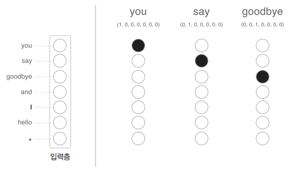

# word2vec

## 1. 추론 기반 기법과 신경망

### 통계 기반 기법의 문제점

통계 기반 기법에서는 주변 단어의 빈도를 기초로 단어를 표현한다. 구체적으로 단어의 동시발생 행렬을 만들고, 그 행렬에 SVD를 적용하여 밀집벡터를 얻는다. 이러한 경우 어휘가 100만 개라면, 통계 기반 기법에서는 100만 * 100만 이라는 거대한 행렬을 만들게 되는 문제가 있다.  

통계 기반 기법은 학습 데이터를 한꺼번에 처리한다. 이에 반해 추론 기반 기법은 학습 데이터의 일부를 사용하여 순차적으로 학습한다. 즉, 말뭉치의 어휘 수가 많아 SVD 등 계산량이 큰 작업을 처리하기 어려운 경우에도 신경망을 학습시킬 수 있다.  

<br/>

### 추론 기반 기법 개요

추론이란 주변 단어(맥락)가 주어졌을 때, 해당 주변 단어 사이에 어떤 단어가 들어가는지를 추측하는 작업을 말한다.  
즉, 추론 문제를 풀고 학습하는 것이 __추론 기반 기법__ 이 다루는 문제이다. 이러한 추론 문제를 반복해 풀면서 단어의 출현 패턴을 학습한다.  

<div align="center">
    <br/>
    
</div>
<br/>

### 신경망에서의 단어 처리

신경망을 이용해 단어를 처리할 때, 신경망은 "you", "say" 등 단어를 있는 그대로 처리할 수 없다. 때문에, 단어를 고정 길이 벡터로 변환해야 하는데 이때 사용하는 대표적인 방법이 단어를 __원핫 표현__ 으로 변환하는 것이다. 원핫 표현은 벡터의 원소 중 하나만 1이고 나머지는 모두 0인 벡터를 말한다.  

<div align="center">
    <br/>
    단어, 단어 ID, 원핫 표현
</div>
<br/>

'You say goodbye and I say hello.'라는 말뭉치가 있을 때, 입력층의 뉴런은 "you", "say", "goodbye", "and", "I", "hello", "." 으로 7개가 된다. 단어를 벡터로 나타낼 수 있고, 신경망을 구성하는 계층들은 벡터를 처리할 수 있다.  

<div align="center">
    
</div>
<br/>

 - `완전연결계층 예시`
    - 완전연결계층의 계산은 행렬 곱으로 수행할 수 있고, 행렬 곱은 넘파이의 np.matmul()이 해결해준다. (편향 생략시)
    - 맥락 c와 가중치 W의 곱으로 해당 위치의 행벡터를 추출한다.
```python
# Numpy matmul() 이용
import numpy as np

c = np.array([[1, 0, 0, 0, 0, 0]]) # 입력
W = np.random.randn(7, 3) # 가중치
h = np.matmul(c, W) # 중간 노드
print(h)

# common/MatMul 이용
import sys
sys.path.append('..')
import numpy as np
from common.layers import MatMul

c = np.array([[1, 0, 0, 0, 0, 0, 0]]) # 입력
W = np.random.randn(7, 3) # 가중치
layer = MatMul(W) # MatMul 계층의 가중치 설정
h = layer.forward(c) # 순전파 수행
print(h)
```

<br/>

## 2. 단순한 word2vec

기존의 word2vec 이라는 용어는 프로그램이나 도구를 가르키는 데 사용되었다. 하지만, 해당 용어가 유명해지면서 문맥에 따라서 신경망 모델을 가리키는 경우도 많이 볼 수 있게 되었다.  
CBOW 모델과 skip-gram 모델은 word2vec에서 사용되는 신경망이다.  

### CBOW 모델의 추론 처리

CBOW 모델은 맥락으로부터 타깃을 추측하는 용도의 신경망으로 쉽게, 주변 단어들을 이용하여 특정 단어를 예측하는 모델을 말한다.  

CBOW 모델의 신경망은 입력층 2개가 있고, 은닉층을 거쳐 출력층에 도달한다.  
은닉층의 뉴런은 입력층의 완전연결계층에 의해 변환된 값이 되며, 입력층이 여러 개이면 전체를 평균하면 된다. (입력층이 2개인 경우 (h1 + h2) / 2 )  
출력층의 뉴런은 총 7개로, 해당 뉴런 하나하나가 각각의 단어에 대응한다. 출력층 뉴런은 각 단어의 점수를 뜻하며, 값이 높을수록 대응 단어의 출현 확률이 높아진다.  
여기서 핵심은 은닉층의 뉴런수를 입력층의 뉴런수보다 적게하는 것이다. 이렇게 해야 은닉층에는 단어 예측에 필요한 정보를 간결하게 담게 되며, 결과적으로 밀집벡터 표현을 얻을 수 있다.  

<div align="center">
    
</div>
<br/>

 - `CBOW 모델 추론 처리`
    - 
```python
import sys
sys.path.append('..')
import numpy as np
from common.layers import MatMul

# 샘플 맥락 데이터
c0 = np.array([[1, 0, 0, 0, 0, 0, 0]])
c1 = np.array([[0, 0, 1, 0, 0, 0, 0]])

# 가중치 초기화
W_in = np.random.randn(7, 3)
W_out = np.random.randn(3, 7)

# 계층 생성
in_layer0 = MatMul(W_in) # MatMul 계층의 가중치 설정
in_layer1 = MatMul(W_in) # MatMul 계층의 가중치 설정 
out_layer = MatMul(W_out) # MatMul 계층의 가중치 설정

# 순전파
h0 = in_layer0.forward(c0) # 완전연결계층의 계산
h1 = in_layer1.forward(c1) # 완전연결계층의 계산
h = 0.5 * (h0 + h1) # 은닉층 뉴런 구하기
s = out_layer.forward(h) # 완전연결계층의 계산

print(s)
# [[ 0.30916255  0.45060817  -0.77308656  0.22054131  0.15037278
#   -0.93659277 -0.59612048  ]]
```

<div align="center">
    
</div>
<br/>

### CBOW 모델의 학습

CBOW 모델은 출력층에서 각 단어의 점수를 출력한다. 이 점수에 소프트맥스 함수를 적용하면 확률을 얻을 수 있다. 이러한 확률은 맥락이 주어졌을 때 그 중앙에 어떤 단어가 출현하는지를 알 수 있다.  
 - 소프트맥스 함수를 이용해 점수를 확률로 변환한다.
 - 확률과 정답 레이블로부터 교차 엔트로피 오차를 구한 후, 그 값을 손실로 사용해 학습한다.
    - Softmax 계층과 Cross Entropy Error 계층을 사용할 수 있지만, 두 계층을 Softmax with Loss라는 하나의 계층으로 구현할 수 있다.

<div align="center">
    <br/>
    
</div>
<br/>

### word2vec의 가중치와 분산 표현

word2vec에서 사용되는 신경망에는 입력 측 완전연결계층의 가중치(Win)와 출력 측 완전연결계층의 가중치(Wout) 두 가지 가중치가 있다.  
입력 측 가중치 Win의 각 행이 각 단어의 분산 표현에 해당하고, 출력 층 가중치 Wout에도 단어의 의미가 인코딩된 벡터가 저장되고 있다.  

<br/>

단어의 분산 표현으로 가중치를 선택하는 방식으로는 3가지가 있다.  
 - 1 번쨰: 입력 측의 가중치만 이용한다.
 - 2 번쨰: 출력 측의 가중치만 이용한다.
 - 3 번쨰: 양쪽 가중치 모두 이용한다.

word2vec 에서는 '입력 측의 가중치만 이용한다.'가 가장 대중적인 선택이다. 많은 연구에서 출력 측 가중치는 버리고 입력 측 가중치 Win 만을 최종 단어의 분산 표현으로서 이용한다.  

<br/>

