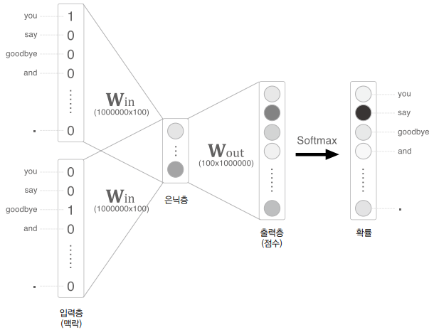
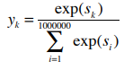

# word2vec 속도 개선

CBOW 모델은 단순한 2층 신경망으로 간단하게 구현할 수 있다. 하지만, 말뭉치에 포함된 어휘 수가 많아지면 계산량이 커진다는 문제가 존재한다. word2vec의 속도 개선을 위해서 Embedding 이라는 새로운 계층을 도입하고, 네거티브 샘플링이라는 새로운 손실 함수를 도입한다.  

<br/>

## 4.1 word2vec 개선

CBOW 모델은 단어 2개를 맥락으로 사용해, 이를 바탕으로 하나의 단어(타깃)를 추측한다. 이때, 입력측 가중치(Win)와의 행렬 곱으로 은닉층이 계산되고, 다시 출력측 가중치(Wout)와의 행렬 곱으로 각 단어의 점수를 구한다. 그리고 이 점수에 소프트맥스 함수를 적용해 각 단어의 출현 확률을 얻고, 이 확률을 정답 레이블과 비교하여 손실을 구한다.  

적은 수의 어휘를 다루는 데에는 문제가 없다. 하지만, 거대한 말뭉치를 다루게 되면 몇 가지 문제가 발생할 수 있다. 예를 들어, 어휘가 100만 개, 은닉층의 뉴런이 100개인 CBOW 모델을 구현한다고 가정한다. 이 경우 입력층과 출력층에는 각 100만 개의 뉴런이 존재한다.  

 - 입력층의 원핫 표현과 가중치 행렬 Win의 곱 계산
    - 어휘가 100만 개라면 그 원핫 표현 하나만 해도 원소 수가 100만 개인 벡터가 된다.
    - 상당한 메모리를 차지하며, 계산 자원을 상당히 사용하게 된다.
 - 은닉층과 가중치 행렬 Wout의 곱 및 Softmax 계층의 계산
    - Softmax 계층에서도 다루는 어휘가 많아짐에 따라 계산량이 증가한다.

<div align="center">
    
</div>
<br/>

### Embedding 계층

가중치 매개변수로부터 '단어 ID에 해당하는 행(벡터)'을 추출하는 Embedding 계층을 만든다.  

Win 파라미터의 1번째 행의 값이 그대로 나오게 된다. 왜냐하면 원-핫 인코딩 혀앹로 되어 있는 C에서 하나의 값만 1이고 나머지는 모두 0이다. 즉, 인덱스 번호만 잘 맞춰서 매핑시켜주면 h 값을 계산하기 위해 굳이 Win 행렬과 연산을 할 필요가 없어지게 된다.  

<br/>

### Embedding 계층 구현

 - `특정 행 추출 예시`
```python
import numpy as np
W = np.arange(21).reshape(7, 3)

# 특정 행 추출
W[2] # array([6, 7, 8])
W[5] # array([15, 16, 17])

# 여러 행 한번에 추출
idx = np.array([1, 0])
W[idx] # array([3, 4, 5], [0, 1, 2])
```

<br/>

 - `Embedding 계층 구현`
    - Embedding 계층의 순전파는 가중치 W의 특정행을 추출만 한다. 단순히, 가중치의 특정 행 뉴런만을 다음층으로 흘려보낸다.
    - 역전파에서는 앞 층으로부터 전해진 기울기를 다음 층으로 그대로 흘려준다. 다만, 앞 층으로부터 전해진 기울기를 가중치 기울기 dW의 특정 행에 설정한다.
```python
class Embedding:
    def __init__(self, W):
        self.params = [W]
        self.grads = [np.zeros_like(W)]
        self.idx = None

    def forward(self, idx):
        W, = self.params
        self.idx = idx
        out = W[idx]
        return out

    def backward(self, dout):
        dW, = self.grads
        dW[...] = 0
        np.add.at(dW, self.idx, dout)
        return None
```

<br/>

## 4.2 word2vec 개선

word2vec의 두 번째 개선은 은닉층 이후의 처리인 행렬 곱과 Softmax 계층의 계산이다. 이것은 네거티브 샘플링이라는 기법을 사용할 수 있다. Softmax 대신 네거티브 샘플링을 이용하면 어휘가 아무리 많아져도 계산량을 낮은 수준에서 일정하게 억제할 수 있다.  

<br/>

### 은닉층 이후 계산의 문제점

어휘가 100만 개, 은닉층 뉴런이 100개일 때를 예를 가정한다. 입력층과 출력층에는 뉴런이 각 100만개 씩 존재하게 된다. Embedding 계층을 도입하여 입력층 계산에서의 낭비를 줄였다. 남은 문제는 은기층 이후의 처리로 은닉층의 뉴런과 가중치 행렬의 곱과 Softmax 계층의 계산이 오래걸리게 된다.  
 - 거대한 행렬를 곱하는 문제: 은닉층의 벡터 크기가 100이고, 가중치 행렬의 크기가 100 * 100만이다. 이렇게 큰 행렬의 곱을 계산하려면 시간이 오래걸린다.
 - Softmax 문제: 어휘가 많아지면 Softmax의 계산량도 증가한다. Softmax 식에서 분모의 값을 얻으려면 exp 계싼을 100만 번 수행해야 한다.

<div align="center">
    
</div>
<br/>

### 다중 분류에서 이진 분류로

Softmax 식을 계산하려면 매번 100 만개의 si 값들을 모두 계산하게 된다. 이를 해결하기 위해 활성 함수를 Softmax에서 Sigmoid 함수로 교체해야 한다. 즉, 다중 분류 문제에서 이진 분류 문제로 변경해야 한다. 이러한 다중 분류 문제를 이진 분류로 변환하는 과정에서 네거티브 샘플링 기법이 사용된다.  

이진 분류는 "Yes/No"로 답하는 문제를 다룬다. 다중 분류 문제를 이진 분류 방식으로 해결하기 위해서는 "Yes/No"로 답할 수 있는 질문을 생각해야 한다. 예컨대 "맥락이 'you'와 'goodbye'일 때, 타깃 단어는 'say' 인가?" 라는 질문에 답하는 신경망을 생각해내야 한다. 이렇게 하면 출력층에는 뉴런을 하나만 준비하면 된다. 출력층의 뉴런은 하나로, 은닉층과 출력 측의 가중치 행렬의 내적은 "say"에 해당하는 열(단어 벡터)만 추출하고, 그 추출된 벡터와 은닉충 뉴런과의 내적을 계산하면 된다.  

 - 다중 분류: 'you'와 'goodbye' 라는 2개의 맥락 단어가 입력으로 주어졌을 때, 가운데에 나올 단어가 무엇인가?
 - 이진 분류: 'you'와 'goodbye' 라는 2개의 맥락 단어가 입력으로 주어졌을 때, 가운데에 나올 단어는 'say'인가?

<br/>

### 시그모이드 함수와 교차 엔트로피 오차

점수에 시그모이드 함수를 적용해 확률로 변환하고, 손실을 구할 때는 손실 함수로 교차 엔트로피 오차를 사용한다.  
 - 다중 분류: 출력층에서 점수를 확률로 변환할 때 '소프트맥스 함수'를 사용하고, 손실 함수로는 '교차 엔트로피 오차'를 사용한다.
 - 이진 분류: 출력층에서 점수를 확률로 변환할 때 '시그모이드 함수'를 사용하고, 손실 함수로는 '교차 엔트로피 오차'를 사용한다.
 - ※ 시그모이드 함수: 실수 값을 입력으로 받아서 0과 1 사이의 값을 출력하는 비선형 함수입니다. 주로 이진 분류 문제에서 확률을 나타내는 데 사용됩니다.

<br/>

### 다중 분류에서 이진 분류로 (구현)

은닉층 뉴런 h는 Embedding Dot 계층을 거쳐 Sigmoid with Loss 계층을 통과한다.  

```python
class EmbeddingDot:
    def __init__(self, W):
        self.embed = Embedding(W)
        self.params = self.embed.params # 매개변수
        self.grads = self.embed.grads   # 기울기
        self.cache = None               # 순전파 시의 계산 결과 유지 변수

    def forward(self, h, idx): # h: 은닉층 뉴런, idx: 단어 ID 배열
        target_W = self.embed.forward(idx)

        # 내적을 통해 입력 벡터 h와 단어의 임베딩 벡터를 곱하고 합산
        out = np.sum(target_W * h, axis=1)

        # 순전파 시 계산된 결과를 캐시에 저장
        self.cache = (h, target_W)

        # 내적 결과를 반환
        return out

    def backward(self, dout):
        # 순전파 시 저장된 입력과 단어의 임베딩 벡터를 가져옴
        h, target_W = self.cache
        # 역전파된 미분값을 적절한 형태로 reshape하여 계산
        dout = dout.reshape(dout.shape[0], 1)

        # 단어의 임베딩 벡터에 대한 미분값 계산
        dtarget_W = dout * h
        # 임베딩 계층의 역전파 수행
        self.embed.backward(dtarget_W)
        # 이전 계층으로 전파될 미분값 계산
        dh = dout * target_W

        # 이전 계층으로 전파될 미분값 반환
        return dh
```

<br/>

### 네거티브 샘플링

네거티브 샘플링은 부정적 예를 몇 개 샘플링하는 기법으로, 이를 이용하면 다중 분류를 이진 분류처럼 취급할 수 있다.  
긍적적인 예에 대해서 Sigmoid 계층의 출력을 1에 가깝게 만들고, 부정적인 예에 대해서는 Sigmoid 계층의 출력을 0에 가깝에 만든다.  

모든 부정적 예를 대상으로 하는 방법은 어휘 수가 늘어나면 감당할 수 없다. 그래서 근사적인 해법으로, 부정적 예를 몇개 선택한다. 즉, 적은 수의 부정적 예를 샘플링해 사용한다.  
정리하면, 네거티브 샘플링 기법은 긍정적 예를 타깃으로 한 경우의 손실을 구하고, 그와 동시에 부정적 예를 몇 개 샘플링(선별)하여, 그 부정적 예에 대해서도 손실을 구한다. 그리고 각각의 데이터의 손실을 더한 값을 최종 손실로 한다.  

<br/>

### 네거티브 샘플링의 샘플링 기법

네거티브 샘플링에서 부정적 예를 샘플링하기 위해서는 단순이 무작위로 샘플링하는 것보다 말뭉치의 통계 데이터를 기초로 샘플링하는 방법이 효율적이다. 쉽게, 말뭉치에서 자주 등장하는 단어를 많이 추출하고 드물게 등장하는 단어를 적게 추출하는 것이다.  

말뭉치에서의 단어 빈도를 기준으로 샘플링하려면, 먼저 말뭉치에서 각 단어의 출현 횟수를 구해 확률 분포로 나타낸 후에 확률 분포대로 단어를 샘플링하면 된다.  

 - `확률 분포에 따른 샘플링 코드 예시`
    - np.random.choice() 함수로 무작위 샘플링을 할 수 있다.
    - size 인수를 통해 샘플링 size를 지정한다.
    - replace=False 옵션을 사용하면, 샘플링시 중복을 없애준다.
    - p 인수에 확률 분포 리스트를 지정하면, 그 확률분포대로 샘플링한다.
```python
import numpy as np

# 0 ~ 9 까지의 숫자 중 하나를 무작위로 샘플링
np.random.choice(10) # 7

# words에서 하나만 무작위로 샘플링
words = ['you', 'say', 'goodbye', 'I', 'hello', '.']
np.random.choice(words) # 'say'

# 5개만 무작위로 샘플링(중복 허용)
np.random.choice(words, size=5)

# 5개만 무작위로 샘플링(중벅 제외)
np.random.choice(words, size=5, replace=False)

# 확률 분포에 따라 샘플링
p = [0.5, 0.1, 0.05, 0.2, 0.05, 0.1]
np.random.choice(words, p=p) # 'you'
```

<br/>

 - `네거티브 샘플링 함수 구현`
    - 네거티브 샘플링은 말뭉치에서 단어의 확률분포를 만들고, 다시 0.75를 제곱한 다음, np.random.choice() 함수를 사용해 부정적 예를 샘플링한다.
```python
class UnigramSampler:
    def __init__(self, corpus, power, sample_size):
        self.sample_size = sample_size
        self.vocab_size = None
        self.word_p = None

        counts = collections.Counter()
        for word_id in corpus:
            counts[word_id] += 1

        vocab_size = len(counts)
        self.vocab_size = vocab_size

        self.word_p = np.zeros(vocab_size)
        for i in range(vocab_size):
            self.word_p[i] = counts[i]

        self.word_p = np.power(self.word_p, power)
        self.word_p /= np.sum(self.word_p)

    def get_negative_sample(self, target):
        batch_size = target.shape[0]

        if not GPU:
            negative_sample = np.zeros((batch_size, self.sample_size), dtype=np.int32)

            for i in range(batch_size):
                p = self.word_p.copy()
                target_idx = target[i]
                p[target_idx] = 0
                p /= p.sum()
                negative_sample[i, :] = np.random.choice(self.vocab_size, size=self.sample_size, replace=False, p=p)
        else:
            # GPU(cupy）로 계산할 때는 속도를 우선한다.
            # 부정적 예에 타깃이 포함될 수 있다.
            negative_sample = np.random.choice(self.vocab_size, size=(batch_size, self.sample_size),
                                               replace=True, p=self.word_p)

        return negative_sample


# 사용 예시
corpus = np.array([0, 1, 2, 3, 4, 1, 2, 3])
power = 0.75
sample_size = 2

sampler = UnigramSampler(corpus, power, sample_size)
target = np.array([1, 3, 0])
negative_sample = sampler.get_negative_sample(target)
print(negative_sample)
# [[0 3] [1 2] [2 3]]
```

<br/>

### 네거티브 샘플링 구현

 - `NegativeSamplingLoss 함수`
```python
class NegativeSamplingLoss:
    # W: 출력측 가중치, corpus: 말뭉치, power: 확률분포 제곱값, sample_size: 샘플링 횟수
    def __init__(self, W, corpus, power=0.75, sample_size=5):
        self.sample_size = sample_size
        self.sampler = UnigramSampler(corpus, power, sample_size)
        self.loss_layers = [SigmoidWithLoss() for _ in range(sample_size + 1)]
        self.embed_dot_layers = [EmbeddingDot(W) for _ in range(sample_size + 1)]

        self.params, self.grads = [], []
        for layer in self.embed_dot_layers:
            self.params += layer.params
            self.grads += layer.grads

    def forward(self, h, target):
        batch_size = target.shape[0]
        negative_sample = self.sampler.get_negative_sample(target)

        # 긍정적 예 순전파
        score = self.embed_dot_layers[0].forward(h, target)
        correct_label = np.ones(batch_size, dtype=np.int32)
        loss = self.loss_layers[0].forward(score, correct_label)

        # 부정적 예 순전파
        negative_label = np.zeros(batch_size, dtype=np.int32)
        for i in range(self.sample_size):
            negative_target = negative_sample[:, i]
            score = self.embed_dot_layers[1 + i].forward(h, negative_target)
            loss += self.loss_layers[1 + i].forward(score, negative_label)

        return loss

    def backward(self, dout=1):
        dh = 0
        for l0, l1 in zip(self.loss_layers, self.embed_dot_layers):
            dscore = l0.backward(dout)
            dh += l1.backward(dscore)

        return dh
```

<br/>

## 4.3 개선판 word2vec 학습

Embedding 계층과 네거티브 샘플링 기법을 통해 word2vec을 개선하였다. 이러한 개선을 신경망 구현에 적용한다.  

<br/>

### CBOW 모델 구현

개선점으로는 Embedding 계층과 Negative Sampling Loss 계층을 적용하는 것이다.  

 - 초기화 메서드는 어휘수(vocab_size), 은닉층 뉴런수(hidden_size), 단어 ID 목록(ocrpus) 맥락의 크기(window_size) 촣 4개의 인수를 받는다. 가중치 초기화가 끝나면, 계층을 생성하는데 Embedding 계층을 2 * window_sizㄷ개 작성하여 인수턴스 변수인 in_layers에 배열로 보간한다. 그 다음 Negative Sampling Loss 계층을 생성한다.

```python
# coding: utf-8
import sys
sys.path.append('..')
from common.np import *  # import numpy as np
from common.layers import Embedding
from ch04.negative_sampling_layer import NegativeSamplingLoss


class CBOW:
    def __init__(self, vocab_size, hidden_size, window_size, corpus):
        V, H = vocab_size, hidden_size

        # 가중치 초기화
        W_in = 0.01 * np.random.randn(V, H).astype('f')
        W_out = 0.01 * np.random.randn(V, H).astype('f')

        # 계층 생성
        self.in_layers = []
        for i in range(2 * window_size):
            layer = Embedding(W_in)  # Embedding 계층 사용
            self.in_layers.append(layer)
        self.ns_loss = NegativeSamplingLoss(W_out, corpus, power=0.75, sample_size=5)

        # 모든 가중치와 기울기를 배열에 모은다.
        layers = self.in_layers + [self.ns_loss]
        self.params, self.grads = [], []
        for layer in layers:
            self.params += layer.params
            self.grads += layer.grads

        # 인스턴스 변수에 단어의 분산 표현을 저장한다.
        self.word_vecs = W_in

    def forward(self, contexts, target):
        h = 0
        for i, layer in enumerate(self.in_layers):
            h += layer.forward(contexts[:, i])
        h *= 1 / len(self.in_layers)
        loss = self.ns_loss.forward(h, target)
        return loss

    def backward(self, dout=1):
        dout = self.ns_loss.backward(dout)
        dout *= 1 / len(self.in_layers)
        for layer in self.in_layers:
            layer.backward(dout)
        return None
```

<br/>

### CBOW 모델 학습 코드

 - `train.py`
```python
# coding: utf-8
import sys
sys.path.append('..')
import numpy as np
from common import config
# GPU에서 실행하려면 아래 주석을 해제하세요(CuPy 필요).
# ===============================================
# config.GPU = True
# ===============================================
import pickle
from common.trainer import Trainer
from common.optimizer import Adam
from cbow import CBOW
from skip_gram import SkipGram
from common.util import create_contexts_target, to_cpu, to_gpu
from dataset import ptb


# 하이퍼파라미터 설정
window_size = 5    # 윈도우 크기
hidden_size = 100  # 은닉층 뉴런 수
batch_size = 100   # 배치 사이즈
max_epoch = 10

# 데이터 읽기
corpus, word_to_id, id_to_word = ptb.load_data('train')
vocab_size = len(word_to_id)

contexts, target = create_contexts_target(corpus, window_size)
if config.GPU:
    contexts, target = to_gpu(contexts), to_gpu(target)

# 모델 등 생성
model = CBOW(vocab_size, hidden_size, window_size, corpus)
# model = SkipGram(vocab_size, hidden_size, window_size, corpus)
optimizer = Adam()
trainer = Trainer(model, optimizer)

# 학습 시작
trainer.fit(contexts, target, max_epoch, batch_size)
trainer.plot()

# 나중에 사용할 수 있도록 필요한 데이터 저장
word_vecs = model.word_vecs
if config.GPU:
    word_vecs = to_cpu(word_vecs)
params = {}
params['word_vecs'] = word_vecs.astype(np.float16)
params['word_to_id'] = word_to_id
params['id_to_word'] = id_to_word
pkl_file = 'cbow_params.pkl'  # or 'skipgram_params.pkl'
with open(pkl_file, 'wb') as f:
    pickle.dump(params, f, -1)
```

<br/>

### CBOW 모델 평가

 - `eval.py`
```python
# coding: utf-8
import sys
sys.path.append('..')
from common.util import most_similar, analogy
import pickle


pkl_file = 'cbow_params.pkl'
# pkl_file = 'skipgram_params.pkl'

with open(pkl_file, 'rb') as f:
    params = pickle.load(f)
    word_vecs = params['word_vecs']
    word_to_id = params['word_to_id']
    id_to_word = params['id_to_word']

# 가장 비슷한(most similar) 단어 뽑기
querys = ['you', 'year', 'car', 'toyota']
for query in querys:
    most_similar(query, word_to_id, id_to_word, word_vecs, top=5)

# 유추(analogy) 작업
print('-'*50)
analogy('king', 'man', 'queen',  word_to_id, id_to_word, word_vecs)
analogy('take', 'took', 'go',  word_to_id, id_to_word, word_vecs)
analogy('car', 'cars', 'child',  word_to_id, id_to_word, word_vecs)
analogy('good', 'better', 'bad',  word_to_id, id_to_word, word_vecs)
```

<br/>

## 정리

 - Embedding 계층은 단어의 분산 표현을 담고 있으며, 순전파 시 지정한 단어 ID의 벡터를 추출한다.
 - word2vec은 어휘 수의 증가에 비례하여 계산량도 증가하므로, 근사치로 계산하는 빠른 기법을 사용하면 좋다.
 - 네거티브 샘플링은 부정적 예를 몇 개 샘플링하는 기법으로, 이를 이용하면 다중 분류를 이진 분류처럼 취급할 수 있다.
 - word2vec으로 얻은 단어의 분산 표현에는 단어의 의미가 녹아들어 있으며, 비슷한 맥락에서 사용되는 단어는 단어 벡터 공간에서 가까이 위치한다.
 - word2vec의 단어의 분산 표현을 이용하면 유추 문제를 벡터의 덧셈과 뺄셈으로 풀 수 있게 된다.
 - word2vec은 전이 학습 측면에서 특히 중요하며, 그 단어의 ㅂ누산 표현은 다양한 자연어 처리 작업에 이용할 수 있다.

