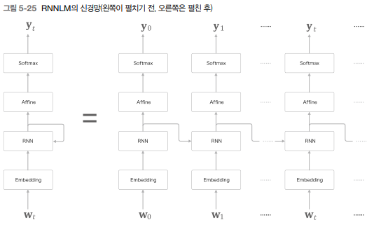

# 순환 신경망(RNN)

피드포워드란 흐름이 단방향인 신경망을 말한다. 즉, 입력 신호가 다음 층으로 전달되고, 그 신호를 받은 층은 그다음 층으로 전달되고, 한 방향으로만 신호가 전달된다.  

피드포워드 신경망은 구성이 단순하여 구조를 이해하기 쉽고, 많은 문제에 응용할 수 있다. 하지만, 시계열 데이터를 잘 다루지는 못한다. 피드포워드 신경망에서는 시계열 데이터의 성질을 충분히 학습할 수 없다.  

<br/>

## 1. 확률과 언어 모델

### word2vec을 확률 관점에서 바라보다

CBOW 모델은 맥락 W(t-1)과 W(t+1)로부터 타깃 W(t)를 추측하는 일을 수행한다.  

<div align="center">
    <br/>
    
</div>
<br/>

이번에는 맥락을 왼쪽 윈도우만으로 한정해본다.  
이전에 나온 단어들의 확률 값으로 이후 단어를 예측하게 된다.  

<div align="center">
    <br/>
    
</div>
<br/>

### 언어 모델

언어 모델은 단어 나열에 확률을 부여한다. 특정한 단어의 시퀀스에 대해서, 그 시퀀스가 일어날 가능성이 어느 정도인지를 확률로 평가한다.  

 - you say goodbye: 높은 확률
 - you say good die: 낮은 확률

<br/>

언어 모델은 새로운 문장을 생성하는 용도로 이용할 수 있다. 언어 모델은 단어 순서의 자연스러움을 확률적으로 평가할 수 있으므로, 그 확률분포에 따라 다음으로 적합한 단어를 샘플링할 수 있다.  
w1, .. , wm 이라는 m개 단어로 된 문장을 생각할 때, 단어가 w1, .. , wm 이라는 순서로 출현할 확률을 P(w1, .. ,wm)의 동시 확률로 나타낼 수 있다.  

<div align="center">
    
</div>
<br/>

### CBOW 모델을 언어 모델로

word2vec의 CBOW 모델을 언어 모델에 적용하기 위해서는 맥락의 크기를 특정 값으로 한정하여 근사적으로 나타낼 수 있다.  

<div align="center">
    <br/>
    2개의 단어를 맥락으로 이용하는 경우
</div>
<br/>

CBOW 모델의 맥락 크기는 얼마든지 키울 수 있다. 하지만, CBOW 모델에서는 맥락 안의 단어 순서가 무시된다는 한계가 있다.  
맥락의 단어 벡터를 은닉층에서 연결하는 방식을 취하면 맥락의 크기에 비례해 가중치 매개변수로 늘어나게 된다.  

이러한 문제를 해결하기 위해 순환 신경망(RNN)을 이용하는데, RNN은 맥락이 아무리 길더라도 그 맥락의 정보를 기억하는 메커니즘을 갖추고 있다.  
그래서, RNN을 사용하면 아무리 긴 시계열 데이터라도 대응할 수 있다.  

<br/>

## 2. RNN

RNN은 Recurrent Neural Network의 약자로, 순환 신경망을 나타냅니다. RNN은 일련의 데이터를 처리하거나 예측하는 데 사용되는 인공 신경망의 한 유형입니다. 이 네트워크는 이전 단계의 출력을 다음 단계의 입력으로 사용하여 순환적인 구조를 형성합니다.  

RNN은 주로 시계열 데이터나 연속적인 데이터를 다루는 데 효과적입니다. 예를 들어 자연어 처리 분야에서는 문장, 문서, 또는 대화와 같은 텍스트 데이터를 처리하는 데 사용될 수 있습니다. 또한 음성 인식, 기계 번역, 주식 시장 예측 등 다양한 응용 분야에서 활용됩니다.  

<br/>

### 순환하는 신경망

순환 경로에 따라 데이터는 끊임없이 순환할 수 있다. 그리고 데이터가 순환되기 떄문에 과거의 정보를 기억하는 동시에 최신 데이터로 갱신될 수 있다.  
시계열 데이터(x0, x1, .., xn)가 RNN 계층에 입력되며, 그 입력에 대응하여 (h0, h1, .., ht)가 출력된다.  
각 시각에 입력되는 xt는 벡터라고 가정하고, 문장을 다루는 경우를 예로 든다면 각 단어의 분산 표현(단어 벡터)이 xt가 되며, 이 분산 표현이 순서대로 하나씩 RNN 계층에 입력된다.  

<div align="center">
    
</div>
<br/>

### 순환 구조 펼치기

RNN 계층의 순환 구조를 펼침으로써 성장하는 긴 신경망으로 변신시킬 수 있다.  
해당 구조는 피드포워드 신경망처럼 데이터가 한 방향으로만 흐르는 구조를 갖는다.  
다만, 다수의 RNN 계층 모두가 실제로는 같은 계층이라는 점이 다르다.  

<div align="center">
    
</div>
<br/>

각 시각의 RNN 계층은 그 계층으로의 입력과 바로 직전의 RNN 계층으로부터의 출력을 받는다. 그리고 이 두 정보를 바탕으로 현 시각의 출력을 계산한다.  

<div align="center">
    
</div>
<br/>

RNN에서는 가중치가 2개 있다.  
하나는 입력 x를 출력 h로 변환하기 위한 가중치 Wx이고, 다른 하나는 1개의 RNN 출력을 다음 시각의 출렧으로 변환하기 위한 가중치 Wh이다. 또한, 편향 b도 있다.  

행렬 곱을 계산하고, 그 합을 tanh 함수를 이용해 변환한다. 그 결과가 시각 t의 출력 ht가 된다. ht는 다른 계층을 향해 위쪽으로 출력되는 동시에, 다음 시각의 RNN 계층을 향해 오른쪽으로 출력된다.  
ht는 한 시각 이전 출력 ht-1에 기초해 계산된다. 다른 관점으로 보면, RNN은 h라는 상태를 가지고 있으며, 이것을 상태를 가지는 계층 혹은 메모리가 있는 계층이라고 불린다.  

<br/>

### BPTT

BPTT는 시간 방향으로 펼친 신경망의 오차역전파법을 의미한다.  
순전파를 수행하고, 이어서 역전파를 수행하여 원하는 기울기를 구할 수 있는데, 여기서 사용하는 오차역전파법이 BPTT이다.  

<div align="center">
    
</div>
<br/>

하지만, 긴 시계열 데이터를 학습할 떄 문제가 있는데 시계열 데이터의 시간 크기가 커지는 것에 비례하여 BPTT가 소비하는 컴퓨팅 자원이 증가하는 문제와 시간 크기가 커지면 역전파 시의 기울기가 불안전해지는 문제가 있다.  

<br/>

### Truncated BPTT

큰 시계열 데이터를 취급할 때 흔히 신경망 연결을 적당한 길이로 끊는다.  
시간축 방향으로 너무 길어진 신경망을 적당한 지점에서 잘라내어 작은 신경망 여러 개로 만든다.  

Truncated BTPP 기법은 이런 잘라낸 작은 신경망에서 오차역전파법을 수행하는 기법이다.  

<br/>

#### 주의점

Truncated BPTT 주의점으로는 순전파의 연결은 유지하고, 역전파의 연결만을 끊는다는 점이다.  

<div align="center">
    <br>
    
</div>
<br/>

순전파 계산에는 앞 블록의 마지막 은닉 상태 값이 필요하다.  
RNN 학습에서는 데이터를 순서대로 입력하며, 은닉 상태를 계승하면서 학습을 수행한다.  

 - Step 1
    - 순전파) 입력데이터 x0 - x9 (10블록) ==> h0 - h9 출력
    - 역전파) dh9--->dx9 - dh0--->dx0
 - Step 2
    - 순전파) Step 1의 마지막 은닉 상태인 h9를 통해 계층 연결! 입력데이터 x10 - x19 (10블록) ==> h0 - h9 출력
    - 역전파) dh19--->dx19 - dh10--->dx10

<br/>

#### Truncated BPTT의 순전파와 역전파

 - __순전파 연결 유지와 역전파는 잘라서 사용__

Truncated BPTT에서 순전파는 연결을 유지하는 이유는 RNN의 순환적인 구조를 유지하기 위함입니다. RNN은 이전 시간 단계의 출력을 현재 시간 단계의 입력으로 사용하여 순환적인 관계를 형성하는데, 이러한 구조를 유지하면서 정보를 계속 전달할 수 있어야 합니다. 따라서 순전파 단계에서는 시퀀스의 연결을 계속 유지하여 RNN의 순환성을 보존합니다.  

그러나 __역전파 단계에서는 일반적으로 전체 시퀀스에 대해 역전파를 수행하는 것은 계산상 매우 비효율적__ 입니다. 특히 장기 시퀀스에서는 그래디언트 소실 또는 폭발 문제가 발생할 수 있으며, __이를 방지하기 위해 시퀀스를 일정 길이로 잘라서 역전파를 수행__ 합니다. 이렇게 함으로써 __효율적으로 그래디언트를 계산하고 전파하여 가중치를 업데이트__ 할 수 있습니다.  

<br/>

 - __역전파 연결 자르는게 가능한 이유__

__Truncated BPTT에서 역전파 단계에서는 이전 블록의 값이 필요__ 합니다. 역전파 과정에서는 그래디언트를 계산하여 가중치를 업데이트하는데, 이를 위해서는 이전 시간 단계에서의 출력과 이전 시간 단계에서의 은닉 상태(hidden state)가 필요합니다. __이전 시간 단계의 정보는 현재 시간 단계에서의 그래디언트 계산에 필요__ 하기 때문입니다.  

Truncated BPTT에서 역전파를 수행할 때는 이전 블록의 값이 필요하지만, __이전 블록의 값을 다시 계산하는 것이 아니라 순전파 단계에서 생성된 값들을 보존__ 합니다.  

구체적으로 말하자면, 각 블록에서는 순전파 과정에서 생성된 은닉 상태(hidden state)와 출력(output)을 메모리에 보관합니다. 이러한 값들은 역전파 단계에서 이전 블록의 값으로 사용됩니다.  

따라서 시퀀스를 여러 블록으로 나누어 역전파를 수행할 때, 각 블록에서는 이전 블록의 __순전파 과정에서 생성된 값들을 사용하여 그래디언트를 계산하고 역전파를 수행__ 합니다. 이전 블록의 값이 필요하지만, 이를 보관하고 있기 때문에 효율적으로 역전파를 수행할 수 있습니다.  

따라서 Truncated BPTT에서는 역전파를 위해 이전 블록의 값을 다시 계산하는 것이 아니라 순전파 과정에서 생성된 값을 재사용하여 효율적으로 학습을 진행합니다.  

<br/>

### Truncated BPTT 미니배치 학습

길이가 1,000인 시계열 데이터에 대해 시각의 길이를 10개 단위로 잘라 Truncated BPTT로 학습한다.  
 - RNN 계층의 입력 데이터로, 첫 번쨰 미니배치 때는 처음부터 순서대로 데이터를 제공
 - 두 번쨰 미니배치 때는 500번째의 데이터를 시작 위치로 정하고, 그 위치부터 다시 순서대로 데이터를 제공

<div align="center">
    
</div>
<br/>

 - 데이터 제공 방법
    - 데이터를 순서대로 제공하기, 미니배치별로 데이터를 제공하는 시작 위치 옮기기
    - 미니배치 학습을 수행할 때는 각 미니배치의 시작 위치를 오프셋으로 옮겨준 후 순서대로 제공하면 된다.
    - 데이터를 순서대로 입력하다 끝에 도달하면 다시 처음부터 입력하도록 한다.

<br/>

## 3. RNN 구현

다루게 되는 신경망은 길이가 T인 시계열 데이터를 받는다.  
그리고 각 시각의 은닉 상태를 T개 출력한다.  
 - 가로 크기가 일정한 일련의 신경망

<div align="center">
    <br/>
    RNN에서 다루는 신경망(가로 길이는 고정)
</div>
<br/>

입력과 출력을 각각 하나로 묶으면 옆으로 늘어선 일련의 계층을 하나의 계층으로 간주할 수 있다.  
x0, x1, .., xr-1을 묶은 xs를 입력하면 h0, h1, .., hr-1을 묶은 hs를 출력하는 단일 계층으로 본다.  

 - RNN 계층: Time RNN 계층 내에서 한 단계를 작업을 수행하는 계층
 - Time RNN 계층: T개 단계 분의 작업을 한꺼번에 처리하는 계층

<br/>

### RNN 계층 구현

RNN 순전파 식은 아래와 같다.  
데이터를 미니배치로 모아 처리한다. 따라서, xt와 ht에는 각 샘플 데이터를 행 방향에 저장한다.  

<div align="center">
    
</div>
<br/>

 - N: 미니배치 크기
 - D: 입력 벡터의 차원수
 - H: 은닉 상태 벡터의 차원수

<div align="center">
    
</div>
<br/>

 - `RNN 예제 코드`

```python
class RNN:
    # 가중치 2개와 편향 1개를 인수로 받는다.
    def __init__(self, Wx, Wh, b):
        self.params = [Wx, Wh, b] # 인수로 받은 매개변수를 params에 저장
        self.grads = [np.zeros_like(Wx), np.zeros_like(Wh), np.zeros_like(b)] # 기울기를 초기화 후 grads에 저장
        self.cacahe = None # 역전파 계산 시 사용되는 중간 데이터 보관
    
    # 순전파시 입력 x와 입력 가중치(h) 값을 받는다.
    def forward(self, x, h_prev):
        Wx, Wh, b = self.params
        t = np.matul(h_prev, Wh) + np.matmul(x, Wx) + b
        h_next = np.tanh(t)
        
        self.cache = (x, h_prev, h_next) # 입력 x, 입력 가중치, 출력 가중치 보관
        return h_next

    def backward(self, dh_next):
        Wx, Wh, b = self.params
        x, h_prev, h_next = self.cache
        
        dt = dh_next * (1 - h_next**2) # tanh 미분 
        db = np.sum(dt, axis=0)
        dWh = np.matmul(h_prev.T, dt)
        dh_prev = np.matmul(dt, Wh.T)
        dWx = np.matmul(x.T, dt)
        dx = np.matmul(dt, Wx.T)
        
        self.grads[0][...] = dWx
        self.grads[1][...] = dWh
        self.grads[2][...] = db
        
        return dx,dh_prev
```

<div align="center">
    <br/>
    <br/>
    계산 그래프 표현(순전파, 역전파)
</div>
<br/>

### Time RNN 계층 구현

Time RNN 계층은 T개의 RNN 계층으로 구성된다. 즉, Time RNN 계층은 RNN 계층 T개를 연결한 신경망이다.  

```python
class TimeRNN:
    # 가중치와 편향, stateful이라는 불리언 값을 받는다.
    def __init__(self, Wx, Wh, b, stateful=False):
        self.params = [Wx, Wh, b]
        self.grads = [np.zeros_like(Wx), np.zeros_like(Wh), np.zeros_like(b)]
        self.layers = None # RNN 계층을 리스트로 보관할 용도
        
        # h는 forward() 호출시 마지막 RNN 계층의 은닉 상태 저장
        # dh는 backward() 호출시 하나 앞 블록의 은닉 상태의 기울기를 저장 (역전파 구현시 사용)
        self.h, self.dh = None, None
        self.stateful = stateful
        
    def set_state(self, h):
        self.h = h
    
    def reset_state(self):
        self.h = None

    # 순전파 메서드
    # 입력 xs를 받는다. xs는 T개 분량의 시계열 데이터를 하나로 모은 것
    def forward(self, xs):
        Wx, Wh, b = self.params

        # N: 미니배치 크기, D: 입력 벡터의 차원 수
        N, T, D = xs.shape
        D, H = Wx.shape
        
        self.layers = []
        hs = np.empty((N, T, H), dtype='f')
        
        # stateful이 false이거나 처음 호출일 때 영행렬로 초기화
        if not self.stateful or self.h is None:
            self.h = zp.zeros((N, H), dtype='f')
        
        # RNN 계층이 각 시간 t의 은닉 상태 h를 계산하고, 이를 hs에 저장
        for t in range(T):
            layer = RNN(*self.params)
            self.h = layer.forward(xs[:, t, :], self.h)
            hs[:, t, :] = self.h
            self.layers.append(layer)
        
        return hs

    # 역전파 메서드
    def backward(self, dhs):
        Wx, Wh, b = self.params
        N, T, H = dhs.shape
        D, H = Wx.shape
        
        dxs = np.empty((N, T, D), dtype='f')
        dh = 0
        grads = [0, 0, 0]

        # RNN 계층의 backward() 메서드를 호출하여, 각 시각의 기울기 dx를 구해 dxs의 해당 인덱스에 저장
        for t in reversed(range(T)):
            layer = self.layers[t]
            dx, dh = layer.backward(dhs[:, t, :] + dh) # dht + dhnext 합산된 기울기
            dxs[:, t, :] = dx
            
            for i, grad in enumerate(layer.grads):
                grads[i] += grad
        
        for i, grad in enumerate(grads):
            self.grads[i][...] = grad
        self.dh = dh
        
        return dxs
```

<br/>

## 4. 시계열 데이터 처리 계층 구현

RNN을 사용한 언어 모델인 RNN Language Model(RNNLM)을 만들어본다.  
 - Embedding 계층
    - 단어 ID를 단어의 분산 표현(단어 벡터)으로 변환한다.
    - 해당 분산 표현이 RNN 계층으로 입력된다.
 - RNN 계층
    - 은닉 상태를 다음 층으로 출력함과 동시에, 다음 시각의 RNN 계층으로 출력한다.
    - RNN 계층이 출력한 은닉 상태는 Affine 계층을 거쳐 Softmax 계층으로 전해진다.

<div align="center">
    
</div>
<br/>

 - "You say goodbye and I say hello." 예시
    - 첫 단어로 단어 ID가 0인 "you"가 입력된다. 이때, Softmax 계층 출력으로 "say"가 가장 높게 나온다. 즉, "you" 다음에 "say"가 출현한다.
    - 두 번쨰 단어 "say"가 입력된다. Softmax 출력으로 "goodbye"와 "hello"가 높게 나왔다.
        - "you say goodbye"와 "you say hello" 둘다 자연스러운 문장이 된다.
        - 주목할 것은 RNN 계층의 "you say" 라는 맥락을 기억하고 있다는 것이다.
        - "you say" 라는 과거의 정보를 응집된 은닉 상태 벡터로 저장해두고, Affind 계층과 다음 시각의 RNN 계층에 전달된다.
        - 즉, RNNLM은 입력된 단어를 기억하고, 그것을 바탕으로 출현할 단어를 예측한다.

<div align="center">
    
</div>
<br/>

### Time 계층 구현

Time Affine, Time Embedding은 Affine 계층과 Embedding 계층을 T개 준비해서, 각 시각의 데이터를 개별적으로 처리하면 된다.  

<div align="center">
    
</div>
<br/>

T개분의 시계열 데이터를 한꺼번에 처리하는 계층을 Time XX 계층으로 통일한다.  
이러한 계층들이 구현되어 있다면, 그 계층들을 레고 블록처럼 조립하는 것만으로 시계열 데이터를 다루는 신경망을 완성할 수 있다.  

<div align="center">
    
</div>
<br/>

Softmax 계층을 구현할 때는 손실 오차를 구하는 Cross Entropy Error 계층도 함께 구현한다. 여기서는, Time Softmax with Loss 계층으로 구현한다.  

```python
class TimeEmbedding:
    def __init__(self, W):
        self.params = [W]
        self.grads = [np.zeros_like(W)]
        self.layers = None
        self.W = W

    def forward(self, xs):
        N, T = xs.shape
        V, D = self.W.shape
        
        out = np.empty((N,T,D),dtype='f')
        self.layers = []
        
        for t in range(T):
            layer = Embedding(self.W)
            out[:,t,:] = layer.forward(xs[:,t])
            self.layers.append(layer)
            
        return out
    
    def backward(self, dout):
        N, T, D = dout.shape
        grad = 0
        
        for t in range(T):
            layer = self.layers[t]
            layer.backward(dout[:,t,:])
            grad += layer.grads[0]
            
        self.grads[0][...] = grad
        return None

class TimeAffine:
    def __init__(self, W,b):
        self.params = [W,b]
        self.grads = [np.zeros_like(W),np.zeros_like(b)]
        self.x = None
        
    def forward(self, x):
        N, T, D = x.shape
        W, b = self.params
        
        rx = x.reshape(N*T, -1)
        out = np.dot(rx, W) + b
        
        self.x = x
        
        return out.reshape(N, T, -1)

    def backward(self, dout):
        x = self.x
        N, T, D = x.shape
        W, b = self.params

        dout = dout.reshape(N*T, -1)
        rx = x.reshape(N*T, -1)

        db = np.sum(dout, axis=0)
        dW = np.dot(rx.T, dout)
        dx = np.dot(dout, W.T)
        dx = dx.reshape(*x.shape)

        self.grads[0][...] = dW
        self.grads[1][...] = db

        return dx

# 시계열 버전의 Softmax
class TimeSoftmaxWithLoss:
    def __init__(self):
        self.params, self.grads = [], []
        self.cache = None
        self.ignore_label = -1

    def forward(self, xs, ts):
        N, T, V = xs.shape

        if ts.ndim == 3:  # 정답 레이블이 원핫 벡터인 경우
            ts = ts.argmax(axis=2)

        mask = (ts != self.ignore_label)

        # 배치용과 시계열용을 정리(reshape)
        xs = xs.reshape(N * T, V)
        ts = ts.reshape(N * T)
        mask = mask.reshape(N * T)

        ys = softmax(xs)
        ls = np.log(ys[np.arange(N * T), ts])
        ls *= mask  # ignore_label에 해당하는 데이터는 손실을 0으로 설정
        loss = -np.sum(ls)
        loss /= mask.sum()

        self.cache = (ts, ys, mask, (N, T, V))
        return loss

    def backward(self, dout=1):
        ts, ys, mask, (N, T, V) = self.cache

        dx = ys
        dx[np.arange(N * T), ts] -= 1
        dx *= dout
        dx /= mask.sum()
        dx *= mask[:, np.newaxis]  # ignore_label에 해당하는 데이터는 기울기를 0으로 설정

        dx = dx.reshape((N, T, V))

        return dx
```

<br/>

## 5. RNNLM 학습과 평가

<div align="center">
    
</div>
<br/>

```python
import numpy as np

class SimpleRnnlm:
    def __init__(self, vocab_size, wordvec_size, hidden_size):
        V, D, H = vocab_size, wordvec_size, hidden_size
        rn = np.random.randn
        
        # 가중치 초기화
        embed_W = (rn(V,D) / 100).astype('f')
        ## Xavier 초깃값 이용
        ## 이전 계층의 노드가 n개라면 표준편차가 1/sqrt(n)인 분포로 값을 초기화함
        rnn_Wx = (rn(D, H) / np.sqrt(D)).astype('f') 
        rnn_Wh = (rn(H, H) / np.sqrt(H)).astype('f')
        rnn_b = np.zeros(H).astype('f')
        affine_W = (rn(H, V) / np.sqrt(H)).astype('f')
        affine_b = np.zeros(V).astype('f')
        
        # 계층 생성
        self.layers = [
            TimeEmbedding(embed_W),
            TimeRNN(rnn_Wx, rnn_Wh, rnn_b, stateful=True),
            TimeAffine(affine_W, affine_b)
        ]
        self.loss_layer = TimeSoftmaxWithLoss()
        self.rnn_layer = self.layers[1]
        
        # 모든 가중치와 기울기를 리스트에 모은다.
        self.params, self.grads = [],[]
        for layer in self.layers:
            self.params += layer.params
            self.grads += layer.grads
            
    def forward(self, xs, ts):
        for layer in self.layers:
            xs = layer.forward(xs)
        loss = self.loss_layer.forward(xs, ts)
        return loss

    def backward(self, dout=1):
        dout = self.loss_layer.backward(dout)
        for layer in reversed(self.layers):
            dout = layer.backward(dout)
        return dout

    # 신경망의 상태 초기화 메서드
    def reset_state(self):
        self.rnn_layer.reset_state() 
```

<br/>

### 언어 모델의 평가

언어 모델은 주어진 과거 단어(정보)로부터 다음에 출현할 단어의 확률 분포를 출력한다. 이때 언어 모델의 예측 성능을 평가하는 척도로 __퍼플렉서티__ 를 자주 이용한다.  
퍼플렉서티는 간단히 말해 '확률의 역수'이다.  

예를 들어, 'you say goodbye and I say hello .' 에서 'you' 다음으로 'say'가 나올 확률이 0.8이라고 분포되어있고 정답이 'say'라면, 이때의 확률은 0.8이다.  
퍼플렉서티는 이 확률의 역수 1/(0.8) = 1.25라고 할 수 있습니다. 만약, say가 나올 확률이 0.2라고 나왔다면 퍼플렉서티는 5일 것입니다.  
즉, __퍼플렉서티는 작을 수록 좋다.__  
퍼플렉서티 값은 분기수로 해석할 수 있는데, 분기수란 다음에 취할 수 있는 선택사항의 수인 후보수로 볼 수 있다. 쉽게, 분기수가 1.25면 다음에 출현할 수 있는 단어의 후보는 1개이고, 분기수가 5이면, 다음에 출현할 후보가 5개나 되다는 뜻이다.  
 - N: 데이터의 총 개수
 - tn: 원핫 벡터로 나타낸 정답 레이블
 - tnk: n 개째 데이터의 k번째 값을 의미
 - ynk: 확률분포(신경망에서는 softmax의 출력)

<div align="center">
    
</div>
<br/>

### RNNLM 학습 코드

 - `RNNLM 학습 코드`
    - PTB 데이터셋 1000개 단어 이용
```python
import numpy as np
import sys
sys.path.append("../")
import matplotlib.pyplot as plt
import seaborn as sns

from common.optimizer import SGD
from dataset import ptb
from simple_rnnlm import SimpleRnnlm

# 하이퍼파라미터
batch_size = 10
wordvec_size = 100
hidden_size = 100 # RNN의 은닉 상태 벡터의 원소 수 
time_size = 5 # Truncated BPTT가 한 번에 펼치는 시간 크기
lr = 0.1
max_epoch = 100

# 학습 데이터 읽기
corpus, word_to_id, id_to_word = ptb.load_data('train')
corpus_size = 1000
corpus = corpus[:corpus_size]
vocab_size = int(max(corpus) + 1)

xs = corpus[:-1] # 입력
ts = corpus[1:] # 출력(정답 레이블) - xs보다 한 단어 앞
data_size = len(xs) # 999
print('말뭉치 크기: %d, 어휘 수: %d' % (corpus_size, vocab_size))

# 학습 시 사용하는 변수
max_iters = data_size // (batch_size * time_size)
time_idx = 0
total_loss = 0
loss_count = 0
ppl_list = []

# 모델 생성
model = SimpleRnnlm(vocab_size, wordvec_size, hidden_size)
optimizer = SGD(lr)

########################################
# 1 - 각 미니배치에서 샘플을 읽을 위치를 계산
jump = (corpus_size - 1) // batch_size
offsets = [i * jump for i in range(batch_size)]
#[0, 99, 198, 297, 396, 495, 594, 693, 792, 891] -> 오프셋의 각 원소에 데이터를 읽는 시작 위치가 담긴다!
########################################

for epoch in range(max_epoch):
    for iter in range(max_iters):
        ########################################
        # 2 - 미니배치 획득
        batch_x = np.empty((batch_size, time_size), dtype = 'i') #그릇 준비
        batch_t = np.empty((batch_size, time_size), dtype = 'i') ##그릇 준비
        for t in range(time_size): # time idx를 순차적으로 늘리면서 말뭉치에서 time idx위치의 데이터를 확보한다
            for i, offset in enumerate(offsets):
                batch_x[i,t] = xs[(offset + time_idx) % data_size]
                batch_t[i,t] = ts[(offset + time_idx) % data_size]
            time_idx += 1
        ########################################
        
        # 기울기를 구하여 매개변수 갱신
        loss = model.forward(batch_x, batch_t)
        model.backward()
        optimizer.update(model.params, model.grads)
        total_loss += loss
        loss_count += 1
        
    ########################################    
    # 3 - 에포크마다 퍼플렉시티 평가
    ppl = np.exp(total_loss / loss_count)
    print("| epoch %d | perplexity %.2f" % (epoch+1,ppl))
    ppl_list.append(float(ppl))
    total_loss, loss_count = 0,0
    ########################################
```

 - `에폭별 퍼플렉서티 결과`
    - 에폭별 퍼플렉서티 결과를 ppl_list에 저장했으므로, 이 리스트를 플롯하면 그래프를 얻을 수 있다.
    - 에폭마다의 퍼플렉서티를 구하기 위해 에폭마다 손실의 평균을 구하고, 그 값을 사용해 퍼플렉서티를 구했다.
    - __학습을 진행할수록 퍼플렉서티가 낮아짐을 알 수 있고, 처음에는 300을 넘던 값이 마지막에는 1에 근접한다.__
```python
plt.figure(figsize=(7,5))
sns.lineplot(list(range(100)),ppl_list)
plt.show()
```

<div align="center">
    
</div>
<br/>

## 6. 정리

RNN은 데이터를 순환시킴으로써 과거에서 현재, 그리고 미래로 데이터를 계속해서 흘려보낸다. 이를 위해 RNN 계층 내부에는 은닉 상태를 기억하는 기능이 추가됐다.  

RNN을 이용해 언어 모델을 만들 수 있다. 언어 모델은 단어 시퀀스에 확률을 부여하며, 특히 조건부 언어 모델은 지금까지의 단어 시퀀스로부터 다음에 출현할 단어의 확률을 계산해준다.  

 - RNN은 순환하는 경로가 있고, 이를 통해 내부에 은닉 상태를 기억할 수 있다.
 - RNN의 순환 경로를 펼침으로써 다수의 RNN 계층이 연결된 신경망으로 해석할 수 있으며, 보통의 오차역전파법으로 학습할 수 있다. (BPTT)
 - 긴 시계열 데이터를 학습할 때는 데이터를 적당한 길이씩 모으고, 블록 단위로 BPTT에 의한 학습을 수행한다. (Truncated BPTT)
 - Truncated BPTT에서는 역전파의 연결만 끊는다.
 - Truncated BPTT에서는 순전파의 연결을 유지하기 위해 데이터를 순차적으로 입력해야 한다.
 - 언어 모델은 단어 시퀀스를 확률로 해석한다.
 - RNN 계층을 이용한 조건부 언어 모델은 그떄까지 등장한 모든 단어의 정보를 기억할 수 있다.

<br/>

## 참고

 - https://github.com/woodongk/keracorn-nlp-study
 - https://velog.io/@a01152a/%EC%88%9C%ED%99%98-%EC%8B%A0%EA%B2%BD%EB%A7%9D-RNN-1

