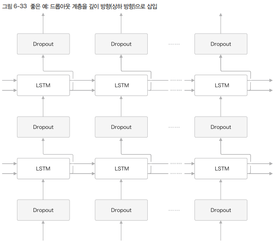

# 게이트가 추가된 RNN

RNN은 순환 경로를 포함하여 과거의 정보를 기억할 수 있고, 쉽게 구현이 가능하다. 하지만, 성능이 좋지 못하다.  
때문에, 최근에는 단순한 RNN 대신 LSTM이나 GRU라는 계층이 주로 사용된다.  

<br/>

## 1. RNN의 문제점

RNN은 시계열 데이터의 장기 의존 관계를 학습하기 어렵다.  
그 원인으로는 BPTT에서 기울기 소실 혹은 기울기 폭발이 일어나기 때문이다.  

<br/>

### 1-1. RNN 복습

RNN은 순환 경로를 갖고 있다.  
시계열 데이터인 xt를 입력하면 ht를 출력한다. 이러한 ht는 RNN 계층의 은닉 상태라고 하며, 과거 정보를 저장한다.  

<div align="center">
    <br/>
    
</div>
<br/>

### 1-2. 기울기 소실 또는 기울기 폭발

Tom was watching TV in his room. Mary came into the room. Mary said hi to '?'  
'?'에 들어갈 말은 'Tom'이다. RNNLM이 이 문제를 올바르게 답하려면, 현재 맥락에서 'Tom이 방에서 TV를 보고 있다.'와 '그 방에 Mary가 들어왔다.'란 정보를 기억해두어야 한다. 다시 말해 이런 정보를 RNN 계층의 은닉 상태에 인코딩해 보관해두어야 한다.  

RNN 계층이 과거 방향으로 '의미 있는 기울기'를 전달함으로써 시간 방향의 의존 관계를 학습할 수 있다.  
현재의 단순한 RNN 계층에서는 시간을 거슬러 올라갈수록 기울기가 작아지거나(기울기 소실) 혹은 커질 수 있는(기울기 폭발) 문제가 있다.  

<br/>

### 1-3. 기울기 소실과 기울기 폭발의 원인

<div align="center">
    
</div>
<br/>

역전파로 전해지는 기울기는 차례로 'tanh', '+', 'MatMul' 연산을 통과한다.  
 - '+'의 역전파는 상류에서 전해지는 기울기를 하류로 그대로 흘려보낸다.
 - 'tanh'는 역전파 시에 (1 - y^2)으로 흘러간다. 값은 1.0 이하이고, x가 0으로부터 멀어질수록 작아진다.
    - 역전파 시 tanh 노드를 지날 때 마다 값이 계속 작아진다.
    - tanh 함수를 T번 통과하면 기울기도 T번 반복해서 작아진다.
        - RNN 계층 활섬화 함수로 tanh 함수를 사용하는데, ReLU 함수로 바꾸면 기울기 소실을 줄일 수 있다.
        - ReLU는 입력 x가 0 이상이면, 역전파 시 상류의 기울기를 그대로 하류에 흘러보내 기울기가 작아지지 않는다.
 - 'tanh'을 무시하고, 'MatMul' 연산에 집중하면
    - 상류로부터 dh라는 기울기가 흘러오고, MatMul에서 dh * Wh.T라는 행렬 곱으로 기울기를 계산한다.
    - 기울기의 크기는 시간에 비례해 지수적으로 증가한다. 즉, 급격히 증가하여 기울기 폭발이 이러난다.
    - 기울기 폭발이 일어나면 결국 오버플로우를 일으켜 NaN 같은 값을 발생시킨다.
```python
# tanh 노드는 무시한다.

import numpy as np
import matplotlib.pyplot as plt

N = 2 # 미니배치 크기
H = 3 # 은닉 상태 벡터 차원 수 
T = 20 # 시계열 데이터의 길이 

dh = np.ones((N,H))
np.random.seed(3) # 재현할 수 있도록 난수 고정
Wh = np.random.randn(H,H)

norm_list = []
for t in range(T):
    dh = np.matmul(dh, Wh.T) # 역전파의 노드 수 만큼 dh를 갱신
    norm = np.sqrt(np.sum(dh**2)) / N # dh의 크기 : L2 norm 사용
    norm_list.append(norm) # 각 단계에서 dh의 크기를 norm_list에 추가
    
plt.plot(norm_list)
plt.show()
```
<div align="center">
    
</div>
<br/>

 - 초깃값에 0.5를 곱하여 변경해주면 기울기가 지수적으로 감소한다. 즉, 기울기 소실이 일어난다.
 - 기울기 소실이 일어나면 기울기가 매우 빠르게 작아져 가중치 매개변수가 더 이상 갱신되지 않아 학습 효과가 발생하지 않는다.
```python
# Wh = np.random.randn(H, H) # 변겅 전
Wh = np.random.randn(H, H) * 0.5 # 변경 후
```
<div align="center">
    
</div>
<br/>

### 1-4. 기울기 폭발 대책

기울기 폭발 대책으로는 __기울기 클리핑__ 이라는 기법이 있다.  

 - 모든 매개변수에 대해 하나의 기울기로 처리한다고 가정하고, 이를 g^로 표기한다.
 - threshold값을 문턱값으로 설정한다.
 - 기울기의 L2노름 ||g^|| 이 문턱값 초과시 기울기를 수정한다.
<div align="center">
    
</div>
<br/>

```python
import numpy as np

dW1 = np.random.rand(3,3) * 10
dW2 = np.random.rand(3,3) * 10
grads = [dW1, dW2] # 기울기의 리스트
max_norm = 5.0 # threshold

# 기울기 클리핑 함수
def clip_grads(grads, max_norm):
    total_norm = 0
    for grad in grads:
        total_norm += np.sum(grad ** 2)
    total_norm = np.sqrt(total_norm)
        
    rate = max_norm / (total_norm + 1e-6)
    if total_norm >= max_norm :
        for grad in grads:
            grad *= rate
            
display("clipping 전", grads)
clip_grads(grads,max_norm)
print()
display("clipping 후", grads)
```

<br/>

## 2. 기울기 소실과 LSTM

RNN 학습에서는 기울기 소실이라는 큰 문제가 있다. 이러한, 문제를 해결하기 위해서는 RNN 계층의 아키텍처를 고쳐야한다.  
이러한 문제를 해결하기 위해 LSTM과 GRU라는 게이트가 추가된 RNN이 등장하게 된다.  

<br/>

### 2-1. LSTM 인터페이스

RNN 계층과 LSTM 계층의 인터페이스에는 c라는 경로가 있다는 차이가 있다.  
c를 기억 셀이라 하며, LSTM 전용의 기억 메커니즘이다.  
 - 기억 셀(c)은 LSTM 계층 끼리만 주고 받는다.
    - LSTM 계층 내에서만 완결되고, 다른 계층으로는 출력하지 않는다.
    - 반면에, LSTM의 은닉 상태 h는 RNN 계층과 마찬가지로 다른 계층(위쪽)으로 출력된다.

<div align="center">
    
</div>
<br/>

### 2-2. LSTM 계층 조립하기

LSTM에는 기억 셀(ct)가 있다.  
ct에는 시각 t에서의 LST의 기억이 저장되어 있는데, 과거로부터 시각 t까지에 필요한 모든 정보가 저장되어 있다.  
필요한 정보를 모두 간직한 이 기억을 바탕으로, 외부 계층에 은닉 상태 ht를 출력한다. (h1는 기억 셀의 값을 tanh 함수로 변환한 값이다.)  
 - 현재의 기억 셀(ct)는 3개의 입력 ct-1, ht-1, xt로부터 특정한 계산을 수행하여 구한다.
    - 기억셀(ct)와 은닉상태(ht)의 원소 수가 같게 된다.
    - 기억셀이 100개면 은닉 상태도 100개이다.

<div align="center">
    
</div>
<br/>

#### 게이트의 역할

게이트는 게이트의 열림 상태를 제어하기 위해서 전용 매개변수를 이용하며, 이 가중치 매개변수는 학습 데이터로부터 갱신된다. 게이트의 열림 상태를 구할 때는 시그모이드 함수를 사용한다. (0.0 ~ 1.0 사이 값)  
 - LSTM에서 사용하는 게이트는 열기/닫기 뿐 아니라, 어느 정도를 줄지 조절할 수 있다.

<br/>

### 2-3. output 게이트

Output 게이트는 다음 은닉 상태 ht의 출력을 담당하는 게이트를 말한다.  
 - 게이트는 tanh(ct)의 각 원소에 대해 그것이 다음 시각의 은닉 상태에 얼마나 중요한가를 조정한다.

<div align="center">
    <br/>
    
</div>
<br/>

### 2-4. forget 게이트

Forget 게이트는 Ct-1 기억 중에서 불필요한 기억을 잊게 해주는 게이트를 말한다.  

<div align="center">
    <br/>
    
</div>
<br/>

### 2-5. 새로운 기억 셀

forget으로 이전 시각의 기얼 셀로부터 잊어야 할 기억은 삭제 되었다. 그렇다면, 새로 기억해야 할 정보를 기억 셀에 추가해야 한다.  
 - tanh 노드가 계산한 결과가 이전 시각의 기억 셀 ct-1에 더해진다.

<div align="center">
    <br/>
    
</div>
<br/>

### 2-6. input 게이트

Input 게이트는 g의 각 원소가 새로 추가되는 정보로써의 가치가 얼마나 큰지를 판단한다.  
새 정보를 무비판적으로 수용하는 것이 아니라, 적절히 선택하는 것이 이 게이트의 역할이다.  

<div align="center">
    <br/>
    
</div>
<br/>

### 2-7. LSTM 기울기 흐름

RNN의 역전파에서는 똑같은 가중치 행렬을 사용하여 행렬 곱을 반복하였다. 때문에, 기울기 소실 또는 기울기 폭발이 일어난다.  

반면, LSTM의 역전파에서는 행렬 곱이 아닌 원소별 곱이 이루어진다. 매 시각 다른 게이트 값을 이용해 원소별 곱을 계산한다. 매번 새로운 게이트 값을 이용하므로 곱셈의 효과가 누적되지 않아 기울기 소실이 일어나지 않는다.  
 - Forget 게이트는 '*' 노드의 계산을 제어한다.
    - 잊어야 한다고 판단한 기억 셀의 원소에 대해서는 기울기가 작아진다.
    - 잊어서는 안된다고 판단한 기억 셀의 원소에 대해서는 기울기가 약화되지 않고 과거 방향으로 전달된다.

<br/>

## 3. LSTM 구현

<div align="center">
    
</div>
<br/>

 - 위 4개의 식은 하나의 형태로 표현 가능하다.

<div align="center">
    
</div>
<br/>

 - `LSTM 구현`
    - 초기화 인수는 가중치 매개변수인 Wx와 Wh, 그리고 편향(b)이다.
```python
class LSTM:
    # 초기화 코드
    def __init__(self, Wx, Wh, b):
        self.params = [Wx, Wh, b]
        self.grads = [np.zeros_like(Wx), np.zeros_like(Wh), np.zeros_like(b)]
        self.cache = None # 순전파 결과 보관용
    
    # 순전파
    def forward(self, x, h_prev, c_prev): # 현시각의 입력, 이전 시각의 은닉 상태, 이전 시각의 기억 셀
        Wx, Wh, b = self.params 
        N, H = h_prev.shape 
        
        A = np.matmul(x, Wx) + np.matmul(h_prev, Wh) + b # 4개의 아핀 변환 결과 동시 처리 4H 만큼
        
        # slice
        f = A[:, :H]
        g = A[:, H:2*H]
        i = A[:, 2*H:3*H]
        o = A[:, 3*H:]
        
        f = sigmoid(f)
        g = np.tanh(g)
        i = sigmoid(i)
        o = sigmoid(o)
        
        c_next = f * c_prev + g * i
        h_next = o * np.tanh(c_next)
        
        self.cache = (x, h_prev, c_prev, i, f, g, o, c_next)
        return h_next, c_next
   
    # 역전파
    def backward(self, dh_next, dc_next):
        Wx, Wh, b = self.params
        x, h_prev, c_prev, i, f, g, o, c_next = self.cache
    
        ds = dc_next + (dh_next * o) * (1 - np.tanh(c_next) ** 2)
        
        dc_prev = ds * f
        
        # 게이트 
        di = ds * g
        df = ds * c_prev
        do = dh_next * tanh_c_next
        dg = ds * i
        
        di *= i * (1 - i) 
        df *= f * (1 - f) 
        do *= o * (1 - o) 
        dg *= (1 - g ** 2) 
        
        
        dA = np.hstack((df, dg, di, do)) # 4개의 행렬 연결
        
        dWh = np.dot(h_prev.T, dA)
        dWx = np.dot(x.T, dA)
        db = dA.sum(axis = 0)

        self.grads[0][...] = dWx
        self.grads[1][...] = dWh
        self.grads[2][...] = db

        dx = np.dot(dA, Wx.T)
        dh_prev = np.dot(dA, Wh.T)

        return dx, dh_prev, dc_prev
```

<br/>

### 3-1. Time LSTM 구현

Time LSTM은 T개분의 시계열 데이터를 한꺼번에 처리하는 계층이다.  
 - RNN과 마찬가지로 역전파 연결시 Truncated BPTT로 적당한 길이씩 끊어서 계산한다.
 - 순전파의 흐름은 그대로 유지한다.

<div align="center">
    <br/>
    
</div>
<br/>

```python
class TimeLSTM:
    # 초기화 코드
    def __init__(self, Wx, Wh, b, stateful=False):
        self.params = [Wx, Wh, b]
        self.grads = [np.zeros_like(Wx), np.zeros_like(Wh), np.zeros_like(b)]
        self.layers = None
        self.h, self.c = None, None
        self.dh = None
        self.stateful = stateful
        
    def forward(self, xs):
        Wx, Wh, b = self.params
        N, T, D = xs.shape
        H = Wh.shape[0]
        
        self.layers = []
        hs = np.empty((N, T, H), dtype = 'f')
        
        if not self.stateful or self.h is None:
            self.h = np.zeors((N,H), dtype='f')
        if not self.stateful or self.c is None:
            self.c= np.zeors((N,H), dtype='f')
        
        for t in range(T):
            layer = LSTM(*self.params)
            self.h, self.c = layer.forward(xs[:, t, :], self.h, self.c)
            hs[:,t,:] = self.h
            
            self.layers.append(layer)
            
        return hs
    
    def backward(self, dhs):
        Wx, Wh, b = self.params
        N, T, H = dhs.shape
        D = Wx.shape[0]

        dxs = np.empty((N, T, D), dtype='f')
        dh, dc = 0, 0

        grads = [0, 0, 0]
        for t in reversed(range(T)): # 역전파라서 reversed
            layer = self.layers[t]
            dx, dh, dc = layer.backward(dhs[:, t, :] + dh, dc)
            dxs[:, t, :] = dx
            for i, grad in enumerate(layㅁer.grads):
                grads[i] += grad

        for i, grad in enumerate(grads):
            self.grads[i][...] = grad
        self.dh = dh
        return dxs

    def set_state(self, h, c=None):
        self.h, self.c = h, c

    def reset_state(self):
        self.h, self.c = None, None
```

<br/>

## 4. LSTM을 사용한 언어 모델

이전에 구현한 언어 모델과의 차이는 LSTM을 사용한다는 점밖에 없다.  
 - RNN 계층을 LSTM 계층으로 바꾸면 된다.

<div align="center">
    
</div>
<br/>

 - `Rnnlm 클래스`
    - 초기화 함수(init)
        - V는 Vocab_size 단어의 개수(중복 제거), 행렬의 사이즈
        - D는 wordvec_size 단어의 벡터화된 사이즈
        - H는 hidden_size 이다
        - 가중치 초기화를 위해 embed, lstm, affine의 가중치를 초기화 해준다.
        - 계층을 생성하고 모든 가중치와 기울기를 리스트에 모은다.
    - predict
        - forward함수가 불리면 Softmax 계층 직전까지 forward해준다.
    - backward
        - layers를 reversed시키고 역전파를 구하여 갱신해준다.
```python
import sys
sys.path.append("..")
from common.time_layers import *
import pickle


class Rnnlm:
    def __init__(self, vocab_size=10000, wordvec_size=100, hidden_size=100):

        V, D, H = vocab_size, wordvec_size, hidden_size
        rn = np.random.randn

        # 가중치 초기화
        embed_W = (rn(V, D) / 100).astype('f')
        lstm_Wx = (rn(D, 4 * H) / np.sqrt(D)).astype('f')  # Xavier 초기화
        lstm_Wh = (rn(H, 4 * H) / np.sqrt(H)).astype('f')  # Xavier 초기화
        lstm_b = np.zeros(4 * H).astype('f')
        affine_W = (rn(H, V) / np.sqrt(H)).astype('f')
        affine_b = np.zeros(V).astype('f')

        # 계층 생성
        self.layers = [
            TimeEmbedding(embed_W),
            TimeLSTM(lstm_Wx, lstm_Wh, lstm_b, stateful=True),
            TimeAffine(affine_W, affine_b)
        ]
        self.loss_lyaer = TimeSoftmaxWithLoss()
        self.lstm_layer = self.layers[1]

        # 모든 가중치와 기울기 리스트에 모음
        self.params, self.grads = [], []
        for layer in self.layers:
            self.params += layer.params
            self.grads += layer.grads


    # 문장 생성
    def predict(self, xs):
        for layer in self.layers:
            xs = layer.forward(xs)
        return xs

    def forward(self, xs, ts):
        score = self.predict(xs)
        loss = self.loss_layer.forward(score, ts)
        return loss

    def backward(self, dout=1):
        dout = self.loss_layer.backward(dout)
        for layer in reversed(self.layers):
            dout = layer.backward(dout)
        return dout

    def reset_state(self):
        self.lstm_layer.reset_state()

    # 매개변수 읽기 / 쓰기
    def save_params(self, file_name='Rnnlm.pkl'):
        with open(file_name, "wb") as f:
            pickle.dump(self.params, f)

    def load_params(self, file_name='Rnnlm.pkl'):
        with open(file_name, "rb") as f:
            self.params = pickle.load(f)
```

<br/>

 - `PBT 데이터셋 학습`
```python
import numpy as np
import sys
sys.path.append("..")
from common.optimizer import SGD
from common.trainer import RnnlmTrainer
from common.util import eval_perplexity
from dataset import ptb
from rnnlm import Rnnlm


# 하이퍼파라미터 설정
batch_size = 20
wordvec_size = 100
hidden_size = 100 # RNN 은닉 상태 벡터의 원소 수 
time_size = 35 # RNN 펼치는 크기
lr = 20.0
max_epoch = 4
max_grad = 0.25

# 학습 데이터 읽기
corpus, word_to_id, id_to_word = ptb.load_data('train')
corpus_test, _, _ = ptb.load_data('test')
vocab_size = len(word_to_id)
xs = corpus[:-1]
ts = corpus[1:] # target

# 모델 생성
model = Rnnlm(vocab_size, wordvec_size, hidden_size)
optimizer = SGD(lr)
trainer = RnnlmTrainer(model, optimizer)

########################################
# 1 - 기울기 클리핑 적용하여 학습
trainer.fit(xs, ts, max_epoch, batch_size, time_size, max_grad, 
            eval_interval=20) # 20번째 반복마다 퍼플렉시티 평가하라
trainer.plot(ylim=(0,500))

# 2 - 테스트 데이터로 평가
model.reset_state()
ppl_test = eval_perplexity(model, corpus_test) # 모델 상태를 재설정하여 평가를 수행
print("테스트 퍼플렉시티: ",ppl_test)

# 3 - 학습 완료된 매개변수들을 파일로 저장
model.save_params()
########################################
```

<br/>

## 5. RNNLM 추가 개선

 - LSTM 계층 다층화
 - 드롭아웃에 의한 과적합 억제
 - 가중치 공유

<br/>

### 5-1. LSTM 계층 다층화

RNNLM으로 정확한 모델을 만들고자 한다면 많은 경우 LSTM 계층을 깊게 쌓아 효과를 볼 수 있다.  
 - 첫 번째 LSTM 계층의 은닉 상태가 LSTM 계층에 입력된다. 이와 같은 요령으로 LSTM 계층을 몇 층이라도 쌓을 수 있으며, 그 결과 더 복잡한 패턴을 학습할 수 있다.
 - 다층화를 할 때 주의할 점은 하이퍼파라미터에 관한 문제이다. 복잡도나, 준비된 학습 데이터의 양에 따라 하이퍼파라미터를 적절하게 결정해야 한다.

<div align="center">
    
</div>
<br/>

### 5-2. 드롭아웃에 의한 과적합 억제

LSTM 계층을 다층화하여 층을 깊게 쌓음으로써 표현력이 풍부한 모델을 만들 수 있다. 그러나, 이러한 모델은 종종 __과적합__ 을 일으킨다.  
과적합을 억제하기 위해서는 '훈련 데이터의 양 늘리기'와 '모델의 복잡도 줄이기'가 있다. 그 외에는 모델의 복잡도에 패널티를 주는 정규화도 효과적이다.  

드롭아웃처럼 훈련 시 계층 내의 뉴런 몇 개를 무작위로 무시하고 학습하는 방법도 일종의 정규화라고 할 수 있다.  

<div align="center">
    
</div>
<br/>

#### 드롭아웃 계층을 LSTM 계층의 시계열 방향으로 삽입 시

 - RNN에서 시계열 방향으로 드롭아웃을 넣어버리면 시간이 흐름에 따라 정보가 사라질 수 있다.
 - 흐르는 시간에 비례해 드롭아웃에 의한 노이즈가 축적된다.

<br/>

#### 드롭아웃 계층을 깊이 방향(상하 방향)으로 삽입 시

이렇게 구성하면 시간 방향(좌우 방향)으로 아무리 진행해도 정보를 잃지 않는다.  
드롭아웃이 시간축과는 독립적으로 깊이 방향(상하 방향)에만 영향을 준다.  

<div align="center">
    
</div>
<br/>

#### 변형 드롭아웃

일반적인 드롭아웃은 시간 방향에 적합하지 않았다. 하지만, 최근 연구에서 RNN의 시간 방향 정규화를 목표로 하는 다양한 방법이 제안되고 있으며, 변형 드롭아웃으로 시간 방향으로 적용하는 데 성공하였다.  
 - 변형 드롭아웃은 깊이 방향은 물론 시간 방향에도 이용할 수 있어 언어 모델의 정확도를 한층 더 향상시켰다.
 - 같은 계층에 속한 드롭아웃들은 같은 마슼르ㅡㄹ 공유한다.

<div align="center">
    
</div>
<br/>

### 5-3. 개선된 RNNLM 구현

 - LSTM 계층의 다층화
 - 드롭아웃 사용(깊이 방향으로만 적용)
 - 가중치 공유(Embedding 계층과 Affine 계층에서 가중치 공유)

```python
import sys
import numpy as np
sys.path.append("..")
from common.time_layers import *
from common.base_model import BaseModel


class BetterRnnlm(BaseModel):
    def __init__(self, vocab_size=10000, wordvec_size=650, hidden_size=650, dropout_ratio=0.5):
        V, D, H = vocab_size, wordvec_size, hidden_size
        rn = np.random.randn

        # 가중치 초기화
        embed_W = (rn(V, D) / 100).astype('f')
        lstm_Wx1 = (rn(D, 4 * H) / np.sqrt(D)).astype('f')  # Xavier 초기화
        lstm_Wh1 = (rn(H, 4 * H) / np.sqrt(H)).astype('f')  # Xavier 초기화
        lstm_b1 = np.zeros(4 * H).astype('f')
        lstm_Wx2 = (rn(H, 4 * H) / np.sqrt(H)).astype('f')  # Xavier 초기화
        lstm_Wh2 = (rn(H, 4 * H) / np.sqrt(H)).astype('f')  # Xavier 초기화
        lstm_b2 = np.zeros(4 * H).astype('f')
        # affine_W = (rn(H, V) / np.sqrt(H)).astype('f') # embed와 공유할라공
        affine_b = np.zeros(V).astype('f')

        # 계층 생성
        self.layers = [
            TimeEmbedding(embed_W),
            TimeDropout(dropout_ratio),
            TimeLSTM(lstm_Wx1, lstm_Wh1, lstm_b1, stateful=True),
            TimeDropout(dropout_ratio),
            TimeLSTM(lstm_Wx2, lstm_Wh2, lstm_b2, stateful=True),
            TimeDropout(dropout_ratio),
            TimeAffine(embed_W.T, affine_b)  # 가중치 공유!!
        ]
        self.loss_layer = TimeSoftmaxWithLoss()
        self.lstm_layers = [self.layers[2], self.layers[4]]
        self.drop_layers = [self.layers[1], self.layers[3], self.layers[5]]

        # 모든 가중치와 기울기 리스트에 모음
        self.params, self.grads = [], []
        for layer in self.layers:
            self.params += layer.params
            self.grads += layer.grads

    # 문장 생성
    def predict(self, xs, train_flg=False):
        for layer in self.drop_layers:
            layer.train_flg = train_flg
        for layer in self.layers:
            xs = layer.forward(xs)
        return xs

    def forward(self, xs, ts, train_flg=True):
        score = self.predict(xs, train_flg)
        loss = self.loss_layer.forward(score, ts)
        return loss

    def backward(self, dout=1):
        dout = self.loss_layer.backward(dout)
        for layer in reversed(self.layers):
            dout = layer.backward(dout)
        return dout

    def reset_state(self):
        for layer in self.lstm_layers:
            layer.reset_state()
```

<br/>

 - `학습 코드`
```python
# coding: utf-8
import sys
sys.path.append('..')
from common import config
from common.optimizer import SGD
from common.trainer import RnnlmTrainer
from common.util import eval_perplexity, to_gpu
from dataset import ptb
from better_rnnlm import BetterRnnlm

# 하이퍼파라미터 설정
batch_size = 20
wordvec_size = 650
hidden_size = 650
time_size = 35
lr = 20.0
max_epoch = 40
max_grad = 0.25
dropout = 0.5 

# 학습 데이터 읽기
corpus, word_to_id, id_to_word = ptb.load_data('train')
corpus_val, _, _ = ptb.load_data('val')
corpus_test, _, _ = ptb.load_data('test')

vocab_size = len(word_to_id)
xs = corpus[:-1]
ts = corpus[1:]

model = BetterRnnlm(vocab_size, wordvec_size, hidden_size, dropout)
optimizer = SGD(lr)
trainer = RnnlmTrainer(model, optimizer)

best_ppl = float('inf') # 무한대로 초기 설정
for epoch in range(max_epoch):
    trainer.fit(xs, ts, max_epoch=1, batch_size=batch_size,
                time_size=time_size, max_grad=max_grad)

    model.reset_state()
    ppl = eval_perplexity(model, corpus_val)
    print('검증 퍼플렉서티: ', ppl)

    # 검증 데이터 퍼플렉시티가 best ppl 보다 낮으면 학습률을 1/4로 줄임
    if best_ppl > ppl: 
        best_ppl = ppl
        model.save_params()
    else:
        lr /= 4.0
        optimizer.lr = lr

    model.reset_state()
    print('-' * 50)
```

<br/>

## 6. 정리

 - 단순한 RNN의 학습에서는 기울기 소실과 기울기 폭발 문제가 있다.
 - 기울기 폭발에는 기울기 클리핑, 기울기 소실에는 게이트가 추가된 RNN(LSTM과 GRU 등)이 효과적이다.
 - LSTM에는 input, forget, output 게이트 등 3개의 게이트가 있다.
 - 게이트에는 전용 가중치가 있으며, 시그모이드 함수를 사용하여 0.0 ~ 1.0 사이의 실수를 출력한다.
 - 언어 모델 개선에는 LSTM 계층 다층화, 들보아웃, 가중치 공유 등의 기법이 효과적이다.
 - RNN의 정규화는 중요한 주제이며, 드롭아웃 기반의 다양한 기법이 제안되고 있다.

